# Mahjong Solitaire Layout Museum: 

## Death Mask
* Source: 
[https://web.archive.org/web/20040612231847/http://deathm1.tripod.com/stuff/pcgames.html](https://web.archive.org/web/20040612231847/http://deathm1.tripod.com/stuff/pcgames.html)

* File Source:  
<sub>```https://web.archive.org/web/20040610002141/http://deathm1.tripod.com/stuff/layouts.zip```</sub>


|[deathm1](deathm1/README.md) ||Layouts: 3|
|:--:|:--:|:--:|
|Granchio<br>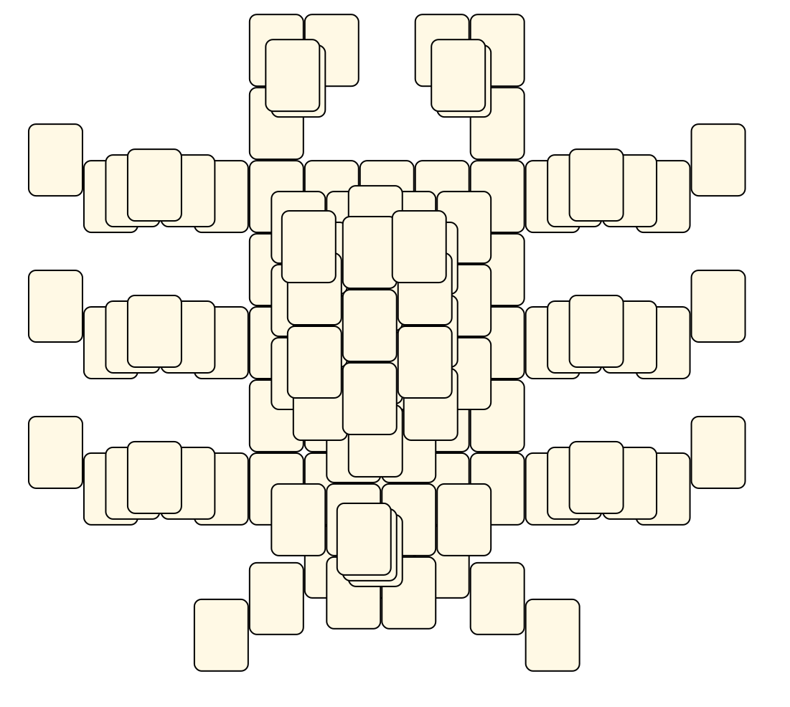<br> <sub>DMask</sub> <br>[.lay](./deathm1/granchio_2.lay)  [.layout](./deathm1/granchio_2.layout)  [.mah](./deathm1/granchio_2.mah) |Pillars<br>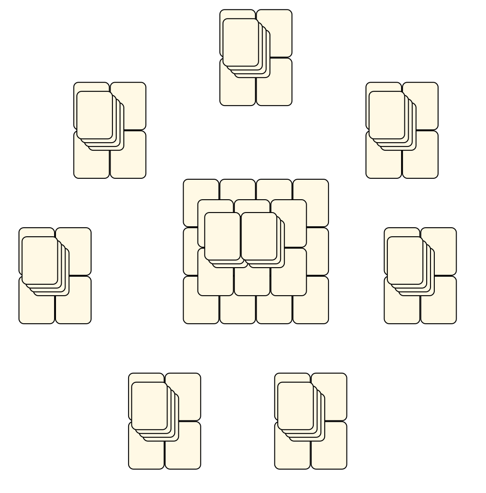<br> <sub>DMask</sub> <br>[.lay](./deathm1/pillars_4.lay)  [.layout](./deathm1/pillars_4.layout)  [.mah](./deathm1/pillars_4.mah) |Poseidon<br>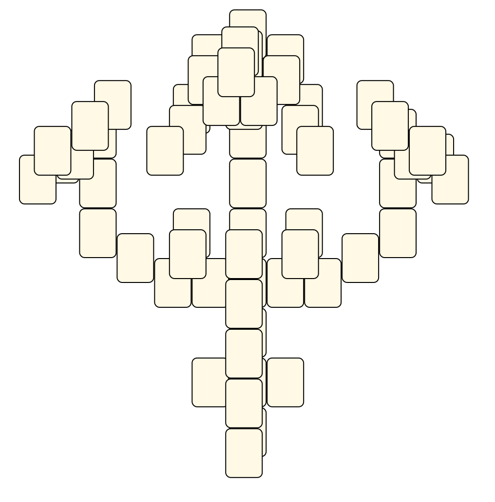<br> <sub>DMask</sub> <br>[.lay](./deathm1/poseidon_2.lay)  [.layout](./deathm1/poseidon_2.layout)  [.mah](./deathm1/poseidon_2.mah) |

## KMahjongg
* Source: 
[https://github.com/KDE/kmahjongg/tree/master/layouts/](https://github.com/KDE/kmahjongg/tree/master/layouts/)

* File Source:  
<sub>```https://github.com/KDE/kmahjongg/tree/master/layouts/```</sub>


|[kmahjongg](kmahjongg/README.md) ||Layouts: 71|
|:--:|:--:|:--:|
|4 Winds<br>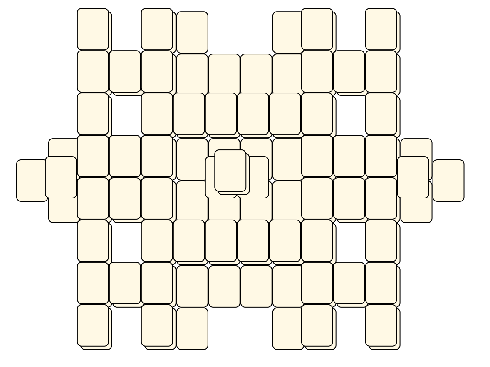<br> <sub>Alexey Charkov</sub> <br>[.lay](./kmahjongg/4_winds.lay)  [.layout](./kmahjongg/4_winds.layout)  [.mah](./kmahjongg/4_winds.mah) |Alien<br>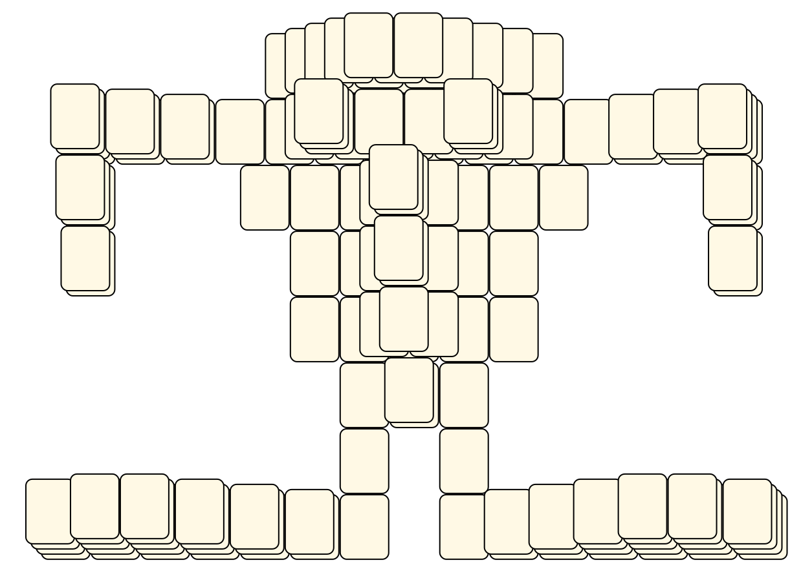<br> <sub>Alexey Charkov</sub> <br>[.lay](./kmahjongg/alien.lay)  [.layout](./kmahjongg/alien.layout)  [.mah](./kmahjongg/alien.mah) |Altar<br><br> <sub>Alexey Charkov</sub> <br>[.lay](./kmahjongg/altar.lay)  [.layout](./kmahjongg/altar.layout)  [.mah](./kmahjongg/altar.mah) |
|Arena<br><br> <sub>Alexey Charkov</sub> <br>[.lay](./kmahjongg/arena.lay)  [.layout](./kmahjongg/arena.layout)  [.mah](./kmahjongg/arena.mah) |Arrow<br>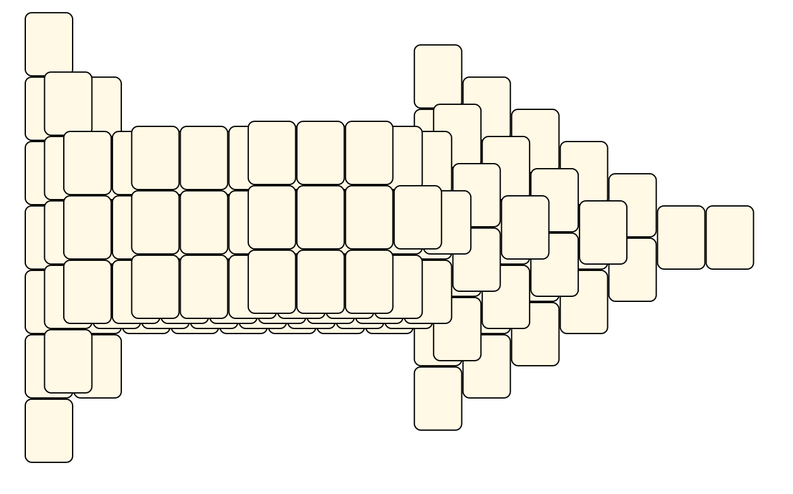<br> <sub>Alexey Charkov</sub> <br>[.lay](./kmahjongg/arrow.lay)  [.layout](./kmahjongg/arrow.layout)  [.mah](./kmahjongg/arrow.mah) |Atlantis<br>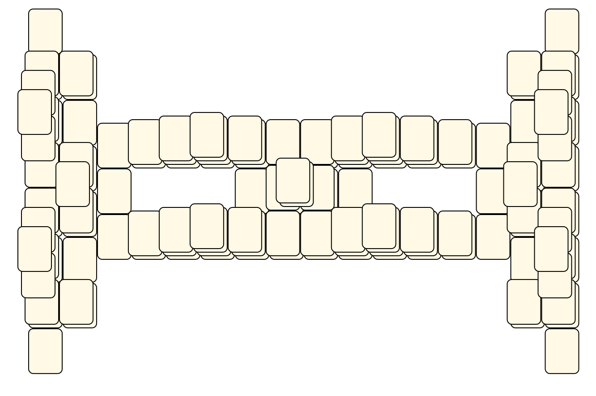<br> <sub>Alexey Charkov</sub> <br>[.lay](./kmahjongg/atlantis.lay)  [.layout](./kmahjongg/atlantis.layout)  [.mah](./kmahjongg/atlantis.mah) |
|Aztec<br>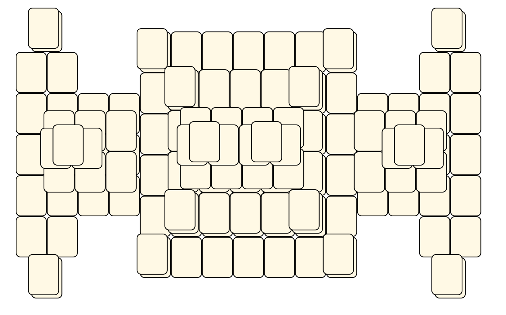<br> <sub>Alexey Charkov</sub> <br>[.lay](./kmahjongg/aztec.lay)  [.layout](./kmahjongg/aztec.layout)  [.mah](./kmahjongg/aztec.mah) |Balance<br>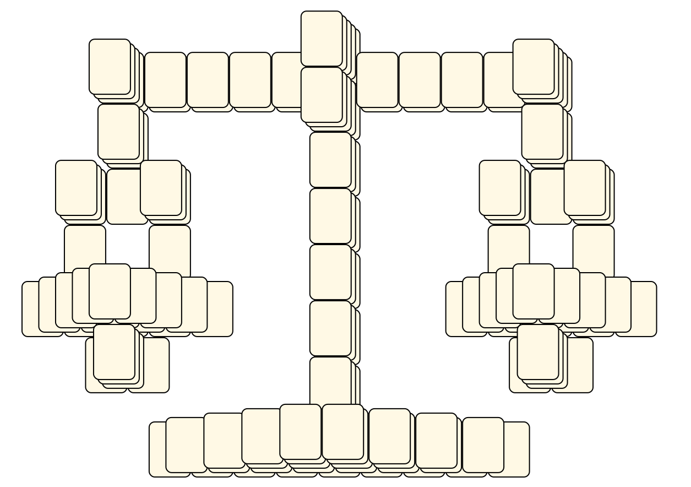<br> <sub>Alexey Charkov</sub> <br>[.lay](./kmahjongg/balance.lay)  [.layout](./kmahjongg/balance.layout)  [.mah](./kmahjongg/balance.mah) |Bat<br>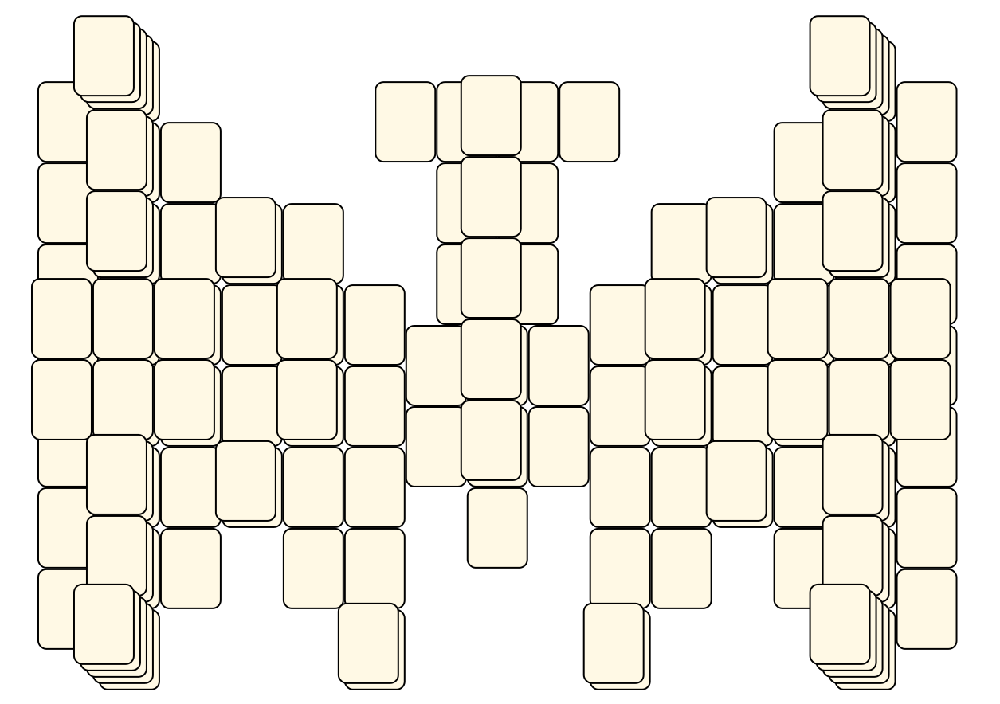<br> <sub>Alexey Charkov</sub> <br>[.lay](./kmahjongg/bat.lay)  [.layout](./kmahjongg/bat.layout)  [.mah](./kmahjongg/bat.mah) |
|Bug<br><br> <sub>Alexey Charkov</sub> <br>[.lay](./kmahjongg/bug.lay)  [.layout](./kmahjongg/bug.layout)  [.mah](./kmahjongg/bug.mah) |Castle<br><br> <sub>Alexey Charkov</sub> <br>[.lay](./kmahjongg/castle.lay)  [.layout](./kmahjongg/castle.layout)  [.mah](./kmahjongg/castle.mah) |Castle2<br>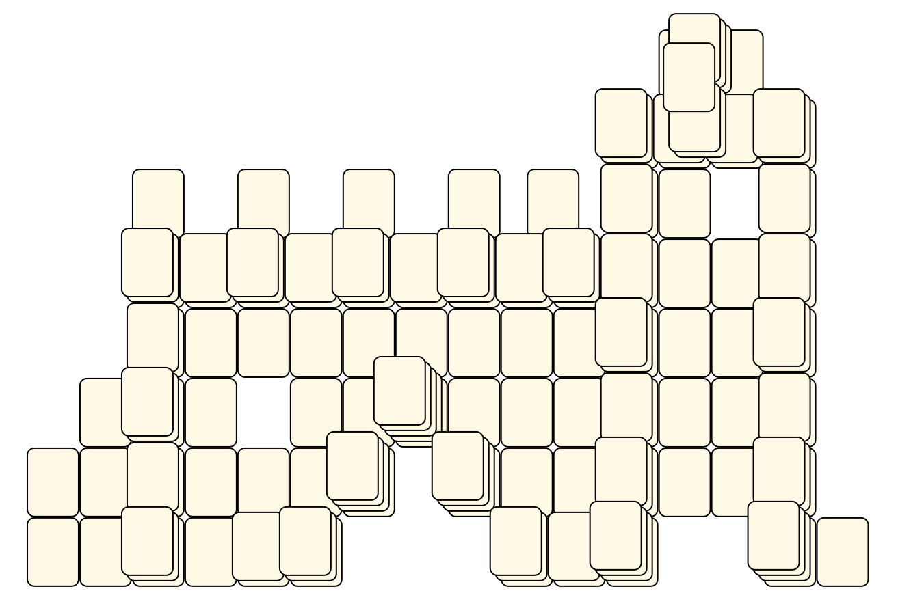<br> <sub>Alexey Charkov</sub> <br>[.lay](./kmahjongg/castle2.lay)  [.layout](./kmahjongg/castle2.layout)  [.mah](./kmahjongg/castle2.mah) |
|Cat<br>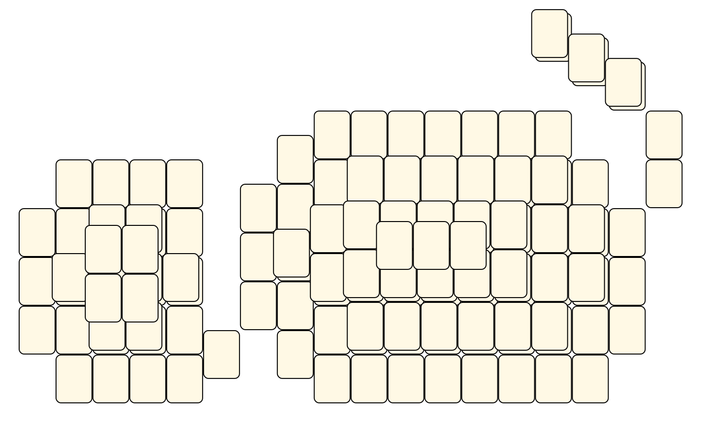<br> <sub>Alexey Charkov</sub> <br>[.lay](./kmahjongg/cat_2.lay)  [.layout](./kmahjongg/cat_2.layout)  [.mah](./kmahjongg/cat_2.mah) |Chains<br>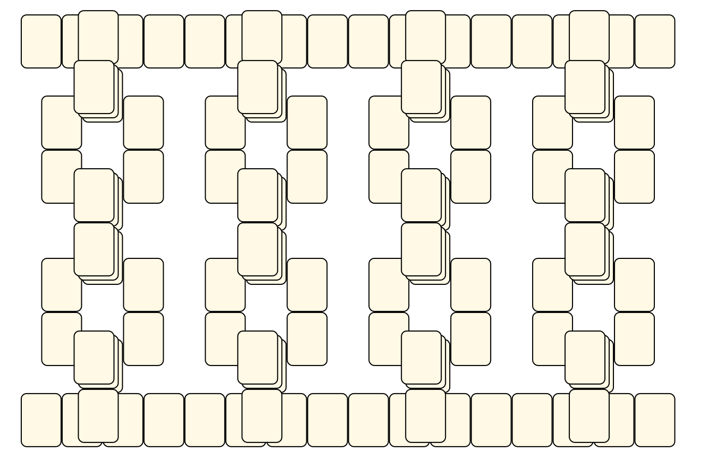<br> <sub>Alexey Charkov</sub> <br>[.lay](./kmahjongg/chains.lay)  [.layout](./kmahjongg/chains.layout)  [.mah](./kmahjongg/chains.mah) |Checkered<br><br> <sub>Alexey Charkov</sub> <br>[.lay](./kmahjongg/checkered.lay)  [.layout](./kmahjongg/checkered.layout)  [.mah](./kmahjongg/checkered.mah) |
|Chip<br>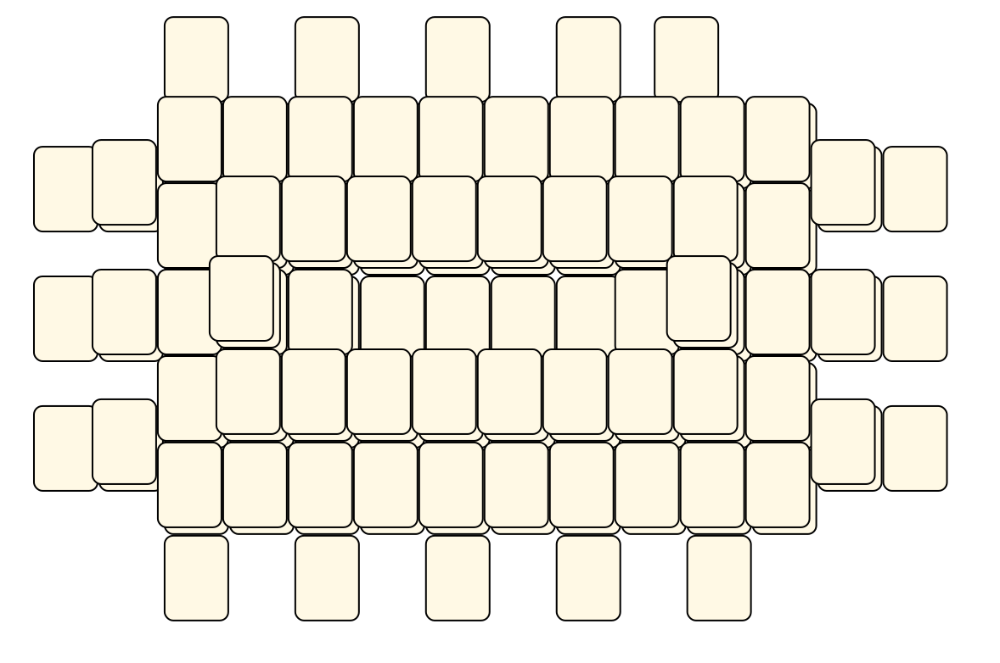<br> <sub>Alexey Charkov</sub> <br>[.lay](./kmahjongg/chip.lay)  [.layout](./kmahjongg/chip.layout)  [.mah](./kmahjongg/chip.mah) |Clubs<br>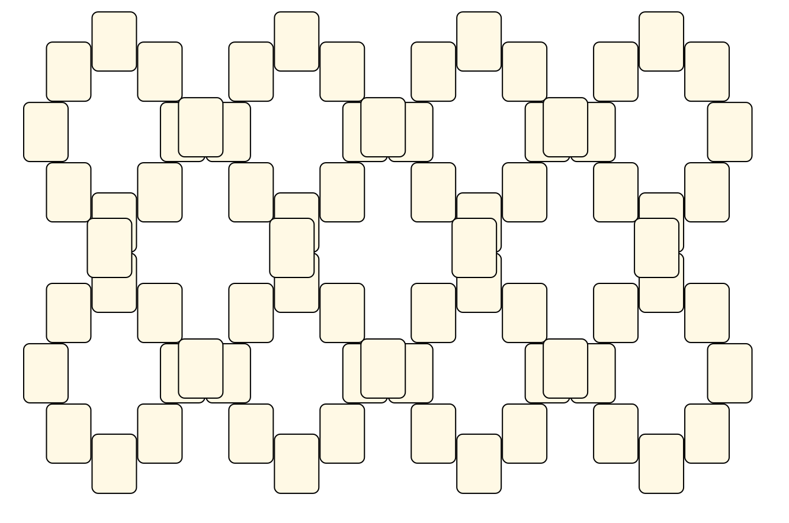<br> <sub>Alexey Charkov</sub> <br>[.lay](./kmahjongg/clubs_2.lay)  [.layout](./kmahjongg/clubs_2.layout)  [.mah](./kmahjongg/clubs_2.mah) |Columns<br>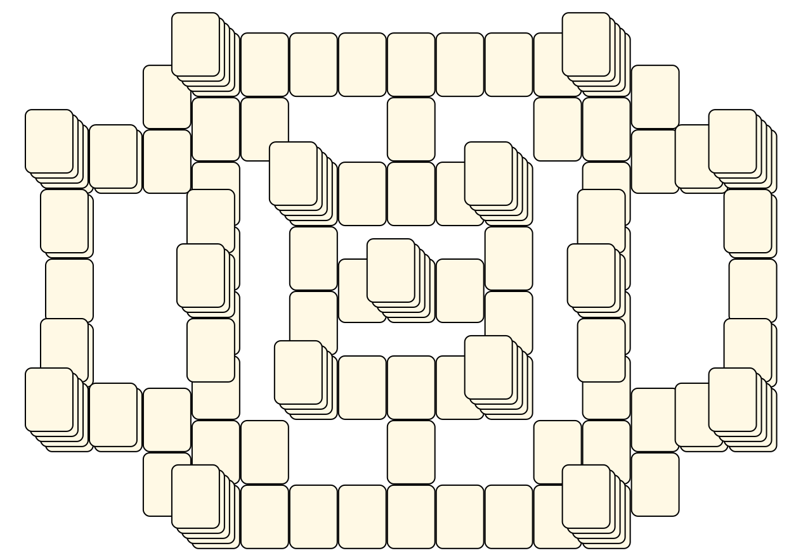<br> <sub>Alexey Charkov</sub> <br>[.lay](./kmahjongg/columns.lay)  [.layout](./kmahjongg/columns.layout)  [.mah](./kmahjongg/columns.mah) |
|Crab<br>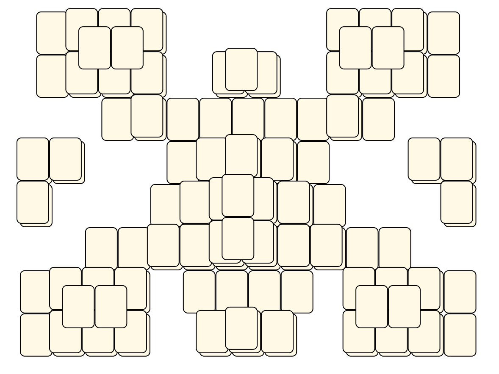<br> <sub>Alexey Charkov</sub> <br>[.lay](./kmahjongg/crab.lay)  [.layout](./kmahjongg/crab.layout)  [.mah](./kmahjongg/crab.mah) |Crab<br>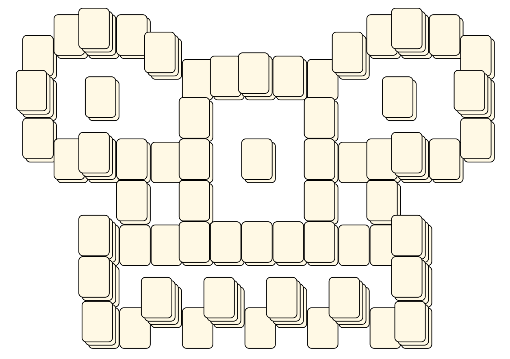<br> <sub>Alexey Charkov</sub> <br>[.lay](./kmahjongg/crab_2.lay)  [.layout](./kmahjongg/crab_2.layout)  [.mah](./kmahjongg/crab_2.mah) |Cross<br><br> <sub>Alexey Charkov</sub> <br>[.lay](./kmahjongg/cross_3.lay)  [.layout](./kmahjongg/cross_3.layout)  [.mah](./kmahjongg/cross_3.mah) |
|Eagle<br>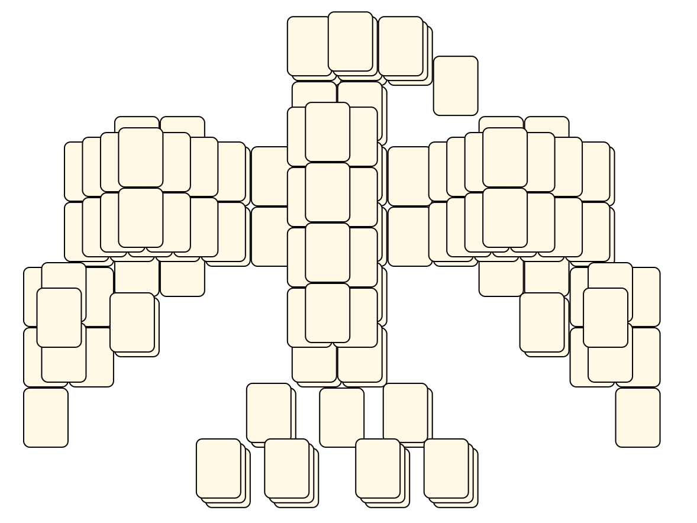<br> <sub>Alexey Charkov</sub> <br>[.lay](./kmahjongg/eagle.lay)  [.layout](./kmahjongg/eagle.layout)  [.mah](./kmahjongg/eagle.mah) |Enterprise<br>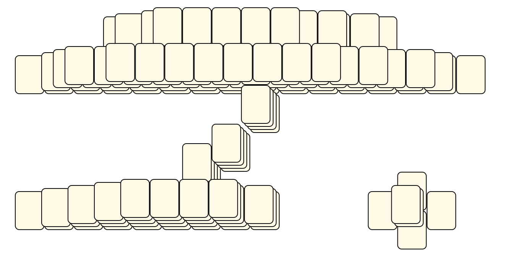<br> <sub>Alexey Charkov</sub> <br>[.lay](./kmahjongg/enterprise.lay)  [.layout](./kmahjongg/enterprise.layout)  [.mah](./kmahjongg/enterprise.mah) |Explosion<br>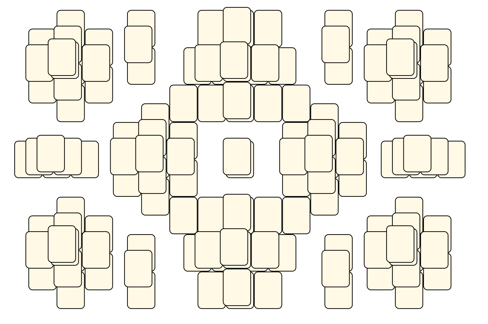<br> <sub>Alexey Charkov</sub> <br>[.lay](./kmahjongg/explosion.lay)  [.layout](./kmahjongg/explosion.layout)  [.mah](./kmahjongg/explosion.mah) |
|Flowers<br><br> <sub>Alexey Charkov</sub> <br>[.lay](./kmahjongg/flowers.lay)  [.layout](./kmahjongg/flowers.layout)  [.mah](./kmahjongg/flowers.mah) |Future<br><br> <sub>Alexey Charkov</sub> <br>[.lay](./kmahjongg/future.lay)  [.layout](./kmahjongg/future.layout)  [.mah](./kmahjongg/future.mah) |Galaxy<br><br> <sub>Alexey Charkov</sub> <br>[.lay](./kmahjongg/galaxy.lay)  [.layout](./kmahjongg/galaxy.layout)  [.mah](./kmahjongg/galaxy.mah) |
|Garden<br>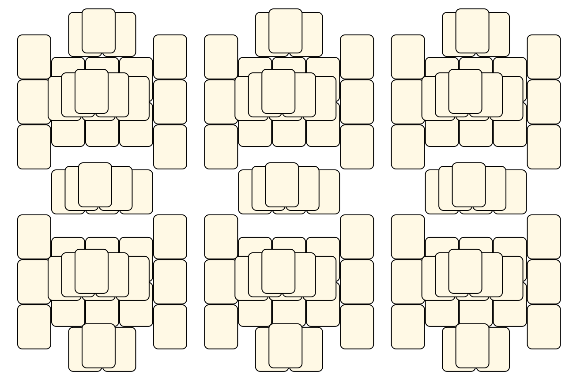<br> <sub>Alexey Charkov</sub> <br>[.lay](./kmahjongg/garden.lay)  [.layout](./kmahjongg/garden.layout)  [.mah](./kmahjongg/garden.mah) |Girl<br>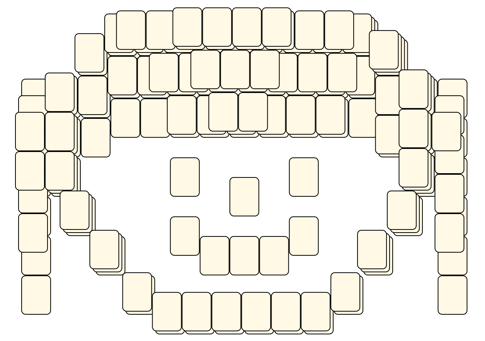<br> <sub>Alexey Charkov</sub> <br>[.lay](./kmahjongg/girl.lay)  [.layout](./kmahjongg/girl.layout)  [.mah](./kmahjongg/girl.mah) |Glade<br>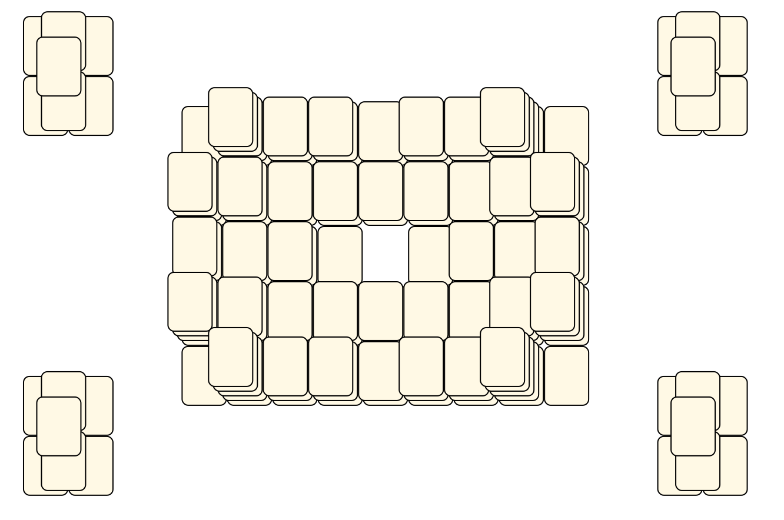<br> <sub>Alexey Charkov</sub> <br>[.lay](./kmahjongg/glade.lay)  [.layout](./kmahjongg/glade.layout)  [.mah](./kmahjongg/glade.mah) |
|Grid<br><br> <sub>Alexey Charkov</sub> <br>[.lay](./kmahjongg/grid.lay)  [.layout](./kmahjongg/grid.layout)  [.mah](./kmahjongg/grid.mah) |Helios<br><br> <sub>Alexey Charkov</sub> <br>[.lay](./kmahjongg/helios.lay)  [.layout](./kmahjongg/helios.layout)  [.mah](./kmahjongg/helios.mah) |Hole<br>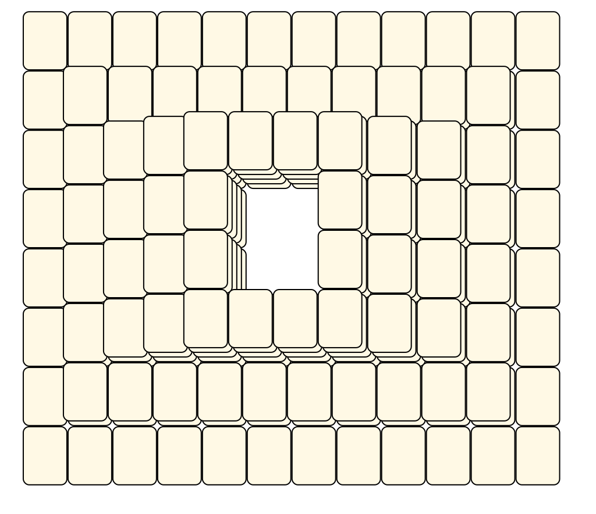<br> <sub>Alexey Charkov</sub> <br>[.lay](./kmahjongg/hole.lay)  [.layout](./kmahjongg/hole.layout)  [.mah](./kmahjongg/hole.mah) |
|Inner Circle<br><br> <sub>Alexey Charkov</sub> <br>[.lay](./kmahjongg/inner_circle.lay)  [.layout](./kmahjongg/inner_circle.layout)  [.mah](./kmahjongg/inner_circle.mah) |Key<br>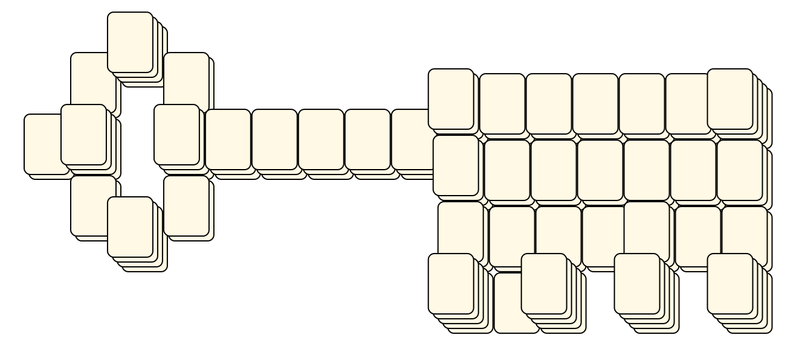<br> <sub>Alexey Charkov</sub> <br>[.lay](./kmahjongg/key.lay)  [.layout](./kmahjongg/key.layout)  [.mah](./kmahjongg/key.mah) |Km<br>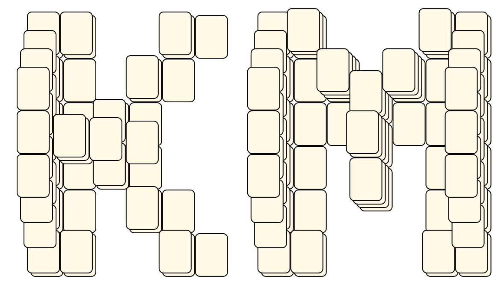<br> <sub>Alexey Charkov</sub> <br>[.lay](./kmahjongg/km.lay)  [.layout](./kmahjongg/km.layout)  [.mah](./kmahjongg/km.mah) |
|Labyrinth<br><br> <sub>Alexey Charkov</sub> <br>[.lay](./kmahjongg/labyrinth.lay)  [.layout](./kmahjongg/labyrinth.layout)  [.mah](./kmahjongg/labyrinth.mah) |Mask<br><br> <sub>Alexey Charkov</sub> <br>[.lay](./kmahjongg/mask.lay)  [.layout](./kmahjongg/mask.layout)  [.mah](./kmahjongg/mask.mah) |Maya<br>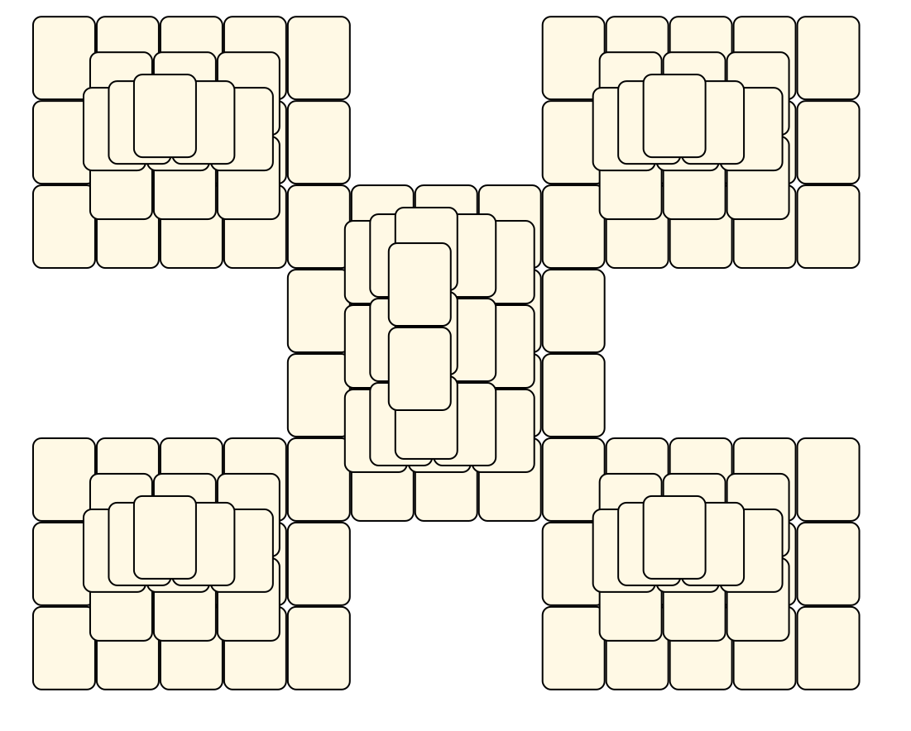<br> <sub>Alexey Charkov</sub> <br>[.lay](./kmahjongg/maya.lay)  [.layout](./kmahjongg/maya.layout)  [.mah](./kmahjongg/maya.mah) |
|Maze<br>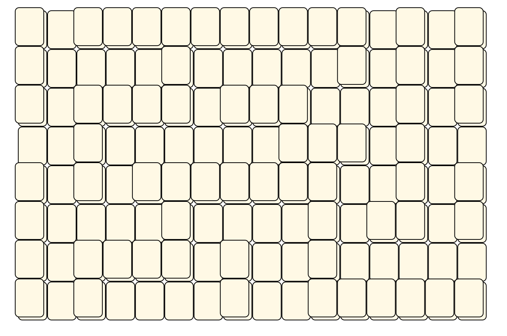<br> <sub>Alexey Charkov</sub> <br>[.lay](./kmahjongg/maze.lay)  [.layout](./kmahjongg/maze.layout)  [.mah](./kmahjongg/maze.mah) |Mesh<br><br> <sub>Alexey Charkov</sub> <br>[.lay](./kmahjongg/mesh.lay)  [.layout](./kmahjongg/mesh.layout)  [.mah](./kmahjongg/mesh.mah) |Moth<br>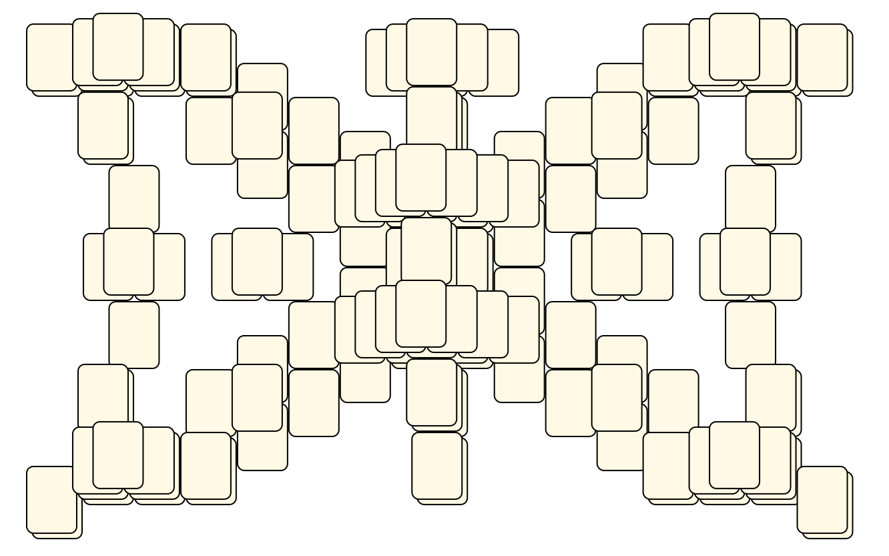<br> <sub>Alexey Charkov</sub> <br>[.lay](./kmahjongg/moth.lay)  [.layout](./kmahjongg/moth.layout)  [.mah](./kmahjongg/moth.mah) |
|Order<br>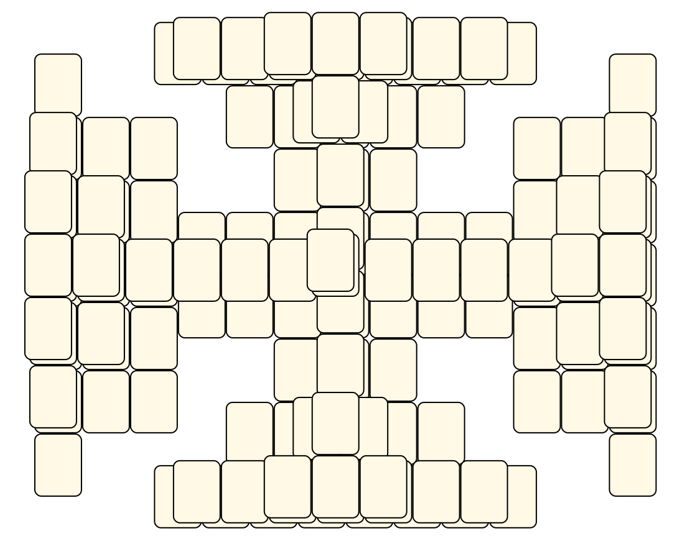<br> <sub>Alexey Charkov</sub> <br>[.lay](./kmahjongg/order.lay)  [.layout](./kmahjongg/order.layout)  [.mah](./kmahjongg/order.mah) |Pattern<br>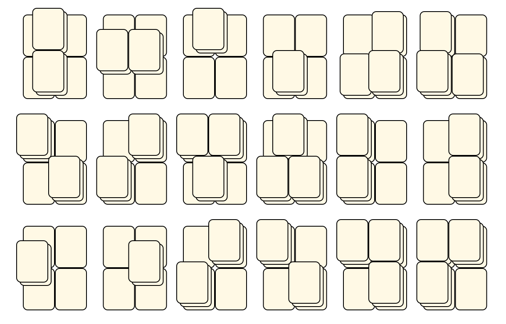<br> <sub>Alexey Charkov</sub> <br>[.lay](./kmahjongg/pattern.lay)  [.layout](./kmahjongg/pattern.layout)  [.mah](./kmahjongg/pattern.mah) |Penta<br><br> <sub>Alexey Charkov</sub> <br>[.lay](./kmahjongg/penta.lay)  [.layout](./kmahjongg/penta.layout)  [.mah](./kmahjongg/penta.mah) |
|Pillars<br>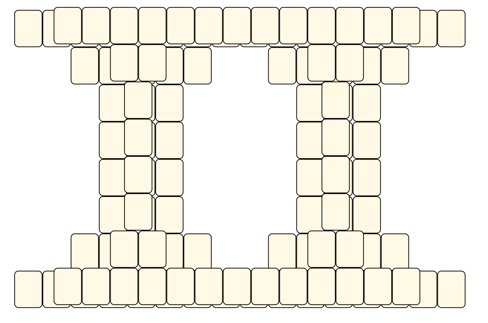<br> <sub>Alexey Charkov</sub> <br>[.lay](./kmahjongg/pillars.lay)  [.layout](./kmahjongg/pillars.layout)  [.mah](./kmahjongg/pillars.mah) |Pirates<br>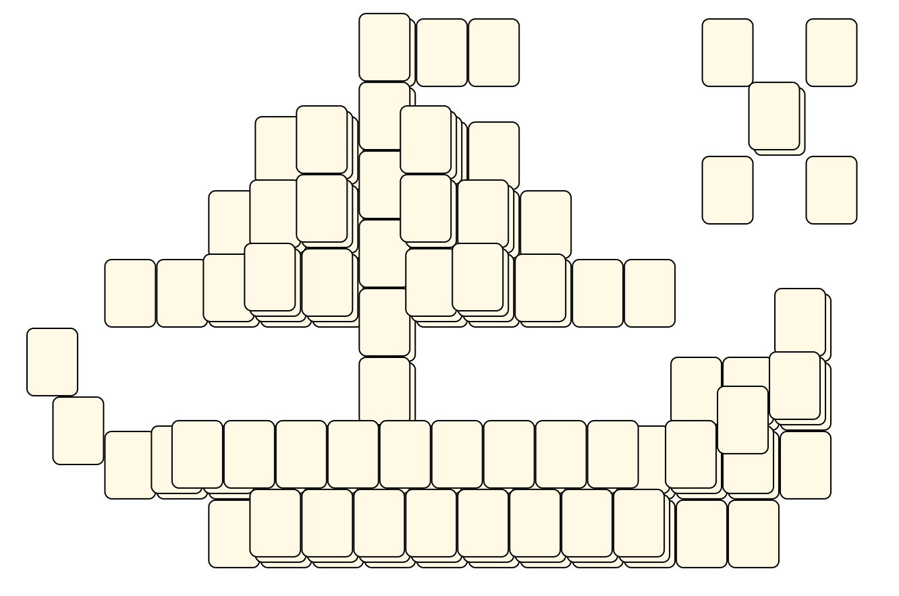<br> <sub>Alexey Charkov</sub> <br>[.lay](./kmahjongg/pirates.lay)  [.layout](./kmahjongg/pirates.layout)  [.mah](./kmahjongg/pirates.mah) |Pyramid<br>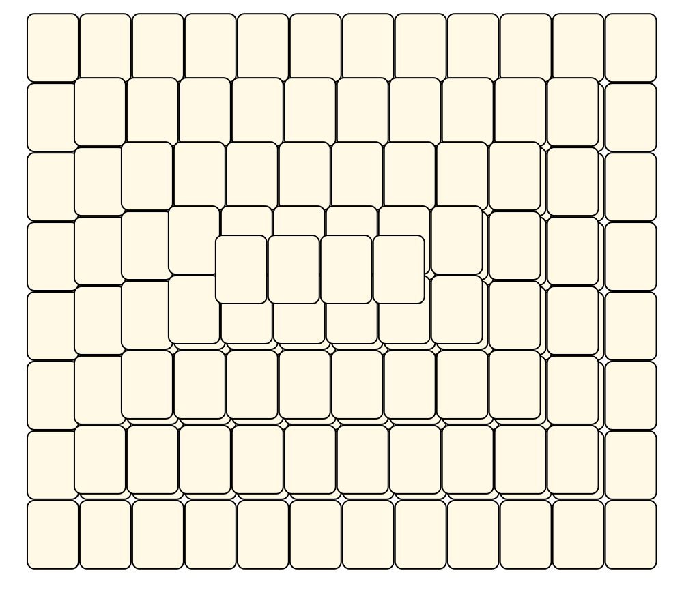<br> <sub>Alexey Charkov</sub> <br>[.lay](./kmahjongg/pyramid.lay)  [.layout](./kmahjongg/pyramid.layout)  [.mah](./kmahjongg/pyramid.mah) |
|Rocket<br><br> <sub>Alexey Charkov</sub> <br>[.lay](./kmahjongg/rocket.lay)  [.layout](./kmahjongg/rocket.layout)  [.mah](./kmahjongg/rocket.mah) |Shield<br>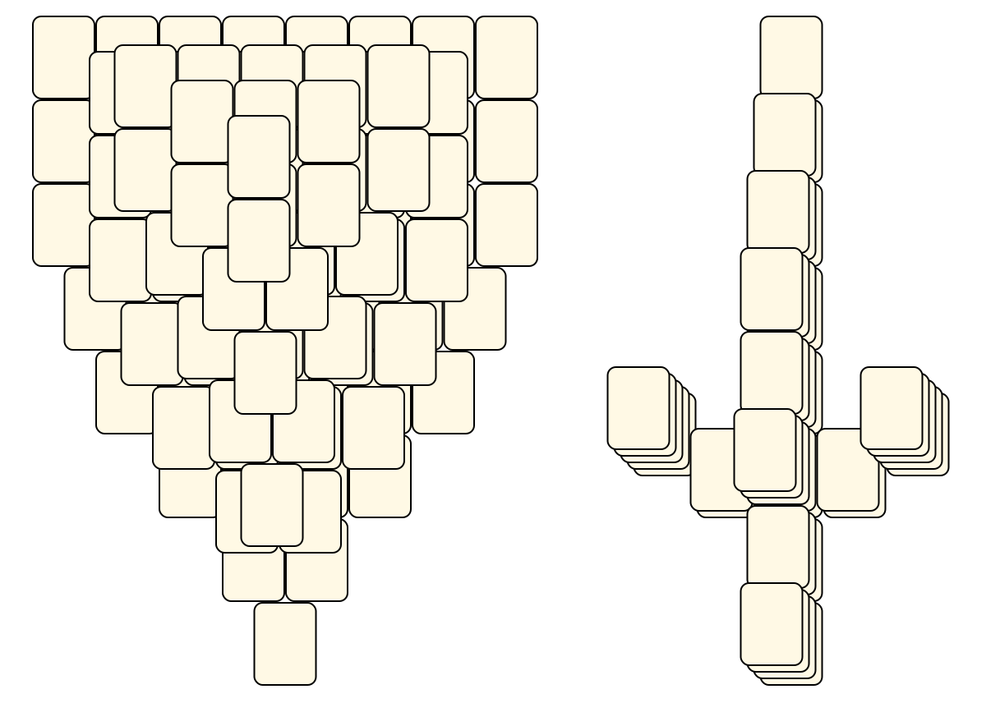<br> <sub>Alexey Charkov</sub> <br>[.lay](./kmahjongg/shield.lay)  [.layout](./kmahjongg/shield.layout)  [.mah](./kmahjongg/shield.mah) |Spider<br>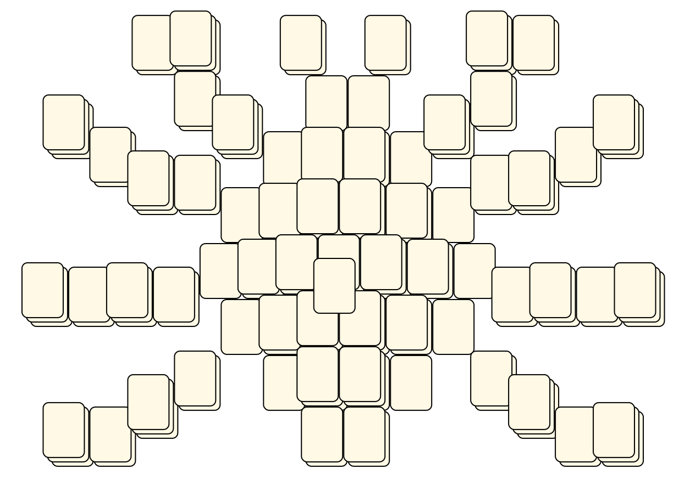<br> <sub>Alexey Charkov</sub> <br>[.lay](./kmahjongg/spider.lay)  [.layout](./kmahjongg/spider.layout)  [.mah](./kmahjongg/spider.mah) |
|Squares<br>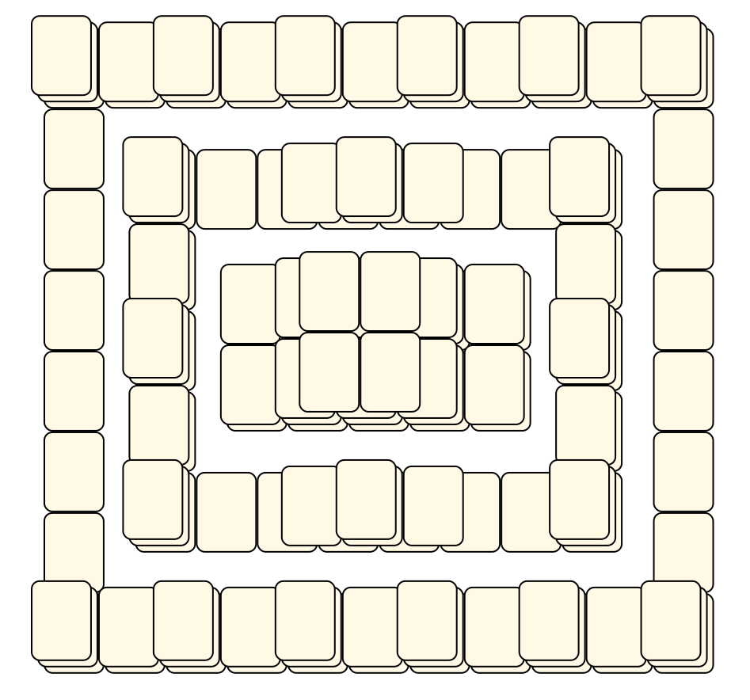<br> <sub>Alexey Charkov</sub> <br>[.lay](./kmahjongg/squares.lay)  [.layout](./kmahjongg/squares.layout)  [.mah](./kmahjongg/squares.mah) |Squaring<br>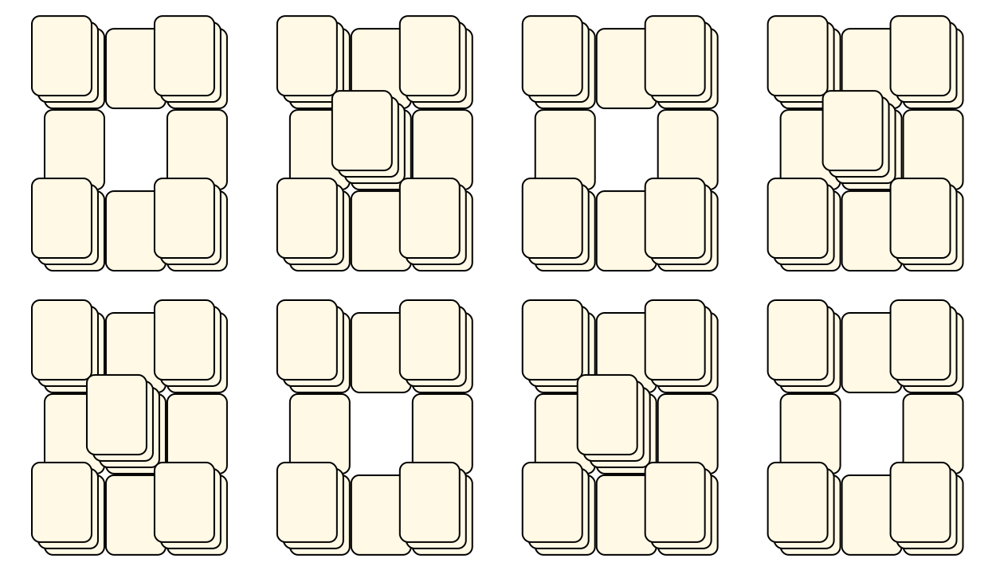<br> <sub>Alexey Charkov</sub> <br>[.lay](./kmahjongg/squaring.lay)  [.layout](./kmahjongg/squaring.layout)  [.mah](./kmahjongg/squaring.mah) |Stadion<br>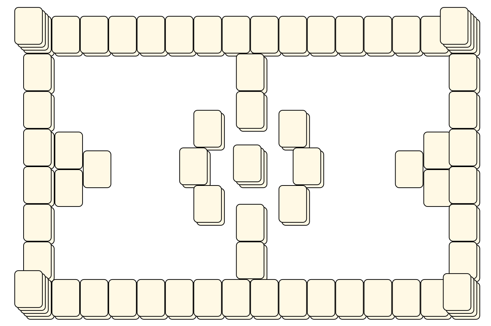<br> <sub>Alexey Charkov</sub> <br>[.lay](./kmahjongg/stadion.lay)  [.layout](./kmahjongg/stadion.layout)  [.mah](./kmahjongg/stadion.mah) |
|Stairs<br>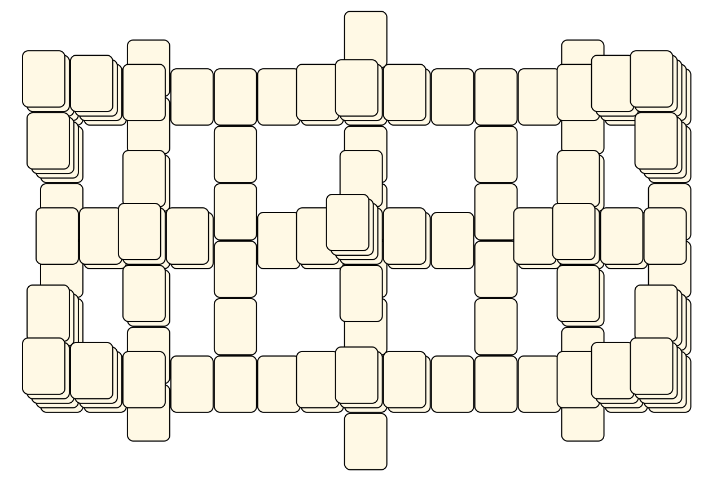<br> <sub>Alexey Charkov</sub> <br>[.lay](./kmahjongg/stairs_2.lay)  [.layout](./kmahjongg/stairs_2.layout)  [.mah](./kmahjongg/stairs_2.mah) |Star<br>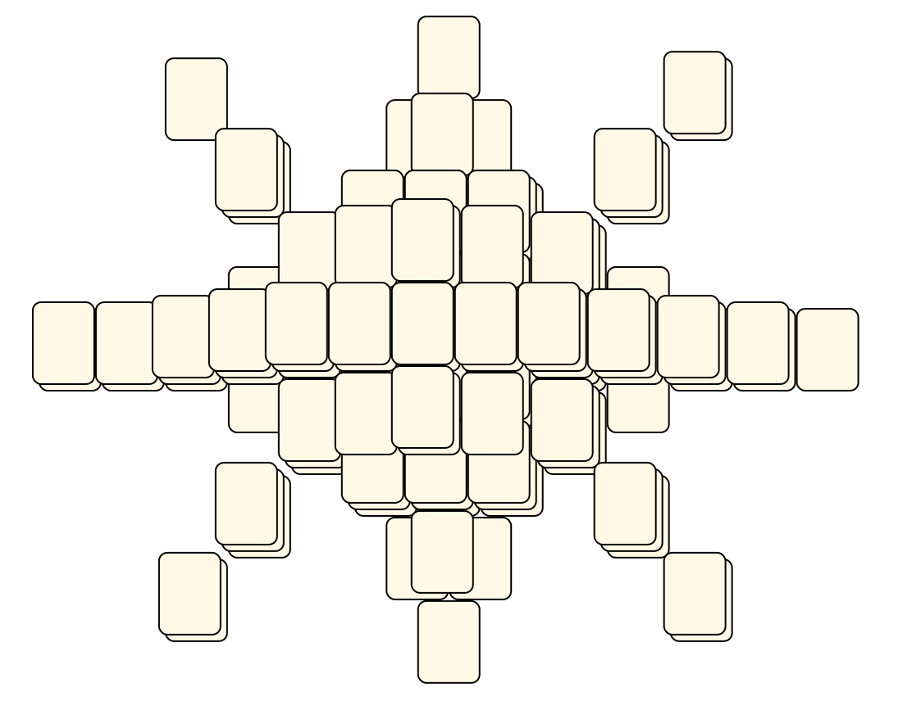<br> <sub>Alexey Charkov</sub> <br>[.lay](./kmahjongg/star.lay)  [.layout](./kmahjongg/star.layout)  [.mah](./kmahjongg/star.mah) |Star Ship<br>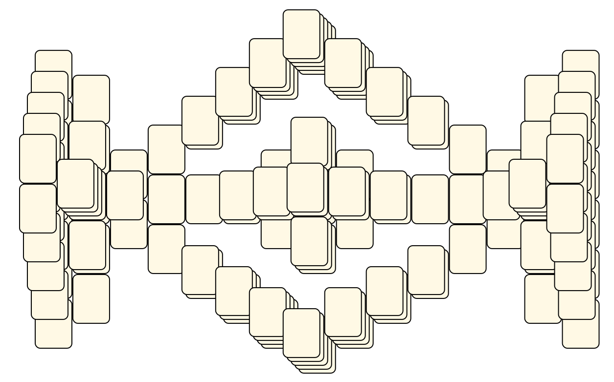<br> <sub>Alexey Charkov</sub> <br>[.lay](./kmahjongg/star_ship.lay)  [.layout](./kmahjongg/star_ship.layout)  [.mah](./kmahjongg/star_ship.mah) |
|Stax<br>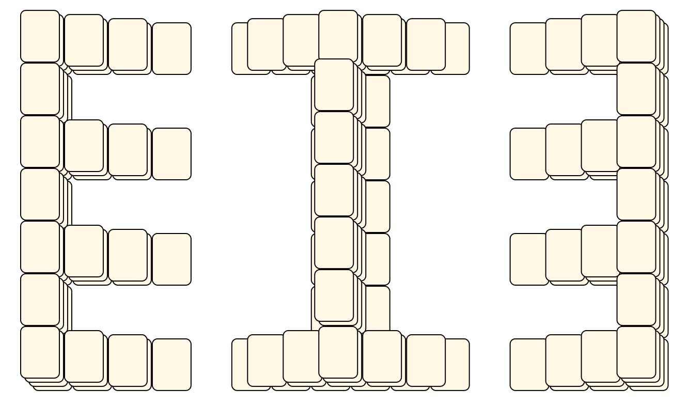<br> <sub>Alexey Charkov</sub> <br>[.lay](./kmahjongg/stax.lay)  [.layout](./kmahjongg/stax.layout)  [.mah](./kmahjongg/stax.mah) |Swirl<br><br> <sub>Alexey Charkov</sub> <br>[.lay](./kmahjongg/swirl.lay)  [.layout](./kmahjongg/swirl.layout)  [.mah](./kmahjongg/swirl.mah) |Temple<br>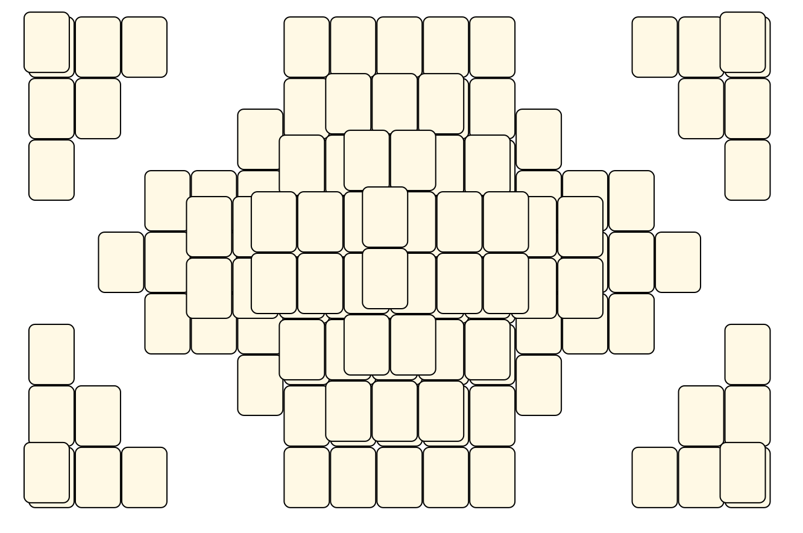<br> <sub>Alexey Charkov</sub> <br>[.lay](./kmahjongg/temple.lay)  [.layout](./kmahjongg/temple.layout)  [.mah](./kmahjongg/temple.mah) |
|The Door<br>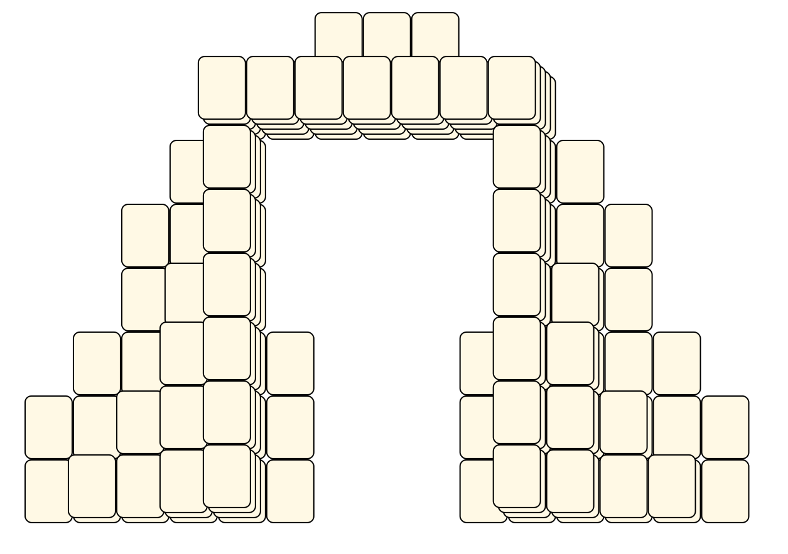<br> <sub>Alexey Charkov</sub> <br>[.lay](./kmahjongg/the_door.lay)  [.layout](./kmahjongg/the_door.layout)  [.mah](./kmahjongg/the_door.mah) |Theatre<br>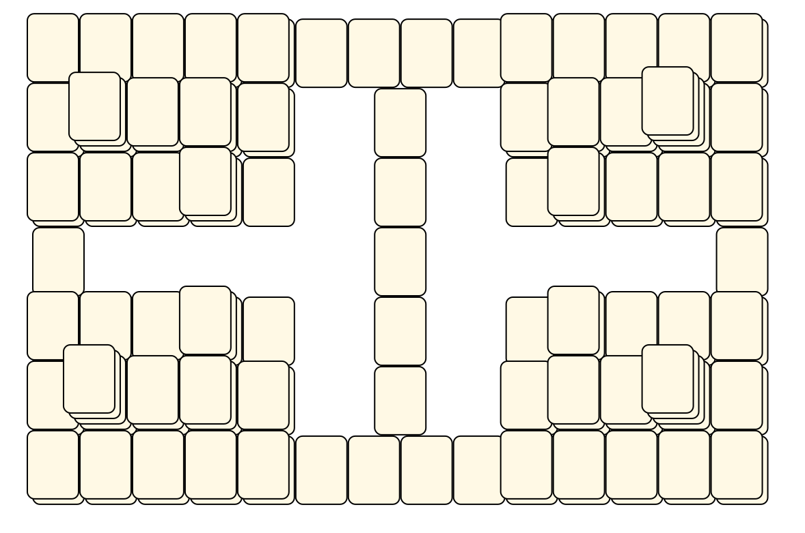<br> <sub>Alexey Charkov</sub> <br>[.lay](./kmahjongg/theatre.lay)  [.layout](./kmahjongg/theatre.layout)  [.mah](./kmahjongg/theatre.mah) |Time Tunnel<br>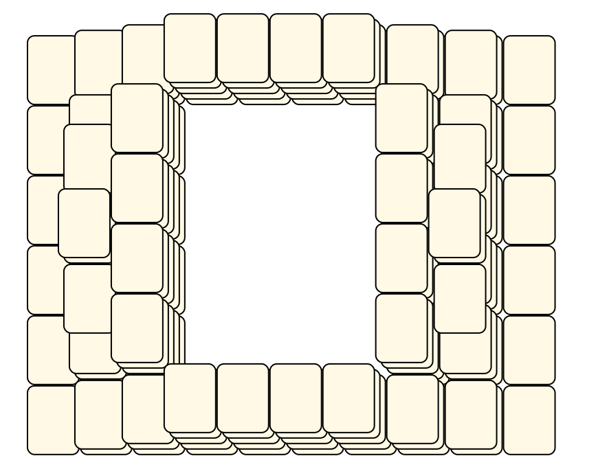<br> <sub>Alexey Charkov</sub> <br>[.lay](./kmahjongg/time_tunnel.lay)  [.layout](./kmahjongg/time_tunnel.layout)  [.mah](./kmahjongg/time_tunnel.mah) |
|Tomb<br>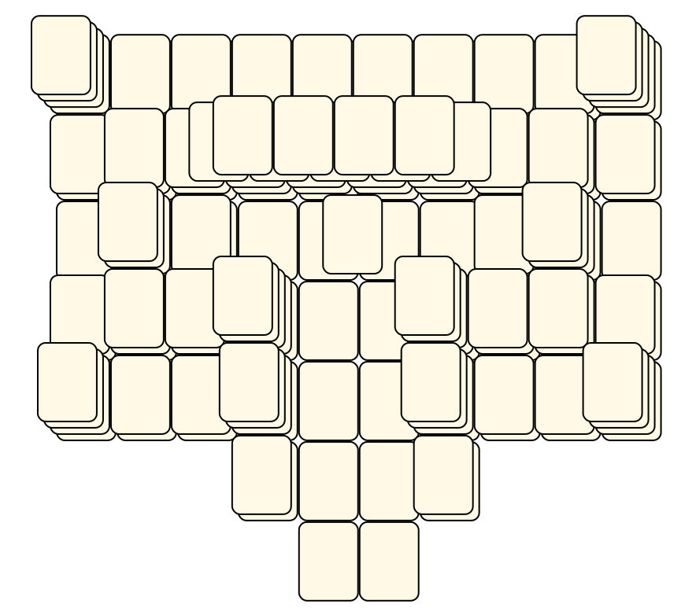<br> <sub>Alexey Charkov</sub> <br>[.lay](./kmahjongg/tomb.lay)  [.layout](./kmahjongg/tomb.layout)  [.mah](./kmahjongg/tomb.mah) |Totem<br>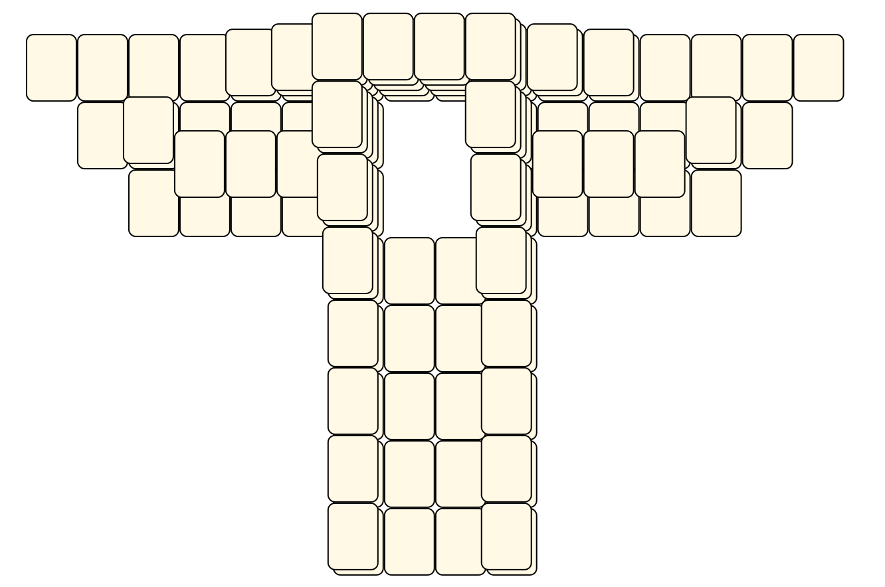<br> <sub>Alexey Charkov</sub> <br>[.lay](./kmahjongg/totem.lay)  [.layout](./kmahjongg/totem.layout)  [.mah](./kmahjongg/totem.mah) |Tower<br><br> <sub>Alexey Charkov</sub> <br>[.lay](./kmahjongg/tower.lay)  [.layout](./kmahjongg/tower.layout)  [.mah](./kmahjongg/tower.mah) |
|Triangle<br><br> <sub>Alexey Charkov</sub> <br>[.lay](./kmahjongg/triangle.lay)  [.layout](./kmahjongg/triangle.layout)  [.mah](./kmahjongg/triangle.mah) |Up&down<br><br> <sub>Alexey Charkov</sub> <br>[.lay](./kmahjongg/up&down.lay)  [.layout](./kmahjongg/up&down.layout)  [.mah](./kmahjongg/up&down.mah) |Vi<br><br> <sub>Alexey Charkov</sub> <br>[.lay](./kmahjongg/vi.lay)  [.layout](./kmahjongg/vi.layout)  [.mah](./kmahjongg/vi.mah) |
|Well<br><br> <sub>Alexey Charkov</sub> <br>[.lay](./kmahjongg/well.lay)  [.layout](./kmahjongg/well.layout)  [.mah](./kmahjongg/well.mah) |X Shaped<br><br> <sub>Alexey Charkov</sub> <br>[.lay](./kmahjongg/x_shaped.lay)  [.layout](./kmahjongg/x_shaped.layout)  [.mah](./kmahjongg/x_shaped.mah) ||

## Alphabet
* Source: 
[https://web.archive.org/web/20230204113220/http://tsubassa-kurenai.de/Kyodai/Layouts/](https://web.archive.org/web/20230204113220/http://tsubassa-kurenai.de/Kyodai/Layouts/)

* File Source:  
<sub>```https://web.archive.org/web/20230204113220/http://tsubassa-kurenai.de/Kyodai/Layouts/Alphabet.zip```</sub>


|[kuranei_alphabet](kurenai/kuranei_alphabet/README.md) ||Layouts: 26|
|:--:|:--:|:--:|
|Letter A<br><br> <sub>Tsubassa Kurenai</sub> <br>[.lay](./kurenai/kuranei_alphabet/letter_a.lay)  [.layout](./kurenai/kuranei_alphabet/letter_a.layout)  [.mah](./kurenai/kuranei_alphabet/letter_a.mah) |Letter B<br><br> <sub>Tsubassa Kurenai</sub> <br>[.lay](./kurenai/kuranei_alphabet/letter_b.lay)  [.layout](./kurenai/kuranei_alphabet/letter_b.layout)  [.mah](./kurenai/kuranei_alphabet/letter_b.mah) |Letter C<br><br> <sub>Tsubassa Kurenai</sub> <br>[.lay](./kurenai/kuranei_alphabet/letter_c.lay)  [.layout](./kurenai/kuranei_alphabet/letter_c.layout)  [.mah](./kurenai/kuranei_alphabet/letter_c.mah) |
|Letter D<br><br> <sub>Tsubassa Kurenai</sub> <br>[.lay](./kurenai/kuranei_alphabet/letter_d.lay)  [.layout](./kurenai/kuranei_alphabet/letter_d.layout)  [.mah](./kurenai/kuranei_alphabet/letter_d.mah) |Letter E<br><br> <sub>Tsubassa Kurenai</sub> <br>[.lay](./kurenai/kuranei_alphabet/letter_e.lay)  [.layout](./kurenai/kuranei_alphabet/letter_e.layout)  [.mah](./kurenai/kuranei_alphabet/letter_e.mah) |Letter F<br><br> <sub>Tsubassa Kurenai</sub> <br>[.lay](./kurenai/kuranei_alphabet/letter_f.lay)  [.layout](./kurenai/kuranei_alphabet/letter_f.layout)  [.mah](./kurenai/kuranei_alphabet/letter_f.mah) |
|Letter G<br><br> <sub>Tsubassa Kurenai</sub> <br>[.lay](./kurenai/kuranei_alphabet/letter_g.lay)  [.layout](./kurenai/kuranei_alphabet/letter_g.layout)  [.mah](./kurenai/kuranei_alphabet/letter_g.mah) |Letter H<br><br> <sub>Tsubassa Kurenai</sub> <br>[.lay](./kurenai/kuranei_alphabet/letter_h.lay)  [.layout](./kurenai/kuranei_alphabet/letter_h.layout)  [.mah](./kurenai/kuranei_alphabet/letter_h.mah) |Letter I<br><br> <sub>Tsubassa Kurenai</sub> <br>[.lay](./kurenai/kuranei_alphabet/letter_i.lay)  [.layout](./kurenai/kuranei_alphabet/letter_i.layout)  [.mah](./kurenai/kuranei_alphabet/letter_i.mah) |
|Letter J<br><br> <sub>Tsubassa Kurenai</sub> <br>[.lay](./kurenai/kuranei_alphabet/letter_j.lay)  [.layout](./kurenai/kuranei_alphabet/letter_j.layout)  [.mah](./kurenai/kuranei_alphabet/letter_j.mah) |Letter K<br><br> <sub>Tsubassa Kurenai</sub> <br>[.lay](./kurenai/kuranei_alphabet/letter_k.lay)  [.layout](./kurenai/kuranei_alphabet/letter_k.layout)  [.mah](./kurenai/kuranei_alphabet/letter_k.mah) |Letter L<br><br> <sub>Tsubassa Kurenai</sub> <br>[.lay](./kurenai/kuranei_alphabet/letter_l.lay)  [.layout](./kurenai/kuranei_alphabet/letter_l.layout)  [.mah](./kurenai/kuranei_alphabet/letter_l.mah) |
|Letter M<br><br> <sub>Tsubassa Kurenai</sub> <br>[.lay](./kurenai/kuranei_alphabet/letter_m.lay)  [.layout](./kurenai/kuranei_alphabet/letter_m.layout)  [.mah](./kurenai/kuranei_alphabet/letter_m.mah) |Letter N<br><br> <sub>Tsubassa Kurenai</sub> <br>[.lay](./kurenai/kuranei_alphabet/letter_n.lay)  [.layout](./kurenai/kuranei_alphabet/letter_n.layout)  [.mah](./kurenai/kuranei_alphabet/letter_n.mah) |Letter O<br><br> <sub>Tsubassa Kurenai</sub> <br>[.lay](./kurenai/kuranei_alphabet/letter_o.lay)  [.layout](./kurenai/kuranei_alphabet/letter_o.layout)  [.mah](./kurenai/kuranei_alphabet/letter_o.mah) |
|Letter P<br><br> <sub>Tsubassa Kurenai</sub> <br>[.lay](./kurenai/kuranei_alphabet/letter_p.lay)  [.layout](./kurenai/kuranei_alphabet/letter_p.layout)  [.mah](./kurenai/kuranei_alphabet/letter_p.mah) |Letter Q<br><br> <sub>Tsubassa Kurenai</sub> <br>[.lay](./kurenai/kuranei_alphabet/letter_q.lay)  [.layout](./kurenai/kuranei_alphabet/letter_q.layout)  [.mah](./kurenai/kuranei_alphabet/letter_q.mah) |Letter R<br><br> <sub>Tsubassa Kurenai</sub> <br>[.lay](./kurenai/kuranei_alphabet/letter_r.lay)  [.layout](./kurenai/kuranei_alphabet/letter_r.layout)  [.mah](./kurenai/kuranei_alphabet/letter_r.mah) |
|Letter S<br><br> <sub>Tsubassa Kurenai</sub> <br>[.lay](./kurenai/kuranei_alphabet/letter_s.lay)  [.layout](./kurenai/kuranei_alphabet/letter_s.layout)  [.mah](./kurenai/kuranei_alphabet/letter_s.mah) |Letter T<br><br> <sub>Tsubassa Kurenai</sub> <br>[.lay](./kurenai/kuranei_alphabet/letter_t.lay)  [.layout](./kurenai/kuranei_alphabet/letter_t.layout)  [.mah](./kurenai/kuranei_alphabet/letter_t.mah) |Letter U<br><br> <sub>Tsubassa Kurenai</sub> <br>[.lay](./kurenai/kuranei_alphabet/letter_u.lay)  [.layout](./kurenai/kuranei_alphabet/letter_u.layout)  [.mah](./kurenai/kuranei_alphabet/letter_u.mah) |
|Letter V<br><br> <sub>Tsubassa Kurenai</sub> <br>[.lay](./kurenai/kuranei_alphabet/letter_v.lay)  [.layout](./kurenai/kuranei_alphabet/letter_v.layout)  [.mah](./kurenai/kuranei_alphabet/letter_v.mah) |Letter W<br><br> <sub>Tsubassa Kurenai</sub> <br>[.lay](./kurenai/kuranei_alphabet/letter_w.lay)  [.layout](./kurenai/kuranei_alphabet/letter_w.layout)  [.mah](./kurenai/kuranei_alphabet/letter_w.mah) |Letter X<br><br> <sub>Tsubassa Kurenai</sub> <br>[.lay](./kurenai/kuranei_alphabet/letter_x.lay)  [.layout](./kurenai/kuranei_alphabet/letter_x.layout)  [.mah](./kurenai/kuranei_alphabet/letter_x.mah) |
|Letter Y<br><br> <sub>Tsubassa Kurenai</sub> <br>[.lay](./kurenai/kuranei_alphabet/letter_y.lay)  [.layout](./kurenai/kuranei_alphabet/letter_y.layout)  [.mah](./kurenai/kuranei_alphabet/letter_y.mah) |Letter Z<br><br> <sub>Tsubassa Kurenai</sub> <br>[.lay](./kurenai/kuranei_alphabet/letter_z.lay)  [.layout](./kurenai/kuranei_alphabet/letter_z.layout)  [.mah](./kurenai/kuranei_alphabet/letter_z.mah) ||

## Floater
* Source: 
[https://web.archive.org/web/20230204113220/http://tsubassa-kurenai.de/Kyodai/Layouts/](https://web.archive.org/web/20230204113220/http://tsubassa-kurenai.de/Kyodai/Layouts/)

* File Source:  
<sub>```https://web.archive.org/web/20230204113220/http://tsubassa-kurenai.de/Kyodai/Layouts/```</sub>


|[kurenai_floater](kurenai/kurenai_floater/README.md) ||Layouts: 7|
|:--:|:--:|:--:|
|Floating City<br><br> <sub>Will O'Connell</sub> <br>[.lay](./kurenai/kurenai_floater/floating_city.lay)  [.layout](./kurenai/kurenai_floater/floating_city.layout)  [.mah](./kurenai/kurenai_floater/floating_city.mah) |Fortress<br><br> <sub>Tsubassa Kurenai</sub> <br>[.lay](./kurenai/kurenai_floater/fortress.lay)  [.layout](./kurenai/kurenai_floater/fortress.layout)  [.mah](./kurenai/kurenai_floater/fortress.mah) |Hourglass<br><br> <sub>Michael Buckland</sub> <br>[.lay](./kurenai/kurenai_floater/hourglass.lay)  [.layout](./kurenai/kurenai_floater/hourglass.layout)  [.mah](./kurenai/kurenai_floater/hourglass.mah) |
|Manipulation Test 36 Tiles Oo 72<br><br> <sub>Tsubassa Kurenai</sub> <br>[.lay](./kurenai/kurenai_floater/manipulation_test_36_tiles_oo_72.lay)  [.layout](./kurenai/kurenai_floater/manipulation_test_36_tiles_oo_72.layout)  [.mah](./kurenai/kurenai_floater/manipulation_test_36_tiles_oo_72.mah) |Pillars With Roof<br><br> <sub>Tsubassa Kurenai</sub> <br>[.lay](./kurenai/kurenai_floater/pillars_with_roof.lay)  [.layout](./kurenai/kurenai_floater/pillars_with_roof.layout)  [.mah](./kurenai/kurenai_floater/pillars_with_roof.mah) |Towers And Arch<br><br> <sub>Tsubassa Kurenai</sub> <br>[.lay](./kurenai/kurenai_floater/towers_and_arch.lay)  [.layout](./kurenai/kurenai_floater/towers_and_arch.layout)  [.mah](./kurenai/kurenai_floater/towers_and_arch.mah) |
|Two Hollow Tubes<br><br> <sub>Tsubassa Kurenai</sub> <br>[.lay](./kurenai/kurenai_floater/two_hollow_tubes.lay)  [.layout](./kurenai/kurenai_floater/two_hollow_tubes.layout)  [.mah](./kurenai/kurenai_floater/two_hollow_tubes.mah) |||

## Tile Layouts
* Source: 
[https://web.archive.org/web/20230204113220/http://tsubassa-kurenai.de/Kyodai/Layouts/](https://web.archive.org/web/20230204113220/http://tsubassa-kurenai.de/Kyodai/Layouts/)

* File Source:  
<sub>```https://web.archive.org/web/20230204113220/http://tsubassa-kurenai.de/Kyodai/Layouts/Tile-Layouts.zip```</sub>


|[kurenai_layouts](kurenai/kurenai_layouts/README.md) ||Layouts: 42|
|:--:|:--:|:--:|
|Autumn<br><br> <sub>Tsubassa Kurenai</sub> <br>[.lay](./kurenai/kurenai_layouts/autumn.lay)  [.layout](./kurenai/kurenai_layouts/autumn.layout)  [.mah](./kurenai/kurenai_layouts/autumn.mah) |Bam 1<br><br> <sub>Tsubassa Kurenai</sub> <br>[.lay](./kurenai/kurenai_layouts/bam_1.lay)  [.layout](./kurenai/kurenai_layouts/bam_1.layout)  [.mah](./kurenai/kurenai_layouts/bam_1.mah) |Bam 2<br><br> <sub>Tsubassa Kurenai</sub> <br>[.lay](./kurenai/kurenai_layouts/bam_2.lay)  [.layout](./kurenai/kurenai_layouts/bam_2.layout)  [.mah](./kurenai/kurenai_layouts/bam_2.mah) |
|Bam 3<br><br> <sub>Tsubassa Kurenai</sub> <br>[.lay](./kurenai/kurenai_layouts/bam_3.lay)  [.layout](./kurenai/kurenai_layouts/bam_3.layout)  [.mah](./kurenai/kurenai_layouts/bam_3.mah) |Bam 4<br><br> <sub>Tsubassa Kurenai</sub> <br>[.lay](./kurenai/kurenai_layouts/bam_4.lay)  [.layout](./kurenai/kurenai_layouts/bam_4.layout)  [.mah](./kurenai/kurenai_layouts/bam_4.mah) |Bam 5<br><br> <sub>Tsubassa Kurenai</sub> <br>[.lay](./kurenai/kurenai_layouts/bam_5.lay)  [.layout](./kurenai/kurenai_layouts/bam_5.layout)  [.mah](./kurenai/kurenai_layouts/bam_5.mah) |
|Bam 6<br><br> <sub>Tsubassa Kurenai</sub> <br>[.lay](./kurenai/kurenai_layouts/bam_6.lay)  [.layout](./kurenai/kurenai_layouts/bam_6.layout)  [.mah](./kurenai/kurenai_layouts/bam_6.mah) |Bam 7<br><br> <sub>Tsubassa Kurenai</sub> <br>[.lay](./kurenai/kurenai_layouts/bam_7.lay)  [.layout](./kurenai/kurenai_layouts/bam_7.layout)  [.mah](./kurenai/kurenai_layouts/bam_7.mah) |Bam 8<br><br> <sub>Tsubassa Kurenai</sub> <br>[.lay](./kurenai/kurenai_layouts/bam_8.lay)  [.layout](./kurenai/kurenai_layouts/bam_8.layout)  [.mah](./kurenai/kurenai_layouts/bam_8.mah) |
|Bam 9<br><br> <sub>Tsubassa Kurenai</sub> <br>[.lay](./kurenai/kurenai_layouts/bam_9.lay)  [.layout](./kurenai/kurenai_layouts/bam_9.layout)  [.mah](./kurenai/kurenai_layouts/bam_9.mah) |Bamboo<br><br> <sub>Tsubassa Kurenai</sub> <br>[.lay](./kurenai/kurenai_layouts/bamboo.lay)  [.layout](./kurenai/kurenai_layouts/bamboo.layout)  [.mah](./kurenai/kurenai_layouts/bamboo.mah) |Bei<br><br> <sub>Tsubassa Kurenai</sub> <br>[.lay](./kurenai/kurenai_layouts/bei.lay)  [.layout](./kurenai/kurenai_layouts/bei.layout)  [.mah](./kurenai/kurenai_layouts/bei.mah) |
|Dong<br><br> <sub>Tsubassa Kurenai</sub> <br>[.lay](./kurenai/kurenai_layouts/dong.lay)  [.layout](./kurenai/kurenai_layouts/dong.layout)  [.mah](./kurenai/kurenai_layouts/dong.mah) |Dot 1<br><br> <sub>Tsubassa Kurenai</sub> <br>[.lay](./kurenai/kurenai_layouts/dot_1.lay)  [.layout](./kurenai/kurenai_layouts/dot_1.layout)  [.mah](./kurenai/kurenai_layouts/dot_1.mah) |Dots 2<br><br> <sub>Tsubassa Kurenai</sub> <br>[.lay](./kurenai/kurenai_layouts/dots_2.lay)  [.layout](./kurenai/kurenai_layouts/dots_2.layout)  [.mah](./kurenai/kurenai_layouts/dots_2.mah) |
|Dots 3<br><br> <sub>Tsubassa Kurenai</sub> <br>[.lay](./kurenai/kurenai_layouts/dots_3.lay)  [.layout](./kurenai/kurenai_layouts/dots_3.layout)  [.mah](./kurenai/kurenai_layouts/dots_3.mah) |Dots 4<br><br> <sub>Tsubassa Kurenai</sub> <br>[.lay](./kurenai/kurenai_layouts/dots_4.lay)  [.layout](./kurenai/kurenai_layouts/dots_4.layout)  [.mah](./kurenai/kurenai_layouts/dots_4.mah) |Dots 5<br><br> <sub>Tsubassa Kurenai</sub> <br>[.lay](./kurenai/kurenai_layouts/dots_5.lay)  [.layout](./kurenai/kurenai_layouts/dots_5.layout)  [.mah](./kurenai/kurenai_layouts/dots_5.mah) |
|Dots 6<br><br> <sub>Tsubassa Kurenai</sub> <br>[.lay](./kurenai/kurenai_layouts/dots_6.lay)  [.layout](./kurenai/kurenai_layouts/dots_6.layout)  [.mah](./kurenai/kurenai_layouts/dots_6.mah) |Dots 7<br><br> <sub>Tsubassa Kurenai</sub> <br>[.lay](./kurenai/kurenai_layouts/dots_7.lay)  [.layout](./kurenai/kurenai_layouts/dots_7.layout)  [.mah](./kurenai/kurenai_layouts/dots_7.mah) |Dots 8<br><br> <sub>Tsubassa Kurenai</sub> <br>[.lay](./kurenai/kurenai_layouts/dots_8.lay)  [.layout](./kurenai/kurenai_layouts/dots_8.layout)  [.mah](./kurenai/kurenai_layouts/dots_8.mah) |
|Dots 9<br><br> <sub>Tsubassa Kurenai</sub> <br>[.lay](./kurenai/kurenai_layouts/dots_9.lay)  [.layout](./kurenai/kurenai_layouts/dots_9.layout)  [.mah](./kurenai/kurenai_layouts/dots_9.mah) |Green Dragon<br><br> <sub>Tsubassa Kurenai</sub> <br>[.lay](./kurenai/kurenai_layouts/green_dragon.lay)  [.layout](./kurenai/kurenai_layouts/green_dragon.layout)  [.mah](./kurenai/kurenai_layouts/green_dragon.mah) |Mumlum<br><br> <sub>Tsubassa Kurenai</sub> <br>[.lay](./kurenai/kurenai_layouts/mumlum.lay)  [.layout](./kurenai/kurenai_layouts/mumlum.layout)  [.mah](./kurenai/kurenai_layouts/mumlum.mah) |
|Nan<br><br> <sub>Tsubassa Kurenai</sub> <br>[.lay](./kurenai/kurenai_layouts/nan.lay)  [.layout](./kurenai/kurenai_layouts/nan.layout)  [.mah](./kurenai/kurenai_layouts/nan.mah) |Orchis<br><br> <sub>Tsubassa Kurenai</sub> <br>[.lay](./kurenai/kurenai_layouts/orchis.lay)  [.layout](./kurenai/kurenai_layouts/orchis.layout)  [.mah](./kurenai/kurenai_layouts/orchis.mah) |Plum<br><br> <sub>Tsubassa Kurenai</sub> <br>[.lay](./kurenai/kurenai_layouts/plum.lay)  [.layout](./kurenai/kurenai_layouts/plum.layout)  [.mah](./kurenai/kurenai_layouts/plum.mah) |
|Red Dragon<br><br> <sub>Tsubassa Kurenai</sub> <br>[.lay](./kurenai/kurenai_layouts/red_dragon.lay)  [.layout](./kurenai/kurenai_layouts/red_dragon.layout)  [.mah](./kurenai/kurenai_layouts/red_dragon.mah) |Spring<br><br> <sub>Tsubassa Kurenai</sub> <br>[.lay](./kurenai/kurenai_layouts/spring.lay)  [.layout](./kurenai/kurenai_layouts/spring.layout)  [.mah](./kurenai/kurenai_layouts/spring.mah) |Summer<br><br> <sub>Tsubassa Kurenai</sub> <br>[.lay](./kurenai/kurenai_layouts/summer.lay)  [.layout](./kurenai/kurenai_layouts/summer.layout)  [.mah](./kurenai/kurenai_layouts/summer.mah) |
|Wan 1<br><br> <sub>Tsubassa Kurenai</sub> <br>[.lay](./kurenai/kurenai_layouts/wan_1.lay)  [.layout](./kurenai/kurenai_layouts/wan_1.layout)  [.mah](./kurenai/kurenai_layouts/wan_1.mah) |Wan 2<br><br> <sub>Tsubassa Kurenai</sub> <br>[.lay](./kurenai/kurenai_layouts/wan_2.lay)  [.layout](./kurenai/kurenai_layouts/wan_2.layout)  [.mah](./kurenai/kurenai_layouts/wan_2.mah) |Wan 3<br><br> <sub>Tsubassa Kurenai</sub> <br>[.lay](./kurenai/kurenai_layouts/wan_3.lay)  [.layout](./kurenai/kurenai_layouts/wan_3.layout)  [.mah](./kurenai/kurenai_layouts/wan_3.mah) |
|Wan 4<br><br> <sub>Tsubassa Kurenai</sub> <br>[.lay](./kurenai/kurenai_layouts/wan_4.lay)  [.layout](./kurenai/kurenai_layouts/wan_4.layout)  [.mah](./kurenai/kurenai_layouts/wan_4.mah) |Wan 5<br><br> <sub>Tsubassa Kurenai</sub> <br>[.lay](./kurenai/kurenai_layouts/wan_5.lay)  [.layout](./kurenai/kurenai_layouts/wan_5.layout)  [.mah](./kurenai/kurenai_layouts/wan_5.mah) |Wan 6<br><br> <sub>Tsubassa Kurenai</sub> <br>[.lay](./kurenai/kurenai_layouts/wan_6.lay)  [.layout](./kurenai/kurenai_layouts/wan_6.layout)  [.mah](./kurenai/kurenai_layouts/wan_6.mah) |
|Wan 7<br><br> <sub>Tsubassa Kurenai</sub> <br>[.lay](./kurenai/kurenai_layouts/wan_7.lay)  [.layout](./kurenai/kurenai_layouts/wan_7.layout)  [.mah](./kurenai/kurenai_layouts/wan_7.mah) |Wan 8<br><br> <sub>Tsubassa Kurenai</sub> <br>[.lay](./kurenai/kurenai_layouts/wan_8.lay)  [.layout](./kurenai/kurenai_layouts/wan_8.layout)  [.mah](./kurenai/kurenai_layouts/wan_8.mah) |Wan 9<br><br> <sub>Tsubassa Kurenai</sub> <br>[.lay](./kurenai/kurenai_layouts/wan_9.lay)  [.layout](./kurenai/kurenai_layouts/wan_9.layout)  [.mah](./kurenai/kurenai_layouts/wan_9.mah) |
|White Dragon<br><br> <sub>Tsubassa Kurenai</sub> <br>[.lay](./kurenai/kurenai_layouts/white_dragon.lay)  [.layout](./kurenai/kurenai_layouts/white_dragon.layout)  [.mah](./kurenai/kurenai_layouts/white_dragon.mah) |Winter<br><br> <sub>Tsubassa Kurenai</sub> <br>[.lay](./kurenai/kurenai_layouts/winter.lay)  [.layout](./kurenai/kurenai_layouts/winter.layout)  [.mah](./kurenai/kurenai_layouts/winter.mah) |Xi<br><br> <sub>Tsubassa Kurenai</sub> <br>[.lay](./kurenai/kurenai_layouts/xi.lay)  [.layout](./kurenai/kurenai_layouts/xi.layout)  [.mah](./kurenai/kurenai_layouts/xi.mah) |

## Maps and flags
* Source: 
[https://web.archive.org/web/20230204113220/http://tsubassa-kurenai.de/Kyodai/Layouts/](https://web.archive.org/web/20230204113220/http://tsubassa-kurenai.de/Kyodai/Layouts/)

* File Source:  
<sub>```https://web.archive.org/web/20230204113220/http://tsubassa-kurenai.de/Kyodai/Layouts/```</sub>


|[kurenai_maps](kurenai/kurenai_maps/README.md) ||Layouts: 6|
|:--:|:--:|:--:|
|Jamaican Flag<br><br> <sub>Tsubassa Kurenai</sub> <br>[.lay](./kurenai/kurenai_maps/jamaican_flag.lay)  [.layout](./kurenai/kurenai_maps/jamaican_flag.layout)  [.mah](./kurenai/kurenai_maps/jamaican_flag.mah) |North European Flag<br><br> <sub>Tsubassa Kurenai</sub> <br>[.lay](./kurenai/kurenai_maps/north_european_flag.lay)  [.layout](./kurenai/kurenai_maps/north_european_flag.layout)  [.mah](./kurenai/kurenai_maps/north_european_flag.mah) |Sinuskurve<br><br> <sub>Jens Rose</sub> <br>[.lay](./kurenai/kurenai_maps/sinuskurve.lay)  [.layout](./kurenai/kurenai_maps/sinuskurve.layout)  [.mah](./kurenai/kurenai_maps/sinuskurve.mah) |
|Sinuskurve 2<br><br> <sub>Jens Rose</sub> <br>[.lay](./kurenai/kurenai_maps/sinuskurve_2.lay)  [.layout](./kurenai/kurenai_maps/sinuskurve_2.layout)  [.mah](./kurenai/kurenai_maps/sinuskurve_2.mah) |Tilemap World<br><br> <sub>Jens Rose</sub> <br>[.lay](./kurenai/kurenai_maps/tilemap_world.lay)  [.layout](./kurenai/kurenai_maps/tilemap_world.layout)  [.mah](./kurenai/kurenai_maps/tilemap_world.mah) |Union Jack<br><br> <sub>Tsubassa Kurenai</sub> <br>[.lay](./kurenai/kurenai_maps/union_jack.lay)  [.layout](./kurenai/kurenai_maps/union_jack.layout)  [.mah](./kurenai/kurenai_maps/union_jack.mah) |

## Other
* Source: 
[https://web.archive.org/web/20230204113220/http://tsubassa-kurenai.de/Kyodai/Layouts/](https://web.archive.org/web/20230204113220/http://tsubassa-kurenai.de/Kyodai/Layouts/)

* File Source:  
<sub>```https://web.archive.org/web/20230204113220/http://tsubassa-kurenai.de/Kyodai/Layouts/```</sub>


|[kurenai_other](kurenai/kurenai_other/README.md) ||Layouts: 26|
|:--:|:--:|:--:|
|Abstract Garden<br><br> <sub>Tsubassa Kurenai</sub> <br>[.lay](./kurenai/kurenai_other/abstract_garden.lay)  [.layout](./kurenai/kurenai_other/abstract_garden.layout)  [.mah](./kurenai/kurenai_other/abstract_garden.mah) |Big Tile<br><br> <sub>Tsubassa Kurenai</sub> <br>[.lay](./kurenai/kurenai_other/big_tile.lay)  [.layout](./kurenai/kurenai_other/big_tile.layout)  [.mah](./kurenai/kurenai_other/big_tile.mah) |Block<br><br> <sub>Jens Rose</sub> <br>[.lay](./kurenai/kurenai_other/block.lay)  [.layout](./kurenai/kurenai_other/block.layout)  [.mah](./kurenai/kurenai_other/block.mah) |
|Card Colours<br><br> <sub>Tsubassa Kurenai</sub> <br>[.lay](./kurenai/kurenai_other/card_colours.lay)  [.layout](./kurenai/kurenai_other/card_colours.layout)  [.mah](./kurenai/kurenai_other/card_colours.mah) |Corner Stairs<br><br> <sub>Jens Rose</sub> <br>[.lay](./kurenai/kurenai_other/corner_stairs.lay)  [.layout](./kurenai/kurenai_other/corner_stairs.layout)  [.mah](./kurenai/kurenai_other/corner_stairs.mah) |Covered Duct<br><br> <sub>Tsubassa Kurenai</sub> <br>[.lay](./kurenai/kurenai_other/covered_duct.lay)  [.layout](./kurenai/kurenai_other/covered_duct.layout)  [.mah](./kurenai/kurenai_other/covered_duct.mah) |
|Crazy Table<br><br> <sub>Tsubassa Kurenai</sub> <br>[.lay](./kurenai/kurenai_other/crazy_table.lay)  [.layout](./kurenai/kurenai_other/crazy_table.layout)  [.mah](./kurenai/kurenai_other/crazy_table.mah) |Crazy Wheel<br><br> <sub>Tsubassa Kurenai</sub> <br>[.lay](./kurenai/kurenai_other/crazy_wheel.lay)  [.layout](./kurenai/kurenai_other/crazy_wheel.layout)  [.mah](./kurenai/kurenai_other/crazy_wheel.mah) |Cross<br><br> <sub>Jens Rose</sub> <br>[.lay](./kurenai/kurenai_other/cross_2.lay)  [.layout](./kurenai/kurenai_other/cross_2.layout)  [.mah](./kurenai/kurenai_other/cross_2.mah) |
|Easy Rectangles<br><br> <sub>Tsubassa Kurenai</sub> <br>[.lay](./kurenai/kurenai_other/easy_rectangles.lay)  [.layout](./kurenai/kurenai_other/easy_rectangles.layout)  [.mah](./kurenai/kurenai_other/easy_rectangles.mah) |Heap<br><br> <sub>Jens Rose</sub> <br>[.lay](./kurenai/kurenai_other/heap.lay)  [.layout](./kurenai/kurenai_other/heap.layout)  [.mah](./kurenai/kurenai_other/heap.mah) |Hexagon Stack<br><br> <sub>Tsubassa Kurenai</sub> <br>[.lay](./kurenai/kurenai_other/hexagon_stack.lay)  [.layout](./kurenai/kurenai_other/hexagon_stack.layout)  [.mah](./kurenai/kurenai_other/hexagon_stack.mah) |
|Interweaved<br><br> <sub>Tsubassa Kurenai</sub> <br>[.lay](./kurenai/kurenai_other/interweaved.lay)  [.layout](./kurenai/kurenai_other/interweaved.layout)  [.mah](./kurenai/kurenai_other/interweaved.mah) |Interweaved 2<br><br> <sub>Tsubassa Kurenai</sub> <br>[.lay](./kurenai/kurenai_other/interweaved_2.lay)  [.layout](./kurenai/kurenai_other/interweaved_2.layout)  [.mah](./kurenai/kurenai_other/interweaved_2.mah) |Koffin<br><br> <sub>Tsubassa Kurenai</sub> <br>[.lay](./kurenai/kurenai_other/koffin.lay)  [.layout](./kurenai/kurenai_other/koffin.layout)  [.mah](./kurenai/kurenai_other/koffin.mah) |
|Labyrinth 2<br><br> <sub>Tsubassa Kurenai</sub> <br>[.lay](./kurenai/kurenai_other/labyrinth_2.lay)  [.layout](./kurenai/kurenai_other/labyrinth_2.layout)  [.mah](./kurenai/kurenai_other/labyrinth_2.mah) |Magic Four<br><br> <sub>Tsubassa Kurenai</sub> <br>[.lay](./kurenai/kurenai_other/magic_four.lay)  [.layout](./kurenai/kurenai_other/magic_four.layout)  [.mah](./kurenai/kurenai_other/magic_four.mah) |Octaeder Field<br><br> <sub>Tsubassa Kurenai</sub> <br>[.lay](./kurenai/kurenai_other/octaeder_field.lay)  [.layout](./kurenai/kurenai_other/octaeder_field.layout)  [.mah](./kurenai/kurenai_other/octaeder_field.mah) |
|Parabolic Structure<br><br> <sub>Jens Rose</sub> <br>[.lay](./kurenai/kurenai_other/parabolic_structure.lay)  [.layout](./kurenai/kurenai_other/parabolic_structure.layout)  [.mah](./kurenai/kurenai_other/parabolic_structure.mah) |Parted Tables<br><br> <sub>Tsubassa Kurenai</sub> <br>[.lay](./kurenai/kurenai_other/parted_tables.lay)  [.layout](./kurenai/kurenai_other/parted_tables.layout)  [.mah](./kurenai/kurenai_other/parted_tables.mah) |Platform With Stairs<br><br> <sub>Tsubassa Kurenai</sub> <br>[.lay](./kurenai/kurenai_other/platform_with_stairs.lay)  [.layout](./kurenai/kurenai_other/platform_with_stairs.layout)  [.mah](./kurenai/kurenai_other/platform_with_stairs.mah) |
|Plugging System<br><br> <sub>Tsubassa Kurenai</sub> <br>[.lay](./kurenai/kurenai_other/plugging_system.lay)  [.layout](./kurenai/kurenai_other/plugging_system.layout)  [.mah](./kurenai/kurenai_other/plugging_system.mah) |Ridicolous<br><br> <sub>Tsubassa Kurenai</sub> <br>[.lay](./kurenai/kurenai_other/ridicolous.lay)  [.layout](./kurenai/kurenai_other/ridicolous.layout)  [.mah](./kurenai/kurenai_other/ridicolous.mah) |Sixpack<br><br> <sub>Tsubassa Kurenai</sub> <br>[.lay](./kurenai/kurenai_other/sixpack.lay)  [.layout](./kurenai/kurenai_other/sixpack.layout)  [.mah](./kurenai/kurenai_other/sixpack.mah) |
|Spiral<br><br> <sub>Tsubassa Kurenai</sub> <br>[.lay](./kurenai/kurenai_other/spiral.lay)  [.layout](./kurenai/kurenai_other/spiral.layout)  [.mah](./kurenai/kurenai_other/spiral.mah) |Stairs<br><br> <sub>Tsubassa Kurenai</sub> <br>[.lay](./kurenai/kurenai_other/stairs.lay)  [.layout](./kurenai/kurenai_other/stairs.layout)  [.mah](./kurenai/kurenai_other/stairs.mah) ||

## Pyramids
* Source: 
[https://web.archive.org/web/20230204113220/http://tsubassa-kurenai.de/Kyodai/Layouts/](https://web.archive.org/web/20230204113220/http://tsubassa-kurenai.de/Kyodai/Layouts/)

* File Source:  
<sub>```https://web.archive.org/web/20230204113220/http://tsubassa-kurenai.de/Kyodai/Layouts/```</sub>


|[kurenai_pyramids](kurenai/kurenai_pyramids/README.md) ||Layouts: 13|
|:--:|:--:|:--:|
|Bordered Pyramid<br><br> <sub>Tsubassa Kurenai</sub> <br>[.lay](./kurenai/kurenai_pyramids/bordered_pyramid.lay)  [.layout](./kurenai/kurenai_pyramids/bordered_pyramid.layout)  [.mah](./kurenai/kurenai_pyramids/bordered_pyramid.mah) |Eight Pyramids<br><br> <sub>Jens Rose</sub> <br>[.lay](./kurenai/kurenai_pyramids/eight_pyramids.lay)  [.layout](./kurenai/kurenai_pyramids/eight_pyramids.layout)  [.mah](./kurenai/kurenai_pyramids/eight_pyramids.mah) |Eleven Pyramids<br><br> <sub>Jens Rose</sub> <br>[.lay](./kurenai/kurenai_pyramids/eleven_pyramids.lay)  [.layout](./kurenai/kurenai_pyramids/eleven_pyramids.layout)  [.mah](./kurenai/kurenai_pyramids/eleven_pyramids.mah) |
|Four Pyramids<br><br> <sub>Tsubassa Kurenai</sub> <br>[.lay](./kurenai/kurenai_pyramids/four_pyramids.lay)  [.layout](./kurenai/kurenai_pyramids/four_pyramids.layout)  [.mah](./kurenai/kurenai_pyramids/four_pyramids.mah) |Four Pyramids Linked<br><br> <sub>Tsubassa Kurenai</sub> <br>[.lay](./kurenai/kurenai_pyramids/four_pyramids_linked.lay)  [.layout](./kurenai/kurenai_pyramids/four_pyramids_linked.layout)  [.mah](./kurenai/kurenai_pyramids/four_pyramids_linked.mah) |Hohle Pyramide<br><br> <sub>Tsubassa Kurenai</sub> <br>[.lay](./kurenai/kurenai_pyramids/hohle_pyramide.lay)  [.layout](./kurenai/kurenai_pyramids/hohle_pyramide.layout)  [.mah](./kurenai/kurenai_pyramids/hohle_pyramide.mah) |
|Nine Pyramids<br><br> <sub>Jens Rose</sub> <br>[.lay](./kurenai/kurenai_pyramids/nine_pyramids.lay)  [.layout](./kurenai/kurenai_pyramids/nine_pyramids.layout)  [.mah](./kurenai/kurenai_pyramids/nine_pyramids.mah) |One Pyramid<br><br> <sub>Jens Rose</sub> <br>[.lay](./kurenai/kurenai_pyramids/one_pyramid.lay)  [.layout](./kurenai/kurenai_pyramids/one_pyramid.layout)  [.mah](./kurenai/kurenai_pyramids/one_pyramid.mah) |Six Pyramids<br><br> <sub>Tsubassa Kurenai</sub> <br>[.lay](./kurenai/kurenai_pyramids/six_pyramids.lay)  [.layout](./kurenai/kurenai_pyramids/six_pyramids.layout)  [.mah](./kurenai/kurenai_pyramids/six_pyramids.mah) |
|Ten Pyramids<br><br> <sub>Jens Rose</sub> <br>[.lay](./kurenai/kurenai_pyramids/ten_pyramids.lay)  [.layout](./kurenai/kurenai_pyramids/ten_pyramids.layout)  [.mah](./kurenai/kurenai_pyramids/ten_pyramids.mah) |Three Pyramids<br><br> <sub>Tsubassa Kurenai</sub> <br>[.lay](./kurenai/kurenai_pyramids/three_pyramids.lay)  [.layout](./kurenai/kurenai_pyramids/three_pyramids.layout)  [.mah](./kurenai/kurenai_pyramids/three_pyramids.mah) |Twelve Pyramids<br><br> <sub>Jens Rose</sub> <br>[.lay](./kurenai/kurenai_pyramids/twelve_pyramids.lay)  [.layout](./kurenai/kurenai_pyramids/twelve_pyramids.layout)  [.mah](./kurenai/kurenai_pyramids/twelve_pyramids.mah) |
|Two Pyramids<br><br> <sub>Jens Rose</sub> <br>[.lay](./kurenai/kurenai_pyramids/two_pyramids.lay)  [.layout](./kurenai/kurenai_pyramids/two_pyramids.layout)  [.mah](./kurenai/kurenai_pyramids/two_pyramids.mah) |||

## Script signs
* Source: 
[https://web.archive.org/web/20230204113220/http://tsubassa-kurenai.de/Kyodai/Layouts/](https://web.archive.org/web/20230204113220/http://tsubassa-kurenai.de/Kyodai/Layouts/)

* File Source:  
<sub>```https://web.archive.org/web/20230204113220/http://tsubassa-kurenai.de/Kyodai/Layouts/```</sub>


|[kurenai_signs](kurenai/kurenai_signs/README.md) ||Layouts: 6|
|:--:|:--:|:--:|
|12345 Layout<br><br> <sub>Jens Rose</sub> <br>[.lay](./kurenai/kurenai_signs/12345_layout.lay)  [.layout](./kurenai/kurenai_signs/12345_layout.layout)  [.mah](./kurenai/kurenai_signs/12345_layout.mah) |Atwinding<br><br> <sub>Tsubassa Kurenai</sub> <br>[.lay](./kurenai/kurenai_signs/atwinding.lay)  [.layout](./kurenai/kurenai_signs/atwinding.layout)  [.mah](./kurenai/kurenai_signs/atwinding.mah) |Chibi<br><br> <sub>Tsubassa Kurenai</sub> <br>[.lay](./kurenai/kurenai_signs/chibi.lay)  [.layout](./kurenai/kurenai_signs/chibi.layout)  [.mah](./kurenai/kurenai_signs/chibi.mah) |
|News<br><br> <sub>Tsubassa Kurenai</sub> <br>[.lay](./kurenai/kurenai_signs/news.lay)  [.layout](./kurenai/kurenai_signs/news.layout)  [.mah](./kurenai/kurenai_signs/news.mah) |Question Mark<br><br> <sub>Tsubassa Kurenai</sub> <br>[.lay](./kurenai/kurenai_signs/question_mark.lay)  [.layout](./kurenai/kurenai_signs/question_mark.layout)  [.mah](./kurenai/kurenai_signs/question_mark.mah) |Tsuku<br><br> <sub>Tsubassa Kurenai</sub> <br>[.lay](./kurenai/kurenai_signs/tsuku.lay)  [.layout](./kurenai/kurenai_signs/tsuku.layout)  [.mah](./kurenai/kurenai_signs/tsuku.mah) |

## Stacks
* Source: 
[https://web.archive.org/web/20230204113220/http://tsubassa-kurenai.de/Kyodai/Layouts/](https://web.archive.org/web/20230204113220/http://tsubassa-kurenai.de/Kyodai/Layouts/)

* File Source:  
<sub>```https://web.archive.org/web/20230204113220/http://tsubassa-kurenai.de/Kyodai/Layouts/```</sub>


|[kurenai_stacks](kurenai/kurenai_stacks/README.md) ||Layouts: 6|
|:--:|:--:|:--:|
|Hexagon Stack<br><br> <sub>Tsubassa Kurenai</sub> <br>[.lay](./kurenai/kurenai_stacks/hexagon_stack_2.lay)  [.layout](./kurenai/kurenai_stacks/hexagon_stack_2.layout)  [.mah](./kurenai/kurenai_stacks/hexagon_stack_2.mah) |Kreuz Und Quer<br><br> <sub>Tsubassa Kurenai</sub> <br>[.lay](./kurenai/kurenai_stacks/kreuz_und_quer.lay)  [.layout](./kurenai/kurenai_stacks/kreuz_und_quer.layout)  [.mah](./kurenai/kurenai_stacks/kreuz_und_quer.mah) |Traditional<br><br> <sub>Tsubassa Kurenai</sub> <br>[.lay](./kurenai/kurenai_stacks/traditional.lay)  [.layout](./kurenai/kurenai_stacks/traditional.layout)  [.mah](./kurenai/kurenai_stacks/traditional.mah) |
|Traditional Based Three Flats<br><br> <sub>Tsubassa Kurenai</sub> <br>[.lay](./kurenai/kurenai_stacks/traditional_based_three_flats.lay)  [.layout](./kurenai/kurenai_stacks/traditional_based_three_flats.layout)  [.mah](./kurenai/kurenai_stacks/traditional_based_three_flats.mah) |Triangle Palette Stack<br><br> <sub>Tsubassa Kurenai</sub> <br>[.lay](./kurenai/kurenai_stacks/triangle_palette_stack.lay)  [.layout](./kurenai/kurenai_stacks/triangle_palette_stack.layout)  [.mah](./kurenai/kurenai_stacks/triangle_palette_stack.mah) |Two Stacks<br><br> <sub>Tsubassa Kurenai</sub> <br>[.lay](./kurenai/kurenai_stacks/two_stacks.lay)  [.layout](./kurenai/kurenai_stacks/two_stacks.layout)  [.mah](./kurenai/kurenai_stacks/two_stacks.mah) |

## Chinese Zodiac
* Source: 
[https://web.archive.org/web/20230204113220/http://tsubassa-kurenai.de/Kyodai/Layouts/](https://web.archive.org/web/20230204113220/http://tsubassa-kurenai.de/Kyodai/Layouts/)

* File Source:  
<sub>```https://web.archive.org/web/20230204113220/http://tsubassa-kurenai.de/Kyodai/Layouts/```</sub>


|[kurenai_zodiacs](kurenai/kurenai_zodiacs/README.md) ||Layouts: 12|
|:--:|:--:|:--:|
|Ape<br><br> <sub>Tsubassa Kurenai</sub> <br>[.lay](./kurenai/kurenai_zodiacs/ape.lay)  [.layout](./kurenai/kurenai_zodiacs/ape.layout)  [.mah](./kurenai/kurenai_zodiacs/ape.mah) |Cat<br><br> <sub>Tsubassa Kurenai</sub> <br>[.lay](./kurenai/kurenai_zodiacs/cat.lay)  [.layout](./kurenai/kurenai_zodiacs/cat.layout)  [.mah](./kurenai/kurenai_zodiacs/cat.mah) |Cock<br><br> <sub>Tsubassa Kurenai</sub> <br>[.lay](./kurenai/kurenai_zodiacs/cock.lay)  [.layout](./kurenai/kurenai_zodiacs/cock.layout)  [.mah](./kurenai/kurenai_zodiacs/cock.mah) |
|Dog<br><br> <sub>Tsubassa Kurenai</sub> <br>[.lay](./kurenai/kurenai_zodiacs/dog.lay)  [.layout](./kurenai/kurenai_zodiacs/dog.layout)  [.mah](./kurenai/kurenai_zodiacs/dog.mah) |Dragon<br><br> <sub>Tsubassa Kurenai</sub> <br>[.lay](./kurenai/kurenai_zodiacs/dragon.lay)  [.layout](./kurenai/kurenai_zodiacs/dragon.layout)  [.mah](./kurenai/kurenai_zodiacs/dragon.mah) |Horse<br><br> <sub>Tsubassa Kurenai</sub> <br>[.lay](./kurenai/kurenai_zodiacs/horse.lay)  [.layout](./kurenai/kurenai_zodiacs/horse.layout)  [.mah](./kurenai/kurenai_zodiacs/horse.mah) |
|Ox<br><br> <sub>Tsubassa Kurenai</sub> <br>[.lay](./kurenai/kurenai_zodiacs/ox.lay)  [.layout](./kurenai/kurenai_zodiacs/ox.layout)  [.mah](./kurenai/kurenai_zodiacs/ox.mah) |Rat<br><br> <sub>Tsubassa Kurenai</sub> <br>[.lay](./kurenai/kurenai_zodiacs/rat.lay)  [.layout](./kurenai/kurenai_zodiacs/rat.layout)  [.mah](./kurenai/kurenai_zodiacs/rat.mah) |Sheep<br><br> <sub>Tsubassa Kurenai</sub> <br>[.lay](./kurenai/kurenai_zodiacs/sheep.lay)  [.layout](./kurenai/kurenai_zodiacs/sheep.layout)  [.mah](./kurenai/kurenai_zodiacs/sheep.mah) |
|Snake<br><br> <sub>Tsubassa Kurenai</sub> <br>[.lay](./kurenai/kurenai_zodiacs/snake.lay)  [.layout](./kurenai/kurenai_zodiacs/snake.layout)  [.mah](./kurenai/kurenai_zodiacs/snake.mah) |Swine<br><br> <sub>Tsubassa Kurenai</sub> <br>[.lay](./kurenai/kurenai_zodiacs/swine.lay)  [.layout](./kurenai/kurenai_zodiacs/swine.layout)  [.mah](./kurenai/kurenai_zodiacs/swine.mah) |Tiger<br><br> <sub>Tsubassa Kurenai</sub> <br>[.lay](./kurenai/kurenai_zodiacs/tiger.lay)  [.layout](./kurenai/kurenai_zodiacs/tiger.layout)  [.mah](./kurenai/kurenai_zodiacs/tiger.mah) |

## Kyodai Extras
* Source: 
[https://web.archive.org/web/20231204163740/https://cynagames.com/kyoextra.html](https://web.archive.org/web/20231204163740/https://cynagames.com/kyoextra.html)

* File Source:  
<sub>```https://web.archive.org/web/20051025011040/http://files.cyna.net/layouts.zip```</sub>


|[kyodai](kyodai/README.md) ||Layouts: 134|
|:--:|:--:|:--:|
|A Pyramid, THAT?!<br><br> <sub>Naoki Haga</sub> <br>[.lay](./kyodai/a_pyramid_that_2.lay)  [.layout](./kyodai/a_pyramid_that_2.layout)  [.mah](./kyodai/a_pyramid_that_2.mah) |Amaze<br><br> <sub>Kyodai</sub> <br>[.lay](./kyodai/amaze_2.lay)  [.layout](./kyodai/amaze_2.layout)  [.mah](./kyodai/amaze_2.mah) |Another Round<br><br> <sub>Naoki Haga</sub> <br>[.lay](./kyodai/another_round_2.lay)  [.layout](./kyodai/another_round_2.layout)  [.mah](./kyodai/another_round_2.mah) |
|Aqabs Layout<br><br> <sub>Kyodai</sub> <br>[.lay](./kyodai/aqabs_layout_2.lay)  [.layout](./kyodai/aqabs_layout_2.layout)  [.mah](./kyodai/aqabs_layout_2.mah) |Arena<br><br> <sub>Naoki Haga</sub> <br>[.lay](./kyodai/arena_4.lay)  [.layout](./kyodai/arena_4.layout)  [.mah](./kyodai/arena_4.mah) |Art Moderne<br><br> <sub>Naoki Haga</sub> <br>[.lay](./kyodai/art_moderne_2.lay)  [.layout](./kyodai/art_moderne_2.layout)  [.mah](./kyodai/art_moderne_2.mah) |
|Beatle<br><br> <sub>Naoki Haga</sub> <br>[.lay](./kyodai/beatle_2.lay)  [.layout](./kyodai/beatle_2.layout)  [.mah](./kyodai/beatle_2.mah) |Big Hole<br><br> <sub>Naoki Haga</sub> <br>[.lay](./kyodai/big_hole_3.lay)  [.layout](./kyodai/big_hole_3.layout)  [.mah](./kyodai/big_hole_3.mah) |Big Mountain<br><br> <sub>Alexis Bonvin</sub> <br>[.lay](./kyodai/big_mountain_2.lay)  [.layout](./kyodai/big_mountain_2.layout)  [.mah](./kyodai/big_mountain_2.mah) |
|Bizarre<br><br> <sub>Alexis Bonvin</sub> <br>[.lay](./kyodai/bizarre_2.lay)  [.layout](./kyodai/bizarre_2.layout)  [.mah](./kyodai/bizarre_2.mah) |Boat<br><br> <sub>Alexis Bonvin</sub> <br>[.lay](./kyodai/boat_2.lay)  [.layout](./kyodai/boat_2.layout)  [.mah](./kyodai/boat_2.mah) |Bridge<br><br> <sub>Fude</sub> <br>[.lay](./kyodai/bridge_3.lay)  [.layout](./kyodai/bridge_3.layout)  [.mah](./kyodai/bridge_3.mah) |
|Butterfly<br><br> <sub>Kyodai</sub> <br>[.lay](./kyodai/butterfly_4.lay)  [.layout](./kyodai/butterfly_4.layout)  [.mah](./kyodai/butterfly_4.mah) |Castle<br><br> <sub>Alexis Bonvin</sub> <br>[.lay](./kyodai/castle_4.lay)  [.layout](./kyodai/castle_4.layout)  [.mah](./kyodai/castle_4.mah) |Cat And Mouse<br><br> <sub>Kyodai</sub> <br>[.lay](./kyodai/cat_and_mouse_2.lay)  [.layout](./kyodai/cat_and_mouse_2.layout)  [.mah](./kyodai/cat_and_mouse_2.mah) |
|Ceremonial<br><br> <sub>Naoki Haga</sub> <br>[.lay](./kyodai/ceremonial_2.lay)  [.layout](./kyodai/ceremonial_2.layout)  [.mah](./kyodai/ceremonial_2.mah) |ChessMania<br><br> <sub>Alexis Bonvin</sub> <br>[.lay](./kyodai/chessmania_2.lay)  [.layout](./kyodai/chessmania_2.layout)  [.mah](./kyodai/chessmania_2.mah) |Cross<br><br> <sub>MinderTech</sub> <br>[.lay](./kyodai/cross_8.lay)  [.layout](./kyodai/cross_8.layout)  [.mah](./kyodai/cross_8.mah) |
|Crown<br><br> <sub>Naoki Haga</sub> <br>[.lay](./kyodai/crown_3.lay)  [.layout](./kyodai/crown_3.layout)  [.mah](./kyodai/crown_3.mah) |Cupidos Heart<br><br> <sub>Alexis Bonvin</sub> <br>[.lay](./kyodai/cupidos_heart_2.lay)  [.layout](./kyodai/cupidos_heart_2.layout)  [.mah](./kyodai/cupidos_heart_2.mah) |Cupola<br><br> <sub>Kyodai</sub> <br>[.lay](./kyodai/cupola_2.lay)  [.layout](./kyodai/cupola_2.layout)  [.mah](./kyodai/cupola_2.mah) |
|Deceptive<br><br> <sub>Leonard Enos</sub> <br>[.lay](./kyodai/deceptive_2.lay)  [.layout](./kyodai/deceptive_2.layout)  [.mah](./kyodai/deceptive_2.mah) |Deep Well<br><br> <sub>Naoki Haga</sub> <br>[.lay](./kyodai/deep_well_2.lay)  [.layout](./kyodai/deep_well_2.layout)  [.mah](./kyodai/deep_well_2.mah) |Diamond<br><br> <sub>Alexis Bonvin</sub> <br>[.lay](./kyodai/diamond_2.lay)  [.layout](./kyodai/diamond_2.layout)  [.mah](./kyodai/diamond_2.mah) |
|Dude<br><br> <sub>Bolli</sub> <br>[.lay](./kyodai/dude_2.lay)  [.layout](./kyodai/dude_2.layout)  [.mah](./kyodai/dude_2.mah) |Empty Pyramids<br><br> <sub>Alexis Bonvin</sub> <br>[.lay](./kyodai/empty_pyramids_2.lay)  [.layout](./kyodai/empty_pyramids_2.layout)  [.mah](./kyodai/empty_pyramids_2.mah) |Farandole<br><br> <sub>Naoki Haga</sub> <br>[.lay](./kyodai/farandole_2.lay)  [.layout](./kyodai/farandole_2.layout)  [.mah](./kyodai/farandole_2.mah) |
|Find Two Hided Words<br><br> <sub>Alexis Bonvin</sub> <br>[.lay](./kyodai/find_two_hided_words_2.lay)  [.layout](./kyodai/find_two_hided_words_2.layout)  [.mah](./kyodai/find_two_hided_words_2.mah) |Fish<br><br> <sub>Alexis Bonvin</sub> <br>[.lay](./kyodai/fish_2.lay)  [.layout](./kyodai/fish_2.layout)  [.mah](./kyodai/fish_2.mah) |Fish Face<br><br> <sub>Kyodai</sub> <br>[.lay](./kyodai/fish_face_2.lay)  [.layout](./kyodai/fish_face_2.layout)  [.mah](./kyodai/fish_face_2.mah) |
|Five Pyramids<br><br> <sub>Alexis Bonvin</sub> <br>[.lay](./kyodai/five_pyramids_3.lay)  [.layout](./kyodai/five_pyramids_3.layout)  [.mah](./kyodai/five_pyramids_3.mah) |Five Pyramids 2<br><br> <sub>Alexis Bonvin</sub> <br>[.lay](./kyodai/five_pyramids_2_2.lay)  [.layout](./kyodai/five_pyramids_2_2.layout)  [.mah](./kyodai/five_pyramids_2_2.mah) |Floating City<br><br> <sub>Will O'Connell</sub> <br>[.lay](./kyodai/floating_city_3.lay)  [.layout](./kyodai/floating_city_3.layout)  [.mah](./kyodai/floating_city_3.mah) |
|Flowers<br><br> <sub>Bolli</sub> <br>[.lay](./kyodai/flowers_4.lay)  [.layout](./kyodai/flowers_4.layout)  [.mah](./kyodai/flowers_4.mah) |Full Vision<br><br> <sub>John Payson</sub> <br>[.lay](./kyodai/full_vision_4.lay)  [.layout](./kyodai/full_vision_4.layout)  [.mah](./kyodai/full_vision_4.mah) |Full Vision 2<br><br> <sub>John Payson</sub> <br>[.lay](./kyodai/full_vision_2_2.lay)  [.layout](./kyodai/full_vision_2_2.layout)  [.mah](./kyodai/full_vision_2_2.mah) |
|Full Vision 3<br><br> <sub>Alexis Bonvin</sub> <br>[.lay](./kyodai/full_vision_3_2.lay)  [.layout](./kyodai/full_vision_3_2.layout)  [.mah](./kyodai/full_vision_3_2.mah) |H For Haga<br><br> <sub>Alexis Bonvin</sub> <br>[.lay](./kyodai/h_for_haga_2.lay)  [.layout](./kyodai/h_for_haga_2.layout)  [.mah](./kyodai/h_for_haga_2.mah) |Hourglass<br><br> <sub>Vincent Krebs</sub> <br>[.lay](./kyodai/hourglass_3.lay)  [.layout](./kyodai/hourglass_3.layout)  [.mah](./kyodai/hourglass_3.mah) |
|Hovercraft<br><br> <sub>Vincent Krebs</sub> <br>[.lay](./kyodai/hovercraft_2.lay)  [.layout](./kyodai/hovercraft_2.layout)  [.mah](./kyodai/hovercraft_2.mah) |Hurdles<br><br> <sub>Leonard Enos</sub> <br>[.lay](./kyodai/hurdles_2.lay)  [.layout](./kyodai/hurdles_2.layout)  [.mah](./kyodai/hurdles_2.mah) |Hurricane<br><br> <sub>Douglas Ulyate</sub> <br>[.lay](./kyodai/hurricane_2.lay)  [.layout](./kyodai/hurricane_2.layout)  [.mah](./kyodai/hurricane_2.mah) |
|ILOVEU<br><br> <sub>Lynnette Layton</sub> <br>[.lay](./kyodai/iloveu_2.lay)  [.layout](./kyodai/iloveu_2.layout)  [.mah](./kyodai/iloveu_2.mah) |Impossible Mission<br><br> <sub>Alexis Bonvin</sub> <br>[.lay](./kyodai/impossible_mission_2.lay)  [.layout](./kyodai/impossible_mission_2.layout)  [.mah](./kyodai/impossible_mission_2.mah) |Inazuma<br><br> <sub>Lynnette Layton</sub> <br>[.lay](./kyodai/inazuma_2.lay)  [.layout](./kyodai/inazuma_2.layout)  [.mah](./kyodai/inazuma_2.mah) |
|Inca<br><br> <sub>Bolli</sub> <br>[.lay](./kyodai/inca_2.lay)  [.layout](./kyodai/inca_2.layout)  [.mah](./kyodai/inca_2.mah) |Japan<br><br> <sub>Naoki Haga</sub> <br>[.lay](./kyodai/japan_2.lay)  [.layout](./kyodai/japan_2.layout)  [.mah](./kyodai/japan_2.mah) |Joker<br><br> <sub>Naoki Haga</sub> <br>[.lay](./kyodai/joker_2.lay)  [.layout](./kyodai/joker_2.layout)  [.mah](./kyodai/joker_2.mah) |
|Jon Praters Layout<br><br> <sub>Jon Prater</sub> <br>[.lay](./kyodai/jon_praters_layout_2.lay)  [.layout](./kyodai/jon_praters_layout_2.layout)  [.mah](./kyodai/jon_praters_layout_2.mah) |K For Kyodai<br><br> <sub>Alexis Bonvin</sub> <br>[.lay](./kyodai/k_for_kyodai_2.lay)  [.layout](./kyodai/k_for_kyodai_2.layout)  [.mah](./kyodai/k_for_kyodai_2.mah) |Krebs<br><br> <sub>Kyodai</sub> <br>[.lay](./kyodai/krebs_2.lay)  [.layout](./kyodai/krebs_2.layout)  [.mah](./kyodai/krebs_2.mah) |
|Kujaku (Peacock)<br><br> <sub>Naoki Haga</sub> <br>[.lay](./kyodai/kujaku_(peacock)_2.lay)  [.layout](./kyodai/kujaku_(peacock)_2.layout)  [.mah](./kyodai/kujaku_(peacock)_2.mah) |Kumo<br><br> <sub>Lynnette Layton</sub> <br>[.lay](./kyodai/kumo_2.lay)  [.layout](./kyodai/kumo_2.layout)  [.mah](./kyodai/kumo_2.mah) |Kyodai N14<br><br> <sub>Kyodai</sub> <br>[.lay](./kyodai/kyodai_n14_2.lay)  [.layout](./kyodai/kyodai_n14_2.layout)  [.mah](./kyodai/kyodai_n14_2.mah) |
|Kyodai N17<br><br> <sub>Kyodai</sub> <br>[.lay](./kyodai/kyodai_n17_2.lay)  [.layout](./kyodai/kyodai_n17_2.layout)  [.mah](./kyodai/kyodai_n17_2.mah) |Kyodai N18<br><br> <sub>Kyodai</sub> <br>[.lay](./kyodai/kyodai_n18_2.lay)  [.layout](./kyodai/kyodai_n18_2.layout)  [.mah](./kyodai/kyodai_n18_2.mah) |Kyodai N20<br><br> <sub>Kyodai</sub> <br>[.lay](./kyodai/kyodai_n20_2.lay)  [.layout](./kyodai/kyodai_n20_2.layout)  [.mah](./kyodai/kyodai_n20_2.mah) |
|Kyodai N23<br><br> <sub>Kyodai</sub> <br>[.lay](./kyodai/kyodai_n23_2.lay)  [.layout](./kyodai/kyodai_n23_2.layout)  [.mah](./kyodai/kyodai_n23_2.mah) |Kyodai N24<br><br> <sub>Kyodai</sub> <br>[.lay](./kyodai/kyodai_n24_2.lay)  [.layout](./kyodai/kyodai_n24_2.layout)  [.mah](./kyodai/kyodai_n24_2.mah) |Kyodai N25<br><br> <sub>Kyodai</sub> <br>[.lay](./kyodai/kyodai_n25_2.lay)  [.layout](./kyodai/kyodai_n25_2.layout)  [.mah](./kyodai/kyodai_n25_2.mah) |
|Kyodai N26<br><br> <sub>Kyodai</sub> <br>[.lay](./kyodai/kyodai_n26_3.lay)  [.layout](./kyodai/kyodai_n26_3.layout)  [.mah](./kyodai/kyodai_n26_3.mah) |Kyodai N27<br><br> <sub>Kyodai</sub> <br>[.lay](./kyodai/kyodai_n27_2.lay)  [.layout](./kyodai/kyodai_n27_2.layout)  [.mah](./kyodai/kyodai_n27_2.mah) |Kyodai N28<br><br> <sub>Kyodai</sub> <br>[.lay](./kyodai/kyodai_n28_2.lay)  [.layout](./kyodai/kyodai_n28_2.layout)  [.mah](./kyodai/kyodai_n28_2.mah) |
|Kyodai N41<br><br> <sub>Kyodai</sub> <br>[.lay](./kyodai/kyodai_n41_2.lay)  [.layout](./kyodai/kyodai_n41_2.layout)  [.mah](./kyodai/kyodai_n41_2.mah) |Kyodai N42<br><br> <sub>Kyodai</sub> <br>[.lay](./kyodai/kyodai_n42_2.lay)  [.layout](./kyodai/kyodai_n42_2.layout)  [.mah](./kyodai/kyodai_n42_2.mah) |Lattice<br><br> <sub>Alvin Helms</sub> <br>[.lay](./kyodai/lattice_2.lay)  [.layout](./kyodai/lattice_2.layout)  [.mah](./kyodai/lattice_2.mah) |
|Leo<br><br> <sub>Lynnette Layton</sub> <br>[.lay](./kyodai/leo_3.lay)  [.layout](./kyodai/leo_3.layout)  [.mah](./kyodai/leo_3.mah) |Lion<br><br> <sub>Lynnette Layton</sub> <br>[.lay](./kyodai/lion_2.lay)  [.layout](./kyodai/lion_2.layout)  [.mah](./kyodai/lion_2.mah) |Lost In The Layout...<br><br> <sub>Naoki Haga</sub> <br>[.lay](./kyodai/lost_in_the_layout_2.lay)  [.layout](./kyodai/lost_in_the_layout_2.layout)  [.mah](./kyodai/lost_in_the_layout_2.mah) |
|Mini Traditional<br><br> <sub>Naoki Haga</sub> <br>[.lay](./kyodai/mini_traditional_2.lay)  [.layout](./kyodai/mini_traditional_2.layout)  [.mah](./kyodai/mini_traditional_2.mah) |Mini-Layout<br><br> <sub>Kyodai</sub> <br>[.lay](./kyodai/mini-layout_2.lay)  [.layout](./kyodai/mini-layout_2.layout)  [.mah](./kyodai/mini-layout_2.mah) |N For Namida<br><br> <sub>Naoki Haga</sub> <br>[.lay](./kyodai/n_for_namida_2.lay)  [.layout](./kyodai/n_for_namida_2.layout)  [.mah](./kyodai/n_for_namida_2.mah) |
|Okies Nitemare<br><br> <sub>Kyodai</sub> <br>[.lay](./kyodai/okies_nitemare_2.lay)  [.layout](./kyodai/okies_nitemare_2.layout)  [.mah](./kyodai/okies_nitemare_2.mah) |Old Dragon<br><br> <sub>Kyodai</sub> <br>[.lay](./kyodai/old_dragon_2.lay)  [.layout](./kyodai/old_dragon_2.layout)  [.mah](./kyodai/old_dragon_2.mah) |Orbital<br><br> <sub>Naoki Haga</sub> <br>[.lay](./kyodai/orbital_2.lay)  [.layout](./kyodai/orbital_2.layout)  [.mah](./kyodai/orbital_2.mah) |
|Pantheon<br><br> <sub>Alexis Bonvin</sub> <br>[.lay](./kyodai/pantheon_2.lay)  [.layout](./kyodai/pantheon_2.layout)  [.mah](./kyodai/pantheon_2.mah) |Papillon<br><br> <sub>Vincent Krebs</sub> <br>[.lay](./kyodai/papillon_2.lay)  [.layout](./kyodai/papillon_2.layout)  [.mah](./kyodai/papillon_2.mah) |Phoenix<br><br> <sub>Kyodai</sub> <br>[.lay](./kyodai/phoenix_3.lay)  [.layout](./kyodai/phoenix_3.layout)  [.mah](./kyodai/phoenix_3.mah) |
|Portal<br><br> <sub>Leonard Enos</sub> <br>[.lay](./kyodai/portal_2.lay)  [.layout](./kyodai/portal_2.layout)  [.mah](./kyodai/portal_2.mah) |Pyramid 1<br><br> <sub>MinderTech</sub> <br>[.lay](./kyodai/pyramid_1_2.lay)  [.layout](./kyodai/pyramid_1_2.layout)  [.mah](./kyodai/pyramid_1_2.mah) |Pyramid 2<br><br> <sub>MinderTech</sub> <br>[.lay](./kyodai/pyramid_2_4.lay)  [.layout](./kyodai/pyramid_2_4.layout)  [.mah](./kyodai/pyramid_2_4.mah) |
|Quad<br><br> <sub>MinderTech</sub> <br>[.lay](./kyodai/quad_2.lay)  [.layout](./kyodai/quad_2.layout)  [.mah](./kyodai/quad_2.mah) |Rectangle<br><br> <sub>MinderTech</sub> <br>[.lay](./kyodai/rectangle_2.lay)  [.layout](./kyodai/rectangle_2.layout)  [.mah](./kyodai/rectangle_2.mah) |Reindeer<br><br> <sub>Kyodai</sub> <br>[.lay](./kyodai/reindeer_2.lay)  [.layout](./kyodai/reindeer_2.layout)  [.mah](./kyodai/reindeer_2.mah) |
|Rings<br><br> <sub>Bolli</sub> <br>[.lay](./kyodai/rings_2.lay)  [.layout](./kyodai/rings_2.layout)  [.mah](./kyodai/rings_2.mah) |River Bridge<br><br> <sub>Naoki Haga</sub> <br>[.lay](./kyodai/river_bridge_2.lay)  [.layout](./kyodai/river_bridge_2.layout)  [.mah](./kyodai/river_bridge_2.mah) |Roman Arena<br><br> <sub>Alexis Bonvin</sub> <br>[.lay](./kyodai/roman_arena_2.lay)  [.layout](./kyodai/roman_arena_2.layout)  [.mah](./kyodai/roman_arena_2.mah) |
|Rugby<br><br> <sub>MinderTech</sub> <br>[.lay](./kyodai/rugby_2.lay)  [.layout](./kyodai/rugby_2.layout)  [.mah](./kyodai/rugby_2.mah) |Screw Up<br><br> <sub>Naoki Haga</sub> <br>[.lay](./kyodai/screw_up_2.lay)  [.layout](./kyodai/screw_up_2.layout)  [.mah](./kyodai/screw_up_2.mah) |Seven<br><br> <sub>Bolli</sub> <br>[.lay](./kyodai/seven_2.lay)  [.layout](./kyodai/seven_2.layout)  [.mah](./kyodai/seven_2.mah) |
|Seven Pyramids<br><br> <sub>Alexis Bonvin</sub> <br>[.lay](./kyodai/seven_pyramids_2.lay)  [.layout](./kyodai/seven_pyramids_2.layout)  [.mah](./kyodai/seven_pyramids_2.mah) |Shapeshifter<br><br> <sub>Leonard Enos</sub> <br>[.lay](./kyodai/shapeshifter_2.lay)  [.layout](./kyodai/shapeshifter_2.layout)  [.mah](./kyodai/shapeshifter_2.mah) |Siam<br><br> <sub>Naoki Haga</sub> <br>[.lay](./kyodai/siam_2.lay)  [.layout](./kyodai/siam_2.layout)  [.mah](./kyodai/siam_2.mah) |
|Space Ship<br><br> <sub>Kyodai</sub> <br>[.lay](./kyodai/space_ship_2.lay)  [.layout](./kyodai/space_ship_2.layout)  [.mah](./kyodai/space_ship_2.mah) |Space Shuttle<br><br> <sub>MinderTech</sub> <br>[.lay](./kyodai/space_shuttle_2.lay)  [.layout](./kyodai/space_shuttle_2.layout)  [.mah](./kyodai/space_shuttle_2.mah) |Square<br><br> <sub>MinderTech</sub> <br>[.lay](./kyodai/square.lay)  [.layout](./kyodai/square.layout)  [.mah](./kyodai/square.mah) |
|Stage 1<br><br> <sub>MinderTech</sub> <br>[.lay](./kyodai/stage_1_2.lay)  [.layout](./kyodai/stage_1_2.layout)  [.mah](./kyodai/stage_1_2.mah) |Stage 2<br><br> <sub>MinderTech</sub> <br>[.lay](./kyodai/stage_2_2.lay)  [.layout](./kyodai/stage_2_2.layout)  [.mah](./kyodai/stage_2_2.mah) |Stairs<br><br> <sub>MinderTech</sub> <br>[.lay](./kyodai/stairs_6.lay)  [.layout](./kyodai/stairs_6.layout)  [.mah](./kyodai/stairs_6.mah) |
|Stairs<br><br> <sub>Alexis Bonvin</sub> <br>[.lay](./kyodai/stairs_7.lay)  [.layout](./kyodai/stairs_7.layout)  [.mah](./kyodai/stairs_7.mah) |Stargate<br><br> <sub>Leonard Enos</sub> <br>[.lay](./kyodai/stargate_2.lay)  [.layout](./kyodai/stargate_2.layout)  [.mah](./kyodai/stargate_2.mah) |Step Pyramid<br><br> <sub>Christian Pedersen</sub> <br>[.lay](./kyodai/step_pyramid_2.lay)  [.layout](./kyodai/step_pyramid_2.layout)  [.mah](./kyodai/step_pyramid_2.mah) |
|Stonehenge<br><br> <sub>Alexis Bonvin</sub> <br>[.lay](./kyodai/stonehenge_2.lay)  [.layout](./kyodai/stonehenge_2.layout)  [.mah](./kyodai/stonehenge_2.mah) |Sukis<br><br> <sub>Kyodai</sub> <br>[.lay](./kyodai/sukis_2.lay)  [.layout](./kyodai/sukis_2.layout)  [.mah](./kyodai/sukis_2.mah) |SunMoon<br><br> <sub>Lynnette Layton</sub> <br>[.lay](./kyodai/sunmoon_2.lay)  [.layout](./kyodai/sunmoon_2.layout)  [.mah](./kyodai/sunmoon_2.mah) |
|Temple<br><br> <sub>Kyodai</sub> <br>[.lay](./kyodai/temple_4.lay)  [.layout](./kyodai/temple_4.layout)  [.mah](./kyodai/temple_4.mah) |Temple 1<br><br> <sub>MinderTech</sub> <br>[.lay](./kyodai/temple_1_2.lay)  [.layout](./kyodai/temple_1_2.layout)  [.mah](./kyodai/temple_1_2.mah) |Temple 2<br><br> <sub>MinderTech</sub> <br>[.lay](./kyodai/temple_2_4.lay)  [.layout](./kyodai/temple_2_4.layout)  [.mah](./kyodai/temple_2_4.mah) |
|Teotihucan<br><br> <sub>Alexis Bonvin</sub> <br>[.lay](./kyodai/teotihucan_2.lay)  [.layout](./kyodai/teotihucan_2.layout)  [.mah](./kyodai/teotihucan_2.mah) |The Great Wall<br><br> <sub>Kyodai</sub> <br>[.lay](./kyodai/the_great_wall_2.lay)  [.layout](./kyodai/the_great_wall_2.layout)  [.mah](./kyodai/the_great_wall_2.mah) |The Owl<br><br> <sub>Duncan Mckenzie</sub> <br>[.lay](./kyodai/the_owl_2.lay)  [.layout](./kyodai/the_owl_2.layout)  [.mah](./kyodai/the_owl_2.mah) |
|The SpaceBridge<br><br> <sub>Kyodai</sub> <br>[.lay](./kyodai/the_spacebridge_2.lay)  [.layout](./kyodai/the_spacebridge_2.layout)  [.mah](./kyodai/the_spacebridge_2.mah) |Theater<br><br> <sub>Naoki Haga</sub> <br>[.lay](./kyodai/theater_2.lay)  [.layout](./kyodai/theater_2.layout)  [.mah](./kyodai/theater_2.mah) |Tile Fighter<br><br> <sub>Naoki Haga</sub> <br>[.lay](./kyodai/tile_fighter_2.lay)  [.layout](./kyodai/tile_fighter_2.layout)  [.mah](./kyodai/tile_fighter_2.mah) |
|Tilepiles<br><br> <sub>Naoki Haga</sub> <br>[.lay](./kyodai/tilepiles_2.lay)  [.layout](./kyodai/tilepiles_2.layout)  [.mah](./kyodai/tilepiles_2.mah) |Totally Random-Made Layout<br><br> <sub>Alexis Bonvin</sub> <br>[.lay](./kyodai/totally_random-made_layout_2.lay)  [.layout](./kyodai/totally_random-made_layout_2.layout)  [.mah](./kyodai/totally_random-made_layout_2.mah) |Tower And Walls<br><br> <sub>Alexis Bonvin</sub> <br>[.lay](./kyodai/tower_and_walls_2.lay)  [.layout](./kyodai/tower_and_walls_2.layout)  [.mah](./kyodai/tower_and_walls_2.mah) |
|Traditional<br><br> <sub>Brodie Lockard</sub> <br>[.lay](./kyodai/traditional_2.lay)  [.layout](./kyodai/traditional_2.layout)  [.mah](./kyodai/traditional_2.mah) |Traditional Reviewed<br><br> <sub>Alexis Bonvin</sub> <br>[.lay](./kyodai/traditional_reviewed_2.lay)  [.layout](./kyodai/traditional_reviewed_2.layout)  [.mah](./kyodai/traditional_reviewed_2.mah) |Tree Of Life<br><br> <sub>Douglas Ulyate</sub> <br>[.lay](./kyodai/tree_of_life_2.lay)  [.layout](./kyodai/tree_of_life_2.layout)  [.mah](./kyodai/tree_of_life_2.mah) |
|Trika<br><br> <sub>Leonard Enos</sub> <br>[.lay](./kyodai/trika_2.lay)  [.layout](./kyodai/trika_2.layout)  [.mah](./kyodai/trika_2.mah) |Twin<br><br> <sub>MinderTech</sub> <br>[.lay](./kyodai/twin_2.lay)  [.layout](./kyodai/twin_2.layout)  [.mah](./kyodai/twin_2.mah) |Two Domes<br><br> <sub>Alexis Bonvin</sub> <br>[.lay](./kyodai/two_domes_2.lay)  [.layout](./kyodai/two_domes_2.layout)  [.mah](./kyodai/two_domes_2.mah) |
|Vagues<br><br> <sub>Alexis Bonvin</sub> <br>[.lay](./kyodai/vagues_2.lay)  [.layout](./kyodai/vagues_2.layout)  [.mah](./kyodai/vagues_2.mah) |Variation On Deep Well<br><br> <sub>Kyodai</sub> <br>[.lay](./kyodai/variation_on_deep_well_3.lay)  [.layout](./kyodai/variation_on_deep_well_3.layout)  [.mah](./kyodai/variation_on_deep_well_3.mah) |Variation On Deep Well<br><br> <sub>Kyodai</sub> <br>[.lay](./kyodai/variation_on_deep_well_4.lay)  [.layout](./kyodai/variation_on_deep_well_4.layout)  [.mah](./kyodai/variation_on_deep_well_4.mah) |
|Victory Arrow<br><br> <sub>Naoki Haga</sub> <br>[.lay](./kyodai/victory_arrow_2.lay)  [.layout](./kyodai/victory_arrow_2.layout)  [.mah](./kyodai/victory_arrow_2.mah) |Wavelets<br><br> <sub>Leonard Enos</sub> <br>[.lay](./kyodai/wavelets_2.lay)  [.layout](./kyodai/wavelets_2.layout)  [.mah](./kyodai/wavelets_2.mah) |Whatever<br><br> <sub>Kyodai</sub> <br>[.lay](./kyodai/whatever_2.lay)  [.layout](./kyodai/whatever_2.layout)  [.mah](./kyodai/whatever_2.mah) |
|Win<br><br> <sub>Wally</sub> <br>[.lay](./kyodai/win_2.lay)  [.layout](./kyodai/win_2.layout)  [.mah](./kyodai/win_2.mah) |X-Files<br><br> <sub>Alexis Bonvin</sub> <br>[.lay](./kyodai/x-files_3.lay)  [.layout](./kyodai/x-files_3.layout)  [.mah](./kyodai/x-files_3.mah) |X-Files<br><br> <sub>Kyodai</sub> <br>[.lay](./kyodai/x-files_4.lay)  [.layout](./kyodai/x-files_4.layout)  [.mah](./kyodai/x-files_4.mah) |
|X-Shape<br><br> <sub>Alexis Bonvin</sub> <br>[.lay](./kyodai/x-shape_2.lay)  [.layout](./kyodai/x-shape_2.layout)  [.mah](./kyodai/x-shape_2.mah) |Yummy<br><br> <sub>Naoki Haga</sub> <br>[.lay](./kyodai/yummy_2.lay)  [.layout](./kyodai/yummy_2.layout)  [.mah](./kyodai/yummy_2.mah) ||

## My Kyodai Mahjongg
* Source: 
[https://web.archive.org/web/20170903145616/http://kyodaimahjongg.weebly.com/layouts.html](https://web.archive.org/web/20170903145616/http://kyodaimahjongg.weebly.com/layouts.html)

* File Source:  
<sub>```https://web.archive.org/web/20170903145616mp_/http://kyodaimahjongg.weebly.com/uploads/9/5/2/9/9529146/mkm-abc.zip```</sub>


|[mkm-abc](kyodaimahjongg/mkm-abc/README.md) ||Layouts: 1|
|:--:|:--:|:--:|
|ABC<br><br> <sub>Mary M</sub> <br>[.lay](./kyodaimahjongg/mkm-abc/abc.lay)  [.layout](./kyodaimahjongg/mkm-abc/abc.layout)  [.mah](./kyodaimahjongg/mkm-abc/abc.mah) |

## My Kyodai Mahjongg
* Source: 
[https://web.archive.org/web/20170903145616/http://kyodaimahjongg.weebly.com/layouts.html](https://web.archive.org/web/20170903145616/http://kyodaimahjongg.weebly.com/layouts.html)

* File Source:  
<sub>```https://web.archive.org/web/20170903145616mp_/https://kyodaimahjongg.weebly.com/uploads/9/5/2/9/9529146/mkm-butterfly.zip```</sub>


|[mkm-butterfly](kyodaimahjongg/mkm-butterfly/README.md) ||Layouts: 1|
|:--:|:--:|:--:|
|Butterfly<br><br> <sub>Mary M</sub> <br>[.lay](./kyodaimahjongg/mkm-butterfly/butterfly.lay)  [.layout](./kyodaimahjongg/mkm-butterfly/butterfly.layout)  [.mah](./kyodaimahjongg/mkm-butterfly/butterfly.mah) |

## My Kyodai Mahjongg
* Source: 
[https://web.archive.org/web/20170903145616/http://kyodaimahjongg.weebly.com/layouts.html](https://web.archive.org/web/20170903145616/http://kyodaimahjongg.weebly.com/layouts.html)

* File Source:  
<sub>```https://web.archive.org/web/20170903145616mp_/https://kyodaimahjongg.weebly.com/uploads/9/5/2/9/9529146/mkm-clubs.zip```</sub>


|[mkm-clubs](kyodaimahjongg/mkm-clubs/README.md) ||Layouts: 1|
|:--:|:--:|:--:|
|Clubs<br><br> <sub>Mary M</sub> <br>[.lay](./kyodaimahjongg/mkm-clubs/clubs.lay)  [.layout](./kyodaimahjongg/mkm-clubs/clubs.layout)  [.mah](./kyodaimahjongg/mkm-clubs/clubs.mah) |

## My Kyodai Mahjongg
* Source: 
[https://web.archive.org/web/20170903145616/http://kyodaimahjongg.weebly.com/layouts.html](https://web.archive.org/web/20170903145616/http://kyodaimahjongg.weebly.com/layouts.html)

* File Source:  
<sub>```https://web.archive.org/web/20170903145616mp_/https://kyodaimahjongg.weebly.com/uploads/9/5/2/9/9529146/mkm-diamonds.zip```</sub>


|[mkm-diamonds](kyodaimahjongg/mkm-diamonds/README.md) ||Layouts: 1|
|:--:|:--:|:--:|
|Diamonds<br><br> <sub>Mary M</sub> <br>[.lay](./kyodaimahjongg/mkm-diamonds/diamonds.lay)  [.layout](./kyodaimahjongg/mkm-diamonds/diamonds.layout)  [.mah](./kyodaimahjongg/mkm-diamonds/diamonds.mah) |

## My Kyodai Mahjongg
* Source: 
[https://web.archive.org/web/20170903145616/http://kyodaimahjongg.weebly.com/layouts.html](https://web.archive.org/web/20170903145616/http://kyodaimahjongg.weebly.com/layouts.html)

* File Source:  
<sub>```https://web.archive.org/web/20170903145616mp_/https://kyodaimahjongg.weebly.com/uploads/9/5/2/9/9529146/mkm-hearts.zip```</sub>


|[mkm-hearts](kyodaimahjongg/mkm-hearts/README.md) ||Layouts: 1|
|:--:|:--:|:--:|
|Hearts<br><br> <sub>Mary M</sub> <br>[.lay](./kyodaimahjongg/mkm-hearts/hearts.lay)  [.layout](./kyodaimahjongg/mkm-hearts/hearts.layout)  [.mah](./kyodaimahjongg/mkm-hearts/hearts.mah) |

## My Kyodai Mahjongg
* Source: 
[https://web.archive.org/web/20170903145616/http://kyodaimahjongg.weebly.com/layouts.html](https://web.archive.org/web/20170903145616/http://kyodaimahjongg.weebly.com/layouts.html)

* File Source:  
<sub>```https://web.archive.org/web/20170903145616mp_/https://kyodaimahjongg.weebly.com/uploads/9/5/2/9/9529146/mkm-spades.zip```</sub>


|[mkm-spades](kyodaimahjongg/mkm-spades/README.md) ||Layouts: 1|
|:--:|:--:|:--:|
|Spades<br><br> <sub>Mary M</sub> <br>[.lay](./kyodaimahjongg/mkm-spades/spades.lay)  [.layout](./kyodaimahjongg/mkm-spades/spades.layout)  [.mah](./kyodaimahjongg/mkm-spades/spades.mah) |

## My Kyodai Mahjongg
* Source: 
[https://web.archive.org/web/20170903145616/http://kyodaimahjongg.weebly.com/layouts.html](https://web.archive.org/web/20170903145616/http://kyodaimahjongg.weebly.com/layouts.html)

* File Source:  
<sub>```https://web.archive.org/web/20170903145616mp_/https://kyodaimahjongg.weebly.com/uploads/9/5/2/9/9529146/mkm-teafortwo.zip```</sub>


|[mkm-teafortwo](kyodaimahjongg/mkm-teafortwo/README.md) ||Layouts: 1|
|:--:|:--:|:--:|
|Tea For Two<br><br> <sub>Mary M</sub> <br>[.lay](./kyodaimahjongg/mkm-teafortwo/tea_for_two.lay)  [.layout](./kyodaimahjongg/mkm-teafortwo/tea_for_two.layout)  [.mah](./kyodaimahjongg/mkm-teafortwo/tea_for_two.mah) |

## My Kyodai Mahjongg
* Source: 
[https://web.archive.org/web/20170903145616/http://kyodaimahjongg.weebly.com/layouts.html](https://web.archive.org/web/20170903145616/http://kyodaimahjongg.weebly.com/layouts.html)

* File Source:  
<sub>```https://web.archive.org/web/20170903145616mp_/https://kyodaimahjongg.weebly.com/uploads/9/5/2/9/9529146/mosque-1.zip```</sub>


|[mosque-1](kyodaimahjongg/mosque-1/README.md) ||Layouts: 1|
|:--:|:--:|:--:|
|Mosque<br><br> <sub>Mary M</sub> <br>[.lay](./kyodaimahjongg/mosque-1/mosque.lay)  [.layout](./kyodaimahjongg/mosque-1/mosque.layout)  [.mah](./kyodaimahjongg/mosque-1/mosque.mah) |

## Oneam's Brain Dump
* Source: 
[https://web.archive.org/web/20010607211511/http://www.geocities.com/Tokyo/Flats/2958/goodys.html](https://web.archive.org/web/20010607211511/http://www.geocities.com/Tokyo/Flats/2958/goodys.html)

* File Source:  
<sub>```https://web.archive.org/web/20001014101830/http://www.geocities.com/Tokyo/Flats/2958/Maclay.zip```</sub>


|[maclay](maclay/README.md) ||Layouts: 1|
|:--:|:--:|:--:|
|Macross<br><br> <sub>Oneam</sub> <br>[.lay](./maclay/macross.lay)  [.layout](./maclay/macross.layout)  [.mah](./maclay/macross.mah) |

## Miss Fantastic
* Source: 
[https://web.archive.org/web/20030820172841/http://www.missfantastic.com/mahjongg/layouts/](https://web.archive.org/web/20030820172841/http://www.missfantastic.com/mahjongg/layouts/)

* File Source:  
<sub>```https://web.archive.org/web/20030907053712/http://www.missfantastic.com/mahjongg/layouts/```</sub>


|[missfantastic](missfantastic/README.md) ||Layouts: 6|
|:--:|:--:|:--:|
|BaxterBuilding<br><br> <sub>Carolyne Smythe</sub> <br>[.lay](./missfantastic/baxterbuilding.lay)  [.layout](./missfantastic/baxterbuilding.layout)  [.mah](./missfantastic/baxterbuilding.mah) |Fantastic Four<br><br> <sub>Carolyne Smythe</sub> <br>[.lay](./missfantastic/fantastic_four.lay)  [.layout](./missfantastic/fantastic_four.layout)  [.mah](./missfantastic/fantastic_four.mah) |Four Freedoms Plaza<br><br> <sub>Carolyne Smythe</sub> <br>[.lay](./missfantastic/four_freedoms_plaza.lay)  [.layout](./missfantastic/four_freedoms_plaza.layout)  [.mah](./missfantastic/four_freedoms_plaza.mah) |
|Pier Four<br><br> <sub>Carolyne Smythe</sub> <br>[.lay](./missfantastic/pier_four.lay)  [.layout](./missfantastic/pier_four.layout)  [.mah](./missfantastic/pier_four.mah) |R Is For Richards Traditional<br><br> <sub>Carolyne Smythe</sub> <br>[.lay](./missfantastic/r_is_for_richards_traditional.lay)  [.layout](./missfantastic/r_is_for_richards_traditional.layout)  [.mah](./missfantastic/r_is_for_richards_traditional.mah) |The Arrow Of Cupid<br><br> <sub>Carolyne Smythe</sub> <br>[.lay](./missfantastic/the_arrow_of_cupid.lay)  [.layout](./missfantastic/the_arrow_of_cupid.layout)  [.mah](./missfantastic/the_arrow_of_cupid.mah) |

## Mugwump Dillard
* Source: 
[https://web.archive.org/web/20040506174312/http://www.haywired.com/mugwump/layouts.html](https://web.archive.org/web/20040506174312/http://www.haywired.com/mugwump/layouts.html)

* File Source:  
<sub>```https://web.archive.org/web/20060907142557/http://www.haywired.com/mugwump/layouts.zip```</sub>


|[mugwump](mugwump/README.md) ||Layouts: 4|
|:--:|:--:|:--:|
|Boaz<br><br> <sub>Mugwump Dillard</sub> <br>[.lay](./mugwump/boaz.lay)  [.layout](./mugwump/boaz.layout)  [.mah](./mugwump/boaz.mah) |House Of Isty<br><br> <sub>Mugwump Dillard</sub> <br>[.lay](./mugwump/house_of_isty.lay)  [.layout](./mugwump/house_of_isty.layout)  [.mah](./mugwump/house_of_isty.mah) |Isty<br><br> <sub>Mugwump Dillard</sub> <br>[.lay](./mugwump/isty.lay)  [.layout](./mugwump/isty.layout)  [.mah](./mugwump/isty.mah) |
|Nylyak<br><br> <sub>Mugwump Dillard</sub> <br>[.lay](./mugwump/nylyak.lay)  [.layout](./mugwump/nylyak.layout)  [.mah](./mugwump/nylyak.mah) |||

## MyKyodai
* Source: 
[https://web.archive.org/web/20080704134618/http://homepage.ntlworld.com/enemyskies/mykyodai/green/layouts.html](https://web.archive.org/web/20080704134618/http://homepage.ntlworld.com/enemyskies/mykyodai/green/layouts.html)

* File Source:  
<sub>```https://web.archive.org/web/20060910220158/http://homepage.ntlworld.com/enemyskies/mykyodai/layouts_all.zip```</sub>


|[mykyodai](mykyodai/README.md) ||Layouts: 432|
|:--:|:--:|:--:|
|@<br><br> <sub>Nanami Kamimura</sub> <br>[.lay](./mykyodai/@.lay)  [.layout](./mykyodai/@.layout)  [.mah](./mykyodai/@.mah) |3 1/2 Disk<br><br> <sub>Ernie Polegato</sub> <br>[.lay](./mykyodai/3_1_2_disk.lay)  [.layout](./mykyodai/3_1_2_disk.layout)  [.mah](./mykyodai/3_1_2_disk.mah) |3 Crowns<br><br> <sub>Patrick Becker</sub> <br>[.lay](./mykyodai/3_crowns_2.lay)  [.layout](./mykyodai/3_crowns_2.layout)  [.mah](./mykyodai/3_crowns_2.mah) |
|3D Pyramid<br><br> <sub>MyKyodai</sub> <br>[.lay](./mykyodai/3d_pyramid.lay)  [.layout](./mykyodai/3d_pyramid.layout)  [.mah](./mykyodai/3d_pyramid.mah) |5 1/2 Disk<br><br> <sub>Ernie Polegato</sub> <br>[.lay](./mykyodai/5_1_2_disk.lay)  [.layout](./mykyodai/5_1_2_disk.layout)  [.mah](./mykyodai/5_1_2_disk.mah) |711<br><br> <sub>Patrick Becker</sub> <br>[.lay](./mykyodai/711_2.lay)  [.layout](./mykyodai/711_2.layout)  [.mah](./mykyodai/711_2.mah) |
|A Pyramid, THAT?!<br><br> <sub>Naoki Haga</sub> <br>[.lay](./mykyodai/a_pyramid_that.lay)  [.layout](./mykyodai/a_pyramid_that.layout)  [.mah](./mykyodai/a_pyramid_that.mah) |A Pyramid, THAT?! 2<br><br> <sub>Naoki Haga</sub> <br>[.lay](./mykyodai/a_pyramid_that__2.lay)  [.layout](./mykyodai/a_pyramid_that__2.layout)  [.mah](./mykyodai/a_pyramid_that__2.mah) |A REAL Pyramid, Finally<br><br> <sub>Nanami Kamimura</sub> <br>[.lay](./mykyodai/a_real_pyramid_finally.lay)  [.layout](./mykyodai/a_real_pyramid_finally.layout)  [.mah](./mykyodai/a_real_pyramid_finally.mah) |
|Abstract<br><br> <sub>Ernie Polegato</sub> <br>[.lay](./mykyodai/abstract.lay)  [.layout](./mykyodai/abstract.layout)  [.mah](./mykyodai/abstract.mah) |Abstract 2<br><br> <sub>Ernie Polegato</sub> <br>[.lay](./mykyodai/abstract_2.lay)  [.layout](./mykyodai/abstract_2.layout)  [.mah](./mykyodai/abstract_2.mah) |Abstractly Designed Bridge<br><br> <sub>Nanami Kamimura</sub> <br>[.lay](./mykyodai/abstractly_designed_bridge.lay)  [.layout](./mykyodai/abstractly_designed_bridge.layout)  [.mah](./mykyodai/abstractly_designed_bridge.mah) |
|Abstractly Designed Building<br><br> <sub>Nanami Kamimura</sub> <br>[.lay](./mykyodai/abstractly_designed_building.lay)  [.layout](./mykyodai/abstractly_designed_building.layout)  [.mah](./mykyodai/abstractly_designed_building.mah) |Abstractly Designed Pyramid<br><br> <sub>Nanami Kamimura</sub> <br>[.lay](./mykyodai/abstractly_designed_pyramid.lay)  [.layout](./mykyodai/abstractly_designed_pyramid.layout)  [.mah](./mykyodai/abstractly_designed_pyramid.mah) |Abstractly Designed Staircase<br><br> <sub>Nanami Kamimura</sub> <br>[.lay](./mykyodai/abstractly_designed_staircase.lay)  [.layout](./mykyodai/abstractly_designed_staircase.layout)  [.mah](./mykyodai/abstractly_designed_staircase.mah) |
|Akane (in Kanji)<br><br> <sub>Nanami Kamimura</sub> <br>[.lay](./mykyodai/akane_(in_kanji).lay)  [.layout](./mykyodai/akane_(in_kanji).layout)  [.mah](./mykyodai/akane_(in_kanji).mah) |Amaze<br><br> <sub>Kyodai</sub> <br>[.lay](./mykyodai/amaze.lay)  [.layout](./mykyodai/amaze.layout)  [.mah](./mykyodai/amaze.mah) |Anchor<br><br> <sub>Ernie Polegato</sub> <br>[.lay](./mykyodai/anchor.lay)  [.layout](./mykyodai/anchor.layout)  [.mah](./mykyodai/anchor.mah) |
|Angel<br><br> <sub>Nanami Kamimura</sub> <br>[.lay](./mykyodai/angel.lay)  [.layout](./mykyodai/angel.layout)  [.mah](./mykyodai/angel.mah) |Angel<br><br> <sub>Nanami Kamimura</sub> <br>[.lay](./mykyodai/angel_2.lay)  [.layout](./mykyodai/angel_2.layout)  [.mah](./mykyodai/angel_2.mah) |Another Round<br><br> <sub>Naoki Haga</sub> <br>[.lay](./mykyodai/another_round.lay)  [.layout](./mykyodai/another_round.layout)  [.mah](./mykyodai/another_round.mah) |
|Aqabs Layout<br><br> <sub>Kyodai</sub> <br>[.lay](./mykyodai/aqabs_layout.lay)  [.layout](./mykyodai/aqabs_layout.layout)  [.mah](./mykyodai/aqabs_layout.mah) |Aquarius<br><br> <sub>Ernie Polegato</sub> <br>[.lay](./mykyodai/aquarius.lay)  [.layout](./mykyodai/aquarius.layout)  [.mah](./mykyodai/aquarius.mah) |Aquarius 2600<br><br> <sub>Atari</sub> <br>[.lay](./mykyodai/aquarius_2600.lay)  [.layout](./mykyodai/aquarius_2600.layout)  [.mah](./mykyodai/aquarius_2600.mah) |
|Arena<br><br> <sub>Naoki Haga</sub> <br>[.lay](./mykyodai/arena_3.lay)  [.layout](./mykyodai/arena_3.layout)  [.mah](./mykyodai/arena_3.mah) |Aries<br><br> <sub>Ernie Polegato</sub> <br>[.lay](./mykyodai/aries.lay)  [.layout](./mykyodai/aries.layout)  [.mah](./mykyodai/aries.mah) |Aries 2600<br><br> <sub>Atari</sub> <br>[.lay](./mykyodai/aries_2600.lay)  [.layout](./mykyodai/aries_2600.layout)  [.mah](./mykyodai/aries_2600.mah) |
|Art Moderne<br><br> <sub>Naoki Haga</sub> <br>[.lay](./mykyodai/art_moderne.lay)  [.layout](./mykyodai/art_moderne.layout)  [.mah](./mykyodai/art_moderne.mah) |ATARI<br><br> <sub>Patrick Becker</sub> <br>[.lay](./mykyodai/atari_2.lay)  [.layout](./mykyodai/atari_2.layout)  [.mah](./mykyodai/atari_2.mah) |Beatle<br><br> <sub>Naoki Haga</sub> <br>[.lay](./mykyodai/beatle.lay)  [.layout](./mykyodai/beatle.layout)  [.mah](./mykyodai/beatle.mah) |
|Bei<br><br> <sub>Nanami Kamimura</sub> <br>[.lay](./mykyodai/bei_2.lay)  [.layout](./mykyodai/bei_2.layout)  [.mah](./mykyodai/bei_2.mah) |Bei<br><br> <sub>Nanami Kamimura</sub> <br>[.lay](./mykyodai/bei_3.lay)  [.layout](./mykyodai/bei_3.layout)  [.mah](./mykyodai/bei_3.mah) |Big Hole<br><br> <sub>Naoki Haga</sub> <br>[.lay](./mykyodai/big_hole.lay)  [.layout](./mykyodai/big_hole.layout)  [.mah](./mykyodai/big_hole.mah) |
|Big Hole<br><br> <sub>Naoki Haga</sub> <br>[.lay](./mykyodai/big_hole_2.lay)  [.layout](./mykyodai/big_hole_2.layout)  [.mah](./mykyodai/big_hole_2.mah) |Big Mountain<br><br> <sub>Alexis Bonvin</sub> <br>[.lay](./mykyodai/big_mountain.lay)  [.layout](./mykyodai/big_mountain.layout)  [.mah](./mykyodai/big_mountain.mah) |Bishop<br><br> <sub>Ernie Polegato</sub> <br>[.lay](./mykyodai/bishop.lay)  [.layout](./mykyodai/bishop.layout)  [.mah](./mykyodai/bishop.mah) |
|Bizarre<br><br> <sub>Alexis Bonvin</sub> <br>[.lay](./mykyodai/bizarre.lay)  [.layout](./mykyodai/bizarre.layout)  [.mah](./mykyodai/bizarre.mah) |Blocks<br><br> <sub>Ernie Polegato</sub> <br>[.lay](./mykyodai/blocks.lay)  [.layout](./mykyodai/blocks.layout)  [.mah](./mykyodai/blocks.mah) |Blocks 2<br><br> <sub>Ernie Polegato</sub> <br>[.lay](./mykyodai/blocks_2.lay)  [.layout](./mykyodai/blocks_2.layout)  [.mah](./mykyodai/blocks_2.mah) |
|Boat<br><br> <sub>Alexis Bonvin</sub> <br>[.lay](./mykyodai/boat.lay)  [.layout](./mykyodai/boat.layout)  [.mah](./mykyodai/boat.mah) |Boaz<br><br> <sub>Mugwump Dillard</sub> <br>[.lay](./mykyodai/boaz_2.lay)  [.layout](./mykyodai/boaz_2.layout)  [.mah](./mykyodai/boaz_2.mah) |Boeder<br><br> <sub>Patrick Becker</sub> <br>[.lay](./mykyodai/boeder_2.lay)  [.layout](./mykyodai/boeder_2.layout)  [.mah](./mykyodai/boeder_2.mah) |
|Borders<br><br> <sub>JimPQ</sub> <br>[.lay](./mykyodai/borders.lay)  [.layout](./mykyodai/borders.layout)  [.mah](./mykyodai/borders.mah) |Borders<br><br> <sub>JimPQ</sub> <br>[.lay](./mykyodai/borders_2.lay)  [.layout](./mykyodai/borders_2.layout)  [.mah](./mykyodai/borders_2.mah) |Bow Tie<br><br> <sub>Ernie Polegato</sub> <br>[.lay](./mykyodai/bow_tie.lay)  [.layout](./mykyodai/bow_tie.layout)  [.mah](./mykyodai/bow_tie.mah) |
|Bow Tie 2<br><br> <sub>Ernie Polegato</sub> <br>[.lay](./mykyodai/bow_tie_2.lay)  [.layout](./mykyodai/bow_tie_2.layout)  [.mah](./mykyodai/bow_tie_2.mah) |Bowl<br><br> <sub>Ernie Polegato</sub> <br>[.lay](./mykyodai/bowl.lay)  [.layout](./mykyodai/bowl.layout)  [.mah](./mykyodai/bowl.mah) |Breakout<br><br> <sub>Patrick Becker</sub> <br>[.lay](./mykyodai/breakout_2.lay)  [.layout](./mykyodai/breakout_2.layout)  [.mah](./mykyodai/breakout_2.mah) |
|Bridge<br><br> <sub>Fude</sub> <br>[.lay](./mykyodai/bridge.lay)  [.layout](./mykyodai/bridge.layout)  [.mah](./mykyodai/bridge.mah) |Bridge<br><br> <sub>Ernie Polegato</sub> <br>[.lay](./mykyodai/bridge_2.lay)  [.layout](./mykyodai/bridge_2.layout)  [.mah](./mykyodai/bridge_2.mah) |Bridging<br><br> <sub>MyKyodai</sub> <br>[.lay](./mykyodai/bridging.lay)  [.layout](./mykyodai/bridging.layout)  [.mah](./mykyodai/bridging.mah) |
|Butterfly<br><br> <sub>Kyodai</sub> <br>[.lay](./mykyodai/butterfly_3.lay)  [.layout](./mykyodai/butterfly_3.layout)  [.mah](./mykyodai/butterfly_3.mah) |Cancer<br><br> <sub>Ernie Polegato</sub> <br>[.lay](./mykyodai/cancer.lay)  [.layout](./mykyodai/cancer.layout)  [.mah](./mykyodai/cancer.mah) |Cancer 2<br><br> <sub>Ernie Polegato</sub> <br>[.lay](./mykyodai/cancer_2.lay)  [.layout](./mykyodai/cancer_2.layout)  [.mah](./mykyodai/cancer_2.mah) |
|Cancer 2600<br><br> <sub>Atari</sub> <br>[.lay](./mykyodai/cancer_2600.lay)  [.layout](./mykyodai/cancer_2600.layout)  [.mah](./mykyodai/cancer_2600.mah) |Capricorn<br><br> <sub>Ernie Polegato</sub> <br>[.lay](./mykyodai/capricorn.lay)  [.layout](./mykyodai/capricorn.layout)  [.mah](./mykyodai/capricorn.mah) |Capricorn 2<br><br> <sub>Ernie Polegato</sub> <br>[.lay](./mykyodai/capricorn_2.lay)  [.layout](./mykyodai/capricorn_2.layout)  [.mah](./mykyodai/capricorn_2.mah) |
|Capricorn 2600<br><br> <sub>Atari</sub> <br>[.lay](./mykyodai/capricorn_2600.lay)  [.layout](./mykyodai/capricorn_2600.layout)  [.mah](./mykyodai/capricorn_2600.mah) |Car<br><br> <sub>Ernie Polegato</sub> <br>[.lay](./mykyodai/car.lay)  [.layout](./mykyodai/car.layout)  [.mah](./mykyodai/car.mah) |Carnival<br><br> <sub>Patrick Becker</sub> <br>[.lay](./mykyodai/carnival_2.lay)  [.layout](./mykyodai/carnival_2.layout)  [.mah](./mykyodai/carnival_2.mah) |
|Castle<br><br> <sub>Alexis Bonvin</sub> <br>[.lay](./mykyodai/castle_3.lay)  [.layout](./mykyodai/castle_3.layout)  [.mah](./mykyodai/castle_3.mah) |Cat And Mouse<br><br> <sub>Kyodai</sub> <br>[.lay](./mykyodai/cat_and_mouse.lay)  [.layout](./mykyodai/cat_and_mouse.layout)  [.mah](./mykyodai/cat_and_mouse.mah) |Center Of Sun<br><br> <sub>Ernie Polegato</sub> <br>[.lay](./mykyodai/center_of_sun.lay)  [.layout](./mykyodai/center_of_sun.layout)  [.mah](./mykyodai/center_of_sun.mah) |
|Ceremonial<br><br> <sub>Naoki Haga</sub> <br>[.lay](./mykyodai/ceremonial.lay)  [.layout](./mykyodai/ceremonial.layout)  [.mah](./mykyodai/ceremonial.mah) |Ceremonial Well<br><br> <sub>Nanami Kamimura</sub> <br>[.lay](./mykyodai/ceremonial_well.lay)  [.layout](./mykyodai/ceremonial_well.layout)  [.mah](./mykyodai/ceremonial_well.mah) |Checkers<br><br> <sub>MyKyodai</sub> <br>[.lay](./mykyodai/checkers.lay)  [.layout](./mykyodai/checkers.layout)  [.mah](./mykyodai/checkers.mah) |
|ChessMania<br><br> <sub>Alexis Bonvin</sub> <br>[.lay](./mykyodai/chessmania.lay)  [.layout](./mykyodai/chessmania.layout)  [.mah](./mykyodai/chessmania.mah) |Chinese Wall<br><br> <sub>Marc Lesselberg</sub> <br>[.lay](./mykyodai/chinese_wall.lay)  [.layout](./mykyodai/chinese_wall.layout)  [.mah](./mykyodai/chinese_wall.mah) |Clubs<br><br> <sub>Ernie Polegato</sub> <br>[.lay](./mykyodai/clubs_4.lay)  [.layout](./mykyodai/clubs_4.layout)  [.mah](./mykyodai/clubs_4.mah) |
|Coffee Cup<br><br> <sub>Patrick Becker</sub> <br>[.lay](./mykyodai/coffee_cup_2.lay)  [.layout](./mykyodai/coffee_cup_2.layout)  [.mah](./mykyodai/coffee_cup_2.mah) |Coffee Cup<br><br> <sub>Patrick Becker</sub> <br>[.lay](./mykyodai/coffee_cup_3.lay)  [.layout](./mykyodai/coffee_cup_3.layout)  [.mah](./mykyodai/coffee_cup_3.mah) |Coffee Cup 2<br><br> <sub>MyKyodai</sub> <br>[.lay](./mykyodai/coffee_cup_2_2.lay)  [.layout](./mykyodai/coffee_cup_2_2.layout)  [.mah](./mykyodai/coffee_cup_2_2.mah) |
|Colesseum<br><br> <sub>Nanami Kamimura</sub> <br>[.lay](./mykyodai/colesseum.lay)  [.layout](./mykyodai/colesseum.layout)  [.mah](./mykyodai/colesseum.mah) |Columns<br><br> <sub>Ernie Polegato</sub> <br>[.lay](./mykyodai/columns_3.lay)  [.layout](./mykyodai/columns_3.layout)  [.mah](./mykyodai/columns_3.mah) |Commodore<br><br> <sub>Patrick Becker</sub> <br>[.lay](./mykyodai/commodore_2.lay)  [.layout](./mykyodai/commodore_2.layout)  [.mah](./mykyodai/commodore_2.mah) |
|Cross<br><br> <sub>MinderTech</sub> <br>[.lay](./mykyodai/cross_5.lay)  [.layout](./mykyodai/cross_5.layout)  [.mah](./mykyodai/cross_5.mah) |Cross<br><br> <sub>Ernie Polegato</sub> <br>[.lay](./mykyodai/cross_6.lay)  [.layout](./mykyodai/cross_6.layout)  [.mah](./mykyodai/cross_6.mah) |Cross<br><br> <sub>Patrick Becker</sub> <br>[.lay](./mykyodai/cross_7.lay)  [.layout](./mykyodai/cross_7.layout)  [.mah](./mykyodai/cross_7.mah) |
|Crossover<br><br> <sub>Eugene Chang</sub> <br>[.lay](./mykyodai/crossover.lay)  [.layout](./mykyodai/crossover.layout)  [.mah](./mykyodai/crossover.mah) |Crown<br><br> <sub>Naoki Haga</sub> <br>[.lay](./mykyodai/crown.lay)  [.layout](./mykyodai/crown.layout)  [.mah](./mykyodai/crown.mah) |Crown<br><br> <sub>Ernie Polegato</sub> <br>[.lay](./mykyodai/crown_2.lay)  [.layout](./mykyodai/crown_2.layout)  [.mah](./mykyodai/crown_2.mah) |
|Cupidos Heart<br><br> <sub>Alexis Bonvin</sub> <br>[.lay](./mykyodai/cupidos_heart.lay)  [.layout](./mykyodai/cupidos_heart.layout)  [.mah](./mykyodai/cupidos_heart.mah) |Cupola<br><br> <sub>Kyodai</sub> <br>[.lay](./mykyodai/cupola.lay)  [.layout](./mykyodai/cupola.layout)  [.mah](./mykyodai/cupola.mah) |Dance Dance Revolution<br><br> <sub>Nanami Kamimura</sub> <br>[.lay](./mykyodai/dance_dance_revolution.lay)  [.layout](./mykyodai/dance_dance_revolution.layout)  [.mah](./mykyodai/dance_dance_revolution.mah) |
|Deceptive<br><br> <sub>Leonard Enos</sub> <br>[.lay](./mykyodai/deceptive.lay)  [.layout](./mykyodai/deceptive.layout)  [.mah](./mykyodai/deceptive.mah) |Deep Well<br><br> <sub>Naoki Haga</sub> <br>[.lay](./mykyodai/deep_well.lay)  [.layout](./mykyodai/deep_well.layout)  [.mah](./mykyodai/deep_well.mah) |Deux Chevaux<br><br> <sub>Marc Lesselberg</sub> <br>[.lay](./mykyodai/deux_chevaux.lay)  [.layout](./mykyodai/deux_chevaux.layout)  [.mah](./mykyodai/deux_chevaux.mah) |
|Diagonal Checkered Layout<br><br> <sub>Nanami Kamimura</sub> <br>[.lay](./mykyodai/diagonal_checkered_layout.lay)  [.layout](./mykyodai/diagonal_checkered_layout.layout)  [.mah](./mykyodai/diagonal_checkered_layout.mah) |Diamond<br><br> <sub>Alexis Bonvin</sub> <br>[.lay](./mykyodai/diamond.lay)  [.layout](./mykyodai/diamond.layout)  [.mah](./mykyodai/diamond.mah) |Diamonds<br><br> <sub>Ernie Polegato</sub> <br>[.lay](./mykyodai/diamonds_2.lay)  [.layout](./mykyodai/diamonds_2.layout)  [.mah](./mykyodai/diamonds_2.mah) |
|Diamonds Are A Girls Best Friend<br><br> <sub>JimPQ</sub> <br>[.lay](./mykyodai/diamonds_are_a_girls_best_friend.lay)  [.layout](./mykyodai/diamonds_are_a_girls_best_friend.layout)  [.mah](./mykyodai/diamonds_are_a_girls_best_friend.mah) |Dollar<br><br> <sub>Marc Lesselberg</sub> <br>[.lay](./mykyodai/dollar_2.lay)  [.layout](./mykyodai/dollar_2.layout)  [.mah](./mykyodai/dollar_2.mah) |Dollar<br><br> <sub>Patrick Becker</sub> <br>[.lay](./mykyodai/dollar_3.lay)  [.layout](./mykyodai/dollar_3.layout)  [.mah](./mykyodai/dollar_3.mah) |
|Domino<br><br> <sub>Marc Lesselberg</sub> <br>[.lay](./mykyodai/domino.lay)  [.layout](./mykyodai/domino.layout)  [.mah](./mykyodai/domino.mah) |Dong<br><br> <sub>Nanami Kamimura</sub> <br>[.lay](./mykyodai/dong_2.lay)  [.layout](./mykyodai/dong_2.layout)  [.mah](./mykyodai/dong_2.mah) |Dong<br><br> <sub>Nanami Kamimura</sub> <br>[.lay](./mykyodai/dong_3.lay)  [.layout](./mykyodai/dong_3.layout)  [.mah](./mykyodai/dong_3.mah) |
|Dont Tread On Me<br><br> <sub>JimPQ</sub> <br>[.lay](./mykyodai/dont_tread_on_me.lay)  [.layout](./mykyodai/dont_tread_on_me.layout)  [.mah](./mykyodai/dont_tread_on_me.mah) |Double Pyramid<br><br> <sub>Nanami Kamimura</sub> <br>[.lay](./mykyodai/double_pyramid.lay)  [.layout](./mykyodai/double_pyramid.layout)  [.mah](./mykyodai/double_pyramid.mah) |Draco<br><br> <sub>Ernie Polegato</sub> <br>[.lay](./mykyodai/draco.lay)  [.layout](./mykyodai/draco.layout)  [.mah](./mykyodai/draco.mah) |
|DSF<br><br> <sub>Patrick Becker</sub> <br>[.lay](./mykyodai/dsf_2.lay)  [.layout](./mykyodai/dsf_2.layout)  [.mah](./mykyodai/dsf_2.mah) |Dude<br><br> <sub>Bolli</sub> <br>[.lay](./mykyodai/dude.lay)  [.layout](./mykyodai/dude.layout)  [.mah](./mykyodai/dude.mah) |Earth<br><br> <sub>Ernie Polegato</sub> <br>[.lay](./mykyodai/earth.lay)  [.layout](./mykyodai/earth.layout)  [.mah](./mykyodai/earth.mah) |
|Earth 2<br><br> <sub>Ernie Polegato</sub> <br>[.lay](./mykyodai/earth_2.lay)  [.layout](./mykyodai/earth_2.layout)  [.mah](./mykyodai/earth_2.mah) |Earth 3<br><br> <sub>Ernie Polegato</sub> <br>[.lay](./mykyodai/earth_3.lay)  [.layout](./mykyodai/earth_3.layout)  [.mah](./mykyodai/earth_3.mah) |Eight Stacks<br><br> <sub>Nanami Kamimura</sub> <br>[.lay](./mykyodai/eight_stacks.lay)  [.layout](./mykyodai/eight_stacks.layout)  [.mah](./mykyodai/eight_stacks.mah) |
|Eight Stacks<br><br> <sub>Nanami Kamimura</sub> <br>[.lay](./mykyodai/eight_stacks_2.lay)  [.layout](./mykyodai/eight_stacks_2.layout)  [.mah](./mykyodai/eight_stacks_2.mah) |Electronic Arts<br><br> <sub>Patrick Becker</sub> <br>[.lay](./mykyodai/electronic_arts_2.lay)  [.layout](./mykyodai/electronic_arts_2.layout)  [.mah](./mykyodai/electronic_arts_2.mah) |Empty Pyramids<br><br> <sub>Alexis Bonvin</sub> <br>[.lay](./mykyodai/empty_pyramids.lay)  [.layout](./mykyodai/empty_pyramids.layout)  [.mah](./mykyodai/empty_pyramids.mah) |
|Envelope<br><br> <sub>Marc Lesselberg</sub> <br>[.lay](./mykyodai/envelope.lay)  [.layout](./mykyodai/envelope.layout)  [.mah](./mykyodai/envelope.mah) |ES-Small<br><br> <sub>MyKyodai</sub> <br>[.lay](./mykyodai/es-small.lay)  [.layout](./mykyodai/es-small.layout)  [.mah](./mykyodai/es-small.mah) |Euro<br><br> <sub>Patrick Becker</sub> <br>[.lay](./mykyodai/euro_2.lay)  [.layout](./mykyodai/euro_2.layout)  [.mah](./mykyodai/euro_2.mah) |
|F-15 Eagle<br><br> <sub>Dr. Steven M. Flint</sub> <br>[.lay](./mykyodai/f-15_eagle.lay)  [.layout](./mykyodai/f-15_eagle.layout)  [.mah](./mykyodai/f-15_eagle.mah) |Farandole<br><br> <sub>Naoki Haga</sub> <br>[.lay](./mykyodai/farandole.lay)  [.layout](./mykyodai/farandole.layout)  [.mah](./mykyodai/farandole.mah) |Fence<br><br> <sub>Monica Ottosson</sub> <br>[.lay](./mykyodai/fence_2.lay)  [.layout](./mykyodai/fence_2.layout)  [.mah](./mykyodai/fence_2.mah) |
|Find Two Hided Words<br><br> <sub>Alexis Bonvin</sub> <br>[.lay](./mykyodai/find_two_hided_words.lay)  [.layout](./mykyodai/find_two_hided_words.layout)  [.mah](./mykyodai/find_two_hided_words.mah) |Fish<br><br> <sub>Alexis Bonvin</sub> <br>[.lay](./mykyodai/fish.lay)  [.layout](./mykyodai/fish.layout)  [.mah](./mykyodai/fish.mah) |Fish Face<br><br> <sub>Kyodai</sub> <br>[.lay](./mykyodai/fish_face.lay)  [.layout](./mykyodai/fish_face.layout)  [.mah](./mykyodai/fish_face.mah) |
|Five Pyramids<br><br> <sub>Alexis Bonvin</sub> <br>[.lay](./mykyodai/five_pyramids.lay)  [.layout](./mykyodai/five_pyramids.layout)  [.mah](./mykyodai/five_pyramids.mah) |Five Pyramids 2<br><br> <sub>Alexis Bonvin</sub> <br>[.lay](./mykyodai/five_pyramids_2.lay)  [.layout](./mykyodai/five_pyramids_2.layout)  [.mah](./mykyodai/five_pyramids_2.mah) |Flat Iron<br><br> <sub>Nanami Kamimura</sub> <br>[.lay](./mykyodai/flat_iron.lay)  [.layout](./mykyodai/flat_iron.layout)  [.mah](./mykyodai/flat_iron.mah) |
|Floating City<br><br> <sub>Will O'Connell</sub> <br>[.lay](./mykyodai/floating_city_2.lay)  [.layout](./mykyodai/floating_city_2.layout)  [.mah](./mykyodai/floating_city_2.mah) |Flot<br><br> <sub>MyKyodai</sub> <br>[.lay](./mykyodai/flot.lay)  [.layout](./mykyodai/flot.layout)  [.mah](./mykyodai/flot.mah) |Flower<br><br> <sub>Ernie Polegato</sub> <br>[.lay](./mykyodai/flower.lay)  [.layout](./mykyodai/flower.layout)  [.mah](./mykyodai/flower.mah) |
|Flowers<br><br> <sub>Bolli</sub> <br>[.lay](./mykyodai/flowers_3.lay)  [.layout](./mykyodai/flowers_3.layout)  [.mah](./mykyodai/flowers_3.mah) |For The Sake Of Symmetry<br><br> <sub>Nanami Kamimura</sub> <br>[.lay](./mykyodai/for_the_sake_of_symmetry.lay)  [.layout](./mykyodai/for_the_sake_of_symmetry.layout)  [.mah](./mykyodai/for_the_sake_of_symmetry.mah) |Fort Boyard<br><br> <sub>Nanami Kamimura</sub> <br>[.lay](./mykyodai/fort_boyard.lay)  [.layout](./mykyodai/fort_boyard.layout)  [.mah](./mykyodai/fort_boyard.mah) |
|Fortress<br><br> <sub>MyKyodai</sub> <br>[.lay](./mykyodai/fortress_2.lay)  [.layout](./mykyodai/fortress_2.layout)  [.mah](./mykyodai/fortress_2.mah) |Four Chipped Pyramids<br><br> <sub>Nanami Kamimura</sub> <br>[.lay](./mykyodai/four_chipped_pyramids.lay)  [.layout](./mykyodai/four_chipped_pyramids.layout)  [.mah](./mykyodai/four_chipped_pyramids.mah) |Four Pyramids<br><br> <sub>Nanami Kamimura</sub> <br>[.lay](./mykyodai/four_pyramids_2.lay)  [.layout](./mykyodai/four_pyramids_2.layout)  [.mah](./mykyodai/four_pyramids_2.mah) |
|Full Vision<br><br> <sub>John Payson</sub> <br>[.lay](./mykyodai/full_vision.lay)  [.layout](./mykyodai/full_vision.layout)  [.mah](./mykyodai/full_vision.mah) |Full Vision 2<br><br> <sub>John Payson</sub> <br>[.lay](./mykyodai/full_vision_2.lay)  [.layout](./mykyodai/full_vision_2.layout)  [.mah](./mykyodai/full_vision_2.mah) |Full Vision 3<br><br> <sub>Alexis Bonvin</sub> <br>[.lay](./mykyodai/full_vision_3.lay)  [.layout](./mykyodai/full_vision_3.layout)  [.mah](./mykyodai/full_vision_3.mah) |
|Gayles<br><br> <sub>MyKyodai</sub> <br>[.lay](./mykyodai/gayles.lay)  [.layout](./mykyodai/gayles.layout)  [.mah](./mykyodai/gayles.mah) |Gemini<br><br> <sub>Ernie Polegato</sub> <br>[.lay](./mykyodai/gemini.lay)  [.layout](./mykyodai/gemini.layout)  [.mah](./mykyodai/gemini.mah) |Gemini 2<br><br> <sub>Ernie Polegato</sub> <br>[.lay](./mykyodai/gemini_2.lay)  [.layout](./mykyodai/gemini_2.layout)  [.mah](./mykyodai/gemini_2.mah) |
|Gemini 2600<br><br> <sub>Atari</sub> <br>[.lay](./mykyodai/gemini_2600.lay)  [.layout](./mykyodai/gemini_2600.layout)  [.mah](./mykyodai/gemini_2600.mah) |German Cracking Service<br><br> <sub>Patrick Becker</sub> <br>[.lay](./mykyodai/german_cracking_service.lay)  [.layout](./mykyodai/german_cracking_service.layout)  [.mah](./mykyodai/german_cracking_service.mah) |Gforgeni<br><br> <sub>MyKyodai</sub> <br>[.lay](./mykyodai/gforgeni.lay)  [.layout](./mykyodai/gforgeni.layout)  [.mah](./mykyodai/gforgeni.mah) |
|Gong<br><br> <sub>Ernie Polegato</sub> <br>[.lay](./mykyodai/gong.lay)  [.layout](./mykyodai/gong.layout)  [.mah](./mykyodai/gong.mah) |Granchio<br><br> <sub>DMask</sub> <br>[.lay](./mykyodai/granchio.lay)  [.layout](./mykyodai/granchio.layout)  [.mah](./mykyodai/granchio.mah) |Great Wall Of Tiles<br><br> <sub>Eugene Chang</sub> <br>[.lay](./mykyodai/great_wall_of_tiles.lay)  [.layout](./mykyodai/great_wall_of_tiles.layout)  [.mah](./mykyodai/great_wall_of_tiles.mah) |
|Grosses Querformat 1<br><br> <sub>MyKyodai</sub> <br>[.lay](./mykyodai/grosses_querformat_1.lay)  [.layout](./mykyodai/grosses_querformat_1.layout)  [.mah](./mykyodai/grosses_querformat_1.mah) |Grosses Querformat 2<br><br> <sub>MyKyodai</sub> <br>[.lay](./mykyodai/grosses_querformat_2.lay)  [.layout](./mykyodai/grosses_querformat_2.layout)  [.mah](./mykyodai/grosses_querformat_2.mah) |Grosses Querformat 3<br><br> <sub>MyKyodai</sub> <br>[.lay](./mykyodai/grosses_querformat_3.lay)  [.layout](./mykyodai/grosses_querformat_3.layout)  [.mah](./mykyodai/grosses_querformat_3.mah) |
|Guess Who Loves Tamahome!<br><br> <sub>Nanami Kamimura</sub> <br>[.lay](./mykyodai/guess_who_loves_tamahome.lay)  [.layout](./mykyodai/guess_who_loves_tamahome.layout)  [.mah](./mykyodai/guess_who_loves_tamahome.mah) |Guo<br><br> <sub>Nanami Kamimura</sub> <br>[.lay](./mykyodai/guo.lay)  [.layout](./mykyodai/guo.layout)  [.mah](./mykyodai/guo.mah) |H For Haga<br><br> <sub>Alexis Bonvin</sub> <br>[.lay](./mykyodai/h_for_haga.lay)  [.layout](./mykyodai/h_for_haga.layout)  [.mah](./mykyodai/h_for_haga.mah) |
|H For Haga Traditional<br><br> <sub>Alexis Bonvin</sub> <br>[.lay](./mykyodai/h_for_haga_traditional.lay)  [.layout](./mykyodai/h_for_haga_traditional.layout)  [.mah](./mykyodai/h_for_haga_traditional.mah) |Heart<br><br> <sub>Patrick Becker</sub> <br>[.lay](./mykyodai/heart_2.lay)  [.layout](./mykyodai/heart_2.layout)  [.mah](./mykyodai/heart_2.mah) |Heart & Ribbon<br><br> <sub>MyKyodai</sub> <br>[.lay](./mykyodai/heart_&_ribbon.lay)  [.layout](./mykyodai/heart_&_ribbon.layout)  [.mah](./mykyodai/heart_&_ribbon.mah) |
|Hearts<br><br> <sub>Ernie Polegato</sub> <br>[.lay](./mykyodai/hearts_2.lay)  [.layout](./mykyodai/hearts_2.layout)  [.mah](./mykyodai/hearts_2.mah) |High And Low<br><br> <sub>Naoki Haga</sub> <br>[.lay](./mykyodai/high_and_low.lay)  [.layout](./mykyodai/high_and_low.layout)  [.mah](./mykyodai/high_and_low.mah) |Hourglass<br><br> <sub>Vincent Krebs</sub> <br>[.lay](./mykyodai/hourglass_2.lay)  [.layout](./mykyodai/hourglass_2.layout)  [.mah](./mykyodai/hourglass_2.mah) |
|House Of Isty<br><br> <sub>Mugwump Dillard</sub> <br>[.lay](./mykyodai/house_of_isty_2.lay)  [.layout](./mykyodai/house_of_isty_2.layout)  [.mah](./mykyodai/house_of_isty_2.mah) |Hovercraft<br><br> <sub>Vincent Krebs</sub> <br>[.lay](./mykyodai/hovercraft.lay)  [.layout](./mykyodai/hovercraft.layout)  [.mah](./mykyodai/hovercraft.mah) |Hurdles<br><br> <sub>Leonard Enos</sub> <br>[.lay](./mykyodai/hurdles.lay)  [.layout](./mykyodai/hurdles.layout)  [.mah](./mykyodai/hurdles.mah) |
|Hurricane<br><br> <sub>Douglas Ulyate</sub> <br>[.lay](./mykyodai/hurricane.lay)  [.layout](./mykyodai/hurricane.layout)  [.mah](./mykyodai/hurricane.mah) |I Love You Sign<br><br> <sub>Nanami Kamimura</sub> <br>[.lay](./mykyodai/i_love_you_sign.lay)  [.layout](./mykyodai/i_love_you_sign.layout)  [.mah](./mykyodai/i_love_you_sign.mah) |Il-Bul<br><br> <sub>Nanami Kamimura</sub> <br>[.lay](./mykyodai/il-bul.lay)  [.layout](./mykyodai/il-bul.layout)  [.mah](./mykyodai/il-bul.mah) |
|ILOVEU<br><br> <sub>Lynnette Layton</sub> <br>[.lay](./mykyodai/iloveu.lay)  [.layout](./mykyodai/iloveu.layout)  [.mah](./mykyodai/iloveu.mah) |Impossible Mission<br><br> <sub>Alexis Bonvin</sub> <br>[.lay](./mykyodai/impossible_mission.lay)  [.layout](./mykyodai/impossible_mission.layout)  [.mah](./mykyodai/impossible_mission.mah) |Inazuma<br><br> <sub>Lynnette Layton</sub> <br>[.lay](./mykyodai/inazuma.lay)  [.layout](./mykyodai/inazuma.layout)  [.mah](./mykyodai/inazuma.mah) |
|Inca<br><br> <sub>Bolli</sub> <br>[.lay](./mykyodai/inca.lay)  [.layout](./mykyodai/inca.layout)  [.mah](./mykyodai/inca.mah) |Inca Temple<br><br> <sub>Ernie Polegato</sub> <br>[.lay](./mykyodai/inca_temple.lay)  [.layout](./mykyodai/inca_temple.layout)  [.mah](./mykyodai/inca_temple.mah) |Infinity<br><br> <sub>Ernie Polegato</sub> <br>[.lay](./mykyodai/infinity.lay)  [.layout](./mykyodai/infinity.layout)  [.mah](./mykyodai/infinity.mah) |
|Inverted Pyramid With Front<br><br> <sub>Nanami Kamimura</sub> <br>[.lay](./mykyodai/inverted_pyramid_with_front.lay)  [.layout](./mykyodai/inverted_pyramid_with_front.layout)  [.mah](./mykyodai/inverted_pyramid_with_front.mah) |Isty<br><br> <sub>Mugwump Dillard</sub> <br>[.lay](./mykyodai/isty_2.lay)  [.layout](./mykyodai/isty_2.layout)  [.mah](./mykyodai/isty_2.mah) |J<br><br> <sub>JimPQ</sub> <br>[.lay](./mykyodai/j.lay)  [.layout](./mykyodai/j.layout)  [.mah](./mykyodai/j.mah) |
|Japan<br><br> <sub>Naoki Haga</sub> <br>[.lay](./mykyodai/japan.lay)  [.layout](./mykyodai/japan.layout)  [.mah](./mykyodai/japan.mah) |Joker<br><br> <sub>Naoki Haga</sub> <br>[.lay](./mykyodai/joker.lay)  [.layout](./mykyodai/joker.layout)  [.mah](./mykyodai/joker.mah) |Jon Praters Layout<br><br> <sub>Jon Prater</sub> <br>[.lay](./mykyodai/jon_praters_layout.lay)  [.layout](./mykyodai/jon_praters_layout.layout)  [.mah](./mykyodai/jon_praters_layout.mah) |
|Joyce<br><br> <sub>MyKyodai</sub> <br>[.lay](./mykyodai/joyce.lay)  [.layout](./mykyodai/joyce.layout)  [.mah](./mykyodai/joyce.mah) |Joystick<br><br> <sub>Patrick Becker</sub> <br>[.lay](./mykyodai/joystick_2.lay)  [.layout](./mykyodai/joystick_2.layout)  [.mah](./mykyodai/joystick_2.mah) |Jupiter<br><br> <sub>Ernie Polegato</sub> <br>[.lay](./mykyodai/jupiter.lay)  [.layout](./mykyodai/jupiter.layout)  [.mah](./mykyodai/jupiter.mah) |
|Jusenkyo<br><br> <sub>Nanami Kamimura</sub> <br>[.lay](./mykyodai/jusenkyo.lay)  [.layout](./mykyodai/jusenkyo.layout)  [.mah](./mykyodai/jusenkyo.mah) |K For Kyodai<br><br> <sub>Alexis Bonvin</sub> <br>[.lay](./mykyodai/k_for_kyodai.lay)  [.layout](./mykyodai/k_for_kyodai.layout)  [.mah](./mykyodai/k_for_kyodai.mah) |K For Kyodai Traditional<br><br> <sub>Alexis Bonvin</sub> <br>[.lay](./mykyodai/k_for_kyodai_traditional.lay)  [.layout](./mykyodai/k_for_kyodai_traditional.layout)  [.mah](./mykyodai/k_for_kyodai_traditional.mah) |
|Kenshins Sword<br><br> <sub>Nanami Kamimura</sub> <br>[.lay](./mykyodai/kenshins_sword.lay)  [.layout](./mykyodai/kenshins_sword.layout)  [.mah](./mykyodai/kenshins_sword.mah) |Keys Of Fort Boyard<br><br> <sub>Nanami Kamimura</sub> <br>[.lay](./mykyodai/keys_of_fort_boyard.lay)  [.layout](./mykyodai/keys_of_fort_boyard.layout)  [.mah](./mykyodai/keys_of_fort_boyard.mah) |King<br><br> <sub>Ernie Polegato</sub> <br>[.lay](./mykyodai/king.lay)  [.layout](./mykyodai/king.layout)  [.mah](./mykyodai/king.mah) |
|Kiss<br><br> <sub>Patrick Becker</sub> <br>[.lay](./mykyodai/kiss_2.lay)  [.layout](./mykyodai/kiss_2.layout)  [.mah](./mykyodai/kiss_2.mah) |Kisses And Hugs<br><br> <sub>JimPQ</sub> <br>[.lay](./mykyodai/kisses_and_hugs.lay)  [.layout](./mykyodai/kisses_and_hugs.layout)  [.mah](./mykyodai/kisses_and_hugs.mah) |Knight<br><br> <sub>Ernie Polegato</sub> <br>[.lay](./mykyodai/knight.lay)  [.layout](./mykyodai/knight.layout)  [.mah](./mykyodai/knight.mah) |
|Knight 2<br><br> <sub>Ernie Polegato</sub> <br>[.lay](./mykyodai/knight_2.lay)  [.layout](./mykyodai/knight_2.layout)  [.mah](./mykyodai/knight_2.mah) |Krebs<br><br> <sub>Kyodai</sub> <br>[.lay](./mykyodai/krebs.lay)  [.layout](./mykyodai/krebs.layout)  [.mah](./mykyodai/krebs.mah) |Kujaku (Peacock)<br><br> <sub>Naoki Haga</sub> <br>[.lay](./mykyodai/kujaku_(peacock).lay)  [.layout](./mykyodai/kujaku_(peacock).layout)  [.mah](./mykyodai/kujaku_(peacock).mah) |
|Kumo<br><br> <sub>Lynnette Layton</sub> <br>[.lay](./mykyodai/kumo.lay)  [.layout](./mykyodai/kumo.layout)  [.mah](./mykyodai/kumo.mah) |Kyodai N14<br><br> <sub>Kyodai</sub> <br>[.lay](./mykyodai/kyodai_n14.lay)  [.layout](./mykyodai/kyodai_n14.layout)  [.mah](./mykyodai/kyodai_n14.mah) |Kyodai N17<br><br> <sub>Kyodai</sub> <br>[.lay](./mykyodai/kyodai_n17.lay)  [.layout](./mykyodai/kyodai_n17.layout)  [.mah](./mykyodai/kyodai_n17.mah) |
|Kyodai N18<br><br> <sub>Kyodai</sub> <br>[.lay](./mykyodai/kyodai_n18.lay)  [.layout](./mykyodai/kyodai_n18.layout)  [.mah](./mykyodai/kyodai_n18.mah) |Kyodai N20<br><br> <sub>Kyodai</sub> <br>[.lay](./mykyodai/kyodai_n20.lay)  [.layout](./mykyodai/kyodai_n20.layout)  [.mah](./mykyodai/kyodai_n20.mah) |Kyodai N23<br><br> <sub>Kyodai</sub> <br>[.lay](./mykyodai/kyodai_n23.lay)  [.layout](./mykyodai/kyodai_n23.layout)  [.mah](./mykyodai/kyodai_n23.mah) |
|Kyodai N24<br><br> <sub>Kyodai</sub> <br>[.lay](./mykyodai/kyodai_n24.lay)  [.layout](./mykyodai/kyodai_n24.layout)  [.mah](./mykyodai/kyodai_n24.mah) |Kyodai N25<br><br> <sub>Kyodai</sub> <br>[.lay](./mykyodai/kyodai_n25.lay)  [.layout](./mykyodai/kyodai_n25.layout)  [.mah](./mykyodai/kyodai_n25.mah) |Kyodai N26<br><br> <sub>Kyodai</sub> <br>[.lay](./mykyodai/kyodai_n26.lay)  [.layout](./mykyodai/kyodai_n26.layout)  [.mah](./mykyodai/kyodai_n26.mah) |
|Kyodai N26<br><br> <sub>Kyodai</sub> <br>[.lay](./mykyodai/kyodai_n26_2.lay)  [.layout](./mykyodai/kyodai_n26_2.layout)  [.mah](./mykyodai/kyodai_n26_2.mah) |Kyodai N27<br><br> <sub>Kyodai</sub> <br>[.lay](./mykyodai/kyodai_n27.lay)  [.layout](./mykyodai/kyodai_n27.layout)  [.mah](./mykyodai/kyodai_n27.mah) |Kyodai N28<br><br> <sub>Kyodai</sub> <br>[.lay](./mykyodai/kyodai_n28.lay)  [.layout](./mykyodai/kyodai_n28.layout)  [.mah](./mykyodai/kyodai_n28.mah) |
|Kyodai N41<br><br> <sub>Kyodai</sub> <br>[.lay](./mykyodai/kyodai_n41.lay)  [.layout](./mykyodai/kyodai_n41.layout)  [.mah](./mykyodai/kyodai_n41.mah) |Kyodai N42<br><br> <sub>Kyodai</sub> <br>[.lay](./mykyodai/kyodai_n42.lay)  [.layout](./mykyodai/kyodai_n42.layout)  [.mah](./mykyodai/kyodai_n42.mah) |Large Width Tilesets<br><br> <sub>Marc Lesselberg</sub> <br>[.lay](./mykyodai/large_width_tilesets.lay)  [.layout](./mykyodai/large_width_tilesets.layout)  [.mah](./mykyodai/large_width_tilesets.mah) |
|Lattice<br><br> <sub>Alvin Helms</sub> <br>[.lay](./mykyodai/lattice.lay)  [.layout](./mykyodai/lattice.layout)  [.mah](./mykyodai/lattice.mah) |LD-Converter<br><br> <sub>Patrick Becker</sub> <br>[.lay](./mykyodai/ld-converter_2.lay)  [.layout](./mykyodai/ld-converter_2.layout)  [.mah](./mykyodai/ld-converter_2.mah) |LD-Converter<br><br> <sub>Patrick Becker</sub> <br>[.lay](./mykyodai/ld-converter_3.lay)  [.layout](./mykyodai/ld-converter_3.layout)  [.mah](./mykyodai/ld-converter_3.mah) |
|Leo<br><br> <sub>Ernie Polegato</sub> <br>[.lay](./mykyodai/leo.lay)  [.layout](./mykyodai/leo.layout)  [.mah](./mykyodai/leo.mah) |Leo<br><br> <sub>Lynnette Layton</sub> <br>[.lay](./mykyodai/leo_2.lay)  [.layout](./mykyodai/leo_2.layout)  [.mah](./mykyodai/leo_2.mah) |Leo 2600<br><br> <sub>Atari</sub> <br>[.lay](./mykyodai/leo_2600.lay)  [.layout](./mykyodai/leo_2600.layout)  [.mah](./mykyodai/leo_2600.mah) |
|Letters<br><br> <sub>Marc Lesselberg</sub> <br>[.lay](./mykyodai/letters.lay)  [.layout](./mykyodai/letters.layout)  [.mah](./mykyodai/letters.mah) |Libra<br><br> <sub>Ernie Polegato</sub> <br>[.lay](./mykyodai/libra.lay)  [.layout](./mykyodai/libra.layout)  [.mah](./mykyodai/libra.mah) |Libra 2600<br><br> <sub>Atari</sub> <br>[.lay](./mykyodai/libra_2600.lay)  [.layout](./mykyodai/libra_2600.layout)  [.mah](./mykyodai/libra_2600.mah) |
|Lion<br><br> <sub>Lynnette Layton</sub> <br>[.lay](./mykyodai/lion.lay)  [.layout](./mykyodai/lion.layout)  [.mah](./mykyodai/lion.mah) |Little Stairway<br><br> <sub>Nanami Kamimura</sub> <br>[.lay](./mykyodai/little_stairway.lay)  [.layout](./mykyodai/little_stairway.layout)  [.mah](./mykyodai/little_stairway.mah) |Lost In The Layout...<br><br> <sub>Naoki Haga</sub> <br>[.lay](./mykyodai/lost_in_the_layout.lay)  [.layout](./mykyodai/lost_in_the_layout.layout)  [.mah](./mykyodai/lost_in_the_layout.mah) |
|Macross<br><br> <sub>Oneam</sub> <br>[.lay](./mykyodai/macross_2.lay)  [.layout](./mykyodai/macross_2.layout)  [.mah](./mykyodai/macross_2.mah) |Mahjongg<br><br> <sub>Marc Lesselberg</sub> <br>[.lay](./mykyodai/mahjongg.lay)  [.layout](./mykyodai/mahjongg.layout)  [.mah](./mykyodai/mahjongg.mah) |Mars<br><br> <sub>Ernie Polegato</sub> <br>[.lay](./mykyodai/mars.lay)  [.layout](./mykyodai/mars.layout)  [.mah](./mykyodai/mars.mah) |
|Mei<br><br> <sub>Nanami Kamimura</sub> <br>[.lay](./mykyodai/mei.lay)  [.layout](./mykyodai/mei.layout)  [.mah](./mykyodai/mei.mah) |Mercury<br><br> <sub>Ernie Polegato</sub> <br>[.lay](./mykyodai/mercury.lay)  [.layout](./mykyodai/mercury.layout)  [.mah](./mykyodai/mercury.mah) |Michael Jordans Number<br><br> <sub>Nanami Kamimura</sub> <br>[.lay](./mykyodai/michael_jordans_number.lay)  [.layout](./mykyodai/michael_jordans_number.layout)  [.mah](./mykyodai/michael_jordans_number.mah) |
|Mini Traditional<br><br> <sub>Naoki Haga</sub> <br>[.lay](./mykyodai/mini_traditional.lay)  [.layout](./mykyodai/mini_traditional.layout)  [.mah](./mykyodai/mini_traditional.mah) |Mini-Layout<br><br> <sub>Kyodai</sub> <br>[.lay](./mykyodai/mini-layout.lay)  [.layout](./mykyodai/mini-layout.layout)  [.mah](./mykyodai/mini-layout.mah) |Monopoly<br><br> <sub>Marc Lesselberg</sub> <br>[.lay](./mykyodai/monopoly.lay)  [.layout](./mykyodai/monopoly.layout)  [.mah](./mykyodai/monopoly.mah) |
|Moo<br><br> <sub>Sharon Jones</sub> <br>[.lay](./mykyodai/moo.lay)  [.layout](./mykyodai/moo.layout)  [.mah](./mykyodai/moo.mah) |Moon<br><br> <sub>Ernie Polegato</sub> <br>[.lay](./mykyodai/moon.lay)  [.layout](./mykyodai/moon.layout)  [.mah](./mykyodai/moon.mah) |Moorhuhn Reticule<br><br> <sub>Marc Lesselberg</sub> <br>[.lay](./mykyodai/moorhuhn_reticule.lay)  [.layout](./mykyodai/moorhuhn_reticule.layout)  [.mah](./mykyodai/moorhuhn_reticule.mah) |
|Moraff Based 1<br><br> <sub>Ernie Polegato</sub> <br>[.lay](./mykyodai/moraff_based_1.lay)  [.layout](./mykyodai/moraff_based_1.layout)  [.mah](./mykyodai/moraff_based_1.mah) |Moraff Based 2<br><br> <sub>Ernie Polegato</sub> <br>[.lay](./mykyodai/moraff_based_2.lay)  [.layout](./mykyodai/moraff_based_2.layout)  [.mah](./mykyodai/moraff_based_2.mah) |Moraff Based 3<br><br> <sub>Ernie Polegato</sub> <br>[.lay](./mykyodai/moraff_based_3.lay)  [.layout](./mykyodai/moraff_based_3.layout)  [.mah](./mykyodai/moraff_based_3.mah) |
|MyKyodai 0<br><br> <sub>MyKyodai</sub> <br>[.lay](./mykyodai/mykyodai_0.lay)  [.layout](./mykyodai/mykyodai_0.layout)  [.mah](./mykyodai/mykyodai_0.mah) |MyKyodai 1<br><br> <sub>MyKyodai</sub> <br>[.lay](./mykyodai/mykyodai_1.lay)  [.layout](./mykyodai/mykyodai_1.layout)  [.mah](./mykyodai/mykyodai_1.mah) |MyKyodai 2<br><br> <sub>MyKyodai</sub> <br>[.lay](./mykyodai/mykyodai_2.lay)  [.layout](./mykyodai/mykyodai_2.layout)  [.mah](./mykyodai/mykyodai_2.mah) |
|MyKyodai 3<br><br> <sub>MyKyodai</sub> <br>[.lay](./mykyodai/mykyodai_3.lay)  [.layout](./mykyodai/mykyodai_3.layout)  [.mah](./mykyodai/mykyodai_3.mah) |MyKyodai 4<br><br> <sub>MyKyodai</sub> <br>[.lay](./mykyodai/mykyodai_4.lay)  [.layout](./mykyodai/mykyodai_4.layout)  [.mah](./mykyodai/mykyodai_4.mah) |MyKyodai 5<br><br> <sub>MyKyodai</sub> <br>[.lay](./mykyodai/mykyodai_5.lay)  [.layout](./mykyodai/mykyodai_5.layout)  [.mah](./mykyodai/mykyodai_5.mah) |
|MyKyodai 6<br><br> <sub>MyKyodai</sub> <br>[.lay](./mykyodai/mykyodai_6.lay)  [.layout](./mykyodai/mykyodai_6.layout)  [.mah](./mykyodai/mykyodai_6.mah) |MyKyodai 7<br><br> <sub>MyKyodai</sub> <br>[.lay](./mykyodai/mykyodai_7.lay)  [.layout](./mykyodai/mykyodai_7.layout)  [.mah](./mykyodai/mykyodai_7.mah) |MyKyodai 8<br><br> <sub>MyKyodai</sub> <br>[.lay](./mykyodai/mykyodai_8.lay)  [.layout](./mykyodai/mykyodai_8.layout)  [.mah](./mykyodai/mykyodai_8.mah) |
|MyKyodai 9<br><br> <sub>MyKyodai</sub> <br>[.lay](./mykyodai/mykyodai_9.lay)  [.layout](./mykyodai/mykyodai_9.layout)  [.mah](./mykyodai/mykyodai_9.mah) |MyKyodai A<br><br> <sub>MyKyodai</sub> <br>[.lay](./mykyodai/mykyodai_a.lay)  [.layout](./mykyodai/mykyodai_a.layout)  [.mah](./mykyodai/mykyodai_a.mah) |MyKyodai B<br><br> <sub>MyKyodai</sub> <br>[.lay](./mykyodai/mykyodai_b.lay)  [.layout](./mykyodai/mykyodai_b.layout)  [.mah](./mykyodai/mykyodai_b.mah) |
|MyKyodai C<br><br> <sub>MyKyodai</sub> <br>[.lay](./mykyodai/mykyodai_c.lay)  [.layout](./mykyodai/mykyodai_c.layout)  [.mah](./mykyodai/mykyodai_c.mah) |MyKyodai D<br><br> <sub>MyKyodai</sub> <br>[.lay](./mykyodai/mykyodai_d.lay)  [.layout](./mykyodai/mykyodai_d.layout)  [.mah](./mykyodai/mykyodai_d.mah) |MyKyodai E<br><br> <sub>MyKyodai</sub> <br>[.lay](./mykyodai/mykyodai_e.lay)  [.layout](./mykyodai/mykyodai_e.layout)  [.mah](./mykyodai/mykyodai_e.mah) |
|MyKyodai F<br><br> <sub>MyKyodai</sub> <br>[.lay](./mykyodai/mykyodai_f.lay)  [.layout](./mykyodai/mykyodai_f.layout)  [.mah](./mykyodai/mykyodai_f.mah) |MyKyodai G<br><br> <sub>MyKyodai</sub> <br>[.lay](./mykyodai/mykyodai_g.lay)  [.layout](./mykyodai/mykyodai_g.layout)  [.mah](./mykyodai/mykyodai_g.mah) |MyKyodai H<br><br> <sub>MyKyodai</sub> <br>[.lay](./mykyodai/mykyodai_h.lay)  [.layout](./mykyodai/mykyodai_h.layout)  [.mah](./mykyodai/mykyodai_h.mah) |
|MyKyodai I<br><br> <sub>MyKyodai</sub> <br>[.lay](./mykyodai/mykyodai_i.lay)  [.layout](./mykyodai/mykyodai_i.layout)  [.mah](./mykyodai/mykyodai_i.mah) |MyKyodai J<br><br> <sub>MyKyodai</sub> <br>[.lay](./mykyodai/mykyodai_j.lay)  [.layout](./mykyodai/mykyodai_j.layout)  [.mah](./mykyodai/mykyodai_j.mah) |MyKyodai K<br><br> <sub>MyKyodai</sub> <br>[.lay](./mykyodai/mykyodai_k.lay)  [.layout](./mykyodai/mykyodai_k.layout)  [.mah](./mykyodai/mykyodai_k.mah) |
|MyKyodai L<br><br> <sub>MyKyodai</sub> <br>[.lay](./mykyodai/mykyodai_l.lay)  [.layout](./mykyodai/mykyodai_l.layout)  [.mah](./mykyodai/mykyodai_l.mah) |MyKyodai M<br><br> <sub>MyKyodai</sub> <br>[.lay](./mykyodai/mykyodai_m.lay)  [.layout](./mykyodai/mykyodai_m.layout)  [.mah](./mykyodai/mykyodai_m.mah) |MyKyodai N<br><br> <sub>MyKyodai</sub> <br>[.lay](./mykyodai/mykyodai_n.lay)  [.layout](./mykyodai/mykyodai_n.layout)  [.mah](./mykyodai/mykyodai_n.mah) |
|MyKyodai O<br><br> <sub>MyKyodai</sub> <br>[.lay](./mykyodai/mykyodai_o.lay)  [.layout](./mykyodai/mykyodai_o.layout)  [.mah](./mykyodai/mykyodai_o.mah) |MyKyodai P<br><br> <sub>MyKyodai</sub> <br>[.lay](./mykyodai/mykyodai_p.lay)  [.layout](./mykyodai/mykyodai_p.layout)  [.mah](./mykyodai/mykyodai_p.mah) |MyKyodai R<br><br> <sub>MyKyodai</sub> <br>[.lay](./mykyodai/mykyodai_r.lay)  [.layout](./mykyodai/mykyodai_r.layout)  [.mah](./mykyodai/mykyodai_r.mah) |
|MyKyodai S<br><br> <sub>MyKyodai</sub> <br>[.lay](./mykyodai/mykyodai_s.lay)  [.layout](./mykyodai/mykyodai_s.layout)  [.mah](./mykyodai/mykyodai_s.mah) |MyKyodai T<br><br> <sub>MyKyodai</sub> <br>[.lay](./mykyodai/mykyodai_t.lay)  [.layout](./mykyodai/mykyodai_t.layout)  [.mah](./mykyodai/mykyodai_t.mah) |MyKyodai U<br><br> <sub>MyKyodai</sub> <br>[.lay](./mykyodai/mykyodai_u.lay)  [.layout](./mykyodai/mykyodai_u.layout)  [.mah](./mykyodai/mykyodai_u.mah) |
|N For Namida<br><br> <sub>Naoki Haga</sub> <br>[.lay](./mykyodai/n_for_namida.lay)  [.layout](./mykyodai/n_for_namida.layout)  [.mah](./mykyodai/n_for_namida.mah) |N For Namida Traditional<br><br> <sub>MyKyodai</sub> <br>[.lay](./mykyodai/n_for_namida_traditional.lay)  [.layout](./mykyodai/n_for_namida_traditional.layout)  [.mah](./mykyodai/n_for_namida_traditional.mah) |Nan<br><br> <sub>Nanami Kamimura</sub> <br>[.lay](./mykyodai/nan_2.lay)  [.layout](./mykyodai/nan_2.layout)  [.mah](./mykyodai/nan_2.mah) |
|Nan<br><br> <sub>Nanami Kamimura</sub> <br>[.lay](./mykyodai/nan_3.lay)  [.layout](./mykyodai/nan_3.layout)  [.mah](./mykyodai/nan_3.mah) |Naoki Haga Traditional<br><br> <sub>Naoki Haga</sub> <br>[.lay](./mykyodai/naoki_haga_traditional.lay)  [.layout](./mykyodai/naoki_haga_traditional.layout)  [.mah](./mykyodai/naoki_haga_traditional.mah) |Neptune<br><br> <sub>Ernie Polegato</sub> <br>[.lay](./mykyodai/neptune.lay)  [.layout](./mykyodai/neptune.layout)  [.mah](./mykyodai/neptune.mah) |
|Nordertor<br><br> <sub>Marc Lesselberg</sub> <br>[.lay](./mykyodai/nordertor.lay)  [.layout](./mykyodai/nordertor.layout)  [.mah](./mykyodai/nordertor.mah) |Nylyak<br><br> <sub>Mugwump Dillard</sub> <br>[.lay](./mykyodai/nylyak_2.lay)  [.layout](./mykyodai/nylyak_2.layout)  [.mah](./mykyodai/nylyak_2.mah) |Obtuse<br><br> <sub>MyKyodai</sub> <br>[.lay](./mykyodai/obtuse.lay)  [.layout](./mykyodai/obtuse.layout)  [.mah](./mykyodai/obtuse.mah) |
|Okies Nitemare<br><br> <sub>Kyodai</sub> <br>[.lay](./mykyodai/okies_nitemare.lay)  [.layout](./mykyodai/okies_nitemare.layout)  [.mah](./mykyodai/okies_nitemare.mah) |Old Dragon<br><br> <sub>Kyodai</sub> <br>[.lay](./mykyodai/old_dragon.lay)  [.layout](./mykyodai/old_dragon.layout)  [.mah](./mykyodai/old_dragon.mah) |Olympics Archery<br><br> <sub>JimPQ</sub> <br>[.lay](./mykyodai/olympics_archery.lay)  [.layout](./mykyodai/olympics_archery.layout)  [.mah](./mykyodai/olympics_archery.mah) |
|Olympics Triple Jump<br><br> <sub>MyKyodai</sub> <br>[.lay](./mykyodai/olympics_triple_jump.lay)  [.layout](./mykyodai/olympics_triple_jump.layout)  [.mah](./mykyodai/olympics_triple_jump.mah) |Om<br><br> <sub>Nanami Kamimura</sub> <br>[.lay](./mykyodai/om.lay)  [.layout](./mykyodai/om.layout)  [.mah](./mykyodai/om.mah) |Oracle<br><br> <sub>Marc Lesselberg</sub> <br>[.lay](./mykyodai/oracle.lay)  [.layout](./mykyodai/oracle.layout)  [.mah](./mykyodai/oracle.mah) |
|Orbital<br><br> <sub>Naoki Haga</sub> <br>[.lay](./mykyodai/orbital.lay)  [.layout](./mykyodai/orbital.layout)  [.mah](./mykyodai/orbital.mah) |Otarus Sword<br><br> <sub>Nanami Kamimura</sub> <br>[.lay](./mykyodai/otarus_sword.lay)  [.layout](./mykyodai/otarus_sword.layout)  [.mah](./mykyodai/otarus_sword.mah) |Oval<br><br> <sub>Ernie Polegato</sub> <br>[.lay](./mykyodai/oval.lay)  [.layout](./mykyodai/oval.layout)  [.mah](./mykyodai/oval.mah) |
|P For Pappnase<br><br> <sub>Patrick Becker</sub> <br>[.lay](./mykyodai/p_for_pappnase_2.lay)  [.layout](./mykyodai/p_for_pappnase_2.layout)  [.mah](./mykyodai/p_for_pappnase_2.mah) |P For Pappnase<br><br> <sub>Patrick Becker</sub> <br>[.lay](./mykyodai/p_for_pappnase_3.lay)  [.layout](./mykyodai/p_for_pappnase_3.layout)  [.mah](./mykyodai/p_for_pappnase_3.mah) |Palanquin<br><br> <sub>Ernie Polegato</sub> <br>[.lay](./mykyodai/palanquin.lay)  [.layout](./mykyodai/palanquin.layout)  [.mah](./mykyodai/palanquin.mah) |
|Pantheon<br><br> <sub>Alexis Bonvin</sub> <br>[.lay](./mykyodai/pantheon.lay)  [.layout](./mykyodai/pantheon.layout)  [.mah](./mykyodai/pantheon.mah) |Papillon<br><br> <sub>Vincent Krebs</sub> <br>[.lay](./mykyodai/papillon.lay)  [.layout](./mykyodai/papillon.layout)  [.mah](./mykyodai/papillon.mah) |Pawn<br><br> <sub>Ernie Polegato</sub> <br>[.lay](./mykyodai/pawn.lay)  [.layout](./mykyodai/pawn.layout)  [.mah](./mykyodai/pawn.mah) |
|Pawn 2<br><br> <sub>Ernie Polegato</sub> <br>[.lay](./mykyodai/pawn_2.lay)  [.layout](./mykyodai/pawn_2.layout)  [.mah](./mykyodai/pawn_2.mah) |PC<br><br> <sub>Monica Ottosson</sub> <br>[.lay](./mykyodai/pc_2.lay)  [.layout](./mykyodai/pc_2.layout)  [.mah](./mykyodai/pc_2.mah) |Peace Symbol<br><br> <sub>Nanami Kamimura</sub> <br>[.lay](./mykyodai/peace_symbol.lay)  [.layout](./mykyodai/peace_symbol.layout)  [.mah](./mykyodai/peace_symbol.mah) |
|Phoenix<br><br> <sub>Kyodai</sub> <br>[.lay](./mykyodai/phoenix.lay)  [.layout](./mykyodai/phoenix.layout)  [.mah](./mykyodai/phoenix.mah) |Phoenix 2<br><br> <sub>MyKyodai</sub> <br>[.lay](./mykyodai/phoenix_2.lay)  [.layout](./mykyodai/phoenix_2.layout)  [.mah](./mykyodai/phoenix_2.mah) |Picture Frame<br><br> <sub>JimPQ</sub> <br>[.lay](./mykyodai/picture_frame.lay)  [.layout](./mykyodai/picture_frame.layout)  [.mah](./mykyodai/picture_frame.mah) |
|Pikachu<br><br> <sub>Nanami Kamimura</sub> <br>[.lay](./mykyodai/pikachu.lay)  [.layout](./mykyodai/pikachu.layout)  [.mah](./mykyodai/pikachu.mah) |Pillars<br><br> <sub>DMask</sub> <br>[.lay](./mykyodai/pillars_3.lay)  [.layout](./mykyodai/pillars_3.layout)  [.mah](./mykyodai/pillars_3.mah) |Pioneer<br><br> <sub>Patrick Becker</sub> <br>[.lay](./mykyodai/pioneer_2.lay)  [.layout](./mykyodai/pioneer_2.layout)  [.mah](./mykyodai/pioneer_2.mah) |
|Pisces<br><br> <sub>Ernie Polegato</sub> <br>[.lay](./mykyodai/pisces.lay)  [.layout](./mykyodai/pisces.layout)  [.mah](./mykyodai/pisces.mah) |Pisces 2<br><br> <sub>Ernie Polegato</sub> <br>[.lay](./mykyodai/pisces_2.lay)  [.layout](./mykyodai/pisces_2.layout)  [.mah](./mykyodai/pisces_2.mah) |Pisces 2600<br><br> <sub>Atari</sub> <br>[.lay](./mykyodai/pisces_2600.lay)  [.layout](./mykyodai/pisces_2600.layout)  [.mah](./mykyodai/pisces_2600.mah) |
|Pluto<br><br> <sub>Ernie Polegato</sub> <br>[.lay](./mykyodai/pluto.lay)  [.layout](./mykyodai/pluto.layout)  [.mah](./mykyodai/pluto.mah) |Pong<br><br> <sub>Patrick Becker</sub> <br>[.lay](./mykyodai/pong_2.lay)  [.layout](./mykyodai/pong_2.layout)  [.mah](./mykyodai/pong_2.mah) |Portal<br><br> <sub>Leonard Enos</sub> <br>[.lay](./mykyodai/portal.lay)  [.layout](./mykyodai/portal.layout)  [.mah](./mykyodai/portal.mah) |
|Poseidon<br><br> <sub>DMask</sub> <br>[.lay](./mykyodai/poseidon.lay)  [.layout](./mykyodai/poseidon.layout)  [.mah](./mykyodai/poseidon.mah) |PQ<br><br> <sub>JimPQ</sub> <br>[.lay](./mykyodai/pq.lay)  [.layout](./mykyodai/pq.layout)  [.mah](./mykyodai/pq.mah) |Pyramid<br><br> <sub>JimPQ</sub> <br>[.lay](./mykyodai/pyramid_3.lay)  [.layout](./mykyodai/pyramid_3.layout)  [.mah](./mykyodai/pyramid_3.mah) |
|Pyramid 1<br><br> <sub>MinderTech</sub> <br>[.lay](./mykyodai/pyramid_1.lay)  [.layout](./mykyodai/pyramid_1.layout)  [.mah](./mykyodai/pyramid_1.mah) |Pyramid 2<br><br> <sub>Ernie Polegato</sub> <br>[.lay](./mykyodai/pyramid_2_2.lay)  [.layout](./mykyodai/pyramid_2_2.layout)  [.mah](./mykyodai/pyramid_2_2.mah) |Pyramid 2<br><br> <sub>MinderTech</sub> <br>[.lay](./mykyodai/pyramid_2_3.lay)  [.layout](./mykyodai/pyramid_2_3.layout)  [.mah](./mykyodai/pyramid_2_3.mah) |
|Qi<br><br> <sub>Nanami Kamimura</sub> <br>[.lay](./mykyodai/qi.lay)  [.layout](./mykyodai/qi.layout)  [.mah](./mykyodai/qi.mah) |Quad<br><br> <sub>MinderTech</sub> <br>[.lay](./mykyodai/quad.lay)  [.layout](./mykyodai/quad.layout)  [.mah](./mykyodai/quad.mah) |Quake 3 Arena<br><br> <sub>Patrick Becker</sub> <br>[.lay](./mykyodai/quake_3_arena_2.lay)  [.layout](./mykyodai/quake_3_arena_2.layout)  [.mah](./mykyodai/quake_3_arena_2.mah) |
|Queen<br><br> <sub>Ernie Polegato</sub> <br>[.lay](./mykyodai/queen.lay)  [.layout](./mykyodai/queen.layout)  [.mah](./mykyodai/queen.mah) |RE-Pfanne<br><br> <sub>Patrick Becker</sub> <br>[.lay](./mykyodai/re-pfanne_2.lay)  [.layout](./mykyodai/re-pfanne_2.layout)  [.mah](./mykyodai/re-pfanne_2.mah) |Rectangle<br><br> <sub>MinderTech</sub> <br>[.lay](./mykyodai/rectangle.lay)  [.layout](./mykyodai/rectangle.layout)  [.mah](./mykyodai/rectangle.mah) |
|Reindeer<br><br> <sub>Kyodai</sub> <br>[.lay](./mykyodai/reindeer.lay)  [.layout](./mykyodai/reindeer.layout)  [.mah](./mykyodai/reindeer.mah) |Reloop 2<br><br> <sub>Patrick Becker</sub> <br>[.lay](./mykyodai/reloop_2_2.lay)  [.layout](./mykyodai/reloop_2_2.layout)  [.mah](./mykyodai/reloop_2_2.mah) |Revised Earth 2<br><br> <sub>Ernie Polegato</sub> <br>[.lay](./mykyodai/revised_earth_2.lay)  [.layout](./mykyodai/revised_earth_2.layout)  [.mah](./mykyodai/revised_earth_2.mah) |
|Revised Earth 3<br><br> <sub>Ernie Polegato</sub> <br>[.lay](./mykyodai/revised_earth_3.lay)  [.layout](./mykyodai/revised_earth_3.layout)  [.mah](./mykyodai/revised_earth_3.mah) |Revised Sun<br><br> <sub>Ernie Polegato</sub> <br>[.lay](./mykyodai/revised_sun.lay)  [.layout](./mykyodai/revised_sun.layout)  [.mah](./mykyodai/revised_sun.mah) |Rings<br><br> <sub>Bolli</sub> <br>[.lay](./mykyodai/rings.lay)  [.layout](./mykyodai/rings.layout)  [.mah](./mykyodai/rings.mah) |
|River Bridge<br><br> <sub>Naoki Haga</sub> <br>[.lay](./mykyodai/river_bridge.lay)  [.layout](./mykyodai/river_bridge.layout)  [.mah](./mykyodai/river_bridge.mah) |Rivers... To You!<br><br> <sub>Nanami Kamimura</sub> <br>[.lay](./mykyodai/rivers__to_you.lay)  [.layout](./mykyodai/rivers__to_you.layout)  [.mah](./mykyodai/rivers__to_you.mah) |Roland<br><br> <sub>Patrick Becker</sub> <br>[.lay](./mykyodai/roland_2.lay)  [.layout](./mykyodai/roland_2.layout)  [.mah](./mykyodai/roland_2.mah) |
|Roman Arena<br><br> <sub>Alexis Bonvin</sub> <br>[.lay](./mykyodai/roman_arena.lay)  [.layout](./mykyodai/roman_arena.layout)  [.mah](./mykyodai/roman_arena.mah) |Rook<br><br> <sub>Ernie Polegato</sub> <br>[.lay](./mykyodai/rook.lay)  [.layout](./mykyodai/rook.layout)  [.mah](./mykyodai/rook.mah) |Rugby<br><br> <sub>MinderTech</sub> <br>[.lay](./mykyodai/rugby.lay)  [.layout](./mykyodai/rugby.layout)  [.mah](./mykyodai/rugby.mah) |
|Sagittarius<br><br> <sub>Ernie Polegato</sub> <br>[.lay](./mykyodai/sagittarius.lay)  [.layout](./mykyodai/sagittarius.layout)  [.mah](./mykyodai/sagittarius.mah) |Sagittarius 2<br><br> <sub>Ernie Polegato</sub> <br>[.lay](./mykyodai/sagittarius_2.lay)  [.layout](./mykyodai/sagittarius_2.layout)  [.mah](./mykyodai/sagittarius_2.mah) |Sagittarius 2600<br><br> <sub>Atari</sub> <br>[.lay](./mykyodai/sagittarius_2600.lay)  [.layout](./mykyodai/sagittarius_2600.layout)  [.mah](./mykyodai/sagittarius_2600.mah) |
|Sailorchibimoons Symbol<br><br> <sub>Nanami Kamimura</sub> <br>[.lay](./mykyodai/sailorchibimoons_symbol.lay)  [.layout](./mykyodai/sailorchibimoons_symbol.layout)  [.mah](./mykyodai/sailorchibimoons_symbol.mah) |Sailormoons Symbol<br><br> <sub>Nanami Kamimura</sub> <br>[.lay](./mykyodai/sailormoons_symbol.lay)  [.layout](./mykyodai/sailormoons_symbol.layout)  [.mah](./mykyodai/sailormoons_symbol.mah) |Saturn<br><br> <sub>Ernie Polegato</sub> <br>[.lay](./mykyodai/saturn_2.lay)  [.layout](./mykyodai/saturn_2.layout)  [.mah](./mykyodai/saturn_2.mah) |
|Scales Of Justice<br><br> <sub>Kyodai</sub> <br>[.lay](./mykyodai/scales_of_justice.lay)  [.layout](./mykyodai/scales_of_justice.layout)  [.mah](./mykyodai/scales_of_justice.mah) |Scarab<br><br> <sub>Ernie Polegato</sub> <br>[.lay](./mykyodai/scarab.lay)  [.layout](./mykyodai/scarab.layout)  [.mah](./mykyodai/scarab.mah) |Schneider<br><br> <sub>Patrick Becker</sub> <br>[.lay](./mykyodai/schneider_2.lay)  [.layout](./mykyodai/schneider_2.layout)  [.mah](./mykyodai/schneider_2.mah) |
|Scorpio<br><br> <sub>Ernie Polegato</sub> <br>[.lay](./mykyodai/scorpio.lay)  [.layout](./mykyodai/scorpio.layout)  [.mah](./mykyodai/scorpio.mah) |Scorpio 2600<br><br> <sub>Atari</sub> <br>[.lay](./mykyodai/scorpio_2600.lay)  [.layout](./mykyodai/scorpio_2600.layout)  [.mah](./mykyodai/scorpio_2600.mah) |Scorpion<br><br> <sub>BigPoppaPop</sub> <br>[.lay](./mykyodai/scorpion.lay)  [.layout](./mykyodai/scorpion.layout)  [.mah](./mykyodai/scorpion.mah) |
|Screw Up<br><br> <sub>Naoki Haga</sub> <br>[.lay](./mykyodai/screw_up.lay)  [.layout](./mykyodai/screw_up.layout)  [.mah](./mykyodai/screw_up.mah) |Seven<br><br> <sub>Bolli</sub> <br>[.lay](./mykyodai/seven.lay)  [.layout](./mykyodai/seven.layout)  [.mah](./mykyodai/seven.mah) |Seven INVERTED Pyramids<br><br> <sub>Nanami Kamimura</sub> <br>[.lay](./mykyodai/seven_inverted_pyramids.lay)  [.layout](./mykyodai/seven_inverted_pyramids.layout)  [.mah](./mykyodai/seven_inverted_pyramids.mah) |
|Seven Pyramids<br><br> <sub>Alexis Bonvin</sub> <br>[.lay](./mykyodai/seven_pyramids.lay)  [.layout](./mykyodai/seven_pyramids.layout)  [.mah](./mykyodai/seven_pyramids.mah) |Shapeshifter<br><br> <sub>Leonard Enos</sub> <br>[.lay](./mykyodai/shapeshifter.lay)  [.layout](./mykyodai/shapeshifter.layout)  [.mah](./mykyodai/shapeshifter.mah) |Shield<br><br> <sub>Ernie Polegato</sub> <br>[.lay](./mykyodai/shield_3.lay)  [.layout](./mykyodai/shield_3.layout)  [.mah](./mykyodai/shield_3.mah) |
|Siam<br><br> <sub>Naoki Haga</sub> <br>[.lay](./mykyodai/siam.lay)  [.layout](./mykyodai/siam.layout)  [.mah](./mykyodai/siam.mah) |Sinus Twins<br><br> <sub>Patrick Becker</sub> <br>[.lay](./mykyodai/sinus_twins_2.lay)  [.layout](./mykyodai/sinus_twins_2.layout)  [.mah](./mykyodai/sinus_twins_2.mah) |Smiley Face<br><br> <sub>Nanami Kamimura</sub> <br>[.lay](./mykyodai/smiley_face.lay)  [.layout](./mykyodai/smiley_face.layout)  [.mah](./mykyodai/smiley_face.mah) |
|Space Ship<br><br> <sub>Kyodai</sub> <br>[.lay](./mykyodai/space_ship.lay)  [.layout](./mykyodai/space_ship.layout)  [.mah](./mykyodai/space_ship.mah) |Space Shuttle<br><br> <sub>MinderTech</sub> <br>[.lay](./mykyodai/space_shuttle.lay)  [.layout](./mykyodai/space_shuttle.layout)  [.mah](./mykyodai/space_shuttle.mah) |Spades<br><br> <sub>Ernie Polegato</sub> <br>[.lay](./mykyodai/spades_2.lay)  [.layout](./mykyodai/spades_2.layout)  [.mah](./mykyodai/spades_2.mah) |
|Stage 1<br><br> <sub>MinderTech</sub> <br>[.lay](./mykyodai/stage_1.lay)  [.layout](./mykyodai/stage_1.layout)  [.mah](./mykyodai/stage_1.mah) |Stage 2<br><br> <sub>MinderTech</sub> <br>[.lay](./mykyodai/stage_2.lay)  [.layout](./mykyodai/stage_2.layout)  [.mah](./mykyodai/stage_2.mah) |Stahl-Pfanne<br><br> <sub>Patrick Becker</sub> <br>[.lay](./mykyodai/stahl-pfanne_2.lay)  [.layout](./mykyodai/stahl-pfanne_2.layout)  [.mah](./mykyodai/stahl-pfanne_2.mah) |
|Stain Glass Window<br><br> <sub>Ernie Polegato</sub> <br>[.lay](./mykyodai/stain_glass_window.lay)  [.layout](./mykyodai/stain_glass_window.layout)  [.mah](./mykyodai/stain_glass_window.mah) |Staircase<br><br> <sub>Nanami Kamimura</sub> <br>[.lay](./mykyodai/staircase.lay)  [.layout](./mykyodai/staircase.layout)  [.mah](./mykyodai/staircase.mah) |Staircase 2<br><br> <sub>Nanami Kamimura</sub> <br>[.lay](./mykyodai/staircase_2.lay)  [.layout](./mykyodai/staircase_2.layout)  [.mah](./mykyodai/staircase_2.mah) |
|Stairs<br><br> <sub>MinderTech</sub> <br>[.lay](./mykyodai/stairs_4.lay)  [.layout](./mykyodai/stairs_4.layout)  [.mah](./mykyodai/stairs_4.mah) |Stairs<br><br> <sub>Alexis Bonvin</sub> <br>[.lay](./mykyodai/stairs_5.lay)  [.layout](./mykyodai/stairs_5.layout)  [.mah](./mykyodai/stairs_5.mah) |Star<br><br> <sub>Ernie Polegato</sub> <br>[.lay](./mykyodai/star_3.lay)  [.layout](./mykyodai/star_3.layout)  [.mah](./mykyodai/star_3.mah) |
|Star 2<br><br> <sub>Ernie Polegato</sub> <br>[.lay](./mykyodai/star_2_2.lay)  [.layout](./mykyodai/star_2_2.layout)  [.mah](./mykyodai/star_2_2.mah) |Stargate<br><br> <sub>Leonard Enos</sub> <br>[.lay](./mykyodai/stargate.lay)  [.layout](./mykyodai/stargate.layout)  [.mah](./mykyodai/stargate.mah) |Statue<br><br> <sub>Ernie Polegato</sub> <br>[.lay](./mykyodai/statue.lay)  [.layout](./mykyodai/statue.layout)  [.mah](./mykyodai/statue.mah) |
|Step Pyramid<br><br> <sub>Christian Pedersen</sub> <br>[.lay](./mykyodai/step_pyramid.lay)  [.layout](./mykyodai/step_pyramid.layout)  [.mah](./mykyodai/step_pyramid.mah) |Stonehenge<br><br> <sub>Alexis Bonvin</sub> <br>[.lay](./mykyodai/stonehenge.lay)  [.layout](./mykyodai/stonehenge.layout)  [.mah](./mykyodai/stonehenge.mah) |Sukis<br><br> <sub>Kyodai</sub> <br>[.lay](./mykyodai/sukis.lay)  [.layout](./mykyodai/sukis.layout)  [.mah](./mykyodai/sukis.mah) |
|Sun<br><br> <sub>Ernie Polegato</sub> <br>[.lay](./mykyodai/sun.lay)  [.layout](./mykyodai/sun.layout)  [.mah](./mykyodai/sun.mah) |Sun<br><br> <sub>Ernie Polegato</sub> <br>[.lay](./mykyodai/sun_3.lay)  [.layout](./mykyodai/sun_3.layout)  [.mah](./mykyodai/sun_3.mah) |Sun 2<br><br> <sub>Ernie Polegato</sub> <br>[.lay](./mykyodai/sun_2.lay)  [.layout](./mykyodai/sun_2.layout)  [.mah](./mykyodai/sun_2.mah) |
|SunMoon<br><br> <sub>Lynnette Layton</sub> <br>[.lay](./mykyodai/sunmoon.lay)  [.layout](./mykyodai/sunmoon.layout)  [.mah](./mykyodai/sunmoon.mah) |Suspension<br><br> <sub>MyKyodai</sub> <br>[.lay](./mykyodai/suspension.lay)  [.layout](./mykyodai/suspension.layout)  [.mah](./mykyodai/suspension.mah) |Switch<br><br> <sub>Ernie Polegato</sub> <br>[.lay](./mykyodai/switch.lay)  [.layout](./mykyodai/switch.layout)  [.mah](./mykyodai/switch.mah) |
|Symmetrically Designed Building<br><br> <sub>Nanami Kamimura</sub> <br>[.lay](./mykyodai/symmetrically_designed_building.lay)  [.layout](./mykyodai/symmetrically_designed_building.layout)  [.mah](./mykyodai/symmetrically_designed_building.mah) |Tarot Celtic Cross<br><br> <sub>MyKyodai</sub> <br>[.lay](./mykyodai/tarot_celtic_cross.lay)  [.layout](./mykyodai/tarot_celtic_cross.layout)  [.mah](./mykyodai/tarot_celtic_cross.mah) |Taurus<br><br> <sub>Ernie Polegato</sub> <br>[.lay](./mykyodai/taurus.lay)  [.layout](./mykyodai/taurus.layout)  [.mah](./mykyodai/taurus.mah) |
|Taurus 2600<br><br> <sub>Atari</sub> <br>[.lay](./mykyodai/taurus_2600.lay)  [.layout](./mykyodai/taurus_2600.layout)  [.mah](./mykyodai/taurus_2600.mah) |Temple<br><br> <sub>Kyodai</sub> <br>[.lay](./mykyodai/temple_3.lay)  [.layout](./mykyodai/temple_3.layout)  [.mah](./mykyodai/temple_3.mah) |Temple 1<br><br> <sub>MinderTech</sub> <br>[.lay](./mykyodai/temple_1.lay)  [.layout](./mykyodai/temple_1.layout)  [.mah](./mykyodai/temple_1.mah) |
|Temple 2<br><br> <sub>Ernie Polegato</sub> <br>[.lay](./mykyodai/temple_2_2.lay)  [.layout](./mykyodai/temple_2_2.layout)  [.mah](./mykyodai/temple_2_2.mah) |Temple 2<br><br> <sub>MinderTech</sub> <br>[.lay](./mykyodai/temple_2_3.lay)  [.layout](./mykyodai/temple_2_3.layout)  [.mah](./mykyodai/temple_2_3.mah) |Temporary<br><br> <sub>MyKyodai</sub> <br>[.lay](./mykyodai/temporary.lay)  [.layout](./mykyodai/temporary.layout)  [.mah](./mykyodai/temporary.mah) |
|Teotihucan<br><br> <sub>Alexis Bonvin</sub> <br>[.lay](./mykyodai/teotihucan.lay)  [.layout](./mykyodai/teotihucan.layout)  [.mah](./mykyodai/teotihucan.mah) |TF1<br><br> <sub>Patrick Becker</sub> <br>[.lay](./mykyodai/tf1_2.lay)  [.layout](./mykyodai/tf1_2.layout)  [.mah](./mykyodai/tf1_2.mah) |The Great Wall<br><br> <sub>Kyodai</sub> <br>[.lay](./mykyodai/the_great_wall.lay)  [.layout](./mykyodai/the_great_wall.layout)  [.mah](./mykyodai/the_great_wall.mah) |
|The Nightmare<br><br> <sub>Patrick Becker</sub> <br>[.lay](./mykyodai/the_nightmare_2.lay)  [.layout](./mykyodai/the_nightmare_2.layout)  [.mah](./mykyodai/the_nightmare_2.mah) |The Owl<br><br> <sub>Duncan Mckenzie</sub> <br>[.lay](./mykyodai/the_owl.lay)  [.layout](./mykyodai/the_owl.layout)  [.mah](./mykyodai/the_owl.mah) |The SpaceBridge<br><br> <sub>Kyodai</sub> <br>[.lay](./mykyodai/the_spacebridge.lay)  [.layout](./mykyodai/the_spacebridge.layout)  [.mah](./mykyodai/the_spacebridge.mah) |
|The Temples Of The Sun And Moon<br><br> <sub>Jon Prater</sub> <br>[.lay](./mykyodai/the_temples_of_the_sun_and_moon.lay)  [.layout](./mykyodai/the_temples_of_the_sun_and_moon.layout)  [.mah](./mykyodai/the_temples_of_the_sun_and_moon.mah) |Theater<br><br> <sub>Naoki Haga</sub> <br>[.lay](./mykyodai/theater.lay)  [.layout](./mykyodai/theater.layout)  [.mah](./mykyodai/theater.mah) |Three Boxes<br><br> <sub>Nanami Kamimura</sub> <br>[.lay](./mykyodai/three_boxes.lay)  [.layout](./mykyodai/three_boxes.layout)  [.mah](./mykyodai/three_boxes.mah) |
|Three ELEVATED Wells<br><br> <sub>Nanami Kamimura</sub> <br>[.lay](./mykyodai/three_elevated_wells.lay)  [.layout](./mykyodai/three_elevated_wells.layout)  [.mah](./mykyodai/three_elevated_wells.mah) |Three Pyramids<br><br> <sub>Nanami Kamimura</sub> <br>[.lay](./mykyodai/three_pyramids_2.lay)  [.layout](./mykyodai/three_pyramids_2.layout)  [.mah](./mykyodai/three_pyramids_2.mah) |Tile Fighter<br><br> <sub>Naoki Haga</sub> <br>[.lay](./mykyodai/tile_fighter.lay)  [.layout](./mykyodai/tile_fighter.layout)  [.mah](./mykyodai/tile_fighter.mah) |
|Tilepiles<br><br> <sub>Naoki Haga</sub> <br>[.lay](./mykyodai/tilepiles.lay)  [.layout](./mykyodai/tilepiles.layout)  [.mah](./mykyodai/tilepiles.mah) |Togepi<br><br> <sub>Nanami Kamimura</sub> <br>[.lay](./mykyodai/togepi.lay)  [.layout](./mykyodai/togepi.layout)  [.mah](./mykyodai/togepi.mah) |Top View Of Titanic<br><br> <sub>Nanami Kamimura</sub> <br>[.lay](./mykyodai/top_view_of_titanic.lay)  [.layout](./mykyodai/top_view_of_titanic.layout)  [.mah](./mykyodai/top_view_of_titanic.mah) |
|Totally Random-Made Layout<br><br> <sub>Alexis Bonvin</sub> <br>[.lay](./mykyodai/totally_random-made_layout.lay)  [.layout](./mykyodai/totally_random-made_layout.layout)  [.mah](./mykyodai/totally_random-made_layout.mah) |Tower And Walls<br><br> <sub>Alexis Bonvin</sub> <br>[.lay](./mykyodai/tower_and_walls.lay)  [.layout](./mykyodai/tower_and_walls.layout)  [.mah](./mykyodai/tower_and_walls.mah) |Traditional Reviewed<br><br> <sub>Alexis Bonvin</sub> <br>[.lay](./mykyodai/traditional_reviewed.lay)  [.layout](./mykyodai/traditional_reviewed.layout)  [.mah](./mykyodai/traditional_reviewed.mah) |
|Tree Of Life<br><br> <sub>Douglas Ulyate</sub> <br>[.lay](./mykyodai/tree_of_life.lay)  [.layout](./mykyodai/tree_of_life.layout)  [.mah](./mykyodai/tree_of_life.mah) |Trika<br><br> <sub>Leonard Enos</sub> <br>[.lay](./mykyodai/trika.lay)  [.layout](./mykyodai/trika.layout)  [.mah](./mykyodai/trika.mah) |Triumph-Adler<br><br> <sub>Patrick Becker</sub> <br>[.lay](./mykyodai/triumph-adler_2.lay)  [.layout](./mykyodai/triumph-adler_2.layout)  [.mah](./mykyodai/triumph-adler_2.mah) |
|Truck<br><br> <sub>Ernie Polegato</sub> <br>[.lay](./mykyodai/truck.lay)  [.layout](./mykyodai/truck.layout)  [.mah](./mykyodai/truck.mah) |TV And Stand<br><br> <sub>Ernie Polegato</sub> <br>[.lay](./mykyodai/tv_and_stand.lay)  [.layout](./mykyodai/tv_and_stand.layout)  [.mah](./mykyodai/tv_and_stand.mah) |Twin<br><br> <sub>MinderTech</sub> <br>[.lay](./mykyodai/twin.lay)  [.layout](./mykyodai/twin.layout)  [.mah](./mykyodai/twin.mah) |
|Two Domes<br><br> <sub>Alexis Bonvin</sub> <br>[.lay](./mykyodai/two_domes.lay)  [.layout](./mykyodai/two_domes.layout)  [.mah](./mykyodai/two_domes.mah) |Two Walls<br><br> <sub>Nanami Kamimura</sub> <br>[.lay](./mykyodai/two_walls.lay)  [.layout](./mykyodai/two_walls.layout)  [.mah](./mykyodai/two_walls.mah) |U For Usagi<br><br> <sub>Nanami Kamimura</sub> <br>[.lay](./mykyodai/u_for_usagi.lay)  [.layout](./mykyodai/u_for_usagi.layout)  [.mah](./mykyodai/u_for_usagi.mah) |
|U For Usagi Traditional<br><br> <sub>Nanami Kamimura</sub> <br>[.lay](./mykyodai/u_for_usagi_traditional.lay)  [.layout](./mykyodai/u_for_usagi_traditional.layout)  [.mah](./mykyodai/u_for_usagi_traditional.mah) |United Artists<br><br> <sub>Patrick Becker</sub> <br>[.lay](./mykyodai/united_artists_2.lay)  [.layout](./mykyodai/united_artists_2.layout)  [.mah](./mykyodai/united_artists_2.mah) |Unterteil RH-Anlage 2<br><br> <sub>Patrick Becker</sub> <br>[.lay](./mykyodai/unterteil_rh-anlage_2_2.lay)  [.layout](./mykyodai/unterteil_rh-anlage_2_2.layout)  [.mah](./mykyodai/unterteil_rh-anlage_2_2.mah) |
|Unterteil RH-Anlage 2<br><br> <sub>Patrick Becker</sub> <br>[.lay](./mykyodai/unterteil_rh-anlage_2_3.lay)  [.layout](./mykyodai/unterteil_rh-anlage_2_3.layout)  [.mah](./mykyodai/unterteil_rh-anlage_2_3.mah) |Uranus<br><br> <sub>Ernie Polegato</sub> <br>[.lay](./mykyodai/uranus.lay)  [.layout](./mykyodai/uranus.layout)  [.mah](./mykyodai/uranus.mah) |Uranus 2<br><br> <sub>Ernie Polegato</sub> <br>[.lay](./mykyodai/uranus_2.lay)  [.layout](./mykyodai/uranus_2.layout)  [.mah](./mykyodai/uranus_2.mah) |
|Vagues<br><br> <sub>Alexis Bonvin</sub> <br>[.lay](./mykyodai/vagues.lay)  [.layout](./mykyodai/vagues.layout)  [.mah](./mykyodai/vagues.mah) |Variation On Deep Well<br><br> <sub>Kyodai</sub> <br>[.lay](./mykyodai/variation_on_deep_well.lay)  [.layout](./mykyodai/variation_on_deep_well.layout)  [.mah](./mykyodai/variation_on_deep_well.mah) |Variation On Deep Well<br><br> <sub>Kyodai</sub> <br>[.lay](./mykyodai/variation_on_deep_well_2.lay)  [.layout](./mykyodai/variation_on_deep_well_2.layout)  [.mah](./mykyodai/variation_on_deep_well_2.mah) |
|Venus<br><br> <sub>Ernie Polegato</sub> <br>[.lay](./mykyodai/venus.lay)  [.layout](./mykyodai/venus.layout)  [.mah](./mykyodai/venus.mah) |Vestax<br><br> <sub>Patrick Becker</sub> <br>[.lay](./mykyodai/vestax_2.lay)  [.layout](./mykyodai/vestax_2.layout)  [.mah](./mykyodai/vestax_2.mah) |Victory / Peace Sign<br><br> <sub>Nanami Kamimura</sub> <br>[.lay](./mykyodai/victory__peace_sign.lay)  [.layout](./mykyodai/victory__peace_sign.layout)  [.mah](./mykyodai/victory__peace_sign.mah) |
|Victory Arrow<br><br> <sub>Naoki Haga</sub> <br>[.lay](./mykyodai/victory_arrow.lay)  [.layout](./mykyodai/victory_arrow.layout)  [.mah](./mykyodai/victory_arrow.mah) |Virgo<br><br> <sub>Ernie Polegato</sub> <br>[.lay](./mykyodai/virgo.lay)  [.layout](./mykyodai/virgo.layout)  [.mah](./mykyodai/virgo.mah) |Virgo 2600<br><br> <sub>Atari</sub> <br>[.lay](./mykyodai/virgo_2600.lay)  [.layout](./mykyodai/virgo_2600.layout)  [.mah](./mykyodai/virgo_2600.mah) |
|Wavelets<br><br> <sub>Leonard Enos</sub> <br>[.lay](./mykyodai/wavelets.lay)  [.layout](./mykyodai/wavelets.layout)  [.mah](./mykyodai/wavelets.mah) |Whatever<br><br> <sub>Kyodai</sub> <br>[.lay](./mykyodai/whatever.lay)  [.layout](./mykyodai/whatever.layout)  [.mah](./mykyodai/whatever.mah) |Whom The Bell Tolls<br><br> <sub>Patrick Becker</sub> <br>[.lay](./mykyodai/whom_the_bell_tolls_2.lay)  [.layout](./mykyodai/whom_the_bell_tolls_2.layout)  [.mah](./mykyodai/whom_the_bell_tolls_2.mah) |
|Win<br><br> <sub>Wally</sub> <br>[.lay](./mykyodai/win.lay)  [.layout](./mykyodai/win.layout)  [.mah](./mykyodai/win.mah) |Win One For The Gipper<br><br> <sub>JimPQ</sub> <br>[.lay](./mykyodai/win_one_for_the_gipper.lay)  [.layout](./mykyodai/win_one_for_the_gipper.layout)  [.mah](./mykyodai/win_one_for_the_gipper.mah) |Woman<br><br> <sub>Ernie Polegato</sub> <br>[.lay](./mykyodai/woman.lay)  [.layout](./mykyodai/woman.layout)  [.mah](./mykyodai/woman.mah) |
|X Marks The Spot<br><br> <sub>JimPQ</sub> <br>[.lay](./mykyodai/x_marks_the_spot.lay)  [.layout](./mykyodai/x_marks_the_spot.layout)  [.mah](./mykyodai/x_marks_the_spot.mah) |X-Files<br><br> <sub>Alexis Bonvin</sub> <br>[.lay](./mykyodai/x-files.lay)  [.layout](./mykyodai/x-files.layout)  [.mah](./mykyodai/x-files.mah) |X-Files<br><br> <sub>Kyodai</sub> <br>[.lay](./mykyodai/x-files_2.lay)  [.layout](./mykyodai/x-files_2.layout)  [.mah](./mykyodai/x-files_2.mah) |
|X-Shape<br><br> <sub>Alexis Bonvin</sub> <br>[.lay](./mykyodai/x-shape.lay)  [.layout](./mykyodai/x-shape.layout)  [.mah](./mykyodai/x-shape.mah) |Xi<br><br> <sub>Nanami Kamimura</sub> <br>[.lay](./mykyodai/xi_2.lay)  [.layout](./mykyodai/xi_2.layout)  [.mah](./mykyodai/xi_2.mah) |Xi<br><br> <sub>Nanami Kamimura</sub> <br>[.lay](./mykyodai/xi_3.lay)  [.layout](./mykyodai/xi_3.layout)  [.mah](./mykyodai/xi_3.mah) |
|Yin And Yang<br><br> <sub>Bolli</sub> <br>[.lay](./mykyodai/yin_and_yang.lay)  [.layout](./mykyodai/yin_and_yang.layout)  [.mah](./mykyodai/yin_and_yang.mah) |Yummy<br><br> <sub>Naoki Haga</sub> <br>[.lay](./mykyodai/yummy.lay)  [.layout](./mykyodai/yummy.layout)  [.mah](./mykyodai/yummy.mah) |Zhong<br><br> <sub>Nanami Kamimura</sub> <br>[.lay](./mykyodai/zhong.lay)  [.layout](./mykyodai/zhong.layout)  [.mah](./mykyodai/zhong.mah) |

## OGS
* Source: 
[https://sourceforge.net/projects/osrpgcreation/files/Mahjong/1.1.0/](https://sourceforge.net/projects/osrpgcreation/files/Mahjong/1.1.0/)

* File Source:  
<sub>```http://sourceforge.net/projects/osrpgcreation/files/Mahjong/1.1.0/ogs-mahjong-1.1.0-linux64.tar.lzma/download```</sub>


|[ogs-mahjong](ogs-mahjong/README.md) ||Layouts: 75|
|:--:|:--:|:--:|
|4 Winds<br><br> <sub>Alexey Charkov</sub> <br>[.lay](./ogs-mahjong/4_winds_2.lay)  [.layout](./ogs-mahjong/4_winds_2.layout)  [.mah](./ogs-mahjong/4_winds_2.mah) |Alien<br><br> <sub>Alexey Charkov</sub> <br>[.lay](./ogs-mahjong/alien_2.lay)  [.layout](./ogs-mahjong/alien_2.layout)  [.mah](./ogs-mahjong/alien_2.mah) |Altar<br><br> <sub>Alexey Charkov</sub> <br>[.lay](./ogs-mahjong/altar_2.lay)  [.layout](./ogs-mahjong/altar_2.layout)  [.mah](./ogs-mahjong/altar_2.mah) |
|Arena<br><br> <sub>Alexey Charkov</sub> <br>[.lay](./ogs-mahjong/arena_2.lay)  [.layout](./ogs-mahjong/arena_2.layout)  [.mah](./ogs-mahjong/arena_2.mah) |Arrow<br><br> <sub>Alexey Charkov</sub> <br>[.lay](./ogs-mahjong/arrow_2.lay)  [.layout](./ogs-mahjong/arrow_2.layout)  [.mah](./ogs-mahjong/arrow_2.mah) |Atlantis<br><br> <sub>Alexey Charkov</sub> <br>[.lay](./ogs-mahjong/atlantis_2.lay)  [.layout](./ogs-mahjong/atlantis_2.layout)  [.mah](./ogs-mahjong/atlantis_2.mah) |
|Aztec<br><br> <sub>Alexey Charkov</sub> <br>[.lay](./ogs-mahjong/aztec_2.lay)  [.layout](./ogs-mahjong/aztec_2.layout)  [.mah](./ogs-mahjong/aztec_2.mah) |Balance<br><br> <sub>Alexey Charkov</sub> <br>[.lay](./ogs-mahjong/balance_2.lay)  [.layout](./ogs-mahjong/balance_2.layout)  [.mah](./ogs-mahjong/balance_2.mah) |Bat<br><br> <sub>Alexey Charkov</sub> <br>[.lay](./ogs-mahjong/bat_2.lay)  [.layout](./ogs-mahjong/bat_2.layout)  [.mah](./ogs-mahjong/bat_2.mah) |
|Bug<br><br> <sub>Alexey Charkov</sub> <br>[.lay](./ogs-mahjong/bug_2.lay)  [.layout](./ogs-mahjong/bug_2.layout)  [.mah](./ogs-mahjong/bug_2.mah) |Butterfly<br><br> <sub>Alexey Charkov</sub> <br>[.lay](./ogs-mahjong/butterfly_2.lay)  [.layout](./ogs-mahjong/butterfly_2.layout)  [.mah](./ogs-mahjong/butterfly_2.mah) |Castle<br><br> <sub>Alexey Charkov</sub> <br>[.lay](./ogs-mahjong/castle_2.lay)  [.layout](./ogs-mahjong/castle_2.layout)  [.mah](./ogs-mahjong/castle_2.mah) |
|Castle2<br><br> <sub>Alexey Charkov</sub> <br>[.lay](./ogs-mahjong/castle2_2.lay)  [.layout](./ogs-mahjong/castle2_2.layout)  [.mah](./ogs-mahjong/castle2_2.mah) |Cat<br><br> <sub>Alexey Charkov</sub> <br>[.lay](./ogs-mahjong/cat_3.lay)  [.layout](./ogs-mahjong/cat_3.layout)  [.mah](./ogs-mahjong/cat_3.mah) |Chains<br><br> <sub>Alexey Charkov</sub> <br>[.lay](./ogs-mahjong/chains_2.lay)  [.layout](./ogs-mahjong/chains_2.layout)  [.mah](./ogs-mahjong/chains_2.mah) |
|Checkered<br><br> <sub>Alexey Charkov</sub> <br>[.lay](./ogs-mahjong/checkered_2.lay)  [.layout](./ogs-mahjong/checkered_2.layout)  [.mah](./ogs-mahjong/checkered_2.mah) |Chip<br><br> <sub>Alexey Charkov</sub> <br>[.lay](./ogs-mahjong/chip_2.lay)  [.layout](./ogs-mahjong/chip_2.layout)  [.mah](./ogs-mahjong/chip_2.mah) |Clubs<br><br> <sub>Alexey Charkov</sub> <br>[.lay](./ogs-mahjong/clubs_3.lay)  [.layout](./ogs-mahjong/clubs_3.layout)  [.mah](./ogs-mahjong/clubs_3.mah) |
|Columns<br><br> <sub>Alexey Charkov</sub> <br>[.lay](./ogs-mahjong/columns_2.lay)  [.layout](./ogs-mahjong/columns_2.layout)  [.mah](./ogs-mahjong/columns_2.mah) |Crab<br><br> <sub>Alexey Charkov</sub> <br>[.lay](./ogs-mahjong/crab_3.lay)  [.layout](./ogs-mahjong/crab_3.layout)  [.mah](./ogs-mahjong/crab_3.mah) |Cross<br><br> <sub>Alexey Charkov</sub> <br>[.lay](./ogs-mahjong/cross_4.lay)  [.layout](./ogs-mahjong/cross_4.layout)  [.mah](./ogs-mahjong/cross_4.mah) |
|Eagle<br><br> <sub>Alexey Charkov</sub> <br>[.lay](./ogs-mahjong/eagle_2.lay)  [.layout](./ogs-mahjong/eagle_2.layout)  [.mah](./ogs-mahjong/eagle_2.mah) |Enterprise<br><br> <sub>Alexey Charkov</sub> <br>[.lay](./ogs-mahjong/enterprise_2.lay)  [.layout](./ogs-mahjong/enterprise_2.layout)  [.mah](./ogs-mahjong/enterprise_2.mah) |Explosion<br><br> <sub>Alexey Charkov</sub> <br>[.lay](./ogs-mahjong/explosion_2.lay)  [.layout](./ogs-mahjong/explosion_2.layout)  [.mah](./ogs-mahjong/explosion_2.mah) |
|Eye<br><br> <sub>Alexey Charkov</sub> <br>[.lay](./ogs-mahjong/eye.lay)  [.layout](./ogs-mahjong/eye.layout)  [.mah](./ogs-mahjong/eye.mah) |Flowers<br><br> <sub>Alexey Charkov</sub> <br>[.lay](./ogs-mahjong/flowers_2.lay)  [.layout](./ogs-mahjong/flowers_2.layout)  [.mah](./ogs-mahjong/flowers_2.mah) |Future<br><br> <sub>Alexey Charkov</sub> <br>[.lay](./ogs-mahjong/future_2.lay)  [.layout](./ogs-mahjong/future_2.layout)  [.mah](./ogs-mahjong/future_2.mah) |
|Galaxy<br><br> <sub>Alexey Charkov</sub> <br>[.lay](./ogs-mahjong/galaxy_2.lay)  [.layout](./ogs-mahjong/galaxy_2.layout)  [.mah](./ogs-mahjong/galaxy_2.mah) |Garden<br><br> <sub>Alexey Charkov</sub> <br>[.lay](./ogs-mahjong/garden_2.lay)  [.layout](./ogs-mahjong/garden_2.layout)  [.mah](./ogs-mahjong/garden_2.mah) |Girl<br><br> <sub>Alexey Charkov</sub> <br>[.lay](./ogs-mahjong/girl_2.lay)  [.layout](./ogs-mahjong/girl_2.layout)  [.mah](./ogs-mahjong/girl_2.mah) |
|Glade<br><br> <sub>Alexey Charkov</sub> <br>[.lay](./ogs-mahjong/glade_2.lay)  [.layout](./ogs-mahjong/glade_2.layout)  [.mah](./ogs-mahjong/glade_2.mah) |Grid<br><br> <sub>Alexey Charkov</sub> <br>[.lay](./ogs-mahjong/grid_2.lay)  [.layout](./ogs-mahjong/grid_2.layout)  [.mah](./ogs-mahjong/grid_2.mah) |Helios<br><br> <sub>Alexey Charkov</sub> <br>[.lay](./ogs-mahjong/helios_2.lay)  [.layout](./ogs-mahjong/helios_2.layout)  [.mah](./ogs-mahjong/helios_2.mah) |
|Hole<br><br> <sub>Alexey Charkov</sub> <br>[.lay](./ogs-mahjong/hole_2.lay)  [.layout](./ogs-mahjong/hole_2.layout)  [.mah](./ogs-mahjong/hole_2.mah) |Inner Circle<br><br> <sub>Alexey Charkov</sub> <br>[.lay](./ogs-mahjong/inner_circle_2.lay)  [.layout](./ogs-mahjong/inner_circle_2.layout)  [.mah](./ogs-mahjong/inner_circle_2.mah) |Key<br><br> <sub>Alexey Charkov</sub> <br>[.lay](./ogs-mahjong/key_2.lay)  [.layout](./ogs-mahjong/key_2.layout)  [.mah](./ogs-mahjong/key_2.mah) |
|Km<br><br> <sub>Alexey Charkov</sub> <br>[.lay](./ogs-mahjong/km_2.lay)  [.layout](./ogs-mahjong/km_2.layout)  [.mah](./ogs-mahjong/km_2.mah) |Labyrinth<br><br> <sub>Alexey Charkov</sub> <br>[.lay](./ogs-mahjong/labyrinth_3.lay)  [.layout](./ogs-mahjong/labyrinth_3.layout)  [.mah](./ogs-mahjong/labyrinth_3.mah) |Mask<br><br> <sub>Alexey Charkov</sub> <br>[.lay](./ogs-mahjong/mask_2.lay)  [.layout](./ogs-mahjong/mask_2.layout)  [.mah](./ogs-mahjong/mask_2.mah) |
|Maya<br><br> <sub>Alexey Charkov</sub> <br>[.lay](./ogs-mahjong/maya_2.lay)  [.layout](./ogs-mahjong/maya_2.layout)  [.mah](./ogs-mahjong/maya_2.mah) |Maze<br><br> <sub>Alexey Charkov</sub> <br>[.lay](./ogs-mahjong/maze_2.lay)  [.layout](./ogs-mahjong/maze_2.layout)  [.mah](./ogs-mahjong/maze_2.mah) |Mesh<br><br> <sub>Alexey Charkov</sub> <br>[.lay](./ogs-mahjong/mesh_2.lay)  [.layout](./ogs-mahjong/mesh_2.layout)  [.mah](./ogs-mahjong/mesh_2.mah) |
|Moth<br><br> <sub>Alexey Charkov</sub> <br>[.lay](./ogs-mahjong/moth_2.lay)  [.layout](./ogs-mahjong/moth_2.layout)  [.mah](./ogs-mahjong/moth_2.mah) |Order<br><br> <sub>Alexey Charkov</sub> <br>[.lay](./ogs-mahjong/order_2.lay)  [.layout](./ogs-mahjong/order_2.layout)  [.mah](./ogs-mahjong/order_2.mah) |Pattern<br><br> <sub>Alexey Charkov</sub> <br>[.lay](./ogs-mahjong/pattern_2.lay)  [.layout](./ogs-mahjong/pattern_2.layout)  [.mah](./ogs-mahjong/pattern_2.mah) |
|Penta<br><br> <sub>Alexey Charkov</sub> <br>[.lay](./ogs-mahjong/penta_2.lay)  [.layout](./ogs-mahjong/penta_2.layout)  [.mah](./ogs-mahjong/penta_2.mah) |Pillars<br><br> <sub>Alexey Charkov</sub> <br>[.lay](./ogs-mahjong/pillars_2.lay)  [.layout](./ogs-mahjong/pillars_2.layout)  [.mah](./ogs-mahjong/pillars_2.mah) |Pirates<br><br> <sub>Alexey Charkov</sub> <br>[.lay](./ogs-mahjong/pirates_2.lay)  [.layout](./ogs-mahjong/pirates_2.layout)  [.mah](./ogs-mahjong/pirates_2.mah) |
|Pyramid<br><br> <sub>Alexey Charkov</sub> <br>[.lay](./ogs-mahjong/pyramid_2.lay)  [.layout](./ogs-mahjong/pyramid_2.layout)  [.mah](./ogs-mahjong/pyramid_2.mah) |Rocket<br><br> <sub>Alexey Charkov</sub> <br>[.lay](./ogs-mahjong/rocket_2.lay)  [.layout](./ogs-mahjong/rocket_2.layout)  [.mah](./ogs-mahjong/rocket_2.mah) |Shield<br><br> <sub>Alexey Charkov</sub> <br>[.lay](./ogs-mahjong/shield_2.lay)  [.layout](./ogs-mahjong/shield_2.layout)  [.mah](./ogs-mahjong/shield_2.mah) |
|Spider<br><br> <sub>Alexey Charkov</sub> <br>[.lay](./ogs-mahjong/spider_2.lay)  [.layout](./ogs-mahjong/spider_2.layout)  [.mah](./ogs-mahjong/spider_2.mah) |Squares<br><br> <sub>Alexey Charkov</sub> <br>[.lay](./ogs-mahjong/squares_2.lay)  [.layout](./ogs-mahjong/squares_2.layout)  [.mah](./ogs-mahjong/squares_2.mah) |Squaring<br><br> <sub>Alexey Charkov</sub> <br>[.lay](./ogs-mahjong/squaring_2.lay)  [.layout](./ogs-mahjong/squaring_2.layout)  [.mah](./ogs-mahjong/squaring_2.mah) |
|Stadion<br><br> <sub>Alexey Charkov</sub> <br>[.lay](./ogs-mahjong/stadion_2.lay)  [.layout](./ogs-mahjong/stadion_2.layout)  [.mah](./ogs-mahjong/stadion_2.mah) |Stairs<br><br> <sub>Alexey Charkov</sub> <br>[.lay](./ogs-mahjong/stairs_3.lay)  [.layout](./ogs-mahjong/stairs_3.layout)  [.mah](./ogs-mahjong/stairs_3.mah) |Star<br><br> <sub>Alexey Charkov</sub> <br>[.lay](./ogs-mahjong/star_2.lay)  [.layout](./ogs-mahjong/star_2.layout)  [.mah](./ogs-mahjong/star_2.mah) |
|Star Ship<br><br> <sub>Alexey Charkov</sub> <br>[.lay](./ogs-mahjong/star_ship_2.lay)  [.layout](./ogs-mahjong/star_ship_2.layout)  [.mah](./ogs-mahjong/star_ship_2.mah) |Stax<br><br> <sub>Alexey Charkov</sub> <br>[.lay](./ogs-mahjong/stax_2.lay)  [.layout](./ogs-mahjong/stax_2.layout)  [.mah](./ogs-mahjong/stax_2.mah) |Swirl<br><br> <sub>Alexey Charkov</sub> <br>[.lay](./ogs-mahjong/swirl_2.lay)  [.layout](./ogs-mahjong/swirl_2.layout)  [.mah](./ogs-mahjong/swirl_2.mah) |
|Temple<br><br> <sub>Alexey Charkov</sub> <br>[.lay](./ogs-mahjong/temple_2.lay)  [.layout](./ogs-mahjong/temple_2.layout)  [.mah](./ogs-mahjong/temple_2.mah) |Test 2<br><br> <sub>Alexey Charkov</sub> <br>[.lay](./ogs-mahjong/test_2.lay)  [.layout](./ogs-mahjong/test_2.layout)  [.mah](./ogs-mahjong/test_2.mah) |Test Short<br><br> <sub>Alexey Charkov</sub> <br>[.lay](./ogs-mahjong/test_short.lay)  [.layout](./ogs-mahjong/test_short.layout)  [.mah](./ogs-mahjong/test_short.mah) |
|Test Short 4 Winds<br><br> <sub>Alexey Charkov</sub> <br>[.lay](./ogs-mahjong/test_short_4_winds.lay)  [.layout](./ogs-mahjong/test_short_4_winds.layout)  [.mah](./ogs-mahjong/test_short_4_winds.mah) |The Door<br><br> <sub>Alexey Charkov</sub> <br>[.lay](./ogs-mahjong/the_door_2.lay)  [.layout](./ogs-mahjong/the_door_2.layout)  [.mah](./ogs-mahjong/the_door_2.mah) |Time Tunnel<br><br> <sub>Alexey Charkov</sub> <br>[.lay](./ogs-mahjong/time_tunnel_2.lay)  [.layout](./ogs-mahjong/time_tunnel_2.layout)  [.mah](./ogs-mahjong/time_tunnel_2.mah) |
|Tomb<br><br> <sub>Alexey Charkov</sub> <br>[.lay](./ogs-mahjong/tomb_2.lay)  [.layout](./ogs-mahjong/tomb_2.layout)  [.mah](./ogs-mahjong/tomb_2.mah) |Totem<br><br> <sub>Alexey Charkov</sub> <br>[.lay](./ogs-mahjong/totem_2.lay)  [.layout](./ogs-mahjong/totem_2.layout)  [.mah](./ogs-mahjong/totem_2.mah) |Tower<br><br> <sub>Alexey Charkov</sub> <br>[.lay](./ogs-mahjong/tower_2.lay)  [.layout](./ogs-mahjong/tower_2.layout)  [.mah](./ogs-mahjong/tower_2.mah) |
|Triangle<br><br> <sub>Alexey Charkov</sub> <br>[.lay](./ogs-mahjong/triangle_2.lay)  [.layout](./ogs-mahjong/triangle_2.layout)  [.mah](./ogs-mahjong/triangle_2.mah) |Up&down<br><br> <sub>Alexey Charkov</sub> <br>[.lay](./ogs-mahjong/up&down_2.lay)  [.layout](./ogs-mahjong/up&down_2.layout)  [.mah](./ogs-mahjong/up&down_2.mah) |Vi<br><br> <sub>Alexey Charkov</sub> <br>[.lay](./ogs-mahjong/vi_2.lay)  [.layout](./ogs-mahjong/vi_2.layout)  [.mah](./ogs-mahjong/vi_2.mah) |
|Volcano<br><br> <sub>Alexey Charkov</sub> <br>[.lay](./ogs-mahjong/volcano.lay)  [.layout](./ogs-mahjong/volcano.layout)  [.mah](./ogs-mahjong/volcano.mah) |Well<br><br> <sub>Alexey Charkov</sub> <br>[.lay](./ogs-mahjong/well_2.lay)  [.layout](./ogs-mahjong/well_2.layout)  [.mah](./ogs-mahjong/well_2.mah) |X Shaped<br><br> <sub>Alexey Charkov</sub> <br>[.lay](./ogs-mahjong/x_shaped_2.lay)  [.layout](./ogs-mahjong/x_shaped_2.layout)  [.mah](./ogs-mahjong/x_shaped_2.mah) |

## OGS
* Source: 
[https://sourceforge.net/p/osrpgcreation/code/ci/default/tree/tools/LayoutEditor/MyLayouts/robot.layout](https://sourceforge.net/p/osrpgcreation/code/ci/default/tree/tools/LayoutEditor/MyLayouts/robot.layout)

* File Source:  
<sub>```https://sourceforge.net/p/osrpgcreation/code/ci/default/tree/tools/LayoutEditor/MyLayouts/robot.layout?format=raw```</sub>


|[robot](ogs-mahjong/robot/README.md) ||Layouts: 1|
|:--:|:--:|:--:|
|Robot<br><br> <sub>Alexey Charkov</sub> <br>[.lay](./ogs-mahjong/robot/robot.lay)  [.layout](./ogs-mahjong/robot/robot.layout)  [.mah](./ogs-mahjong/robot/robot.mah) |

## Monika Ottosson
* Source: 
[https://web.archive.org/web/20190804145400/http://www.angelfire.com/mo2/ottosson/layouts.html](https://web.archive.org/web/20190804145400/http://www.angelfire.com/mo2/ottosson/layouts.html)

* File Source:  
<sub>```https://web.archive.org/web/20190804145429/http://www.angelfire.com/mo2/ottosson/layouts/12bars.zip```</sub>


|[12bars](ottosson/12bars/README.md) ||Layouts: 1|
|:--:|:--:|:--:|
|12 Bars<br><br> <sub>Monica Ottosson</sub> <br>[.lay](./ottosson/12bars/12_bars.lay)  [.layout](./ottosson/12bars/12_bars.layout)  [.mah](./ottosson/12bars/12_bars.mah) |

## Monika Ottosson
* Source: 
[https://web.archive.org/web/20190804145400/http://www.angelfire.com/mo2/ottosson/layouts.html](https://web.archive.org/web/20190804145400/http://www.angelfire.com/mo2/ottosson/layouts.html)

* File Source:  
<sub>```https://web.archive.org/web/20190804145429/http://www.angelfire.com/mo2/ottosson/layouts/144.zip```</sub>


|[144](ottosson/144/README.md) ||Layouts: 1|
|:--:|:--:|:--:|
|144<br><br> <sub>Monica Ottosson</sub> <br>[.lay](./ottosson/144/144.lay)  [.layout](./ottosson/144/144.layout)  [.mah](./ottosson/144/144.mah) |

## Monika Ottosson
* Source: 
[https://web.archive.org/web/20190804145400/http://www.angelfire.com/mo2/ottosson/layouts.html](https://web.archive.org/web/20190804145400/http://www.angelfire.com/mo2/ottosson/layouts.html)

* File Source:  
<sub>```https://web.archive.org/web/20190804145427/http://www.angelfire.com/mo2/ottosson/layouts/144b.zip```</sub>


|[144b](ottosson/144b/README.md) ||Layouts: 1|
|:--:|:--:|:--:|
|144b<br><br> <sub>Monica Ottosson</sub> <br>[.lay](./ottosson/144b/144b.lay)  [.layout](./ottosson/144b/144b.layout)  [.mah](./ottosson/144b/144b.mah) |

## Monika Ottosson
* Source: 
[https://web.archive.org/web/20190804145400/http://www.angelfire.com/mo2/ottosson/layouts.html](https://web.archive.org/web/20190804145400/http://www.angelfire.com/mo2/ottosson/layouts.html)

* File Source:  
<sub>```https://web.archive.org/web/20190804145427/http://www.angelfire.com/mo2/ottosson/layouts/144cc.zip```</sub>


|[144cc](ottosson/144cc/README.md) ||Layouts: 1|
|:--:|:--:|:--:|
|144cc<br><br> <sub>Monica Ottosson</sub> <br>[.lay](./ottosson/144cc/144cc.lay)  [.layout](./ottosson/144cc/144cc.layout)  [.mah](./ottosson/144cc/144cc.mah) |

## Monika Ottosson
* Source: 
[https://web.archive.org/web/20190804145400/http://www.angelfire.com/mo2/ottosson/layouts.html](https://web.archive.org/web/20190804145400/http://www.angelfire.com/mo2/ottosson/layouts.html)

* File Source:  
<sub>```https://web.archive.org/web/20190804145430/http://www.angelfire.com/mo2/ottosson/layouts/2002.zip```</sub>


|[2002](ottosson/2002/README.md) ||Layouts: 1|
|:--:|:--:|:--:|
|2002<br><br> <sub>Monica Ottosson</sub> <br>[.lay](./ottosson/2002/2002.lay)  [.layout](./ottosson/2002/2002.layout)  [.mah](./ottosson/2002/2002.mah) |

## Monika Ottosson
* Source: 
[https://web.archive.org/web/20190804145400/http://www.angelfire.com/mo2/ottosson/layouts.html](https://web.archive.org/web/20190804145400/http://www.angelfire.com/mo2/ottosson/layouts.html)

* File Source:  
<sub>```https://web.archive.org/web/20190804145426/http://www.angelfire.com/mo2/ottosson/layouts/2x6x6.zip```</sub>


|[2x6x6](ottosson/2x6x6/README.md) ||Layouts: 1|
|:--:|:--:|:--:|
|2 X 6 X 6<br><br> <sub>Monica Ottosson</sub> <br>[.lay](./ottosson/2x6x6/2_x_6_x_6.lay)  [.layout](./ottosson/2x6x6/2_x_6_x_6.layout)  [.mah](./ottosson/2x6x6/2_x_6_x_6.mah) |

## Monika Ottosson
* Source: 
[https://web.archive.org/web/20190804145400/http://www.angelfire.com/mo2/ottosson/layouts.html](https://web.archive.org/web/20190804145400/http://www.angelfire.com/mo2/ottosson/layouts.html)

* File Source:  
<sub>```https://web.archive.org/web/20190804145400/http://www.angelfire.com/mo2/ottosson/layouts/3mars.zip```</sub>


|[3mars](ottosson/3mars/README.md) ||Layouts: 1|
|:--:|:--:|:--:|
|3 Mars<br><br> <sub>Monica Ottosson</sub> <br>[.lay](./ottosson/3mars/3_mars.lay)  [.layout](./ottosson/3mars/3_mars.layout)  [.mah](./ottosson/3mars/3_mars.mah) |

## Monika Ottosson
* Source: 
[https://web.archive.org/web/20190804145400/http://www.angelfire.com/mo2/ottosson/layouts.html](https://web.archive.org/web/20190804145400/http://www.angelfire.com/mo2/ottosson/layouts.html)

* File Source:  
<sub>```https://web.archive.org/web/20190804145428/http://www.angelfire.com/mo2/ottosson/layouts/3x6.zip```</sub>


|[3x6](ottosson/3x6/README.md) ||Layouts: 1|
|:--:|:--:|:--:|
|3 X 6<br><br> <sub>Monica Ottosson</sub> <br>[.lay](./ottosson/3x6/3_x_6.lay)  [.layout](./ottosson/3x6/3_x_6.layout)  [.mah](./ottosson/3x6/3_x_6.mah) |

## Monika Ottosson
* Source: 
[https://web.archive.org/web/20190804145400/http://www.angelfire.com/mo2/ottosson/layouts.html](https://web.archive.org/web/20190804145400/http://www.angelfire.com/mo2/ottosson/layouts.html)

* File Source:  
<sub>```https://web.archive.org/web/20190804145428/http://www.angelfire.com/mo2/ottosson/layouts/6bars.zip```</sub>


|[6bars](ottosson/6bars/README.md) ||Layouts: 1|
|:--:|:--:|:--:|
|6 Bars<br><br> <sub>Monica Ottosson</sub> <br>[.lay](./ottosson/6bars/6_bars.lay)  [.layout](./ottosson/6bars/6_bars.layout)  [.mah](./ottosson/6bars/6_bars.mah) |

## Monika Ottosson
* Source: 
[https://web.archive.org/web/20190804145400/http://www.angelfire.com/mo2/ottosson/layouts.html](https://web.archive.org/web/20190804145400/http://www.angelfire.com/mo2/ottosson/layouts.html)

* File Source:  
<sub>```https://web.archive.org/web/20190804145425/http://www.angelfire.com/mo2/ottosson/layouts/6x24.zip```</sub>


|[6x24](ottosson/6x24/README.md) ||Layouts: 1|
|:--:|:--:|:--:|
|6 X 24<br><br> <sub>Monica Ottosson</sub> <br>[.lay](./ottosson/6x24/6_x_24.lay)  [.layout](./ottosson/6x24/6_x_24.layout)  [.mah](./ottosson/6x24/6_x_24.mah) |

## Monika Ottosson
* Source: 
[https://web.archive.org/web/20190804145400/http://www.angelfire.com/mo2/ottosson/layouts.html](https://web.archive.org/web/20190804145400/http://www.angelfire.com/mo2/ottosson/layouts.html)

* File Source:  
<sub>```https://web.archive.org/web/20190804145425/http://www.angelfire.com/mo2/ottosson/layouts/9bars.zip```</sub>


|[9bars](ottosson/9bars/README.md) ||Layouts: 1|
|:--:|:--:|:--:|
|9 Bars<br><br> <sub>Monica Ottosson</sub> <br>[.lay](./ottosson/9bars/9_bars.lay)  [.layout](./ottosson/9bars/9_bars.layout)  [.mah](./ottosson/9bars/9_bars.mah) |

## Monika Ottosson
* Source: 
[https://web.archive.org/web/20190804145400/http://www.angelfire.com/mo2/ottosson/layouts.html](https://web.archive.org/web/20190804145400/http://www.angelfire.com/mo2/ottosson/layouts.html)

* File Source:  
<sub>```https://web.archive.org/web/20190804145426/http://www.angelfire.com/mo2/ottosson/layouts/Fence.zip```</sub>


|[Fence](ottosson/Fence/README.md) ||Layouts: 1|
|:--:|:--:|:--:|
|Fence<br><br> <sub>Monica Ottosson</sub> <br>[.lay](./ottosson/Fence/fence.lay)  [.layout](./ottosson/Fence/fence.layout)  [.mah](./ottosson/Fence/fence.mah) |

## Monika Ottosson
* Source: 
[https://web.archive.org/web/20190804145400/http://www.angelfire.com/mo2/ottosson/layouts.html](https://web.archive.org/web/20190804145400/http://www.angelfire.com/mo2/ottosson/layouts.html)

* File Source:  
<sub>```https://web.archive.org/web/20190804145426/http://www.angelfire.com/mo2/ottosson/layouts/Pc.zip```</sub>


|[Pc](ottosson/Pc/README.md) ||Layouts: 1|
|:--:|:--:|:--:|
|PC<br><br> <sub>Monica Ottosson</sub> <br>[.lay](./ottosson/Pc/pc.lay)  [.layout](./ottosson/Pc/pc.layout)  [.mah](./ottosson/Pc/pc.mah) |

## Package 11
* Source: 
[https://web.archive.org/web/20120408030546/http://members.fortunecity.com/phantagia/layouts.htm](https://web.archive.org/web/20120408030546/http://members.fortunecity.com/phantagia/layouts.htm)

* File Source:  
<sub>```https://web.archive.org/web/20120312033643/http://members.fortunecity.com/phantagia/layouts/eplayout11.zip```</sub>


|[eplayout11](phantagia/eplayout11/README.md) ||Layouts: 10|
|:--:|:--:|:--:|
|New Layout 31<br><br> <sub>Ernie Polegato</sub> <br>[.lay](./phantagia/eplayout11/new_layout_31.lay)  [.layout](./phantagia/eplayout11/new_layout_31.layout)  [.mah](./phantagia/eplayout11/new_layout_31.mah) |New Layout 32<br><br> <sub>Ernie Polegato</sub> <br>[.lay](./phantagia/eplayout11/new_layout_32.lay)  [.layout](./phantagia/eplayout11/new_layout_32.layout)  [.mah](./phantagia/eplayout11/new_layout_32.mah) |New Layout 33<br><br> <sub>Ernie Polegato</sub> <br>[.lay](./phantagia/eplayout11/new_layout_33.lay)  [.layout](./phantagia/eplayout11/new_layout_33.layout)  [.mah](./phantagia/eplayout11/new_layout_33.mah) |
|New Layout 35<br><br> <sub>Ernie Polegato</sub> <br>[.lay](./phantagia/eplayout11/new_layout_35.lay)  [.layout](./phantagia/eplayout11/new_layout_35.layout)  [.mah](./phantagia/eplayout11/new_layout_35.mah) |New Layout 36<br><br> <sub>Ernie Polegato</sub> <br>[.lay](./phantagia/eplayout11/new_layout_36.lay)  [.layout](./phantagia/eplayout11/new_layout_36.layout)  [.mah](./phantagia/eplayout11/new_layout_36.mah) |New Layout 37<br><br> <sub>Ernie Polegato</sub> <br>[.lay](./phantagia/eplayout11/new_layout_37.lay)  [.layout](./phantagia/eplayout11/new_layout_37.layout)  [.mah](./phantagia/eplayout11/new_layout_37.mah) |
|New Layout 38<br><br> <sub>Ernie Polegato</sub> <br>[.lay](./phantagia/eplayout11/new_layout_38.lay)  [.layout](./phantagia/eplayout11/new_layout_38.layout)  [.mah](./phantagia/eplayout11/new_layout_38.mah) |New Layout 39<br><br> <sub>Ernie Polegato</sub> <br>[.lay](./phantagia/eplayout11/new_layout_39.lay)  [.layout](./phantagia/eplayout11/new_layout_39.layout)  [.mah](./phantagia/eplayout11/new_layout_39.mah) |New Layout 42<br><br> <sub>Ernie Polegato</sub> <br>[.lay](./phantagia/eplayout11/new_layout_42.lay)  [.layout](./phantagia/eplayout11/new_layout_42.layout)  [.mah](./phantagia/eplayout11/new_layout_42.mah) |
|New Layout 43<br><br> <sub>Ernie Polegato</sub> <br>[.lay](./phantagia/eplayout11/new_layout_43.lay)  [.layout](./phantagia/eplayout11/new_layout_43.layout)  [.mah](./phantagia/eplayout11/new_layout_43.mah) |||

## Package 12
* Source: 
[https://web.archive.org/web/20120408030546/http://members.fortunecity.com/phantagia/layouts.htm](https://web.archive.org/web/20120408030546/http://members.fortunecity.com/phantagia/layouts.htm)

* File Source:  
<sub>```https://web.archive.org/web/20120312033643/http://members.fortunecity.com/phantagia/layouts/eplayout12.zip```</sub>


|[eplayout12](phantagia/eplayout12/README.md) ||Layouts: 10|
|:--:|:--:|:--:|
|New Layout 44<br><br> <sub>Ernie Polegato</sub> <br>[.lay](./phantagia/eplayout12/new_layout_44.lay)  [.layout](./phantagia/eplayout12/new_layout_44.layout)  [.mah](./phantagia/eplayout12/new_layout_44.mah) |New Layout 45<br><br> <sub>Ernie Polegato</sub> <br>[.lay](./phantagia/eplayout12/new_layout_45.lay)  [.layout](./phantagia/eplayout12/new_layout_45.layout)  [.mah](./phantagia/eplayout12/new_layout_45.mah) |New Layout 46<br><br> <sub>Ernie Polegato</sub> <br>[.lay](./phantagia/eplayout12/new_layout_46.lay)  [.layout](./phantagia/eplayout12/new_layout_46.layout)  [.mah](./phantagia/eplayout12/new_layout_46.mah) |
|New Layout 47<br><br> <sub>Ernie Polegato</sub> <br>[.lay](./phantagia/eplayout12/new_layout_47.lay)  [.layout](./phantagia/eplayout12/new_layout_47.layout)  [.mah](./phantagia/eplayout12/new_layout_47.mah) |New Layout 48<br><br> <sub>Ernie Polegato</sub> <br>[.lay](./phantagia/eplayout12/new_layout_48.lay)  [.layout](./phantagia/eplayout12/new_layout_48.layout)  [.mah](./phantagia/eplayout12/new_layout_48.mah) |New Layout 49<br><br> <sub>Ernie Polegato</sub> <br>[.lay](./phantagia/eplayout12/new_layout_49.lay)  [.layout](./phantagia/eplayout12/new_layout_49.layout)  [.mah](./phantagia/eplayout12/new_layout_49.mah) |
|New Layout 50<br><br> <sub>Ernie Polegato</sub> <br>[.lay](./phantagia/eplayout12/new_layout_50.lay)  [.layout](./phantagia/eplayout12/new_layout_50.layout)  [.mah](./phantagia/eplayout12/new_layout_50.mah) |New Layout 51<br><br> <sub>Ernie Polegato</sub> <br>[.lay](./phantagia/eplayout12/new_layout_51.lay)  [.layout](./phantagia/eplayout12/new_layout_51.layout)  [.mah](./phantagia/eplayout12/new_layout_51.mah) |New Layout 52<br><br> <sub>Ernie Polegato</sub> <br>[.lay](./phantagia/eplayout12/new_layout_52.lay)  [.layout](./phantagia/eplayout12/new_layout_52.layout)  [.mah](./phantagia/eplayout12/new_layout_52.mah) |
|New Layout 53<br><br> <sub>Ernie Polegato</sub> <br>[.lay](./phantagia/eplayout12/new_layout_53.lay)  [.layout](./phantagia/eplayout12/new_layout_53.layout)  [.mah](./phantagia/eplayout12/new_layout_53.mah) |||

## Astro
* Source: 
[https://web.archive.org/web/20120408030546/http://members.fortunecity.com/phantagia/layouts.htm](https://web.archive.org/web/20120408030546/http://members.fortunecity.com/phantagia/layouts.htm)

* File Source:  
<sub>```https://web.archive.org/web/20120408030904/http://members.fortunecity.com/phantagia/layouts/eplayouts.zip#eplayastro.zip```</sub>


|[eplayastro](phantagia/eplayouts/eplayastro/README.md) ||Layouts: 18|
|:--:|:--:|:--:|
|Center Of Sun<br><br> <sub>Ernie Polegato</sub> <br>[.lay](./phantagia/eplayouts/eplayastro/center_of_sun_2.lay)  [.layout](./phantagia/eplayouts/eplayastro/center_of_sun_2.layout)  [.mah](./phantagia/eplayouts/eplayastro/center_of_sun_2.mah) |Earth<br><br> <sub>Ernie Polegato</sub> <br>[.lay](./phantagia/eplayouts/eplayastro/earth_4.lay)  [.layout](./phantagia/eplayouts/eplayastro/earth_4.layout)  [.mah](./phantagia/eplayouts/eplayastro/earth_4.mah) |Earth 2<br><br> <sub>Ernie Polegato</sub> <br>[.lay](./phantagia/eplayouts/eplayastro/earth_2_2.lay)  [.layout](./phantagia/eplayouts/eplayastro/earth_2_2.layout)  [.mah](./phantagia/eplayouts/eplayastro/earth_2_2.mah) |
|Earth 3<br><br> <sub>Ernie Polegato</sub> <br>[.lay](./phantagia/eplayouts/eplayastro/earth_3_2.lay)  [.layout](./phantagia/eplayouts/eplayastro/earth_3_2.layout)  [.mah](./phantagia/eplayouts/eplayastro/earth_3_2.mah) |Jupiter<br><br> <sub>Ernie Polegato</sub> <br>[.lay](./phantagia/eplayouts/eplayastro/jupiter_2.lay)  [.layout](./phantagia/eplayouts/eplayastro/jupiter_2.layout)  [.mah](./phantagia/eplayouts/eplayastro/jupiter_2.mah) |Mars<br><br> <sub>Ernie Polegato</sub> <br>[.lay](./phantagia/eplayouts/eplayastro/mars_2.lay)  [.layout](./phantagia/eplayouts/eplayastro/mars_2.layout)  [.mah](./phantagia/eplayouts/eplayastro/mars_2.mah) |
|Mercury<br><br> <sub>Ernie Polegato</sub> <br>[.lay](./phantagia/eplayouts/eplayastro/mercury_2.lay)  [.layout](./phantagia/eplayouts/eplayastro/mercury_2.layout)  [.mah](./phantagia/eplayouts/eplayastro/mercury_2.mah) |Moon<br><br> <sub>Ernie Polegato</sub> <br>[.lay](./phantagia/eplayouts/eplayastro/moon_2.lay)  [.layout](./phantagia/eplayouts/eplayastro/moon_2.layout)  [.mah](./phantagia/eplayouts/eplayastro/moon_2.mah) |Neptune<br><br> <sub>Ernie Polegato</sub> <br>[.lay](./phantagia/eplayouts/eplayastro/neptune_2.lay)  [.layout](./phantagia/eplayouts/eplayastro/neptune_2.layout)  [.mah](./phantagia/eplayouts/eplayastro/neptune_2.mah) |
|Pluto<br><br> <sub>Ernie Polegato</sub> <br>[.lay](./phantagia/eplayouts/eplayastro/pluto_2.lay)  [.layout](./phantagia/eplayouts/eplayastro/pluto_2.layout)  [.mah](./phantagia/eplayouts/eplayastro/pluto_2.mah) |Revised Earth 2<br><br> <sub>Ernie Polegato</sub> <br>[.lay](./phantagia/eplayouts/eplayastro/revised_earth_2_2.lay)  [.layout](./phantagia/eplayouts/eplayastro/revised_earth_2_2.layout)  [.mah](./phantagia/eplayouts/eplayastro/revised_earth_2_2.mah) |Revised Earth 3<br><br> <sub>Ernie Polegato</sub> <br>[.lay](./phantagia/eplayouts/eplayastro/revised_earth_3_2.lay)  [.layout](./phantagia/eplayouts/eplayastro/revised_earth_3_2.layout)  [.mah](./phantagia/eplayouts/eplayastro/revised_earth_3_2.mah) |
|Revised Sun<br><br> <sub>Ernie Polegato</sub> <br>[.lay](./phantagia/eplayouts/eplayastro/revised_sun_2.lay)  [.layout](./phantagia/eplayouts/eplayastro/revised_sun_2.layout)  [.mah](./phantagia/eplayouts/eplayastro/revised_sun_2.mah) |Saturn<br><br> <sub>Ernie Polegato</sub> <br>[.lay](./phantagia/eplayouts/eplayastro/saturn_3.lay)  [.layout](./phantagia/eplayouts/eplayastro/saturn_3.layout)  [.mah](./phantagia/eplayouts/eplayastro/saturn_3.mah) |Sun<br><br> <sub>Ernie Polegato</sub> <br>[.lay](./phantagia/eplayouts/eplayastro/sun_5.lay)  [.layout](./phantagia/eplayouts/eplayastro/sun_5.layout)  [.mah](./phantagia/eplayouts/eplayastro/sun_5.mah) |
|Uranus<br><br> <sub>Ernie Polegato</sub> <br>[.lay](./phantagia/eplayouts/eplayastro/uranus_3.lay)  [.layout](./phantagia/eplayouts/eplayastro/uranus_3.layout)  [.mah](./phantagia/eplayouts/eplayastro/uranus_3.mah) |Uranus 2<br><br> <sub>Ernie Polegato</sub> <br>[.lay](./phantagia/eplayouts/eplayastro/uranus_2_2.lay)  [.layout](./phantagia/eplayouts/eplayastro/uranus_2_2.layout)  [.mah](./phantagia/eplayouts/eplayastro/uranus_2_2.mah) |Venus<br><br> <sub>Ernie Polegato</sub> <br>[.lay](./phantagia/eplayouts/eplayastro/venus_2.lay)  [.layout](./phantagia/eplayouts/eplayastro/venus_2.layout)  [.mah](./phantagia/eplayouts/eplayastro/venus_2.mah) |

## Cards
* Source: 
[https://web.archive.org/web/20120408030546/http://members.fortunecity.com/phantagia/layouts.htm](https://web.archive.org/web/20120408030546/http://members.fortunecity.com/phantagia/layouts.htm)

* File Source:  
<sub>```https://web.archive.org/web/20120408030904/http://members.fortunecity.com/phantagia/layouts/eplayouts.zip#eplaycards.zip```</sub>


|[eplaycards](phantagia/eplayouts/eplaycards/README.md) ||Layouts: 4|
|:--:|:--:|:--:|
|Clubs<br><br> <sub>Ernie Polegato</sub> <br>[.lay](./phantagia/eplayouts/eplaycards/clubs_5.lay)  [.layout](./phantagia/eplayouts/eplaycards/clubs_5.layout)  [.mah](./phantagia/eplayouts/eplaycards/clubs_5.mah) |Diamonds<br><br> <sub>Ernie Polegato</sub> <br>[.lay](./phantagia/eplayouts/eplaycards/diamonds_3.lay)  [.layout](./phantagia/eplayouts/eplaycards/diamonds_3.layout)  [.mah](./phantagia/eplayouts/eplaycards/diamonds_3.mah) |Hearts<br><br> <sub>Ernie Polegato</sub> <br>[.lay](./phantagia/eplayouts/eplaycards/hearts_3.lay)  [.layout](./phantagia/eplayouts/eplaycards/hearts_3.layout)  [.mah](./phantagia/eplayouts/eplaycards/hearts_3.mah) |
|Spades<br><br> <sub>Ernie Polegato</sub> <br>[.lay](./phantagia/eplayouts/eplaycards/spades_3.lay)  [.layout](./phantagia/eplayouts/eplaycards/spades_3.layout)  [.mah](./phantagia/eplayouts/eplaycards/spades_3.mah) |||

## Chess
* Source: 
[https://web.archive.org/web/20120408030546/http://members.fortunecity.com/phantagia/layouts.htm](https://web.archive.org/web/20120408030546/http://members.fortunecity.com/phantagia/layouts.htm)

* File Source:  
<sub>```https://web.archive.org/web/20120408030904/http://members.fortunecity.com/phantagia/layouts/eplayouts.zip#eplaychess.zip```</sub>


|[eplaychess](phantagia/eplayouts/eplaychess/README.md) ||Layouts: 7|
|:--:|:--:|:--:|
|Bishop<br><br> <sub>Ernie Polegato</sub> <br>[.lay](./phantagia/eplayouts/eplaychess/bishop_2.lay)  [.layout](./phantagia/eplayouts/eplaychess/bishop_2.layout)  [.mah](./phantagia/eplayouts/eplaychess/bishop_2.mah) |King<br><br> <sub>Ernie Polegato</sub> <br>[.lay](./phantagia/eplayouts/eplaychess/king_2.lay)  [.layout](./phantagia/eplayouts/eplaychess/king_2.layout)  [.mah](./phantagia/eplayouts/eplaychess/king_2.mah) |Knight<br><br> <sub>Ernie Polegato</sub> <br>[.lay](./phantagia/eplayouts/eplaychess/knight_3.lay)  [.layout](./phantagia/eplayouts/eplaychess/knight_3.layout)  [.mah](./phantagia/eplayouts/eplaychess/knight_3.mah) |
|Pawn<br><br> <sub>Ernie Polegato</sub> <br>[.lay](./phantagia/eplayouts/eplaychess/pawn_3.lay)  [.layout](./phantagia/eplayouts/eplaychess/pawn_3.layout)  [.mah](./phantagia/eplayouts/eplaychess/pawn_3.mah) |Pawn 2<br><br> <sub>Ernie Polegato</sub> <br>[.lay](./phantagia/eplayouts/eplaychess/pawn_2_2.lay)  [.layout](./phantagia/eplayouts/eplaychess/pawn_2_2.layout)  [.mah](./phantagia/eplayouts/eplaychess/pawn_2_2.mah) |Queen<br><br> <sub>Ernie Polegato</sub> <br>[.lay](./phantagia/eplayouts/eplaychess/queen_2.lay)  [.layout](./phantagia/eplayouts/eplaychess/queen_2.layout)  [.mah](./phantagia/eplayouts/eplaychess/queen_2.mah) |
|Rook<br><br> <sub>Ernie Polegato</sub> <br>[.lay](./phantagia/eplayouts/eplaychess/rook_2.lay)  [.layout](./phantagia/eplayouts/eplaychess/rook_2.layout)  [.mah](./phantagia/eplayouts/eplaychess/rook_2.mah) |||

## Package 01
* Source: 
[https://web.archive.org/web/20120408030546/http://members.fortunecity.com/phantagia/layouts.htm](https://web.archive.org/web/20120408030546/http://members.fortunecity.com/phantagia/layouts.htm)

* File Source:  
<sub>```https://web.archive.org/web/20120408030904/http://members.fortunecity.com/phantagia/layouts/eplayouts.zip#eplayout01.zip```</sub>


|[eplayout01](phantagia/eplayouts/eplayout01/README.md) ||Layouts: 40|
|:--:|:--:|:--:|
|3 1/2 Disk<br><br> <sub>Ernie Polegato</sub> <br>[.lay](./phantagia/eplayouts/eplayout01/3_1_2_disk_2.lay)  [.layout](./phantagia/eplayouts/eplayout01/3_1_2_disk_2.layout)  [.mah](./phantagia/eplayouts/eplayout01/3_1_2_disk_2.mah) |5 1/2 Disk<br><br> <sub>Ernie Polegato</sub> <br>[.lay](./phantagia/eplayouts/eplayout01/5_1_2_disk_2.lay)  [.layout](./phantagia/eplayouts/eplayout01/5_1_2_disk_2.layout)  [.mah](./phantagia/eplayouts/eplayout01/5_1_2_disk_2.mah) |Abstract<br><br> <sub>Ernie Polegato</sub> <br>[.lay](./phantagia/eplayouts/eplayout01/abstract_3.lay)  [.layout](./phantagia/eplayouts/eplayout01/abstract_3.layout)  [.mah](./phantagia/eplayouts/eplayout01/abstract_3.mah) |
|Abstract 2<br><br> <sub>Ernie Polegato</sub> <br>[.lay](./phantagia/eplayouts/eplayout01/abstract_2_2.lay)  [.layout](./phantagia/eplayouts/eplayout01/abstract_2_2.layout)  [.mah](./phantagia/eplayouts/eplayout01/abstract_2_2.mah) |Anchor<br><br> <sub>Ernie Polegato</sub> <br>[.lay](./phantagia/eplayouts/eplayout01/anchor_2.lay)  [.layout](./phantagia/eplayouts/eplayout01/anchor_2.layout)  [.mah](./phantagia/eplayouts/eplayout01/anchor_2.mah) |Blocks<br><br> <sub>Ernie Polegato</sub> <br>[.lay](./phantagia/eplayouts/eplayout01/blocks_3.lay)  [.layout](./phantagia/eplayouts/eplayout01/blocks_3.layout)  [.mah](./phantagia/eplayouts/eplayout01/blocks_3.mah) |
|Blocks 2<br><br> <sub>Ernie Polegato</sub> <br>[.lay](./phantagia/eplayouts/eplayout01/blocks_2_2.lay)  [.layout](./phantagia/eplayouts/eplayout01/blocks_2_2.layout)  [.mah](./phantagia/eplayouts/eplayout01/blocks_2_2.mah) |Bow Tie<br><br> <sub>Ernie Polegato</sub> <br>[.lay](./phantagia/eplayouts/eplayout01/bow_tie_3.lay)  [.layout](./phantagia/eplayouts/eplayout01/bow_tie_3.layout)  [.mah](./phantagia/eplayouts/eplayout01/bow_tie_3.mah) |Bow Tie 2<br><br> <sub>Ernie Polegato</sub> <br>[.lay](./phantagia/eplayouts/eplayout01/bow_tie_2_2.lay)  [.layout](./phantagia/eplayouts/eplayout01/bow_tie_2_2.layout)  [.mah](./phantagia/eplayouts/eplayout01/bow_tie_2_2.mah) |
|Bowl<br><br> <sub>Ernie Polegato</sub> <br>[.lay](./phantagia/eplayouts/eplayout01/bowl_2.lay)  [.layout](./phantagia/eplayouts/eplayout01/bowl_2.layout)  [.mah](./phantagia/eplayouts/eplayout01/bowl_2.mah) |Bridge<br><br> <sub>Ernie Polegato</sub> <br>[.lay](./phantagia/eplayouts/eplayout01/bridge_4.lay)  [.layout](./phantagia/eplayouts/eplayout01/bridge_4.layout)  [.mah](./phantagia/eplayouts/eplayout01/bridge_4.mah) |Car<br><br> <sub>Ernie Polegato</sub> <br>[.lay](./phantagia/eplayouts/eplayout01/car_2.lay)  [.layout](./phantagia/eplayouts/eplayout01/car_2.layout)  [.mah](./phantagia/eplayouts/eplayout01/car_2.mah) |
|Columns<br><br> <sub>Ernie Polegato</sub> <br>[.lay](./phantagia/eplayouts/eplayout01/columns_4.lay)  [.layout](./phantagia/eplayouts/eplayout01/columns_4.layout)  [.mah](./phantagia/eplayouts/eplayout01/columns_4.mah) |Cross<br><br> <sub>Ernie Polegato</sub> <br>[.lay](./phantagia/eplayouts/eplayout01/cross_9.lay)  [.layout](./phantagia/eplayouts/eplayout01/cross_9.layout)  [.mah](./phantagia/eplayouts/eplayout01/cross_9.mah) |Crown<br><br> <sub>Ernie Polegato</sub> <br>[.lay](./phantagia/eplayouts/eplayout01/crown_4.lay)  [.layout](./phantagia/eplayouts/eplayout01/crown_4.layout)  [.mah](./phantagia/eplayouts/eplayout01/crown_4.mah) |
|Draco<br><br> <sub>Ernie Polegato</sub> <br>[.lay](./phantagia/eplayouts/eplayout01/draco_2.lay)  [.layout](./phantagia/eplayouts/eplayout01/draco_2.layout)  [.mah](./phantagia/eplayouts/eplayout01/draco_2.mah) |Flower<br><br> <sub>Ernie Polegato</sub> <br>[.lay](./phantagia/eplayouts/eplayout01/flower_2.lay)  [.layout](./phantagia/eplayouts/eplayout01/flower_2.layout)  [.mah](./phantagia/eplayouts/eplayout01/flower_2.mah) |Gong<br><br> <sub>Ernie Polegato</sub> <br>[.lay](./phantagia/eplayouts/eplayout01/gong_2.lay)  [.layout](./phantagia/eplayouts/eplayout01/gong_2.layout)  [.mah](./phantagia/eplayouts/eplayout01/gong_2.mah) |
|Inca Temple<br><br> <sub>Ernie Polegato</sub> <br>[.lay](./phantagia/eplayouts/eplayout01/inca_temple_2.lay)  [.layout](./phantagia/eplayouts/eplayout01/inca_temple_2.layout)  [.mah](./phantagia/eplayouts/eplayout01/inca_temple_2.mah) |Infinity<br><br> <sub>Ernie Polegato</sub> <br>[.lay](./phantagia/eplayouts/eplayout01/infinity_2.lay)  [.layout](./phantagia/eplayouts/eplayout01/infinity_2.layout)  [.mah](./phantagia/eplayouts/eplayout01/infinity_2.mah) |Knight 2<br><br> <sub>Ernie Polegato</sub> <br>[.lay](./phantagia/eplayouts/eplayout01/knight_2_2.lay)  [.layout](./phantagia/eplayouts/eplayout01/knight_2_2.layout)  [.mah](./phantagia/eplayouts/eplayout01/knight_2_2.mah) |
|Moraff Based 1<br><br> <sub>Ernie Polegato</sub> <br>[.lay](./phantagia/eplayouts/eplayout01/moraff_based_1_2.lay)  [.layout](./phantagia/eplayouts/eplayout01/moraff_based_1_2.layout)  [.mah](./phantagia/eplayouts/eplayout01/moraff_based_1_2.mah) |Moraff Based 2<br><br> <sub>Ernie Polegato</sub> <br>[.lay](./phantagia/eplayouts/eplayout01/moraff_based_2_2.lay)  [.layout](./phantagia/eplayouts/eplayout01/moraff_based_2_2.layout)  [.mah](./phantagia/eplayouts/eplayout01/moraff_based_2_2.mah) |Moraff Based 3<br><br> <sub>Ernie Polegato</sub> <br>[.lay](./phantagia/eplayouts/eplayout01/moraff_based_3_2.lay)  [.layout](./phantagia/eplayouts/eplayout01/moraff_based_3_2.layout)  [.mah](./phantagia/eplayouts/eplayout01/moraff_based_3_2.mah) |
|Oval<br><br> <sub>Ernie Polegato</sub> <br>[.lay](./phantagia/eplayouts/eplayout01/oval_2.lay)  [.layout](./phantagia/eplayouts/eplayout01/oval_2.layout)  [.mah](./phantagia/eplayouts/eplayout01/oval_2.mah) |Palanquin<br><br> <sub>Ernie Polegato</sub> <br>[.lay](./phantagia/eplayouts/eplayout01/palanquin_2.lay)  [.layout](./phantagia/eplayouts/eplayout01/palanquin_2.layout)  [.mah](./phantagia/eplayouts/eplayout01/palanquin_2.mah) |Pyramid 2<br><br> <sub>Ernie Polegato</sub> <br>[.lay](./phantagia/eplayouts/eplayout01/pyramid_2_5.lay)  [.layout](./phantagia/eplayouts/eplayout01/pyramid_2_5.layout)  [.mah](./phantagia/eplayouts/eplayout01/pyramid_2_5.mah) |
|Scarab<br><br> <sub>Ernie Polegato</sub> <br>[.lay](./phantagia/eplayouts/eplayout01/scarab_2.lay)  [.layout](./phantagia/eplayouts/eplayout01/scarab_2.layout)  [.mah](./phantagia/eplayouts/eplayout01/scarab_2.mah) |Shield<br><br> <sub>Ernie Polegato</sub> <br>[.lay](./phantagia/eplayouts/eplayout01/shield_4.lay)  [.layout](./phantagia/eplayouts/eplayout01/shield_4.layout)  [.mah](./phantagia/eplayouts/eplayout01/shield_4.mah) |Stain Glass Window<br><br> <sub>Ernie Polegato</sub> <br>[.lay](./phantagia/eplayouts/eplayout01/stain_glass_window_2.lay)  [.layout](./phantagia/eplayouts/eplayout01/stain_glass_window_2.layout)  [.mah](./phantagia/eplayouts/eplayout01/stain_glass_window_2.mah) |
|Star<br><br> <sub>Ernie Polegato</sub> <br>[.lay](./phantagia/eplayouts/eplayout01/star_4.lay)  [.layout](./phantagia/eplayouts/eplayout01/star_4.layout)  [.mah](./phantagia/eplayouts/eplayout01/star_4.mah) |Star 2<br><br> <sub>Ernie Polegato</sub> <br>[.lay](./phantagia/eplayouts/eplayout01/star_2_3.lay)  [.layout](./phantagia/eplayouts/eplayout01/star_2_3.layout)  [.mah](./phantagia/eplayouts/eplayout01/star_2_3.mah) |Statue<br><br> <sub>Ernie Polegato</sub> <br>[.lay](./phantagia/eplayouts/eplayout01/statue_2.lay)  [.layout](./phantagia/eplayouts/eplayout01/statue_2.layout)  [.mah](./phantagia/eplayouts/eplayout01/statue_2.mah) |
|Sun<br><br> <sub>Ernie Polegato</sub> <br>[.lay](./phantagia/eplayouts/eplayout01/sun_4.lay)  [.layout](./phantagia/eplayouts/eplayout01/sun_4.layout)  [.mah](./phantagia/eplayouts/eplayout01/sun_4.mah) |Sun 2<br><br> <sub>Ernie Polegato</sub> <br>[.lay](./phantagia/eplayouts/eplayout01/sun_2_2.lay)  [.layout](./phantagia/eplayouts/eplayout01/sun_2_2.layout)  [.mah](./phantagia/eplayouts/eplayout01/sun_2_2.mah) |Switch<br><br> <sub>Ernie Polegato</sub> <br>[.lay](./phantagia/eplayouts/eplayout01/switch_2.lay)  [.layout](./phantagia/eplayouts/eplayout01/switch_2.layout)  [.mah](./phantagia/eplayouts/eplayout01/switch_2.mah) |
|Temple 2<br><br> <sub>Ernie Polegato</sub> <br>[.lay](./phantagia/eplayouts/eplayout01/temple_2_5.lay)  [.layout](./phantagia/eplayouts/eplayout01/temple_2_5.layout)  [.mah](./phantagia/eplayouts/eplayout01/temple_2_5.mah) |Truck<br><br> <sub>Ernie Polegato</sub> <br>[.lay](./phantagia/eplayouts/eplayout01/truck_2.lay)  [.layout](./phantagia/eplayouts/eplayout01/truck_2.layout)  [.mah](./phantagia/eplayouts/eplayout01/truck_2.mah) |TV And Stand<br><br> <sub>Ernie Polegato</sub> <br>[.lay](./phantagia/eplayouts/eplayout01/tv_and_stand_2.lay)  [.layout](./phantagia/eplayouts/eplayout01/tv_and_stand_2.layout)  [.mah](./phantagia/eplayouts/eplayout01/tv_and_stand_2.mah) |
|Woman<br><br> <sub>Ernie Polegato</sub> <br>[.lay](./phantagia/eplayouts/eplayout01/woman_2.lay)  [.layout](./phantagia/eplayouts/eplayout01/woman_2.layout)  [.mah](./phantagia/eplayouts/eplayout01/woman_2.mah) |||

## Package 02
* Source: 
[https://web.archive.org/web/20120408030546/http://members.fortunecity.com/phantagia/layouts.htm](https://web.archive.org/web/20120408030546/http://members.fortunecity.com/phantagia/layouts.htm)

* File Source:  
<sub>```https://web.archive.org/web/20120408030904/http://members.fortunecity.com/phantagia/layouts/eplayouts.zip#eplayout02.zip```</sub>


|[eplayout02](phantagia/eplayouts/eplayout02/README.md) ||Layouts: 11|
|:--:|:--:|:--:|
|Celtic Cross<br><br> <sub>Ernie Polegato</sub> <br>[.lay](./phantagia/eplayouts/eplayout02/celtic_cross.lay)  [.layout](./phantagia/eplayouts/eplayout02/celtic_cross.layout)  [.mah](./phantagia/eplayouts/eplayout02/celtic_cross.mah) |Cluster<br><br> <sub>Ernie Polegato</sub> <br>[.lay](./phantagia/eplayouts/eplayout02/cluster.lay)  [.layout](./phantagia/eplayouts/eplayout02/cluster.layout)  [.mah](./phantagia/eplayouts/eplayout02/cluster.mah) |Cluster 2<br><br> <sub>Ernie Polegato</sub> <br>[.lay](./phantagia/eplayouts/eplayout02/cluster_2.lay)  [.layout](./phantagia/eplayouts/eplayout02/cluster_2.layout)  [.mah](./phantagia/eplayouts/eplayout02/cluster_2.mah) |
|Fortress<br><br> <sub>Ernie Polegato</sub> <br>[.lay](./phantagia/eplayouts/eplayout02/fortress_3.lay)  [.layout](./phantagia/eplayouts/eplayout02/fortress_3.layout)  [.mah](./phantagia/eplayouts/eplayout02/fortress_3.mah) |Grate<br><br> <sub>Ernie Polegato</sub> <br>[.lay](./phantagia/eplayouts/eplayout02/grate.lay)  [.layout](./phantagia/eplayouts/eplayout02/grate.layout)  [.mah](./phantagia/eplayouts/eplayout02/grate.mah) |Grate 2<br><br> <sub>Ernie Polegato</sub> <br>[.lay](./phantagia/eplayouts/eplayout02/grate_2.lay)  [.layout](./phantagia/eplayouts/eplayout02/grate_2.layout)  [.mah](./phantagia/eplayouts/eplayout02/grate_2.mah) |
|Symbol<br><br> <sub>Ernie Polegato</sub> <br>[.lay](./phantagia/eplayouts/eplayout02/symbol.lay)  [.layout](./phantagia/eplayouts/eplayout02/symbol.layout)  [.mah](./phantagia/eplayouts/eplayout02/symbol.mah) |Symbol 2<br><br> <sub>Ernie Polegato</sub> <br>[.lay](./phantagia/eplayouts/eplayout02/symbol_2.lay)  [.layout](./phantagia/eplayouts/eplayout02/symbol_2.layout)  [.mah](./phantagia/eplayouts/eplayout02/symbol_2.mah) |Symbol 3<br><br> <sub>Ernie Polegato</sub> <br>[.lay](./phantagia/eplayouts/eplayout02/symbol_3.lay)  [.layout](./phantagia/eplayouts/eplayout02/symbol_3.layout)  [.mah](./phantagia/eplayouts/eplayout02/symbol_3.mah) |
|Symbol 4<br><br> <sub>Ernie Polegato</sub> <br>[.lay](./phantagia/eplayouts/eplayout02/symbol_4.lay)  [.layout](./phantagia/eplayouts/eplayout02/symbol_4.layout)  [.mah](./phantagia/eplayouts/eplayout02/symbol_4.mah) |Tombstone<br><br> <sub>Ernie Polegato</sub> <br>[.lay](./phantagia/eplayouts/eplayout02/tombstone.lay)  [.layout](./phantagia/eplayouts/eplayout02/tombstone.layout)  [.mah](./phantagia/eplayouts/eplayout02/tombstone.mah) ||

## Package 03
* Source: 
[https://web.archive.org/web/20120408030546/http://members.fortunecity.com/phantagia/layouts.htm](https://web.archive.org/web/20120408030546/http://members.fortunecity.com/phantagia/layouts.htm)

* File Source:  
<sub>```https://web.archive.org/web/20120408030904/http://members.fortunecity.com/phantagia/layouts/eplayouts.zip#eplayout03.zip```</sub>


|[eplayout03](phantagia/eplayouts/eplayout03/README.md) ||Layouts: 12|
|:--:|:--:|:--:|
|ABCs<br><br> <sub>Ernie Polegato</sub> <br>[.lay](./phantagia/eplayouts/eplayout03/abcs.lay)  [.layout](./phantagia/eplayouts/eplayout03/abcs.layout)  [.mah](./phantagia/eplayouts/eplayout03/abcs.mah) |Castle<br><br> <sub>Ernie Polegato</sub> <br>[.lay](./phantagia/eplayouts/eplayout03/castle_5.lay)  [.layout](./phantagia/eplayouts/eplayout03/castle_5.layout)  [.mah](./phantagia/eplayouts/eplayout03/castle_5.mah) |Mesh<br><br> <sub>Ernie Polegato</sub> <br>[.lay](./phantagia/eplayouts/eplayout03/mesh_5.lay)  [.layout](./phantagia/eplayouts/eplayout03/mesh_5.layout)  [.mah](./phantagia/eplayouts/eplayout03/mesh_5.mah) |
|Mesh 2<br><br> <sub>Ernie Polegato</sub> <br>[.lay](./phantagia/eplayouts/eplayout03/mesh_2_2.lay)  [.layout](./phantagia/eplayouts/eplayout03/mesh_2_2.layout)  [.mah](./phantagia/eplayouts/eplayout03/mesh_2_2.mah) |Mesh 3<br><br> <sub>Ernie Polegato</sub> <br>[.lay](./phantagia/eplayouts/eplayout03/mesh_3.lay)  [.layout](./phantagia/eplayouts/eplayout03/mesh_3.layout)  [.mah](./phantagia/eplayouts/eplayout03/mesh_3.mah) |Mesh 4<br><br> <sub>Ernie Polegato</sub> <br>[.lay](./phantagia/eplayouts/eplayout03/mesh_4.lay)  [.layout](./phantagia/eplayouts/eplayout03/mesh_4.layout)  [.mah](./phantagia/eplayouts/eplayout03/mesh_4.mah) |
|Nut<br><br> <sub>Ernie Polegato</sub> <br>[.lay](./phantagia/eplayouts/eplayout03/nut.lay)  [.layout](./phantagia/eplayouts/eplayout03/nut.layout)  [.mah](./phantagia/eplayouts/eplayout03/nut.mah) |Pattern<br><br> <sub>Ernie Polegato</sub> <br>[.lay](./phantagia/eplayouts/eplayout03/pattern_3.lay)  [.layout](./phantagia/eplayouts/eplayout03/pattern_3.layout)  [.mah](./phantagia/eplayouts/eplayout03/pattern_3.mah) |Pattern 2<br><br> <sub>Ernie Polegato</sub> <br>[.lay](./phantagia/eplayouts/eplayout03/pattern_2_2.lay)  [.layout](./phantagia/eplayouts/eplayout03/pattern_2_2.layout)  [.mah](./phantagia/eplayouts/eplayout03/pattern_2_2.mah) |
|Volcano<br><br> <sub>Ernie Polegato</sub> <br>[.lay](./phantagia/eplayouts/eplayout03/volcano_2.lay)  [.layout](./phantagia/eplayouts/eplayout03/volcano_2.layout)  [.mah](./phantagia/eplayouts/eplayout03/volcano_2.mah) |X<br><br> <sub>Ernie Polegato</sub> <br>[.lay](./phantagia/eplayouts/eplayout03/x.lay)  [.layout](./phantagia/eplayouts/eplayout03/x.layout)  [.mah](./phantagia/eplayouts/eplayout03/x.mah) |X2<br><br> <sub>Ernie Polegato</sub> <br>[.lay](./phantagia/eplayouts/eplayout03/x2.lay)  [.layout](./phantagia/eplayouts/eplayout03/x2.layout)  [.mah](./phantagia/eplayouts/eplayout03/x2.mah) |

## Package 04
* Source: 
[https://web.archive.org/web/20120408030546/http://members.fortunecity.com/phantagia/layouts.htm](https://web.archive.org/web/20120408030546/http://members.fortunecity.com/phantagia/layouts.htm)

* File Source:  
<sub>```https://web.archive.org/web/20120408030904/http://members.fortunecity.com/phantagia/layouts/eplayouts.zip#eplayout04.zip```</sub>


|[eplayout04](phantagia/eplayouts/eplayout04/README.md) ||Layouts: 19|
|:--:|:--:|:--:|
|Bird<br><br> <sub>Ernie Polegato</sub> <br>[.lay](./phantagia/eplayouts/eplayout04/bird.lay)  [.layout](./phantagia/eplayouts/eplayout04/bird.layout)  [.mah](./phantagia/eplayouts/eplayout04/bird.mah) |Block<br><br> <sub>Ernie Polegato</sub> <br>[.lay](./phantagia/eplayouts/eplayout04/block_2.lay)  [.layout](./phantagia/eplayouts/eplayout04/block_2.layout)  [.mah](./phantagia/eplayouts/eplayout04/block_2.mah) |Coffin<br><br> <sub>Ernie Polegato</sub> <br>[.lay](./phantagia/eplayouts/eplayout04/coffin.lay)  [.layout](./phantagia/eplayouts/eplayout04/coffin.layout)  [.mah](./phantagia/eplayouts/eplayout04/coffin.mah) |
|Cross 2<br><br> <sub>Ernie Polegato</sub> <br>[.lay](./phantagia/eplayouts/eplayout04/cross_2_2.lay)  [.layout](./phantagia/eplayouts/eplayout04/cross_2_2.layout)  [.mah](./phantagia/eplayouts/eplayout04/cross_2_2.mah) |Design<br><br> <sub>Ernie Polegato</sub> <br>[.lay](./phantagia/eplayouts/eplayout04/design.lay)  [.layout](./phantagia/eplayouts/eplayout04/design.layout)  [.mah](./phantagia/eplayouts/eplayout04/design.mah) |Design 10<br><br> <sub>Ernie Polegato</sub> <br>[.lay](./phantagia/eplayouts/eplayout04/design_10.lay)  [.layout](./phantagia/eplayouts/eplayout04/design_10.layout)  [.mah](./phantagia/eplayouts/eplayout04/design_10.mah) |
|Design 11<br><br> <sub>Ernie Polegato</sub> <br>[.lay](./phantagia/eplayouts/eplayout04/design_11.lay)  [.layout](./phantagia/eplayouts/eplayout04/design_11.layout)  [.mah](./phantagia/eplayouts/eplayout04/design_11.mah) |Design 12<br><br> <sub>Ernie Polegato</sub> <br>[.lay](./phantagia/eplayouts/eplayout04/design_12.lay)  [.layout](./phantagia/eplayouts/eplayout04/design_12.layout)  [.mah](./phantagia/eplayouts/eplayout04/design_12.mah) |Design 2<br><br> <sub>Ernie Polegato</sub> <br>[.lay](./phantagia/eplayouts/eplayout04/design_2.lay)  [.layout](./phantagia/eplayouts/eplayout04/design_2.layout)  [.mah](./phantagia/eplayouts/eplayout04/design_2.mah) |
|Design 3<br><br> <sub>Ernie Polegato</sub> <br>[.lay](./phantagia/eplayouts/eplayout04/design_3.lay)  [.layout](./phantagia/eplayouts/eplayout04/design_3.layout)  [.mah](./phantagia/eplayouts/eplayout04/design_3.mah) |Design 4<br><br> <sub>Ernie Polegato</sub> <br>[.lay](./phantagia/eplayouts/eplayout04/design_4.lay)  [.layout](./phantagia/eplayouts/eplayout04/design_4.layout)  [.mah](./phantagia/eplayouts/eplayout04/design_4.mah) |Design 5<br><br> <sub>Ernie Polegato</sub> <br>[.lay](./phantagia/eplayouts/eplayout04/design_5.lay)  [.layout](./phantagia/eplayouts/eplayout04/design_5.layout)  [.mah](./phantagia/eplayouts/eplayout04/design_5.mah) |
|Design 6<br><br> <sub>Ernie Polegato</sub> <br>[.lay](./phantagia/eplayouts/eplayout04/design_6.lay)  [.layout](./phantagia/eplayouts/eplayout04/design_6.layout)  [.mah](./phantagia/eplayouts/eplayout04/design_6.mah) |Design 7<br><br> <sub>Ernie Polegato</sub> <br>[.lay](./phantagia/eplayouts/eplayout04/design_7.lay)  [.layout](./phantagia/eplayouts/eplayout04/design_7.layout)  [.mah](./phantagia/eplayouts/eplayout04/design_7.mah) |Design 8<br><br> <sub>Ernie Polegato</sub> <br>[.lay](./phantagia/eplayouts/eplayout04/design_8.lay)  [.layout](./phantagia/eplayouts/eplayout04/design_8.layout)  [.mah](./phantagia/eplayouts/eplayout04/design_8.mah) |
|Design 9<br><br> <sub>Ernie Polegato</sub> <br>[.lay](./phantagia/eplayouts/eplayout04/design_9.lay)  [.layout](./phantagia/eplayouts/eplayout04/design_9.layout)  [.mah](./phantagia/eplayouts/eplayout04/design_9.mah) |Eyeball<br><br> <sub>Ernie Polegato</sub> <br>[.lay](./phantagia/eplayouts/eplayout04/eyeball.lay)  [.layout](./phantagia/eplayouts/eplayout04/eyeball.layout)  [.mah](./phantagia/eplayouts/eplayout04/eyeball.mah) |Gift<br><br> <sub>Ernie Polegato</sub> <br>[.lay](./phantagia/eplayouts/eplayout04/gift.lay)  [.layout](./phantagia/eplayouts/eplayout04/gift.layout)  [.mah](./phantagia/eplayouts/eplayout04/gift.mah) |
|Joined Rings<br><br> <sub>Ernie Polegato</sub> <br>[.lay](./phantagia/eplayouts/eplayout04/joined_rings.lay)  [.layout](./phantagia/eplayouts/eplayout04/joined_rings.layout)  [.mah](./phantagia/eplayouts/eplayout04/joined_rings.mah) |||

## Package 05
* Source: 
[https://web.archive.org/web/20120408030546/http://members.fortunecity.com/phantagia/layouts.htm](https://web.archive.org/web/20120408030546/http://members.fortunecity.com/phantagia/layouts.htm)

* File Source:  
<sub>```https://web.archive.org/web/20120408030904/http://members.fortunecity.com/phantagia/layouts/eplayouts.zip#eplayout05.zip```</sub>


|[eplayout05](phantagia/eplayouts/eplayout05/README.md) ||Layouts: 20|
|:--:|:--:|:--:|
|JRR Tolkien<br><br> <sub>Ernie Polegato</sub> <br>[.lay](./phantagia/eplayouts/eplayout05/jrr_tolkien.lay)  [.layout](./phantagia/eplayouts/eplayout05/jrr_tolkien.layout)  [.mah](./phantagia/eplayouts/eplayout05/jrr_tolkien.mah) |Judas Priest<br><br> <sub>Ernie Polegato</sub> <br>[.lay](./phantagia/eplayouts/eplayout05/judas_priest.lay)  [.layout](./phantagia/eplayouts/eplayout05/judas_priest.layout)  [.mah](./phantagia/eplayouts/eplayout05/judas_priest.mah) |Layout<br><br> <sub>Ernie Polegato</sub> <br>[.lay](./phantagia/eplayouts/eplayout05/layout.lay)  [.layout](./phantagia/eplayouts/eplayout05/layout.layout)  [.mah](./phantagia/eplayouts/eplayout05/layout.mah) |
|Layout 10<br><br> <sub>Ernie Polegato</sub> <br>[.lay](./phantagia/eplayouts/eplayout05/layout_10.lay)  [.layout](./phantagia/eplayouts/eplayout05/layout_10.layout)  [.mah](./phantagia/eplayouts/eplayout05/layout_10.mah) |Layout 2<br><br> <sub>Ernie Polegato</sub> <br>[.lay](./phantagia/eplayouts/eplayout05/layout_2.lay)  [.layout](./phantagia/eplayouts/eplayout05/layout_2.layout)  [.mah](./phantagia/eplayouts/eplayout05/layout_2.mah) |Layout 3<br><br> <sub>Ernie Polegato</sub> <br>[.lay](./phantagia/eplayouts/eplayout05/layout_3.lay)  [.layout](./phantagia/eplayouts/eplayout05/layout_3.layout)  [.mah](./phantagia/eplayouts/eplayout05/layout_3.mah) |
|Layout 4<br><br> <sub>Ernie Polegato</sub> <br>[.lay](./phantagia/eplayouts/eplayout05/layout_4.lay)  [.layout](./phantagia/eplayouts/eplayout05/layout_4.layout)  [.mah](./phantagia/eplayouts/eplayout05/layout_4.mah) |Layout 5<br><br> <sub>Ernie Polegato</sub> <br>[.lay](./phantagia/eplayouts/eplayout05/layout_5.lay)  [.layout](./phantagia/eplayouts/eplayout05/layout_5.layout)  [.mah](./phantagia/eplayouts/eplayout05/layout_5.mah) |Layout 6<br><br> <sub>Ernie Polegato</sub> <br>[.lay](./phantagia/eplayouts/eplayout05/layout_6.lay)  [.layout](./phantagia/eplayouts/eplayout05/layout_6.layout)  [.mah](./phantagia/eplayouts/eplayout05/layout_6.mah) |
|Layout 7<br><br> <sub>Ernie Polegato</sub> <br>[.lay](./phantagia/eplayouts/eplayout05/layout_7.lay)  [.layout](./phantagia/eplayouts/eplayout05/layout_7.layout)  [.mah](./phantagia/eplayouts/eplayout05/layout_7.mah) |Layout 8<br><br> <sub>Ernie Polegato</sub> <br>[.lay](./phantagia/eplayouts/eplayout05/layout_8.lay)  [.layout](./phantagia/eplayouts/eplayout05/layout_8.layout)  [.mah](./phantagia/eplayouts/eplayout05/layout_8.mah) |Layout 9<br><br> <sub>Ernie Polegato</sub> <br>[.lay](./phantagia/eplayouts/eplayout05/layout_9.lay)  [.layout](./phantagia/eplayouts/eplayout05/layout_9.layout)  [.mah](./phantagia/eplayouts/eplayout05/layout_9.mah) |
|Oyster Shell<br><br> <sub>Ernie Polegato</sub> <br>[.lay](./phantagia/eplayouts/eplayout05/oyster_shell.lay)  [.layout](./phantagia/eplayouts/eplayout05/oyster_shell.layout)  [.mah](./phantagia/eplayouts/eplayout05/oyster_shell.mah) |Pharaohs Monument<br><br> <sub>Ernie Polegato</sub> <br>[.lay](./phantagia/eplayouts/eplayout05/pharaohs_monument.lay)  [.layout](./phantagia/eplayouts/eplayout05/pharaohs_monument.layout)  [.mah](./phantagia/eplayouts/eplayout05/pharaohs_monument.mah) |Shi Huangdis Tomb<br><br> <sub>Ernie Polegato</sub> <br>[.lay](./phantagia/eplayouts/eplayout05/shi_huangdis_tomb.lay)  [.layout](./phantagia/eplayouts/eplayout05/shi_huangdis_tomb.layout)  [.mah](./phantagia/eplayouts/eplayout05/shi_huangdis_tomb.mah) |
|Stairs<br><br> <sub>Ernie Polegato</sub> <br>[.lay](./phantagia/eplayouts/eplayout05/stairs_8.lay)  [.layout](./phantagia/eplayouts/eplayout05/stairs_8.layout)  [.mah](./phantagia/eplayouts/eplayout05/stairs_8.mah) |Temple<br><br> <sub>Ernie Polegato</sub> <br>[.lay](./phantagia/eplayouts/eplayout05/temple_5.lay)  [.layout](./phantagia/eplayouts/eplayout05/temple_5.layout)  [.mah](./phantagia/eplayouts/eplayout05/temple_5.mah) |Temple 3<br><br> <sub>Ernie Polegato</sub> <br>[.lay](./phantagia/eplayouts/eplayout05/temple_3_2.lay)  [.layout](./phantagia/eplayouts/eplayout05/temple_3_2.layout)  [.mah](./phantagia/eplayouts/eplayout05/temple_3_2.mah) |
|Temple 4<br><br> <sub>Ernie Polegato</sub> <br>[.lay](./phantagia/eplayouts/eplayout05/temple_4_2.lay)  [.layout](./phantagia/eplayouts/eplayout05/temple_4_2.layout)  [.mah](./phantagia/eplayouts/eplayout05/temple_4_2.mah) |Twin Temple<br><br> <sub>Ernie Polegato</sub> <br>[.lay](./phantagia/eplayouts/eplayout05/twin_temple.lay)  [.layout](./phantagia/eplayouts/eplayout05/twin_temple.layout)  [.mah](./phantagia/eplayouts/eplayout05/twin_temple.mah) ||

## Package 06
* Source: 
[https://web.archive.org/web/20120408030546/http://members.fortunecity.com/phantagia/layouts.htm](https://web.archive.org/web/20120408030546/http://members.fortunecity.com/phantagia/layouts.htm)

* File Source:  
<sub>```https://web.archive.org/web/20120408030904/http://members.fortunecity.com/phantagia/layouts/eplayouts.zip#eplayout06.zip```</sub>


|[eplayout06](phantagia/eplayouts/eplayout06/README.md) ||Layouts: 20|
|:--:|:--:|:--:|
|Layout 11<br><br> <sub>Ernie Polegato</sub> <br>[.lay](./phantagia/eplayouts/eplayout06/layout_11.lay)  [.layout](./phantagia/eplayouts/eplayout06/layout_11.layout)  [.mah](./phantagia/eplayouts/eplayout06/layout_11.mah) |Layout 12<br><br> <sub>Ernie Polegato</sub> <br>[.lay](./phantagia/eplayouts/eplayout06/layout_12.lay)  [.layout](./phantagia/eplayouts/eplayout06/layout_12.layout)  [.mah](./phantagia/eplayouts/eplayout06/layout_12.mah) |Layout 12B<br><br> <sub>Ernie Polegato</sub> <br>[.lay](./phantagia/eplayouts/eplayout06/layout_12b.lay)  [.layout](./phantagia/eplayouts/eplayout06/layout_12b.layout)  [.mah](./phantagia/eplayouts/eplayout06/layout_12b.mah) |
|Layout 13<br><br> <sub>Ernie Polegato</sub> <br>[.lay](./phantagia/eplayouts/eplayout06/layout_13.lay)  [.layout](./phantagia/eplayouts/eplayout06/layout_13.layout)  [.mah](./phantagia/eplayouts/eplayout06/layout_13.mah) |Layout 13B<br><br> <sub>Ernie Polegato</sub> <br>[.lay](./phantagia/eplayouts/eplayout06/layout_13b.lay)  [.layout](./phantagia/eplayouts/eplayout06/layout_13b.layout)  [.mah](./phantagia/eplayouts/eplayout06/layout_13b.mah) |Layout 13C<br><br> <sub>Ernie Polegato</sub> <br>[.lay](./phantagia/eplayouts/eplayout06/layout_13c.lay)  [.layout](./phantagia/eplayouts/eplayout06/layout_13c.layout)  [.mah](./phantagia/eplayouts/eplayout06/layout_13c.mah) |
|Layout 14<br><br> <sub>Ernie Polegato</sub> <br>[.lay](./phantagia/eplayouts/eplayout06/layout_14.lay)  [.layout](./phantagia/eplayouts/eplayout06/layout_14.layout)  [.mah](./phantagia/eplayouts/eplayout06/layout_14.mah) |Layout 14B<br><br> <sub>Ernie Polegato</sub> <br>[.lay](./phantagia/eplayouts/eplayout06/layout_14b.lay)  [.layout](./phantagia/eplayouts/eplayout06/layout_14b.layout)  [.mah](./phantagia/eplayouts/eplayout06/layout_14b.mah) |Layout 15<br><br> <sub>Ernie Polegato</sub> <br>[.lay](./phantagia/eplayouts/eplayout06/layout_15.lay)  [.layout](./phantagia/eplayouts/eplayout06/layout_15.layout)  [.mah](./phantagia/eplayouts/eplayout06/layout_15.mah) |
|Layout 16<br><br> <sub>Ernie Polegato</sub> <br>[.lay](./phantagia/eplayouts/eplayout06/layout_16.lay)  [.layout](./phantagia/eplayouts/eplayout06/layout_16.layout)  [.mah](./phantagia/eplayouts/eplayout06/layout_16.mah) |Layout 17<br><br> <sub>Ernie Polegato</sub> <br>[.lay](./phantagia/eplayouts/eplayout06/layout_17.lay)  [.layout](./phantagia/eplayouts/eplayout06/layout_17.layout)  [.mah](./phantagia/eplayouts/eplayout06/layout_17.mah) |Layout 18<br><br> <sub>Ernie Polegato</sub> <br>[.lay](./phantagia/eplayouts/eplayout06/layout_18.lay)  [.layout](./phantagia/eplayouts/eplayout06/layout_18.layout)  [.mah](./phantagia/eplayouts/eplayout06/layout_18.mah) |
|Layout 19<br><br> <sub>Ernie Polegato</sub> <br>[.lay](./phantagia/eplayouts/eplayout06/layout_19.lay)  [.layout](./phantagia/eplayouts/eplayout06/layout_19.layout)  [.mah](./phantagia/eplayouts/eplayout06/layout_19.mah) |Layout 19B<br><br> <sub>Ernie Polegato</sub> <br>[.lay](./phantagia/eplayouts/eplayout06/layout_19b.lay)  [.layout](./phantagia/eplayouts/eplayout06/layout_19b.layout)  [.mah](./phantagia/eplayouts/eplayout06/layout_19b.mah) |Layout 19C<br><br> <sub>Ernie Polegato</sub> <br>[.lay](./phantagia/eplayouts/eplayout06/layout_19c.lay)  [.layout](./phantagia/eplayouts/eplayout06/layout_19c.layout)  [.mah](./phantagia/eplayouts/eplayout06/layout_19c.mah) |
|Layout 20<br><br> <sub>Ernie Polegato</sub> <br>[.lay](./phantagia/eplayouts/eplayout06/layout_20.lay)  [.layout](./phantagia/eplayouts/eplayout06/layout_20.layout)  [.mah](./phantagia/eplayouts/eplayout06/layout_20.mah) |Layout 20B<br><br> <sub>Ernie Polegato</sub> <br>[.lay](./phantagia/eplayouts/eplayout06/layout_20b.lay)  [.layout](./phantagia/eplayouts/eplayout06/layout_20b.layout)  [.mah](./phantagia/eplayouts/eplayout06/layout_20b.mah) |Layout 21<br><br> <sub>Ernie Polegato</sub> <br>[.lay](./phantagia/eplayouts/eplayout06/layout_21.lay)  [.layout](./phantagia/eplayouts/eplayout06/layout_21.layout)  [.mah](./phantagia/eplayouts/eplayout06/layout_21.mah) |
|Layout 21B<br><br> <sub>Ernie Polegato</sub> <br>[.lay](./phantagia/eplayouts/eplayout06/layout_21b.lay)  [.layout](./phantagia/eplayouts/eplayout06/layout_21b.layout)  [.mah](./phantagia/eplayouts/eplayout06/layout_21b.mah) |Layout 21C<br><br> <sub>Ernie Polegato</sub> <br>[.lay](./phantagia/eplayouts/eplayout06/layout_21c.lay)  [.layout](./phantagia/eplayouts/eplayout06/layout_21c.layout)  [.mah](./phantagia/eplayouts/eplayout06/layout_21c.mah) ||

## Package 07
* Source: 
[https://web.archive.org/web/20120408030546/http://members.fortunecity.com/phantagia/layouts.htm](https://web.archive.org/web/20120408030546/http://members.fortunecity.com/phantagia/layouts.htm)

* File Source:  
<sub>```https://web.archive.org/web/20120408030904/http://members.fortunecity.com/phantagia/layouts/eplayouts.zip#eplayout07.zip```</sub>


|[eplayout07](phantagia/eplayouts/eplayout07/README.md) ||Layouts: 11|
|:--:|:--:|:--:|
|Layout 22<br><br> <sub>Ernie Polegato</sub> <br>[.lay](./phantagia/eplayouts/eplayout07/layout_22.lay)  [.layout](./phantagia/eplayouts/eplayout07/layout_22.layout)  [.mah](./phantagia/eplayouts/eplayout07/layout_22.mah) |Layout 23<br><br> <sub>Ernie Polegato</sub> <br>[.lay](./phantagia/eplayouts/eplayout07/layout_23.lay)  [.layout](./phantagia/eplayouts/eplayout07/layout_23.layout)  [.mah](./phantagia/eplayouts/eplayout07/layout_23.mah) |Layout 24<br><br> <sub>Ernie Polegato</sub> <br>[.lay](./phantagia/eplayouts/eplayout07/layout_24.lay)  [.layout](./phantagia/eplayouts/eplayout07/layout_24.layout)  [.mah](./phantagia/eplayouts/eplayout07/layout_24.mah) |
|Layout 25<br><br> <sub>Ernie Polegato</sub> <br>[.lay](./phantagia/eplayouts/eplayout07/layout_25.lay)  [.layout](./phantagia/eplayouts/eplayout07/layout_25.layout)  [.mah](./phantagia/eplayouts/eplayout07/layout_25.mah) |Layout 25B<br><br> <sub>Ernie Polegato</sub> <br>[.lay](./phantagia/eplayouts/eplayout07/layout_25b.lay)  [.layout](./phantagia/eplayouts/eplayout07/layout_25b.layout)  [.mah](./phantagia/eplayouts/eplayout07/layout_25b.mah) |Layout 26<br><br> <sub>Ernie Polegato</sub> <br>[.lay](./phantagia/eplayouts/eplayout07/layout_26.lay)  [.layout](./phantagia/eplayouts/eplayout07/layout_26.layout)  [.mah](./phantagia/eplayouts/eplayout07/layout_26.mah) |
|Layout 27<br><br> <sub>Ernie Polegato</sub> <br>[.lay](./phantagia/eplayouts/eplayout07/layout_27.lay)  [.layout](./phantagia/eplayouts/eplayout07/layout_27.layout)  [.mah](./phantagia/eplayouts/eplayout07/layout_27.mah) |Layout 28<br><br> <sub>Ernie Polegato</sub> <br>[.lay](./phantagia/eplayouts/eplayout07/layout_28.lay)  [.layout](./phantagia/eplayouts/eplayout07/layout_28.layout)  [.mah](./phantagia/eplayouts/eplayout07/layout_28.mah) |Layout 29<br><br> <sub>Ernie Polegato</sub> <br>[.lay](./phantagia/eplayouts/eplayout07/layout_29.lay)  [.layout](./phantagia/eplayouts/eplayout07/layout_29.layout)  [.mah](./phantagia/eplayouts/eplayout07/layout_29.mah) |
|Layout 30<br><br> <sub>Ernie Polegato</sub> <br>[.lay](./phantagia/eplayouts/eplayout07/layout_30.lay)  [.layout](./phantagia/eplayouts/eplayout07/layout_30.layout)  [.mah](./phantagia/eplayouts/eplayout07/layout_30.mah) |Rain 2<br><br> <sub>Ernie Polegato</sub> <br>[.lay](./phantagia/eplayouts/eplayout07/rain_2.lay)  [.layout](./phantagia/eplayouts/eplayout07/rain_2.layout)  [.mah](./phantagia/eplayouts/eplayout07/rain_2.mah) ||

## Package 08
* Source: 
[https://web.archive.org/web/20120408030546/http://members.fortunecity.com/phantagia/layouts.htm](https://web.archive.org/web/20120408030546/http://members.fortunecity.com/phantagia/layouts.htm)

* File Source:  
<sub>```https://web.archive.org/web/20120408030904/http://members.fortunecity.com/phantagia/layouts/eplayouts.zip#eplayout08.zip```</sub>


|[eplayout08](phantagia/eplayouts/eplayout08/README.md) ||Layouts: 10|
|:--:|:--:|:--:|
|NL<br><br> <sub>Ernie Polegato</sub> <br>[.lay](./phantagia/eplayouts/eplayout08/nl.lay)  [.layout](./phantagia/eplayouts/eplayout08/nl.layout)  [.mah](./phantagia/eplayouts/eplayout08/nl.mah) |NL10<br><br> <sub>Ernie Polegato</sub> <br>[.lay](./phantagia/eplayouts/eplayout08/nl10.lay)  [.layout](./phantagia/eplayouts/eplayout08/nl10.layout)  [.mah](./phantagia/eplayouts/eplayout08/nl10.mah) |NL2<br><br> <sub>Ernie Polegato</sub> <br>[.lay](./phantagia/eplayouts/eplayout08/nl2.lay)  [.layout](./phantagia/eplayouts/eplayout08/nl2.layout)  [.mah](./phantagia/eplayouts/eplayout08/nl2.mah) |
|NL3<br><br> <sub>Ernie Polegato</sub> <br>[.lay](./phantagia/eplayouts/eplayout08/nl3.lay)  [.layout](./phantagia/eplayouts/eplayout08/nl3.layout)  [.mah](./phantagia/eplayouts/eplayout08/nl3.mah) |NL4<br><br> <sub>Ernie Polegato</sub> <br>[.lay](./phantagia/eplayouts/eplayout08/nl4.lay)  [.layout](./phantagia/eplayouts/eplayout08/nl4.layout)  [.mah](./phantagia/eplayouts/eplayout08/nl4.mah) |NL5<br><br> <sub>Ernie Polegato</sub> <br>[.lay](./phantagia/eplayouts/eplayout08/nl5.lay)  [.layout](./phantagia/eplayouts/eplayout08/nl5.layout)  [.mah](./phantagia/eplayouts/eplayout08/nl5.mah) |
|NL6<br><br> <sub>Ernie Polegato</sub> <br>[.lay](./phantagia/eplayouts/eplayout08/nl6.lay)  [.layout](./phantagia/eplayouts/eplayout08/nl6.layout)  [.mah](./phantagia/eplayouts/eplayout08/nl6.mah) |NL7<br><br> <sub>Ernie Polegato</sub> <br>[.lay](./phantagia/eplayouts/eplayout08/nl7.lay)  [.layout](./phantagia/eplayouts/eplayout08/nl7.layout)  [.mah](./phantagia/eplayouts/eplayout08/nl7.mah) |NL8<br><br> <sub>Ernie Polegato</sub> <br>[.lay](./phantagia/eplayouts/eplayout08/nl8.lay)  [.layout](./phantagia/eplayouts/eplayout08/nl8.layout)  [.mah](./phantagia/eplayouts/eplayout08/nl8.mah) |
|NL9<br><br> <sub>Ernie Polegato</sub> <br>[.lay](./phantagia/eplayouts/eplayout08/nl9.lay)  [.layout](./phantagia/eplayouts/eplayout08/nl9.layout)  [.mah](./phantagia/eplayouts/eplayout08/nl9.mah) |||

## Package 09
* Source: 
[https://web.archive.org/web/20120408030546/http://members.fortunecity.com/phantagia/layouts.htm](https://web.archive.org/web/20120408030546/http://members.fortunecity.com/phantagia/layouts.htm)

* File Source:  
<sub>```https://web.archive.org/web/20120408030904/http://members.fortunecity.com/phantagia/layouts/eplayouts.zip#eplayout09.zip```</sub>


|[eplayout09](phantagia/eplayouts/eplayout09/README.md) ||Layouts: 13|
|:--:|:--:|:--:|
|NL11<br><br> <sub>Ernie Polegato</sub> <br>[.lay](./phantagia/eplayouts/eplayout09/nl11.lay)  [.layout](./phantagia/eplayouts/eplayout09/nl11.layout)  [.mah](./phantagia/eplayouts/eplayout09/nl11.mah) |NL12<br><br> <sub>Ernie Polegato</sub> <br>[.lay](./phantagia/eplayouts/eplayout09/nl12.lay)  [.layout](./phantagia/eplayouts/eplayout09/nl12.layout)  [.mah](./phantagia/eplayouts/eplayout09/nl12.mah) |NL13<br><br> <sub>Ernie Polegato</sub> <br>[.lay](./phantagia/eplayouts/eplayout09/nl13.lay)  [.layout](./phantagia/eplayouts/eplayout09/nl13.layout)  [.mah](./phantagia/eplayouts/eplayout09/nl13.mah) |
|NL14<br><br> <sub>Ernie Polegato</sub> <br>[.lay](./phantagia/eplayouts/eplayout09/nl14.lay)  [.layout](./phantagia/eplayouts/eplayout09/nl14.layout)  [.mah](./phantagia/eplayouts/eplayout09/nl14.mah) |NL15<br><br> <sub>Ernie Polegato</sub> <br>[.lay](./phantagia/eplayouts/eplayout09/nl15.lay)  [.layout](./phantagia/eplayouts/eplayout09/nl15.layout)  [.mah](./phantagia/eplayouts/eplayout09/nl15.mah) |NL16<br><br> <sub>Ernie Polegato</sub> <br>[.lay](./phantagia/eplayouts/eplayout09/nl16.lay)  [.layout](./phantagia/eplayouts/eplayout09/nl16.layout)  [.mah](./phantagia/eplayouts/eplayout09/nl16.mah) |
|NL17<br><br> <sub>Ernie Polegato</sub> <br>[.lay](./phantagia/eplayouts/eplayout09/nl17.lay)  [.layout](./phantagia/eplayouts/eplayout09/nl17.layout)  [.mah](./phantagia/eplayouts/eplayout09/nl17.mah) |NL18<br><br> <sub>Ernie Polegato</sub> <br>[.lay](./phantagia/eplayouts/eplayout09/nl18.lay)  [.layout](./phantagia/eplayouts/eplayout09/nl18.layout)  [.mah](./phantagia/eplayouts/eplayout09/nl18.mah) |NL19<br><br> <sub>Ernie Polegato</sub> <br>[.lay](./phantagia/eplayouts/eplayout09/nl19.lay)  [.layout](./phantagia/eplayouts/eplayout09/nl19.layout)  [.mah](./phantagia/eplayouts/eplayout09/nl19.mah) |
|NL20<br><br> <sub>Ernie Polegato</sub> <br>[.lay](./phantagia/eplayouts/eplayout09/nl20.lay)  [.layout](./phantagia/eplayouts/eplayout09/nl20.layout)  [.mah](./phantagia/eplayouts/eplayout09/nl20.mah) |NL21<br><br> <sub>Ernie Polegato</sub> <br>[.lay](./phantagia/eplayouts/eplayout09/nl21.lay)  [.layout](./phantagia/eplayouts/eplayout09/nl21.layout)  [.mah](./phantagia/eplayouts/eplayout09/nl21.mah) |NL22<br><br> <sub>Ernie Polegato</sub> <br>[.lay](./phantagia/eplayouts/eplayout09/nl22.lay)  [.layout](./phantagia/eplayouts/eplayout09/nl22.layout)  [.mah](./phantagia/eplayouts/eplayout09/nl22.mah) |
|NL23<br><br> <sub>Ernie Polegato</sub> <br>[.lay](./phantagia/eplayouts/eplayout09/nl23.lay)  [.layout](./phantagia/eplayouts/eplayout09/nl23.layout)  [.mah](./phantagia/eplayouts/eplayout09/nl23.mah) |||

## Package 10
* Source: 
[https://web.archive.org/web/20120408030546/http://members.fortunecity.com/phantagia/layouts.htm](https://web.archive.org/web/20120408030546/http://members.fortunecity.com/phantagia/layouts.htm)

* File Source:  
<sub>```https://web.archive.org/web/20120408030904/http://members.fortunecity.com/phantagia/layouts/eplayouts.zip#eplayout10.zip```</sub>


|[eplayout10](phantagia/eplayouts/eplayout10/README.md) ||Layouts: 10|
|:--:|:--:|:--:|
|NL24<br><br> <sub>Ernie Polegato</sub> <br>[.lay](./phantagia/eplayouts/eplayout10/nl24.lay)  [.layout](./phantagia/eplayouts/eplayout10/nl24.layout)  [.mah](./phantagia/eplayouts/eplayout10/nl24.mah) |NL25<br><br> <sub>Ernie Polegato</sub> <br>[.lay](./phantagia/eplayouts/eplayout10/nl25.lay)  [.layout](./phantagia/eplayouts/eplayout10/nl25.layout)  [.mah](./phantagia/eplayouts/eplayout10/nl25.mah) |NL26<br><br> <sub>Ernie Polegato</sub> <br>[.lay](./phantagia/eplayouts/eplayout10/nl26.lay)  [.layout](./phantagia/eplayouts/eplayout10/nl26.layout)  [.mah](./phantagia/eplayouts/eplayout10/nl26.mah) |
|NL27<br><br> <sub>Ernie Polegato</sub> <br>[.lay](./phantagia/eplayouts/eplayout10/nl27.lay)  [.layout](./phantagia/eplayouts/eplayout10/nl27.layout)  [.mah](./phantagia/eplayouts/eplayout10/nl27.mah) |NL28<br><br> <sub>Ernie Polegato</sub> <br>[.lay](./phantagia/eplayouts/eplayout10/nl28.lay)  [.layout](./phantagia/eplayouts/eplayout10/nl28.layout)  [.mah](./phantagia/eplayouts/eplayout10/nl28.mah) |NL29<br><br> <sub>Ernie Polegato</sub> <br>[.lay](./phantagia/eplayouts/eplayout10/nl29.lay)  [.layout](./phantagia/eplayouts/eplayout10/nl29.layout)  [.mah](./phantagia/eplayouts/eplayout10/nl29.mah) |
|NL30<br><br> <sub>Ernie Polegato</sub> <br>[.lay](./phantagia/eplayouts/eplayout10/nl30.lay)  [.layout](./phantagia/eplayouts/eplayout10/nl30.layout)  [.mah](./phantagia/eplayouts/eplayout10/nl30.mah) |NL34<br><br> <sub>Ernie Polegato</sub> <br>[.lay](./phantagia/eplayouts/eplayout10/nl34.lay)  [.layout](./phantagia/eplayouts/eplayout10/nl34.layout)  [.mah](./phantagia/eplayouts/eplayout10/nl34.mah) |NL40<br><br> <sub>Ernie Polegato</sub> <br>[.lay](./phantagia/eplayouts/eplayout10/nl40.lay)  [.layout](./phantagia/eplayouts/eplayout10/nl40.layout)  [.mah](./phantagia/eplayouts/eplayout10/nl40.mah) |
|NL41<br><br> <sub>Ernie Polegato</sub> <br>[.lay](./phantagia/eplayouts/eplayout10/nl41.lay)  [.layout](./phantagia/eplayouts/eplayout10/nl41.layout)  [.mah](./phantagia/eplayouts/eplayout10/nl41.mah) |||

## Atari 2600
* Source: 
[https://web.archive.org/web/20120408030546/http://members.fortunecity.com/phantagia/layouts.htm](https://web.archive.org/web/20120408030546/http://members.fortunecity.com/phantagia/layouts.htm)

* File Source:  
<sub>```https://web.archive.org/web/20120408030904/http://members.fortunecity.com/phantagia/layouts/eplayouts.zip#eplayza2600.zip```</sub>


|[eplayza2600](phantagia/eplayouts/eplayza2600/README.md) ||Layouts: 12|
|:--:|:--:|:--:|
|Aquarius 2600<br><br> <sub>Atari</sub> <br>[.lay](./phantagia/eplayouts/eplayza2600/aquarius_2600_2.lay)  [.layout](./phantagia/eplayouts/eplayza2600/aquarius_2600_2.layout)  [.mah](./phantagia/eplayouts/eplayza2600/aquarius_2600_2.mah) |Aries 2600<br><br> <sub>Atari</sub> <br>[.lay](./phantagia/eplayouts/eplayza2600/aries_2600_2.lay)  [.layout](./phantagia/eplayouts/eplayza2600/aries_2600_2.layout)  [.mah](./phantagia/eplayouts/eplayza2600/aries_2600_2.mah) |Cancer 2600<br><br> <sub>Atari</sub> <br>[.lay](./phantagia/eplayouts/eplayza2600/cancer_2600_2.lay)  [.layout](./phantagia/eplayouts/eplayza2600/cancer_2600_2.layout)  [.mah](./phantagia/eplayouts/eplayza2600/cancer_2600_2.mah) |
|Capricorn 2600<br><br> <sub>Atari</sub> <br>[.lay](./phantagia/eplayouts/eplayza2600/capricorn_2600_2.lay)  [.layout](./phantagia/eplayouts/eplayza2600/capricorn_2600_2.layout)  [.mah](./phantagia/eplayouts/eplayza2600/capricorn_2600_2.mah) |Gemini 2600<br><br> <sub>Atari</sub> <br>[.lay](./phantagia/eplayouts/eplayza2600/gemini_2600_2.lay)  [.layout](./phantagia/eplayouts/eplayza2600/gemini_2600_2.layout)  [.mah](./phantagia/eplayouts/eplayza2600/gemini_2600_2.mah) |Leo 2600<br><br> <sub>Atari</sub> <br>[.lay](./phantagia/eplayouts/eplayza2600/leo_2600_2.lay)  [.layout](./phantagia/eplayouts/eplayza2600/leo_2600_2.layout)  [.mah](./phantagia/eplayouts/eplayza2600/leo_2600_2.mah) |
|Libra 2600<br><br> <sub>Atari</sub> <br>[.lay](./phantagia/eplayouts/eplayza2600/libra_2600_2.lay)  [.layout](./phantagia/eplayouts/eplayza2600/libra_2600_2.layout)  [.mah](./phantagia/eplayouts/eplayza2600/libra_2600_2.mah) |Pisces 2600<br><br> <sub>Atari</sub> <br>[.lay](./phantagia/eplayouts/eplayza2600/pisces_2600_2.lay)  [.layout](./phantagia/eplayouts/eplayza2600/pisces_2600_2.layout)  [.mah](./phantagia/eplayouts/eplayza2600/pisces_2600_2.mah) |Sagittarius 2600<br><br> <sub>Atari</sub> <br>[.lay](./phantagia/eplayouts/eplayza2600/sagittarius_2600_2.lay)  [.layout](./phantagia/eplayouts/eplayza2600/sagittarius_2600_2.layout)  [.mah](./phantagia/eplayouts/eplayza2600/sagittarius_2600_2.mah) |
|Scorpio 2600<br><br> <sub>Atari</sub> <br>[.lay](./phantagia/eplayouts/eplayza2600/scorpio_2600_2.lay)  [.layout](./phantagia/eplayouts/eplayza2600/scorpio_2600_2.layout)  [.mah](./phantagia/eplayouts/eplayza2600/scorpio_2600_2.mah) |Taurus 2600<br><br> <sub>Atari</sub> <br>[.lay](./phantagia/eplayouts/eplayza2600/taurus_2600_2.lay)  [.layout](./phantagia/eplayouts/eplayza2600/taurus_2600_2.layout)  [.mah](./phantagia/eplayouts/eplayza2600/taurus_2600_2.mah) |Virgo 2600<br><br> <sub>Atari</sub> <br>[.lay](./phantagia/eplayouts/eplayza2600/virgo_2600_2.lay)  [.layout](./phantagia/eplayouts/eplayza2600/virgo_2600_2.layout)  [.mah](./phantagia/eplayouts/eplayza2600/virgo_2600_2.mah) |

## Zodiac
* Source: 
[https://web.archive.org/web/20120408030546/http://members.fortunecity.com/phantagia/layouts.htm](https://web.archive.org/web/20120408030546/http://members.fortunecity.com/phantagia/layouts.htm)

* File Source:  
<sub>```https://web.archive.org/web/20120408030904/http://members.fortunecity.com/phantagia/layouts/eplayouts.zip#eplayzod.zip```</sub>


|[eplayzod](phantagia/eplayouts/eplayzod/README.md) ||Layouts: 17|
|:--:|:--:|:--:|
|Aquarius<br><br> <sub>Ernie Polegato</sub> <br>[.lay](./phantagia/eplayouts/eplayzod/aquarius_2.lay)  [.layout](./phantagia/eplayouts/eplayzod/aquarius_2.layout)  [.mah](./phantagia/eplayouts/eplayzod/aquarius_2.mah) |Aries<br><br> <sub>Ernie Polegato</sub> <br>[.lay](./phantagia/eplayouts/eplayzod/aries_2.lay)  [.layout](./phantagia/eplayouts/eplayzod/aries_2.layout)  [.mah](./phantagia/eplayouts/eplayzod/aries_2.mah) |Cancer<br><br> <sub>Ernie Polegato</sub> <br>[.lay](./phantagia/eplayouts/eplayzod/cancer_3.lay)  [.layout](./phantagia/eplayouts/eplayzod/cancer_3.layout)  [.mah](./phantagia/eplayouts/eplayzod/cancer_3.mah) |
|Cancer 2<br><br> <sub>Ernie Polegato</sub> <br>[.lay](./phantagia/eplayouts/eplayzod/cancer_2_2.lay)  [.layout](./phantagia/eplayouts/eplayzod/cancer_2_2.layout)  [.mah](./phantagia/eplayouts/eplayzod/cancer_2_2.mah) |Capricorn<br><br> <sub>Ernie Polegato</sub> <br>[.lay](./phantagia/eplayouts/eplayzod/capricorn_3.lay)  [.layout](./phantagia/eplayouts/eplayzod/capricorn_3.layout)  [.mah](./phantagia/eplayouts/eplayzod/capricorn_3.mah) |Capricorn 2<br><br> <sub>Ernie Polegato</sub> <br>[.lay](./phantagia/eplayouts/eplayzod/capricorn_2_2.lay)  [.layout](./phantagia/eplayouts/eplayzod/capricorn_2_2.layout)  [.mah](./phantagia/eplayouts/eplayzod/capricorn_2_2.mah) |
|Gemini<br><br> <sub>Ernie Polegato</sub> <br>[.lay](./phantagia/eplayouts/eplayzod/gemini_3.lay)  [.layout](./phantagia/eplayouts/eplayzod/gemini_3.layout)  [.mah](./phantagia/eplayouts/eplayzod/gemini_3.mah) |Gemini 2<br><br> <sub>Ernie Polegato</sub> <br>[.lay](./phantagia/eplayouts/eplayzod/gemini_2_2.lay)  [.layout](./phantagia/eplayouts/eplayzod/gemini_2_2.layout)  [.mah](./phantagia/eplayouts/eplayzod/gemini_2_2.mah) |Leo<br><br> <sub>Ernie Polegato</sub> <br>[.lay](./phantagia/eplayouts/eplayzod/leo_4.lay)  [.layout](./phantagia/eplayouts/eplayzod/leo_4.layout)  [.mah](./phantagia/eplayouts/eplayzod/leo_4.mah) |
|Libra<br><br> <sub>Ernie Polegato</sub> <br>[.lay](./phantagia/eplayouts/eplayzod/libra_2.lay)  [.layout](./phantagia/eplayouts/eplayzod/libra_2.layout)  [.mah](./phantagia/eplayouts/eplayzod/libra_2.mah) |Pisces<br><br> <sub>Ernie Polegato</sub> <br>[.lay](./phantagia/eplayouts/eplayzod/pisces_3.lay)  [.layout](./phantagia/eplayouts/eplayzod/pisces_3.layout)  [.mah](./phantagia/eplayouts/eplayzod/pisces_3.mah) |Pisces 2<br><br> <sub>Ernie Polegato</sub> <br>[.lay](./phantagia/eplayouts/eplayzod/pisces_2_2.lay)  [.layout](./phantagia/eplayouts/eplayzod/pisces_2_2.layout)  [.mah](./phantagia/eplayouts/eplayzod/pisces_2_2.mah) |
|Sagittarius<br><br> <sub>Ernie Polegato</sub> <br>[.lay](./phantagia/eplayouts/eplayzod/sagittarius_3.lay)  [.layout](./phantagia/eplayouts/eplayzod/sagittarius_3.layout)  [.mah](./phantagia/eplayouts/eplayzod/sagittarius_3.mah) |Sagittarius 2<br><br> <sub>Ernie Polegato</sub> <br>[.lay](./phantagia/eplayouts/eplayzod/sagittarius_2_2.lay)  [.layout](./phantagia/eplayouts/eplayzod/sagittarius_2_2.layout)  [.mah](./phantagia/eplayouts/eplayzod/sagittarius_2_2.mah) |Scorpio<br><br> <sub>Ernie Polegato</sub> <br>[.lay](./phantagia/eplayouts/eplayzod/scorpio_2.lay)  [.layout](./phantagia/eplayouts/eplayzod/scorpio_2.layout)  [.mah](./phantagia/eplayouts/eplayzod/scorpio_2.mah) |
|Taurus<br><br> <sub>Ernie Polegato</sub> <br>[.lay](./phantagia/eplayouts/eplayzod/taurus_2.lay)  [.layout](./phantagia/eplayouts/eplayzod/taurus_2.layout)  [.mah](./phantagia/eplayouts/eplayzod/taurus_2.mah) |Virgo<br><br> <sub>Ernie Polegato</sub> <br>[.lay](./phantagia/eplayouts/eplayzod/virgo_2.lay)  [.layout](./phantagia/eplayouts/eplayzod/virgo_2.layout)  [.mah](./phantagia/eplayouts/eplayzod/virgo_2.mah) ||

## Mahjong
* Source: 
[https://web.archive.org/web/20120408030546/http://members.fortunecity.com/phantagia/layouts.htm](https://web.archive.org/web/20120408030546/http://members.fortunecity.com/phantagia/layouts.htm)

* File Source:  
<sub>```https://web.archive.org/web/20120408030904/http://members.fortunecity.com/phantagia/layouts/eplayouts.zip#eporacle01.zip```</sub>


|[eporacle01](phantagia/eplayouts/eporacle01/README.md) ||Layouts: 25|
|:--:|:--:|:--:|
|Bamboo<br><br> <sub>Ernie Polegato</sub> <br>[.lay](./phantagia/eplayouts/eporacle01/bamboo_3.lay)  [.layout](./phantagia/eplayouts/eporacle01/bamboo_3.layout)  [.mah](./phantagia/eplayouts/eporacle01/bamboo_3.mah) |Bamboo 1<br><br> <sub>Ernie Polegato</sub> <br>[.lay](./phantagia/eplayouts/eporacle01/bamboo_1.lay)  [.layout](./phantagia/eplayouts/eporacle01/bamboo_1.layout)  [.mah](./phantagia/eplayouts/eporacle01/bamboo_1.mah) |Bamboo 2<br><br> <sub>Ernie Polegato</sub> <br>[.lay](./phantagia/eplayouts/eporacle01/bamboo_2.lay)  [.layout](./phantagia/eplayouts/eporacle01/bamboo_2.layout)  [.mah](./phantagia/eplayouts/eporacle01/bamboo_2.mah) |
|Bamboo 4<br><br> <sub>Ernie Polegato</sub> <br>[.lay](./phantagia/eplayouts/eporacle01/bamboo_4.lay)  [.layout](./phantagia/eplayouts/eporacle01/bamboo_4.layout)  [.mah](./phantagia/eplayouts/eporacle01/bamboo_4.mah) |Bamboo 5<br><br> <sub>Ernie Polegato</sub> <br>[.lay](./phantagia/eplayouts/eporacle01/bamboo_5.lay)  [.layout](./phantagia/eplayouts/eporacle01/bamboo_5.layout)  [.mah](./phantagia/eplayouts/eporacle01/bamboo_5.mah) |Bamboo 7<br><br> <sub>Ernie Polegato</sub> <br>[.lay](./phantagia/eplayouts/eporacle01/bamboo_7.lay)  [.layout](./phantagia/eplayouts/eporacle01/bamboo_7.layout)  [.mah](./phantagia/eplayouts/eporacle01/bamboo_7.mah) |
|Bamboo 8<br><br> <sub>Ernie Polegato</sub> <br>[.lay](./phantagia/eplayouts/eporacle01/bamboo_8.lay)  [.layout](./phantagia/eplayouts/eporacle01/bamboo_8.layout)  [.mah](./phantagia/eplayouts/eporacle01/bamboo_8.mah) |Chrysanthemum<br><br> <sub>Ernie Polegato</sub> <br>[.lay](./phantagia/eplayouts/eporacle01/chrysanthemum.lay)  [.layout](./phantagia/eplayouts/eporacle01/chrysanthemum.layout)  [.mah](./phantagia/eplayouts/eporacle01/chrysanthemum.mah) |Circle 1<br><br> <sub>Ernie Polegato</sub> <br>[.lay](./phantagia/eplayouts/eporacle01/circle_1.lay)  [.layout](./phantagia/eplayouts/eporacle01/circle_1.layout)  [.mah](./phantagia/eplayouts/eporacle01/circle_1.mah) |
|Circle 2<br><br> <sub>Ernie Polegato</sub> <br>[.lay](./phantagia/eplayouts/eporacle01/circle_2.lay)  [.layout](./phantagia/eplayouts/eporacle01/circle_2.layout)  [.mah](./phantagia/eplayouts/eporacle01/circle_2.mah) |Circle 3<br><br> <sub>Ernie Polegato</sub> <br>[.lay](./phantagia/eplayouts/eporacle01/circle_3.lay)  [.layout](./phantagia/eplayouts/eporacle01/circle_3.layout)  [.mah](./phantagia/eplayouts/eporacle01/circle_3.mah) |Circle 4<br><br> <sub>Ernie Polegato</sub> <br>[.lay](./phantagia/eplayouts/eporacle01/circle_4.lay)  [.layout](./phantagia/eplayouts/eporacle01/circle_4.layout)  [.mah](./phantagia/eplayouts/eporacle01/circle_4.mah) |
|Circle 5<br><br> <sub>Ernie Polegato</sub> <br>[.lay](./phantagia/eplayouts/eporacle01/circle_5.lay)  [.layout](./phantagia/eplayouts/eporacle01/circle_5.layout)  [.mah](./phantagia/eplayouts/eporacle01/circle_5.mah) |Circle 6<br><br> <sub>Ernie Polegato</sub> <br>[.lay](./phantagia/eplayouts/eporacle01/circle_6.lay)  [.layout](./phantagia/eplayouts/eporacle01/circle_6.layout)  [.mah](./phantagia/eplayouts/eporacle01/circle_6.mah) |Circle 7<br><br> <sub>Ernie Polegato</sub> <br>[.lay](./phantagia/eplayouts/eporacle01/circle_7.lay)  [.layout](./phantagia/eplayouts/eporacle01/circle_7.layout)  [.mah](./phantagia/eplayouts/eporacle01/circle_7.mah) |
|Orchid<br><br> <sub>Ernie Polegato</sub> <br>[.lay](./phantagia/eplayouts/eporacle01/orchid.lay)  [.layout](./phantagia/eplayouts/eporacle01/orchid.layout)  [.mah](./phantagia/eplayouts/eporacle01/orchid.mah) |Plum Blossom<br><br> <sub>Ernie Polegato</sub> <br>[.lay](./phantagia/eplayouts/eporacle01/plum_blossom.lay)  [.layout](./phantagia/eplayouts/eporacle01/plum_blossom.layout)  [.mah](./phantagia/eplayouts/eporacle01/plum_blossom.mah) |Red Dragon<br><br> <sub>Ernie Polegato</sub> <br>[.lay](./phantagia/eplayouts/eporacle01/red_dragon_2.lay)  [.layout](./phantagia/eplayouts/eporacle01/red_dragon_2.layout)  [.mah](./phantagia/eplayouts/eporacle01/red_dragon_2.mah) |
|South Wind<br><br> <sub>Ernie Polegato</sub> <br>[.lay](./phantagia/eplayouts/eporacle01/south_wind.lay)  [.layout](./phantagia/eplayouts/eporacle01/south_wind.layout)  [.mah](./phantagia/eplayouts/eporacle01/south_wind.mah) |Wan 3<br><br> <sub>Ernie Polegato</sub> <br>[.lay](./phantagia/eplayouts/eporacle01/wan_3_2.lay)  [.layout](./phantagia/eplayouts/eporacle01/wan_3_2.layout)  [.mah](./phantagia/eplayouts/eporacle01/wan_3_2.mah) |Wan 5<br><br> <sub>Ernie Polegato</sub> <br>[.lay](./phantagia/eplayouts/eporacle01/wan_5_2.lay)  [.layout](./phantagia/eplayouts/eporacle01/wan_5_2.layout)  [.mah](./phantagia/eplayouts/eporacle01/wan_5_2.mah) |
|Wan 6<br><br> <sub>Ernie Polegato</sub> <br>[.lay](./phantagia/eplayouts/eporacle01/wan_6_2.lay)  [.layout](./phantagia/eplayouts/eporacle01/wan_6_2.layout)  [.mah](./phantagia/eplayouts/eporacle01/wan_6_2.mah) |Wan 8<br><br> <sub>Ernie Polegato</sub> <br>[.lay](./phantagia/eplayouts/eporacle01/wan_8_2.lay)  [.layout](./phantagia/eplayouts/eporacle01/wan_8_2.layout)  [.mah](./phantagia/eplayouts/eporacle01/wan_8_2.mah) |White Dragon<br><br> <sub>Ernie Polegato</sub> <br>[.lay](./phantagia/eplayouts/eporacle01/white_dragon_2.lay)  [.layout](./phantagia/eplayouts/eporacle01/white_dragon_2.layout)  [.mah](./phantagia/eplayouts/eporacle01/white_dragon_2.mah) |
|Winter<br><br> <sub>Ernie Polegato</sub> <br>[.lay](./phantagia/eplayouts/eporacle01/winter_2.lay)  [.layout](./phantagia/eplayouts/eporacle01/winter_2.layout)  [.mah](./phantagia/eplayouts/eporacle01/winter_2.mah) |||

## Chang
* Source: 
[https://web.archive.org/web/20120408030546/http://members.fortunecity.com/phantagia/layouts.htm](https://web.archive.org/web/20120408030546/http://members.fortunecity.com/phantagia/layouts.htm)

* File Source:  
<sub>```https://web.archive.org/web/20120408030546/http://members.fortunecity.com/phantagia/layouts/lyall.zip#chlayouts.zip```</sub>


|[chlayouts](phantagia/lyall/chlayouts/README.md) ||Layouts: 2|
|:--:|:--:|:--:|
|Crossover<br><br> <sub>Eugene Chang</sub> <br>[.lay](./phantagia/lyall/chlayouts/crossover_2.lay)  [.layout](./phantagia/lyall/chlayouts/crossover_2.layout)  [.mah](./phantagia/lyall/chlayouts/crossover_2.mah) |Great Wall Of Tiles<br><br> <sub>Eugene Chang</sub> <br>[.lay](./phantagia/lyall/chlayouts/great_wall_of_tiles_2.lay)  [.layout](./phantagia/lyall/chlayouts/great_wall_of_tiles_2.layout)  [.mah](./phantagia/lyall/chlayouts/great_wall_of_tiles_2.mah) |

## Kamimura
* Source: 
[https://web.archive.org/web/20120408030546/http://members.fortunecity.com/phantagia/layouts.htm](https://web.archive.org/web/20120408030546/http://members.fortunecity.com/phantagia/layouts.htm)

* File Source:  
<sub>```https://web.archive.org/web/20120408030546/http://members.fortunecity.com/phantagia/layouts/lyall.zip#eclayouts.zip```</sub>


|[eclayouts](phantagia/lyall/eclayouts/README.md) ||Layouts: 57|
|:--:|:--:|:--:|
|@<br><br> <sub>Nanami Kamimura</sub> <br>[.lay](./phantagia/lyall/eclayouts/@_2.lay)  [.layout](./phantagia/lyall/eclayouts/@_2.layout)  [.mah](./phantagia/lyall/eclayouts/@_2.mah) |A REAL Pyramid, Finally<br><br> <sub>Nanami Kamimura</sub> <br>[.lay](./phantagia/lyall/eclayouts/a_real_pyramid_finally_2.lay)  [.layout](./phantagia/lyall/eclayouts/a_real_pyramid_finally_2.layout)  [.mah](./phantagia/lyall/eclayouts/a_real_pyramid_finally_2.mah) |Abstractly Designed Bridge<br><br> <sub>Nanami Kamimura</sub> <br>[.lay](./phantagia/lyall/eclayouts/abstractly_designed_bridge_2.lay)  [.layout](./phantagia/lyall/eclayouts/abstractly_designed_bridge_2.layout)  [.mah](./phantagia/lyall/eclayouts/abstractly_designed_bridge_2.mah) |
|Abstractly Designed Building<br><br> <sub>Nanami Kamimura</sub> <br>[.lay](./phantagia/lyall/eclayouts/abstractly_designed_building_2.lay)  [.layout](./phantagia/lyall/eclayouts/abstractly_designed_building_2.layout)  [.mah](./phantagia/lyall/eclayouts/abstractly_designed_building_2.mah) |Abstractly Designed Pyramid<br><br> <sub>Nanami Kamimura</sub> <br>[.lay](./phantagia/lyall/eclayouts/abstractly_designed_pyramid_2.lay)  [.layout](./phantagia/lyall/eclayouts/abstractly_designed_pyramid_2.layout)  [.mah](./phantagia/lyall/eclayouts/abstractly_designed_pyramid_2.mah) |Abstractly Designed Staircase<br><br> <sub>Nanami Kamimura</sub> <br>[.lay](./phantagia/lyall/eclayouts/abstractly_designed_staircase_2.lay)  [.layout](./phantagia/lyall/eclayouts/abstractly_designed_staircase_2.layout)  [.mah](./phantagia/lyall/eclayouts/abstractly_designed_staircase_2.mah) |
|Akane (in Kanji)<br><br> <sub>Nanami Kamimura</sub> <br>[.lay](./phantagia/lyall/eclayouts/akane_(in_kanji)_2.lay)  [.layout](./phantagia/lyall/eclayouts/akane_(in_kanji)_2.layout)  [.mah](./phantagia/lyall/eclayouts/akane_(in_kanji)_2.mah) |Angel<br><br> <sub>Nanami Kamimura</sub> <br>[.lay](./phantagia/lyall/eclayouts/angel_3.lay)  [.layout](./phantagia/lyall/eclayouts/angel_3.layout)  [.mah](./phantagia/lyall/eclayouts/angel_3.mah) |Bei<br><br> <sub>Nanami Kamimura</sub> <br>[.lay](./phantagia/lyall/eclayouts/bei_4.lay)  [.layout](./phantagia/lyall/eclayouts/bei_4.layout)  [.mah](./phantagia/lyall/eclayouts/bei_4.mah) |
|Ceremonial Well<br><br> <sub>Nanami Kamimura</sub> <br>[.lay](./phantagia/lyall/eclayouts/ceremonial_well_2.lay)  [.layout](./phantagia/lyall/eclayouts/ceremonial_well_2.layout)  [.mah](./phantagia/lyall/eclayouts/ceremonial_well_2.mah) |Colesseum<br><br> <sub>Nanami Kamimura</sub> <br>[.lay](./phantagia/lyall/eclayouts/colesseum_2.lay)  [.layout](./phantagia/lyall/eclayouts/colesseum_2.layout)  [.mah](./phantagia/lyall/eclayouts/colesseum_2.mah) |Dance Dance Revolution<br><br> <sub>Nanami Kamimura</sub> <br>[.lay](./phantagia/lyall/eclayouts/dance_dance_revolution_2.lay)  [.layout](./phantagia/lyall/eclayouts/dance_dance_revolution_2.layout)  [.mah](./phantagia/lyall/eclayouts/dance_dance_revolution_2.mah) |
|Diagonal Checkered Layout<br><br> <sub>Nanami Kamimura</sub> <br>[.lay](./phantagia/lyall/eclayouts/diagonal_checkered_layout_2.lay)  [.layout](./phantagia/lyall/eclayouts/diagonal_checkered_layout_2.layout)  [.mah](./phantagia/lyall/eclayouts/diagonal_checkered_layout_2.mah) |Dong<br><br> <sub>Nanami Kamimura</sub> <br>[.lay](./phantagia/lyall/eclayouts/dong_4.lay)  [.layout](./phantagia/lyall/eclayouts/dong_4.layout)  [.mah](./phantagia/lyall/eclayouts/dong_4.mah) |Double Pyramid<br><br> <sub>Nanami Kamimura</sub> <br>[.lay](./phantagia/lyall/eclayouts/double_pyramid_2.lay)  [.layout](./phantagia/lyall/eclayouts/double_pyramid_2.layout)  [.mah](./phantagia/lyall/eclayouts/double_pyramid_2.mah) |
|Eight Stacks<br><br> <sub>Nanami Kamimura</sub> <br>[.lay](./phantagia/lyall/eclayouts/eight_stacks_3.lay)  [.layout](./phantagia/lyall/eclayouts/eight_stacks_3.layout)  [.mah](./phantagia/lyall/eclayouts/eight_stacks_3.mah) |Flat Iron<br><br> <sub>Nanami Kamimura</sub> <br>[.lay](./phantagia/lyall/eclayouts/flat_iron_2.lay)  [.layout](./phantagia/lyall/eclayouts/flat_iron_2.layout)  [.mah](./phantagia/lyall/eclayouts/flat_iron_2.mah) |For The Sake Of Symmetry<br><br> <sub>Nanami Kamimura</sub> <br>[.lay](./phantagia/lyall/eclayouts/for_the_sake_of_symmetry_2.lay)  [.layout](./phantagia/lyall/eclayouts/for_the_sake_of_symmetry_2.layout)  [.mah](./phantagia/lyall/eclayouts/for_the_sake_of_symmetry_2.mah) |
|Fort Boyard<br><br> <sub>Nanami Kamimura</sub> <br>[.lay](./phantagia/lyall/eclayouts/fort_boyard_2.lay)  [.layout](./phantagia/lyall/eclayouts/fort_boyard_2.layout)  [.mah](./phantagia/lyall/eclayouts/fort_boyard_2.mah) |Four Chipped Pyramids<br><br> <sub>Nanami Kamimura</sub> <br>[.lay](./phantagia/lyall/eclayouts/four_chipped_pyramids_2.lay)  [.layout](./phantagia/lyall/eclayouts/four_chipped_pyramids_2.layout)  [.mah](./phantagia/lyall/eclayouts/four_chipped_pyramids_2.mah) |Four Pyramids<br><br> <sub>Nanami Kamimura</sub> <br>[.lay](./phantagia/lyall/eclayouts/four_pyramids_3.lay)  [.layout](./phantagia/lyall/eclayouts/four_pyramids_3.layout)  [.mah](./phantagia/lyall/eclayouts/four_pyramids_3.mah) |
|Guess Who Loves Tamahome!<br><br> <sub>Nanami Kamimura</sub> <br>[.lay](./phantagia/lyall/eclayouts/guess_who_loves_tamahome_2.lay)  [.layout](./phantagia/lyall/eclayouts/guess_who_loves_tamahome_2.layout)  [.mah](./phantagia/lyall/eclayouts/guess_who_loves_tamahome_2.mah) |Guo<br><br> <sub>Nanami Kamimura</sub> <br>[.lay](./phantagia/lyall/eclayouts/guo_2.lay)  [.layout](./phantagia/lyall/eclayouts/guo_2.layout)  [.mah](./phantagia/lyall/eclayouts/guo_2.mah) |I Love You Sign<br><br> <sub>Nanami Kamimura</sub> <br>[.lay](./phantagia/lyall/eclayouts/i_love_you_sign_2.lay)  [.layout](./phantagia/lyall/eclayouts/i_love_you_sign_2.layout)  [.mah](./phantagia/lyall/eclayouts/i_love_you_sign_2.mah) |
|Il-Bul<br><br> <sub>Nanami Kamimura</sub> <br>[.lay](./phantagia/lyall/eclayouts/il-bul_2.lay)  [.layout](./phantagia/lyall/eclayouts/il-bul_2.layout)  [.mah](./phantagia/lyall/eclayouts/il-bul_2.mah) |Inverted Pyramid With Front<br><br> <sub>Nanami Kamimura</sub> <br>[.lay](./phantagia/lyall/eclayouts/inverted_pyramid_with_front_2.lay)  [.layout](./phantagia/lyall/eclayouts/inverted_pyramid_with_front_2.layout)  [.mah](./phantagia/lyall/eclayouts/inverted_pyramid_with_front_2.mah) |Jusenkyo<br><br> <sub>Nanami Kamimura</sub> <br>[.lay](./phantagia/lyall/eclayouts/jusenkyo_2.lay)  [.layout](./phantagia/lyall/eclayouts/jusenkyo_2.layout)  [.mah](./phantagia/lyall/eclayouts/jusenkyo_2.mah) |
|Kenshins Sword<br><br> <sub>Nanami Kamimura</sub> <br>[.lay](./phantagia/lyall/eclayouts/kenshins_sword_2.lay)  [.layout](./phantagia/lyall/eclayouts/kenshins_sword_2.layout)  [.mah](./phantagia/lyall/eclayouts/kenshins_sword_2.mah) |Keys Of Fort Boyard<br><br> <sub>Nanami Kamimura</sub> <br>[.lay](./phantagia/lyall/eclayouts/keys_of_fort_boyard_2.lay)  [.layout](./phantagia/lyall/eclayouts/keys_of_fort_boyard_2.layout)  [.mah](./phantagia/lyall/eclayouts/keys_of_fort_boyard_2.mah) |Little Stairway<br><br> <sub>Nanami Kamimura</sub> <br>[.lay](./phantagia/lyall/eclayouts/little_stairway_2.lay)  [.layout](./phantagia/lyall/eclayouts/little_stairway_2.layout)  [.mah](./phantagia/lyall/eclayouts/little_stairway_2.mah) |
|Mei<br><br> <sub>Nanami Kamimura</sub> <br>[.lay](./phantagia/lyall/eclayouts/mei_2.lay)  [.layout](./phantagia/lyall/eclayouts/mei_2.layout)  [.mah](./phantagia/lyall/eclayouts/mei_2.mah) |Michael Jordans Number<br><br> <sub>Nanami Kamimura</sub> <br>[.lay](./phantagia/lyall/eclayouts/michael_jordans_number_2.lay)  [.layout](./phantagia/lyall/eclayouts/michael_jordans_number_2.layout)  [.mah](./phantagia/lyall/eclayouts/michael_jordans_number_2.mah) |Nan<br><br> <sub>Nanami Kamimura</sub> <br>[.lay](./phantagia/lyall/eclayouts/nan_4.lay)  [.layout](./phantagia/lyall/eclayouts/nan_4.layout)  [.mah](./phantagia/lyall/eclayouts/nan_4.mah) |
|Om<br><br> <sub>Nanami Kamimura</sub> <br>[.lay](./phantagia/lyall/eclayouts/om_2.lay)  [.layout](./phantagia/lyall/eclayouts/om_2.layout)  [.mah](./phantagia/lyall/eclayouts/om_2.mah) |Otarus Sword<br><br> <sub>Nanami Kamimura</sub> <br>[.lay](./phantagia/lyall/eclayouts/otarus_sword_2.lay)  [.layout](./phantagia/lyall/eclayouts/otarus_sword_2.layout)  [.mah](./phantagia/lyall/eclayouts/otarus_sword_2.mah) |Peace Symbol<br><br> <sub>Nanami Kamimura</sub> <br>[.lay](./phantagia/lyall/eclayouts/peace_symbol_2.lay)  [.layout](./phantagia/lyall/eclayouts/peace_symbol_2.layout)  [.mah](./phantagia/lyall/eclayouts/peace_symbol_2.mah) |
|Pikachu<br><br> <sub>Nanami Kamimura</sub> <br>[.lay](./phantagia/lyall/eclayouts/pikachu_2.lay)  [.layout](./phantagia/lyall/eclayouts/pikachu_2.layout)  [.mah](./phantagia/lyall/eclayouts/pikachu_2.mah) |Qi<br><br> <sub>Nanami Kamimura</sub> <br>[.lay](./phantagia/lyall/eclayouts/qi_2.lay)  [.layout](./phantagia/lyall/eclayouts/qi_2.layout)  [.mah](./phantagia/lyall/eclayouts/qi_2.mah) |Rivers... To You!<br><br> <sub>Nanami Kamimura</sub> <br>[.lay](./phantagia/lyall/eclayouts/rivers__to_you_2.lay)  [.layout](./phantagia/lyall/eclayouts/rivers__to_you_2.layout)  [.mah](./phantagia/lyall/eclayouts/rivers__to_you_2.mah) |
|Sailorchibimoons Symbol<br><br> <sub>Nanami Kamimura</sub> <br>[.lay](./phantagia/lyall/eclayouts/sailorchibimoons_symbol_2.lay)  [.layout](./phantagia/lyall/eclayouts/sailorchibimoons_symbol_2.layout)  [.mah](./phantagia/lyall/eclayouts/sailorchibimoons_symbol_2.mah) |Sailormoons Symbol<br><br> <sub>Nanami Kamimura</sub> <br>[.lay](./phantagia/lyall/eclayouts/sailormoons_symbol_2.lay)  [.layout](./phantagia/lyall/eclayouts/sailormoons_symbol_2.layout)  [.mah](./phantagia/lyall/eclayouts/sailormoons_symbol_2.mah) |Seven INVERTED Pyramids<br><br> <sub>Nanami Kamimura</sub> <br>[.lay](./phantagia/lyall/eclayouts/seven_inverted_pyramids_2.lay)  [.layout](./phantagia/lyall/eclayouts/seven_inverted_pyramids_2.layout)  [.mah](./phantagia/lyall/eclayouts/seven_inverted_pyramids_2.mah) |
|Smiley Face<br><br> <sub>Nanami Kamimura</sub> <br>[.lay](./phantagia/lyall/eclayouts/smiley_face_2.lay)  [.layout](./phantagia/lyall/eclayouts/smiley_face_2.layout)  [.mah](./phantagia/lyall/eclayouts/smiley_face_2.mah) |Staircase<br><br> <sub>Nanami Kamimura</sub> <br>[.lay](./phantagia/lyall/eclayouts/staircase_3.lay)  [.layout](./phantagia/lyall/eclayouts/staircase_3.layout)  [.mah](./phantagia/lyall/eclayouts/staircase_3.mah) |Staircase 2<br><br> <sub>Nanami Kamimura</sub> <br>[.lay](./phantagia/lyall/eclayouts/staircase_2_2.lay)  [.layout](./phantagia/lyall/eclayouts/staircase_2_2.layout)  [.mah](./phantagia/lyall/eclayouts/staircase_2_2.mah) |
|Symmetrically Designed Building<br><br> <sub>Nanami Kamimura</sub> <br>[.lay](./phantagia/lyall/eclayouts/symmetrically_designed_building_2.lay)  [.layout](./phantagia/lyall/eclayouts/symmetrically_designed_building_2.layout)  [.mah](./phantagia/lyall/eclayouts/symmetrically_designed_building_2.mah) |Three Boxes<br><br> <sub>Nanami Kamimura</sub> <br>[.lay](./phantagia/lyall/eclayouts/three_boxes_2.lay)  [.layout](./phantagia/lyall/eclayouts/three_boxes_2.layout)  [.mah](./phantagia/lyall/eclayouts/three_boxes_2.mah) |Three ELEVATED Wells<br><br> <sub>Nanami Kamimura</sub> <br>[.lay](./phantagia/lyall/eclayouts/three_elevated_wells_2.lay)  [.layout](./phantagia/lyall/eclayouts/three_elevated_wells_2.layout)  [.mah](./phantagia/lyall/eclayouts/three_elevated_wells_2.mah) |
|Three Pyramids<br><br> <sub>Nanami Kamimura</sub> <br>[.lay](./phantagia/lyall/eclayouts/three_pyramids_3.lay)  [.layout](./phantagia/lyall/eclayouts/three_pyramids_3.layout)  [.mah](./phantagia/lyall/eclayouts/three_pyramids_3.mah) |Togepi<br><br> <sub>Nanami Kamimura</sub> <br>[.lay](./phantagia/lyall/eclayouts/togepi_2.lay)  [.layout](./phantagia/lyall/eclayouts/togepi_2.layout)  [.mah](./phantagia/lyall/eclayouts/togepi_2.mah) |Top View Of Titanic<br><br> <sub>Nanami Kamimura</sub> <br>[.lay](./phantagia/lyall/eclayouts/top_view_of_titanic_2.lay)  [.layout](./phantagia/lyall/eclayouts/top_view_of_titanic_2.layout)  [.mah](./phantagia/lyall/eclayouts/top_view_of_titanic_2.mah) |
|Two Walls<br><br> <sub>Nanami Kamimura</sub> <br>[.lay](./phantagia/lyall/eclayouts/two_walls_2.lay)  [.layout](./phantagia/lyall/eclayouts/two_walls_2.layout)  [.mah](./phantagia/lyall/eclayouts/two_walls_2.mah) |U For Usagi<br><br> <sub>Nanami Kamimura</sub> <br>[.lay](./phantagia/lyall/eclayouts/u_for_usagi_2.lay)  [.layout](./phantagia/lyall/eclayouts/u_for_usagi_2.layout)  [.mah](./phantagia/lyall/eclayouts/u_for_usagi_2.mah) |U For Usagi Traditional<br><br> <sub>Nanami Kamimura</sub> <br>[.lay](./phantagia/lyall/eclayouts/u_for_usagi_traditional_2.lay)  [.layout](./phantagia/lyall/eclayouts/u_for_usagi_traditional_2.layout)  [.mah](./phantagia/lyall/eclayouts/u_for_usagi_traditional_2.mah) |
|Victory / Peace Sign<br><br> <sub>Nanami Kamimura</sub> <br>[.lay](./phantagia/lyall/eclayouts/victory__peace_sign_2.lay)  [.layout](./phantagia/lyall/eclayouts/victory__peace_sign_2.layout)  [.mah](./phantagia/lyall/eclayouts/victory__peace_sign_2.mah) |Xi<br><br> <sub>Nanami Kamimura</sub> <br>[.lay](./phantagia/lyall/eclayouts/xi_4.lay)  [.layout](./phantagia/lyall/eclayouts/xi_4.layout)  [.mah](./phantagia/lyall/eclayouts/xi_4.mah) |Zhong<br><br> <sub>Nanami Kamimura</sub> <br>[.lay](./phantagia/lyall/eclayouts/zhong_2.lay)  [.layout](./phantagia/lyall/eclayouts/zhong_2.layout)  [.mah](./phantagia/lyall/eclayouts/zhong_2.mah) |

## Sanna
* Source: 
[https://web.archive.org/web/20120408030546/http://members.fortunecity.com/phantagia/layouts.htm](https://web.archive.org/web/20120408030546/http://members.fortunecity.com/phantagia/layouts.htm)

* File Source:  
<sub>```https://web.archive.org/web/20120408030546/http://members.fortunecity.com/phantagia/layouts/lyall.zip#lychall.zip```</sub>


|[lychall](phantagia/lyall/lychall/README.md) ||Layouts: 1|
|:--:|:--:|:--:|
|Challenger<br><br> <sub>Jeanette Sanna</sub> <br>[.lay](./phantagia/lyall/lychall/challenger.lay)  [.layout](./phantagia/lyall/lychall/challenger.layout)  [.mah](./phantagia/lyall/lychall/challenger.mah) |

## Jones
* Source: 
[https://web.archive.org/web/20120408030546/http://members.fortunecity.com/phantagia/layouts.htm](https://web.archive.org/web/20120408030546/http://members.fortunecity.com/phantagia/layouts.htm)

* File Source:  
<sub>```https://web.archive.org/web/20120408030546/http://members.fortunecity.com/phantagia/layouts/lyall.zip#lycows.zip```</sub>


|[lycows](phantagia/lyall/lycows/README.md) ||Layouts: 1|
|:--:|:--:|:--:|
|Moo<br><br> <sub>Sharon Jones</sub> <br>[.lay](./phantagia/lyall/lycows/moo_2.lay)  [.layout](./phantagia/lyall/lycows/moo_2.layout)  [.mah](./phantagia/lyall/lycows/moo_2.mah) |

## Lesselberg
* Source: 
[https://web.archive.org/web/20120408030546/http://members.fortunecity.com/phantagia/layouts.htm](https://web.archive.org/web/20120408030546/http://members.fortunecity.com/phantagia/layouts.htm)

* File Source:  
<sub>```https://web.archive.org/web/20120408030546/http://members.fortunecity.com/phantagia/layouts/lyall.zip#mllayouts.zip```</sub>


|[mllayouts](phantagia/lyall/mllayouts/README.md) ||Layouts: 10|
|:--:|:--:|:--:|
|Deux Chevaux<br><br> <sub>Marc Lesselberg</sub> <br>[.lay](./phantagia/lyall/mllayouts/deux_chevaux_2.lay)  [.layout](./phantagia/lyall/mllayouts/deux_chevaux_2.layout)  [.mah](./phantagia/lyall/mllayouts/deux_chevaux_2.mah) |Dollar<br><br> <sub>Marc Lesselberg</sub> <br>[.lay](./phantagia/lyall/mllayouts/dollar_4.lay)  [.layout](./phantagia/lyall/mllayouts/dollar_4.layout)  [.mah](./phantagia/lyall/mllayouts/dollar_4.mah) |Domino<br><br> <sub>Marc Lesselberg</sub> <br>[.lay](./phantagia/lyall/mllayouts/domino_2.lay)  [.layout](./phantagia/lyall/mllayouts/domino_2.layout)  [.mah](./phantagia/lyall/mllayouts/domino_2.mah) |
|Envelope<br><br> <sub>Marc Lesselberg</sub> <br>[.lay](./phantagia/lyall/mllayouts/envelope_2.lay)  [.layout](./phantagia/lyall/mllayouts/envelope_2.layout)  [.mah](./phantagia/lyall/mllayouts/envelope_2.mah) |Large Width Tilesets<br><br> <sub>Marc Lesselberg</sub> <br>[.lay](./phantagia/lyall/mllayouts/large_width_tilesets_2.lay)  [.layout](./phantagia/lyall/mllayouts/large_width_tilesets_2.layout)  [.mah](./phantagia/lyall/mllayouts/large_width_tilesets_2.mah) |Letters<br><br> <sub>Marc Lesselberg</sub> <br>[.lay](./phantagia/lyall/mllayouts/letters_2.lay)  [.layout](./phantagia/lyall/mllayouts/letters_2.layout)  [.mah](./phantagia/lyall/mllayouts/letters_2.mah) |
|Mahjongg<br><br> <sub>Marc Lesselberg</sub> <br>[.lay](./phantagia/lyall/mllayouts/mahjongg_2.lay)  [.layout](./phantagia/lyall/mllayouts/mahjongg_2.layout)  [.mah](./phantagia/lyall/mllayouts/mahjongg_2.mah) |Monopoly<br><br> <sub>Marc Lesselberg</sub> <br>[.lay](./phantagia/lyall/mllayouts/monopoly_2.lay)  [.layout](./phantagia/lyall/mllayouts/monopoly_2.layout)  [.mah](./phantagia/lyall/mllayouts/monopoly_2.mah) |Moorhuhn Reticule<br><br> <sub>Marc Lesselberg</sub> <br>[.lay](./phantagia/lyall/mllayouts/moorhuhn_reticule_2.lay)  [.layout](./phantagia/lyall/mllayouts/moorhuhn_reticule_2.layout)  [.mah](./phantagia/lyall/mllayouts/moorhuhn_reticule_2.mah) |
|Oracle<br><br> <sub>Marc Lesselberg</sub> <br>[.lay](./phantagia/lyall/mllayouts/oracle_2.lay)  [.layout](./phantagia/lyall/mllayouts/oracle_2.layout)  [.mah](./phantagia/lyall/mllayouts/oracle_2.mah) |||

## Ottosson
* Source: 
[https://web.archive.org/web/20120408030546/http://members.fortunecity.com/phantagia/layouts.htm](https://web.archive.org/web/20120408030546/http://members.fortunecity.com/phantagia/layouts.htm)

* File Source:  
<sub>```https://web.archive.org/web/20120408030546/http://members.fortunecity.com/phantagia/layouts/lyall.zip#molayouts.zip```</sub>


|[molayouts](phantagia/lyall/molayouts/README.md) ||Layouts: 6|
|:--:|:--:|:--:|
|12 Bars<br><br> <sub>Monica Ottosson</sub> <br>[.lay](./phantagia/lyall/molayouts/12_bars_2.lay)  [.layout](./phantagia/lyall/molayouts/12_bars_2.layout)  [.mah](./phantagia/lyall/molayouts/12_bars_2.mah) |144<br><br> <sub>Monica Ottosson</sub> <br>[.lay](./phantagia/lyall/molayouts/144_2.lay)  [.layout](./phantagia/lyall/molayouts/144_2.layout)  [.mah](./phantagia/lyall/molayouts/144_2.mah) |3 X 6<br><br> <sub>Monica Ottosson</sub> <br>[.lay](./phantagia/lyall/molayouts/3_x_6_2.lay)  [.layout](./phantagia/lyall/molayouts/3_x_6_2.layout)  [.mah](./phantagia/lyall/molayouts/3_x_6_2.mah) |
|6 Bars<br><br> <sub>Monica Ottosson</sub> <br>[.lay](./phantagia/lyall/molayouts/6_bars_2.lay)  [.layout](./phantagia/lyall/molayouts/6_bars_2.layout)  [.mah](./phantagia/lyall/molayouts/6_bars_2.mah) |9 Bars<br><br> <sub>Monica Ottosson</sub> <br>[.lay](./phantagia/lyall/molayouts/9_bars_2.lay)  [.layout](./phantagia/lyall/molayouts/9_bars_2.layout)  [.mah](./phantagia/lyall/molayouts/9_bars_2.mah) |PC<br><br> <sub>Monica Ottosson</sub> <br>[.lay](./phantagia/lyall/molayouts/pc_3.lay)  [.layout](./phantagia/lyall/molayouts/pc_3.layout)  [.mah](./phantagia/lyall/molayouts/pc_3.mah) |

## Ulixes
* Source: 
[https://web.archive.org/web/20120408030546/http://members.fortunecity.com/phantagia/layouts.htm](https://web.archive.org/web/20120408030546/http://members.fortunecity.com/phantagia/layouts.htm)

* File Source:  
<sub>```https://web.archive.org/web/20120408030546/http://members.fortunecity.com/phantagia/layouts/lyall.zip#ulayouts.zip```</sub>


|[ulayouts](phantagia/lyall/ulayouts/README.md) ||Layouts: 1|
|:--:|:--:|:--:|
|San Wells<br><br> <sub>Ulixes</sub> <br>[.lay](./phantagia/lyall/ulayouts/san_wells.lay)  [.layout](./phantagia/lyall/ulayouts/san_wells.layout)  [.mah](./phantagia/lyall/ulayouts/san_wells.mah) |

## Bushell
* Source: 
[https://web.archive.org/web/20120408030546/http://members.fortunecity.com/phantagia/layouts.htm](https://web.archive.org/web/20120408030546/http://members.fortunecity.com/phantagia/layouts.htm)

* File Source:  
<sub>```https://web.archive.org/web/20120408030546/http://members.fortunecity.com/phantagia/layouts/lyall.zip#vblayouts.zip```</sub>


|[vblayouts](phantagia/lyall/vblayouts/README.md) ||Layouts: 8|
|:--:|:--:|:--:|
|Butterfly<br><br> <sub>Vivian Bushell</sub> <br>[.lay](./phantagia/lyall/vblayouts/butterfly_5.lay)  [.layout](./phantagia/lyall/vblayouts/butterfly_5.layout)  [.mah](./phantagia/lyall/vblayouts/butterfly_5.mah) |Cobra<br><br> <sub>Vivian Bushell</sub> <br>[.lay](./phantagia/lyall/vblayouts/cobra.lay)  [.layout](./phantagia/lyall/vblayouts/cobra.layout)  [.mah](./phantagia/lyall/vblayouts/cobra.mah) |Elephant<br><br> <sub>Vivian Bushell</sub> <br>[.lay](./phantagia/lyall/vblayouts/elephant.lay)  [.layout](./phantagia/lyall/vblayouts/elephant.layout)  [.mah](./phantagia/lyall/vblayouts/elephant.mah) |
|Fish<br><br> <sub>Vivian Bushell</sub> <br>[.lay](./phantagia/lyall/vblayouts/fish_3.lay)  [.layout](./phantagia/lyall/vblayouts/fish_3.layout)  [.mah](./phantagia/lyall/vblayouts/fish_3.mah) |Hawk<br><br> <sub>Vivian Bushell</sub> <br>[.lay](./phantagia/lyall/vblayouts/hawk.lay)  [.layout](./phantagia/lyall/vblayouts/hawk.layout)  [.mah](./phantagia/lyall/vblayouts/hawk.mah) |Phoenix<br><br> <sub>Vivian Bushell</sub> <br>[.lay](./phantagia/lyall/vblayouts/phoenix_4.lay)  [.layout](./phantagia/lyall/vblayouts/phoenix_4.layout)  [.mah](./phantagia/lyall/vblayouts/phoenix_4.mah) |
|Spiral<br><br> <sub>Vivian Bushell</sub> <br>[.lay](./phantagia/lyall/vblayouts/spiral_2.lay)  [.layout](./phantagia/lyall/vblayouts/spiral_2.layout)  [.mah](./phantagia/lyall/vblayouts/spiral_2.mah) |Waffle<br><br> <sub>Vivian Bushell</sub> <br>[.lay](./phantagia/lyall/vblayouts/waffle.lay)  [.layout](./phantagia/lyall/vblayouts/waffle.layout)  [.mah](./phantagia/lyall/vblayouts/waffle.mah) ||

## Step5
* Source: 
[https://web.archive.org/web/20040407182149/http://www.step5.de/step5.htm](https://web.archive.org/web/20040407182149/http://www.step5.de/step5.htm)

* File Source:  
<sub>```https://web.archive.org/web/20040610012554/http://www.step5.de/Download/S5Layouts24122001.zip```</sub>


|[step5](step5/README.md) ||Layouts: 44|
|:--:|:--:|:--:|
|$tep5s Challenge<br><br> <sub>Patrick Becker</sub> <br>[.lay](./step5/$tep5s_challenge.lay)  [.layout](./step5/$tep5s_challenge.layout)  [.mah](./step5/$tep5s_challenge.mah) |3 Crowns<br><br> <sub>Patrick Becker</sub> <br>[.lay](./step5/3_crowns.lay)  [.layout](./step5/3_crowns.layout)  [.mah](./step5/3_crowns.mah) |711<br><br> <sub>Patrick Becker</sub> <br>[.lay](./step5/711.lay)  [.layout](./step5/711.layout)  [.mah](./step5/711.mah) |
|ATARI<br><br> <sub>Patrick Becker</sub> <br>[.lay](./step5/atari.lay)  [.layout](./step5/atari.layout)  [.mah](./step5/atari.mah) |Boeder<br><br> <sub>Patrick Becker</sub> <br>[.lay](./step5/boeder.lay)  [.layout](./step5/boeder.layout)  [.mah](./step5/boeder.mah) |Breakout<br><br> <sub>Patrick Becker</sub> <br>[.lay](./step5/breakout.lay)  [.layout](./step5/breakout.layout)  [.mah](./step5/breakout.mah) |
|Calculations<br><br> <sub>Patrick Becker</sub> <br>[.lay](./step5/calculations.lay)  [.layout](./step5/calculations.layout)  [.mah](./step5/calculations.mah) |Carnival<br><br> <sub>Patrick Becker</sub> <br>[.lay](./step5/carnival.lay)  [.layout](./step5/carnival.layout)  [.mah](./step5/carnival.mah) |Coffee Cup<br><br> <sub>Patrick Becker</sub> <br>[.lay](./step5/coffee_cup.lay)  [.layout](./step5/coffee_cup.layout)  [.mah](./step5/coffee_cup.mah) |
|Commodore<br><br> <sub>Patrick Becker</sub> <br>[.lay](./step5/commodore.lay)  [.layout](./step5/commodore.layout)  [.mah](./step5/commodore.mah) |Cross<br><br> <sub>Patrick Becker</sub> <br>[.lay](./step5/cross.lay)  [.layout](./step5/cross.layout)  [.mah](./step5/cross.mah) |Dollar<br><br> <sub>Patrick Becker</sub> <br>[.lay](./step5/dollar.lay)  [.layout](./step5/dollar.layout)  [.mah](./step5/dollar.mah) |
|DSF<br><br> <sub>Patrick Becker</sub> <br>[.lay](./step5/dsf.lay)  [.layout](./step5/dsf.layout)  [.mah](./step5/dsf.mah) |Electronic Arts<br><br> <sub>Patrick Becker</sub> <br>[.lay](./step5/electronic_arts.lay)  [.layout](./step5/electronic_arts.layout)  [.mah](./step5/electronic_arts.mah) |Euro<br><br> <sub>Patrick Becker</sub> <br>[.lay](./step5/euro.lay)  [.layout](./step5/euro.layout)  [.mah](./step5/euro.mah) |
|Heart<br><br> <sub>Patrick Becker</sub> <br>[.lay](./step5/heart.lay)  [.layout](./step5/heart.layout)  [.mah](./step5/heart.mah) |Joystick<br><br> <sub>Patrick Becker</sub> <br>[.lay](./step5/joystick.lay)  [.layout](./step5/joystick.layout)  [.mah](./step5/joystick.mah) |Kiss<br><br> <sub>Patrick Becker</sub> <br>[.lay](./step5/kiss.lay)  [.layout](./step5/kiss.layout)  [.mah](./step5/kiss.mah) |
|LD-Converter<br><br> <sub>Patrick Becker</sub> <br>[.lay](./step5/ld-converter.lay)  [.layout](./step5/ld-converter.layout)  [.mah](./step5/ld-converter.mah) |P For Pappnase<br><br> <sub>Patrick Becker</sub> <br>[.lay](./step5/p_for_pappnase.lay)  [.layout](./step5/p_for_pappnase.layout)  [.mah](./step5/p_for_pappnase.mah) |Pioneer<br><br> <sub>Patrick Becker</sub> <br>[.lay](./step5/pioneer.lay)  [.layout](./step5/pioneer.layout)  [.mah](./step5/pioneer.mah) |
|Pong<br><br> <sub>Patrick Becker</sub> <br>[.lay](./step5/pong.lay)  [.layout](./step5/pong.layout)  [.mah](./step5/pong.mah) |QIX<br><br> <sub>Patrick Becker</sub> <br>[.lay](./step5/qix.lay)  [.layout](./step5/qix.layout)  [.mah](./step5/qix.mah) |Quake 3 Arena<br><br> <sub>Patrick Becker</sub> <br>[.lay](./step5/quake_3_arena.lay)  [.layout](./step5/quake_3_arena.layout)  [.mah](./step5/quake_3_arena.mah) |
|RE-Pfanne<br><br> <sub>Patrick Becker</sub> <br>[.lay](./step5/re-pfanne.lay)  [.layout](./step5/re-pfanne.layout)  [.mah](./step5/re-pfanne.mah) |Red Red Wine<br><br> <sub>Patrick Becker</sub> <br>[.lay](./step5/red_red_wine.lay)  [.layout](./step5/red_red_wine.layout)  [.mah](./step5/red_red_wine.mah) |Reloop 2<br><br> <sub>Patrick Becker</sub> <br>[.lay](./step5/reloop_2.lay)  [.layout](./step5/reloop_2.layout)  [.mah](./step5/reloop_2.mah) |
|Roland<br><br> <sub>Patrick Becker</sub> <br>[.lay](./step5/roland.lay)  [.layout](./step5/roland.layout)  [.mah](./step5/roland.mah) |Saturn<br><br> <sub>Patrick Becker</sub> <br>[.lay](./step5/saturn.lay)  [.layout](./step5/saturn.layout)  [.mah](./step5/saturn.mah) |Schneider<br><br> <sub>Patrick Becker</sub> <br>[.lay](./step5/schneider.lay)  [.layout](./step5/schneider.layout)  [.mah](./step5/schneider.mah) |
|Sinus Twins<br><br> <sub>Patrick Becker</sub> <br>[.lay](./step5/sinus_twins.lay)  [.layout](./step5/sinus_twins.layout)  [.mah](./step5/sinus_twins.mah) |Stahl-Pfanne<br><br> <sub>Patrick Becker</sub> <br>[.lay](./step5/stahl-pfanne.lay)  [.layout](./step5/stahl-pfanne.layout)  [.mah](./step5/stahl-pfanne.mah) |TA-Internal<br><br> <sub>Step5</sub> <br>[.lay](./step5/ta-internal.lay)  [.layout](./step5/ta-internal.layout)  [.mah](./step5/ta-internal.mah) |
|TF1<br><br> <sub>Patrick Becker</sub> <br>[.lay](./step5/tf1.lay)  [.layout](./step5/tf1.layout)  [.mah](./step5/tf1.mah) |The Dome 1<br><br> <sub>Patrick Becker</sub> <br>[.lay](./step5/the_dome_1.lay)  [.layout](./step5/the_dome_1.layout)  [.mah](./step5/the_dome_1.mah) |The Nightmare<br><br> <sub>Patrick Becker</sub> <br>[.lay](./step5/the_nightmare.lay)  [.layout](./step5/the_nightmare.layout)  [.mah](./step5/the_nightmare.mah) |
|Triumph-Adler<br><br> <sub>Patrick Becker</sub> <br>[.lay](./step5/triumph-adler.lay)  [.layout](./step5/triumph-adler.layout)  [.mah](./step5/triumph-adler.mah) |United Artists<br><br> <sub>Patrick Becker</sub> <br>[.lay](./step5/united_artists.lay)  [.layout](./step5/united_artists.layout)  [.mah](./step5/united_artists.mah) |Unterteil RH-Anlage 2<br><br> <sub>Patrick Becker</sub> <br>[.lay](./step5/unterteil_rh-anlage_2.lay)  [.layout](./step5/unterteil_rh-anlage_2.layout)  [.mah](./step5/unterteil_rh-anlage_2.mah) |
|Vestax<br><br> <sub>Patrick Becker</sub> <br>[.lay](./step5/vestax.lay)  [.layout](./step5/vestax.layout)  [.mah](./step5/vestax.mah) |Viva<br><br> <sub>Patrick Becker</sub> <br>[.lay](./step5/viva.lay)  [.layout](./step5/viva.layout)  [.mah](./step5/viva.mah) |Walzengeruest<br><br> <sub>Patrick Becker</sub> <br>[.lay](./step5/walzengeruest.lay)  [.layout](./step5/walzengeruest.layout)  [.mah](./step5/walzengeruest.mah) |
|What The ...?<br><br> <sub>Patrick Becker</sub> <br>[.lay](./step5/what_the.lay)  [.layout](./step5/what_the.layout)  [.mah](./step5/what_the.mah) |Whom The Bell Tolls<br><br> <sub>Patrick Becker</sub> <br>[.lay](./step5/whom_the_bell_tolls.lay)  [.layout](./step5/whom_the_bell_tolls.layout)  [.mah](./step5/whom_the_bell_tolls.mah) ||