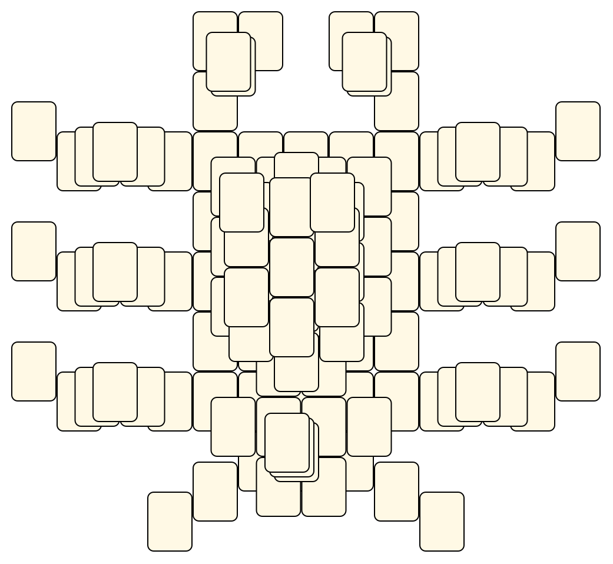
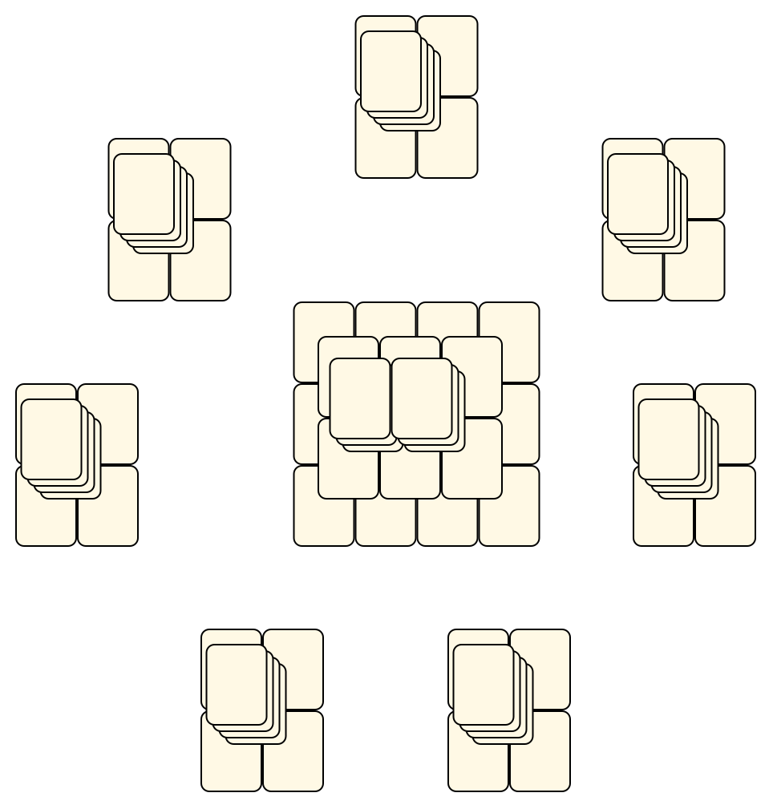
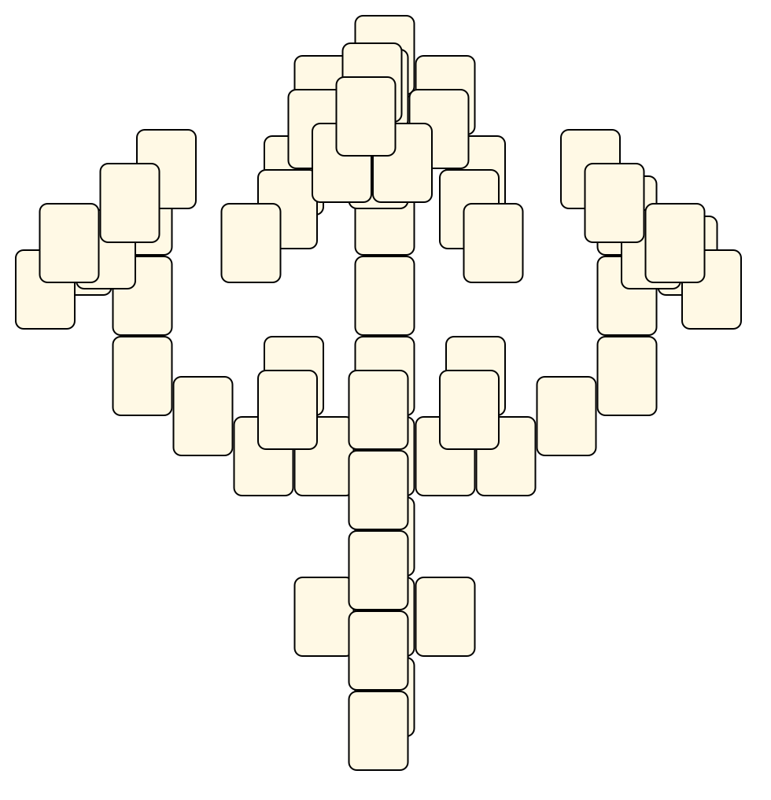

# Mahjong Solitaire Layout Museum: Death Mask
* Source: [https://web.archive.org/web/20040612231847/http://deathm1.tripod.com/stuff/pcgames.html](https://web.archive.org/web/20040612231847/http://deathm1.tripod.com/stuff/pcgames.html)

* File Source:  
<sub>```https://web.archive.org/web/20040610002141/http://deathm1.tripod.com/stuff/layouts.zip```</sub>


|Death Mask||Layouts: 3|
|:--:|:--:|:--:|
|Granchio<br><br> <sub>DMask</sub> <br>[.lay](./granchio.lay)  [.layout](./granchio.layout)  [.mah](./granchio.mah) |Pillars<br><br> <sub>DMask</sub> <br>[.lay](./pillars.lay)  [.layout](./pillars.layout)  [.mah](./pillars.mah) |Poseidon<br><br> <sub>DMask</sub> <br>[.lay](./poseidon.lay)  [.layout](./poseidon.layout)  [.mah](./poseidon.mah) |