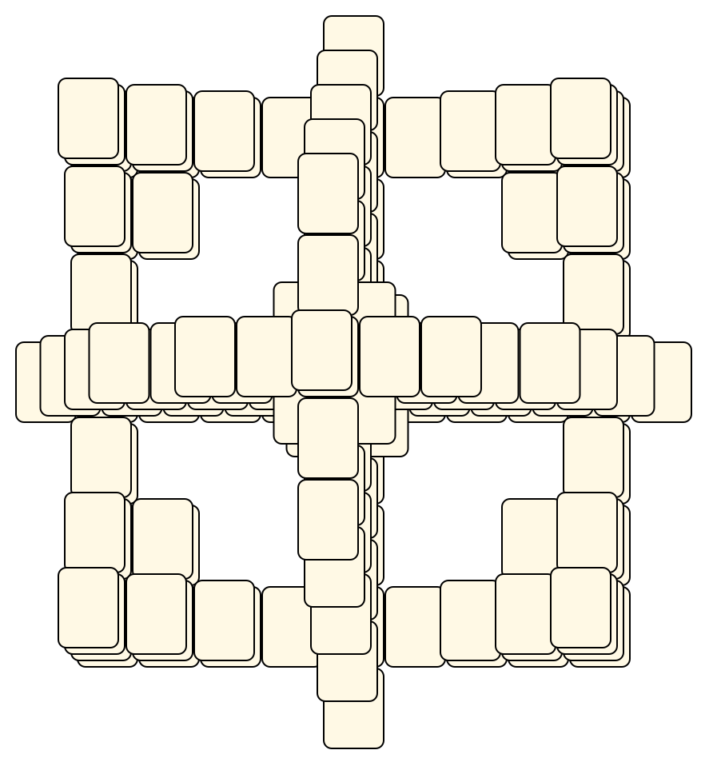
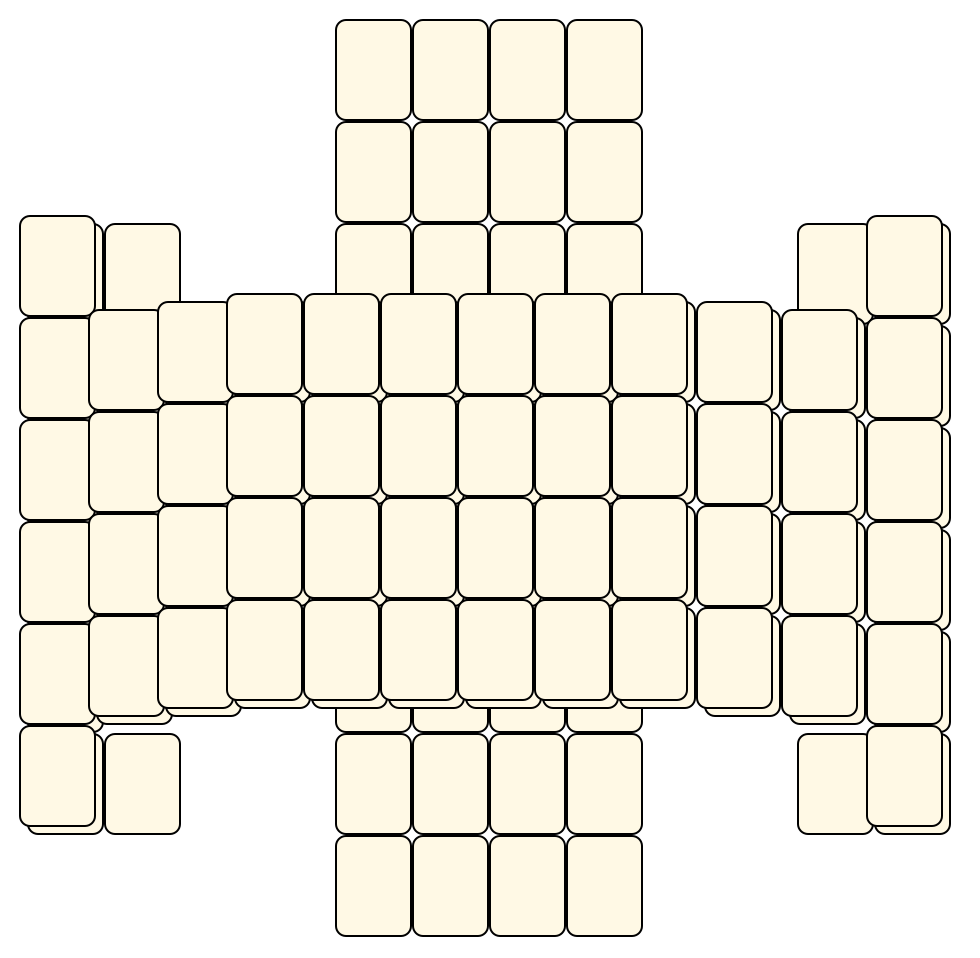
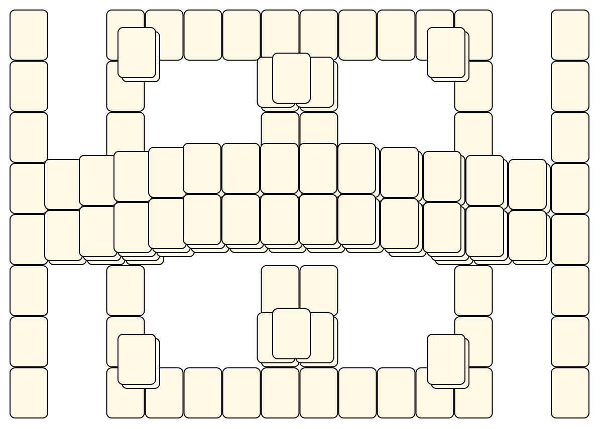
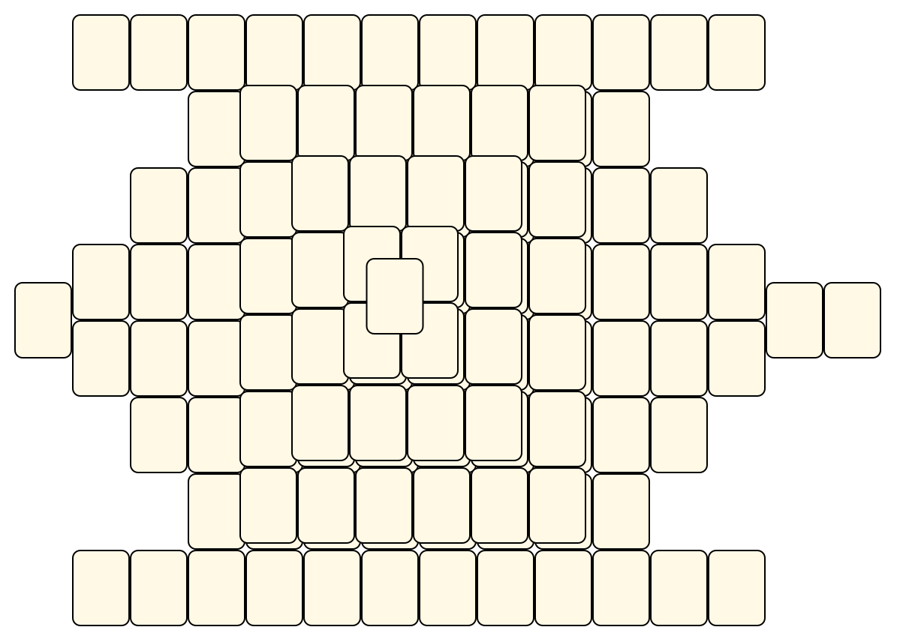

# Mahjong Solitaire Layout Museum: GNOME Mahjongg
* Source: [https://github.com/GNOME/gnome-mahjongg/tree/main/data/maps/](https://github.com/GNOME/gnome-mahjongg/tree/main/data/maps/)

* File Source:  
<sub>```https://github.com/GNOME/gnome-mahjongg/tree/main/data/maps/```</sub>


|GNOME Mahjongg||Layouts: 1|
|:--:|:--:|:--:|
|Cloud<br><br> <sub>unknown</sub> <br>[.lay](./cloud.lay)  [.layout](./cloud.layout)  [.mah](./cloud.mah) |Confounding Cross<br><br> <sub>unknown</sub> <br>[.lay](./confounding_cross.lay)  [.layout](./confounding_cross.layout)  [.mah](./confounding_cross.mah) |Four Bridges<br><br> <sub>unknown</sub> <br>[.lay](./four_bridges.lay)  [.layout](./four_bridges.layout)  [.mah](./four_bridges.mah) |
|Overpass<br><br> <sub>unknown</sub> <br>[.lay](./overpass.lay)  [.layout](./overpass.layout)  [.mah](./overpass.mah) |Pyramid's Walls<br><br> <sub>unknown</sub> <br>[.lay](./pyramids_walls.lay)  [.layout](./pyramids_walls.layout)  [.mah](./pyramids_walls.mah) |Red Dragon<br><br> <sub>unknown</sub> <br>[.lay](./red_dragon.lay)  [.layout](./red_dragon.layout)  [.mah](./red_dragon.mah) |
|Taipei<br><br> <sub>unknown</sub> <br>[.lay](./taipei.lay)  [.layout](./taipei.layout)  [.mah](./taipei.mah) |The Ziggurat<br><br> <sub>unknown</sub> <br>[.lay](./the_ziggurat.lay)  [.layout](./the_ziggurat.layout)  [.mah](./the_ziggurat.mah) |Tic-Tac-Toe<br><br> <sub>unknown</sub> <br>[.lay](./tic-tac-toe.lay)  [.layout](./tic-tac-toe.layout)  [.mah](./tic-tac-toe.mah) |
|Turtle<br><br> <sub>unknown</sub> <br>[.lay](./turtle.lay)  [.layout](./turtle.layout)  [.mah](./turtle.mah) |||