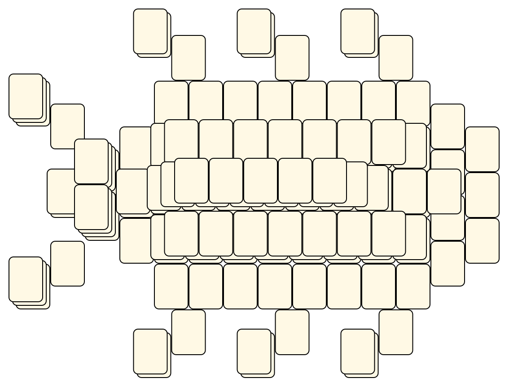
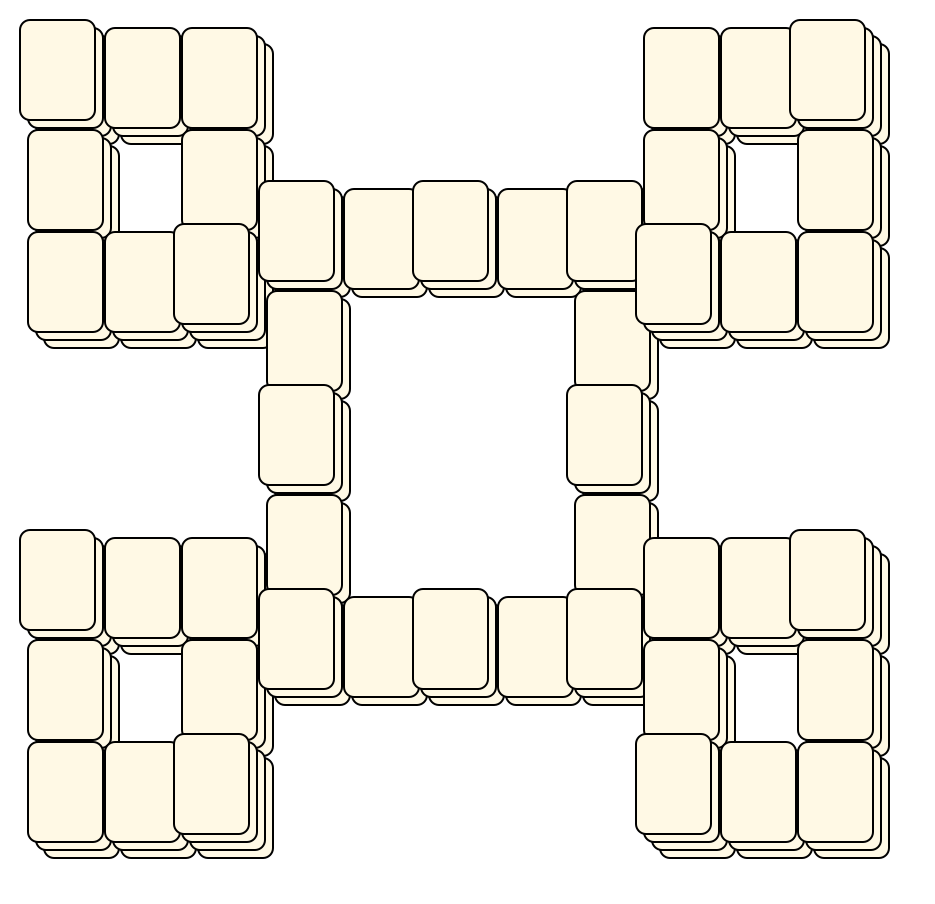
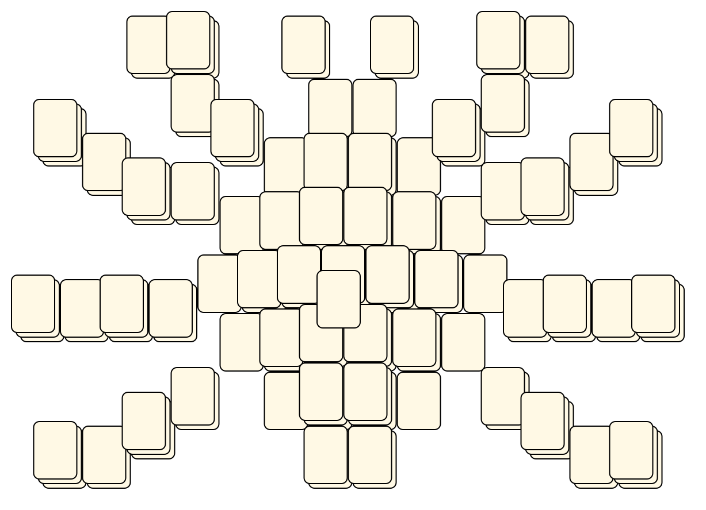

# Mahjong Solitaire Layout Museum: Green Mahjong
* Source: [https://github.com/danbeck/green-mahjong/tree/master/GreenMahjong/www/js/](https://github.com/danbeck/green-mahjong/tree/master/GreenMahjong/www/js/)

* File Source:  
<sub>```https://github.com/danbeck/green-mahjong/tree/master/GreenMahjong/www/js/```</sub>


|Green Mahjong||Layouts: 6|
|:--:|:--:|:--:|
|Bug<br><br> <sub>unknown</sub> <br>[.lay](./bug.lay)  [.layout](./bug.layout)  [.mah](./bug.mah) |Cloud<br><br> <sub>unknown</sub> <br>[.lay](./cloud_2.lay)  [.layout](./cloud_2.layout)  [.mah](./cloud_2.mah) |Flower<br><br> <sub>unknown</sub> <br>[.lay](./flower.lay)  [.layout](./flower.layout)  [.mah](./flower.mah) |
|Four Hills<br><br> <sub>unknown</sub> <br>[.lay](./four_hills.lay)  [.layout](./four_hills.layout)  [.mah](./four_hills.mah) |Spider<br><br> <sub>unknown</sub> <br>[.lay](./spider.lay)  [.layout](./spider.layout)  [.mah](./spider.mah) |Turtle<br><br> <sub>unknown</sub> <br>[.lay](./turtle_2.lay)  [.layout](./turtle_2.layout)  [.mah](./turtle_2.mah) |