# Mahjong Solitaire Layout Museum: Kurenai

## Alphabet
* Source: 
[https://web.archive.org/web/20230204113220/http://tsubassa-kurenai.de/Kyodai/Layouts/](https://web.archive.org/web/20230204113220/http://tsubassa-kurenai.de/Kyodai/Layouts/)

* File Source:  
<sub>```https://web.archive.org/web/20230204113220/http://tsubassa-kurenai.de/Kyodai/Layouts/Alphabet.zip```</sub>


|[kuranei_alphabet](kuranei_alphabet/README.md) ||Layouts: 26|
|:--:|:--:|:--:|
|Letter A<br><br> <sub>Tsubassa Kurenai</sub> <br>[.lay](./kuranei_alphabet/letter_a.lay)  [.layout](./kuranei_alphabet/letter_a.layout)  [.mah](./kuranei_alphabet/letter_a.mah) |Letter B<br>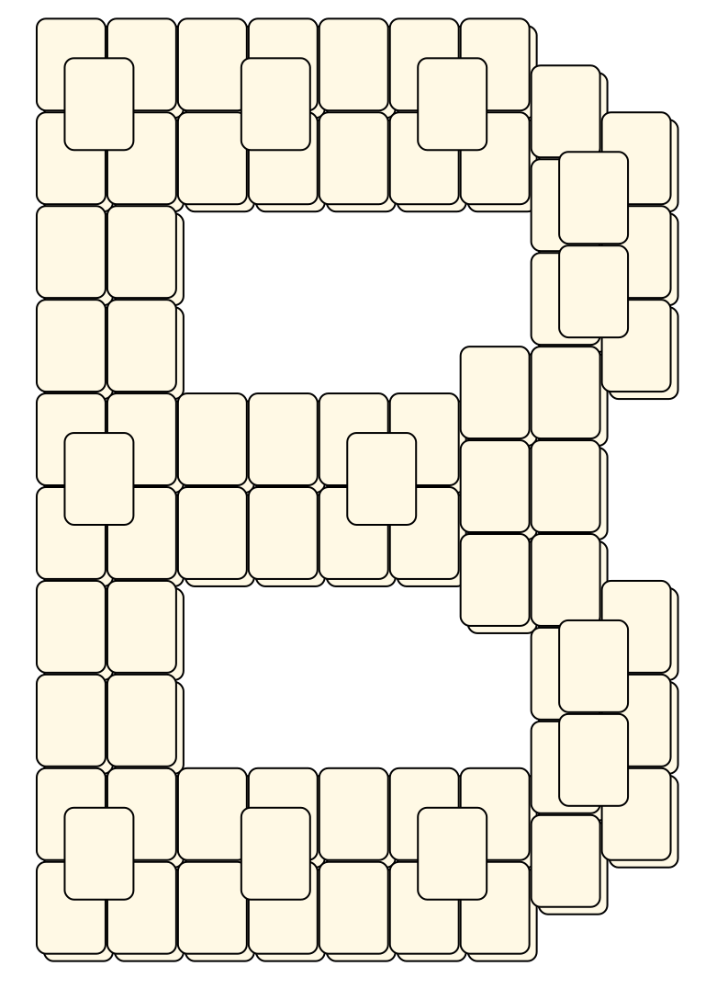<br> <sub>Tsubassa Kurenai</sub> <br>[.lay](./kuranei_alphabet/letter_b.lay)  [.layout](./kuranei_alphabet/letter_b.layout)  [.mah](./kuranei_alphabet/letter_b.mah) |Letter C<br><br> <sub>Tsubassa Kurenai</sub> <br>[.lay](./kuranei_alphabet/letter_c.lay)  [.layout](./kuranei_alphabet/letter_c.layout)  [.mah](./kuranei_alphabet/letter_c.mah) |
|Letter D<br><br> <sub>Tsubassa Kurenai</sub> <br>[.lay](./kuranei_alphabet/letter_d.lay)  [.layout](./kuranei_alphabet/letter_d.layout)  [.mah](./kuranei_alphabet/letter_d.mah) |Letter E<br><br> <sub>Tsubassa Kurenai</sub> <br>[.lay](./kuranei_alphabet/letter_e.lay)  [.layout](./kuranei_alphabet/letter_e.layout)  [.mah](./kuranei_alphabet/letter_e.mah) |Letter F<br><br> <sub>Tsubassa Kurenai</sub> <br>[.lay](./kuranei_alphabet/letter_f.lay)  [.layout](./kuranei_alphabet/letter_f.layout)  [.mah](./kuranei_alphabet/letter_f.mah) |
|Letter G<br><br> <sub>Tsubassa Kurenai</sub> <br>[.lay](./kuranei_alphabet/letter_g.lay)  [.layout](./kuranei_alphabet/letter_g.layout)  [.mah](./kuranei_alphabet/letter_g.mah) |Letter H<br><br> <sub>Tsubassa Kurenai</sub> <br>[.lay](./kuranei_alphabet/letter_h.lay)  [.layout](./kuranei_alphabet/letter_h.layout)  [.mah](./kuranei_alphabet/letter_h.mah) |Letter I<br>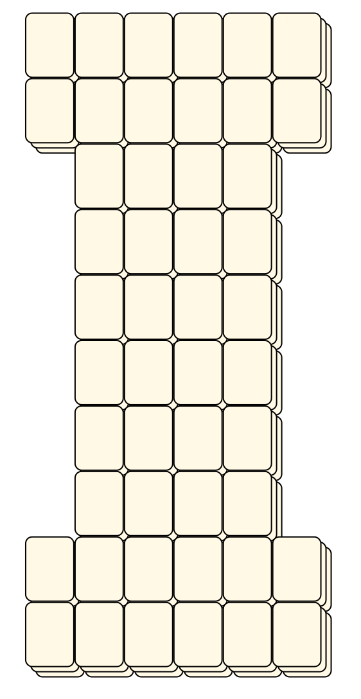<br> <sub>Tsubassa Kurenai</sub> <br>[.lay](./kuranei_alphabet/letter_i.lay)  [.layout](./kuranei_alphabet/letter_i.layout)  [.mah](./kuranei_alphabet/letter_i.mah) |
|Letter J<br><br> <sub>Tsubassa Kurenai</sub> <br>[.lay](./kuranei_alphabet/letter_j.lay)  [.layout](./kuranei_alphabet/letter_j.layout)  [.mah](./kuranei_alphabet/letter_j.mah) |Letter K<br><br> <sub>Tsubassa Kurenai</sub> <br>[.lay](./kuranei_alphabet/letter_k.lay)  [.layout](./kuranei_alphabet/letter_k.layout)  [.mah](./kuranei_alphabet/letter_k.mah) |Letter L<br>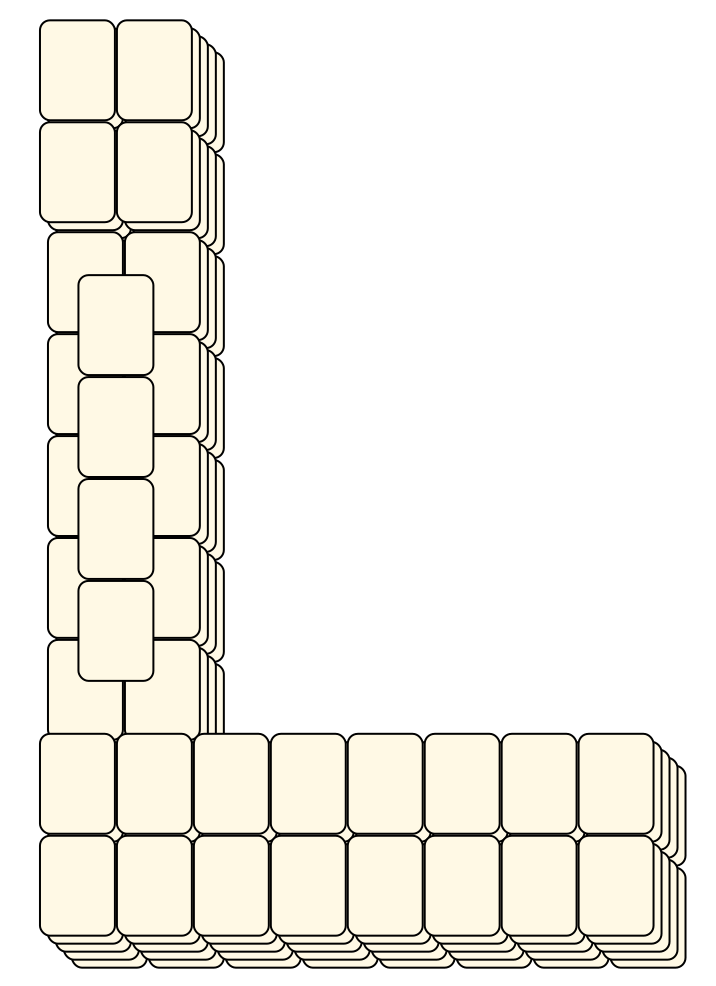<br> <sub>Tsubassa Kurenai</sub> <br>[.lay](./kuranei_alphabet/letter_l.lay)  [.layout](./kuranei_alphabet/letter_l.layout)  [.mah](./kuranei_alphabet/letter_l.mah) |
|Letter M<br><br> <sub>Tsubassa Kurenai</sub> <br>[.lay](./kuranei_alphabet/letter_m.lay)  [.layout](./kuranei_alphabet/letter_m.layout)  [.mah](./kuranei_alphabet/letter_m.mah) |Letter N<br>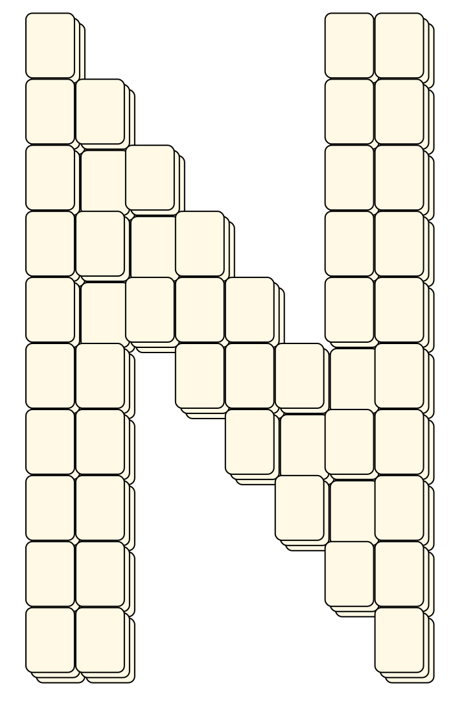<br> <sub>Tsubassa Kurenai</sub> <br>[.lay](./kuranei_alphabet/letter_n.lay)  [.layout](./kuranei_alphabet/letter_n.layout)  [.mah](./kuranei_alphabet/letter_n.mah) |Letter O<br><br> <sub>Tsubassa Kurenai</sub> <br>[.lay](./kuranei_alphabet/letter_o.lay)  [.layout](./kuranei_alphabet/letter_o.layout)  [.mah](./kuranei_alphabet/letter_o.mah) |
|Letter P<br><br> <sub>Tsubassa Kurenai</sub> <br>[.lay](./kuranei_alphabet/letter_p.lay)  [.layout](./kuranei_alphabet/letter_p.layout)  [.mah](./kuranei_alphabet/letter_p.mah) |Letter Q<br>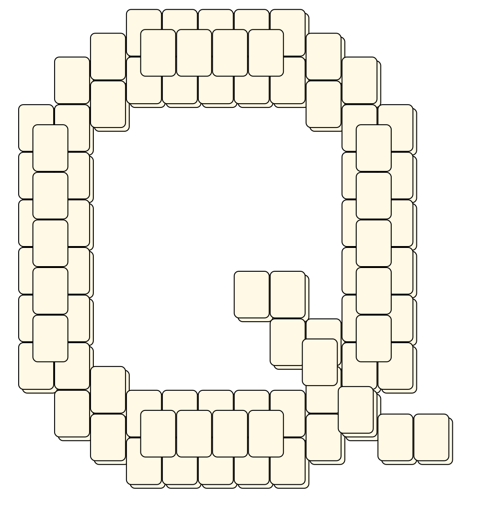<br> <sub>Tsubassa Kurenai</sub> <br>[.lay](./kuranei_alphabet/letter_q.lay)  [.layout](./kuranei_alphabet/letter_q.layout)  [.mah](./kuranei_alphabet/letter_q.mah) |Letter R<br>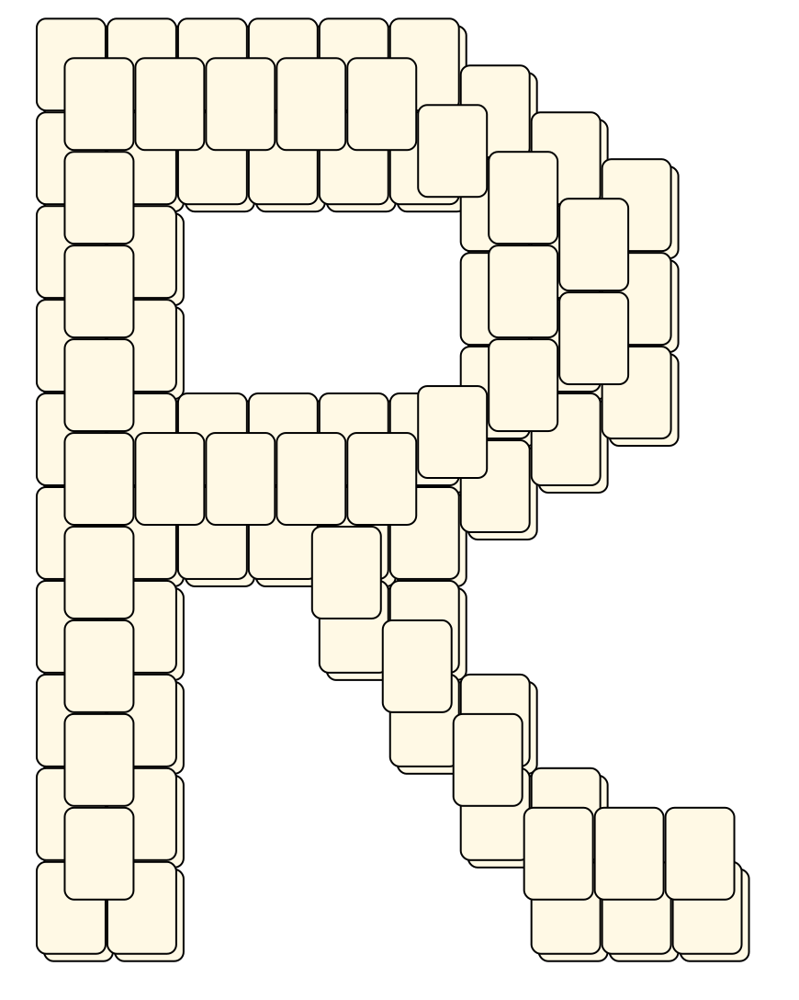<br> <sub>Tsubassa Kurenai</sub> <br>[.lay](./kuranei_alphabet/letter_r.lay)  [.layout](./kuranei_alphabet/letter_r.layout)  [.mah](./kuranei_alphabet/letter_r.mah) |
|Letter S<br><br> <sub>Tsubassa Kurenai</sub> <br>[.lay](./kuranei_alphabet/letter_s.lay)  [.layout](./kuranei_alphabet/letter_s.layout)  [.mah](./kuranei_alphabet/letter_s.mah) |Letter T<br><br> <sub>Tsubassa Kurenai</sub> <br>[.lay](./kuranei_alphabet/letter_t.lay)  [.layout](./kuranei_alphabet/letter_t.layout)  [.mah](./kuranei_alphabet/letter_t.mah) |Letter U<br><br> <sub>Tsubassa Kurenai</sub> <br>[.lay](./kuranei_alphabet/letter_u.lay)  [.layout](./kuranei_alphabet/letter_u.layout)  [.mah](./kuranei_alphabet/letter_u.mah) |
|Letter V<br>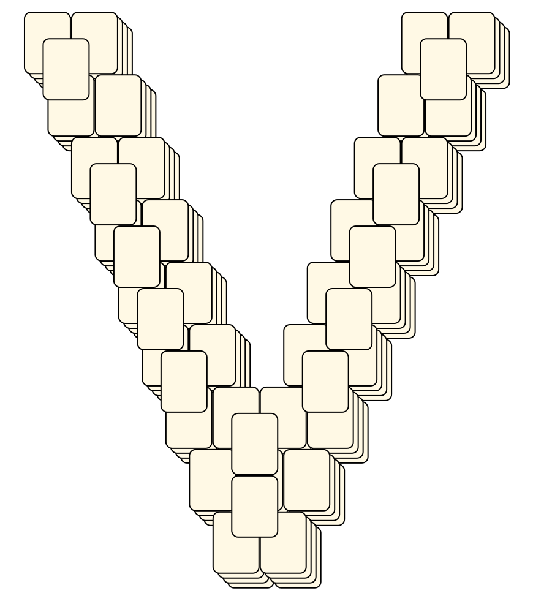<br> <sub>Tsubassa Kurenai</sub> <br>[.lay](./kuranei_alphabet/letter_v.lay)  [.layout](./kuranei_alphabet/letter_v.layout)  [.mah](./kuranei_alphabet/letter_v.mah) |Letter W<br><br> <sub>Tsubassa Kurenai</sub> <br>[.lay](./kuranei_alphabet/letter_w.lay)  [.layout](./kuranei_alphabet/letter_w.layout)  [.mah](./kuranei_alphabet/letter_w.mah) |Letter X<br><br> <sub>Tsubassa Kurenai</sub> <br>[.lay](./kuranei_alphabet/letter_x.lay)  [.layout](./kuranei_alphabet/letter_x.layout)  [.mah](./kuranei_alphabet/letter_x.mah) |
|Letter Y<br><br> <sub>Tsubassa Kurenai</sub> <br>[.lay](./kuranei_alphabet/letter_y.lay)  [.layout](./kuranei_alphabet/letter_y.layout)  [.mah](./kuranei_alphabet/letter_y.mah) |Letter Z<br>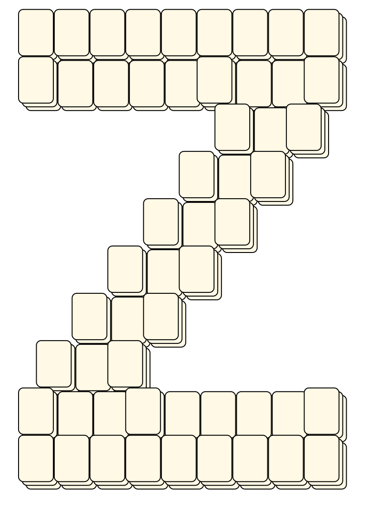<br> <sub>Tsubassa Kurenai</sub> <br>[.lay](./kuranei_alphabet/letter_z.lay)  [.layout](./kuranei_alphabet/letter_z.layout)  [.mah](./kuranei_alphabet/letter_z.mah) ||

## Floater
* Source: 
[https://web.archive.org/web/20230204113220/http://tsubassa-kurenai.de/Kyodai/Layouts/](https://web.archive.org/web/20230204113220/http://tsubassa-kurenai.de/Kyodai/Layouts/)

* File Source:  
<sub>```https://web.archive.org/web/20230204113220/http://tsubassa-kurenai.de/Kyodai/Layouts/```</sub>


|[kurenai_floater](kurenai_floater/README.md) ||Layouts: 7|
|:--:|:--:|:--:|
|Floating City<br><br> <sub>Will O'Connell</sub> <br>[.lay](./kurenai_floater/floating_city.lay)  [.layout](./kurenai_floater/floating_city.layout)  [.mah](./kurenai_floater/floating_city.mah) |Fortress<br><br> <sub>Tsubassa Kurenai</sub> <br>[.lay](./kurenai_floater/fortress.lay)  [.layout](./kurenai_floater/fortress.layout)  [.mah](./kurenai_floater/fortress.mah) |Hourglass<br>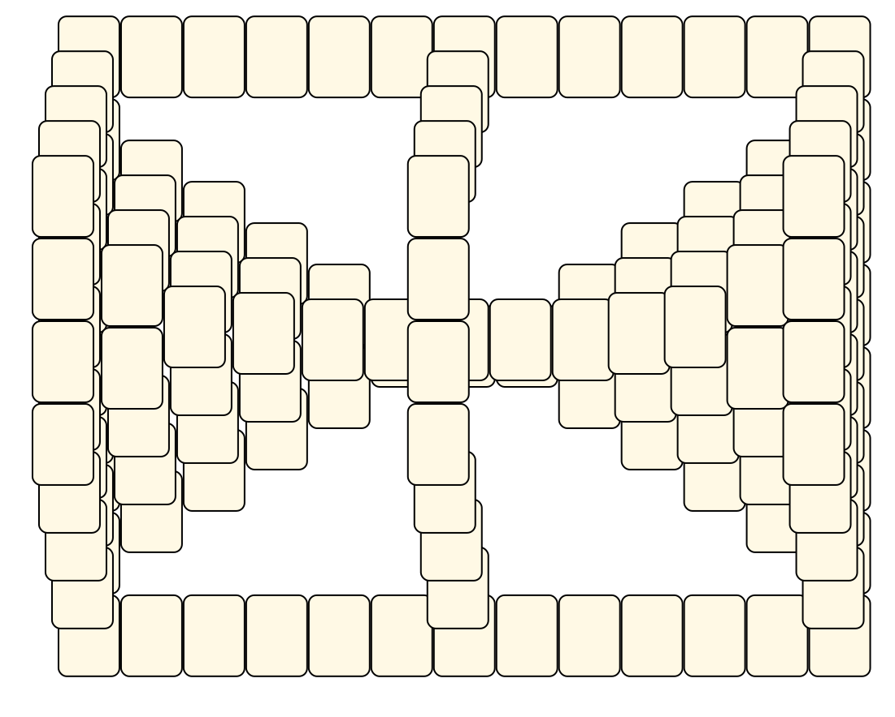<br> <sub>Michael Buckland</sub> <br>[.lay](./kurenai_floater/hourglass.lay)  [.layout](./kurenai_floater/hourglass.layout)  [.mah](./kurenai_floater/hourglass.mah) |
|Manipulation Test 36 Tiles Oo 72<br><br> <sub>Tsubassa Kurenai</sub> <br>[.lay](./kurenai_floater/manipulation_test_36_tiles_oo_72.lay)  [.layout](./kurenai_floater/manipulation_test_36_tiles_oo_72.layout)  [.mah](./kurenai_floater/manipulation_test_36_tiles_oo_72.mah) |Pillars With Roof<br><br> <sub>Tsubassa Kurenai</sub> <br>[.lay](./kurenai_floater/pillars_with_roof.lay)  [.layout](./kurenai_floater/pillars_with_roof.layout)  [.mah](./kurenai_floater/pillars_with_roof.mah) |Towers And Arch<br>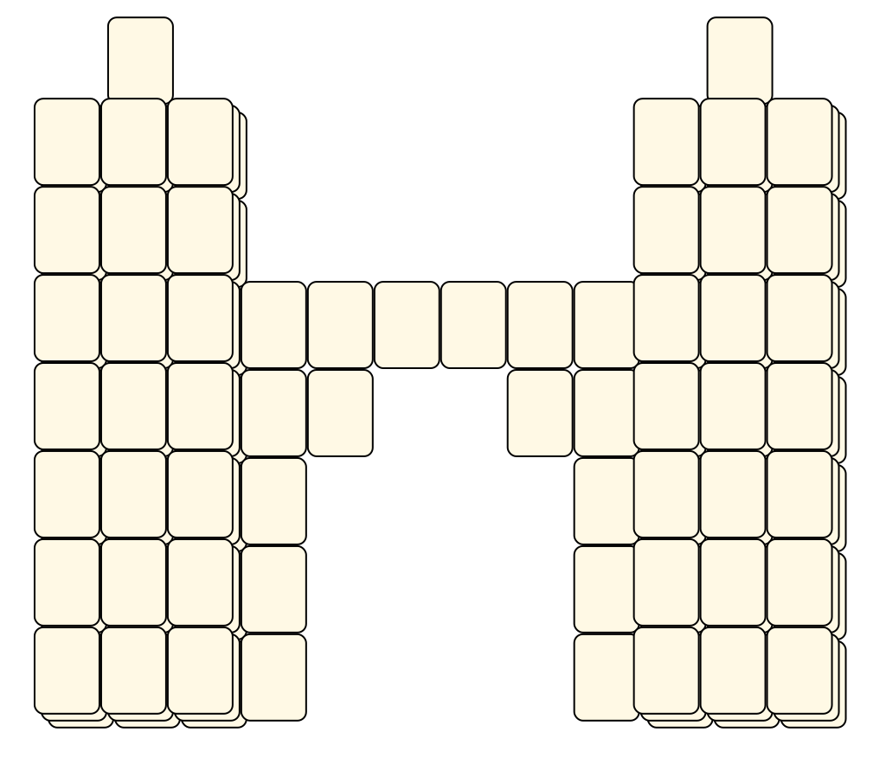<br> <sub>Tsubassa Kurenai</sub> <br>[.lay](./kurenai_floater/towers_and_arch.lay)  [.layout](./kurenai_floater/towers_and_arch.layout)  [.mah](./kurenai_floater/towers_and_arch.mah) |
|Two Hollow Tubes<br>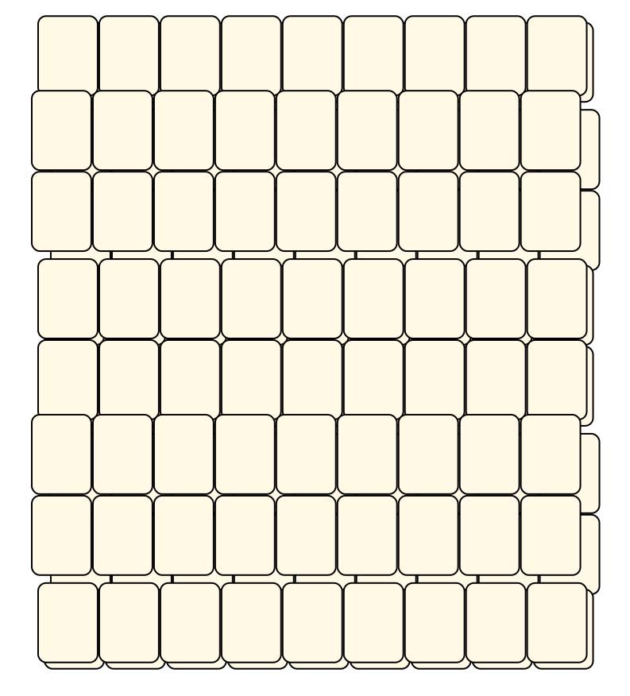<br> <sub>Tsubassa Kurenai</sub> <br>[.lay](./kurenai_floater/two_hollow_tubes.lay)  [.layout](./kurenai_floater/two_hollow_tubes.layout)  [.mah](./kurenai_floater/two_hollow_tubes.mah) |||

## Tile Layouts
* Source: 
[https://web.archive.org/web/20230204113220/http://tsubassa-kurenai.de/Kyodai/Layouts/](https://web.archive.org/web/20230204113220/http://tsubassa-kurenai.de/Kyodai/Layouts/)

* File Source:  
<sub>```https://web.archive.org/web/20230204113220/http://tsubassa-kurenai.de/Kyodai/Layouts/Tile-Layouts.zip```</sub>


|[kurenai_layouts](kurenai_layouts/README.md) ||Layouts: 42|
|:--:|:--:|:--:|
|Autumn<br><br> <sub>Tsubassa Kurenai</sub> <br>[.lay](./kurenai_layouts/autumn.lay)  [.layout](./kurenai_layouts/autumn.layout)  [.mah](./kurenai_layouts/autumn.mah) |Bam 1<br><br> <sub>Tsubassa Kurenai</sub> <br>[.lay](./kurenai_layouts/bam_1.lay)  [.layout](./kurenai_layouts/bam_1.layout)  [.mah](./kurenai_layouts/bam_1.mah) |Bam 2<br><br> <sub>Tsubassa Kurenai</sub> <br>[.lay](./kurenai_layouts/bam_2.lay)  [.layout](./kurenai_layouts/bam_2.layout)  [.mah](./kurenai_layouts/bam_2.mah) |
|Bam 3<br><br> <sub>Tsubassa Kurenai</sub> <br>[.lay](./kurenai_layouts/bam_3.lay)  [.layout](./kurenai_layouts/bam_3.layout)  [.mah](./kurenai_layouts/bam_3.mah) |Bam 4<br><br> <sub>Tsubassa Kurenai</sub> <br>[.lay](./kurenai_layouts/bam_4.lay)  [.layout](./kurenai_layouts/bam_4.layout)  [.mah](./kurenai_layouts/bam_4.mah) |Bam 5<br>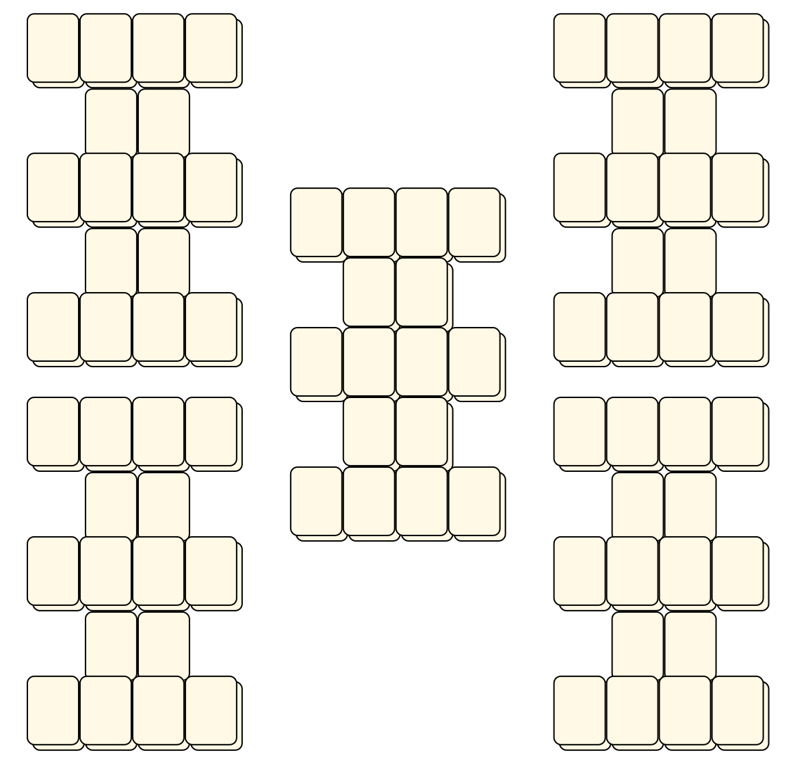<br> <sub>Tsubassa Kurenai</sub> <br>[.lay](./kurenai_layouts/bam_5.lay)  [.layout](./kurenai_layouts/bam_5.layout)  [.mah](./kurenai_layouts/bam_5.mah) |
|Bam 6<br><br> <sub>Tsubassa Kurenai</sub> <br>[.lay](./kurenai_layouts/bam_6.lay)  [.layout](./kurenai_layouts/bam_6.layout)  [.mah](./kurenai_layouts/bam_6.mah) |Bam 7<br><br> <sub>Tsubassa Kurenai</sub> <br>[.lay](./kurenai_layouts/bam_7.lay)  [.layout](./kurenai_layouts/bam_7.layout)  [.mah](./kurenai_layouts/bam_7.mah) |Bam 8<br>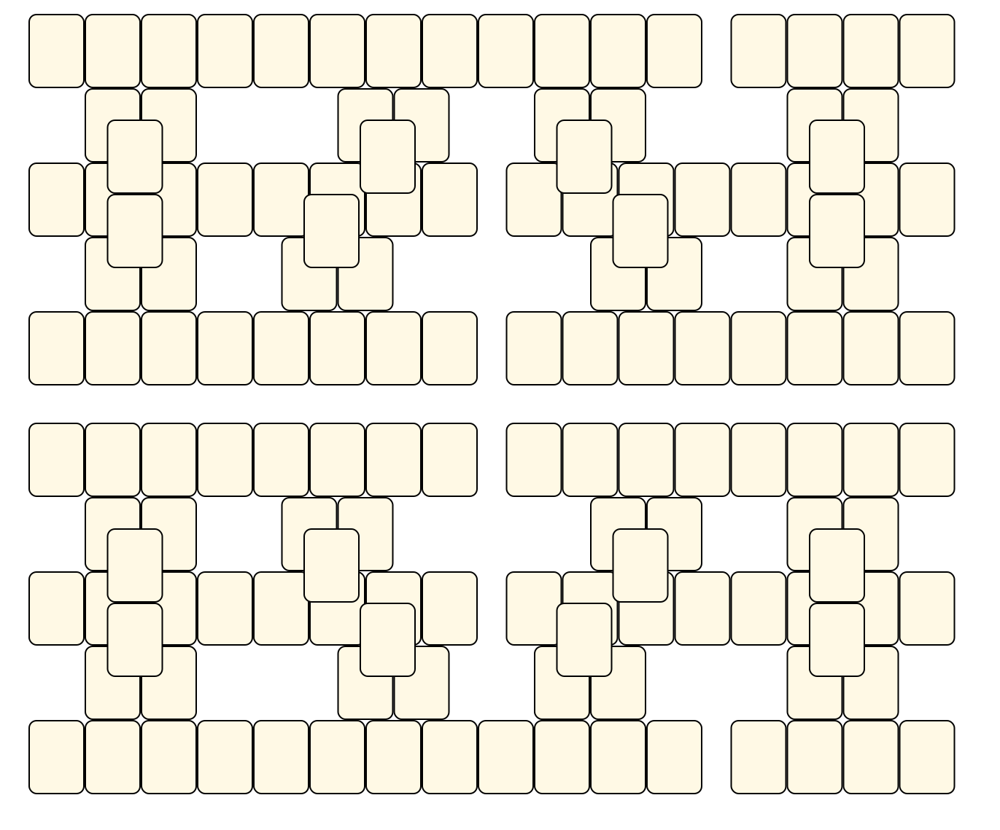<br> <sub>Tsubassa Kurenai</sub> <br>[.lay](./kurenai_layouts/bam_8.lay)  [.layout](./kurenai_layouts/bam_8.layout)  [.mah](./kurenai_layouts/bam_8.mah) |
|Bam 9<br>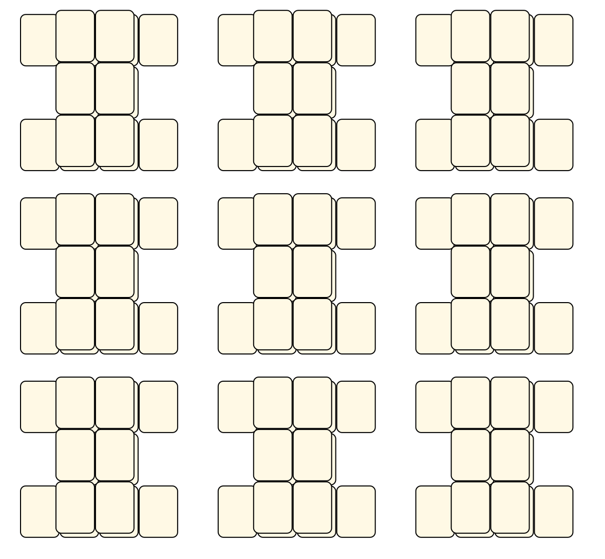<br> <sub>Tsubassa Kurenai</sub> <br>[.lay](./kurenai_layouts/bam_9.lay)  [.layout](./kurenai_layouts/bam_9.layout)  [.mah](./kurenai_layouts/bam_9.mah) |Bamboo<br><br> <sub>Tsubassa Kurenai</sub> <br>[.lay](./kurenai_layouts/bamboo.lay)  [.layout](./kurenai_layouts/bamboo.layout)  [.mah](./kurenai_layouts/bamboo.mah) |Bei<br>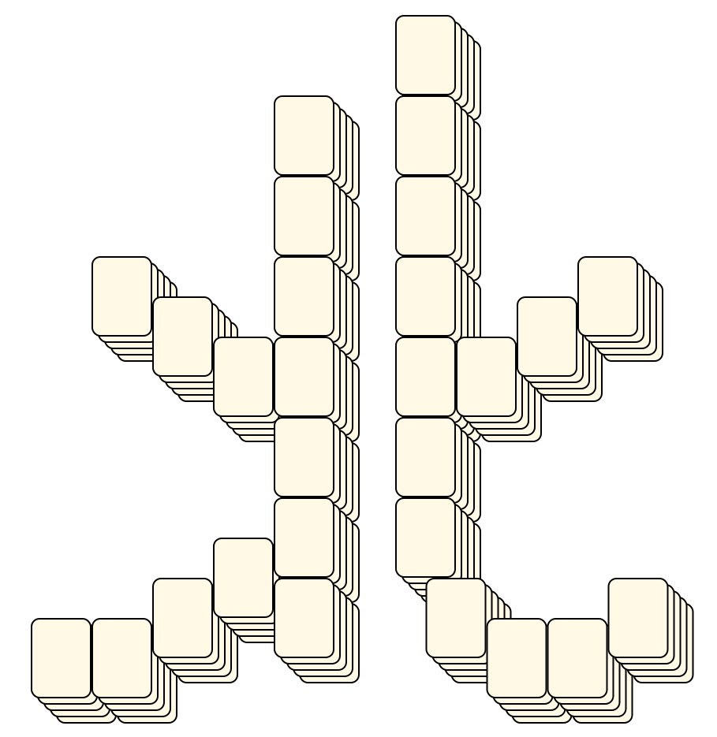<br> <sub>Tsubassa Kurenai</sub> <br>[.lay](./kurenai_layouts/bei.lay)  [.layout](./kurenai_layouts/bei.layout)  [.mah](./kurenai_layouts/bei.mah) |
|Dong<br><br> <sub>Tsubassa Kurenai</sub> <br>[.lay](./kurenai_layouts/dong.lay)  [.layout](./kurenai_layouts/dong.layout)  [.mah](./kurenai_layouts/dong.mah) |Dot 1<br>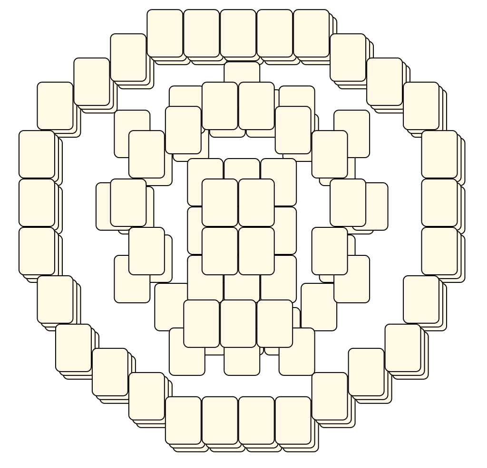<br> <sub>Tsubassa Kurenai</sub> <br>[.lay](./kurenai_layouts/dot_1.lay)  [.layout](./kurenai_layouts/dot_1.layout)  [.mah](./kurenai_layouts/dot_1.mah) |Dots 2<br><br> <sub>Tsubassa Kurenai</sub> <br>[.lay](./kurenai_layouts/dots_2.lay)  [.layout](./kurenai_layouts/dots_2.layout)  [.mah](./kurenai_layouts/dots_2.mah) |
|Dots 3<br><br> <sub>Tsubassa Kurenai</sub> <br>[.lay](./kurenai_layouts/dots_3.lay)  [.layout](./kurenai_layouts/dots_3.layout)  [.mah](./kurenai_layouts/dots_3.mah) |Dots 4<br><br> <sub>Tsubassa Kurenai</sub> <br>[.lay](./kurenai_layouts/dots_4.lay)  [.layout](./kurenai_layouts/dots_4.layout)  [.mah](./kurenai_layouts/dots_4.mah) |Dots 5<br>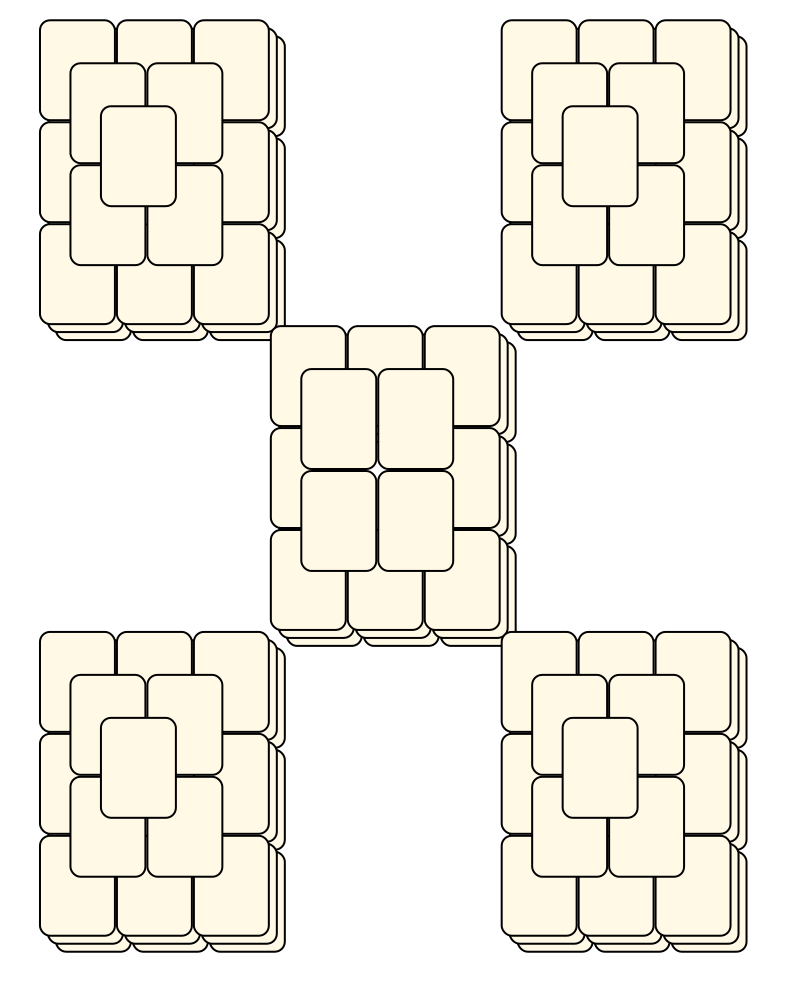<br> <sub>Tsubassa Kurenai</sub> <br>[.lay](./kurenai_layouts/dots_5.lay)  [.layout](./kurenai_layouts/dots_5.layout)  [.mah](./kurenai_layouts/dots_5.mah) |
|Dots 6<br><br> <sub>Tsubassa Kurenai</sub> <br>[.lay](./kurenai_layouts/dots_6.lay)  [.layout](./kurenai_layouts/dots_6.layout)  [.mah](./kurenai_layouts/dots_6.mah) |Dots 7<br>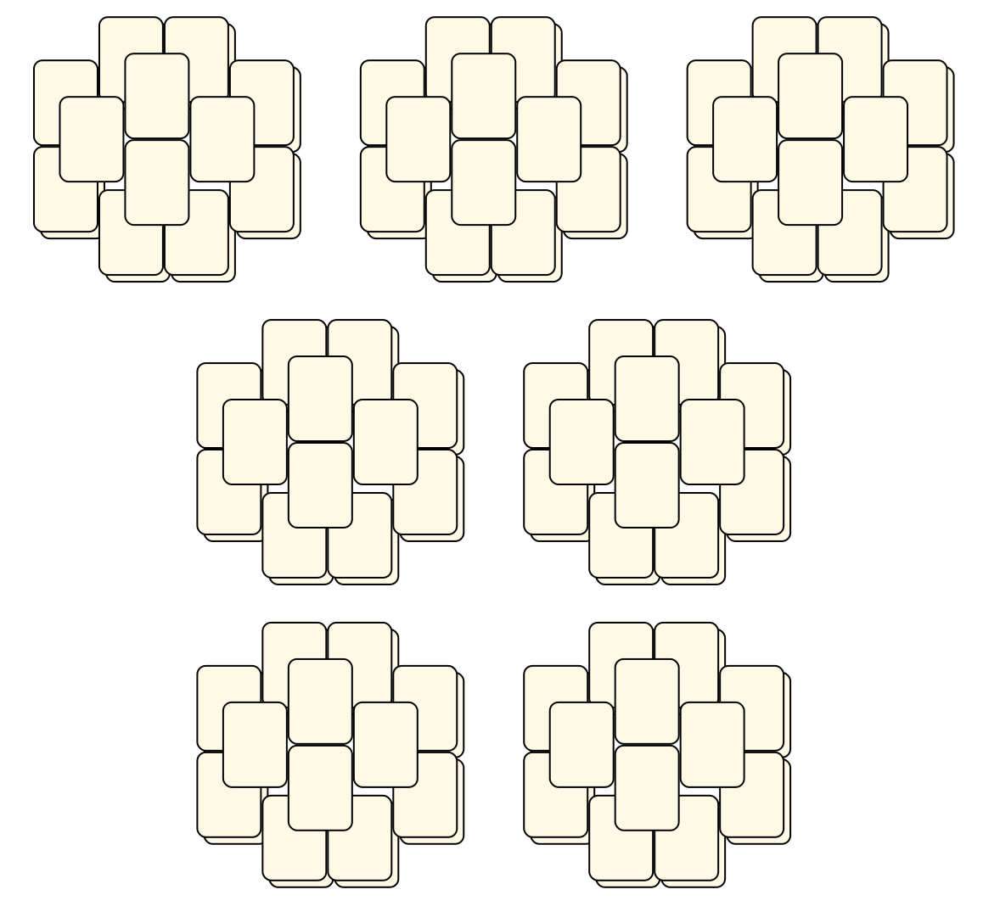<br> <sub>Tsubassa Kurenai</sub> <br>[.lay](./kurenai_layouts/dots_7.lay)  [.layout](./kurenai_layouts/dots_7.layout)  [.mah](./kurenai_layouts/dots_7.mah) |Dots 8<br><br> <sub>Tsubassa Kurenai</sub> <br>[.lay](./kurenai_layouts/dots_8.lay)  [.layout](./kurenai_layouts/dots_8.layout)  [.mah](./kurenai_layouts/dots_8.mah) |
|Dots 9<br>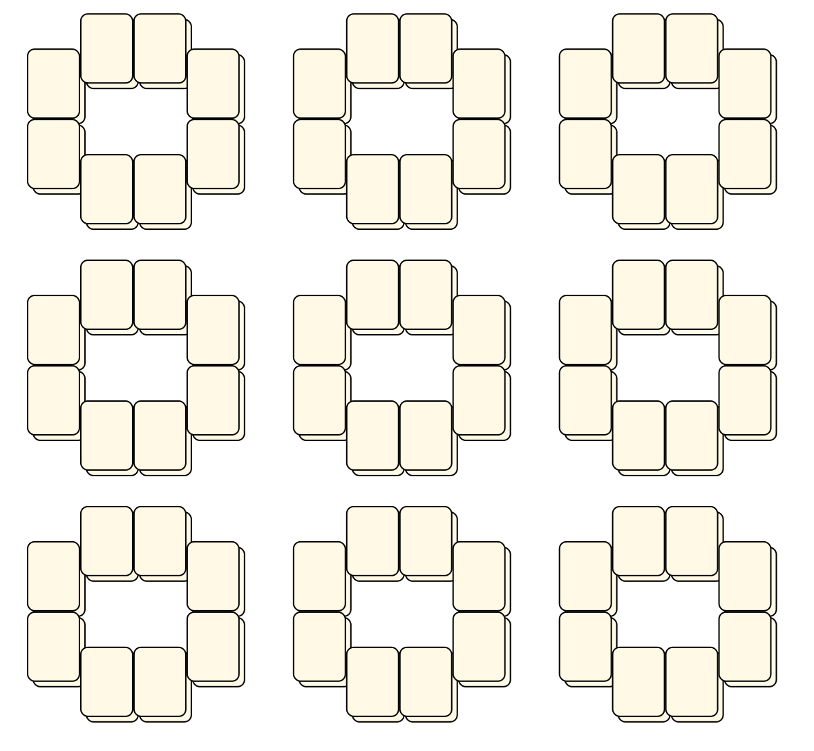<br> <sub>Tsubassa Kurenai</sub> <br>[.lay](./kurenai_layouts/dots_9.lay)  [.layout](./kurenai_layouts/dots_9.layout)  [.mah](./kurenai_layouts/dots_9.mah) |Green Dragon<br><br> <sub>Tsubassa Kurenai</sub> <br>[.lay](./kurenai_layouts/green_dragon.lay)  [.layout](./kurenai_layouts/green_dragon.layout)  [.mah](./kurenai_layouts/green_dragon.mah) |Mumlum<br><br> <sub>Tsubassa Kurenai</sub> <br>[.lay](./kurenai_layouts/mumlum.lay)  [.layout](./kurenai_layouts/mumlum.layout)  [.mah](./kurenai_layouts/mumlum.mah) |
|Nan<br><br> <sub>Tsubassa Kurenai</sub> <br>[.lay](./kurenai_layouts/nan.lay)  [.layout](./kurenai_layouts/nan.layout)  [.mah](./kurenai_layouts/nan.mah) |Orchis<br>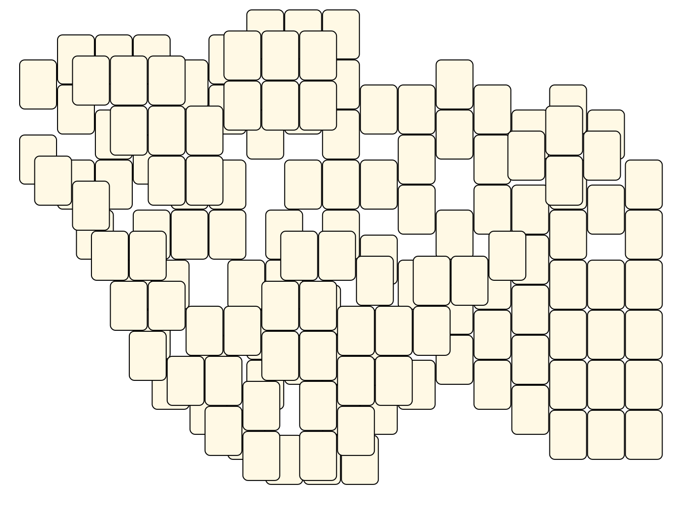<br> <sub>Tsubassa Kurenai</sub> <br>[.lay](./kurenai_layouts/orchis.lay)  [.layout](./kurenai_layouts/orchis.layout)  [.mah](./kurenai_layouts/orchis.mah) |Plum<br><br> <sub>Tsubassa Kurenai</sub> <br>[.lay](./kurenai_layouts/plum.lay)  [.layout](./kurenai_layouts/plum.layout)  [.mah](./kurenai_layouts/plum.mah) |
|Red Dragon<br><br> <sub>Tsubassa Kurenai</sub> <br>[.lay](./kurenai_layouts/red_dragon.lay)  [.layout](./kurenai_layouts/red_dragon.layout)  [.mah](./kurenai_layouts/red_dragon.mah) |Spring<br>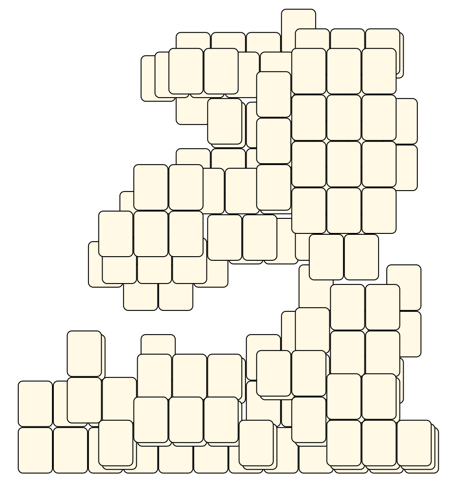<br> <sub>Tsubassa Kurenai</sub> <br>[.lay](./kurenai_layouts/spring.lay)  [.layout](./kurenai_layouts/spring.layout)  [.mah](./kurenai_layouts/spring.mah) |Summer<br><br> <sub>Tsubassa Kurenai</sub> <br>[.lay](./kurenai_layouts/summer.lay)  [.layout](./kurenai_layouts/summer.layout)  [.mah](./kurenai_layouts/summer.mah) |
|Wan 1<br><br> <sub>Tsubassa Kurenai</sub> <br>[.lay](./kurenai_layouts/wan_1.lay)  [.layout](./kurenai_layouts/wan_1.layout)  [.mah](./kurenai_layouts/wan_1.mah) |Wan 2<br>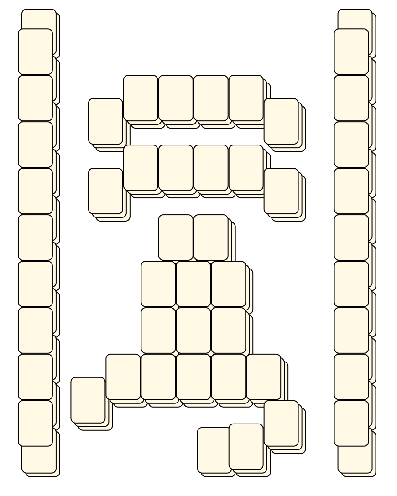<br> <sub>Tsubassa Kurenai</sub> <br>[.lay](./kurenai_layouts/wan_2.lay)  [.layout](./kurenai_layouts/wan_2.layout)  [.mah](./kurenai_layouts/wan_2.mah) |Wan 3<br>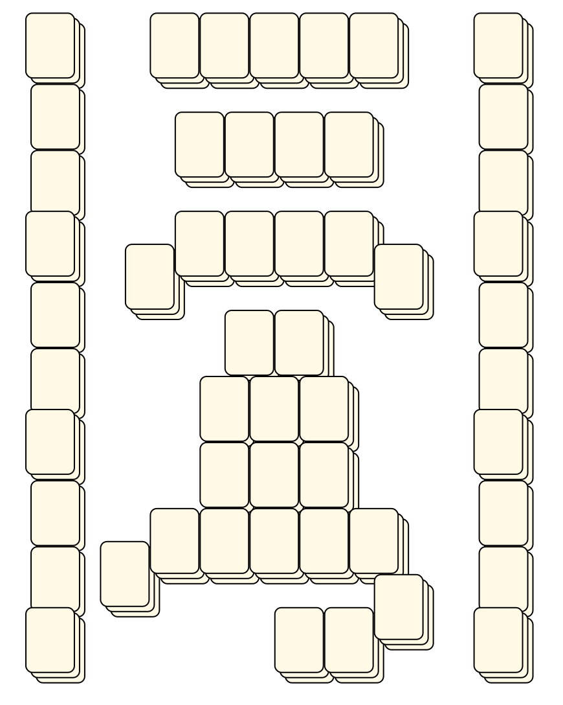<br> <sub>Tsubassa Kurenai</sub> <br>[.lay](./kurenai_layouts/wan_3.lay)  [.layout](./kurenai_layouts/wan_3.layout)  [.mah](./kurenai_layouts/wan_3.mah) |
|Wan 4<br><br> <sub>Tsubassa Kurenai</sub> <br>[.lay](./kurenai_layouts/wan_4.lay)  [.layout](./kurenai_layouts/wan_4.layout)  [.mah](./kurenai_layouts/wan_4.mah) |Wan 5<br><br> <sub>Tsubassa Kurenai</sub> <br>[.lay](./kurenai_layouts/wan_5.lay)  [.layout](./kurenai_layouts/wan_5.layout)  [.mah](./kurenai_layouts/wan_5.mah) |Wan 6<br><br> <sub>Tsubassa Kurenai</sub> <br>[.lay](./kurenai_layouts/wan_6.lay)  [.layout](./kurenai_layouts/wan_6.layout)  [.mah](./kurenai_layouts/wan_6.mah) |
|Wan 7<br><br> <sub>Tsubassa Kurenai</sub> <br>[.lay](./kurenai_layouts/wan_7.lay)  [.layout](./kurenai_layouts/wan_7.layout)  [.mah](./kurenai_layouts/wan_7.mah) |Wan 8<br><br> <sub>Tsubassa Kurenai</sub> <br>[.lay](./kurenai_layouts/wan_8.lay)  [.layout](./kurenai_layouts/wan_8.layout)  [.mah](./kurenai_layouts/wan_8.mah) |Wan 9<br><br> <sub>Tsubassa Kurenai</sub> <br>[.lay](./kurenai_layouts/wan_9.lay)  [.layout](./kurenai_layouts/wan_9.layout)  [.mah](./kurenai_layouts/wan_9.mah) |
|White Dragon<br><br> <sub>Tsubassa Kurenai</sub> <br>[.lay](./kurenai_layouts/white_dragon.lay)  [.layout](./kurenai_layouts/white_dragon.layout)  [.mah](./kurenai_layouts/white_dragon.mah) |Winter<br><br> <sub>Tsubassa Kurenai</sub> <br>[.lay](./kurenai_layouts/winter.lay)  [.layout](./kurenai_layouts/winter.layout)  [.mah](./kurenai_layouts/winter.mah) |Xi<br><br> <sub>Tsubassa Kurenai</sub> <br>[.lay](./kurenai_layouts/xi.lay)  [.layout](./kurenai_layouts/xi.layout)  [.mah](./kurenai_layouts/xi.mah) |

## Maps and flags
* Source: 
[https://web.archive.org/web/20230204113220/http://tsubassa-kurenai.de/Kyodai/Layouts/](https://web.archive.org/web/20230204113220/http://tsubassa-kurenai.de/Kyodai/Layouts/)

* File Source:  
<sub>```https://web.archive.org/web/20230204113220/http://tsubassa-kurenai.de/Kyodai/Layouts/```</sub>


|[kurenai_maps](kurenai_maps/README.md) ||Layouts: 6|
|:--:|:--:|:--:|
|Jamaican Flag<br>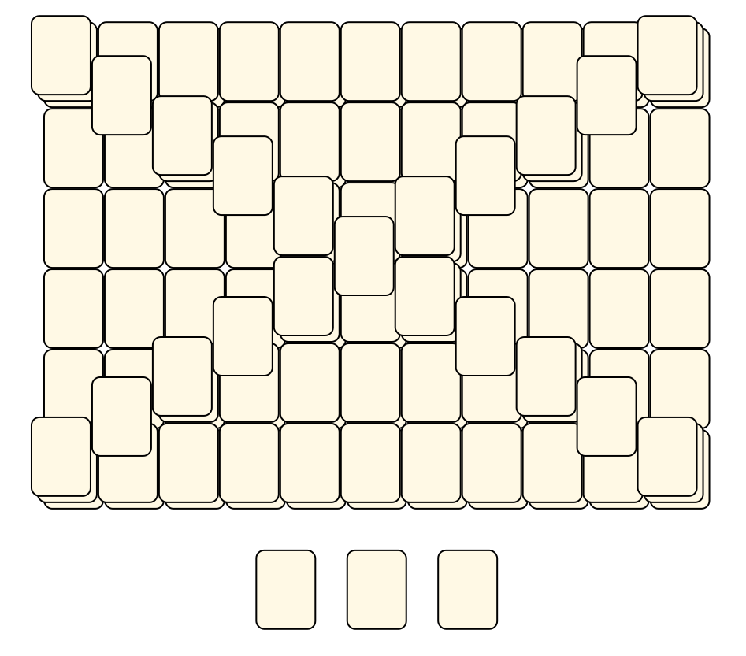<br> <sub>Tsubassa Kurenai</sub> <br>[.lay](./kurenai_maps/jamaican_flag.lay)  [.layout](./kurenai_maps/jamaican_flag.layout)  [.mah](./kurenai_maps/jamaican_flag.mah) |North European Flag<br><br> <sub>Tsubassa Kurenai</sub> <br>[.lay](./kurenai_maps/north_european_flag.lay)  [.layout](./kurenai_maps/north_european_flag.layout)  [.mah](./kurenai_maps/north_european_flag.mah) |Sinuskurve<br><br> <sub>Jens Rose</sub> <br>[.lay](./kurenai_maps/sinuskurve.lay)  [.layout](./kurenai_maps/sinuskurve.layout)  [.mah](./kurenai_maps/sinuskurve.mah) |
|Sinuskurve 2<br><br> <sub>Jens Rose</sub> <br>[.lay](./kurenai_maps/sinuskurve_2.lay)  [.layout](./kurenai_maps/sinuskurve_2.layout)  [.mah](./kurenai_maps/sinuskurve_2.mah) |Tilemap World<br>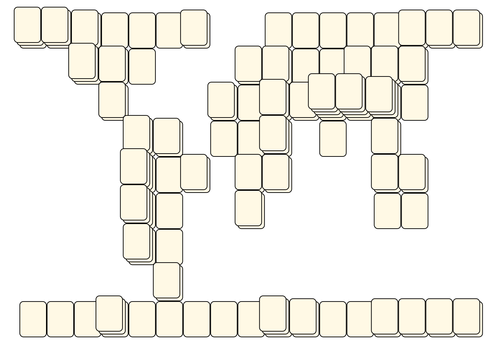<br> <sub>Jens Rose</sub> <br>[.lay](./kurenai_maps/tilemap_world.lay)  [.layout](./kurenai_maps/tilemap_world.layout)  [.mah](./kurenai_maps/tilemap_world.mah) |Union Jack<br><br> <sub>Tsubassa Kurenai</sub> <br>[.lay](./kurenai_maps/union_jack.lay)  [.layout](./kurenai_maps/union_jack.layout)  [.mah](./kurenai_maps/union_jack.mah) |

## Other
* Source: 
[https://web.archive.org/web/20230204113220/http://tsubassa-kurenai.de/Kyodai/Layouts/](https://web.archive.org/web/20230204113220/http://tsubassa-kurenai.de/Kyodai/Layouts/)

* File Source:  
<sub>```https://web.archive.org/web/20230204113220/http://tsubassa-kurenai.de/Kyodai/Layouts/```</sub>


|[kurenai_other](kurenai_other/README.md) ||Layouts: 26|
|:--:|:--:|:--:|
|Abstract Garden<br><br> <sub>Tsubassa Kurenai</sub> <br>[.lay](./kurenai_other/abstract_garden.lay)  [.layout](./kurenai_other/abstract_garden.layout)  [.mah](./kurenai_other/abstract_garden.mah) |Big Tile<br>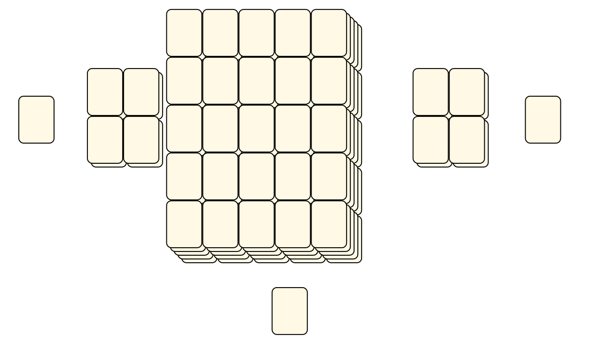<br> <sub>Tsubassa Kurenai</sub> <br>[.lay](./kurenai_other/big_tile.lay)  [.layout](./kurenai_other/big_tile.layout)  [.mah](./kurenai_other/big_tile.mah) |Block<br>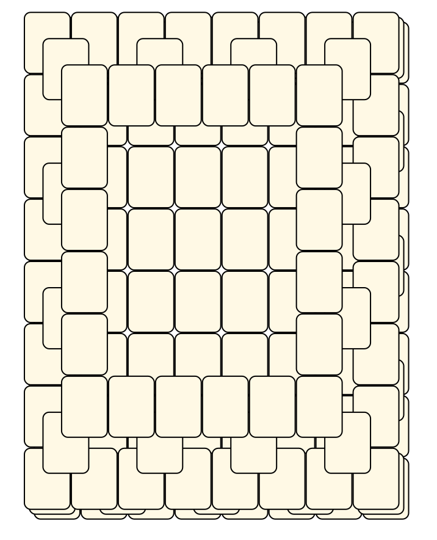<br> <sub>Jens Rose</sub> <br>[.lay](./kurenai_other/block.lay)  [.layout](./kurenai_other/block.layout)  [.mah](./kurenai_other/block.mah) |
|Card Colours<br><br> <sub>Tsubassa Kurenai</sub> <br>[.lay](./kurenai_other/card_colours.lay)  [.layout](./kurenai_other/card_colours.layout)  [.mah](./kurenai_other/card_colours.mah) |Corner Stairs<br><br> <sub>Jens Rose</sub> <br>[.lay](./kurenai_other/corner_stairs.lay)  [.layout](./kurenai_other/corner_stairs.layout)  [.mah](./kurenai_other/corner_stairs.mah) |Covered Duct<br><br> <sub>Tsubassa Kurenai</sub> <br>[.lay](./kurenai_other/covered_duct.lay)  [.layout](./kurenai_other/covered_duct.layout)  [.mah](./kurenai_other/covered_duct.mah) |
|Crazy Table<br><br> <sub>Tsubassa Kurenai</sub> <br>[.lay](./kurenai_other/crazy_table.lay)  [.layout](./kurenai_other/crazy_table.layout)  [.mah](./kurenai_other/crazy_table.mah) |Crazy Wheel<br><br> <sub>Tsubassa Kurenai</sub> <br>[.lay](./kurenai_other/crazy_wheel.lay)  [.layout](./kurenai_other/crazy_wheel.layout)  [.mah](./kurenai_other/crazy_wheel.mah) |Cross<br><br> <sub>Jens Rose</sub> <br>[.lay](./kurenai_other/cross_2.lay)  [.layout](./kurenai_other/cross_2.layout)  [.mah](./kurenai_other/cross_2.mah) |
|Easy Rectangles<br><br> <sub>Tsubassa Kurenai</sub> <br>[.lay](./kurenai_other/easy_rectangles.lay)  [.layout](./kurenai_other/easy_rectangles.layout)  [.mah](./kurenai_other/easy_rectangles.mah) |Heap<br>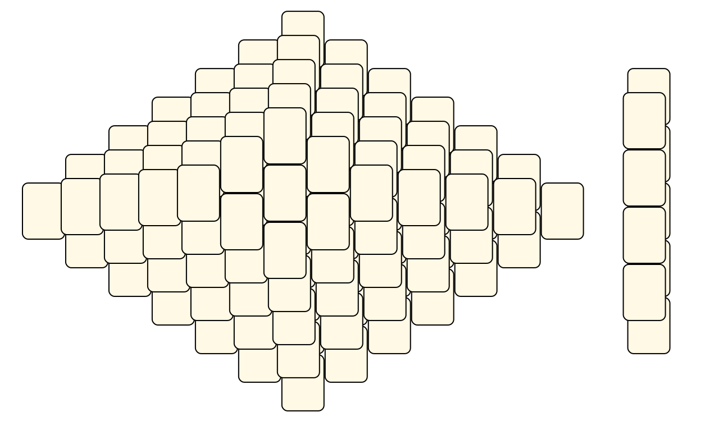<br> <sub>Jens Rose</sub> <br>[.lay](./kurenai_other/heap.lay)  [.layout](./kurenai_other/heap.layout)  [.mah](./kurenai_other/heap.mah) |Hexagon Stack<br><br> <sub>Tsubassa Kurenai</sub> <br>[.lay](./kurenai_other/hexagon_stack.lay)  [.layout](./kurenai_other/hexagon_stack.layout)  [.mah](./kurenai_other/hexagon_stack.mah) |
|Interweaved<br>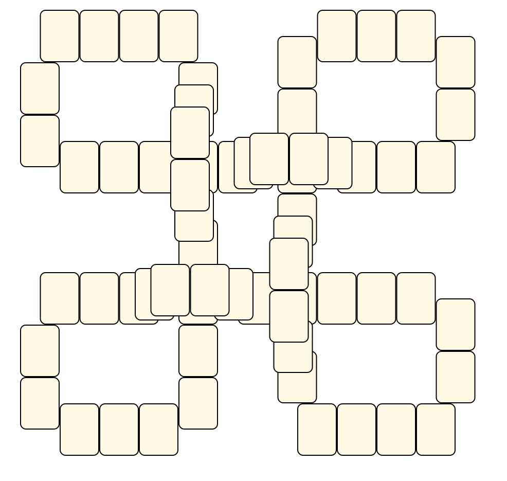<br> <sub>Tsubassa Kurenai</sub> <br>[.lay](./kurenai_other/interweaved.lay)  [.layout](./kurenai_other/interweaved.layout)  [.mah](./kurenai_other/interweaved.mah) |Interweaved 2<br><br> <sub>Tsubassa Kurenai</sub> <br>[.lay](./kurenai_other/interweaved_2.lay)  [.layout](./kurenai_other/interweaved_2.layout)  [.mah](./kurenai_other/interweaved_2.mah) |Koffin<br>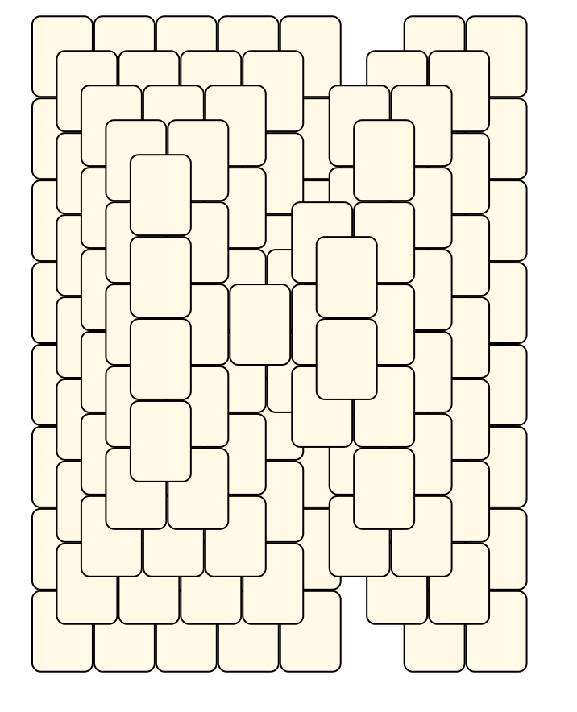<br> <sub>Tsubassa Kurenai</sub> <br>[.lay](./kurenai_other/koffin.lay)  [.layout](./kurenai_other/koffin.layout)  [.mah](./kurenai_other/koffin.mah) |
|Labyrinth 2<br>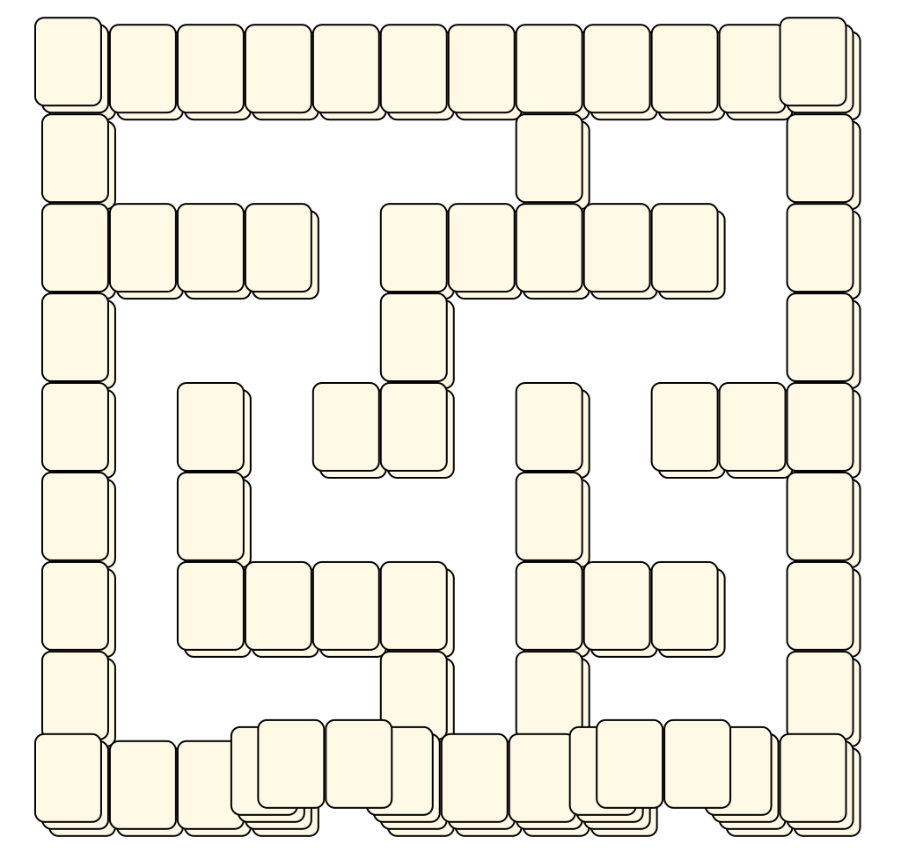<br> <sub>Tsubassa Kurenai</sub> <br>[.lay](./kurenai_other/labyrinth_2.lay)  [.layout](./kurenai_other/labyrinth_2.layout)  [.mah](./kurenai_other/labyrinth_2.mah) |Magic Four<br><br> <sub>Tsubassa Kurenai</sub> <br>[.lay](./kurenai_other/magic_four.lay)  [.layout](./kurenai_other/magic_four.layout)  [.mah](./kurenai_other/magic_four.mah) |Octaeder Field<br>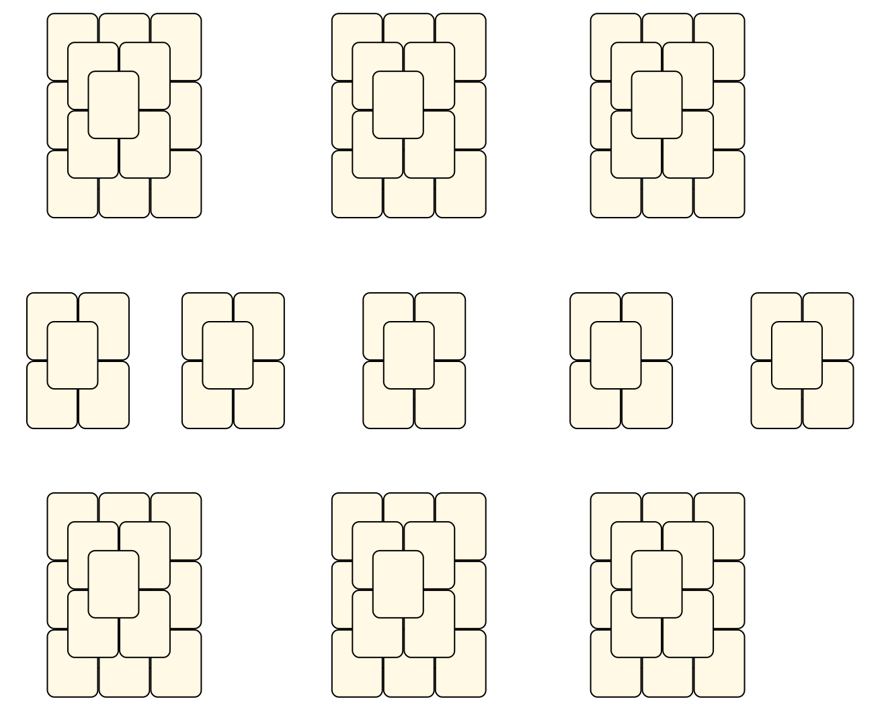<br> <sub>Tsubassa Kurenai</sub> <br>[.lay](./kurenai_other/octaeder_field.lay)  [.layout](./kurenai_other/octaeder_field.layout)  [.mah](./kurenai_other/octaeder_field.mah) |
|Parabolic Structure<br>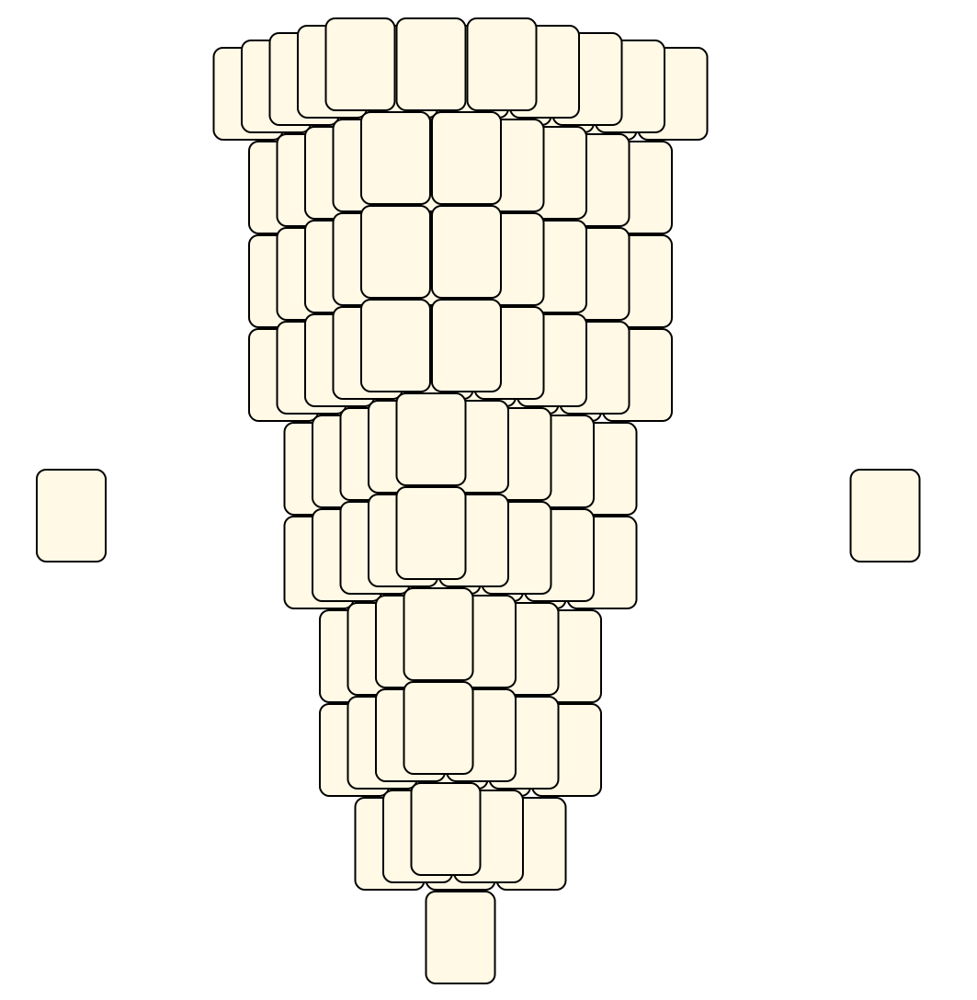<br> <sub>Jens Rose</sub> <br>[.lay](./kurenai_other/parabolic_structure.lay)  [.layout](./kurenai_other/parabolic_structure.layout)  [.mah](./kurenai_other/parabolic_structure.mah) |Parted Tables<br><br> <sub>Tsubassa Kurenai</sub> <br>[.lay](./kurenai_other/parted_tables.lay)  [.layout](./kurenai_other/parted_tables.layout)  [.mah](./kurenai_other/parted_tables.mah) |Platform With Stairs<br><br> <sub>Tsubassa Kurenai</sub> <br>[.lay](./kurenai_other/platform_with_stairs.lay)  [.layout](./kurenai_other/platform_with_stairs.layout)  [.mah](./kurenai_other/platform_with_stairs.mah) |
|Plugging System<br><br> <sub>Tsubassa Kurenai</sub> <br>[.lay](./kurenai_other/plugging_system.lay)  [.layout](./kurenai_other/plugging_system.layout)  [.mah](./kurenai_other/plugging_system.mah) |Ridicolous<br><br> <sub>Tsubassa Kurenai</sub> <br>[.lay](./kurenai_other/ridicolous.lay)  [.layout](./kurenai_other/ridicolous.layout)  [.mah](./kurenai_other/ridicolous.mah) |Sixpack<br><br> <sub>Tsubassa Kurenai</sub> <br>[.lay](./kurenai_other/sixpack.lay)  [.layout](./kurenai_other/sixpack.layout)  [.mah](./kurenai_other/sixpack.mah) |
|Spiral<br>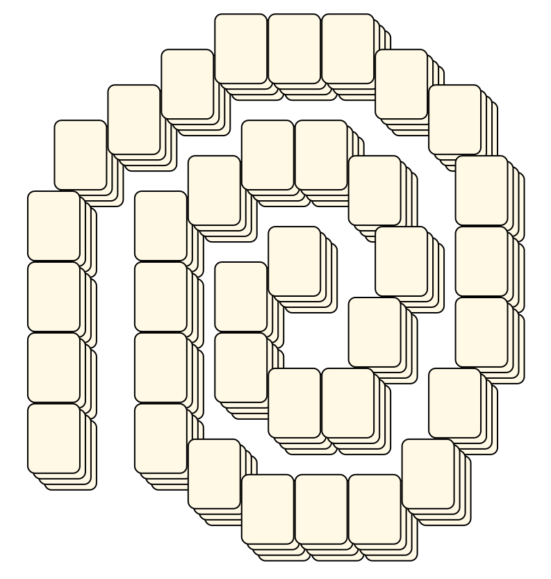<br> <sub>Tsubassa Kurenai</sub> <br>[.lay](./kurenai_other/spiral.lay)  [.layout](./kurenai_other/spiral.layout)  [.mah](./kurenai_other/spiral.mah) |Stairs<br>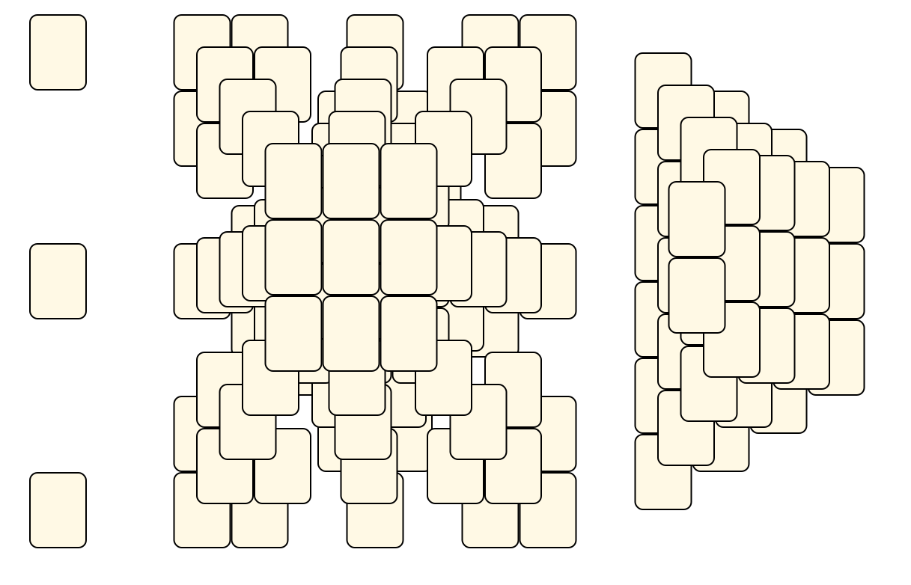<br> <sub>Tsubassa Kurenai</sub> <br>[.lay](./kurenai_other/stairs.lay)  [.layout](./kurenai_other/stairs.layout)  [.mah](./kurenai_other/stairs.mah) ||

## Pyramids
* Source: 
[https://web.archive.org/web/20230204113220/http://tsubassa-kurenai.de/Kyodai/Layouts/](https://web.archive.org/web/20230204113220/http://tsubassa-kurenai.de/Kyodai/Layouts/)

* File Source:  
<sub>```https://web.archive.org/web/20230204113220/http://tsubassa-kurenai.de/Kyodai/Layouts/```</sub>


|[kurenai_pyramids](kurenai_pyramids/README.md) ||Layouts: 13|
|:--:|:--:|:--:|
|Bordered Pyramid<br><br> <sub>Tsubassa Kurenai</sub> <br>[.lay](./kurenai_pyramids/bordered_pyramid.lay)  [.layout](./kurenai_pyramids/bordered_pyramid.layout)  [.mah](./kurenai_pyramids/bordered_pyramid.mah) |Eight Pyramids<br><br> <sub>Jens Rose</sub> <br>[.lay](./kurenai_pyramids/eight_pyramids.lay)  [.layout](./kurenai_pyramids/eight_pyramids.layout)  [.mah](./kurenai_pyramids/eight_pyramids.mah) |Eleven Pyramids<br>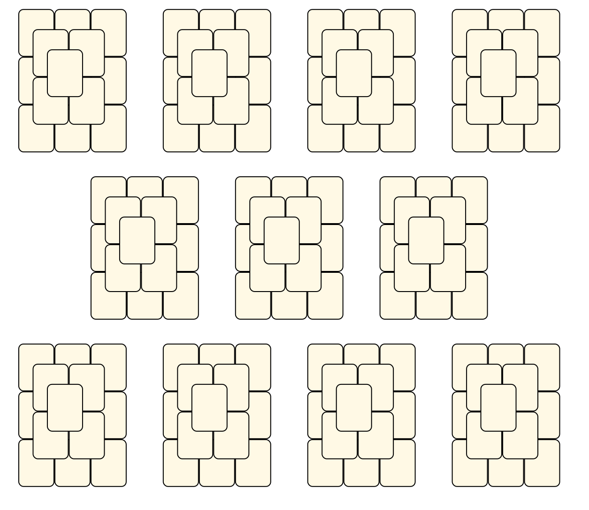<br> <sub>Jens Rose</sub> <br>[.lay](./kurenai_pyramids/eleven_pyramids.lay)  [.layout](./kurenai_pyramids/eleven_pyramids.layout)  [.mah](./kurenai_pyramids/eleven_pyramids.mah) |
|Four Pyramids<br>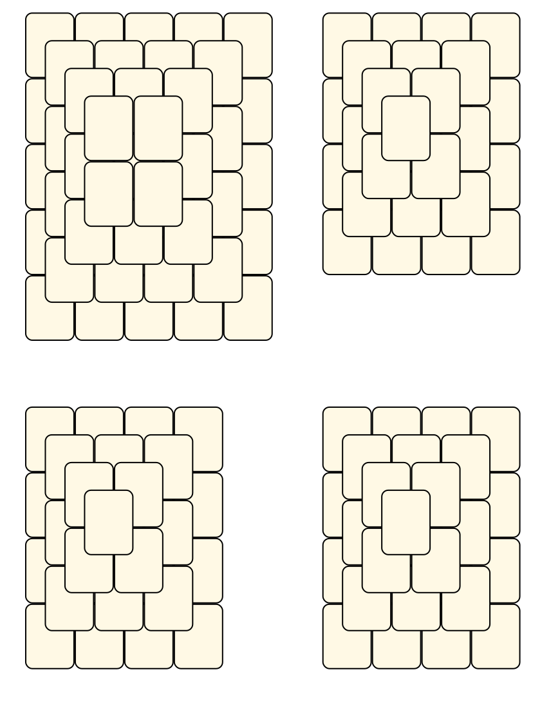<br> <sub>Tsubassa Kurenai</sub> <br>[.lay](./kurenai_pyramids/four_pyramids.lay)  [.layout](./kurenai_pyramids/four_pyramids.layout)  [.mah](./kurenai_pyramids/four_pyramids.mah) |Four Pyramids Linked<br><br> <sub>Tsubassa Kurenai</sub> <br>[.lay](./kurenai_pyramids/four_pyramids_linked.lay)  [.layout](./kurenai_pyramids/four_pyramids_linked.layout)  [.mah](./kurenai_pyramids/four_pyramids_linked.mah) |Hohle Pyramide<br><br> <sub>Tsubassa Kurenai</sub> <br>[.lay](./kurenai_pyramids/hohle_pyramide.lay)  [.layout](./kurenai_pyramids/hohle_pyramide.layout)  [.mah](./kurenai_pyramids/hohle_pyramide.mah) |
|Nine Pyramids<br>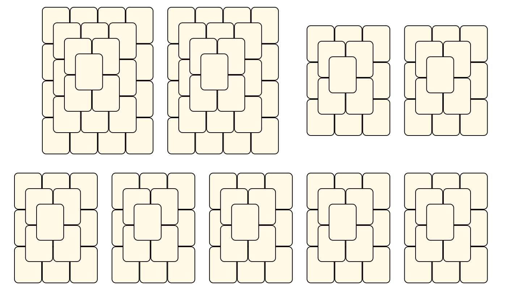<br> <sub>Jens Rose</sub> <br>[.lay](./kurenai_pyramids/nine_pyramids.lay)  [.layout](./kurenai_pyramids/nine_pyramids.layout)  [.mah](./kurenai_pyramids/nine_pyramids.mah) |One Pyramid<br>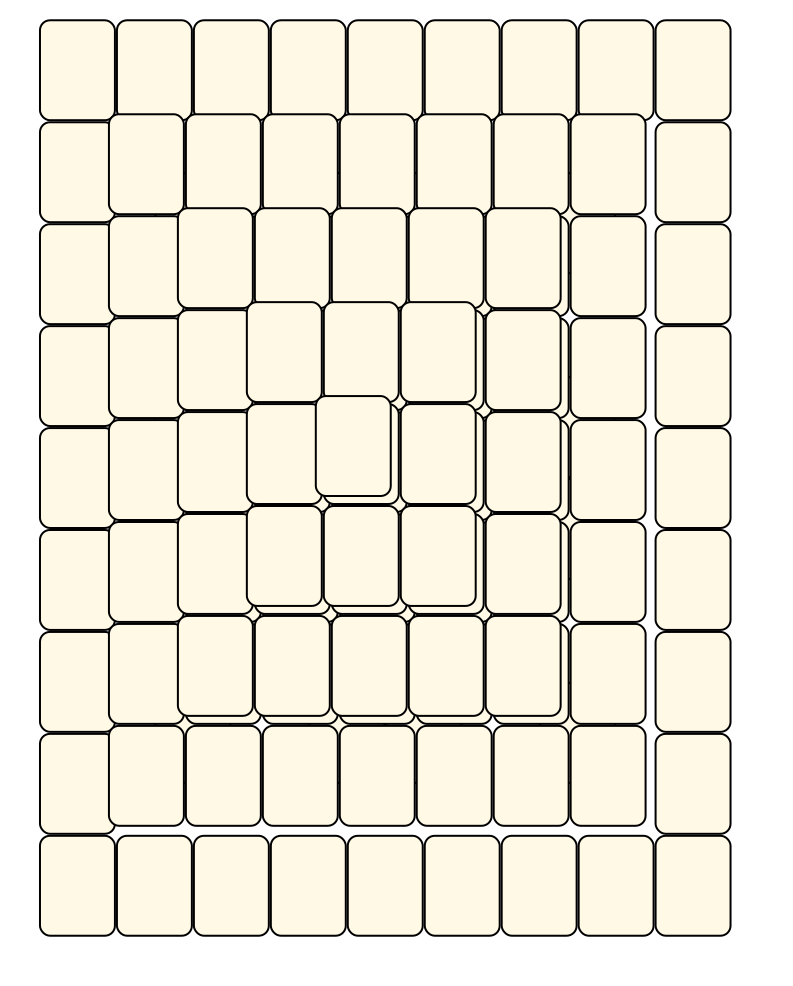<br> <sub>Jens Rose</sub> <br>[.lay](./kurenai_pyramids/one_pyramid.lay)  [.layout](./kurenai_pyramids/one_pyramid.layout)  [.mah](./kurenai_pyramids/one_pyramid.mah) |Six Pyramids<br><br> <sub>Tsubassa Kurenai</sub> <br>[.lay](./kurenai_pyramids/six_pyramids.lay)  [.layout](./kurenai_pyramids/six_pyramids.layout)  [.mah](./kurenai_pyramids/six_pyramids.mah) |
|Ten Pyramids<br><br> <sub>Jens Rose</sub> <br>[.lay](./kurenai_pyramids/ten_pyramids.lay)  [.layout](./kurenai_pyramids/ten_pyramids.layout)  [.mah](./kurenai_pyramids/ten_pyramids.mah) |Three Pyramids<br>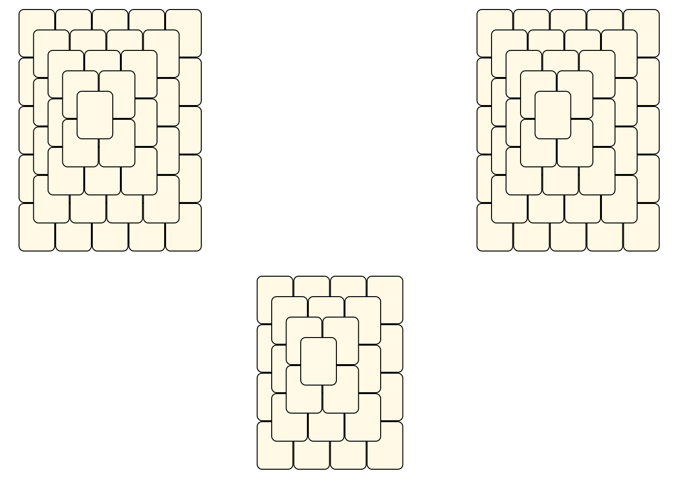<br> <sub>Tsubassa Kurenai</sub> <br>[.lay](./kurenai_pyramids/three_pyramids.lay)  [.layout](./kurenai_pyramids/three_pyramids.layout)  [.mah](./kurenai_pyramids/three_pyramids.mah) |Twelve Pyramids<br><br> <sub>Jens Rose</sub> <br>[.lay](./kurenai_pyramids/twelve_pyramids.lay)  [.layout](./kurenai_pyramids/twelve_pyramids.layout)  [.mah](./kurenai_pyramids/twelve_pyramids.mah) |
|Two Pyramids<br><br> <sub>Jens Rose</sub> <br>[.lay](./kurenai_pyramids/two_pyramids.lay)  [.layout](./kurenai_pyramids/two_pyramids.layout)  [.mah](./kurenai_pyramids/two_pyramids.mah) |||

## Script signs
* Source: 
[https://web.archive.org/web/20230204113220/http://tsubassa-kurenai.de/Kyodai/Layouts/](https://web.archive.org/web/20230204113220/http://tsubassa-kurenai.de/Kyodai/Layouts/)

* File Source:  
<sub>```https://web.archive.org/web/20230204113220/http://tsubassa-kurenai.de/Kyodai/Layouts/```</sub>


|[kurenai_signs](kurenai_signs/README.md) ||Layouts: 6|
|:--:|:--:|:--:|
|12345 Layout<br>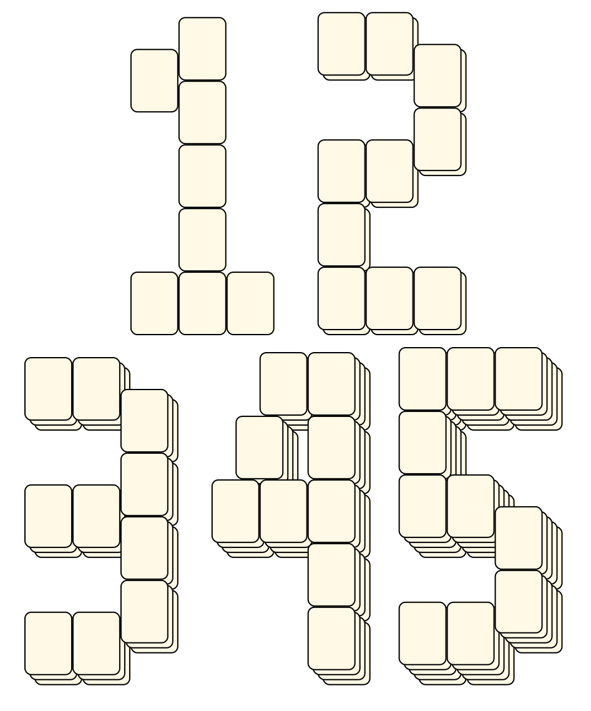<br> <sub>Jens Rose</sub> <br>[.lay](./kurenai_signs/12345_layout.lay)  [.layout](./kurenai_signs/12345_layout.layout)  [.mah](./kurenai_signs/12345_layout.mah) |Atwinding<br><br> <sub>Tsubassa Kurenai</sub> <br>[.lay](./kurenai_signs/atwinding.lay)  [.layout](./kurenai_signs/atwinding.layout)  [.mah](./kurenai_signs/atwinding.mah) |Chibi<br>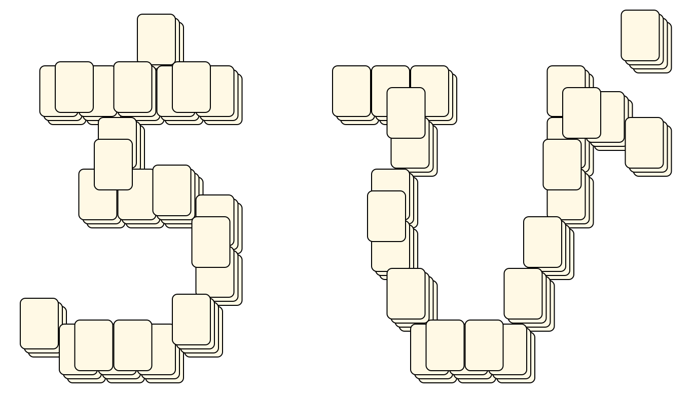<br> <sub>Tsubassa Kurenai</sub> <br>[.lay](./kurenai_signs/chibi.lay)  [.layout](./kurenai_signs/chibi.layout)  [.mah](./kurenai_signs/chibi.mah) |
|News<br><br> <sub>Tsubassa Kurenai</sub> <br>[.lay](./kurenai_signs/news.lay)  [.layout](./kurenai_signs/news.layout)  [.mah](./kurenai_signs/news.mah) |Question Mark<br><br> <sub>Tsubassa Kurenai</sub> <br>[.lay](./kurenai_signs/question_mark.lay)  [.layout](./kurenai_signs/question_mark.layout)  [.mah](./kurenai_signs/question_mark.mah) |Tsuku<br><br> <sub>Tsubassa Kurenai</sub> <br>[.lay](./kurenai_signs/tsuku.lay)  [.layout](./kurenai_signs/tsuku.layout)  [.mah](./kurenai_signs/tsuku.mah) |

## Stacks
* Source: 
[https://web.archive.org/web/20230204113220/http://tsubassa-kurenai.de/Kyodai/Layouts/](https://web.archive.org/web/20230204113220/http://tsubassa-kurenai.de/Kyodai/Layouts/)

* File Source:  
<sub>```https://web.archive.org/web/20230204113220/http://tsubassa-kurenai.de/Kyodai/Layouts/```</sub>


|[kurenai_stacks](kurenai_stacks/README.md) ||Layouts: 6|
|:--:|:--:|:--:|
|Hexagon Stack<br><br> <sub>Tsubassa Kurenai</sub> <br>[.lay](./kurenai_stacks/hexagon_stack_2.lay)  [.layout](./kurenai_stacks/hexagon_stack_2.layout)  [.mah](./kurenai_stacks/hexagon_stack_2.mah) |Kreuz Und Quer<br><br> <sub>Tsubassa Kurenai</sub> <br>[.lay](./kurenai_stacks/kreuz_und_quer.lay)  [.layout](./kurenai_stacks/kreuz_und_quer.layout)  [.mah](./kurenai_stacks/kreuz_und_quer.mah) |Traditional<br><br> <sub>Tsubassa Kurenai</sub> <br>[.lay](./kurenai_stacks/traditional.lay)  [.layout](./kurenai_stacks/traditional.layout)  [.mah](./kurenai_stacks/traditional.mah) |
|Traditional Based Three Flats<br><br> <sub>Tsubassa Kurenai</sub> <br>[.lay](./kurenai_stacks/traditional_based_three_flats.lay)  [.layout](./kurenai_stacks/traditional_based_three_flats.layout)  [.mah](./kurenai_stacks/traditional_based_three_flats.mah) |Triangle Palette Stack<br><br> <sub>Tsubassa Kurenai</sub> <br>[.lay](./kurenai_stacks/triangle_palette_stack.lay)  [.layout](./kurenai_stacks/triangle_palette_stack.layout)  [.mah](./kurenai_stacks/triangle_palette_stack.mah) |Two Stacks<br><br> <sub>Tsubassa Kurenai</sub> <br>[.lay](./kurenai_stacks/two_stacks.lay)  [.layout](./kurenai_stacks/two_stacks.layout)  [.mah](./kurenai_stacks/two_stacks.mah) |

## Chinese Zodiac
* Source: 
[https://web.archive.org/web/20230204113220/http://tsubassa-kurenai.de/Kyodai/Layouts/](https://web.archive.org/web/20230204113220/http://tsubassa-kurenai.de/Kyodai/Layouts/)

* File Source:  
<sub>```https://web.archive.org/web/20230204113220/http://tsubassa-kurenai.de/Kyodai/Layouts/```</sub>


|[kurenai_zodiacs](kurenai_zodiacs/README.md) ||Layouts: 12|
|:--:|:--:|:--:|
|Ape<br><br> <sub>Tsubassa Kurenai</sub> <br>[.lay](./kurenai_zodiacs/ape.lay)  [.layout](./kurenai_zodiacs/ape.layout)  [.mah](./kurenai_zodiacs/ape.mah) |Cat<br>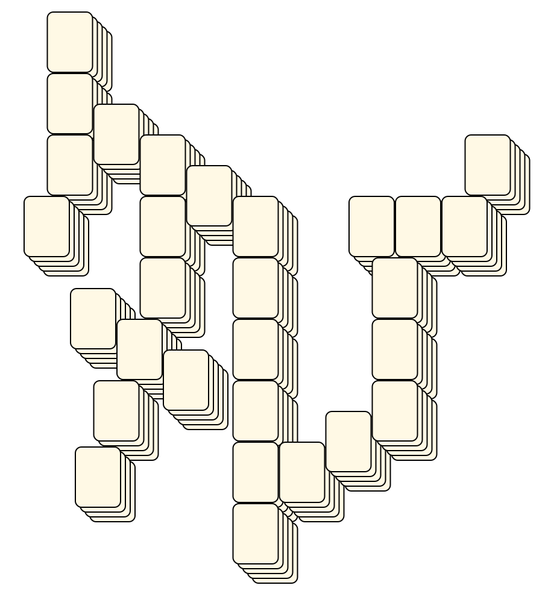<br> <sub>Tsubassa Kurenai</sub> <br>[.lay](./kurenai_zodiacs/cat.lay)  [.layout](./kurenai_zodiacs/cat.layout)  [.mah](./kurenai_zodiacs/cat.mah) |Cock<br><br> <sub>Tsubassa Kurenai</sub> <br>[.lay](./kurenai_zodiacs/cock.lay)  [.layout](./kurenai_zodiacs/cock.layout)  [.mah](./kurenai_zodiacs/cock.mah) |
|Dog<br><br> <sub>Tsubassa Kurenai</sub> <br>[.lay](./kurenai_zodiacs/dog.lay)  [.layout](./kurenai_zodiacs/dog.layout)  [.mah](./kurenai_zodiacs/dog.mah) |Dragon<br><br> <sub>Tsubassa Kurenai</sub> <br>[.lay](./kurenai_zodiacs/dragon.lay)  [.layout](./kurenai_zodiacs/dragon.layout)  [.mah](./kurenai_zodiacs/dragon.mah) |Horse<br><br> <sub>Tsubassa Kurenai</sub> <br>[.lay](./kurenai_zodiacs/horse.lay)  [.layout](./kurenai_zodiacs/horse.layout)  [.mah](./kurenai_zodiacs/horse.mah) |
|Ox<br><br> <sub>Tsubassa Kurenai</sub> <br>[.lay](./kurenai_zodiacs/ox.lay)  [.layout](./kurenai_zodiacs/ox.layout)  [.mah](./kurenai_zodiacs/ox.mah) |Rat<br><br> <sub>Tsubassa Kurenai</sub> <br>[.lay](./kurenai_zodiacs/rat.lay)  [.layout](./kurenai_zodiacs/rat.layout)  [.mah](./kurenai_zodiacs/rat.mah) |Sheep<br><br> <sub>Tsubassa Kurenai</sub> <br>[.lay](./kurenai_zodiacs/sheep.lay)  [.layout](./kurenai_zodiacs/sheep.layout)  [.mah](./kurenai_zodiacs/sheep.mah) |
|Snake<br><br> <sub>Tsubassa Kurenai</sub> <br>[.lay](./kurenai_zodiacs/snake.lay)  [.layout](./kurenai_zodiacs/snake.layout)  [.mah](./kurenai_zodiacs/snake.mah) |Swine<br><br> <sub>Tsubassa Kurenai</sub> <br>[.lay](./kurenai_zodiacs/swine.lay)  [.layout](./kurenai_zodiacs/swine.layout)  [.mah](./kurenai_zodiacs/swine.mah) |Tiger<br><br> <sub>Tsubassa Kurenai</sub> <br>[.lay](./kurenai_zodiacs/tiger.lay)  [.layout](./kurenai_zodiacs/tiger.layout)  [.mah](./kurenai_zodiacs/tiger.mah) |