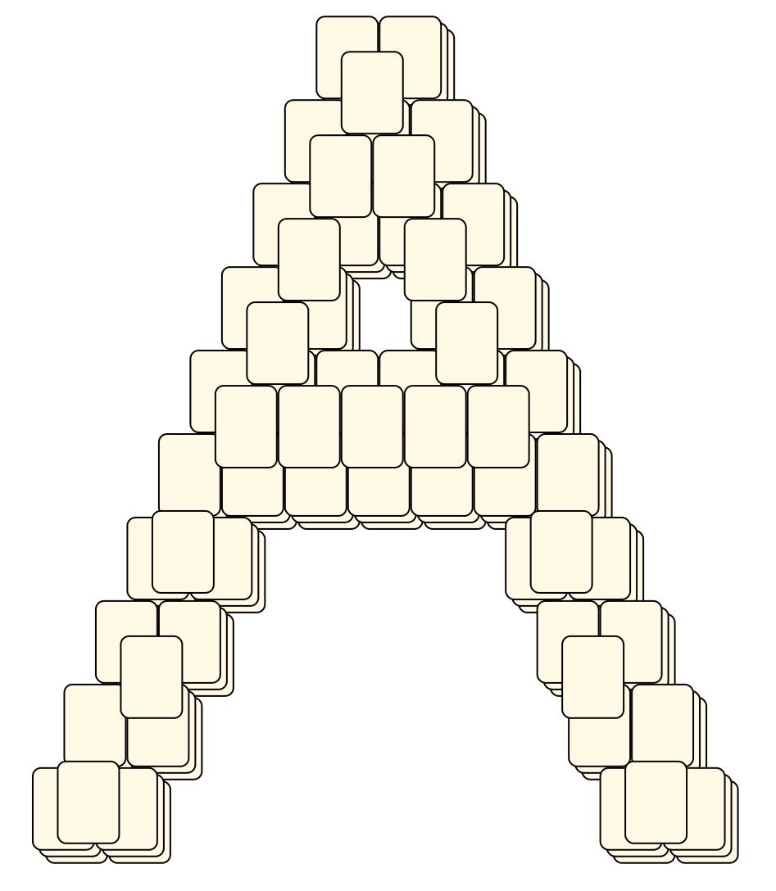
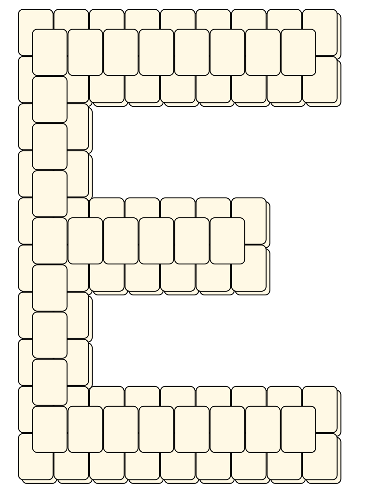
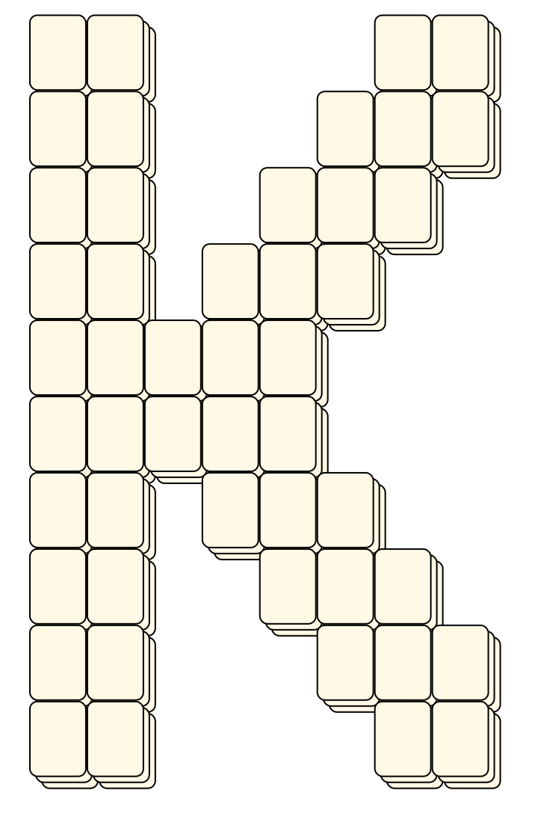
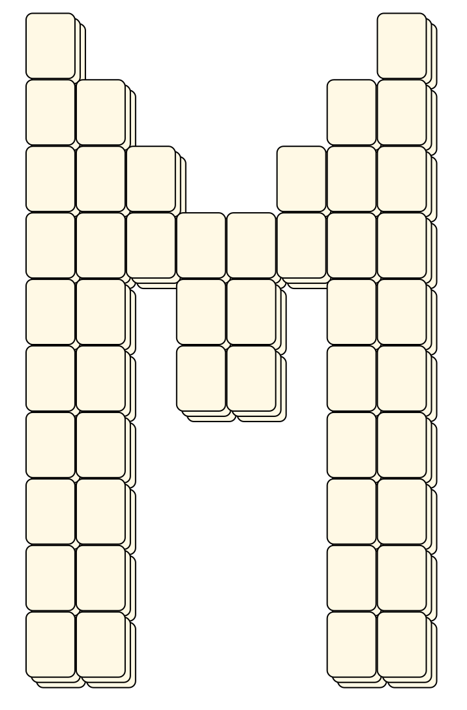
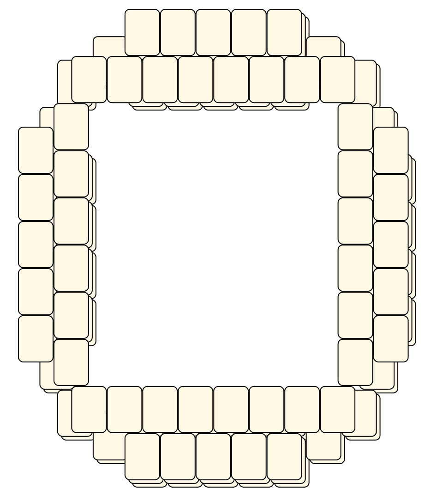
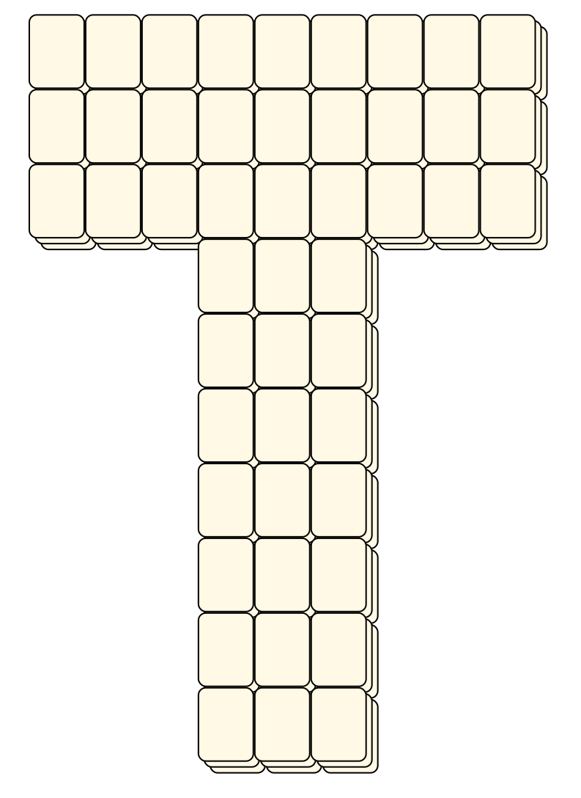
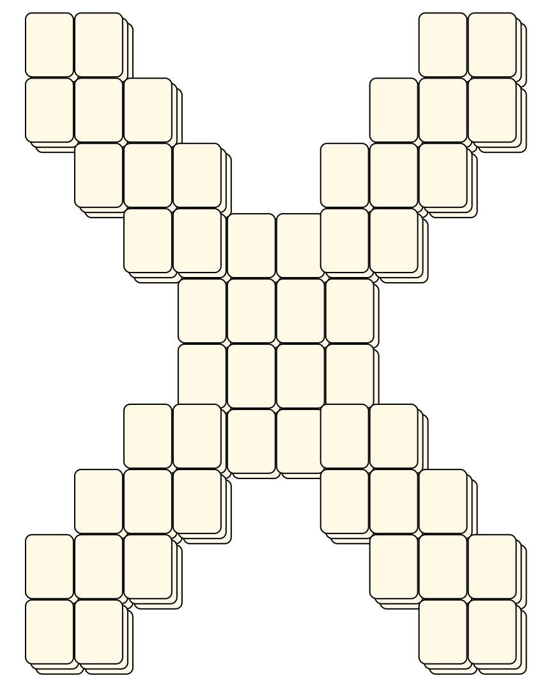
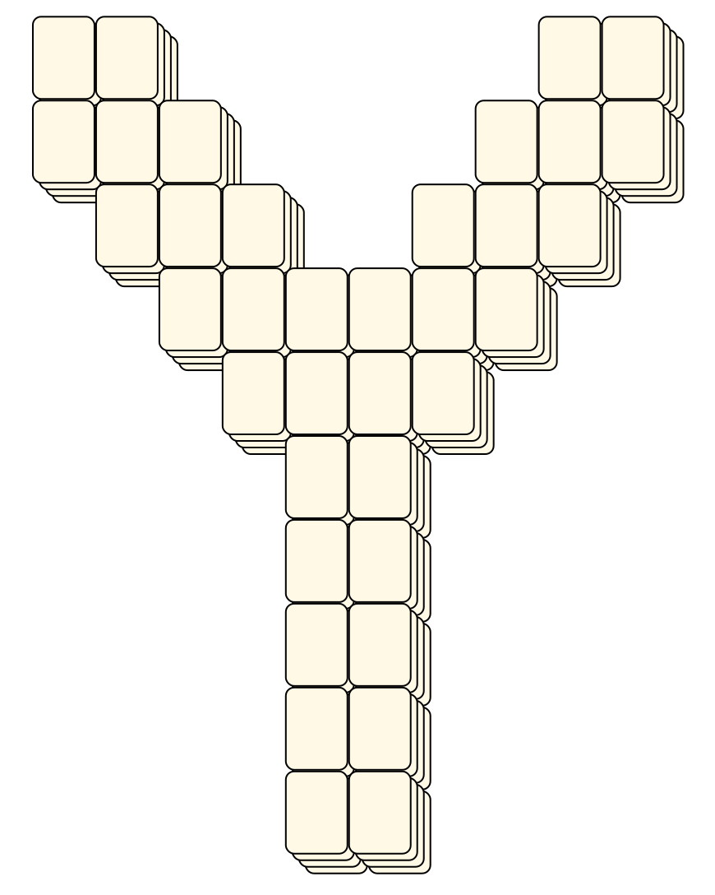

# Mahjong Solitaire Layout Museum: Alphabet
* Source: [https://web.archive.org/web/20230204113220/http://tsubassa-kurenai.de/Kyodai/Layouts/](https://web.archive.org/web/20230204113220/http://tsubassa-kurenai.de/Kyodai/Layouts/)

* File Source:  
<sub>```https://web.archive.org/web/20230204113220/http://tsubassa-kurenai.de/Kyodai/Layouts/Alphabet.zip```</sub>


|Alphabet||Layouts: 26|
|:--:|:--:|:--:|
|Letter A<br><br> <sub>Tsubassa Kurenai</sub> <br>[.lay](./letter_a.lay)  [.layout](./letter_a.layout)  [.mah](./letter_a.mah) |Letter B<br><br> <sub>Tsubassa Kurenai</sub> <br>[.lay](./letter_b.lay)  [.layout](./letter_b.layout)  [.mah](./letter_b.mah) |Letter C<br><br> <sub>Tsubassa Kurenai</sub> <br>[.lay](./letter_c.lay)  [.layout](./letter_c.layout)  [.mah](./letter_c.mah) |
|Letter D<br><br> <sub>Tsubassa Kurenai</sub> <br>[.lay](./letter_d.lay)  [.layout](./letter_d.layout)  [.mah](./letter_d.mah) |Letter E<br><br> <sub>Tsubassa Kurenai</sub> <br>[.lay](./letter_e.lay)  [.layout](./letter_e.layout)  [.mah](./letter_e.mah) |Letter F<br><br> <sub>Tsubassa Kurenai</sub> <br>[.lay](./letter_f.lay)  [.layout](./letter_f.layout)  [.mah](./letter_f.mah) |
|Letter G<br><br> <sub>Tsubassa Kurenai</sub> <br>[.lay](./letter_g.lay)  [.layout](./letter_g.layout)  [.mah](./letter_g.mah) |Letter H<br><br> <sub>Tsubassa Kurenai</sub> <br>[.lay](./letter_h.lay)  [.layout](./letter_h.layout)  [.mah](./letter_h.mah) |Letter I<br><br> <sub>Tsubassa Kurenai</sub> <br>[.lay](./letter_i.lay)  [.layout](./letter_i.layout)  [.mah](./letter_i.mah) |
|Letter J<br><br> <sub>Tsubassa Kurenai</sub> <br>[.lay](./letter_j.lay)  [.layout](./letter_j.layout)  [.mah](./letter_j.mah) |Letter K<br><br> <sub>Tsubassa Kurenai</sub> <br>[.lay](./letter_k.lay)  [.layout](./letter_k.layout)  [.mah](./letter_k.mah) |Letter L<br><br> <sub>Tsubassa Kurenai</sub> <br>[.lay](./letter_l.lay)  [.layout](./letter_l.layout)  [.mah](./letter_l.mah) |
|Letter M<br><br> <sub>Tsubassa Kurenai</sub> <br>[.lay](./letter_m.lay)  [.layout](./letter_m.layout)  [.mah](./letter_m.mah) |Letter N<br><br> <sub>Tsubassa Kurenai</sub> <br>[.lay](./letter_n.lay)  [.layout](./letter_n.layout)  [.mah](./letter_n.mah) |Letter O<br><br> <sub>Tsubassa Kurenai</sub> <br>[.lay](./letter_o.lay)  [.layout](./letter_o.layout)  [.mah](./letter_o.mah) |
|Letter P<br><br> <sub>Tsubassa Kurenai</sub> <br>[.lay](./letter_p.lay)  [.layout](./letter_p.layout)  [.mah](./letter_p.mah) |Letter Q<br><br> <sub>Tsubassa Kurenai</sub> <br>[.lay](./letter_q.lay)  [.layout](./letter_q.layout)  [.mah](./letter_q.mah) |Letter R<br><br> <sub>Tsubassa Kurenai</sub> <br>[.lay](./letter_r.lay)  [.layout](./letter_r.layout)  [.mah](./letter_r.mah) |
|Letter S<br><br> <sub>Tsubassa Kurenai</sub> <br>[.lay](./letter_s.lay)  [.layout](./letter_s.layout)  [.mah](./letter_s.mah) |Letter T<br><br> <sub>Tsubassa Kurenai</sub> <br>[.lay](./letter_t.lay)  [.layout](./letter_t.layout)  [.mah](./letter_t.mah) |Letter U<br><br> <sub>Tsubassa Kurenai</sub> <br>[.lay](./letter_u.lay)  [.layout](./letter_u.layout)  [.mah](./letter_u.mah) |
|Letter V<br><br> <sub>Tsubassa Kurenai</sub> <br>[.lay](./letter_v.lay)  [.layout](./letter_v.layout)  [.mah](./letter_v.mah) |Letter W<br><br> <sub>Tsubassa Kurenai</sub> <br>[.lay](./letter_w.lay)  [.layout](./letter_w.layout)  [.mah](./letter_w.mah) |Letter X<br><br> <sub>Tsubassa Kurenai</sub> <br>[.lay](./letter_x.lay)  [.layout](./letter_x.layout)  [.mah](./letter_x.mah) |
|Letter Y<br><br> <sub>Tsubassa Kurenai</sub> <br>[.lay](./letter_y.lay)  [.layout](./letter_y.layout)  [.mah](./letter_y.mah) |Letter Z<br><br> <sub>Tsubassa Kurenai</sub> <br>[.lay](./letter_z.lay)  [.layout](./letter_z.layout)  [.mah](./letter_z.mah) ||