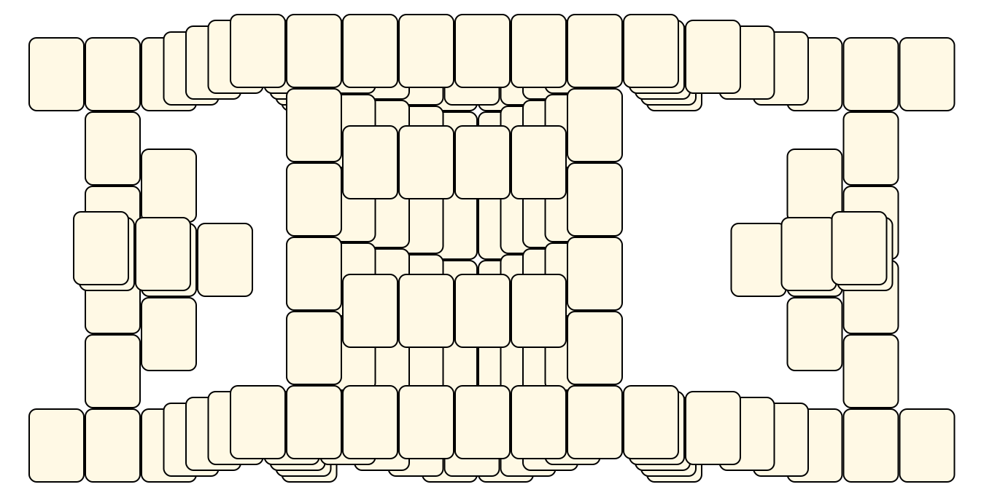
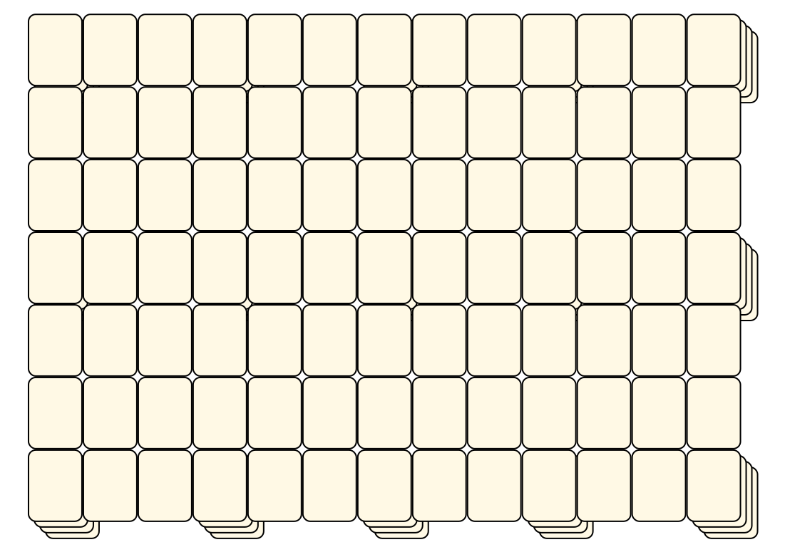

# Mahjong Solitaire Layout Museum: Floater
* Source: [https://web.archive.org/web/20230204113220/http://tsubassa-kurenai.de/Kyodai/Layouts/](https://web.archive.org/web/20230204113220/http://tsubassa-kurenai.de/Kyodai/Layouts/)

* File Source:  
<sub>```https://web.archive.org/web/20230204113220/http://tsubassa-kurenai.de/Kyodai/Layouts/```</sub>


|Floater||Layouts: 7|
|:--:|:--:|:--:|
|Floating City<br><br> <sub>Will O'Connell</sub> <br>[.lay](./floating_city.lay)  [.layout](./floating_city.layout)  [.mah](./floating_city.mah) |Fortress<br><br> <sub>Tsubassa Kurenai</sub> <br>[.lay](./fortress.lay)  [.layout](./fortress.layout)  [.mah](./fortress.mah) |Hourglass<br><br> <sub>Michael Buckland</sub> <br>[.lay](./hourglass.lay)  [.layout](./hourglass.layout)  [.mah](./hourglass.mah) |
|Manipulation Test 36 Tiles Oo 72<br><br> <sub>Tsubassa Kurenai</sub> <br>[.lay](./manipulation_test_36_tiles_oo_72.lay)  [.layout](./manipulation_test_36_tiles_oo_72.layout)  [.mah](./manipulation_test_36_tiles_oo_72.mah) |Pillars With Roof<br><br> <sub>Tsubassa Kurenai</sub> <br>[.lay](./pillars_with_roof.lay)  [.layout](./pillars_with_roof.layout)  [.mah](./pillars_with_roof.mah) |Towers And Arch<br><br> <sub>Tsubassa Kurenai</sub> <br>[.lay](./towers_and_arch.lay)  [.layout](./towers_and_arch.layout)  [.mah](./towers_and_arch.mah) |
|Two Hollow Tubes<br><br> <sub>Tsubassa Kurenai</sub> <br>[.lay](./two_hollow_tubes.lay)  [.layout](./two_hollow_tubes.layout)  [.mah](./two_hollow_tubes.mah) |||