# Mahjong Solitaire Layout Museum: Tile Layouts
* Source: [https://web.archive.org/web/20230204113220/http://tsubassa-kurenai.de/Kyodai/Layouts/](https://web.archive.org/web/20230204113220/http://tsubassa-kurenai.de/Kyodai/Layouts/)

* File Source:  
<sub>```https://web.archive.org/web/20230204113220/http://tsubassa-kurenai.de/Kyodai/Layouts/Tile-Layouts.zip```</sub>


|Tile Layouts||Layouts: 42|
|:--:|:--:|:--:|
|Autumn<br>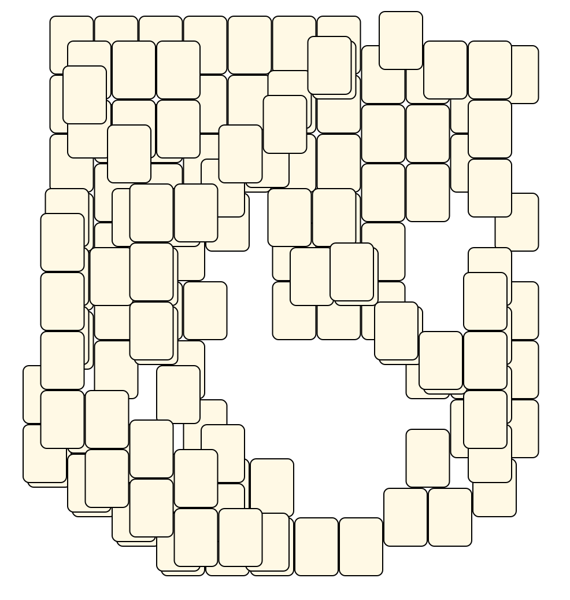<br> <sub>Tsubassa Kurenai</sub> <br>[.lay](./autumn.lay)  [.layout](./autumn.layout)  [.mah](./autumn.mah) |Bam 1<br><br> <sub>Tsubassa Kurenai</sub> <br>[.lay](./bam_1.lay)  [.layout](./bam_1.layout)  [.mah](./bam_1.mah) |Bam 2<br><br> <sub>Tsubassa Kurenai</sub> <br>[.lay](./bam_2.lay)  [.layout](./bam_2.layout)  [.mah](./bam_2.mah) |
|Bam 3<br>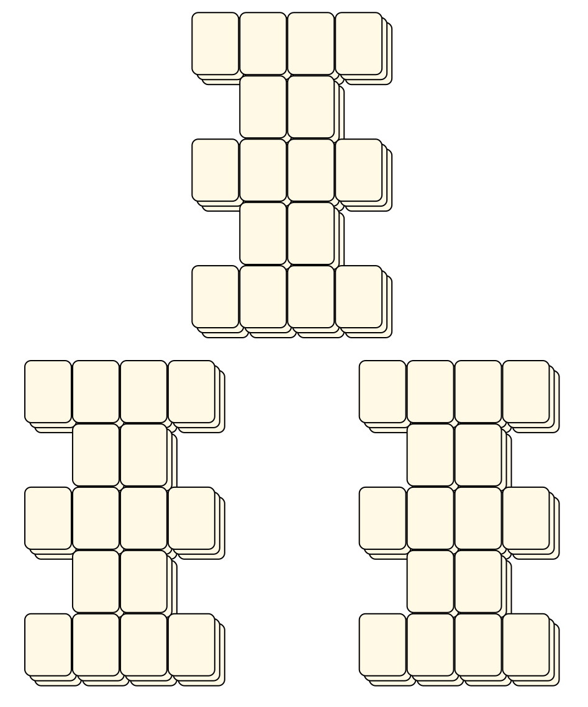<br> <sub>Tsubassa Kurenai</sub> <br>[.lay](./bam_3.lay)  [.layout](./bam_3.layout)  [.mah](./bam_3.mah) |Bam 4<br><br> <sub>Tsubassa Kurenai</sub> <br>[.lay](./bam_4.lay)  [.layout](./bam_4.layout)  [.mah](./bam_4.mah) |Bam 5<br><br> <sub>Tsubassa Kurenai</sub> <br>[.lay](./bam_5.lay)  [.layout](./bam_5.layout)  [.mah](./bam_5.mah) |
|Bam 6<br><br> <sub>Tsubassa Kurenai</sub> <br>[.lay](./bam_6.lay)  [.layout](./bam_6.layout)  [.mah](./bam_6.mah) |Bam 7<br>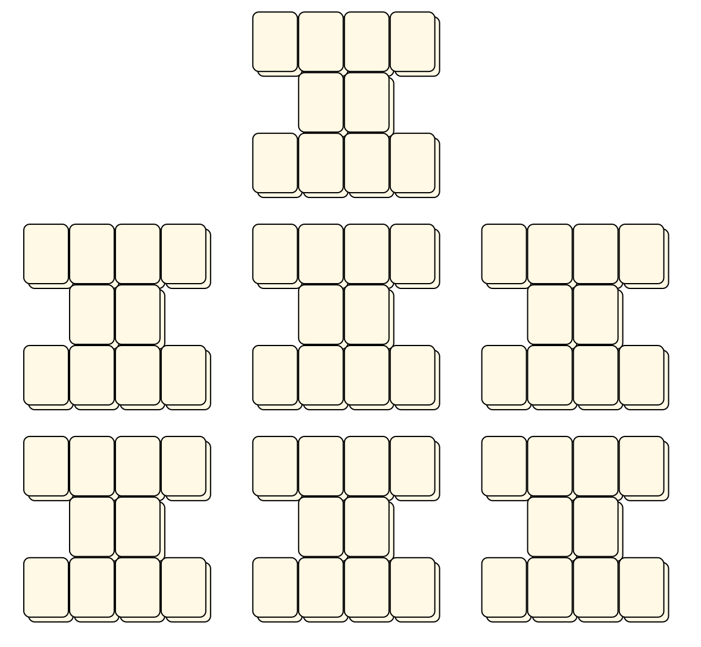<br> <sub>Tsubassa Kurenai</sub> <br>[.lay](./bam_7.lay)  [.layout](./bam_7.layout)  [.mah](./bam_7.mah) |Bam 8<br><br> <sub>Tsubassa Kurenai</sub> <br>[.lay](./bam_8.lay)  [.layout](./bam_8.layout)  [.mah](./bam_8.mah) |
|Bam 9<br><br> <sub>Tsubassa Kurenai</sub> <br>[.lay](./bam_9.lay)  [.layout](./bam_9.layout)  [.mah](./bam_9.mah) |Bamboo<br><br> <sub>Tsubassa Kurenai</sub> <br>[.lay](./bamboo.lay)  [.layout](./bamboo.layout)  [.mah](./bamboo.mah) |Bei<br><br> <sub>Tsubassa Kurenai</sub> <br>[.lay](./bei.lay)  [.layout](./bei.layout)  [.mah](./bei.mah) |
|Dong<br><br> <sub>Tsubassa Kurenai</sub> <br>[.lay](./dong.lay)  [.layout](./dong.layout)  [.mah](./dong.mah) |Dot 1<br><br> <sub>Tsubassa Kurenai</sub> <br>[.lay](./dot_1.lay)  [.layout](./dot_1.layout)  [.mah](./dot_1.mah) |Dots 2<br>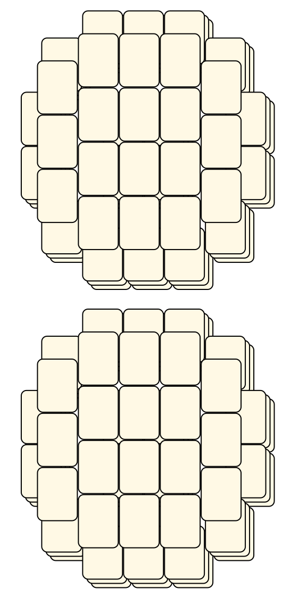<br> <sub>Tsubassa Kurenai</sub> <br>[.lay](./dots_2.lay)  [.layout](./dots_2.layout)  [.mah](./dots_2.mah) |
|Dots 3<br><br> <sub>Tsubassa Kurenai</sub> <br>[.lay](./dots_3.lay)  [.layout](./dots_3.layout)  [.mah](./dots_3.mah) |Dots 4<br>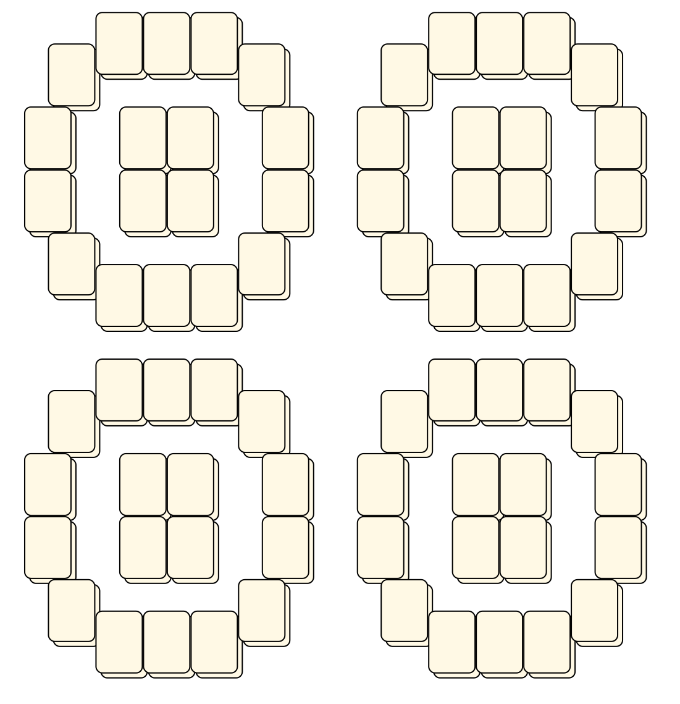<br> <sub>Tsubassa Kurenai</sub> <br>[.lay](./dots_4.lay)  [.layout](./dots_4.layout)  [.mah](./dots_4.mah) |Dots 5<br><br> <sub>Tsubassa Kurenai</sub> <br>[.lay](./dots_5.lay)  [.layout](./dots_5.layout)  [.mah](./dots_5.mah) |
|Dots 6<br><br> <sub>Tsubassa Kurenai</sub> <br>[.lay](./dots_6.lay)  [.layout](./dots_6.layout)  [.mah](./dots_6.mah) |Dots 7<br><br> <sub>Tsubassa Kurenai</sub> <br>[.lay](./dots_7.lay)  [.layout](./dots_7.layout)  [.mah](./dots_7.mah) |Dots 8<br><br> <sub>Tsubassa Kurenai</sub> <br>[.lay](./dots_8.lay)  [.layout](./dots_8.layout)  [.mah](./dots_8.mah) |
|Dots 9<br><br> <sub>Tsubassa Kurenai</sub> <br>[.lay](./dots_9.lay)  [.layout](./dots_9.layout)  [.mah](./dots_9.mah) |Green Dragon<br>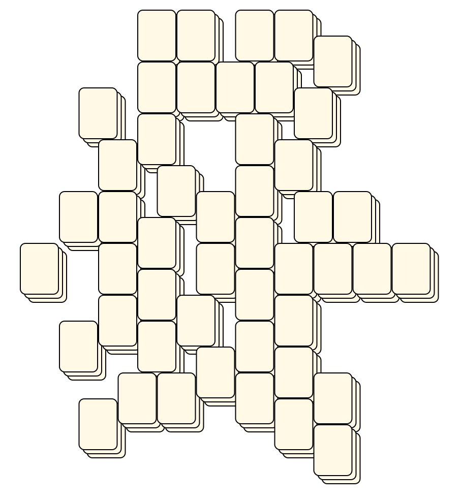<br> <sub>Tsubassa Kurenai</sub> <br>[.lay](./green_dragon.lay)  [.layout](./green_dragon.layout)  [.mah](./green_dragon.mah) |Mumlum<br>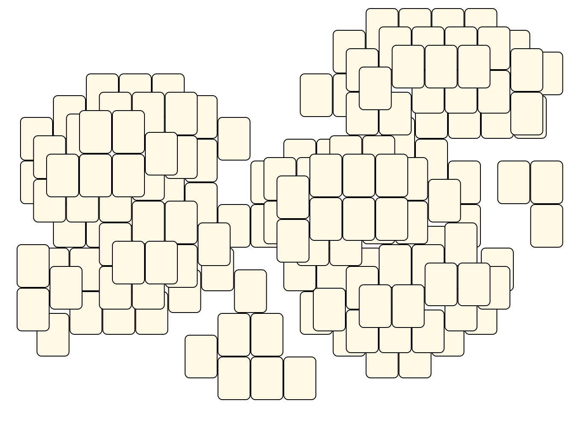<br> <sub>Tsubassa Kurenai</sub> <br>[.lay](./mumlum.lay)  [.layout](./mumlum.layout)  [.mah](./mumlum.mah) |
|Nan<br><br> <sub>Tsubassa Kurenai</sub> <br>[.lay](./nan.lay)  [.layout](./nan.layout)  [.mah](./nan.mah) |Orchis<br><br> <sub>Tsubassa Kurenai</sub> <br>[.lay](./orchis.lay)  [.layout](./orchis.layout)  [.mah](./orchis.mah) |Plum<br>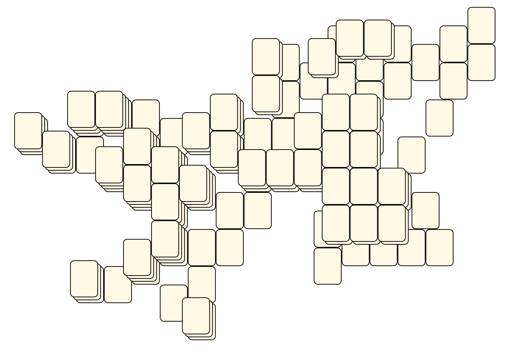<br> <sub>Tsubassa Kurenai</sub> <br>[.lay](./plum.lay)  [.layout](./plum.layout)  [.mah](./plum.mah) |
|Red Dragon<br><br> <sub>Tsubassa Kurenai</sub> <br>[.lay](./red_dragon.lay)  [.layout](./red_dragon.layout)  [.mah](./red_dragon.mah) |Spring<br><br> <sub>Tsubassa Kurenai</sub> <br>[.lay](./spring.lay)  [.layout](./spring.layout)  [.mah](./spring.mah) |Summer<br>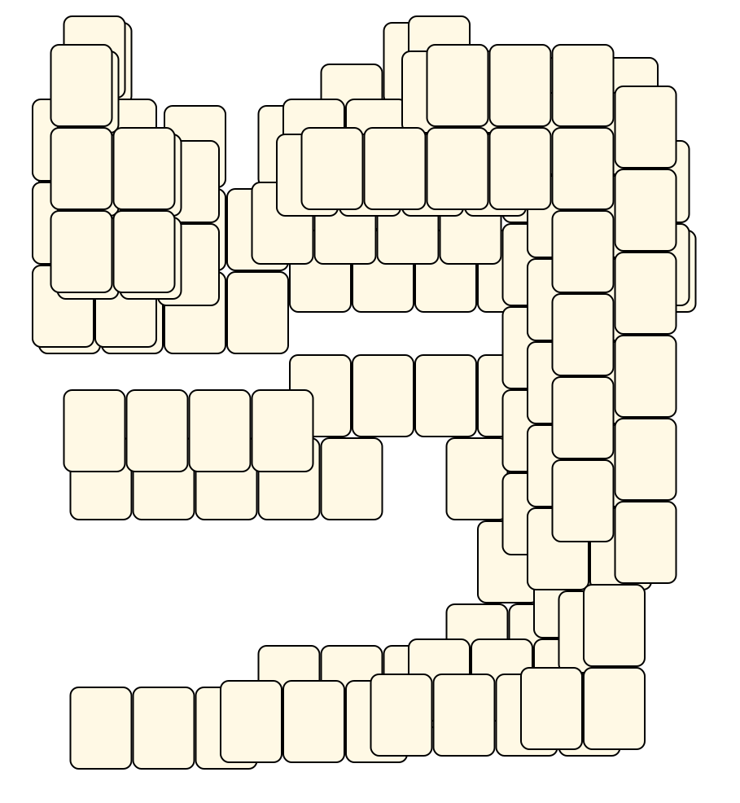<br> <sub>Tsubassa Kurenai</sub> <br>[.lay](./summer.lay)  [.layout](./summer.layout)  [.mah](./summer.mah) |
|Wan 1<br>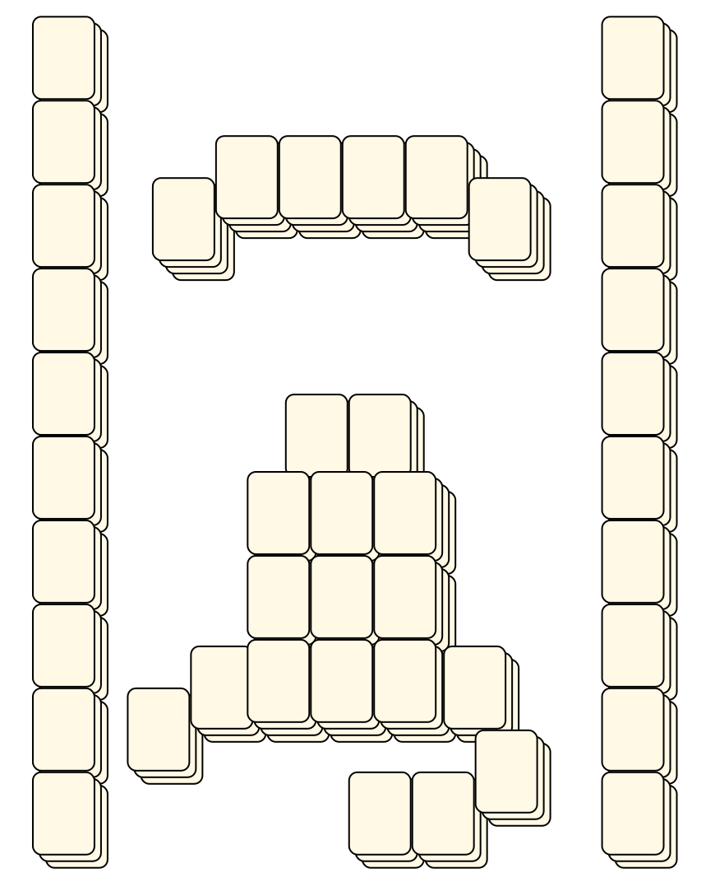<br> <sub>Tsubassa Kurenai</sub> <br>[.lay](./wan_1.lay)  [.layout](./wan_1.layout)  [.mah](./wan_1.mah) |Wan 2<br><br> <sub>Tsubassa Kurenai</sub> <br>[.lay](./wan_2.lay)  [.layout](./wan_2.layout)  [.mah](./wan_2.mah) |Wan 3<br><br> <sub>Tsubassa Kurenai</sub> <br>[.lay](./wan_3.lay)  [.layout](./wan_3.layout)  [.mah](./wan_3.mah) |
|Wan 4<br><br> <sub>Tsubassa Kurenai</sub> <br>[.lay](./wan_4.lay)  [.layout](./wan_4.layout)  [.mah](./wan_4.mah) |Wan 5<br><br> <sub>Tsubassa Kurenai</sub> <br>[.lay](./wan_5.lay)  [.layout](./wan_5.layout)  [.mah](./wan_5.mah) |Wan 6<br>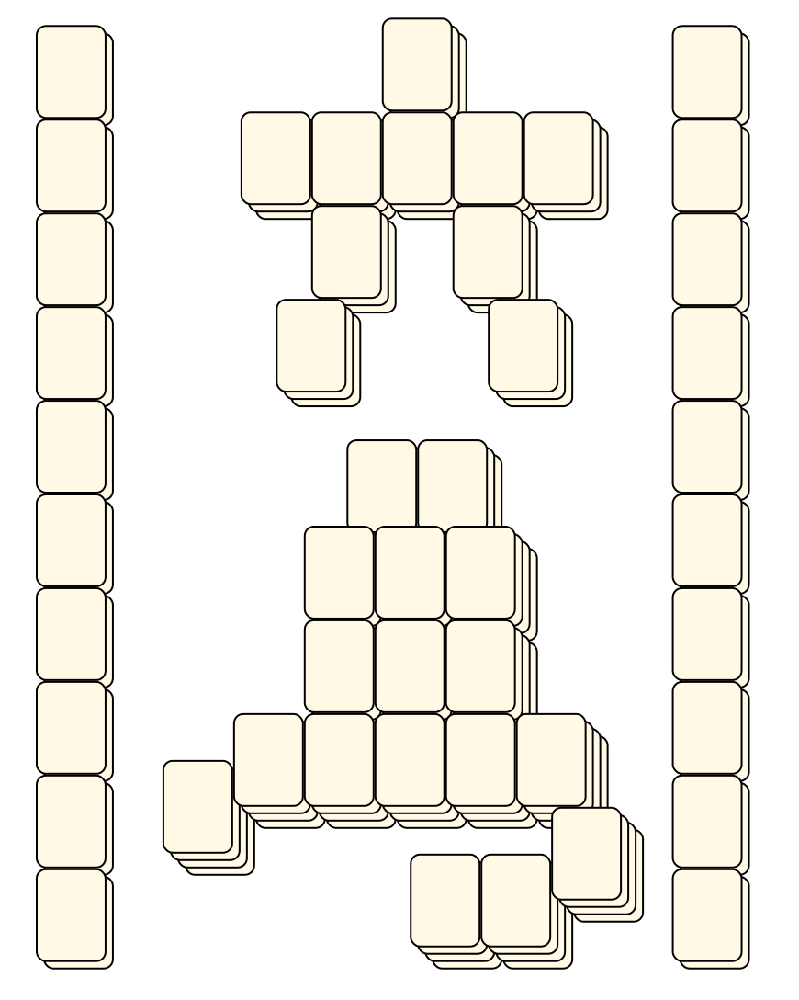<br> <sub>Tsubassa Kurenai</sub> <br>[.lay](./wan_6.lay)  [.layout](./wan_6.layout)  [.mah](./wan_6.mah) |
|Wan 7<br><br> <sub>Tsubassa Kurenai</sub> <br>[.lay](./wan_7.lay)  [.layout](./wan_7.layout)  [.mah](./wan_7.mah) |Wan 8<br><br> <sub>Tsubassa Kurenai</sub> <br>[.lay](./wan_8.lay)  [.layout](./wan_8.layout)  [.mah](./wan_8.mah) |Wan 9<br><br> <sub>Tsubassa Kurenai</sub> <br>[.lay](./wan_9.lay)  [.layout](./wan_9.layout)  [.mah](./wan_9.mah) |
|White Dragon<br><br> <sub>Tsubassa Kurenai</sub> <br>[.lay](./white_dragon.lay)  [.layout](./white_dragon.layout)  [.mah](./white_dragon.mah) |Winter<br><br> <sub>Tsubassa Kurenai</sub> <br>[.lay](./winter.lay)  [.layout](./winter.layout)  [.mah](./winter.mah) |Xi<br><br> <sub>Tsubassa Kurenai</sub> <br>[.lay](./xi.lay)  [.layout](./xi.layout)  [.mah](./xi.mah) |