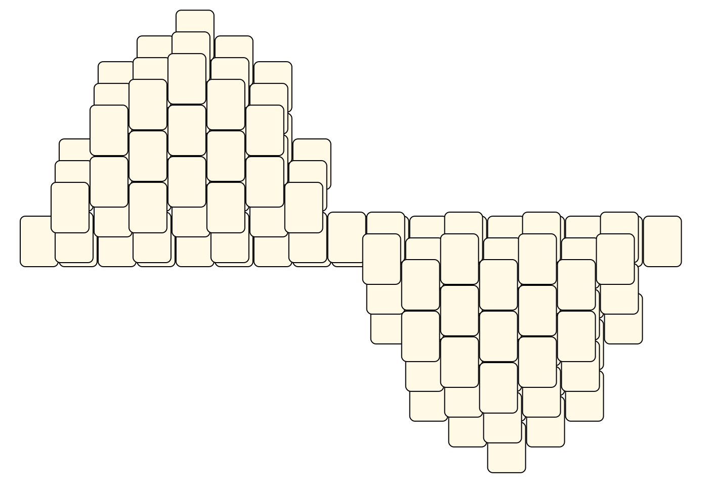

# Mahjong Solitaire Layout Museum: Maps and flags
* Source: [https://web.archive.org/web/20230204113220/http://tsubassa-kurenai.de/Kyodai/Layouts/](https://web.archive.org/web/20230204113220/http://tsubassa-kurenai.de/Kyodai/Layouts/)

* File Source:  
<sub>```https://web.archive.org/web/20230204113220/http://tsubassa-kurenai.de/Kyodai/Layouts/```</sub>


|Maps and flags||Layouts: 6|
|:--:|:--:|:--:|
|Jamaican Flag<br><br> <sub>Tsubassa Kurenai</sub> <br>[.lay](./jamaican_flag.lay)  [.layout](./jamaican_flag.layout)  [.mah](./jamaican_flag.mah) |North European Flag<br><br> <sub>Tsubassa Kurenai</sub> <br>[.lay](./north_european_flag.lay)  [.layout](./north_european_flag.layout)  [.mah](./north_european_flag.mah) |Sinuskurve<br><br> <sub>Jens Rose</sub> <br>[.lay](./sinuskurve.lay)  [.layout](./sinuskurve.layout)  [.mah](./sinuskurve.mah) |
|Sinuskurve 2<br><br> <sub>Jens Rose</sub> <br>[.lay](./sinuskurve_2.lay)  [.layout](./sinuskurve_2.layout)  [.mah](./sinuskurve_2.mah) |Tilemap World<br><br> <sub>Jens Rose</sub> <br>[.lay](./tilemap_world.lay)  [.layout](./tilemap_world.layout)  [.mah](./tilemap_world.mah) |Union Jack<br><br> <sub>Tsubassa Kurenai</sub> <br>[.lay](./union_jack.lay)  [.layout](./union_jack.layout)  [.mah](./union_jack.mah) |