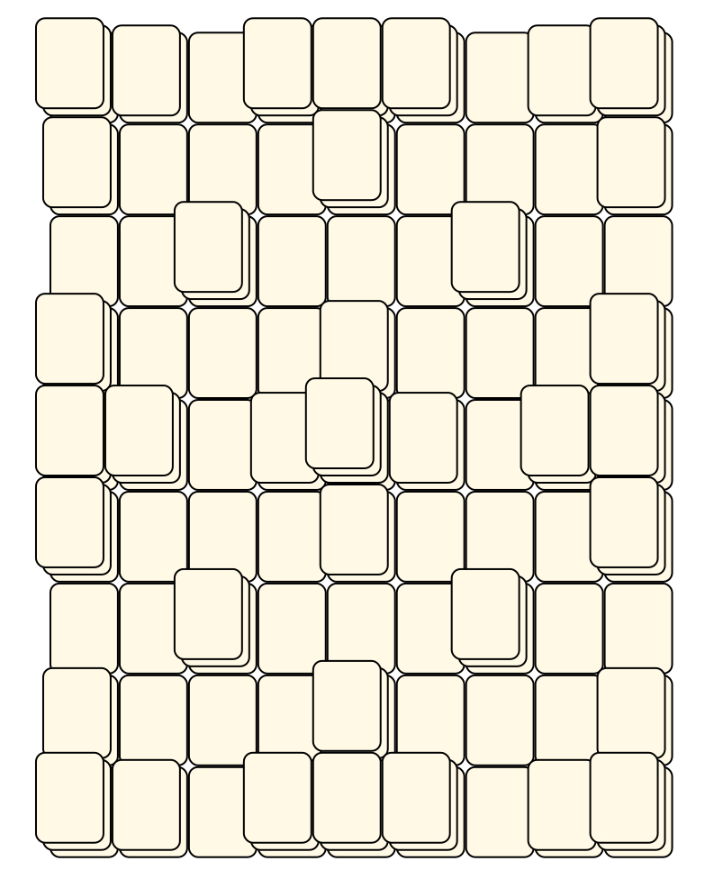
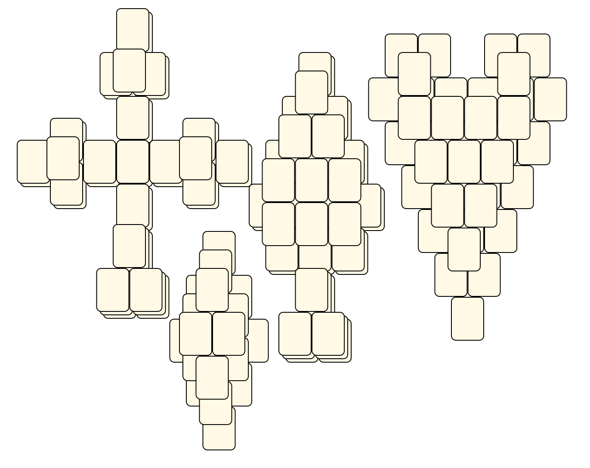
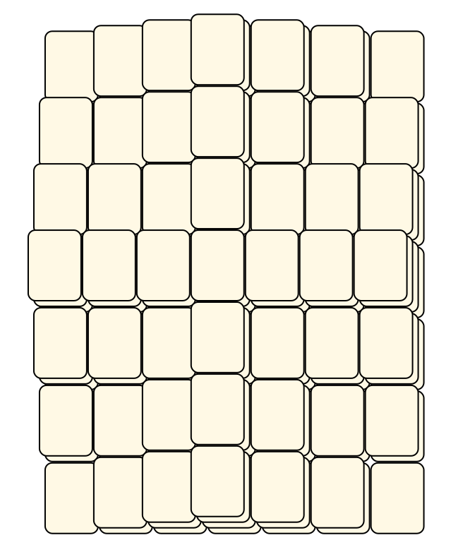
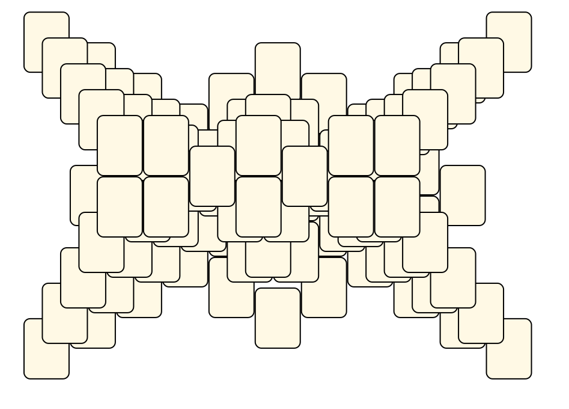
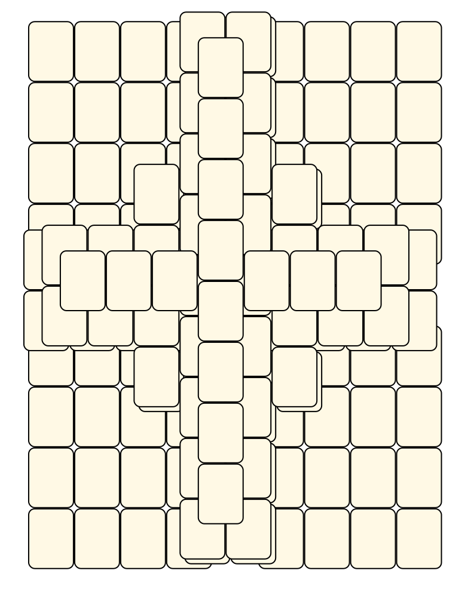
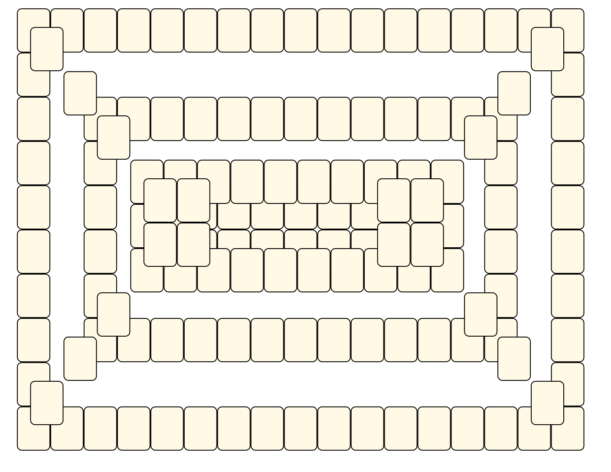
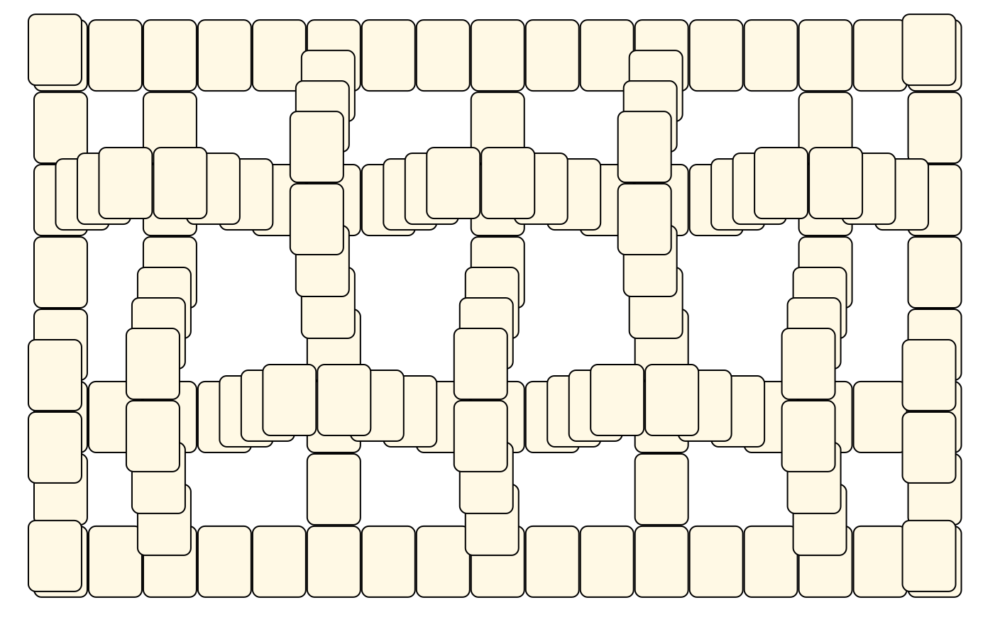
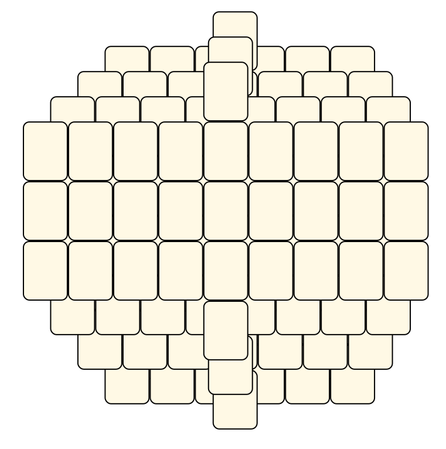

# Mahjong Solitaire Layout Museum: Other
* Source: [https://web.archive.org/web/20230204113220/http://tsubassa-kurenai.de/Kyodai/Layouts/](https://web.archive.org/web/20230204113220/http://tsubassa-kurenai.de/Kyodai/Layouts/)

* File Source:  
<sub>```https://web.archive.org/web/20230204113220/http://tsubassa-kurenai.de/Kyodai/Layouts/```</sub>


|Other||Layouts: 26|
|:--:|:--:|:--:|
|Abstract Garden<br><br> <sub>Tsubassa Kurenai</sub> <br>[.lay](./abstract_garden.lay)  [.layout](./abstract_garden.layout)  [.mah](./abstract_garden.mah) |Big Tile<br><br> <sub>Tsubassa Kurenai</sub> <br>[.lay](./big_tile.lay)  [.layout](./big_tile.layout)  [.mah](./big_tile.mah) |Block<br><br> <sub>Jens Rose</sub> <br>[.lay](./block.lay)  [.layout](./block.layout)  [.mah](./block.mah) |
|Card Colours<br><br> <sub>Tsubassa Kurenai</sub> <br>[.lay](./card_colours.lay)  [.layout](./card_colours.layout)  [.mah](./card_colours.mah) |Corner Stairs<br><br> <sub>Jens Rose</sub> <br>[.lay](./corner_stairs.lay)  [.layout](./corner_stairs.layout)  [.mah](./corner_stairs.mah) |Covered Duct<br><br> <sub>Tsubassa Kurenai</sub> <br>[.lay](./covered_duct.lay)  [.layout](./covered_duct.layout)  [.mah](./covered_duct.mah) |
|Crazy Table<br><br> <sub>Tsubassa Kurenai</sub> <br>[.lay](./crazy_table.lay)  [.layout](./crazy_table.layout)  [.mah](./crazy_table.mah) |Crazy Wheel<br><br> <sub>Tsubassa Kurenai</sub> <br>[.lay](./crazy_wheel.lay)  [.layout](./crazy_wheel.layout)  [.mah](./crazy_wheel.mah) |Cross<br><br> <sub>Jens Rose</sub> <br>[.lay](./cross_2.lay)  [.layout](./cross_2.layout)  [.mah](./cross_2.mah) |
|Easy Rectangles<br><br> <sub>Tsubassa Kurenai</sub> <br>[.lay](./easy_rectangles.lay)  [.layout](./easy_rectangles.layout)  [.mah](./easy_rectangles.mah) |Heap<br><br> <sub>Jens Rose</sub> <br>[.lay](./heap.lay)  [.layout](./heap.layout)  [.mah](./heap.mah) |Hexagon Stack<br><br> <sub>Tsubassa Kurenai</sub> <br>[.lay](./hexagon_stack.lay)  [.layout](./hexagon_stack.layout)  [.mah](./hexagon_stack.mah) |
|Interweaved<br><br> <sub>Tsubassa Kurenai</sub> <br>[.lay](./interweaved.lay)  [.layout](./interweaved.layout)  [.mah](./interweaved.mah) |Interweaved 2<br><br> <sub>Tsubassa Kurenai</sub> <br>[.lay](./interweaved_2.lay)  [.layout](./interweaved_2.layout)  [.mah](./interweaved_2.mah) |Koffin<br><br> <sub>Tsubassa Kurenai</sub> <br>[.lay](./koffin.lay)  [.layout](./koffin.layout)  [.mah](./koffin.mah) |
|Labyrinth 2<br><br> <sub>Tsubassa Kurenai</sub> <br>[.lay](./labyrinth_2.lay)  [.layout](./labyrinth_2.layout)  [.mah](./labyrinth_2.mah) |Magic Four<br><br> <sub>Tsubassa Kurenai</sub> <br>[.lay](./magic_four.lay)  [.layout](./magic_four.layout)  [.mah](./magic_four.mah) |Octaeder Field<br><br> <sub>Tsubassa Kurenai</sub> <br>[.lay](./octaeder_field.lay)  [.layout](./octaeder_field.layout)  [.mah](./octaeder_field.mah) |
|Parabolic Structure<br><br> <sub>Jens Rose</sub> <br>[.lay](./parabolic_structure.lay)  [.layout](./parabolic_structure.layout)  [.mah](./parabolic_structure.mah) |Parted Tables<br><br> <sub>Tsubassa Kurenai</sub> <br>[.lay](./parted_tables.lay)  [.layout](./parted_tables.layout)  [.mah](./parted_tables.mah) |Platform With Stairs<br><br> <sub>Tsubassa Kurenai</sub> <br>[.lay](./platform_with_stairs.lay)  [.layout](./platform_with_stairs.layout)  [.mah](./platform_with_stairs.mah) |
|Plugging System<br><br> <sub>Tsubassa Kurenai</sub> <br>[.lay](./plugging_system.lay)  [.layout](./plugging_system.layout)  [.mah](./plugging_system.mah) |Ridicolous<br><br> <sub>Tsubassa Kurenai</sub> <br>[.lay](./ridicolous.lay)  [.layout](./ridicolous.layout)  [.mah](./ridicolous.mah) |Sixpack<br><br> <sub>Tsubassa Kurenai</sub> <br>[.lay](./sixpack.lay)  [.layout](./sixpack.layout)  [.mah](./sixpack.mah) |
|Spiral<br><br> <sub>Tsubassa Kurenai</sub> <br>[.lay](./spiral.lay)  [.layout](./spiral.layout)  [.mah](./spiral.mah) |Stairs<br><br> <sub>Tsubassa Kurenai</sub> <br>[.lay](./stairs.lay)  [.layout](./stairs.layout)  [.mah](./stairs.mah) ||