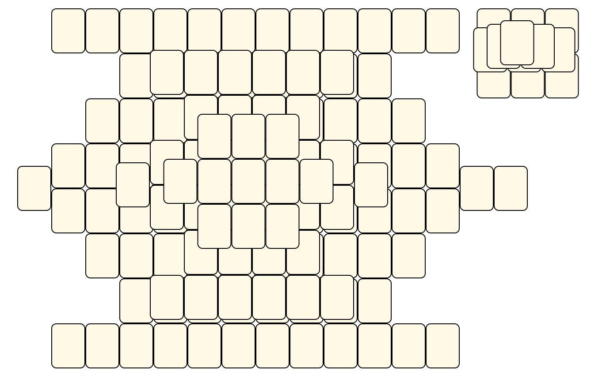
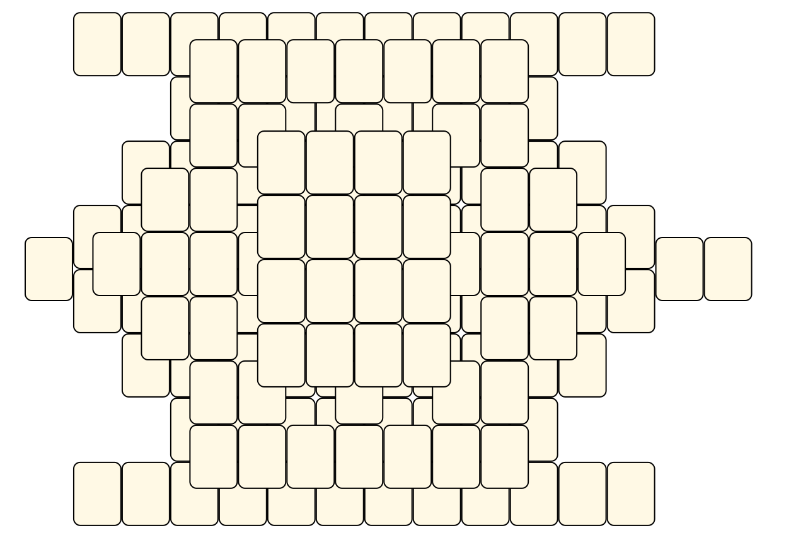

# Mahjong Solitaire Layout Museum: Stacks
* Source: [https://web.archive.org/web/20230204113220/http://tsubassa-kurenai.de/Kyodai/Layouts/](https://web.archive.org/web/20230204113220/http://tsubassa-kurenai.de/Kyodai/Layouts/)

* File Source:  
<sub>```https://web.archive.org/web/20230204113220/http://tsubassa-kurenai.de/Kyodai/Layouts/```</sub>


|Stacks||Layouts: 6|
|:--:|:--:|:--:|
|Hexagon Stack<br><br> <sub>Tsubassa Kurenai</sub> <br>[.lay](./hexagon_stack_2.lay)  [.layout](./hexagon_stack_2.layout)  [.mah](./hexagon_stack_2.mah) |Kreuz Und Quer<br><br> <sub>Tsubassa Kurenai</sub> <br>[.lay](./kreuz_und_quer.lay)  [.layout](./kreuz_und_quer.layout)  [.mah](./kreuz_und_quer.mah) |Traditional<br><br> <sub>Tsubassa Kurenai</sub> <br>[.lay](./traditional.lay)  [.layout](./traditional.layout)  [.mah](./traditional.mah) |
|Traditional Based Three Flats<br><br> <sub>Tsubassa Kurenai</sub> <br>[.lay](./traditional_based_three_flats.lay)  [.layout](./traditional_based_three_flats.layout)  [.mah](./traditional_based_three_flats.mah) |Triangle Palette Stack<br><br> <sub>Tsubassa Kurenai</sub> <br>[.lay](./triangle_palette_stack.lay)  [.layout](./triangle_palette_stack.layout)  [.mah](./triangle_palette_stack.mah) |Two Stacks<br><br> <sub>Tsubassa Kurenai</sub> <br>[.lay](./two_stacks.lay)  [.layout](./two_stacks.layout)  [.mah](./two_stacks.mah) |