# Mahjong Solitaire Layout Museum: Kyodai Extras
* Source: [https://web.archive.org/web/20231204163740/https://cynagames.com/kyoextra.html](https://web.archive.org/web/20231204163740/https://cynagames.com/kyoextra.html)

* File Source:  
<sub>```https://web.archive.org/web/20051025011040/http://files.cyna.net/layouts.zip```</sub>


|Kyodai Extras||Layouts: 134|
|:--:|:--:|:--:|
|A Pyramid, THAT?!<br>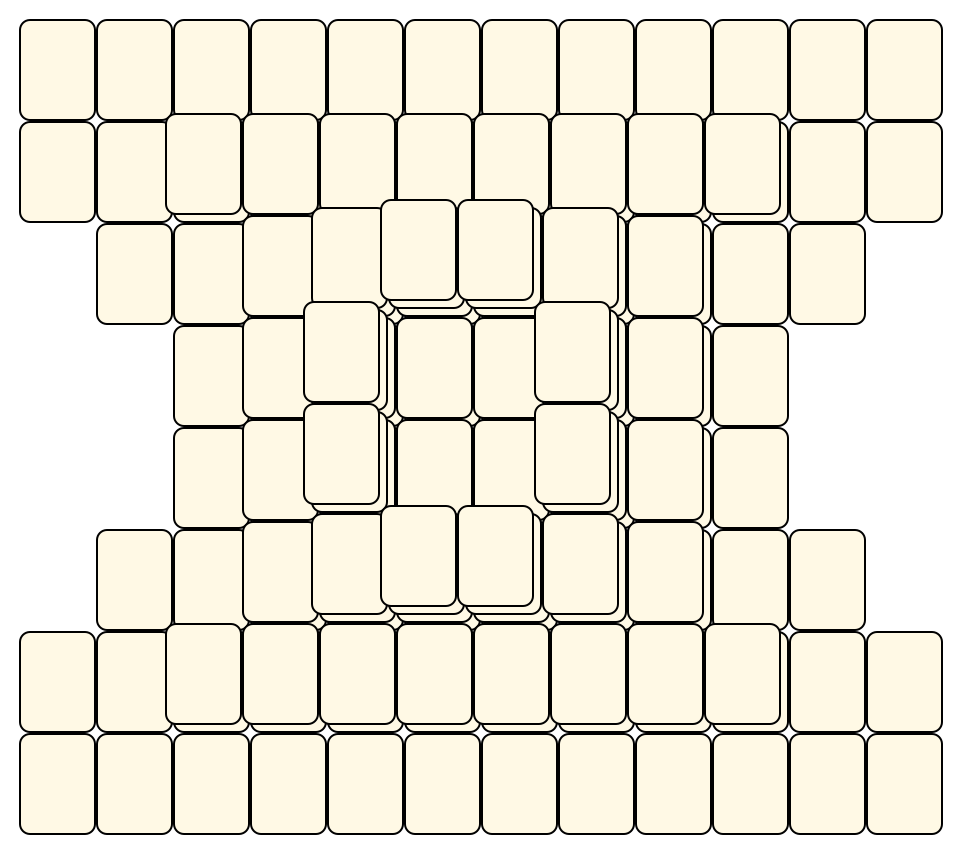<br> <sub>Naoki Haga</sub> <br>[.lay](./a_pyramid_that.lay)  [.layout](./a_pyramid_that.layout)  [.mah](./a_pyramid_that.mah) |Amaze<br>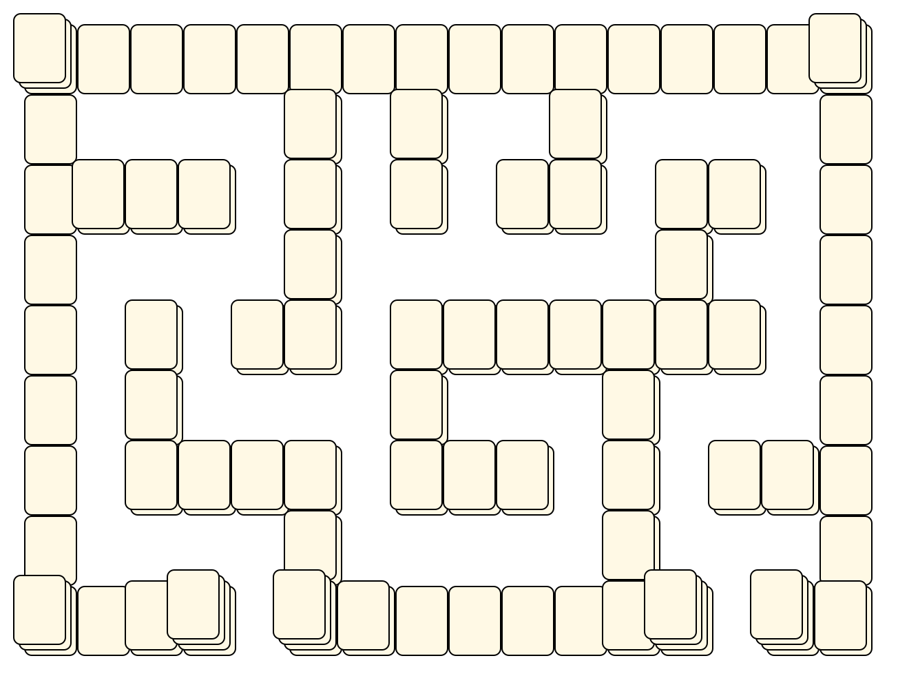<br> <sub>Kyodai</sub> <br>[.lay](./amaze.lay)  [.layout](./amaze.layout)  [.mah](./amaze.mah) |Another Round<br><br> <sub>Naoki Haga</sub> <br>[.lay](./another_round.lay)  [.layout](./another_round.layout)  [.mah](./another_round.mah) |
|Aqab's Layout<br>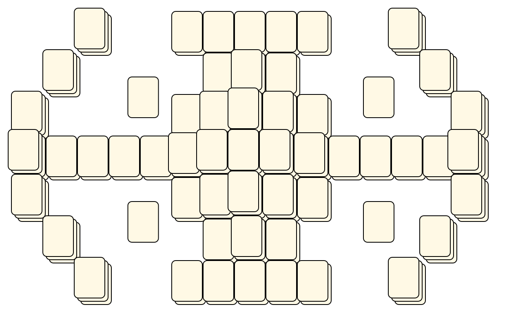<br> <sub>Kyodai</sub> <br>[.lay](./aqabs_layout.lay)  [.layout](./aqabs_layout.layout)  [.mah](./aqabs_layout.mah) |Arena<br><br> <sub>Naoki Haga</sub> <br>[.lay](./arena_2.lay)  [.layout](./arena_2.layout)  [.mah](./arena_2.mah) |Art Moderne<br><br> <sub>Naoki Haga</sub> <br>[.lay](./art_moderne.lay)  [.layout](./art_moderne.layout)  [.mah](./art_moderne.mah) |
|Beatle<br><br> <sub>Naoki Haga</sub> <br>[.lay](./beatle.lay)  [.layout](./beatle.layout)  [.mah](./beatle.mah) |Big Hole<br><br> <sub>Naoki Haga</sub> <br>[.lay](./big_hole.lay)  [.layout](./big_hole.layout)  [.mah](./big_hole.mah) |Big Mountain<br>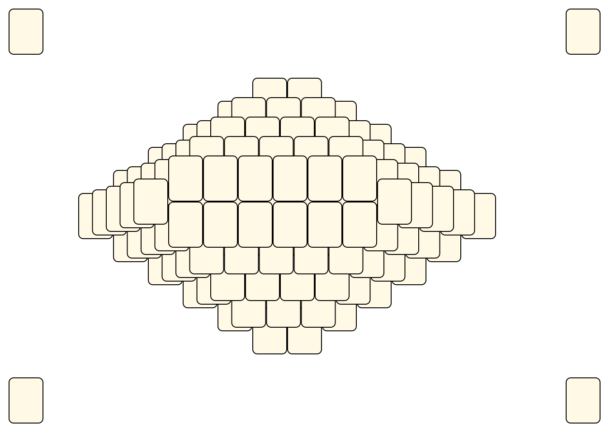<br> <sub>Alexis Bonvin</sub> <br>[.lay](./big_mountain.lay)  [.layout](./big_mountain.layout)  [.mah](./big_mountain.mah) |
|Bizarre<br><br> <sub>Alexis Bonvin</sub> <br>[.lay](./bizarre.lay)  [.layout](./bizarre.layout)  [.mah](./bizarre.mah) |Boat<br><br> <sub>Alexis Bonvin</sub> <br>[.lay](./boat.lay)  [.layout](./boat.layout)  [.mah](./boat.mah) |Bridge<br>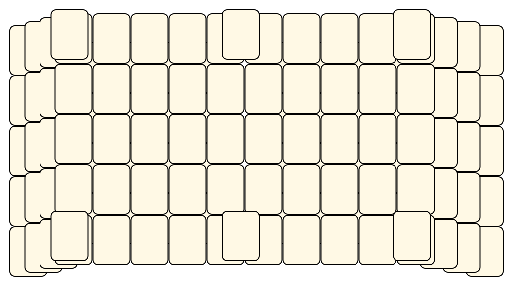<br> <sub>Fude</sub> <br>[.lay](./bridge.lay)  [.layout](./bridge.layout)  [.mah](./bridge.mah) |
|Butterfly<br>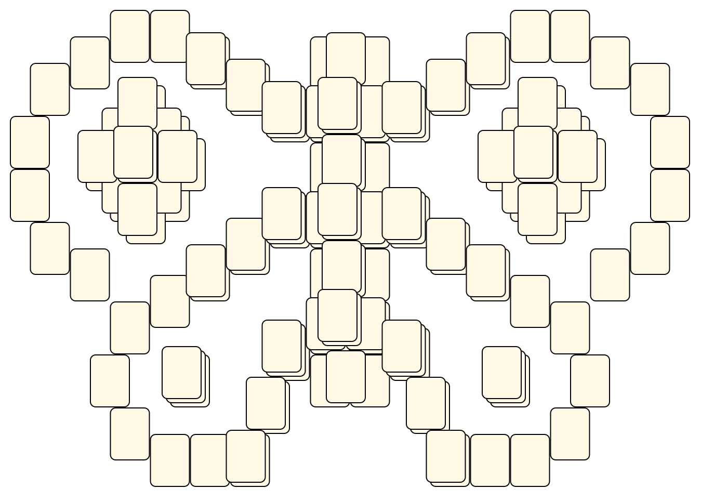<br> <sub>Kyodai</sub> <br>[.lay](./butterfly.lay)  [.layout](./butterfly.layout)  [.mah](./butterfly.mah) |Castle<br><br> <sub>Alexis Bonvin</sub> <br>[.lay](./castle_2.lay)  [.layout](./castle_2.layout)  [.mah](./castle_2.mah) |Cat And Mouse<br><br> <sub>Kyodai</sub> <br>[.lay](./cat_and_mouse.lay)  [.layout](./cat_and_mouse.layout)  [.mah](./cat_and_mouse.mah) |
|Ceremonial<br>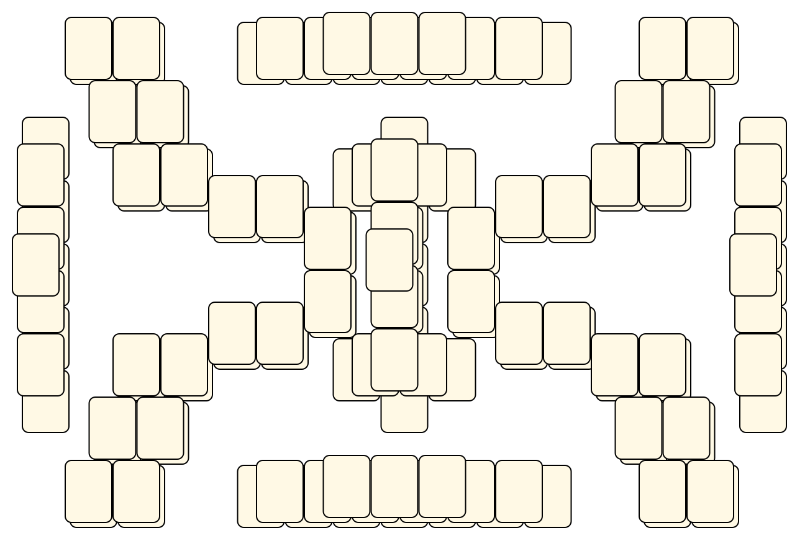<br> <sub>Naoki Haga</sub> <br>[.lay](./ceremonial.lay)  [.layout](./ceremonial.layout)  [.mah](./ceremonial.mah) |ChessMania<br><br> <sub>Alexis Bonvin</sub> <br>[.lay](./chessmania.lay)  [.layout](./chessmania.layout)  [.mah](./chessmania.mah) |Cross<br>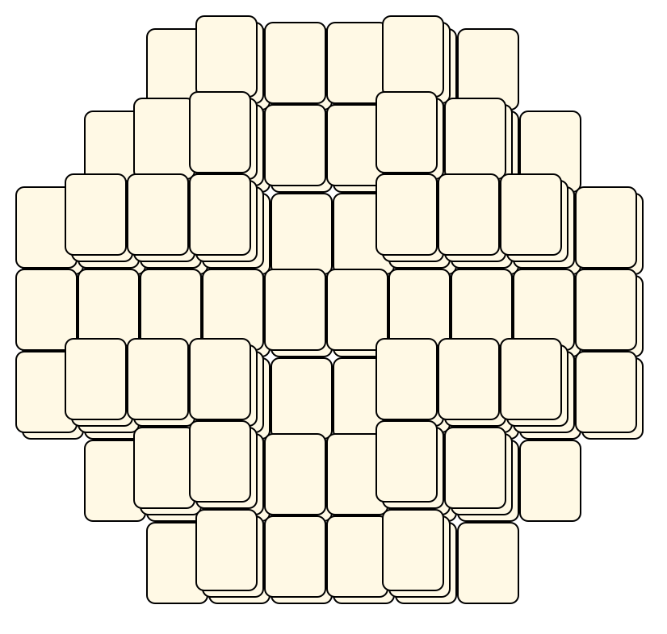<br> <sub>MinderTech</sub> <br>[.lay](./cross_3.lay)  [.layout](./cross_3.layout)  [.mah](./cross_3.mah) |
|Crown<br><br> <sub>Naoki Haga</sub> <br>[.lay](./crown.lay)  [.layout](./crown.layout)  [.mah](./crown.mah) |Cupido's Heart<br><br> <sub>Alexis Bonvin</sub> <br>[.lay](./cupidos_heart.lay)  [.layout](./cupidos_heart.layout)  [.mah](./cupidos_heart.mah) |Cupola<br><br> <sub>Kyodai</sub> <br>[.lay](./cupola.lay)  [.layout](./cupola.layout)  [.mah](./cupola.mah) |
|Deceptive<br>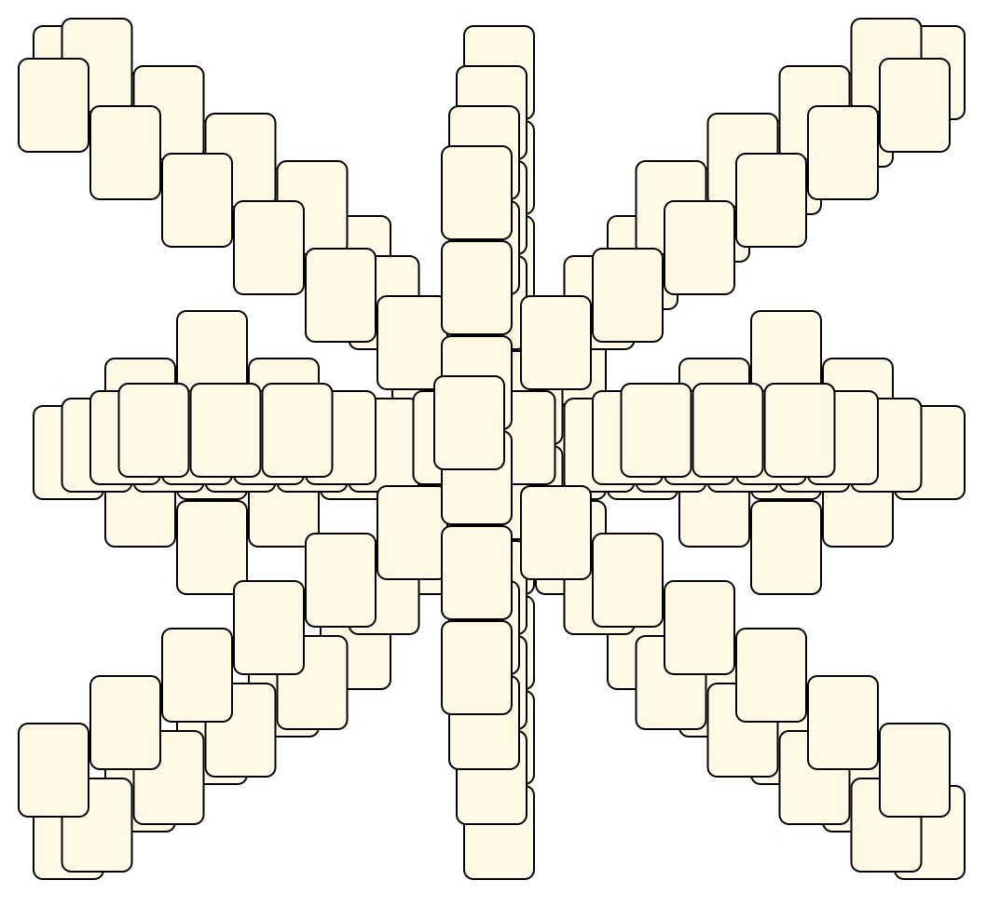<br> <sub>Leonard Enos</sub> <br>[.lay](./deceptive.lay)  [.layout](./deceptive.layout)  [.mah](./deceptive.mah) |Deep Well<br>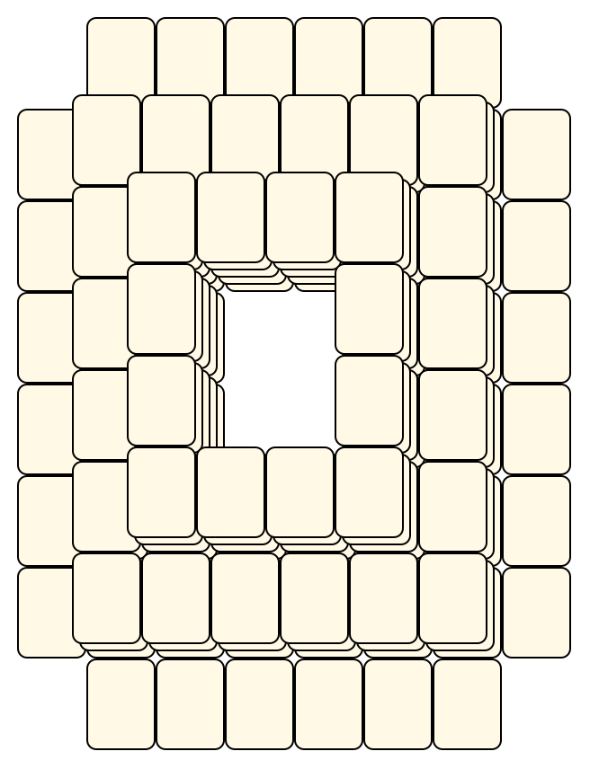<br> <sub>Naoki Haga</sub> <br>[.lay](./deep_well.lay)  [.layout](./deep_well.layout)  [.mah](./deep_well.mah) |Diamond<br><br> <sub>Alexis Bonvin</sub> <br>[.lay](./diamond.lay)  [.layout](./diamond.layout)  [.mah](./diamond.mah) |
|Dude<br><br> <sub>Bolli</sub> <br>[.lay](./dude.lay)  [.layout](./dude.layout)  [.mah](./dude.mah) |Empty Pyramids<br><br> <sub>Alexis Bonvin</sub> <br>[.lay](./empty_pyramids.lay)  [.layout](./empty_pyramids.layout)  [.mah](./empty_pyramids.mah) |Farandole<br><br> <sub>Naoki Haga</sub> <br>[.lay](./farandole.lay)  [.layout](./farandole.layout)  [.mah](./farandole.mah) |
|Find Two Hided Words<br><br> <sub>Alexis Bonvin</sub> <br>[.lay](./find_two_hided_words.lay)  [.layout](./find_two_hided_words.layout)  [.mah](./find_two_hided_words.mah) |Fish<br><br> <sub>Alexis Bonvin</sub> <br>[.lay](./fish.lay)  [.layout](./fish.layout)  [.mah](./fish.mah) |Fish Face<br>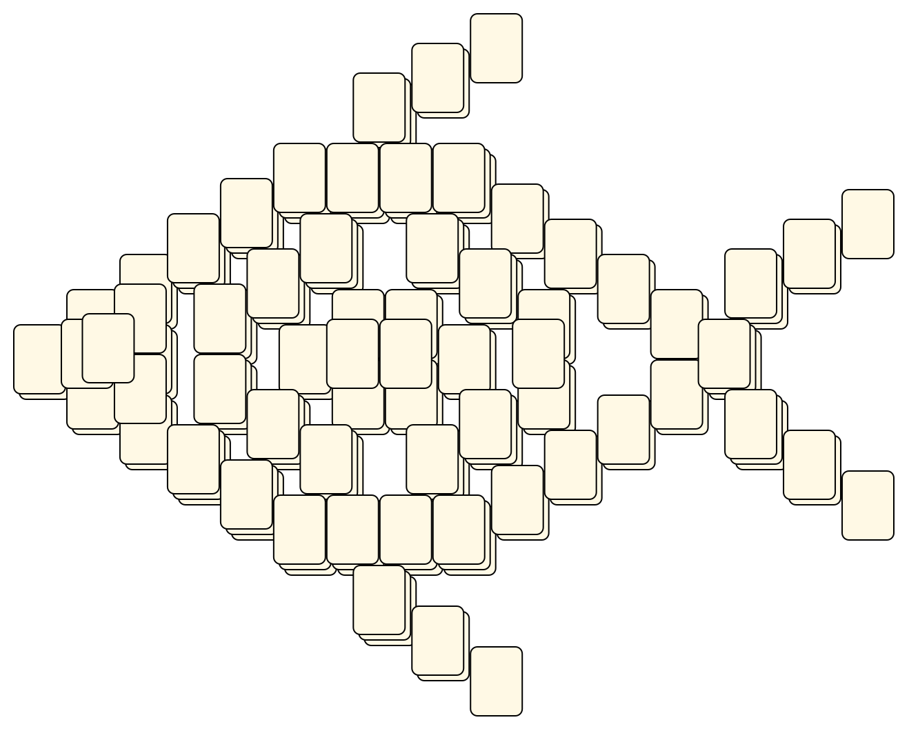<br> <sub>Kyodai</sub> <br>[.lay](./fish_face.lay)  [.layout](./fish_face.layout)  [.mah](./fish_face.mah) |
|Five Pyramids<br><br> <sub>Alexis Bonvin</sub> <br>[.lay](./five_pyramids.lay)  [.layout](./five_pyramids.layout)  [.mah](./five_pyramids.mah) |Five Pyramids 2<br><br> <sub>Alexis Bonvin</sub> <br>[.lay](./five_pyramids_2.lay)  [.layout](./five_pyramids_2.layout)  [.mah](./five_pyramids_2.mah) |Floating City<br><br> <sub>Will O'Connell</sub> <br>[.lay](./floating_city_2.lay)  [.layout](./floating_city_2.layout)  [.mah](./floating_city_2.mah) |
|Flowers<br><br> <sub>Bolli</sub> <br>[.lay](./flowers_2.lay)  [.layout](./flowers_2.layout)  [.mah](./flowers_2.mah) |Full Vision<br><br> <sub>John Payson</sub> <br>[.lay](./full_vision.lay)  [.layout](./full_vision.layout)  [.mah](./full_vision.mah) |Full Vision 2<br>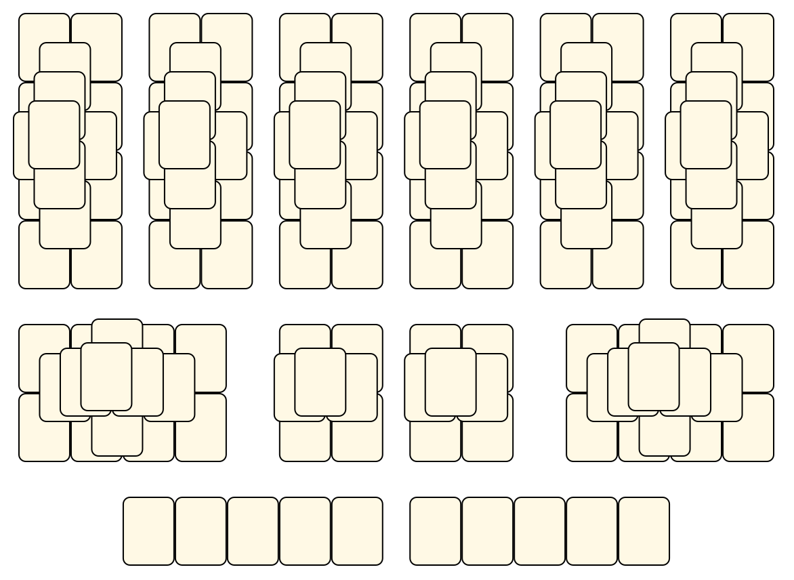<br> <sub>John Payson</sub> <br>[.lay](./full_vision_2.lay)  [.layout](./full_vision_2.layout)  [.mah](./full_vision_2.mah) |
|Full Vision 3<br>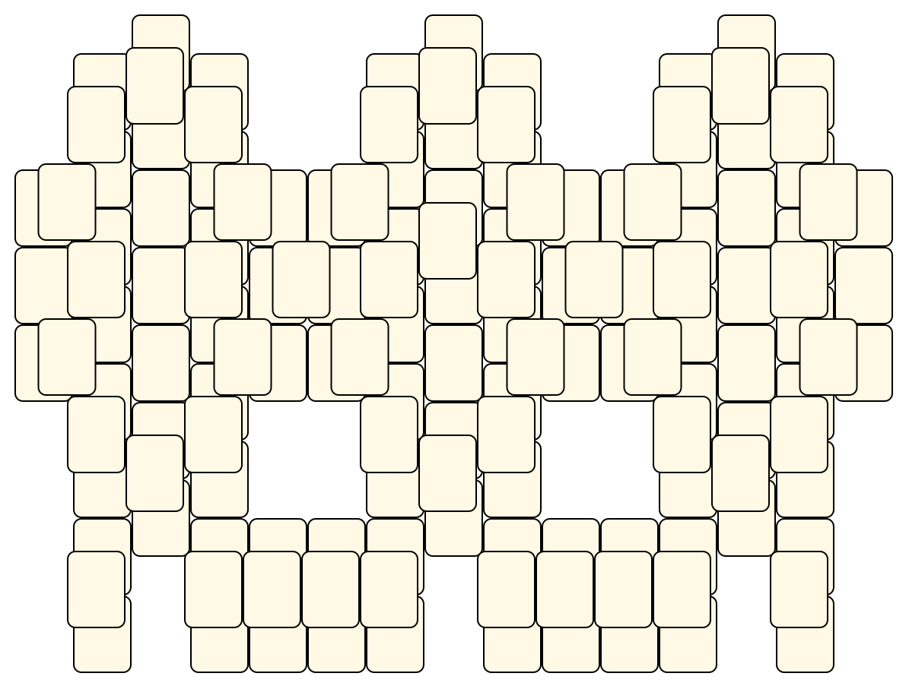<br> <sub>Alexis Bonvin</sub> <br>[.lay](./full_vision_3.lay)  [.layout](./full_vision_3.layout)  [.mah](./full_vision_3.mah) |H For Haga<br><br> <sub>Alexis Bonvin</sub> <br>[.lay](./h_for_haga.lay)  [.layout](./h_for_haga.layout)  [.mah](./h_for_haga.mah) |Hourglass<br><br> <sub>Vincent Krebs</sub> <br>[.lay](./hourglass_2.lay)  [.layout](./hourglass_2.layout)  [.mah](./hourglass_2.mah) |
|Hovercraft<br><br> <sub>Vincent Krebs</sub> <br>[.lay](./hovercraft.lay)  [.layout](./hovercraft.layout)  [.mah](./hovercraft.mah) |Hurdles<br>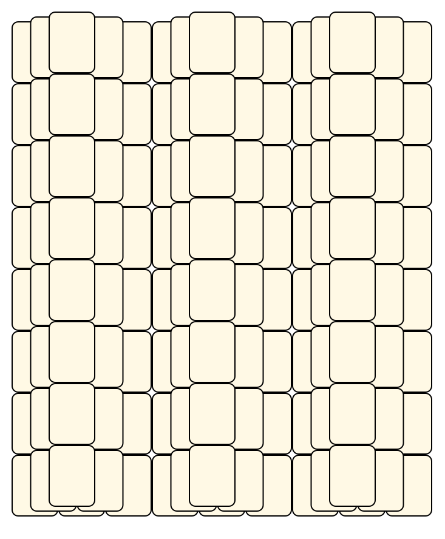<br> <sub>Leonard Enos</sub> <br>[.lay](./hurdles.lay)  [.layout](./hurdles.layout)  [.mah](./hurdles.mah) |Hurricane<br><br> <sub>Douglas Ulyate</sub> <br>[.lay](./hurricane.lay)  [.layout](./hurricane.layout)  [.mah](./hurricane.mah) |
|ILOVEU<br>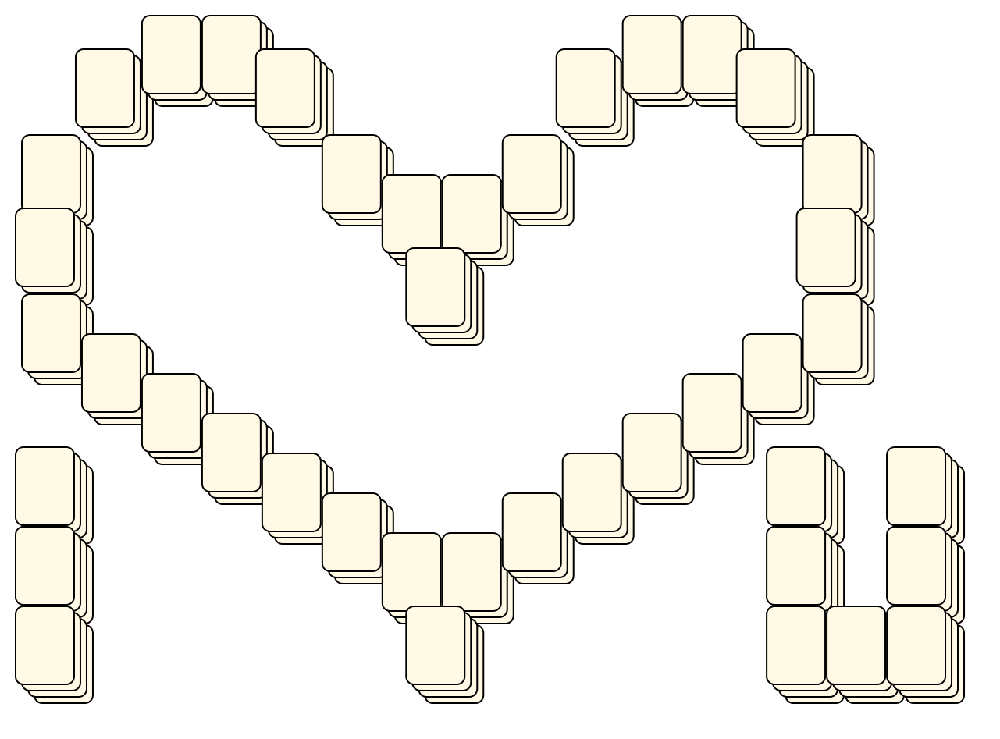<br> <sub>Lynnette Layton</sub> <br>[.lay](./iloveu.lay)  [.layout](./iloveu.layout)  [.mah](./iloveu.mah) |Impossible Mission<br><br> <sub>Alexis Bonvin</sub> <br>[.lay](./impossible_mission.lay)  [.layout](./impossible_mission.layout)  [.mah](./impossible_mission.mah) |Inazuma<br><br> <sub>Lynnette Layton</sub> <br>[.lay](./inazuma.lay)  [.layout](./inazuma.layout)  [.mah](./inazuma.mah) |
|Inca<br><br> <sub>Bolli</sub> <br>[.lay](./inca.lay)  [.layout](./inca.layout)  [.mah](./inca.mah) |Japan<br><br> <sub>Naoki Haga</sub> <br>[.lay](./japan.lay)  [.layout](./japan.layout)  [.mah](./japan.mah) |Joker<br><br> <sub>Naoki Haga</sub> <br>[.lay](./joker.lay)  [.layout](./joker.layout)  [.mah](./joker.mah) |
|Jon Prater's Layout<br><br> <sub>Jon Prater</sub> <br>[.lay](./jon_praters_layout.lay)  [.layout](./jon_praters_layout.layout)  [.mah](./jon_praters_layout.mah) |K For Kyodai<br><br> <sub>Alexis Bonvin</sub> <br>[.lay](./k_for_kyodai.lay)  [.layout](./k_for_kyodai.layout)  [.mah](./k_for_kyodai.mah) |Krebs<br>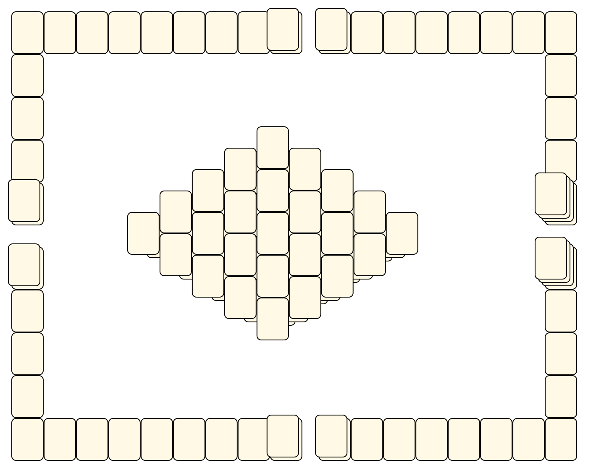<br> <sub>Kyodai</sub> <br>[.lay](./krebs.lay)  [.layout](./krebs.layout)  [.mah](./krebs.mah) |
|Kujaku (Peacock)<br><br> <sub>Naoki Haga</sub> <br>[.lay](./kujaku_(peacock).lay)  [.layout](./kujaku_(peacock).layout)  [.mah](./kujaku_(peacock).mah) |Kumo<br>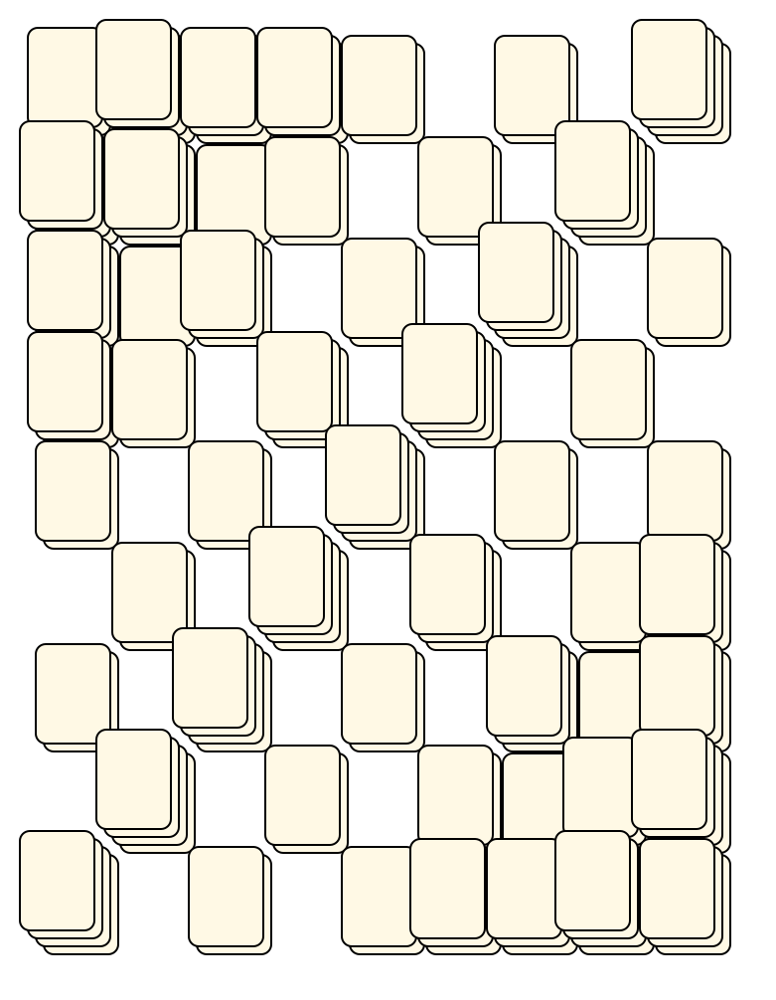<br> <sub>Lynnette Layton</sub> <br>[.lay](./kumo.lay)  [.layout](./kumo.layout)  [.mah](./kumo.mah) |Kyodai N14<br><br> <sub>Kyodai</sub> <br>[.lay](./kyodai_n14.lay)  [.layout](./kyodai_n14.layout)  [.mah](./kyodai_n14.mah) |
|Kyodai N17<br>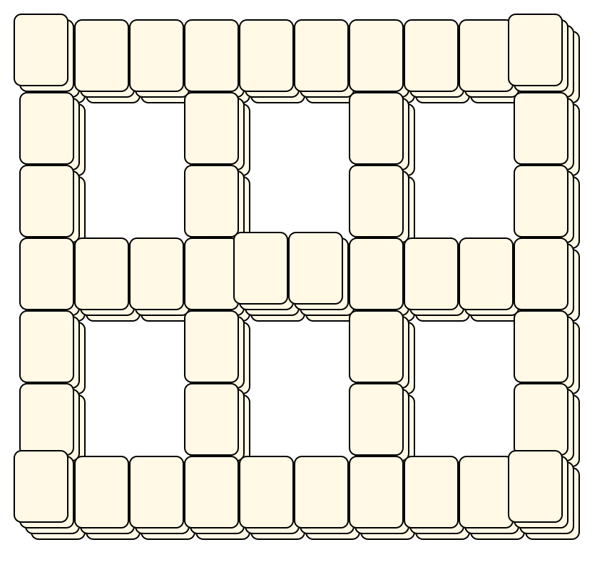<br> <sub>Kyodai</sub> <br>[.lay](./kyodai_n17.lay)  [.layout](./kyodai_n17.layout)  [.mah](./kyodai_n17.mah) |Kyodai N18<br><br> <sub>Kyodai</sub> <br>[.lay](./kyodai_n18.lay)  [.layout](./kyodai_n18.layout)  [.mah](./kyodai_n18.mah) |Kyodai N20<br><br> <sub>Kyodai</sub> <br>[.lay](./kyodai_n20.lay)  [.layout](./kyodai_n20.layout)  [.mah](./kyodai_n20.mah) |
|Kyodai N23<br><br> <sub>Kyodai</sub> <br>[.lay](./kyodai_n23.lay)  [.layout](./kyodai_n23.layout)  [.mah](./kyodai_n23.mah) |Kyodai N24<br>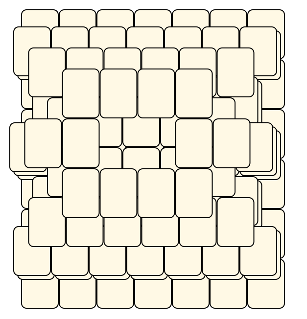<br> <sub>Kyodai</sub> <br>[.lay](./kyodai_n24.lay)  [.layout](./kyodai_n24.layout)  [.mah](./kyodai_n24.mah) |Kyodai N25<br><br> <sub>Kyodai</sub> <br>[.lay](./kyodai_n25.lay)  [.layout](./kyodai_n25.layout)  [.mah](./kyodai_n25.mah) |
|Kyodai N26<br><br> <sub>Kyodai</sub> <br>[.lay](./kyodai_n26.lay)  [.layout](./kyodai_n26.layout)  [.mah](./kyodai_n26.mah) |Kyodai N27<br>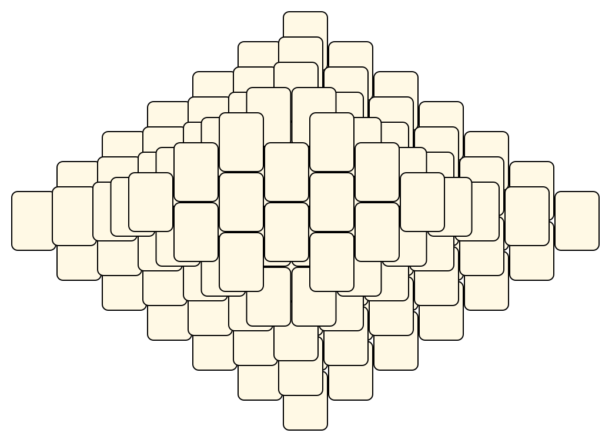<br> <sub>Kyodai</sub> <br>[.lay](./kyodai_n27.lay)  [.layout](./kyodai_n27.layout)  [.mah](./kyodai_n27.mah) |Kyodai N28<br>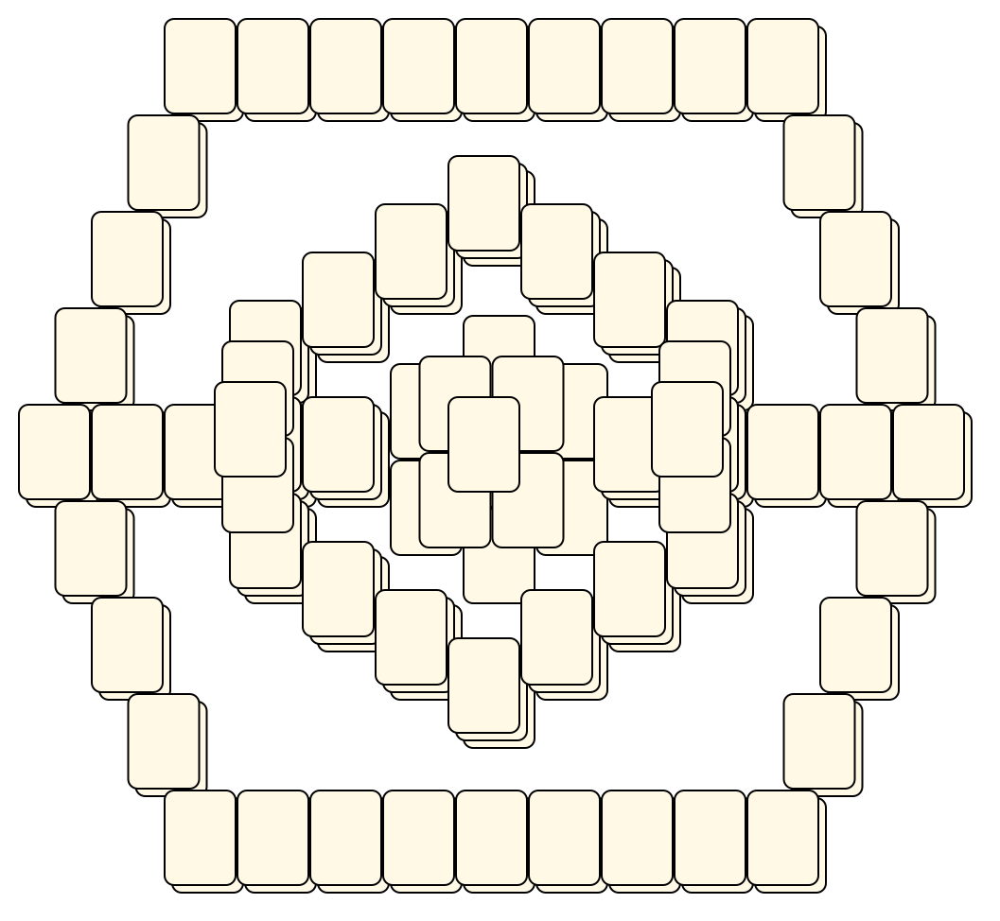<br> <sub>Kyodai</sub> <br>[.lay](./kyodai_n28.lay)  [.layout](./kyodai_n28.layout)  [.mah](./kyodai_n28.mah) |
|Kyodai N41<br><br> <sub>Kyodai</sub> <br>[.lay](./kyodai_n41.lay)  [.layout](./kyodai_n41.layout)  [.mah](./kyodai_n41.mah) |Kyodai N42<br>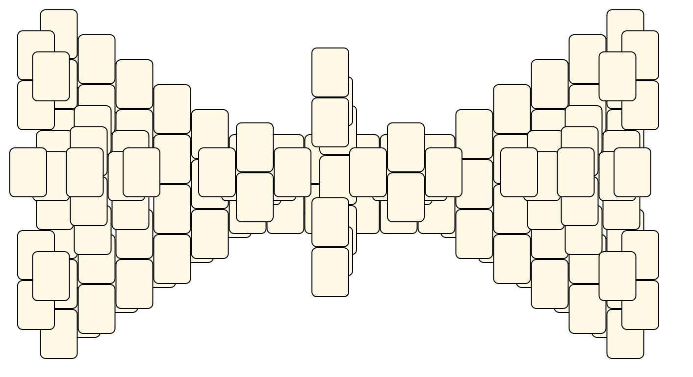<br> <sub>Kyodai</sub> <br>[.lay](./kyodai_n42.lay)  [.layout](./kyodai_n42.layout)  [.mah](./kyodai_n42.mah) |Lattice<br>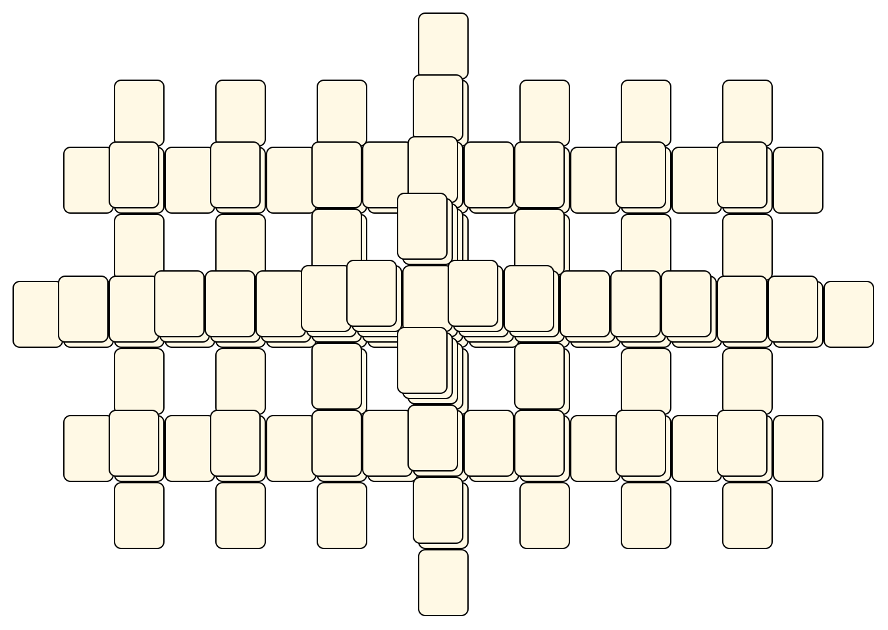<br> <sub>Alvin Helms</sub> <br>[.lay](./lattice.lay)  [.layout](./lattice.layout)  [.mah](./lattice.mah) |
|Leo<br>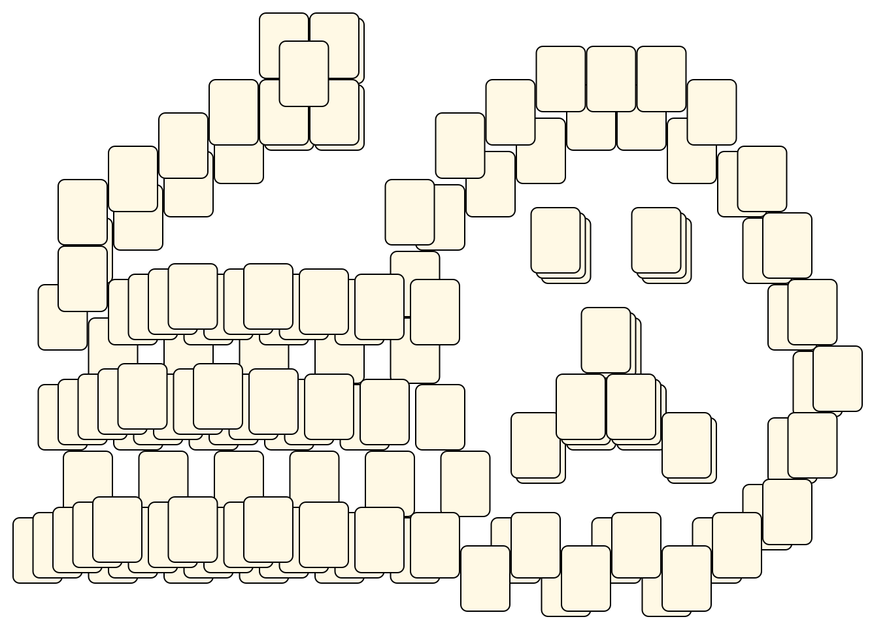<br> <sub>Lynnette Layton</sub> <br>[.lay](./leo.lay)  [.layout](./leo.layout)  [.mah](./leo.mah) |Lion<br>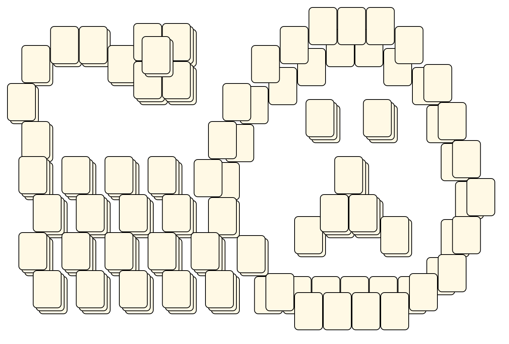<br> <sub>Lynnette Layton</sub> <br>[.lay](./lion.lay)  [.layout](./lion.layout)  [.mah](./lion.mah) |Lost In The Layout...<br><br> <sub>Naoki Haga</sub> <br>[.lay](./lost_in_the_layout.lay)  [.layout](./lost_in_the_layout.layout)  [.mah](./lost_in_the_layout.mah) |
|Mini Traditional<br>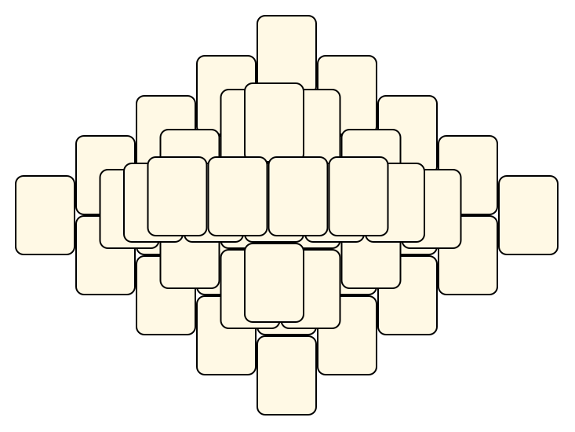<br> <sub>Naoki Haga</sub> <br>[.lay](./mini_traditional.lay)  [.layout](./mini_traditional.layout)  [.mah](./mini_traditional.mah) |Mini-Layout<br>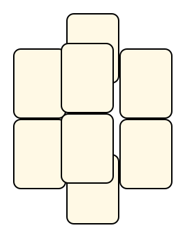<br> <sub>Kyodai</sub> <br>[.lay](./mini-layout.lay)  [.layout](./mini-layout.layout)  [.mah](./mini-layout.mah) |N For Namida<br><br> <sub>Naoki Haga</sub> <br>[.lay](./n_for_namida.lay)  [.layout](./n_for_namida.layout)  [.mah](./n_for_namida.mah) |
|Okie's Nitemare<br><br> <sub>Kyodai</sub> <br>[.lay](./okies_nitemare.lay)  [.layout](./okies_nitemare.layout)  [.mah](./okies_nitemare.mah) |Old Dragon<br><br> <sub>Kyodai</sub> <br>[.lay](./old_dragon.lay)  [.layout](./old_dragon.layout)  [.mah](./old_dragon.mah) |Orbital<br><br> <sub>Naoki Haga</sub> <br>[.lay](./orbital.lay)  [.layout](./orbital.layout)  [.mah](./orbital.mah) |
|Pantheon<br><br> <sub>Alexis Bonvin</sub> <br>[.lay](./pantheon.lay)  [.layout](./pantheon.layout)  [.mah](./pantheon.mah) |Papillon<br>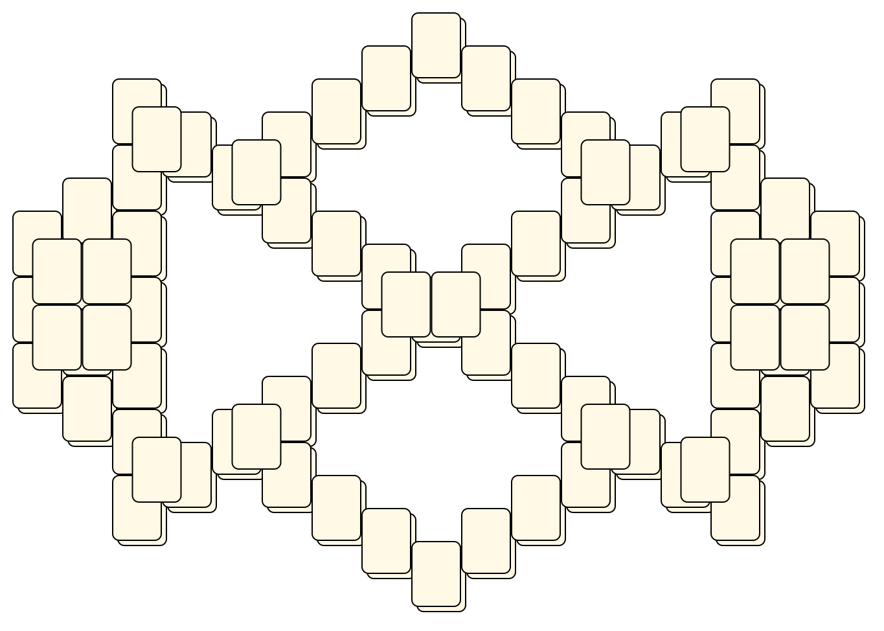<br> <sub>Vincent Krebs</sub> <br>[.lay](./papillon.lay)  [.layout](./papillon.layout)  [.mah](./papillon.mah) |Phoenix<br>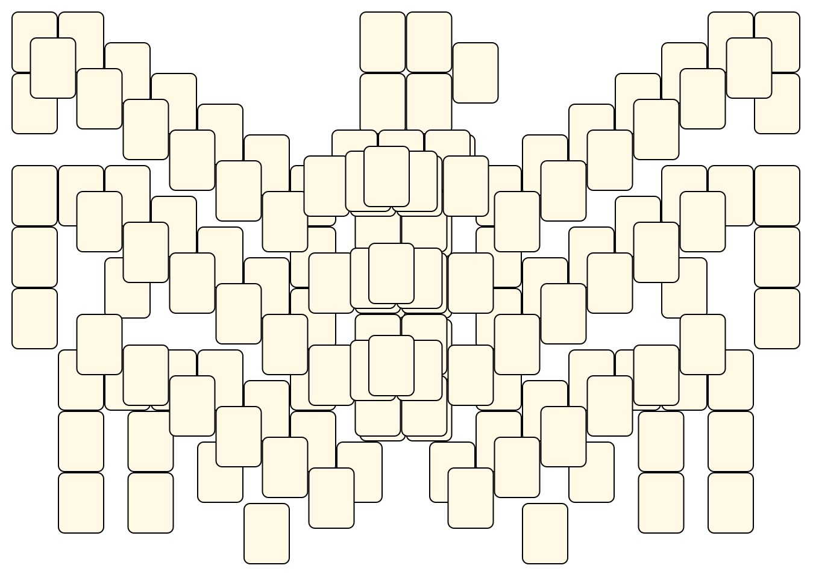<br> <sub>Kyodai</sub> <br>[.lay](./phoenix.lay)  [.layout](./phoenix.layout)  [.mah](./phoenix.mah) |
|Portal<br><br> <sub>Leonard Enos</sub> <br>[.lay](./portal.lay)  [.layout](./portal.layout)  [.mah](./portal.mah) |Pyramid 1<br><br> <sub>MinderTech</sub> <br>[.lay](./pyramid_1.lay)  [.layout](./pyramid_1.layout)  [.mah](./pyramid_1.mah) |Pyramid 2<br><br> <sub>MinderTech</sub> <br>[.lay](./pyramid_2.lay)  [.layout](./pyramid_2.layout)  [.mah](./pyramid_2.mah) |
|Quad<br><br> <sub>MinderTech</sub> <br>[.lay](./quad.lay)  [.layout](./quad.layout)  [.mah](./quad.mah) |Rectangle<br>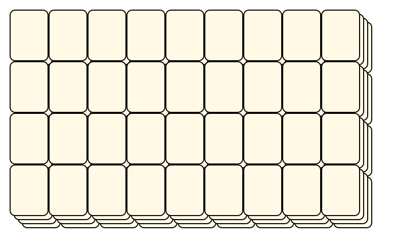<br> <sub>MinderTech</sub> <br>[.lay](./rectangle.lay)  [.layout](./rectangle.layout)  [.mah](./rectangle.mah) |Reindeer<br><br> <sub>Kyodai</sub> <br>[.lay](./reindeer.lay)  [.layout](./reindeer.layout)  [.mah](./reindeer.mah) |
|Rings<br><br> <sub>Bolli</sub> <br>[.lay](./rings.lay)  [.layout](./rings.layout)  [.mah](./rings.mah) |River Bridge<br>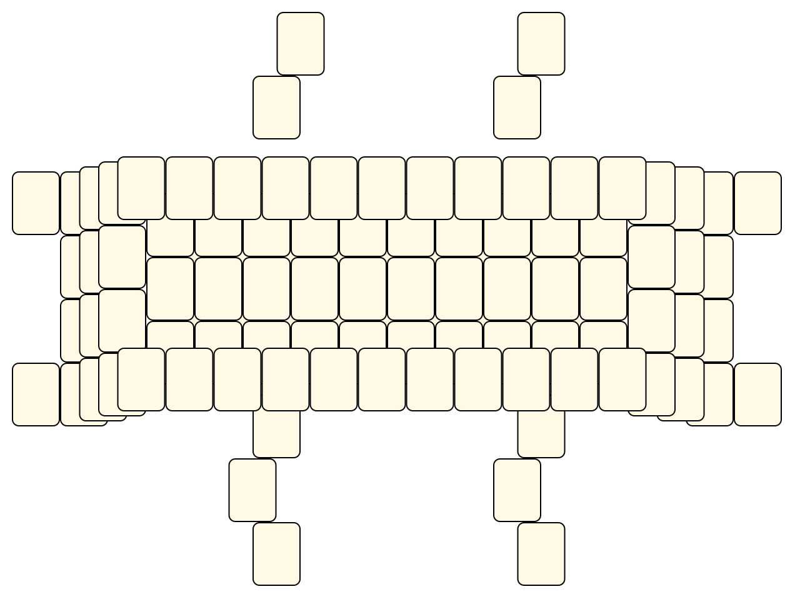<br> <sub>Naoki Haga</sub> <br>[.lay](./river_bridge.lay)  [.layout](./river_bridge.layout)  [.mah](./river_bridge.mah) |Roman Arena<br><br> <sub>Alexis Bonvin</sub> <br>[.lay](./roman_arena.lay)  [.layout](./roman_arena.layout)  [.mah](./roman_arena.mah) |
|Rugby<br>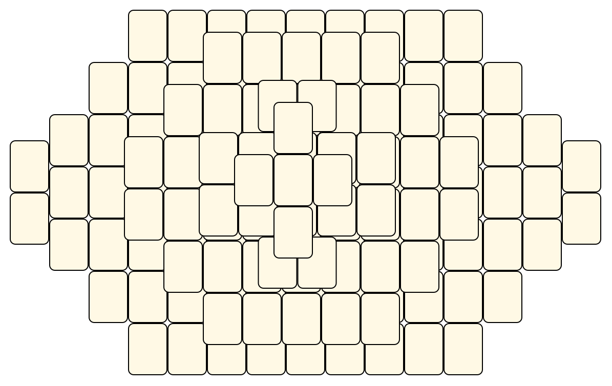<br> <sub>MinderTech</sub> <br>[.lay](./rugby.lay)  [.layout](./rugby.layout)  [.mah](./rugby.mah) |Screw Up<br><br> <sub>Naoki Haga</sub> <br>[.lay](./screw_up.lay)  [.layout](./screw_up.layout)  [.mah](./screw_up.mah) |Seven<br><br> <sub>Bolli</sub> <br>[.lay](./seven.lay)  [.layout](./seven.layout)  [.mah](./seven.mah) |
|Seven Pyramids<br><br> <sub>Alexis Bonvin</sub> <br>[.lay](./seven_pyramids.lay)  [.layout](./seven_pyramids.layout)  [.mah](./seven_pyramids.mah) |Shapeshifter<br>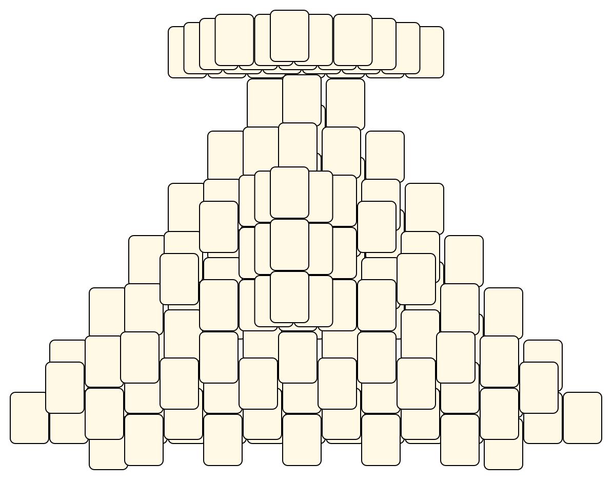<br> <sub>Leonard Enos</sub> <br>[.lay](./shapeshifter.lay)  [.layout](./shapeshifter.layout)  [.mah](./shapeshifter.mah) |Siam<br><br> <sub>Naoki Haga</sub> <br>[.lay](./siam.lay)  [.layout](./siam.layout)  [.mah](./siam.mah) |
|Space Ship<br>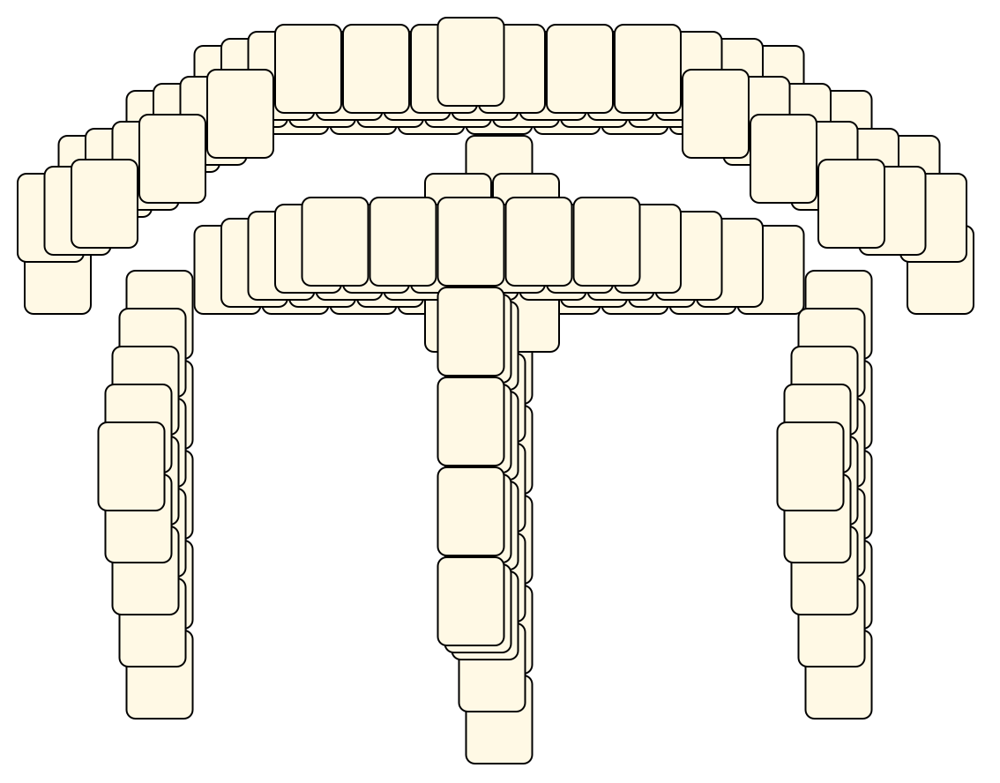<br> <sub>Kyodai</sub> <br>[.lay](./space_ship.lay)  [.layout](./space_ship.layout)  [.mah](./space_ship.mah) |Space Shuttle<br><br> <sub>MinderTech</sub> <br>[.lay](./space_shuttle.lay)  [.layout](./space_shuttle.layout)  [.mah](./space_shuttle.mah) |Square<br>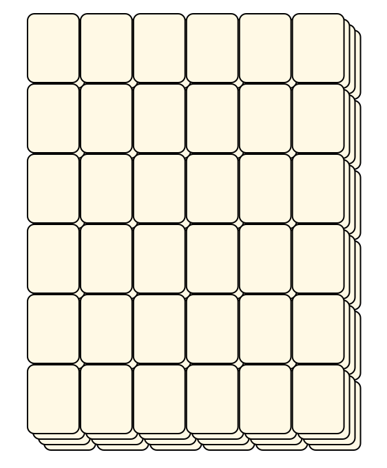<br> <sub>MinderTech</sub> <br>[.lay](./square.lay)  [.layout](./square.layout)  [.mah](./square.mah) |
|Stage 1<br><br> <sub>MinderTech</sub> <br>[.lay](./stage_1.lay)  [.layout](./stage_1.layout)  [.mah](./stage_1.mah) |Stage 2<br><br> <sub>MinderTech</sub> <br>[.lay](./stage_2.lay)  [.layout](./stage_2.layout)  [.mah](./stage_2.mah) |Stairs<br>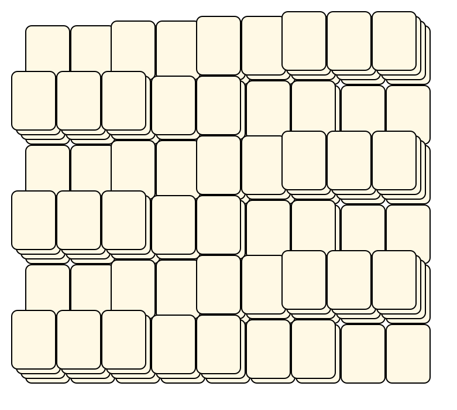<br> <sub>MinderTech</sub> <br>[.lay](./stairs_3.lay)  [.layout](./stairs_3.layout)  [.mah](./stairs_3.mah) |
|Stairs<br><br> <sub>Alexis Bonvin</sub> <br>[.lay](./stairs_4.lay)  [.layout](./stairs_4.layout)  [.mah](./stairs_4.mah) |Stargate<br><br> <sub>Leonard Enos</sub> <br>[.lay](./stargate.lay)  [.layout](./stargate.layout)  [.mah](./stargate.mah) |Step Pyramid<br><br> <sub>Christian Pedersen</sub> <br>[.lay](./step_pyramid.lay)  [.layout](./step_pyramid.layout)  [.mah](./step_pyramid.mah) |
|Stonehenge<br>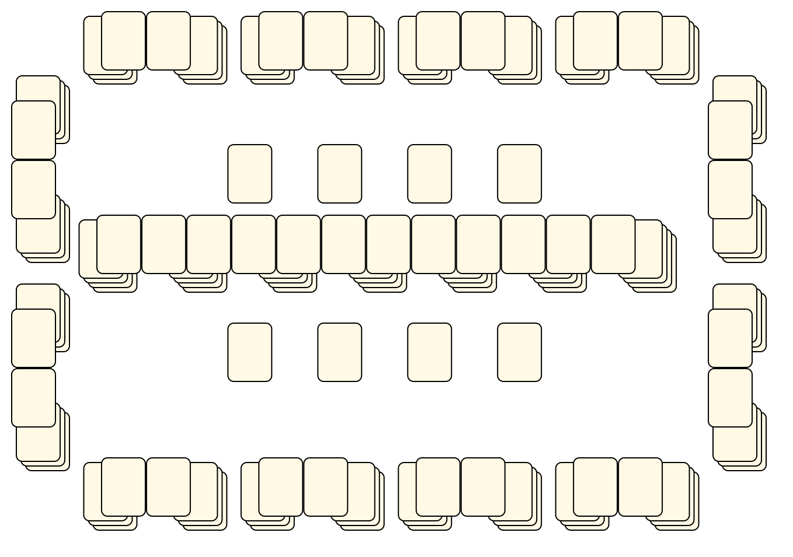<br> <sub>Alexis Bonvin</sub> <br>[.lay](./stonehenge.lay)  [.layout](./stonehenge.layout)  [.mah](./stonehenge.mah) |Sukis<br><br> <sub>Kyodai</sub> <br>[.lay](./sukis.lay)  [.layout](./sukis.layout)  [.mah](./sukis.mah) |SunMoon<br>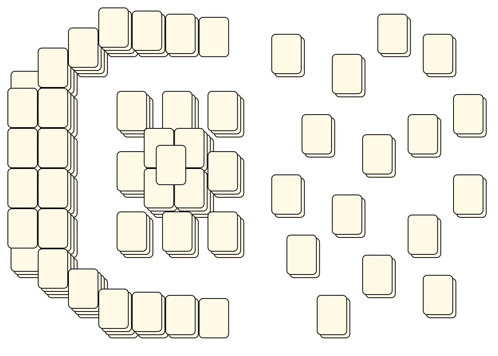<br> <sub>Lynnette Layton</sub> <br>[.lay](./sunmoon.lay)  [.layout](./sunmoon.layout)  [.mah](./sunmoon.mah) |
|Temple<br><br> <sub>Kyodai</sub> <br>[.lay](./temple_3.lay)  [.layout](./temple_3.layout)  [.mah](./temple_3.mah) |Temple 1<br><br> <sub>MinderTech</sub> <br>[.lay](./temple_1.lay)  [.layout](./temple_1.layout)  [.mah](./temple_1.mah) |Temple 2<br>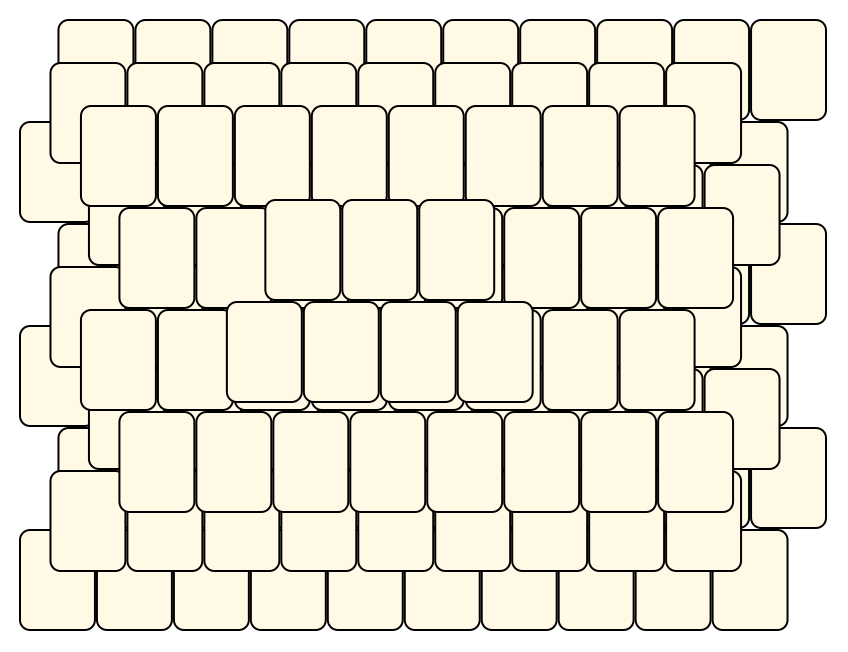<br> <sub>MinderTech</sub> <br>[.lay](./temple_2.lay)  [.layout](./temple_2.layout)  [.mah](./temple_2.mah) |
|Teotihucan<br>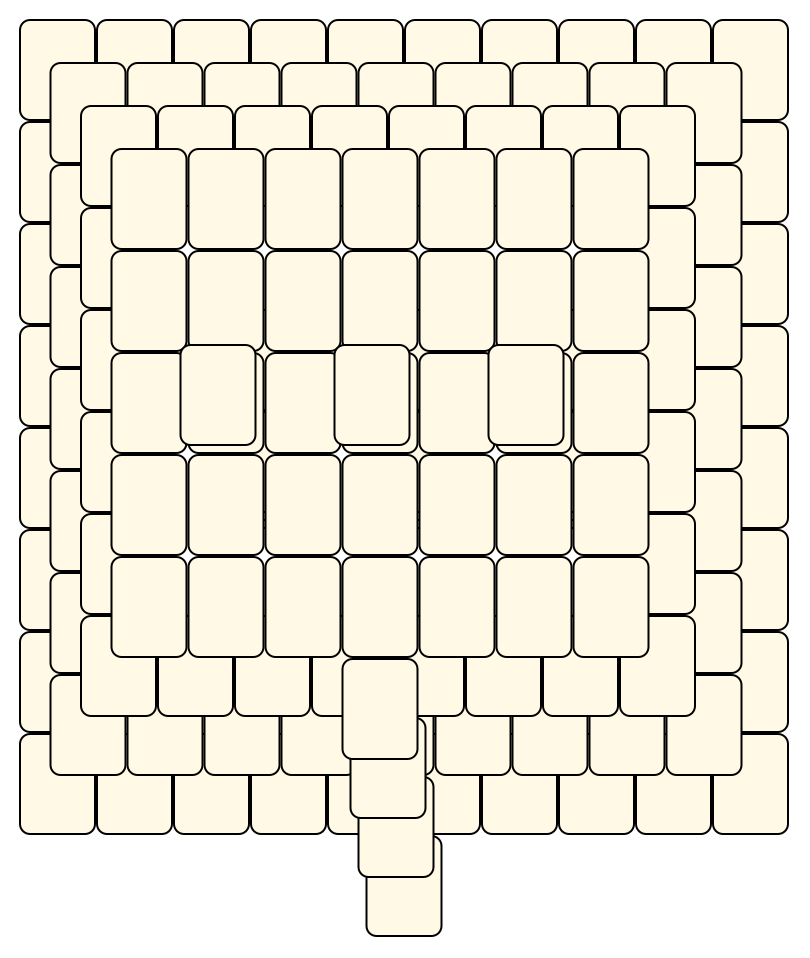<br> <sub>Alexis Bonvin</sub> <br>[.lay](./teotihucan.lay)  [.layout](./teotihucan.layout)  [.mah](./teotihucan.mah) |The Great Wall<br><br> <sub>Kyodai</sub> <br>[.lay](./the_great_wall.lay)  [.layout](./the_great_wall.layout)  [.mah](./the_great_wall.mah) |The Owl<br>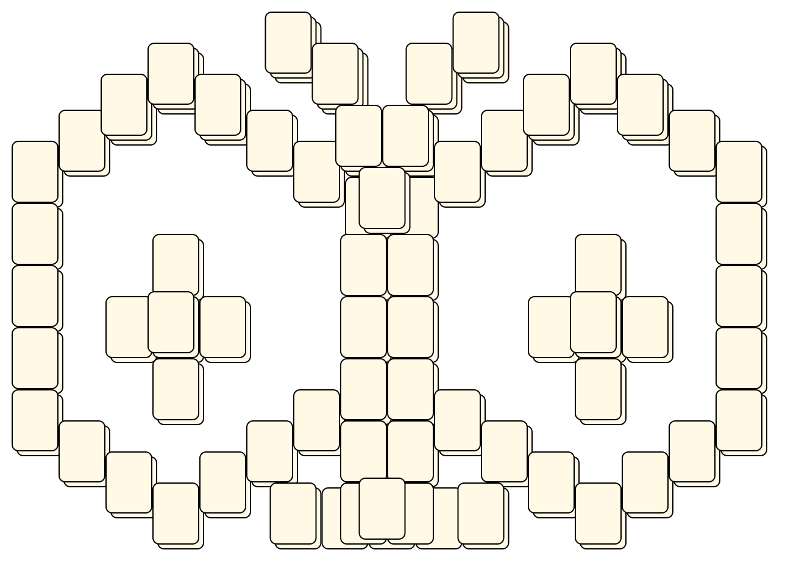<br> <sub>Duncan Mckenzie</sub> <br>[.lay](./the_owl.lay)  [.layout](./the_owl.layout)  [.mah](./the_owl.mah) |
|The SpaceBridge<br>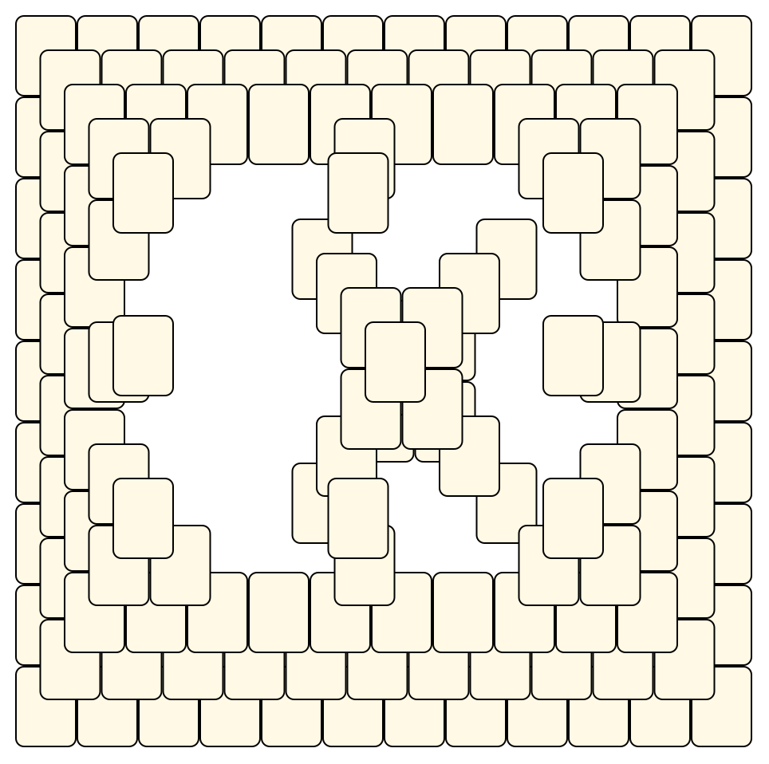<br> <sub>Kyodai</sub> <br>[.lay](./the_spacebridge.lay)  [.layout](./the_spacebridge.layout)  [.mah](./the_spacebridge.mah) |Theater<br><br> <sub>Naoki Haga</sub> <br>[.lay](./theater.lay)  [.layout](./theater.layout)  [.mah](./theater.mah) |Tile Fighter<br><br> <sub>Naoki Haga</sub> <br>[.lay](./tile_fighter.lay)  [.layout](./tile_fighter.layout)  [.mah](./tile_fighter.mah) |
|Tilepiles<br><br> <sub>Naoki Haga</sub> <br>[.lay](./tilepiles.lay)  [.layout](./tilepiles.layout)  [.mah](./tilepiles.mah) |Totally Random-Made Layout<br>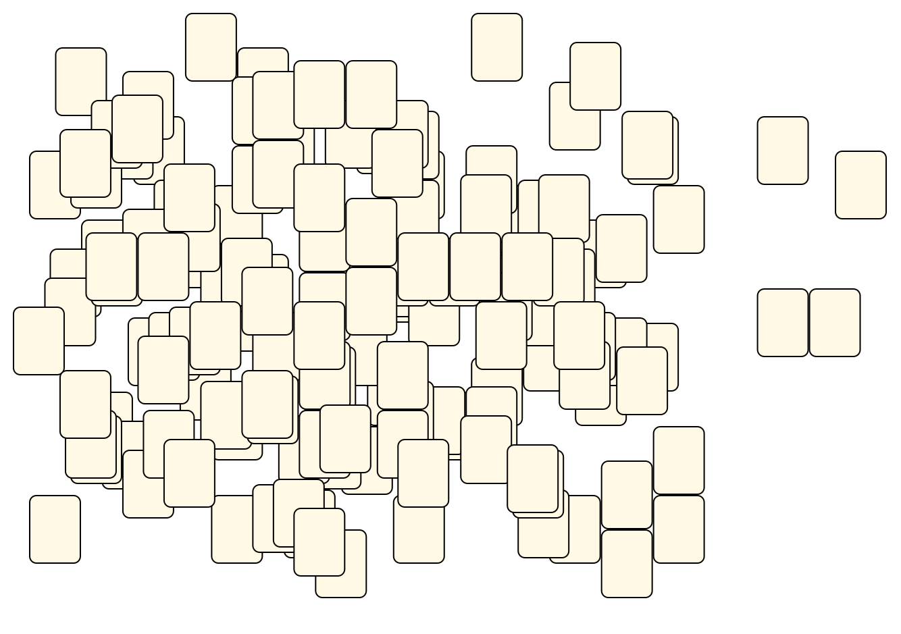<br> <sub>Alexis Bonvin</sub> <br>[.lay](./totally_random-made_layout.lay)  [.layout](./totally_random-made_layout.layout)  [.mah](./totally_random-made_layout.mah) |Tower And Walls<br><br> <sub>Alexis Bonvin</sub> <br>[.lay](./tower_and_walls.lay)  [.layout](./tower_and_walls.layout)  [.mah](./tower_and_walls.mah) |
|Traditional<br>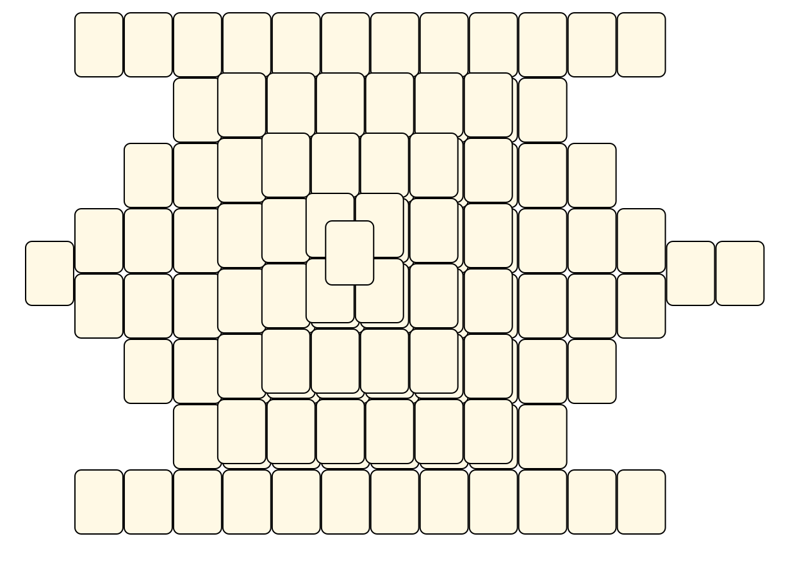<br> <sub>Brodie Lockard</sub> <br>[.lay](./traditional_2.lay)  [.layout](./traditional_2.layout)  [.mah](./traditional_2.mah) |Traditional Reviewed<br><br> <sub>Alexis Bonvin</sub> <br>[.lay](./traditional_reviewed.lay)  [.layout](./traditional_reviewed.layout)  [.mah](./traditional_reviewed.mah) |Tree Of Life<br>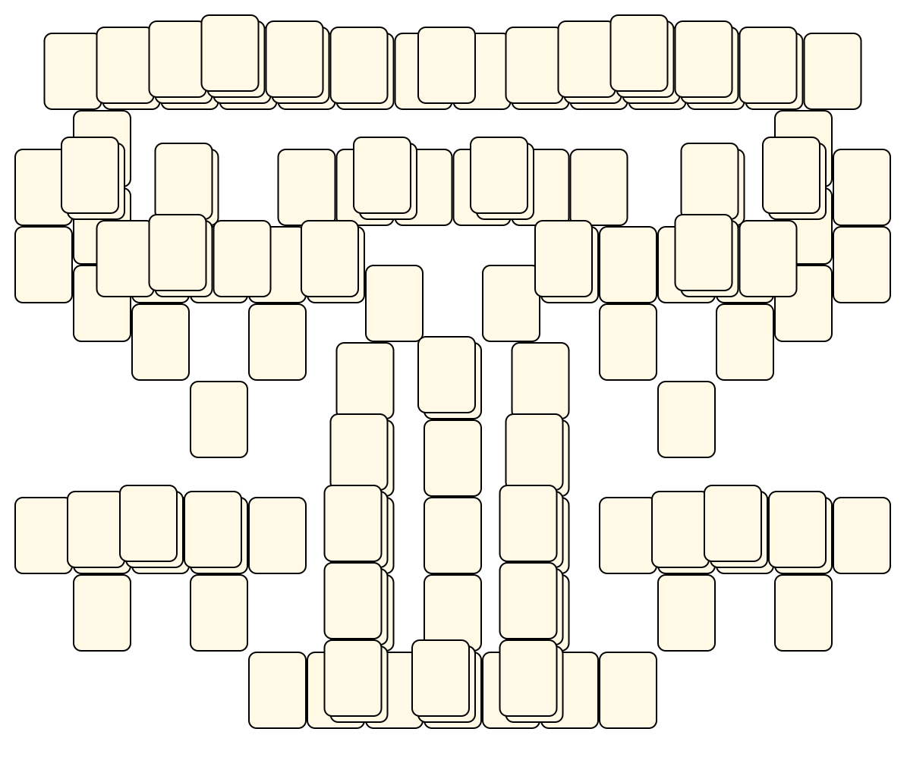<br> <sub>Douglas Ulyate</sub> <br>[.lay](./tree_of_life.lay)  [.layout](./tree_of_life.layout)  [.mah](./tree_of_life.mah) |
|Trika<br><br> <sub>Leonard Enos</sub> <br>[.lay](./trika.lay)  [.layout](./trika.layout)  [.mah](./trika.mah) |Twin<br><br> <sub>MinderTech</sub> <br>[.lay](./twin.lay)  [.layout](./twin.layout)  [.mah](./twin.mah) |Two Domes<br><br> <sub>Alexis Bonvin</sub> <br>[.lay](./two_domes.lay)  [.layout](./two_domes.layout)  [.mah](./two_domes.mah) |
|Vagues<br><br> <sub>Alexis Bonvin</sub> <br>[.lay](./vagues.lay)  [.layout](./vagues.layout)  [.mah](./vagues.mah) |Variation On Deep Well<br><br> <sub>Kyodai</sub> <br>[.lay](./variation_on_deep_well.lay)  [.layout](./variation_on_deep_well.layout)  [.mah](./variation_on_deep_well.mah) |Variation On Deep Well<br><br> <sub>Kyodai</sub> <br>[.lay](./variation_on_deep_well_2.lay)  [.layout](./variation_on_deep_well_2.layout)  [.mah](./variation_on_deep_well_2.mah) |
|Victory Arrow<br><br> <sub>Naoki Haga</sub> <br>[.lay](./victory_arrow.lay)  [.layout](./victory_arrow.layout)  [.mah](./victory_arrow.mah) |Wavelets<br>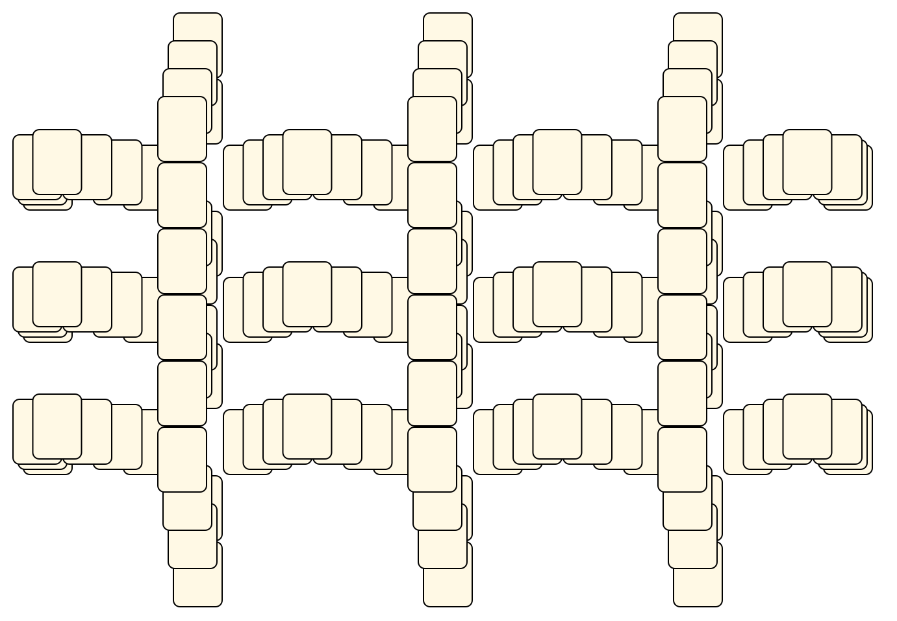<br> <sub>Leonard Enos</sub> <br>[.lay](./wavelets.lay)  [.layout](./wavelets.layout)  [.mah](./wavelets.mah) |Whatever<br>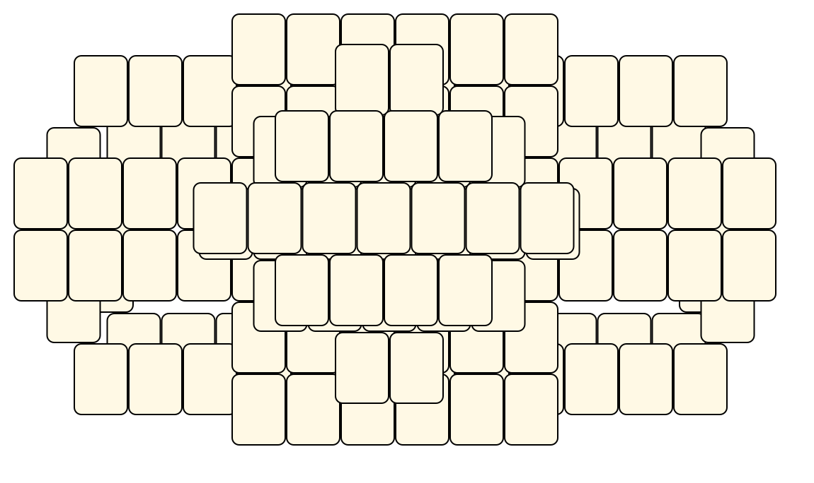<br> <sub>Kyodai</sub> <br>[.lay](./whatever.lay)  [.layout](./whatever.layout)  [.mah](./whatever.mah) |
|Win<br><br> <sub>Wally</sub> <br>[.lay](./win.lay)  [.layout](./win.layout)  [.mah](./win.mah) |X-Files<br><br> <sub>Alexis Bonvin</sub> <br>[.lay](./x-files.lay)  [.layout](./x-files.layout)  [.mah](./x-files.mah) |X-Files<br><br> <sub>Kyodai</sub> <br>[.lay](./x-files_2.lay)  [.layout](./x-files_2.layout)  [.mah](./x-files_2.mah) |
|X-Shape<br><br> <sub>Alexis Bonvin</sub> <br>[.lay](./x-shape.lay)  [.layout](./x-shape.layout)  [.mah](./x-shape.mah) |Yummy<br><br> <sub>Naoki Haga</sub> <br>[.lay](./yummy.lay)  [.layout](./yummy.layout)  [.mah](./yummy.mah) ||