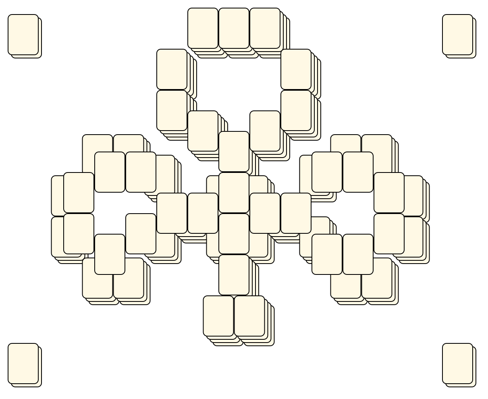

# Mahjong Solitaire Layout Museum: My Kyodai Mahjongg
* Source: [https://web.archive.org/web/20170903145616/http://kyodaimahjongg.weebly.com/layouts.html](https://web.archive.org/web/20170903145616/http://kyodaimahjongg.weebly.com/layouts.html)

* File Source:  
<sub>```https://web.archive.org/web/20170903145616mp_/https://kyodaimahjongg.weebly.com/uploads/9/5/2/9/9529146/mkm-clubs.zip```</sub>


|My Kyodai Mahjongg||Layouts: 1|
|:--:|:--:|:--:|
|Clubs<br><br> <sub>Mary M</sub> <br>[.lay](./clubs_2.lay)  [.layout](./clubs_2.layout)  [.mah](./clubs_2.mah) |