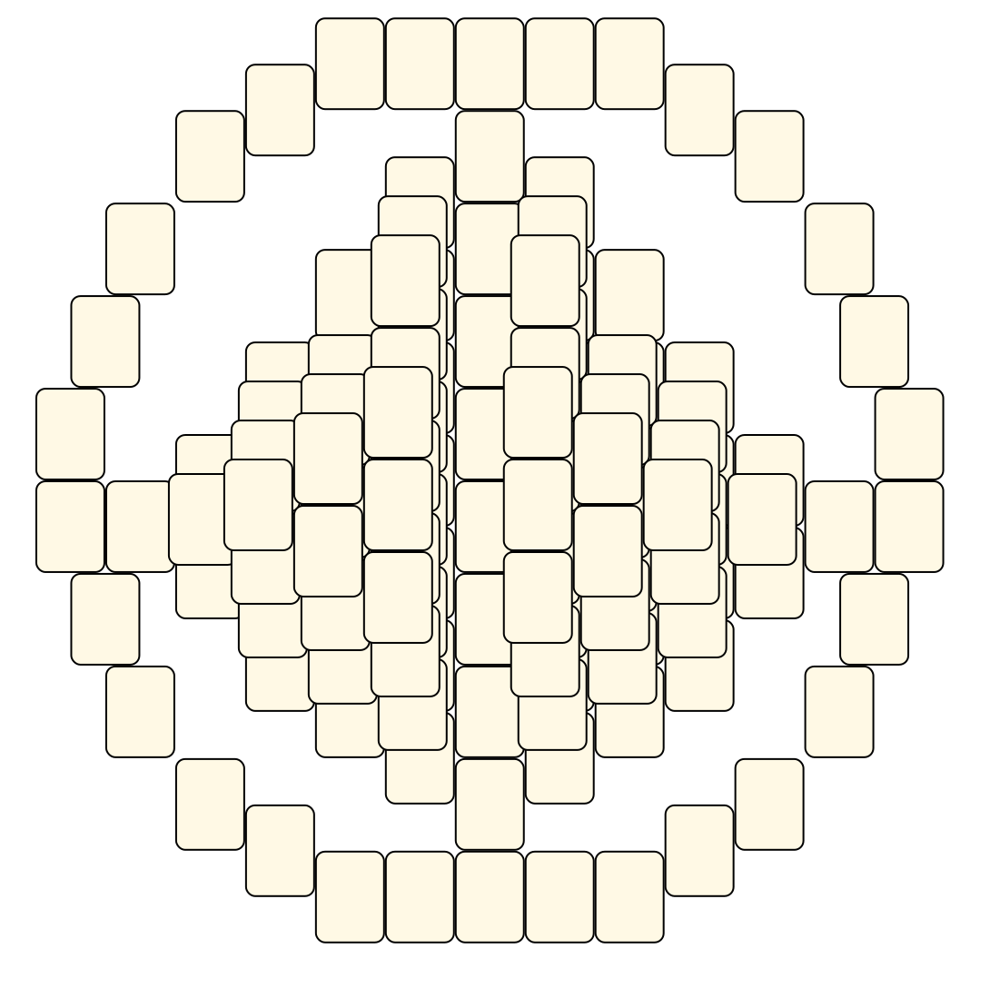

# Mahjong Solitaire Layout Museum: Oneam's Brain Dump
* Source: [https://web.archive.org/web/20010607211511/http://www.geocities.com/Tokyo/Flats/2958/goodys.html](https://web.archive.org/web/20010607211511/http://www.geocities.com/Tokyo/Flats/2958/goodys.html)

* File Source:  
<sub>```https://web.archive.org/web/20001014101830/http://www.geocities.com/Tokyo/Flats/2958/Maclay.zip```</sub>


|Oneam's Brain Dump||Layouts: 1|
|:--:|:--:|:--:|
|Macross<br><br> <sub>Oneam</sub> <br>[.lay](./macross.lay)  [.layout](./macross.layout)  [.mah](./macross.mah) |