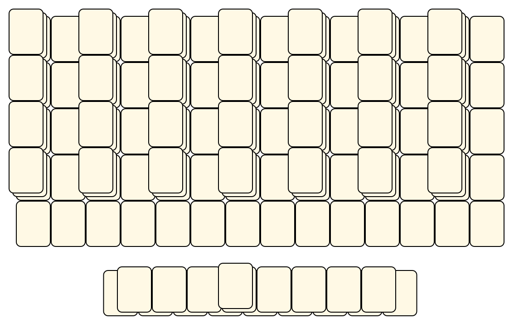
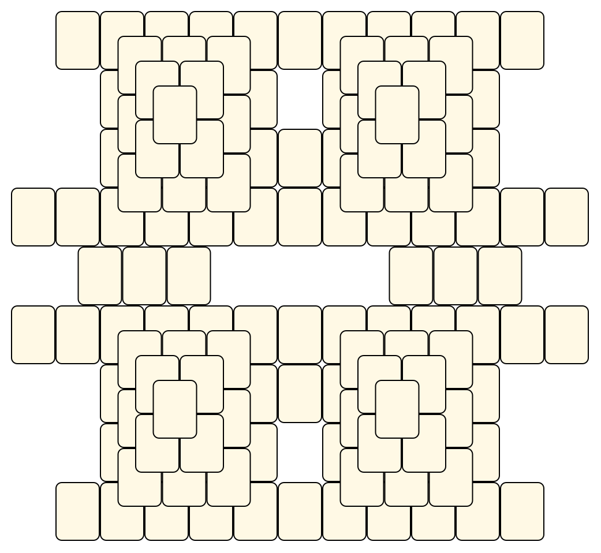
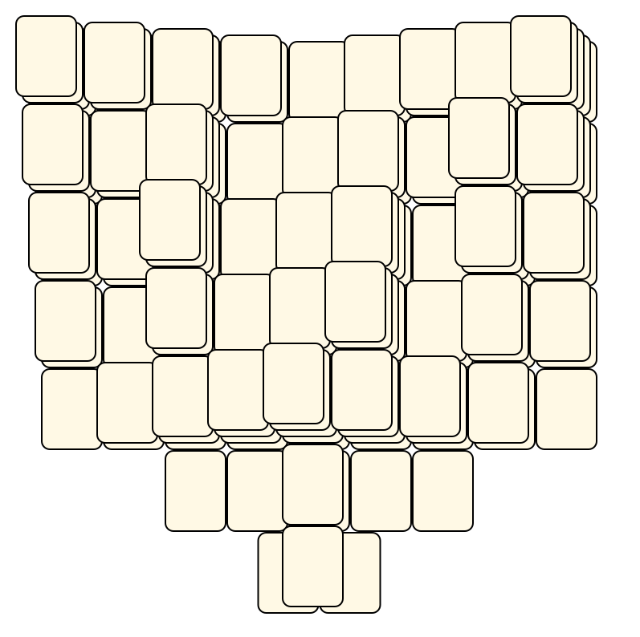
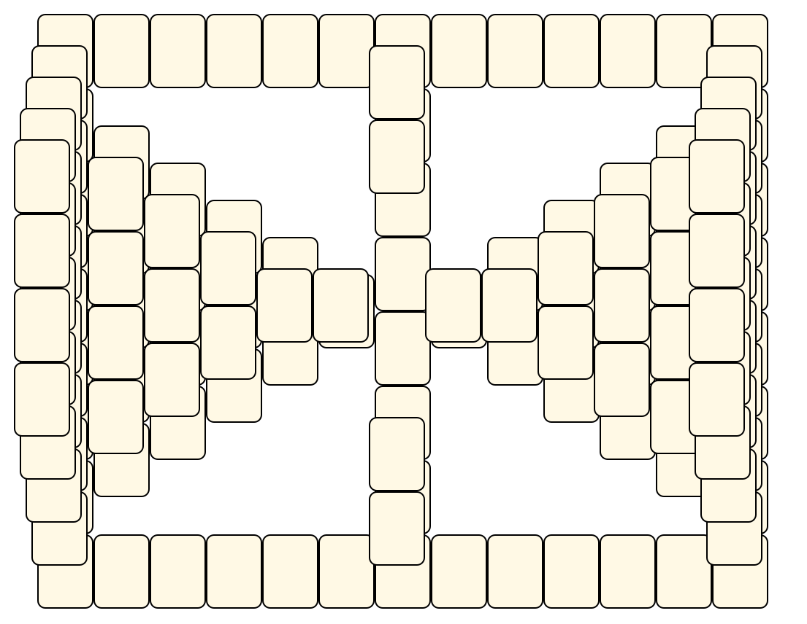
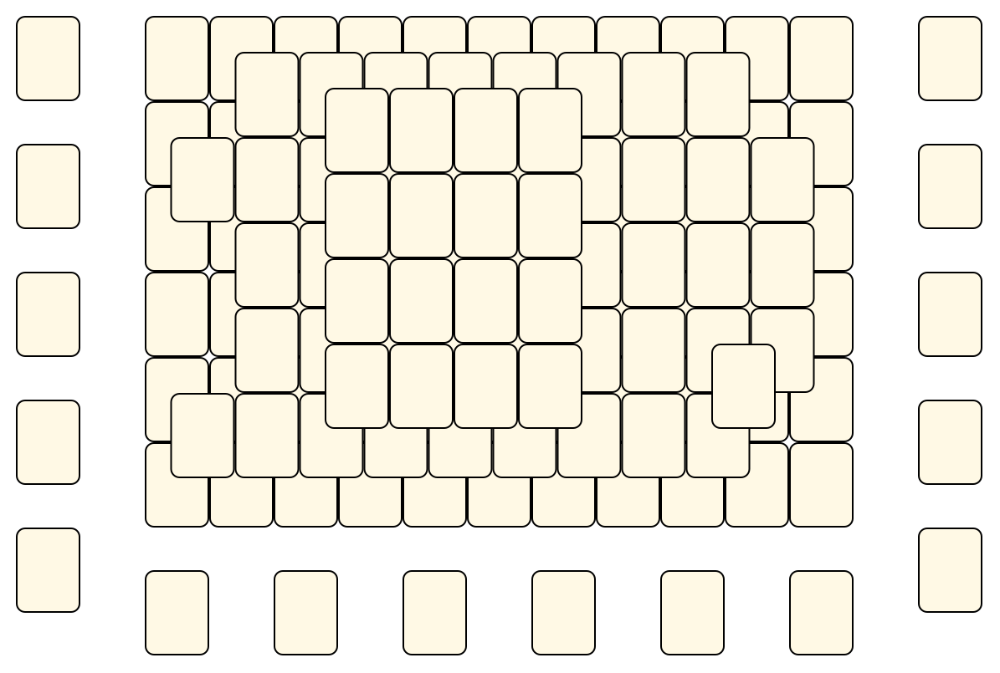
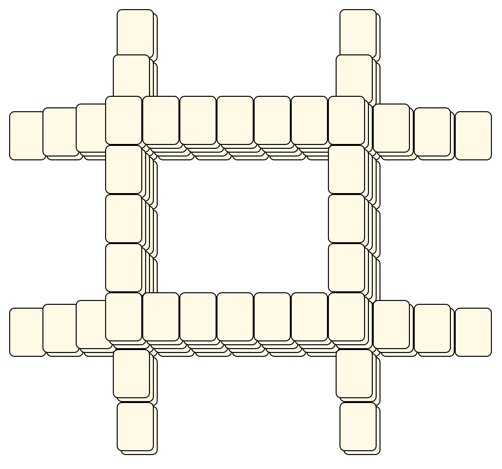

# Mahjong Solitaire Layout Museum: Mahjongg Builder
* Source: [https://github.com/shadowmoon-waltz/MahjonggBuilder/tree/master/app/src/main/res/raw/](https://github.com/shadowmoon-waltz/MahjonggBuilder/tree/master/app/src/main/res/raw/)

* File Source:  
<sub>```https://github.com/shadowmoon-waltz/MahjonggBuilder/tree/master/app/src/main/res/raw/```</sub>


|Mahjongg Builder||Layouts: 1|
|:--:|:--:|:--:|
|Arena<br><br> <sub>unknown</sub> <br>[.lay](./arena_6.lay)  [.layout](./arena_6.layout)  [.mah](./arena_6.mah) |Big Hole<br><br> <sub>unknown</sub> <br>[.lay](./big_hole_5.lay)  [.layout](./big_hole_5.layout)  [.mah](./big_hole_5.mah) |Castle<br><br> <sub>unknown</sub> <br>[.lay](./castle_7.lay)  [.layout](./castle_7.layout)  [.mah](./castle_7.mah) |
|Cloud<br><br> <sub>unknown</sub> <br>[.lay](./cloud_3.lay)  [.layout](./cloud_3.layout)  [.mah](./cloud_3.mah) |Confounding Cross<br><br> <sub>unknown</sub> <br>[.lay](./confounding_cross_2.lay)  [.layout](./confounding_cross_2.layout)  [.mah](./confounding_cross_2.mah) |Deep Well<br><br> <sub>unknown</sub> <br>[.lay](./deep_well_4.lay)  [.layout](./deep_well_4.layout)  [.mah](./deep_well_4.mah) |
|Difficult<br><br> <sub>unknown</sub> <br>[.lay](./difficult.lay)  [.layout](./difficult.layout)  [.mah](./difficult.mah) |Easy<br><br> <sub>unknown</sub> <br>[.lay](./easy.lay)  [.layout](./easy.layout)  [.mah](./easy.mah) |Four Bridges<br><br> <sub>unknown</sub> <br>[.lay](./four_bridges_2.lay)  [.layout](./four_bridges_2.layout)  [.mah](./four_bridges_2.mah) |
|Full Vision 2<br><br> <sub>unknown</sub> <br>[.lay](./full_vision_2_4.lay)  [.layout](./full_vision_2_4.layout)  [.mah](./full_vision_2_4.mah) |Gayle's<br><br> <sub>unknown</sub> <br>[.lay](./gayles_3.lay)  [.layout](./gayles_3.layout)  [.mah](./gayles_3.mah) |High And Low<br><br> <sub>unknown</sub> <br>[.lay](./high_and_low_3.lay)  [.layout](./high_and_low_3.layout)  [.mah](./high_and_low_3.mah) |
|Hourglass<br><br> <sub>unknown</sub> <br>[.lay](./hourglass_6.lay)  [.layout](./hourglass_6.layout)  [.mah](./hourglass_6.mah) |Lost In The Layout<br><br> <sub>unknown</sub> <br>[.lay](./lost_in_the_layout_3.lay)  [.layout](./lost_in_the_layout_3.layout)  [.mah](./lost_in_the_layout_3.mah) |Pyramid<br><br> <sub>unknown</sub> <br>[.lay](./pyramid_6.lay)  [.layout](./pyramid_6.layout)  [.mah](./pyramid_6.mah) |
|Pyramid's Walls<br><br> <sub>unknown</sub> <br>[.lay](./pyramids_walls_2.lay)  [.layout](./pyramids_walls_2.layout)  [.mah](./pyramids_walls_2.mah) |Red Dragon<br><br> <sub>unknown</sub> <br>[.lay](./red_dragon_4.lay)  [.layout](./red_dragon_4.layout)  [.mah](./red_dragon_4.mah) |Tic-Tac-Toe<br><br> <sub>unknown</sub> <br>[.lay](./tic-tac-toe_2.lay)  [.layout](./tic-tac-toe_2.layout)  [.mah](./tic-tac-toe_2.mah) |