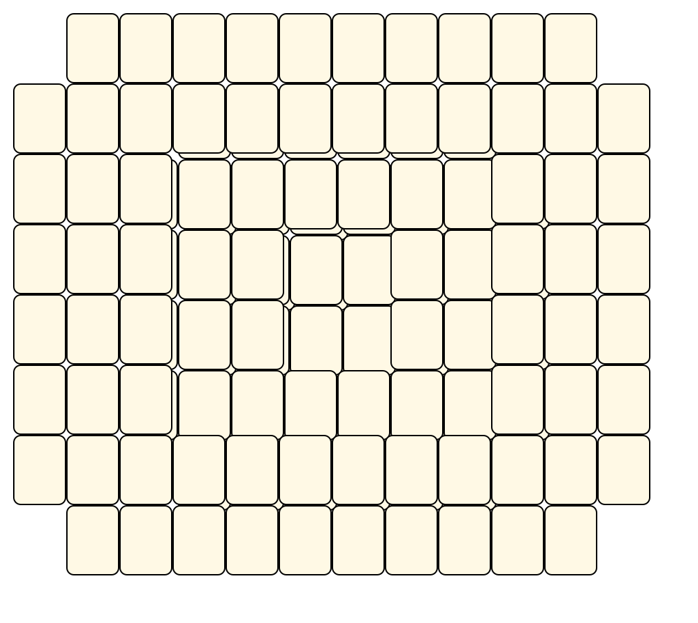
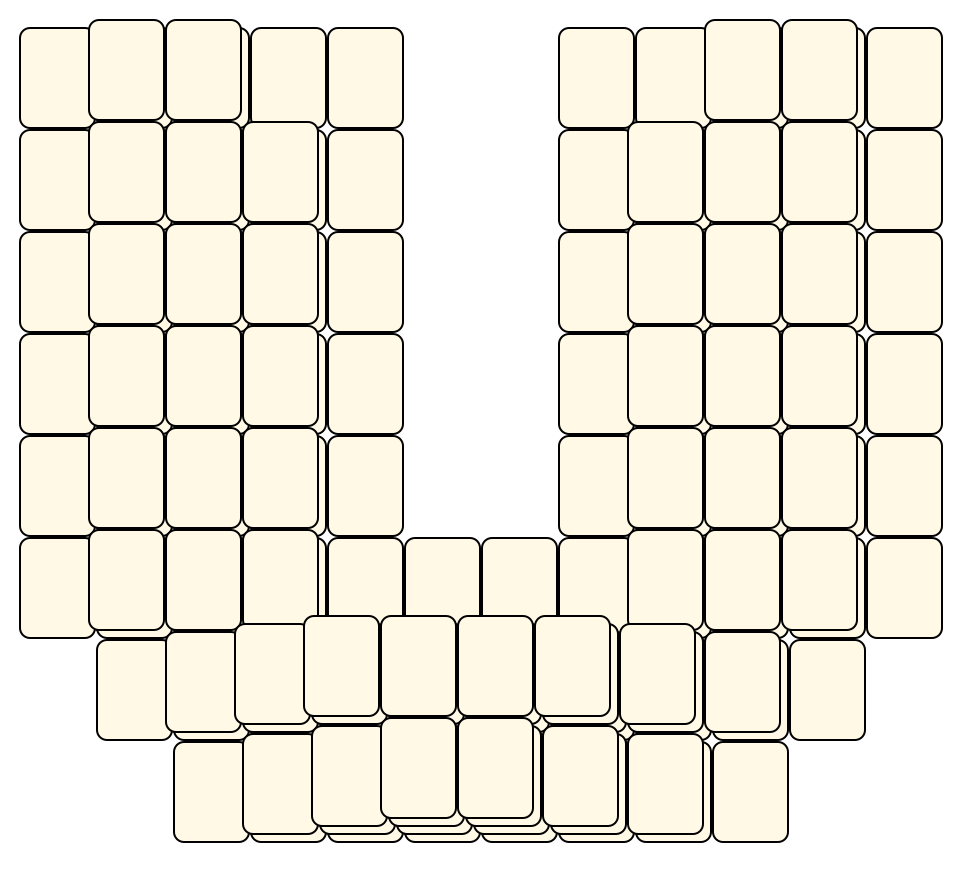
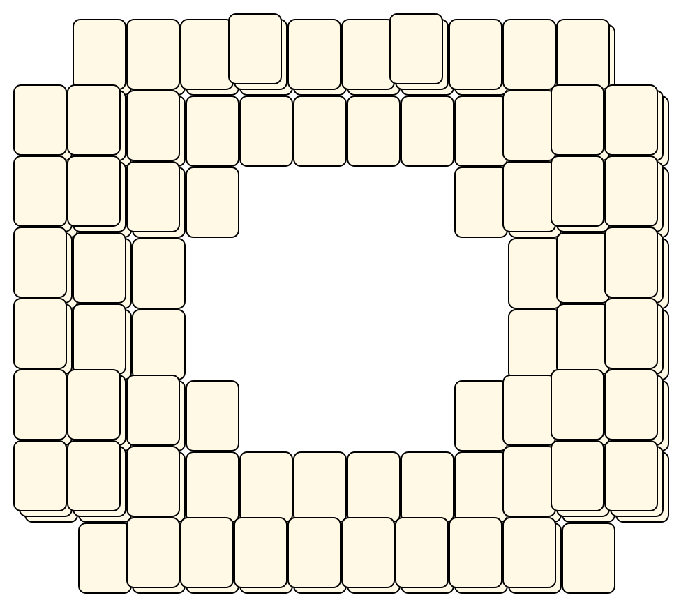
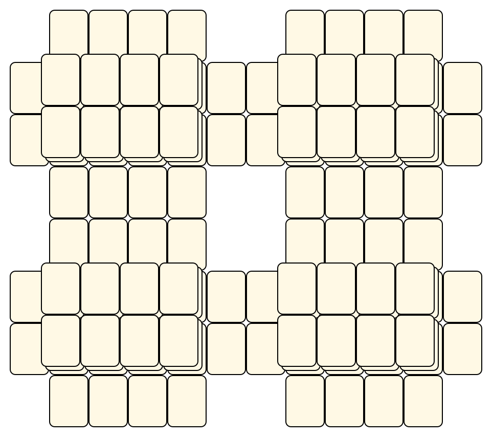
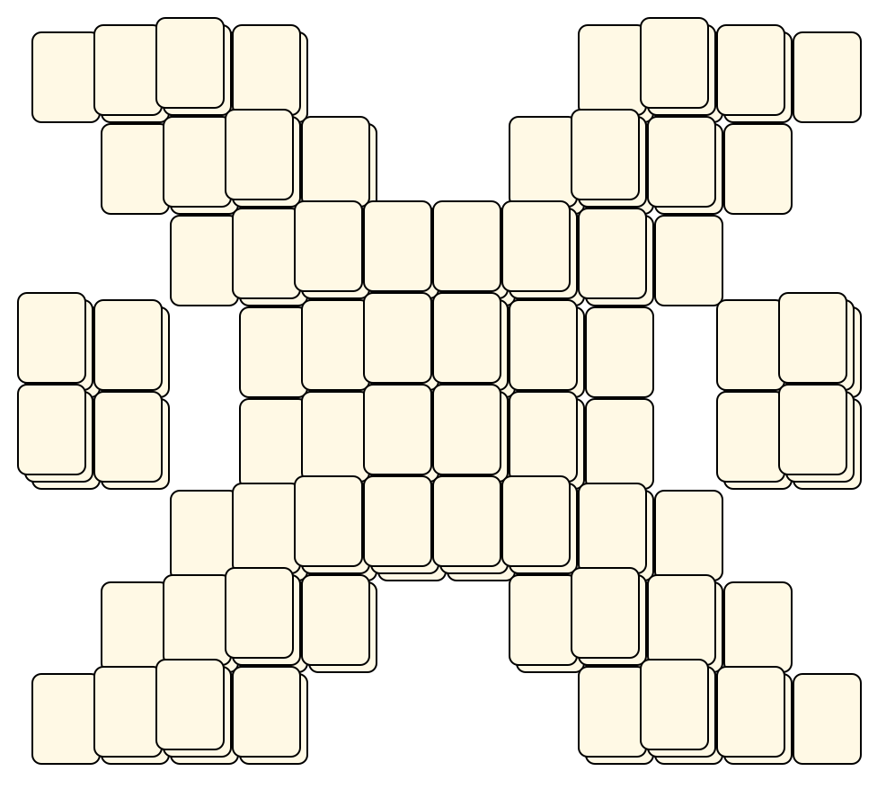

# Mahjong Solitaire Layout Museum: Mah Jongg
* Source: [https://archive.org/details/MahJongg4.1VariousTileSetsAndBoardsNelsAndersonEtAl.1993](https://archive.org/details/MahJongg4.1VariousTileSetsAndBoardsNelsAndersonEtAl.1993)

* File Source:  
<sub>```https://archive.org/download/MahJongg4.1VariousTileSetsAndBoardsNelsAndersonEtAl.1993/Mahjongg.zip```</sub>


|Mah Jongg||Layouts: 5|
|:--:|:--:|:--:|
|Antigrav<br><br> <sub>Nels Anderson</sub> <br>[.lay](./antigrav.lay)  [.layout](./antigrav.layout)  [.mah](./antigrav.mah) |Horseshu<br><br> <sub>Nels Anderson</sub> <br>[.lay](./horseshu.lay)  [.layout](./horseshu.layout)  [.mah](./horseshu.mah) |Stadium<br><br> <sub>Nels Anderson</sub> <br>[.lay](./stadium.lay)  [.layout](./stadium.layout)  [.mah](./stadium.mah) |
|Towers<br><br> <sub>Nels Anderson</sub> <br>[.lay](./towers.lay)  [.layout](./towers.layout)  [.mah](./towers.mah) |Xray<br><br> <sub>Nels Anderson</sub> <br>[.lay](./xray.lay)  [.layout](./xray.layout)  [.mah](./xray.mah) ||