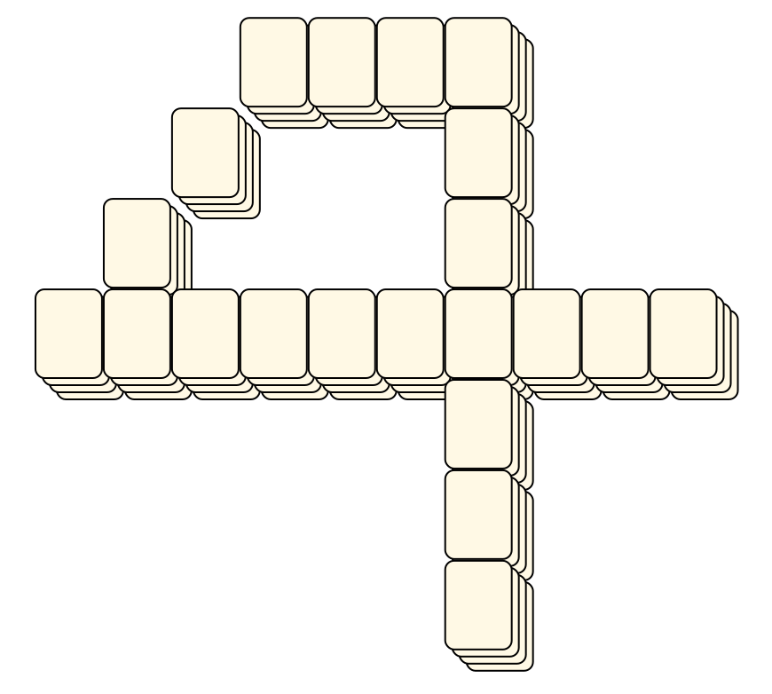
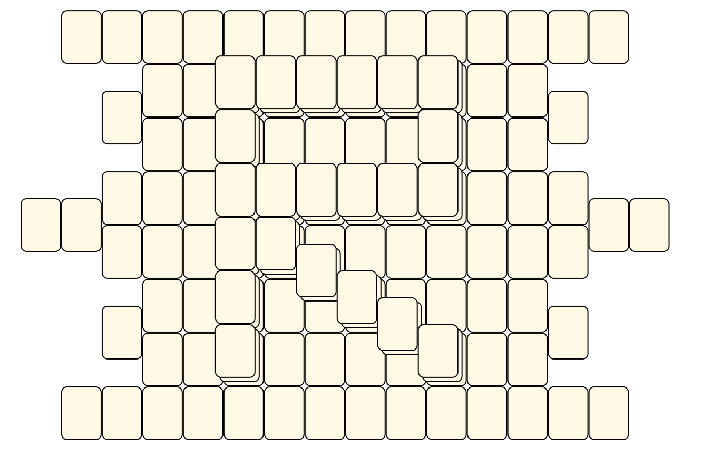

# Mahjong Solitaire Layout Museum: Miss Fantastic
* Source: [https://web.archive.org/web/20030820172841/http://www.missfantastic.com/mahjongg/layouts/](https://web.archive.org/web/20030820172841/http://www.missfantastic.com/mahjongg/layouts/)

* File Source:  
<sub>```https://web.archive.org/web/20030907053712/http://www.missfantastic.com/mahjongg/layouts/```</sub>


|Miss Fantastic||Layouts: 6|
|:--:|:--:|:--:|
|BaxterBuilding<br><br> <sub>Carolyne Smythe</sub> <br>[.lay](./baxterbuilding.lay)  [.layout](./baxterbuilding.layout)  [.mah](./baxterbuilding.mah) |Fantastic Four<br><br> <sub>Carolyne Smythe</sub> <br>[.lay](./fantastic_four.lay)  [.layout](./fantastic_four.layout)  [.mah](./fantastic_four.mah) |Four Freedoms Plaza<br><br> <sub>Carolyne Smythe</sub> <br>[.lay](./four_freedoms_plaza.lay)  [.layout](./four_freedoms_plaza.layout)  [.mah](./four_freedoms_plaza.mah) |
|Pier Four<br><br> <sub>Carolyne Smythe</sub> <br>[.lay](./pier_four.lay)  [.layout](./pier_four.layout)  [.mah](./pier_four.mah) |R Is For Richards Traditional<br><br> <sub>Carolyne Smythe</sub> <br>[.lay](./r_is_for_richards_traditional.lay)  [.layout](./r_is_for_richards_traditional.layout)  [.mah](./r_is_for_richards_traditional.mah) |The Arrow Of Cupid<br><br> <sub>Carolyne Smythe</sub> <br>[.lay](./the_arrow_of_cupid.lay)  [.layout](./the_arrow_of_cupid.layout)  [.mah](./the_arrow_of_cupid.mah) |