# Mahjong Solitaire Layout Museum: OGS
* Source: [https://sourceforge.net/projects/osrpgcreation/files/Mahjong/1.1.0/](https://sourceforge.net/projects/osrpgcreation/files/Mahjong/1.1.0/)

* File Source:  
<sub>```http://sourceforge.net/projects/osrpgcreation/files/Mahjong/1.1.0/ogs-mahjong-1.1.0-linux64.tar.lzma/download```</sub>


|OGS||Layouts: 75|
|:--:|:--:|:--:|
|4 Winds<br><br> <sub>Alexey Charkov</sub> <br>[.lay](./4_winds_2.lay)  [.layout](./4_winds_2.layout)  [.mah](./4_winds_2.mah) |Alien<br><br> <sub>Alexey Charkov</sub> <br>[.lay](./alien_2.lay)  [.layout](./alien_2.layout)  [.mah](./alien_2.mah) |Altar<br><br> <sub>Alexey Charkov</sub> <br>[.lay](./altar_2.lay)  [.layout](./altar_2.layout)  [.mah](./altar_2.mah) |
|Arena<br><br> <sub>Alexey Charkov</sub> <br>[.lay](./arena_2.lay)  [.layout](./arena_2.layout)  [.mah](./arena_2.mah) |Arrow<br><br> <sub>Alexey Charkov</sub> <br>[.lay](./arrow_2.lay)  [.layout](./arrow_2.layout)  [.mah](./arrow_2.mah) |Atlantis<br>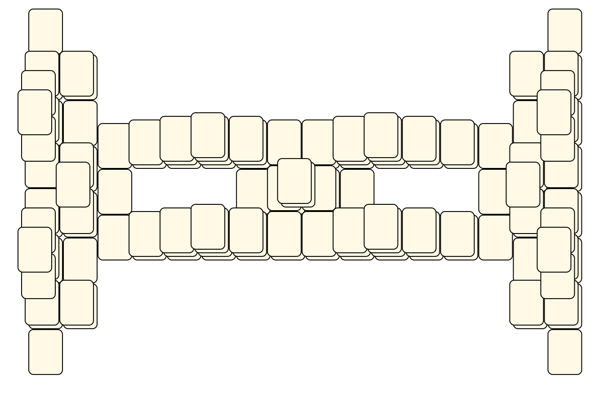<br> <sub>Alexey Charkov</sub> <br>[.lay](./atlantis_2.lay)  [.layout](./atlantis_2.layout)  [.mah](./atlantis_2.mah) |
|Aztec<br><br> <sub>Alexey Charkov</sub> <br>[.lay](./aztec_2.lay)  [.layout](./aztec_2.layout)  [.mah](./aztec_2.mah) |Balance<br><br> <sub>Alexey Charkov</sub> <br>[.lay](./balance_2.lay)  [.layout](./balance_2.layout)  [.mah](./balance_2.mah) |Bat<br><br> <sub>Alexey Charkov</sub> <br>[.lay](./bat_2.lay)  [.layout](./bat_2.layout)  [.mah](./bat_2.mah) |
|Bug<br>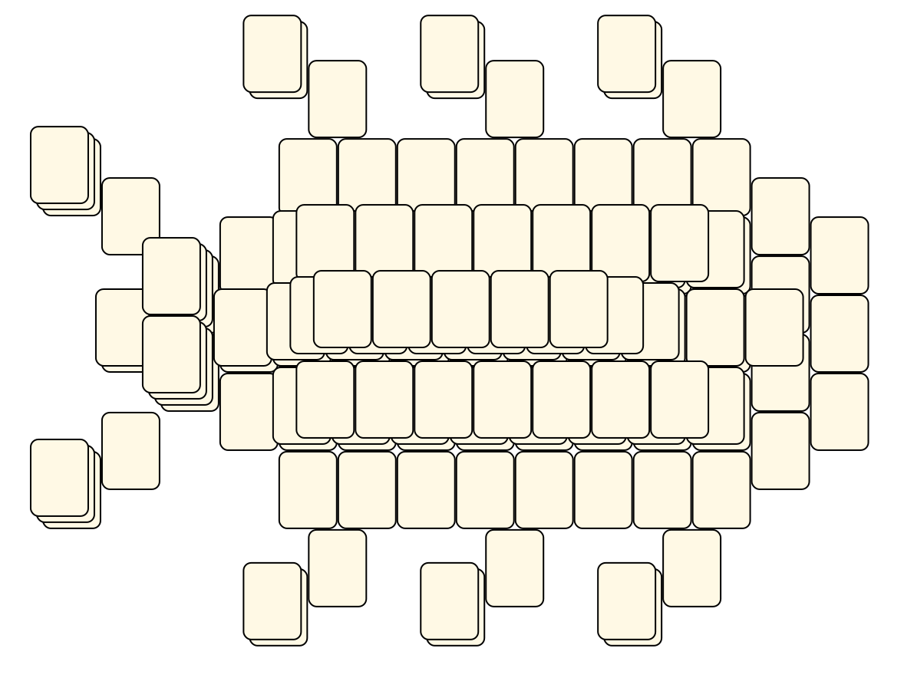<br> <sub>Alexey Charkov</sub> <br>[.lay](./bug_2.lay)  [.layout](./bug_2.layout)  [.mah](./bug_2.mah) |Butterfly<br><br> <sub>Alexey Charkov</sub> <br>[.lay](./butterfly_2.lay)  [.layout](./butterfly_2.layout)  [.mah](./butterfly_2.mah) |Castle<br><br> <sub>Alexey Charkov</sub> <br>[.lay](./castle_2.lay)  [.layout](./castle_2.layout)  [.mah](./castle_2.mah) |
|Castle2<br><br> <sub>Alexey Charkov</sub> <br>[.lay](./castle2_2.lay)  [.layout](./castle2_2.layout)  [.mah](./castle2_2.mah) |Cat<br><br> <sub>Alexey Charkov</sub> <br>[.lay](./cat_3.lay)  [.layout](./cat_3.layout)  [.mah](./cat_3.mah) |Chains<br>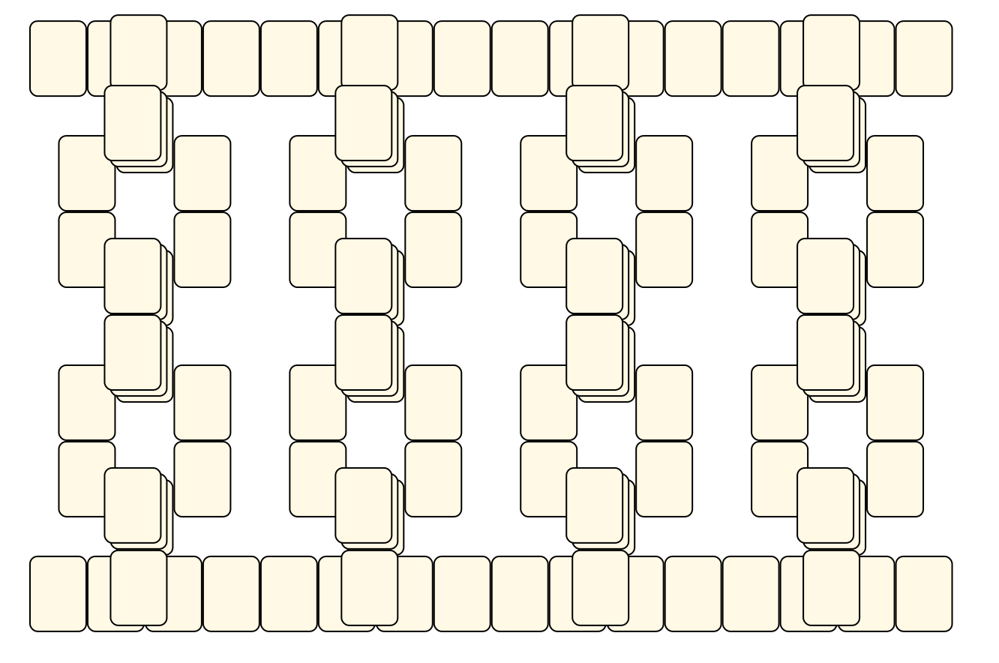<br> <sub>Alexey Charkov</sub> <br>[.lay](./chains_2.lay)  [.layout](./chains_2.layout)  [.mah](./chains_2.mah) |
|Checkered<br><br> <sub>Alexey Charkov</sub> <br>[.lay](./checkered_2.lay)  [.layout](./checkered_2.layout)  [.mah](./checkered_2.mah) |Chip<br>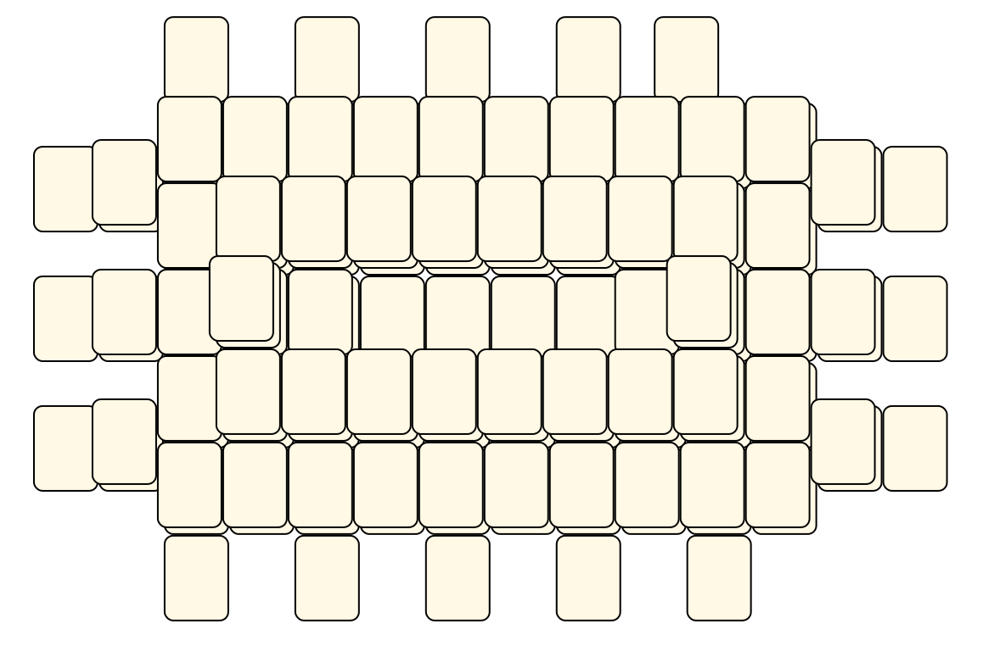<br> <sub>Alexey Charkov</sub> <br>[.lay](./chip_2.lay)  [.layout](./chip_2.layout)  [.mah](./chip_2.mah) |Clubs<br><br> <sub>Alexey Charkov</sub> <br>[.lay](./clubs_3.lay)  [.layout](./clubs_3.layout)  [.mah](./clubs_3.mah) |
|Columns<br><br> <sub>Alexey Charkov</sub> <br>[.lay](./columns_2.lay)  [.layout](./columns_2.layout)  [.mah](./columns_2.mah) |Crab<br><br> <sub>Alexey Charkov</sub> <br>[.lay](./crab_3.lay)  [.layout](./crab_3.layout)  [.mah](./crab_3.mah) |Cross<br><br> <sub>Alexey Charkov</sub> <br>[.lay](./cross_4.lay)  [.layout](./cross_4.layout)  [.mah](./cross_4.mah) |
|Eagle<br><br> <sub>Alexey Charkov</sub> <br>[.lay](./eagle_2.lay)  [.layout](./eagle_2.layout)  [.mah](./eagle_2.mah) |Enterprise<br><br> <sub>Alexey Charkov</sub> <br>[.lay](./enterprise_2.lay)  [.layout](./enterprise_2.layout)  [.mah](./enterprise_2.mah) |Explosion<br><br> <sub>Alexey Charkov</sub> <br>[.lay](./explosion_2.lay)  [.layout](./explosion_2.layout)  [.mah](./explosion_2.mah) |
|Eye<br>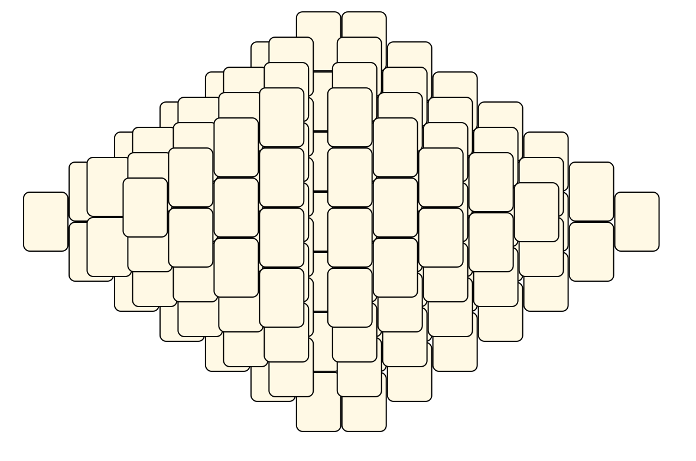<br> <sub>Alexey Charkov</sub> <br>[.lay](./eye.lay)  [.layout](./eye.layout)  [.mah](./eye.mah) |Flowers<br><br> <sub>Alexey Charkov</sub> <br>[.lay](./flowers_2.lay)  [.layout](./flowers_2.layout)  [.mah](./flowers_2.mah) |Future<br>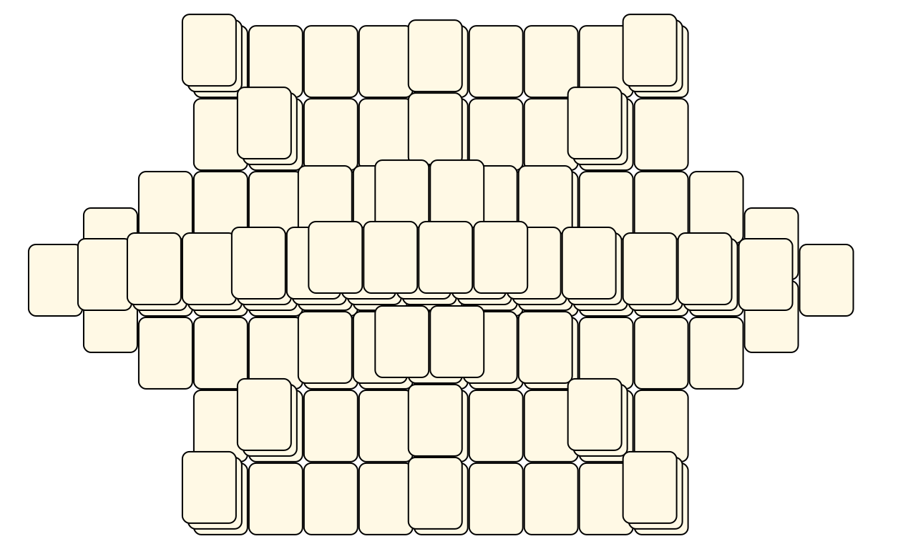<br> <sub>Alexey Charkov</sub> <br>[.lay](./future_2.lay)  [.layout](./future_2.layout)  [.mah](./future_2.mah) |
|Galaxy<br><br> <sub>Alexey Charkov</sub> <br>[.lay](./galaxy_2.lay)  [.layout](./galaxy_2.layout)  [.mah](./galaxy_2.mah) |Garden<br>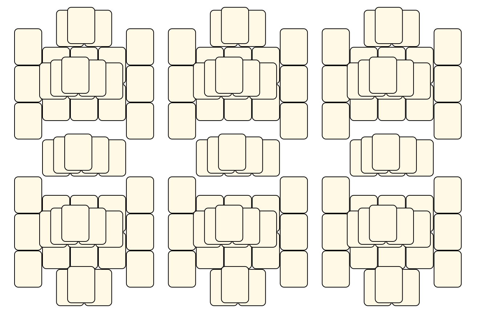<br> <sub>Alexey Charkov</sub> <br>[.lay](./garden_2.lay)  [.layout](./garden_2.layout)  [.mah](./garden_2.mah) |Girl<br>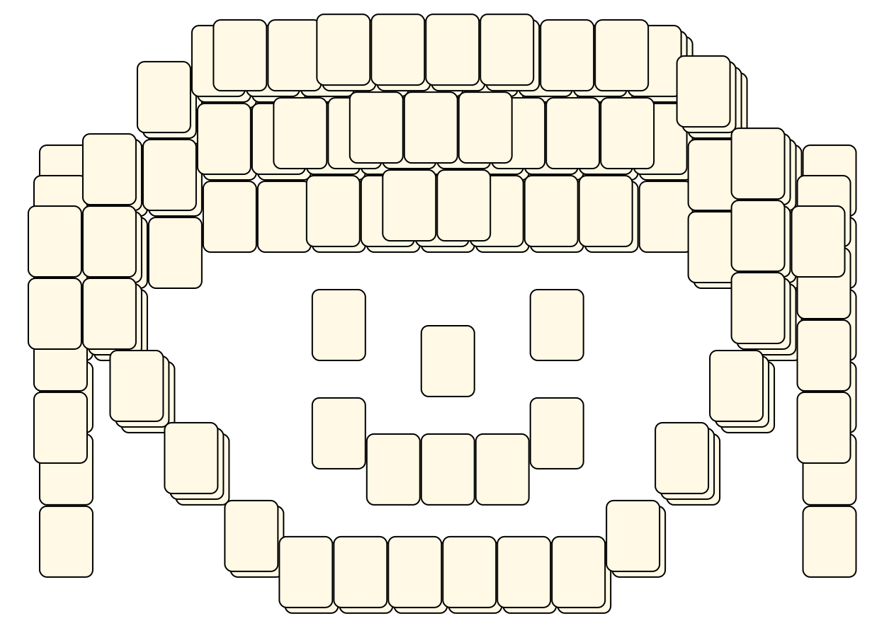<br> <sub>Alexey Charkov</sub> <br>[.lay](./girl_2.lay)  [.layout](./girl_2.layout)  [.mah](./girl_2.mah) |
|Glade<br><br> <sub>Alexey Charkov</sub> <br>[.lay](./glade_2.lay)  [.layout](./glade_2.layout)  [.mah](./glade_2.mah) |Grid<br><br> <sub>Alexey Charkov</sub> <br>[.lay](./grid_2.lay)  [.layout](./grid_2.layout)  [.mah](./grid_2.mah) |Helios<br><br> <sub>Alexey Charkov</sub> <br>[.lay](./helios_2.lay)  [.layout](./helios_2.layout)  [.mah](./helios_2.mah) |
|Hole<br><br> <sub>Alexey Charkov</sub> <br>[.lay](./hole_2.lay)  [.layout](./hole_2.layout)  [.mah](./hole_2.mah) |Inner Circle<br><br> <sub>Alexey Charkov</sub> <br>[.lay](./inner_circle_2.lay)  [.layout](./inner_circle_2.layout)  [.mah](./inner_circle_2.mah) |Key<br>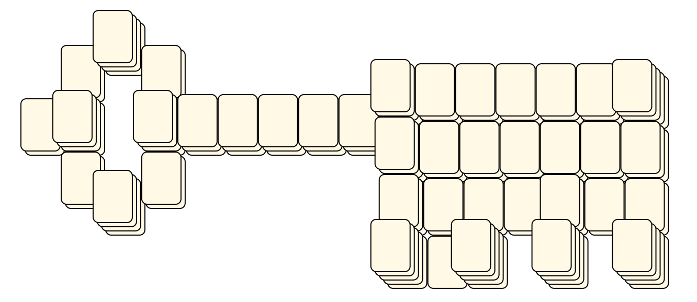<br> <sub>Alexey Charkov</sub> <br>[.lay](./key_2.lay)  [.layout](./key_2.layout)  [.mah](./key_2.mah) |
|Km<br><br> <sub>Alexey Charkov</sub> <br>[.lay](./km_2.lay)  [.layout](./km_2.layout)  [.mah](./km_2.mah) |Labyrinth<br><br> <sub>Alexey Charkov</sub> <br>[.lay](./labyrinth_3.lay)  [.layout](./labyrinth_3.layout)  [.mah](./labyrinth_3.mah) |Mask<br><br> <sub>Alexey Charkov</sub> <br>[.lay](./mask_2.lay)  [.layout](./mask_2.layout)  [.mah](./mask_2.mah) |
|Maya<br><br> <sub>Alexey Charkov</sub> <br>[.lay](./maya_2.lay)  [.layout](./maya_2.layout)  [.mah](./maya_2.mah) |Maze<br><br> <sub>Alexey Charkov</sub> <br>[.lay](./maze_2.lay)  [.layout](./maze_2.layout)  [.mah](./maze_2.mah) |Mesh<br><br> <sub>Alexey Charkov</sub> <br>[.lay](./mesh_2.lay)  [.layout](./mesh_2.layout)  [.mah](./mesh_2.mah) |
|Moth<br><br> <sub>Alexey Charkov</sub> <br>[.lay](./moth_2.lay)  [.layout](./moth_2.layout)  [.mah](./moth_2.mah) |Order<br><br> <sub>Alexey Charkov</sub> <br>[.lay](./order_2.lay)  [.layout](./order_2.layout)  [.mah](./order_2.mah) |Pattern<br>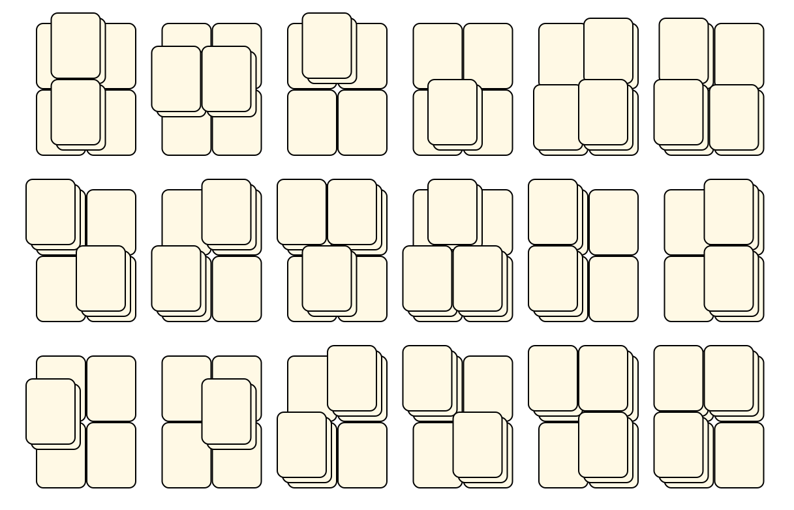<br> <sub>Alexey Charkov</sub> <br>[.lay](./pattern_2.lay)  [.layout](./pattern_2.layout)  [.mah](./pattern_2.mah) |
|Penta<br><br> <sub>Alexey Charkov</sub> <br>[.lay](./penta_2.lay)  [.layout](./penta_2.layout)  [.mah](./penta_2.mah) |Pillars<br><br> <sub>Alexey Charkov</sub> <br>[.lay](./pillars_2.lay)  [.layout](./pillars_2.layout)  [.mah](./pillars_2.mah) |Pirates<br><br> <sub>Alexey Charkov</sub> <br>[.lay](./pirates_2.lay)  [.layout](./pirates_2.layout)  [.mah](./pirates_2.mah) |
|Pyramid<br><br> <sub>Alexey Charkov</sub> <br>[.lay](./pyramid_2.lay)  [.layout](./pyramid_2.layout)  [.mah](./pyramid_2.mah) |Rocket<br><br> <sub>Alexey Charkov</sub> <br>[.lay](./rocket_2.lay)  [.layout](./rocket_2.layout)  [.mah](./rocket_2.mah) |Shield<br><br> <sub>Alexey Charkov</sub> <br>[.lay](./shield_2.lay)  [.layout](./shield_2.layout)  [.mah](./shield_2.mah) |
|Spider<br><br> <sub>Alexey Charkov</sub> <br>[.lay](./spider_2.lay)  [.layout](./spider_2.layout)  [.mah](./spider_2.mah) |Squares<br>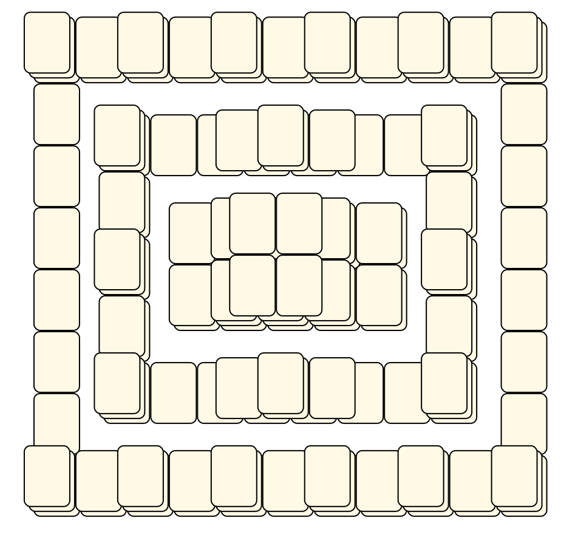<br> <sub>Alexey Charkov</sub> <br>[.lay](./squares_2.lay)  [.layout](./squares_2.layout)  [.mah](./squares_2.mah) |Squaring<br><br> <sub>Alexey Charkov</sub> <br>[.lay](./squaring_2.lay)  [.layout](./squaring_2.layout)  [.mah](./squaring_2.mah) |
|Stadion<br><br> <sub>Alexey Charkov</sub> <br>[.lay](./stadion_2.lay)  [.layout](./stadion_2.layout)  [.mah](./stadion_2.mah) |Stairs<br><br> <sub>Alexey Charkov</sub> <br>[.lay](./stairs_3.lay)  [.layout](./stairs_3.layout)  [.mah](./stairs_3.mah) |Star<br>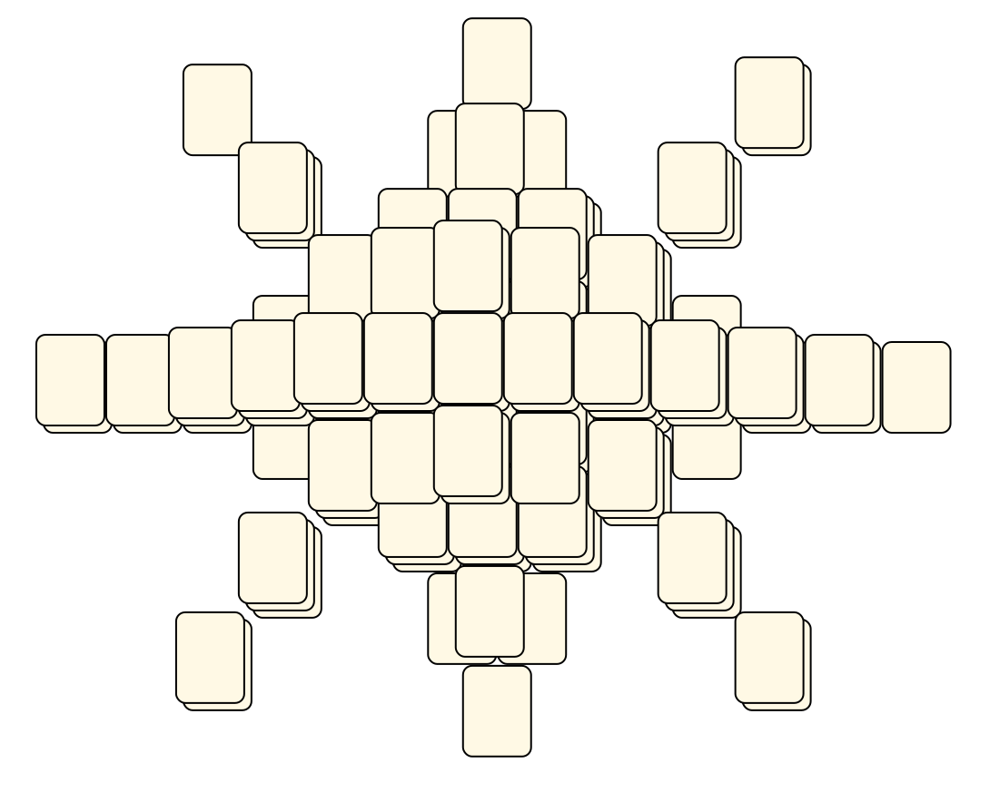<br> <sub>Alexey Charkov</sub> <br>[.lay](./star_2.lay)  [.layout](./star_2.layout)  [.mah](./star_2.mah) |
|Star Ship<br><br> <sub>Alexey Charkov</sub> <br>[.lay](./star_ship_2.lay)  [.layout](./star_ship_2.layout)  [.mah](./star_ship_2.mah) |Stax<br><br> <sub>Alexey Charkov</sub> <br>[.lay](./stax_2.lay)  [.layout](./stax_2.layout)  [.mah](./stax_2.mah) |Swirl<br>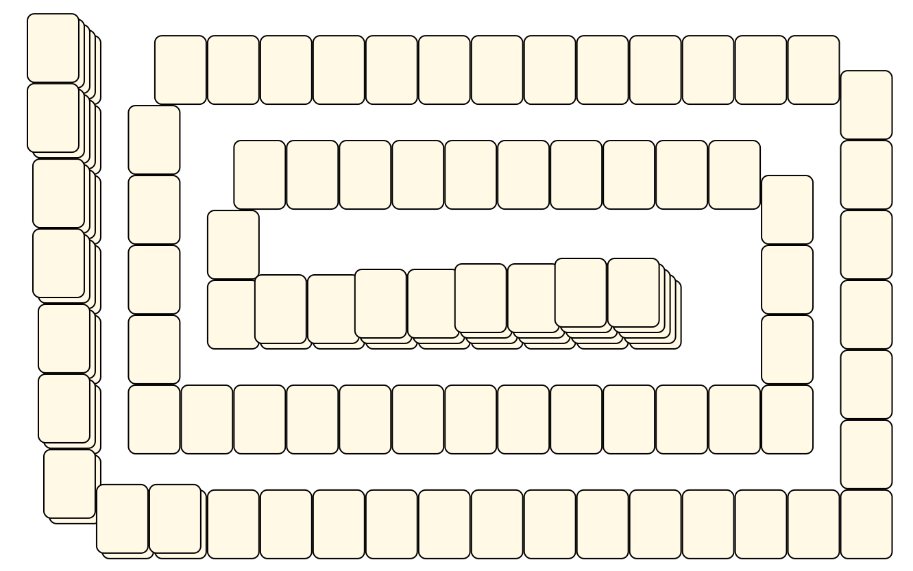<br> <sub>Alexey Charkov</sub> <br>[.lay](./swirl_2.lay)  [.layout](./swirl_2.layout)  [.mah](./swirl_2.mah) |
|Temple<br><br> <sub>Alexey Charkov</sub> <br>[.lay](./temple_2.lay)  [.layout](./temple_2.layout)  [.mah](./temple_2.mah) |Test 2<br>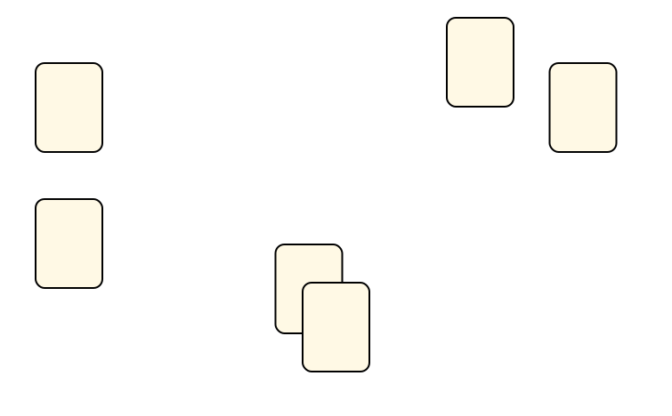<br> <sub>Alexey Charkov</sub> <br>[.lay](./test_2.lay)  [.layout](./test_2.layout)  [.mah](./test_2.mah) |Test Short<br><br> <sub>Alexey Charkov</sub> <br>[.lay](./test_short.lay)  [.layout](./test_short.layout)  [.mah](./test_short.mah) |
|Test Short 4 Winds<br><br> <sub>Alexey Charkov</sub> <br>[.lay](./test_short_4_winds.lay)  [.layout](./test_short_4_winds.layout)  [.mah](./test_short_4_winds.mah) |The Door<br><br> <sub>Alexey Charkov</sub> <br>[.lay](./the_door_2.lay)  [.layout](./the_door_2.layout)  [.mah](./the_door_2.mah) |Time Tunnel<br><br> <sub>Alexey Charkov</sub> <br>[.lay](./time_tunnel_2.lay)  [.layout](./time_tunnel_2.layout)  [.mah](./time_tunnel_2.mah) |
|Tomb<br><br> <sub>Alexey Charkov</sub> <br>[.lay](./tomb_2.lay)  [.layout](./tomb_2.layout)  [.mah](./tomb_2.mah) |Totem<br><br> <sub>Alexey Charkov</sub> <br>[.lay](./totem_2.lay)  [.layout](./totem_2.layout)  [.mah](./totem_2.mah) |Tower<br><br> <sub>Alexey Charkov</sub> <br>[.lay](./tower_2.lay)  [.layout](./tower_2.layout)  [.mah](./tower_2.mah) |
|Triangle<br><br> <sub>Alexey Charkov</sub> <br>[.lay](./triangle_2.lay)  [.layout](./triangle_2.layout)  [.mah](./triangle_2.mah) |Up&down<br><br> <sub>Alexey Charkov</sub> <br>[.lay](./up&down_2.lay)  [.layout](./up&down_2.layout)  [.mah](./up&down_2.mah) |Vi<br><br> <sub>Alexey Charkov</sub> <br>[.lay](./vi_2.lay)  [.layout](./vi_2.layout)  [.mah](./vi_2.mah) |
|Volcano<br>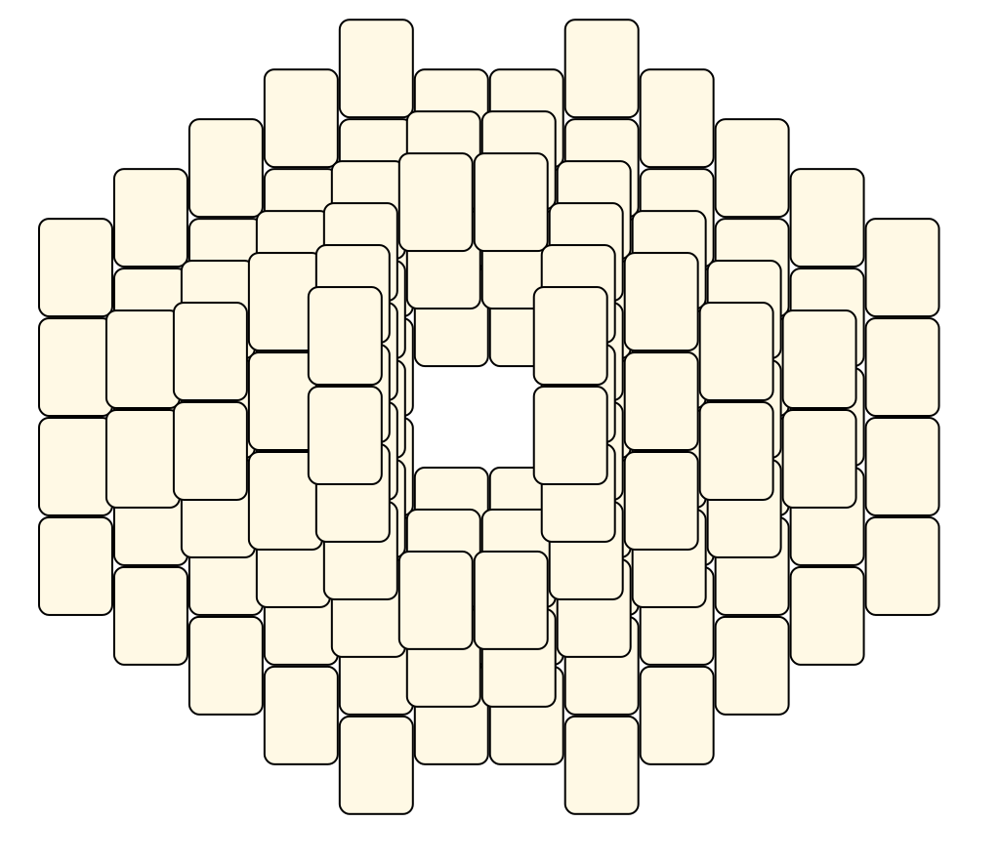<br> <sub>Alexey Charkov</sub> <br>[.lay](./volcano.lay)  [.layout](./volcano.layout)  [.mah](./volcano.mah) |Well<br><br> <sub>Alexey Charkov</sub> <br>[.lay](./well_2.lay)  [.layout](./well_2.layout)  [.mah](./well_2.mah) |X Shaped<br><br> <sub>Alexey Charkov</sub> <br>[.lay](./x_shaped_2.lay)  [.layout](./x_shaped_2.layout)  [.mah](./x_shaped_2.mah) |

## OGS
* Source: 
[https://sourceforge.net/p/osrpgcreation/code/ci/default/tree/tools/LayoutEditor/MyLayouts/robot.layout](https://sourceforge.net/p/osrpgcreation/code/ci/default/tree/tools/LayoutEditor/MyLayouts/robot.layout)

* File Source:  
<sub>```https://sourceforge.net/p/osrpgcreation/code/ci/default/tree/tools/LayoutEditor/MyLayouts/robot.layout?format=raw```</sub>


|[robot](robot/README.md) ||Layouts: 1|
|:--:|:--:|:--:|
|Robot<br><br> <sub>Alexey Charkov</sub> <br>[.lay](./robot/robot.lay)  [.layout](./robot/robot.layout)  [.mah](./robot/robot.mah) |