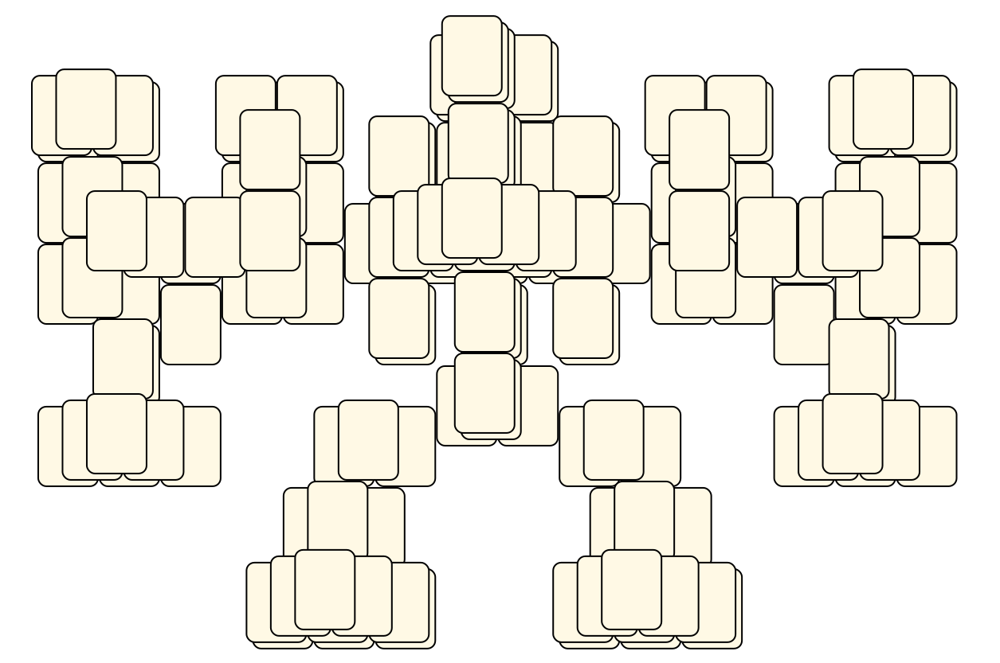

# Mahjong Solitaire Layout Museum: OGS
* Source: [https://sourceforge.net/p/osrpgcreation/code/ci/default/tree/tools/LayoutEditor/MyLayouts/robot.layout](https://sourceforge.net/p/osrpgcreation/code/ci/default/tree/tools/LayoutEditor/MyLayouts/robot.layout)

* File Source:  
<sub>```https://sourceforge.net/p/osrpgcreation/code/ci/default/tree/tools/LayoutEditor/MyLayouts/robot.layout?format=raw```</sub>


|OGS||Layouts: 1|
|:--:|:--:|:--:|
|Robot<br><br> <sub>Alexey Charkov</sub> <br>[.lay](./robot.lay)  [.layout](./robot.layout)  [.mah](./robot.mah) |