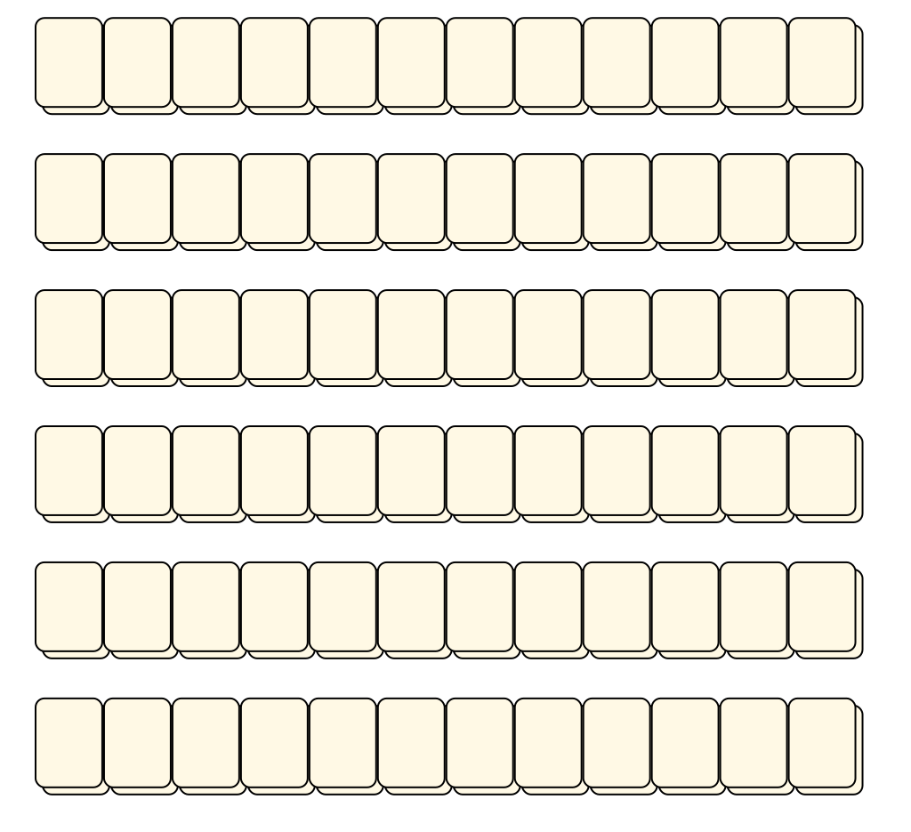

# Mahjong Solitaire Layout Museum: Monika Ottosson

## Monika Ottosson
* Source: 
[https://web.archive.org/web/20190804145400/http://www.angelfire.com/mo2/ottosson/layouts.html](https://web.archive.org/web/20190804145400/http://www.angelfire.com/mo2/ottosson/layouts.html)

* File Source:  
<sub>```https://web.archive.org/web/20190804145429/http://www.angelfire.com/mo2/ottosson/layouts/12bars.zip```</sub>


|[12bars](12bars/README.md) ||Layouts: 1|
|:--:|:--:|:--:|
|12 Bars<br><br> <sub>Monica Ottosson</sub> <br>[.lay](./12bars/12_bars.lay)  [.layout](./12bars/12_bars.layout)  [.mah](./12bars/12_bars.mah) |

## Monika Ottosson
* Source: 
[https://web.archive.org/web/20190804145400/http://www.angelfire.com/mo2/ottosson/layouts.html](https://web.archive.org/web/20190804145400/http://www.angelfire.com/mo2/ottosson/layouts.html)

* File Source:  
<sub>```https://web.archive.org/web/20190804145429/http://www.angelfire.com/mo2/ottosson/layouts/144.zip```</sub>


|[144](144/README.md) ||Layouts: 1|
|:--:|:--:|:--:|
|144<br><br> <sub>Monica Ottosson</sub> <br>[.lay](./144/144.lay)  [.layout](./144/144.layout)  [.mah](./144/144.mah) |

## Monika Ottosson
* Source: 
[https://web.archive.org/web/20190804145400/http://www.angelfire.com/mo2/ottosson/layouts.html](https://web.archive.org/web/20190804145400/http://www.angelfire.com/mo2/ottosson/layouts.html)

* File Source:  
<sub>```https://web.archive.org/web/20190804145427/http://www.angelfire.com/mo2/ottosson/layouts/144b.zip```</sub>


|[144b](144b/README.md) ||Layouts: 1|
|:--:|:--:|:--:|
|144b<br><br> <sub>Monica Ottosson</sub> <br>[.lay](./144b/144b.lay)  [.layout](./144b/144b.layout)  [.mah](./144b/144b.mah) |

## Monika Ottosson
* Source: 
[https://web.archive.org/web/20190804145400/http://www.angelfire.com/mo2/ottosson/layouts.html](https://web.archive.org/web/20190804145400/http://www.angelfire.com/mo2/ottosson/layouts.html)

* File Source:  
<sub>```https://web.archive.org/web/20190804145427/http://www.angelfire.com/mo2/ottosson/layouts/144cc.zip```</sub>


|[144cc](144cc/README.md) ||Layouts: 1|
|:--:|:--:|:--:|
|144cc<br><br> <sub>Monica Ottosson</sub> <br>[.lay](./144cc/144cc.lay)  [.layout](./144cc/144cc.layout)  [.mah](./144cc/144cc.mah) |

## Monika Ottosson
* Source: 
[https://web.archive.org/web/20190804145400/http://www.angelfire.com/mo2/ottosson/layouts.html](https://web.archive.org/web/20190804145400/http://www.angelfire.com/mo2/ottosson/layouts.html)

* File Source:  
<sub>```https://web.archive.org/web/20190804145430/http://www.angelfire.com/mo2/ottosson/layouts/2002.zip```</sub>


|[2002](2002/README.md) ||Layouts: 1|
|:--:|:--:|:--:|
|2002<br><br> <sub>Monica Ottosson</sub> <br>[.lay](./2002/2002.lay)  [.layout](./2002/2002.layout)  [.mah](./2002/2002.mah) |

## Monika Ottosson
* Source: 
[https://web.archive.org/web/20190804145400/http://www.angelfire.com/mo2/ottosson/layouts.html](https://web.archive.org/web/20190804145400/http://www.angelfire.com/mo2/ottosson/layouts.html)

* File Source:  
<sub>```https://web.archive.org/web/20190804145426/http://www.angelfire.com/mo2/ottosson/layouts/2x6x6.zip```</sub>


|[2x6x6](2x6x6/README.md) ||Layouts: 1|
|:--:|:--:|:--:|
|2 X 6 X 6<br><br> <sub>Monica Ottosson</sub> <br>[.lay](./2x6x6/2_x_6_x_6.lay)  [.layout](./2x6x6/2_x_6_x_6.layout)  [.mah](./2x6x6/2_x_6_x_6.mah) |

## Monika Ottosson
* Source: 
[https://web.archive.org/web/20190804145400/http://www.angelfire.com/mo2/ottosson/layouts.html](https://web.archive.org/web/20190804145400/http://www.angelfire.com/mo2/ottosson/layouts.html)

* File Source:  
<sub>```https://web.archive.org/web/20190804145400/http://www.angelfire.com/mo2/ottosson/layouts/3mars.zip```</sub>


|[3mars](3mars/README.md) ||Layouts: 1|
|:--:|:--:|:--:|
|3 Mars<br><br> <sub>Monica Ottosson</sub> <br>[.lay](./3mars/3_mars.lay)  [.layout](./3mars/3_mars.layout)  [.mah](./3mars/3_mars.mah) |

## Monika Ottosson
* Source: 
[https://web.archive.org/web/20190804145400/http://www.angelfire.com/mo2/ottosson/layouts.html](https://web.archive.org/web/20190804145400/http://www.angelfire.com/mo2/ottosson/layouts.html)

* File Source:  
<sub>```https://web.archive.org/web/20190804145428/http://www.angelfire.com/mo2/ottosson/layouts/3x6.zip```</sub>


|[3x6](3x6/README.md) ||Layouts: 1|
|:--:|:--:|:--:|
|3 X 6<br><br> <sub>Monica Ottosson</sub> <br>[.lay](./3x6/3_x_6.lay)  [.layout](./3x6/3_x_6.layout)  [.mah](./3x6/3_x_6.mah) |

## Monika Ottosson
* Source: 
[https://web.archive.org/web/20190804145400/http://www.angelfire.com/mo2/ottosson/layouts.html](https://web.archive.org/web/20190804145400/http://www.angelfire.com/mo2/ottosson/layouts.html)

* File Source:  
<sub>```https://web.archive.org/web/20190804145428/http://www.angelfire.com/mo2/ottosson/layouts/6bars.zip```</sub>


|[6bars](6bars/README.md) ||Layouts: 1|
|:--:|:--:|:--:|
|6 Bars<br><br> <sub>Monica Ottosson</sub> <br>[.lay](./6bars/6_bars.lay)  [.layout](./6bars/6_bars.layout)  [.mah](./6bars/6_bars.mah) |

## Monika Ottosson
* Source: 
[https://web.archive.org/web/20190804145400/http://www.angelfire.com/mo2/ottosson/layouts.html](https://web.archive.org/web/20190804145400/http://www.angelfire.com/mo2/ottosson/layouts.html)

* File Source:  
<sub>```https://web.archive.org/web/20190804145425/http://www.angelfire.com/mo2/ottosson/layouts/6x24.zip```</sub>


|[6x24](6x24/README.md) ||Layouts: 1|
|:--:|:--:|:--:|
|6 X 24<br><br> <sub>Monica Ottosson</sub> <br>[.lay](./6x24/6_x_24.lay)  [.layout](./6x24/6_x_24.layout)  [.mah](./6x24/6_x_24.mah) |

## Monika Ottosson
* Source: 
[https://web.archive.org/web/20190804145400/http://www.angelfire.com/mo2/ottosson/layouts.html](https://web.archive.org/web/20190804145400/http://www.angelfire.com/mo2/ottosson/layouts.html)

* File Source:  
<sub>```https://web.archive.org/web/20190804145425/http://www.angelfire.com/mo2/ottosson/layouts/9bars.zip```</sub>


|[9bars](9bars/README.md) ||Layouts: 1|
|:--:|:--:|:--:|
|9 Bars<br><br> <sub>Monica Ottosson</sub> <br>[.lay](./9bars/9_bars.lay)  [.layout](./9bars/9_bars.layout)  [.mah](./9bars/9_bars.mah) |

## Monika Ottosson
* Source: 
[https://web.archive.org/web/20190804145400/http://www.angelfire.com/mo2/ottosson/layouts.html](https://web.archive.org/web/20190804145400/http://www.angelfire.com/mo2/ottosson/layouts.html)

* File Source:  
<sub>```https://web.archive.org/web/20190804145426/http://www.angelfire.com/mo2/ottosson/layouts/Fence.zip```</sub>


|[Fence](Fence/README.md) ||Layouts: 1|
|:--:|:--:|:--:|
|Fence<br><br> <sub>Monica Ottosson</sub> <br>[.lay](./Fence/fence.lay)  [.layout](./Fence/fence.layout)  [.mah](./Fence/fence.mah) |

## Monika Ottosson
* Source: 
[https://web.archive.org/web/20190804145400/http://www.angelfire.com/mo2/ottosson/layouts.html](https://web.archive.org/web/20190804145400/http://www.angelfire.com/mo2/ottosson/layouts.html)

* File Source:  
<sub>```https://web.archive.org/web/20190804145426/http://www.angelfire.com/mo2/ottosson/layouts/Pc.zip```</sub>


|[Pc](Pc/README.md) ||Layouts: 1|
|:--:|:--:|:--:|
|PC<br><br> <sub>Monica Ottosson</sub> <br>[.lay](./Pc/pc.lay)  [.layout](./Pc/pc.layout)  [.mah](./Pc/pc.mah) |