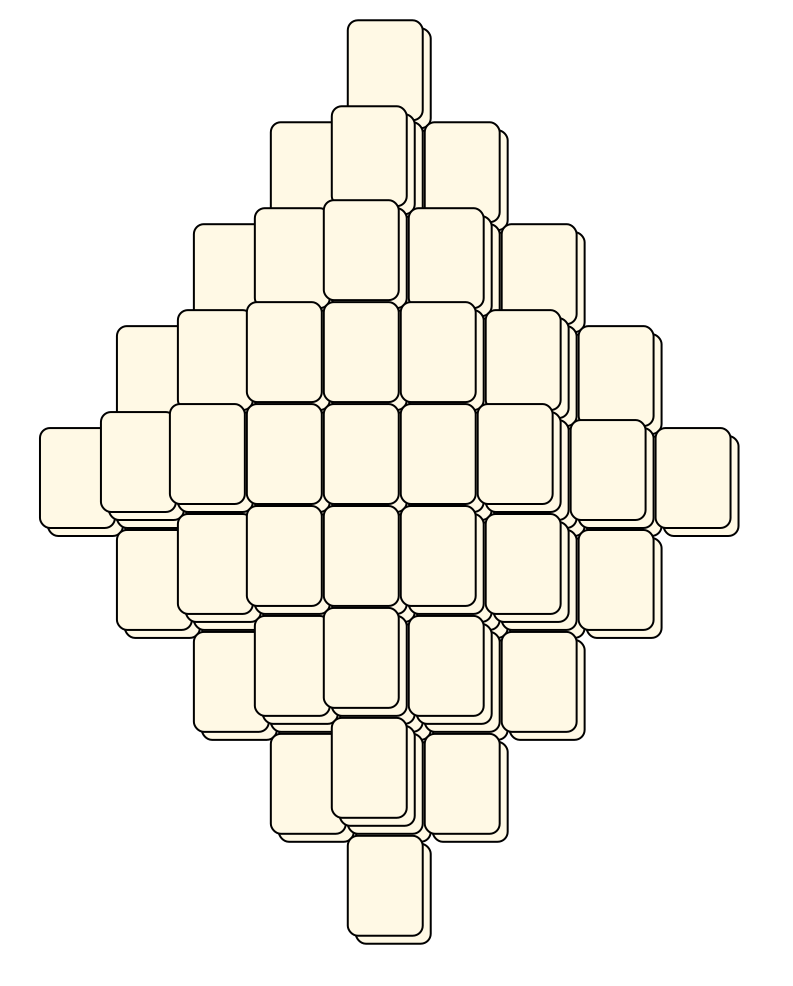

# Mahjong Solitaire Layout Museum: Cards
* Source: [https://web.archive.org/web/20120408030546/http://members.fortunecity.com/phantagia/layouts.htm](https://web.archive.org/web/20120408030546/http://members.fortunecity.com/phantagia/layouts.htm)

* File Source:  
<sub>```https://web.archive.org/web/20120408030904/http://members.fortunecity.com/phantagia/layouts/eplayouts.zip#eplaycards.zip```</sub>


|Cards||Layouts: 4|
|:--:|:--:|:--:|
|Clubs<br><br> <sub>Ernie Polegato</sub> <br>[.lay](./clubs_5.lay)  [.layout](./clubs_5.layout)  [.mah](./clubs_5.mah) |Diamonds<br><br> <sub>Ernie Polegato</sub> <br>[.lay](./diamonds_3.lay)  [.layout](./diamonds_3.layout)  [.mah](./diamonds_3.mah) |Hearts<br><br> <sub>Ernie Polegato</sub> <br>[.lay](./hearts_3.lay)  [.layout](./hearts_3.layout)  [.mah](./hearts_3.mah) |
|Spades<br><br> <sub>Ernie Polegato</sub> <br>[.lay](./spades_3.lay)  [.layout](./spades_3.layout)  [.mah](./spades_3.mah) |||