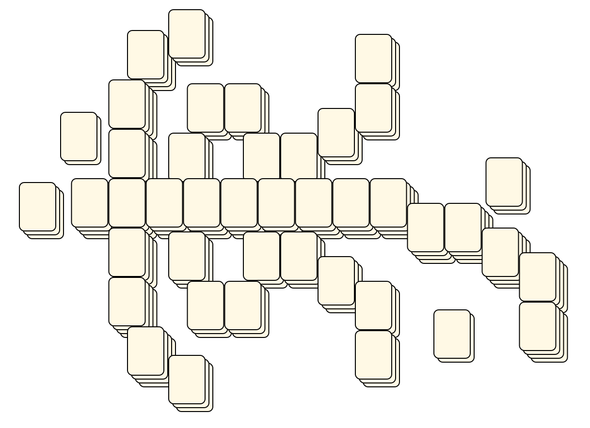
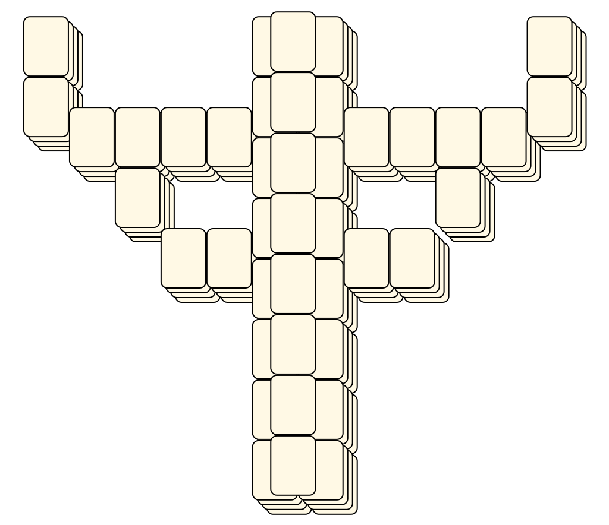
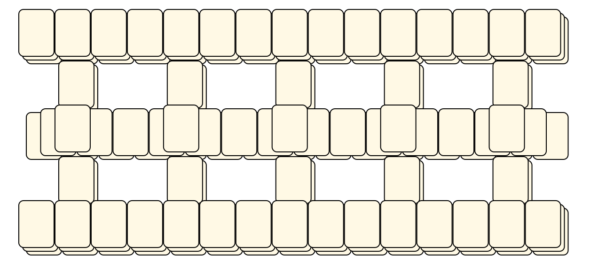
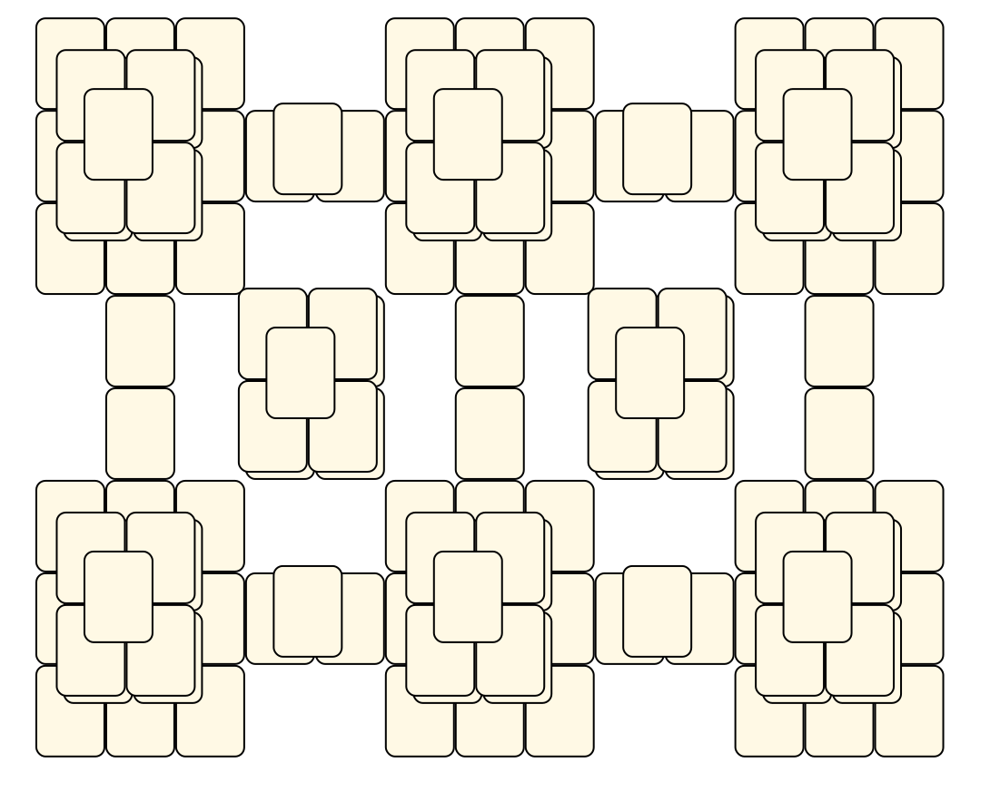
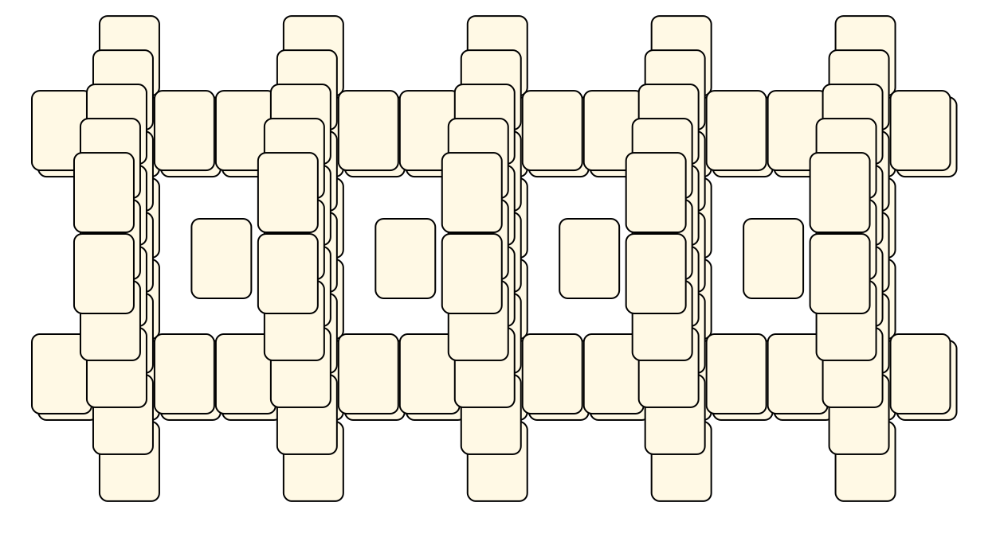
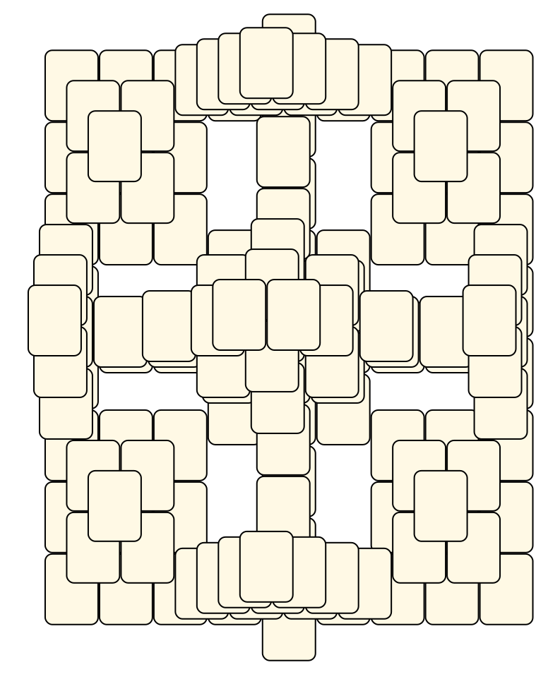
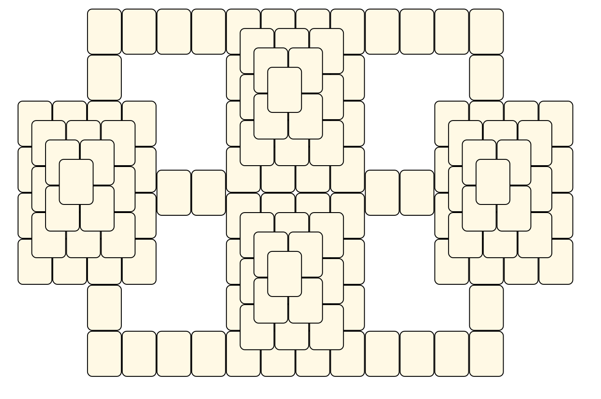

# Mahjong Solitaire Layout Museum: Package 05
* Source: [https://web.archive.org/web/20120408030546/http://members.fortunecity.com/phantagia/layouts.htm](https://web.archive.org/web/20120408030546/http://members.fortunecity.com/phantagia/layouts.htm)

* File Source:  
<sub>```https://web.archive.org/web/20120408030904/http://members.fortunecity.com/phantagia/layouts/eplayouts.zip#eplayout05.zip```</sub>


|Package 05||Layouts: 20|
|:--:|:--:|:--:|
|JRR Tolkien<br><br> <sub>Ernie Polegato</sub> <br>[.lay](./jrr_tolkien.lay)  [.layout](./jrr_tolkien.layout)  [.mah](./jrr_tolkien.mah) |Judas Priest<br><br> <sub>Ernie Polegato</sub> <br>[.lay](./judas_priest.lay)  [.layout](./judas_priest.layout)  [.mah](./judas_priest.mah) |Layout<br><br> <sub>Ernie Polegato</sub> <br>[.lay](./layout.lay)  [.layout](./layout.layout)  [.mah](./layout.mah) |
|Layout 10<br><br> <sub>Ernie Polegato</sub> <br>[.lay](./layout_10.lay)  [.layout](./layout_10.layout)  [.mah](./layout_10.mah) |Layout 2<br><br> <sub>Ernie Polegato</sub> <br>[.lay](./layout_2.lay)  [.layout](./layout_2.layout)  [.mah](./layout_2.mah) |Layout 3<br><br> <sub>Ernie Polegato</sub> <br>[.lay](./layout_3.lay)  [.layout](./layout_3.layout)  [.mah](./layout_3.mah) |
|Layout 4<br><br> <sub>Ernie Polegato</sub> <br>[.lay](./layout_4.lay)  [.layout](./layout_4.layout)  [.mah](./layout_4.mah) |Layout 5<br><br> <sub>Ernie Polegato</sub> <br>[.lay](./layout_5.lay)  [.layout](./layout_5.layout)  [.mah](./layout_5.mah) |Layout 6<br><br> <sub>Ernie Polegato</sub> <br>[.lay](./layout_6.lay)  [.layout](./layout_6.layout)  [.mah](./layout_6.mah) |
|Layout 7<br><br> <sub>Ernie Polegato</sub> <br>[.lay](./layout_7.lay)  [.layout](./layout_7.layout)  [.mah](./layout_7.mah) |Layout 8<br><br> <sub>Ernie Polegato</sub> <br>[.lay](./layout_8.lay)  [.layout](./layout_8.layout)  [.mah](./layout_8.mah) |Layout 9<br><br> <sub>Ernie Polegato</sub> <br>[.lay](./layout_9.lay)  [.layout](./layout_9.layout)  [.mah](./layout_9.mah) |
|Oyster Shell<br><br> <sub>Ernie Polegato</sub> <br>[.lay](./oyster_shell.lay)  [.layout](./oyster_shell.layout)  [.mah](./oyster_shell.mah) |Pharaohs Monument<br><br> <sub>Ernie Polegato</sub> <br>[.lay](./pharaohs_monument.lay)  [.layout](./pharaohs_monument.layout)  [.mah](./pharaohs_monument.mah) |Shi Huangdis Tomb<br><br> <sub>Ernie Polegato</sub> <br>[.lay](./shi_huangdis_tomb.lay)  [.layout](./shi_huangdis_tomb.layout)  [.mah](./shi_huangdis_tomb.mah) |
|Stairs<br><br> <sub>Ernie Polegato</sub> <br>[.lay](./stairs_8.lay)  [.layout](./stairs_8.layout)  [.mah](./stairs_8.mah) |Temple<br><br> <sub>Ernie Polegato</sub> <br>[.lay](./temple_5.lay)  [.layout](./temple_5.layout)  [.mah](./temple_5.mah) |Temple 3<br><br> <sub>Ernie Polegato</sub> <br>[.lay](./temple_3_2.lay)  [.layout](./temple_3_2.layout)  [.mah](./temple_3_2.mah) |
|Temple 4<br><br> <sub>Ernie Polegato</sub> <br>[.lay](./temple_4_2.lay)  [.layout](./temple_4_2.layout)  [.mah](./temple_4_2.mah) |Twin Temple<br><br> <sub>Ernie Polegato</sub> <br>[.lay](./twin_temple.lay)  [.layout](./twin_temple.layout)  [.mah](./twin_temple.mah) ||