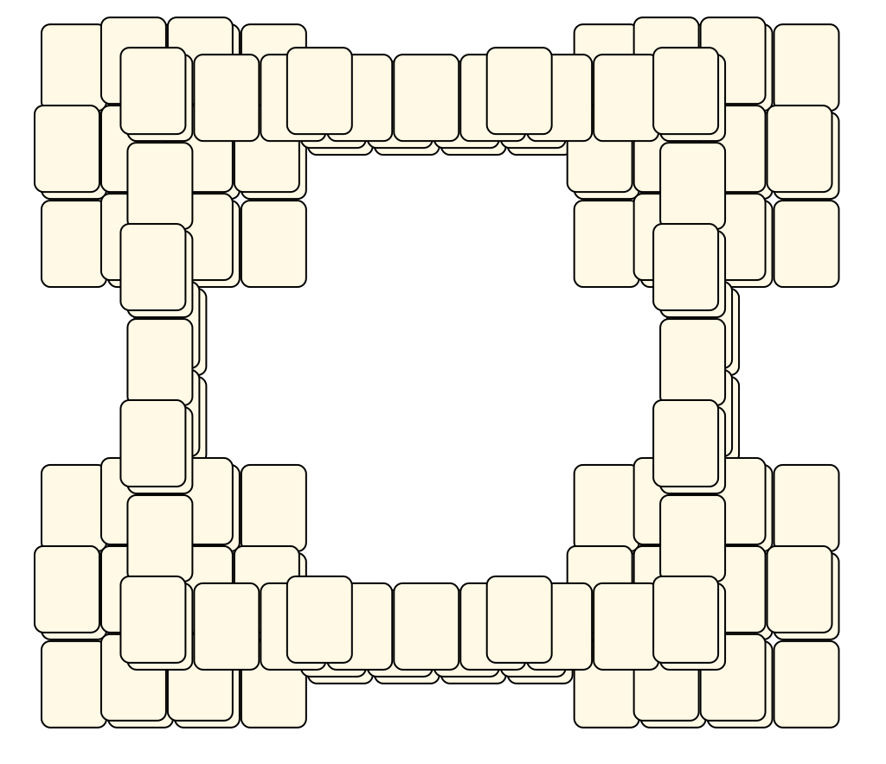
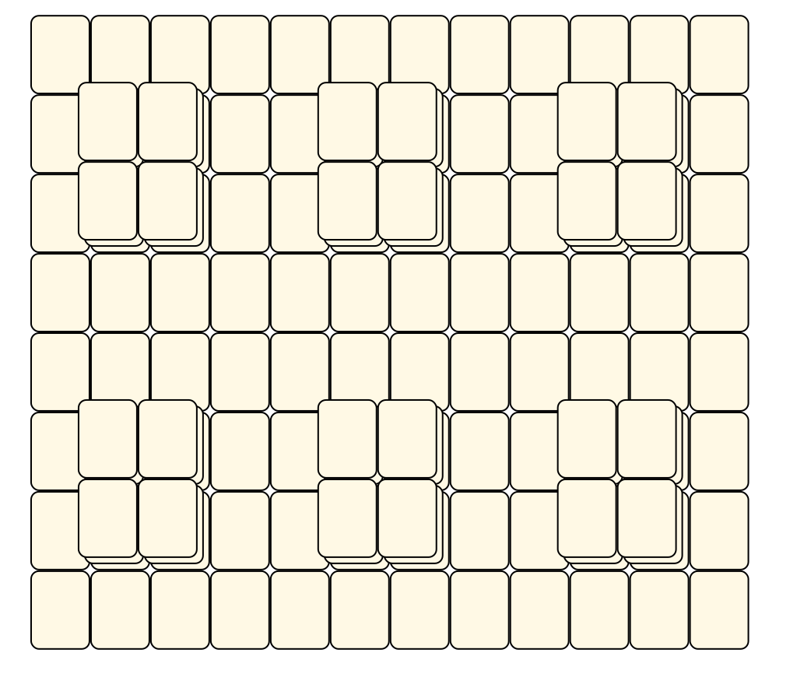
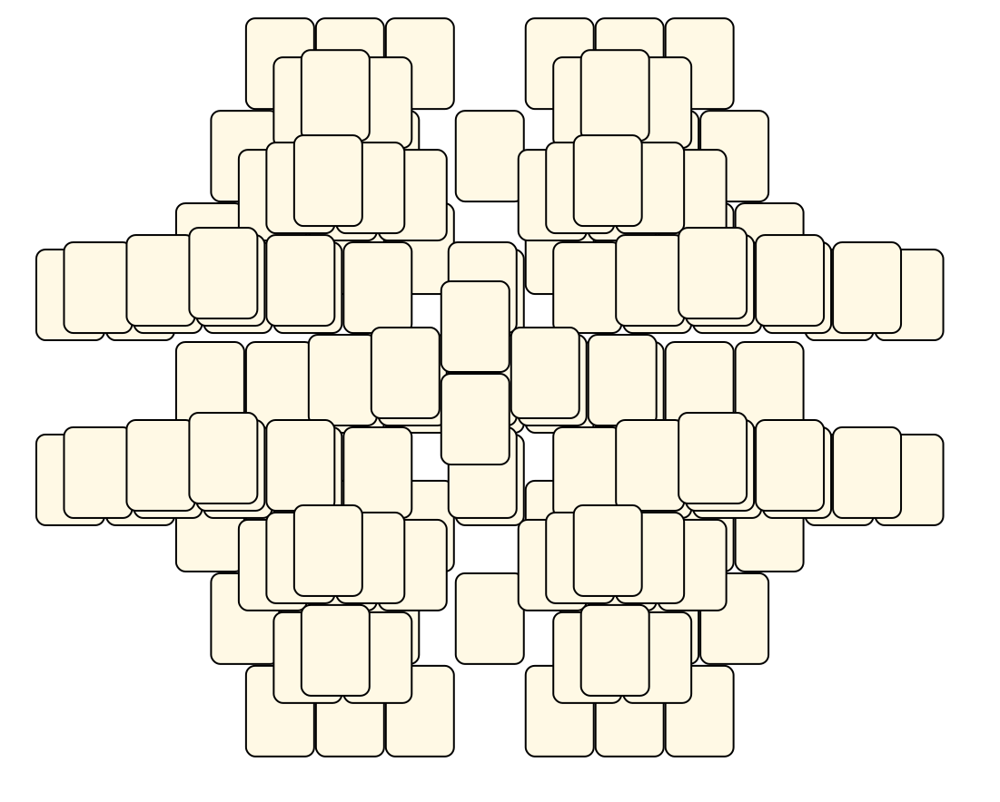

# Mahjong Solitaire Layout Museum: Package 07
* Source: [https://web.archive.org/web/20120408030546/http://members.fortunecity.com/phantagia/layouts.htm](https://web.archive.org/web/20120408030546/http://members.fortunecity.com/phantagia/layouts.htm)

* File Source:  
<sub>```https://web.archive.org/web/20120408030904/http://members.fortunecity.com/phantagia/layouts/eplayouts.zip#eplayout07.zip```</sub>


|Package 07||Layouts: 11|
|:--:|:--:|:--:|
|Layout 22<br><br> <sub>Ernie Polegato</sub> <br>[.lay](./layout_22.lay)  [.layout](./layout_22.layout)  [.mah](./layout_22.mah) |Layout 23<br><br> <sub>Ernie Polegato</sub> <br>[.lay](./layout_23.lay)  [.layout](./layout_23.layout)  [.mah](./layout_23.mah) |Layout 24<br><br> <sub>Ernie Polegato</sub> <br>[.lay](./layout_24.lay)  [.layout](./layout_24.layout)  [.mah](./layout_24.mah) |
|Layout 25<br><br> <sub>Ernie Polegato</sub> <br>[.lay](./layout_25.lay)  [.layout](./layout_25.layout)  [.mah](./layout_25.mah) |Layout 25B<br><br> <sub>Ernie Polegato</sub> <br>[.lay](./layout_25b.lay)  [.layout](./layout_25b.layout)  [.mah](./layout_25b.mah) |Layout 26<br><br> <sub>Ernie Polegato</sub> <br>[.lay](./layout_26.lay)  [.layout](./layout_26.layout)  [.mah](./layout_26.mah) |
|Layout 27<br><br> <sub>Ernie Polegato</sub> <br>[.lay](./layout_27.lay)  [.layout](./layout_27.layout)  [.mah](./layout_27.mah) |Layout 28<br><br> <sub>Ernie Polegato</sub> <br>[.lay](./layout_28.lay)  [.layout](./layout_28.layout)  [.mah](./layout_28.mah) |Layout 29<br><br> <sub>Ernie Polegato</sub> <br>[.lay](./layout_29.lay)  [.layout](./layout_29.layout)  [.mah](./layout_29.mah) |
|Layout 30<br><br> <sub>Ernie Polegato</sub> <br>[.lay](./layout_30.lay)  [.layout](./layout_30.layout)  [.mah](./layout_30.mah) |Rain 2<br><br> <sub>Ernie Polegato</sub> <br>[.lay](./rain_2.lay)  [.layout](./rain_2.layout)  [.mah](./rain_2.mah) ||