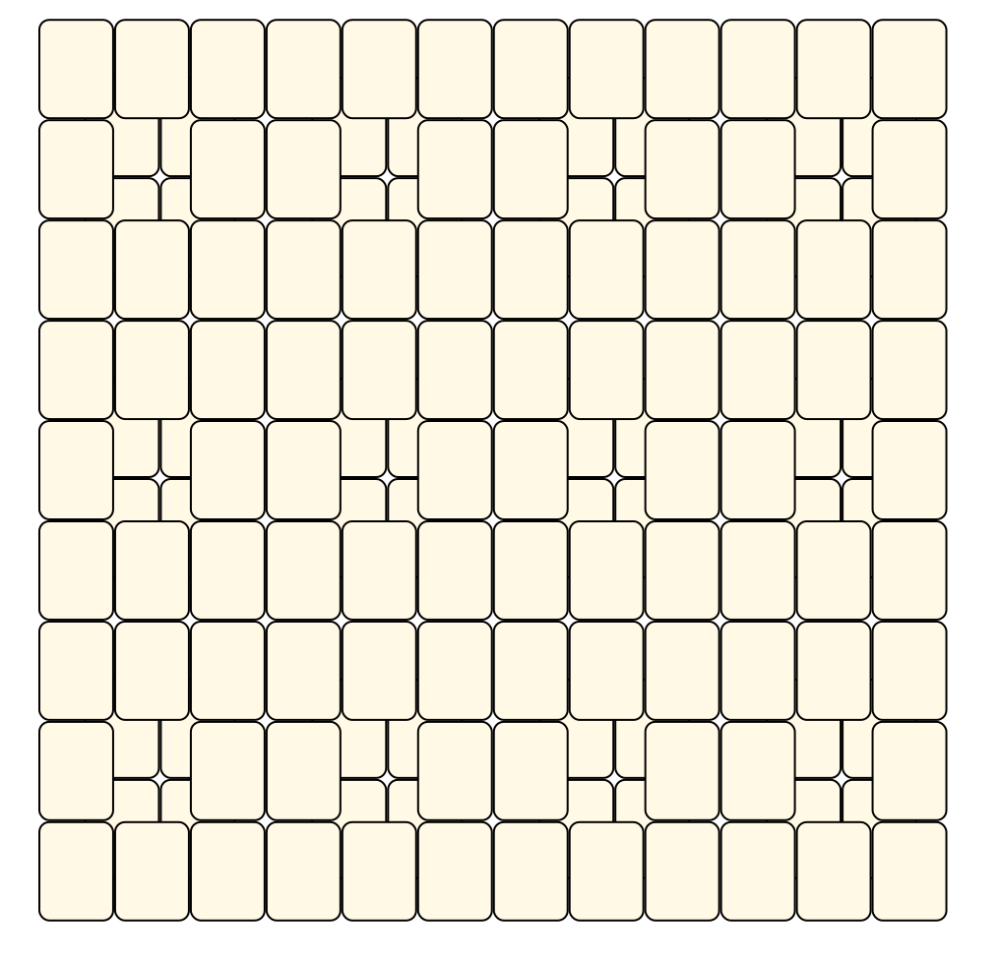

# Mahjong Solitaire Layout Museum: Package 10
* Source: [https://web.archive.org/web/20120408030546/http://members.fortunecity.com/phantagia/layouts.htm](https://web.archive.org/web/20120408030546/http://members.fortunecity.com/phantagia/layouts.htm)

* File Source:  
<sub>```https://web.archive.org/web/20120408030904/http://members.fortunecity.com/phantagia/layouts/eplayouts.zip#eplayout10.zip```</sub>


|Package 10||Layouts: 10|
|:--:|:--:|:--:|
|NL24<br><br> <sub>Ernie Polegato</sub> <br>[.lay](./nl24.lay)  [.layout](./nl24.layout)  [.mah](./nl24.mah) |NL25<br><br> <sub>Ernie Polegato</sub> <br>[.lay](./nl25.lay)  [.layout](./nl25.layout)  [.mah](./nl25.mah) |NL26<br><br> <sub>Ernie Polegato</sub> <br>[.lay](./nl26.lay)  [.layout](./nl26.layout)  [.mah](./nl26.mah) |
|NL27<br><br> <sub>Ernie Polegato</sub> <br>[.lay](./nl27.lay)  [.layout](./nl27.layout)  [.mah](./nl27.mah) |NL28<br><br> <sub>Ernie Polegato</sub> <br>[.lay](./nl28.lay)  [.layout](./nl28.layout)  [.mah](./nl28.mah) |NL29<br><br> <sub>Ernie Polegato</sub> <br>[.lay](./nl29.lay)  [.layout](./nl29.layout)  [.mah](./nl29.mah) |
|NL30<br><br> <sub>Ernie Polegato</sub> <br>[.lay](./nl30.lay)  [.layout](./nl30.layout)  [.mah](./nl30.mah) |NL34<br><br> <sub>Ernie Polegato</sub> <br>[.lay](./nl34.lay)  [.layout](./nl34.layout)  [.mah](./nl34.mah) |NL40<br><br> <sub>Ernie Polegato</sub> <br>[.lay](./nl40.lay)  [.layout](./nl40.layout)  [.mah](./nl40.mah) |
|NL41<br><br> <sub>Ernie Polegato</sub> <br>[.lay](./nl41.lay)  [.layout](./nl41.layout)  [.mah](./nl41.mah) |||