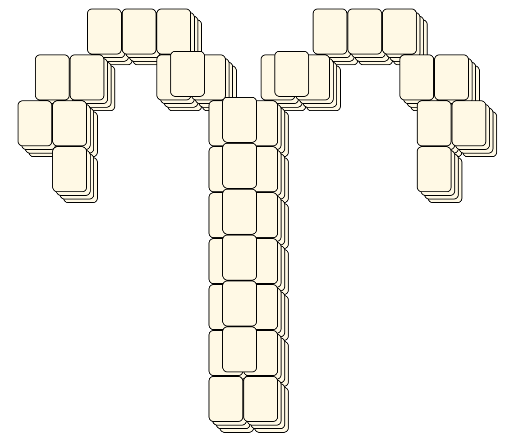
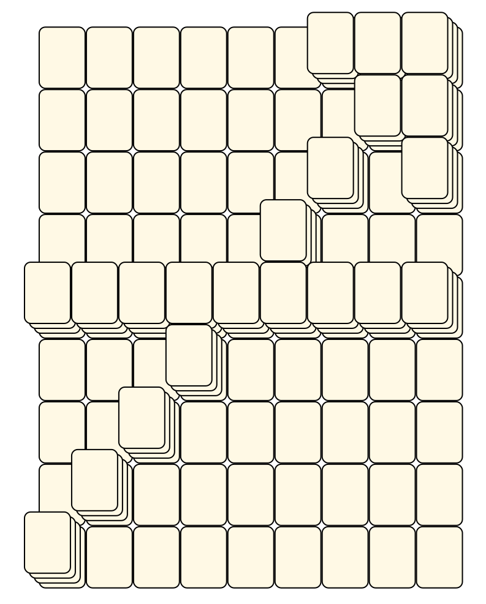

# Mahjong Solitaire Layout Museum: Zodiac
* Source: [https://web.archive.org/web/20120408030546/http://members.fortunecity.com/phantagia/layouts.htm](https://web.archive.org/web/20120408030546/http://members.fortunecity.com/phantagia/layouts.htm)

* File Source:  
<sub>```https://web.archive.org/web/20120408030904/http://members.fortunecity.com/phantagia/layouts/eplayouts.zip#eplayzod.zip```</sub>


|Zodiac||Layouts: 17|
|:--:|:--:|:--:|
|Aquarius<br><br> <sub>Ernie Polegato</sub> <br>[.lay](./aquarius_2.lay)  [.layout](./aquarius_2.layout)  [.mah](./aquarius_2.mah) |Aries<br><br> <sub>Ernie Polegato</sub> <br>[.lay](./aries_2.lay)  [.layout](./aries_2.layout)  [.mah](./aries_2.mah) |Cancer<br><br> <sub>Ernie Polegato</sub> <br>[.lay](./cancer_3.lay)  [.layout](./cancer_3.layout)  [.mah](./cancer_3.mah) |
|Cancer 2<br><br> <sub>Ernie Polegato</sub> <br>[.lay](./cancer_2_2.lay)  [.layout](./cancer_2_2.layout)  [.mah](./cancer_2_2.mah) |Capricorn<br><br> <sub>Ernie Polegato</sub> <br>[.lay](./capricorn_3.lay)  [.layout](./capricorn_3.layout)  [.mah](./capricorn_3.mah) |Capricorn 2<br><br> <sub>Ernie Polegato</sub> <br>[.lay](./capricorn_2_2.lay)  [.layout](./capricorn_2_2.layout)  [.mah](./capricorn_2_2.mah) |
|Gemini<br><br> <sub>Ernie Polegato</sub> <br>[.lay](./gemini_3.lay)  [.layout](./gemini_3.layout)  [.mah](./gemini_3.mah) |Gemini 2<br><br> <sub>Ernie Polegato</sub> <br>[.lay](./gemini_2_2.lay)  [.layout](./gemini_2_2.layout)  [.mah](./gemini_2_2.mah) |Leo<br><br> <sub>Ernie Polegato</sub> <br>[.lay](./leo_4.lay)  [.layout](./leo_4.layout)  [.mah](./leo_4.mah) |
|Libra<br><br> <sub>Ernie Polegato</sub> <br>[.lay](./libra_2.lay)  [.layout](./libra_2.layout)  [.mah](./libra_2.mah) |Pisces<br><br> <sub>Ernie Polegato</sub> <br>[.lay](./pisces_3.lay)  [.layout](./pisces_3.layout)  [.mah](./pisces_3.mah) |Pisces 2<br><br> <sub>Ernie Polegato</sub> <br>[.lay](./pisces_2_2.lay)  [.layout](./pisces_2_2.layout)  [.mah](./pisces_2_2.mah) |
|Sagittarius<br><br> <sub>Ernie Polegato</sub> <br>[.lay](./sagittarius_3.lay)  [.layout](./sagittarius_3.layout)  [.mah](./sagittarius_3.mah) |Sagittarius 2<br><br> <sub>Ernie Polegato</sub> <br>[.lay](./sagittarius_2_2.lay)  [.layout](./sagittarius_2_2.layout)  [.mah](./sagittarius_2_2.mah) |Scorpio<br><br> <sub>Ernie Polegato</sub> <br>[.lay](./scorpio_2.lay)  [.layout](./scorpio_2.layout)  [.mah](./scorpio_2.mah) |
|Taurus<br><br> <sub>Ernie Polegato</sub> <br>[.lay](./taurus_2.lay)  [.layout](./taurus_2.layout)  [.mah](./taurus_2.mah) |Virgo<br><br> <sub>Ernie Polegato</sub> <br>[.lay](./virgo_2.lay)  [.layout](./virgo_2.layout)  [.mah](./virgo_2.mah) ||