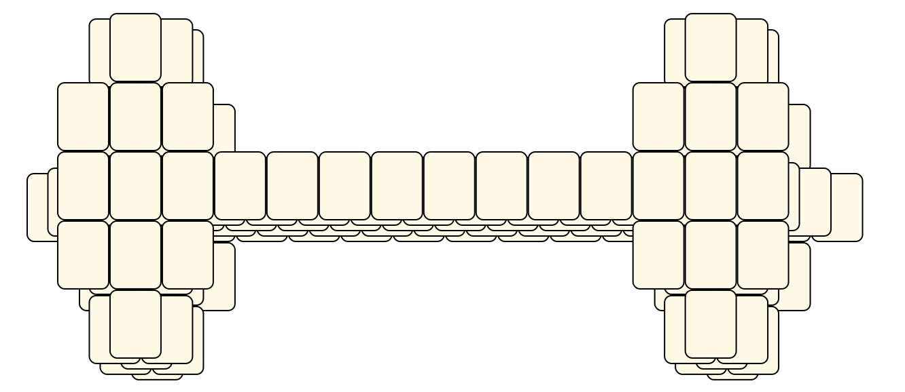
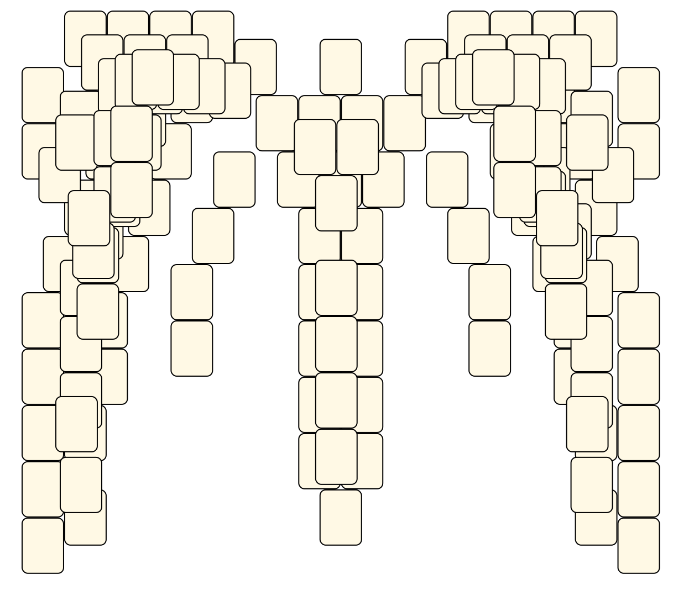
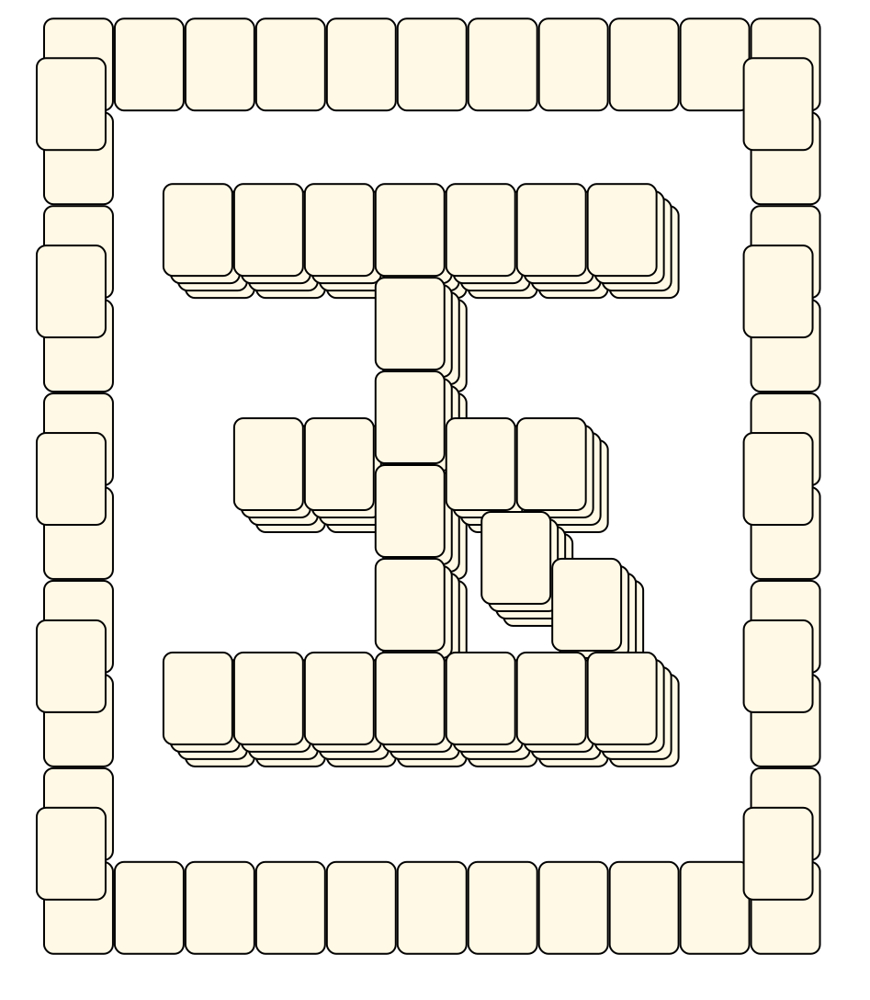
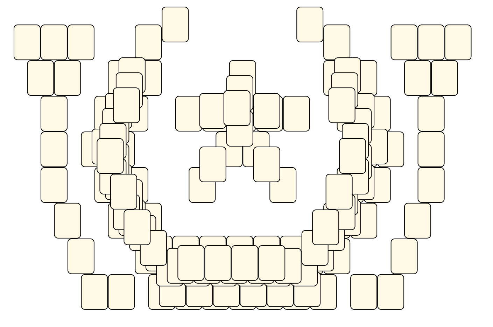
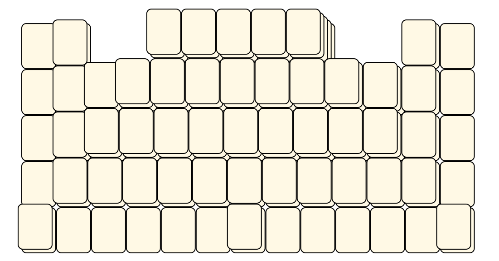
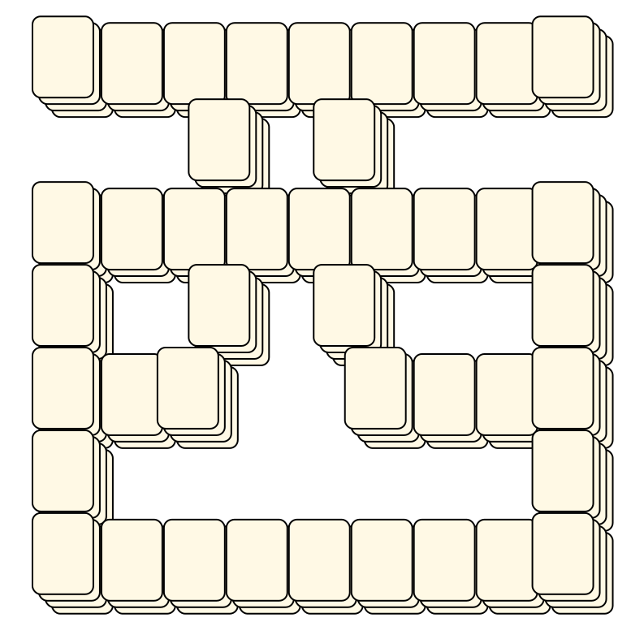

# Mahjong Solitaire Layout Museum: Kamimura
* Source: [https://web.archive.org/web/20120408030546/http://members.fortunecity.com/phantagia/layouts.htm](https://web.archive.org/web/20120408030546/http://members.fortunecity.com/phantagia/layouts.htm)

* File Source:  
<sub>```https://web.archive.org/web/20120408030546/http://members.fortunecity.com/phantagia/layouts/lyall.zip#eclayouts.zip```</sub>


|Kamimura||Layouts: 57|
|:--:|:--:|:--:|
|@<br><br> <sub>Nanami Kamimura</sub> <br>[.lay](./@_2.lay)  [.layout](./@_2.layout)  [.mah](./@_2.mah) |A REAL Pyramid, Finally<br><br> <sub>Nanami Kamimura</sub> <br>[.lay](./a_real_pyramid_finally_2.lay)  [.layout](./a_real_pyramid_finally_2.layout)  [.mah](./a_real_pyramid_finally_2.mah) |Abstractly Designed Bridge<br><br> <sub>Nanami Kamimura</sub> <br>[.lay](./abstractly_designed_bridge_2.lay)  [.layout](./abstractly_designed_bridge_2.layout)  [.mah](./abstractly_designed_bridge_2.mah) |
|Abstractly Designed Building<br><br> <sub>Nanami Kamimura</sub> <br>[.lay](./abstractly_designed_building_2.lay)  [.layout](./abstractly_designed_building_2.layout)  [.mah](./abstractly_designed_building_2.mah) |Abstractly Designed Pyramid<br><br> <sub>Nanami Kamimura</sub> <br>[.lay](./abstractly_designed_pyramid_2.lay)  [.layout](./abstractly_designed_pyramid_2.layout)  [.mah](./abstractly_designed_pyramid_2.mah) |Abstractly Designed Staircase<br><br> <sub>Nanami Kamimura</sub> <br>[.lay](./abstractly_designed_staircase_2.lay)  [.layout](./abstractly_designed_staircase_2.layout)  [.mah](./abstractly_designed_staircase_2.mah) |
|Akane (in Kanji)<br><br> <sub>Nanami Kamimura</sub> <br>[.lay](./akane_(in_kanji)_2.lay)  [.layout](./akane_(in_kanji)_2.layout)  [.mah](./akane_(in_kanji)_2.mah) |Angel<br><br> <sub>Nanami Kamimura</sub> <br>[.lay](./angel_3.lay)  [.layout](./angel_3.layout)  [.mah](./angel_3.mah) |Bei<br><br> <sub>Nanami Kamimura</sub> <br>[.lay](./bei_4.lay)  [.layout](./bei_4.layout)  [.mah](./bei_4.mah) |
|Ceremonial Well<br><br> <sub>Nanami Kamimura</sub> <br>[.lay](./ceremonial_well_2.lay)  [.layout](./ceremonial_well_2.layout)  [.mah](./ceremonial_well_2.mah) |Colesseum<br><br> <sub>Nanami Kamimura</sub> <br>[.lay](./colesseum_2.lay)  [.layout](./colesseum_2.layout)  [.mah](./colesseum_2.mah) |Dance Dance Revolution<br><br> <sub>Nanami Kamimura</sub> <br>[.lay](./dance_dance_revolution_2.lay)  [.layout](./dance_dance_revolution_2.layout)  [.mah](./dance_dance_revolution_2.mah) |
|Diagonal Checkered Layout<br><br> <sub>Nanami Kamimura</sub> <br>[.lay](./diagonal_checkered_layout_2.lay)  [.layout](./diagonal_checkered_layout_2.layout)  [.mah](./diagonal_checkered_layout_2.mah) |Dong<br><br> <sub>Nanami Kamimura</sub> <br>[.lay](./dong_4.lay)  [.layout](./dong_4.layout)  [.mah](./dong_4.mah) |Double Pyramid<br><br> <sub>Nanami Kamimura</sub> <br>[.lay](./double_pyramid_2.lay)  [.layout](./double_pyramid_2.layout)  [.mah](./double_pyramid_2.mah) |
|Eight Stacks<br><br> <sub>Nanami Kamimura</sub> <br>[.lay](./eight_stacks_3.lay)  [.layout](./eight_stacks_3.layout)  [.mah](./eight_stacks_3.mah) |Flat Iron<br><br> <sub>Nanami Kamimura</sub> <br>[.lay](./flat_iron_2.lay)  [.layout](./flat_iron_2.layout)  [.mah](./flat_iron_2.mah) |For The Sake Of Symmetry<br><br> <sub>Nanami Kamimura</sub> <br>[.lay](./for_the_sake_of_symmetry_2.lay)  [.layout](./for_the_sake_of_symmetry_2.layout)  [.mah](./for_the_sake_of_symmetry_2.mah) |
|Fort Boyard<br><br> <sub>Nanami Kamimura</sub> <br>[.lay](./fort_boyard_2.lay)  [.layout](./fort_boyard_2.layout)  [.mah](./fort_boyard_2.mah) |Four Chipped Pyramids<br><br> <sub>Nanami Kamimura</sub> <br>[.lay](./four_chipped_pyramids_2.lay)  [.layout](./four_chipped_pyramids_2.layout)  [.mah](./four_chipped_pyramids_2.mah) |Four Pyramids<br><br> <sub>Nanami Kamimura</sub> <br>[.lay](./four_pyramids_3.lay)  [.layout](./four_pyramids_3.layout)  [.mah](./four_pyramids_3.mah) |
|Guess Who Loves Tamahome!<br><br> <sub>Nanami Kamimura</sub> <br>[.lay](./guess_who_loves_tamahome_2.lay)  [.layout](./guess_who_loves_tamahome_2.layout)  [.mah](./guess_who_loves_tamahome_2.mah) |Guo<br><br> <sub>Nanami Kamimura</sub> <br>[.lay](./guo_2.lay)  [.layout](./guo_2.layout)  [.mah](./guo_2.mah) |I Love You Sign<br><br> <sub>Nanami Kamimura</sub> <br>[.lay](./i_love_you_sign_2.lay)  [.layout](./i_love_you_sign_2.layout)  [.mah](./i_love_you_sign_2.mah) |
|Il-Bul<br><br> <sub>Nanami Kamimura</sub> <br>[.lay](./il-bul_2.lay)  [.layout](./il-bul_2.layout)  [.mah](./il-bul_2.mah) |Inverted Pyramid With Front<br><br> <sub>Nanami Kamimura</sub> <br>[.lay](./inverted_pyramid_with_front_2.lay)  [.layout](./inverted_pyramid_with_front_2.layout)  [.mah](./inverted_pyramid_with_front_2.mah) |Jusenkyo<br><br> <sub>Nanami Kamimura</sub> <br>[.lay](./jusenkyo_2.lay)  [.layout](./jusenkyo_2.layout)  [.mah](./jusenkyo_2.mah) |
|Kenshins Sword<br><br> <sub>Nanami Kamimura</sub> <br>[.lay](./kenshins_sword_2.lay)  [.layout](./kenshins_sword_2.layout)  [.mah](./kenshins_sword_2.mah) |Keys Of Fort Boyard<br><br> <sub>Nanami Kamimura</sub> <br>[.lay](./keys_of_fort_boyard_2.lay)  [.layout](./keys_of_fort_boyard_2.layout)  [.mah](./keys_of_fort_boyard_2.mah) |Little Stairway<br><br> <sub>Nanami Kamimura</sub> <br>[.lay](./little_stairway_2.lay)  [.layout](./little_stairway_2.layout)  [.mah](./little_stairway_2.mah) |
|Mei<br><br> <sub>Nanami Kamimura</sub> <br>[.lay](./mei_2.lay)  [.layout](./mei_2.layout)  [.mah](./mei_2.mah) |Michael Jordans Number<br><br> <sub>Nanami Kamimura</sub> <br>[.lay](./michael_jordans_number_2.lay)  [.layout](./michael_jordans_number_2.layout)  [.mah](./michael_jordans_number_2.mah) |Nan<br><br> <sub>Nanami Kamimura</sub> <br>[.lay](./nan_4.lay)  [.layout](./nan_4.layout)  [.mah](./nan_4.mah) |
|Om<br><br> <sub>Nanami Kamimura</sub> <br>[.lay](./om_2.lay)  [.layout](./om_2.layout)  [.mah](./om_2.mah) |Otarus Sword<br><br> <sub>Nanami Kamimura</sub> <br>[.lay](./otarus_sword_2.lay)  [.layout](./otarus_sword_2.layout)  [.mah](./otarus_sword_2.mah) |Peace Symbol<br><br> <sub>Nanami Kamimura</sub> <br>[.lay](./peace_symbol_2.lay)  [.layout](./peace_symbol_2.layout)  [.mah](./peace_symbol_2.mah) |
|Pikachu<br><br> <sub>Nanami Kamimura</sub> <br>[.lay](./pikachu_2.lay)  [.layout](./pikachu_2.layout)  [.mah](./pikachu_2.mah) |Qi<br><br> <sub>Nanami Kamimura</sub> <br>[.lay](./qi_2.lay)  [.layout](./qi_2.layout)  [.mah](./qi_2.mah) |Rivers... To You!<br><br> <sub>Nanami Kamimura</sub> <br>[.lay](./rivers__to_you_2.lay)  [.layout](./rivers__to_you_2.layout)  [.mah](./rivers__to_you_2.mah) |
|Sailorchibimoons Symbol<br><br> <sub>Nanami Kamimura</sub> <br>[.lay](./sailorchibimoons_symbol_2.lay)  [.layout](./sailorchibimoons_symbol_2.layout)  [.mah](./sailorchibimoons_symbol_2.mah) |Sailormoons Symbol<br><br> <sub>Nanami Kamimura</sub> <br>[.lay](./sailormoons_symbol_2.lay)  [.layout](./sailormoons_symbol_2.layout)  [.mah](./sailormoons_symbol_2.mah) |Seven INVERTED Pyramids<br><br> <sub>Nanami Kamimura</sub> <br>[.lay](./seven_inverted_pyramids_2.lay)  [.layout](./seven_inverted_pyramids_2.layout)  [.mah](./seven_inverted_pyramids_2.mah) |
|Smiley Face<br><br> <sub>Nanami Kamimura</sub> <br>[.lay](./smiley_face_2.lay)  [.layout](./smiley_face_2.layout)  [.mah](./smiley_face_2.mah) |Staircase<br><br> <sub>Nanami Kamimura</sub> <br>[.lay](./staircase_3.lay)  [.layout](./staircase_3.layout)  [.mah](./staircase_3.mah) |Staircase 2<br><br> <sub>Nanami Kamimura</sub> <br>[.lay](./staircase_2_2.lay)  [.layout](./staircase_2_2.layout)  [.mah](./staircase_2_2.mah) |
|Symmetrically Designed Building<br><br> <sub>Nanami Kamimura</sub> <br>[.lay](./symmetrically_designed_building_2.lay)  [.layout](./symmetrically_designed_building_2.layout)  [.mah](./symmetrically_designed_building_2.mah) |Three Boxes<br><br> <sub>Nanami Kamimura</sub> <br>[.lay](./three_boxes_2.lay)  [.layout](./three_boxes_2.layout)  [.mah](./three_boxes_2.mah) |Three ELEVATED Wells<br><br> <sub>Nanami Kamimura</sub> <br>[.lay](./three_elevated_wells_2.lay)  [.layout](./three_elevated_wells_2.layout)  [.mah](./three_elevated_wells_2.mah) |
|Three Pyramids<br><br> <sub>Nanami Kamimura</sub> <br>[.lay](./three_pyramids_3.lay)  [.layout](./three_pyramids_3.layout)  [.mah](./three_pyramids_3.mah) |Togepi<br><br> <sub>Nanami Kamimura</sub> <br>[.lay](./togepi_2.lay)  [.layout](./togepi_2.layout)  [.mah](./togepi_2.mah) |Top View Of Titanic<br><br> <sub>Nanami Kamimura</sub> <br>[.lay](./top_view_of_titanic_2.lay)  [.layout](./top_view_of_titanic_2.layout)  [.mah](./top_view_of_titanic_2.mah) |
|Two Walls<br><br> <sub>Nanami Kamimura</sub> <br>[.lay](./two_walls_2.lay)  [.layout](./two_walls_2.layout)  [.mah](./two_walls_2.mah) |U For Usagi<br><br> <sub>Nanami Kamimura</sub> <br>[.lay](./u_for_usagi_2.lay)  [.layout](./u_for_usagi_2.layout)  [.mah](./u_for_usagi_2.mah) |U For Usagi Traditional<br><br> <sub>Nanami Kamimura</sub> <br>[.lay](./u_for_usagi_traditional_2.lay)  [.layout](./u_for_usagi_traditional_2.layout)  [.mah](./u_for_usagi_traditional_2.mah) |
|Victory / Peace Sign<br><br> <sub>Nanami Kamimura</sub> <br>[.lay](./victory__peace_sign_2.lay)  [.layout](./victory__peace_sign_2.layout)  [.mah](./victory__peace_sign_2.mah) |Xi<br><br> <sub>Nanami Kamimura</sub> <br>[.lay](./xi_4.lay)  [.layout](./xi_4.layout)  [.mah](./xi_4.mah) |Zhong<br><br> <sub>Nanami Kamimura</sub> <br>[.lay](./zhong_2.lay)  [.layout](./zhong_2.layout)  [.mah](./zhong_2.mah) |