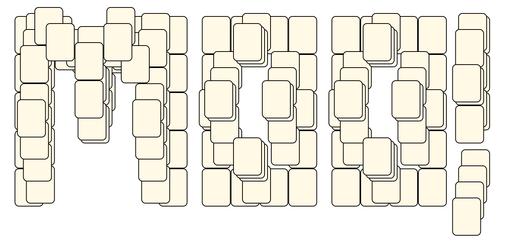

# Mahjong Solitaire Layout Museum: Jones
* Source: [https://web.archive.org/web/20120408030546/http://members.fortunecity.com/phantagia/layouts.htm](https://web.archive.org/web/20120408030546/http://members.fortunecity.com/phantagia/layouts.htm)

* File Source:  
<sub>```https://web.archive.org/web/20120408030546/http://members.fortunecity.com/phantagia/layouts/lyall.zip#lycows.zip```</sub>


|Jones||Layouts: 1|
|:--:|:--:|:--:|
|Moo<br><br> <sub>Sharon Jones</sub> <br>[.lay](./moo_2.lay)  [.layout](./moo_2.layout)  [.mah](./moo_2.mah) |