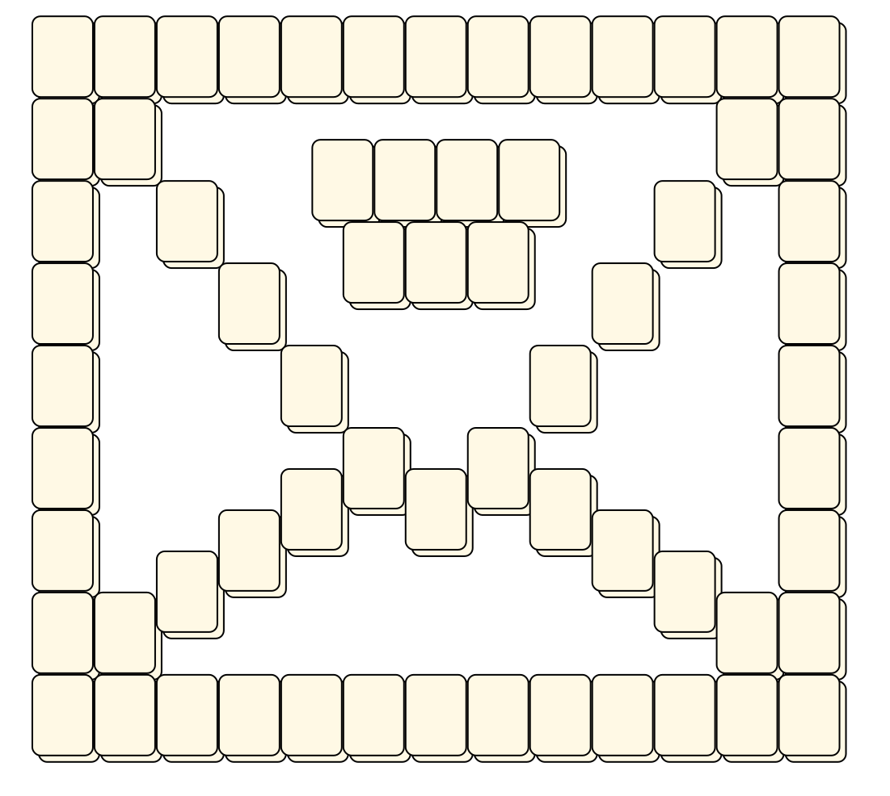

# Mahjong Solitaire Layout Museum: Lesselberg
* Source: [https://web.archive.org/web/20120408030546/http://members.fortunecity.com/phantagia/layouts.htm](https://web.archive.org/web/20120408030546/http://members.fortunecity.com/phantagia/layouts.htm)

* File Source:  
<sub>```https://web.archive.org/web/20120408030546/http://members.fortunecity.com/phantagia/layouts/lyall.zip#mllayouts.zip```</sub>


|Lesselberg||Layouts: 10|
|:--:|:--:|:--:|
|Deux Chevaux<br><br> <sub>Marc Lesselberg</sub> <br>[.lay](./deux_chevaux_2.lay)  [.layout](./deux_chevaux_2.layout)  [.mah](./deux_chevaux_2.mah) |Dollar<br><br> <sub>Marc Lesselberg</sub> <br>[.lay](./dollar_4.lay)  [.layout](./dollar_4.layout)  [.mah](./dollar_4.mah) |Domino<br><br> <sub>Marc Lesselberg</sub> <br>[.lay](./domino_2.lay)  [.layout](./domino_2.layout)  [.mah](./domino_2.mah) |
|Envelope<br><br> <sub>Marc Lesselberg</sub> <br>[.lay](./envelope_2.lay)  [.layout](./envelope_2.layout)  [.mah](./envelope_2.mah) |Large Width Tilesets<br><br> <sub>Marc Lesselberg</sub> <br>[.lay](./large_width_tilesets_2.lay)  [.layout](./large_width_tilesets_2.layout)  [.mah](./large_width_tilesets_2.mah) |Letters<br><br> <sub>Marc Lesselberg</sub> <br>[.lay](./letters_2.lay)  [.layout](./letters_2.layout)  [.mah](./letters_2.mah) |
|Mahjongg<br><br> <sub>Marc Lesselberg</sub> <br>[.lay](./mahjongg_2.lay)  [.layout](./mahjongg_2.layout)  [.mah](./mahjongg_2.mah) |Monopoly<br><br> <sub>Marc Lesselberg</sub> <br>[.lay](./monopoly_2.lay)  [.layout](./monopoly_2.layout)  [.mah](./monopoly_2.mah) |Moorhuhn Reticule<br><br> <sub>Marc Lesselberg</sub> <br>[.lay](./moorhuhn_reticule_2.lay)  [.layout](./moorhuhn_reticule_2.layout)  [.mah](./moorhuhn_reticule_2.mah) |
|Oracle<br><br> <sub>Marc Lesselberg</sub> <br>[.lay](./oracle_2.lay)  [.layout](./oracle_2.layout)  [.mah](./oracle_2.mah) |||