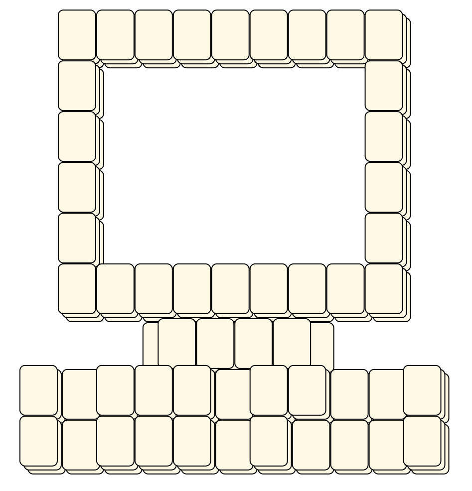

# Mahjong Solitaire Layout Museum: Ottosson
* Source: [https://web.archive.org/web/20120408030546/http://members.fortunecity.com/phantagia/layouts.htm](https://web.archive.org/web/20120408030546/http://members.fortunecity.com/phantagia/layouts.htm)

* File Source:  
<sub>```https://web.archive.org/web/20120408030546/http://members.fortunecity.com/phantagia/layouts/lyall.zip#molayouts.zip```</sub>


|Ottosson||Layouts: 6|
|:--:|:--:|:--:|
|12 Bars<br><br> <sub>Monica Ottosson</sub> <br>[.lay](./12_bars_2.lay)  [.layout](./12_bars_2.layout)  [.mah](./12_bars_2.mah) |144<br><br> <sub>Monica Ottosson</sub> <br>[.lay](./144_2.lay)  [.layout](./144_2.layout)  [.mah](./144_2.mah) |3 X 6<br><br> <sub>Monica Ottosson</sub> <br>[.lay](./3_x_6_2.lay)  [.layout](./3_x_6_2.layout)  [.mah](./3_x_6_2.mah) |
|6 Bars<br><br> <sub>Monica Ottosson</sub> <br>[.lay](./6_bars_2.lay)  [.layout](./6_bars_2.layout)  [.mah](./6_bars_2.mah) |9 Bars<br><br> <sub>Monica Ottosson</sub> <br>[.lay](./9_bars_2.lay)  [.layout](./9_bars_2.layout)  [.mah](./9_bars_2.mah) |PC<br><br> <sub>Monica Ottosson</sub> <br>[.lay](./pc_3.lay)  [.layout](./pc_3.layout)  [.mah](./pc_3.mah) |