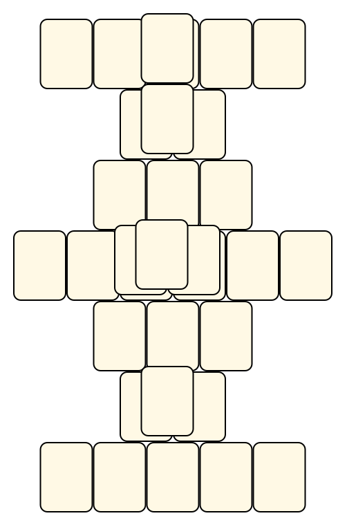
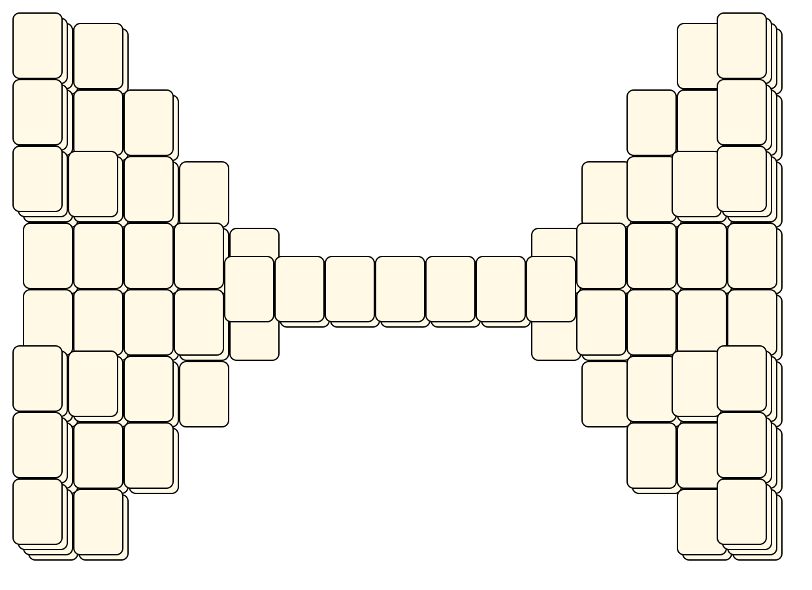
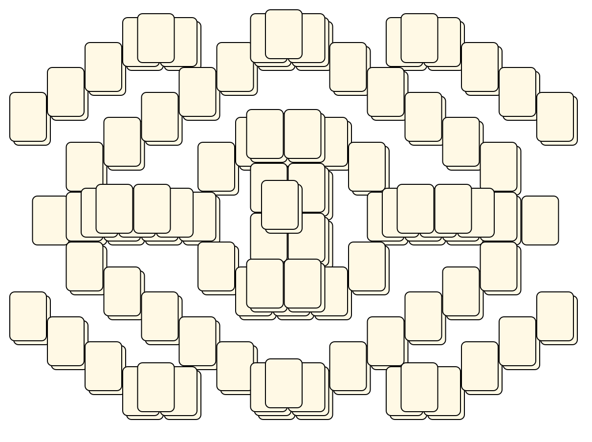
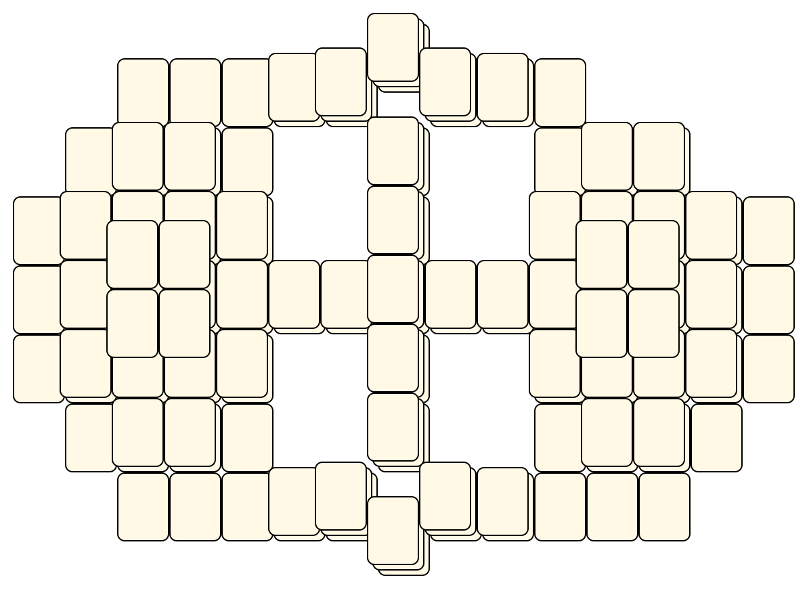
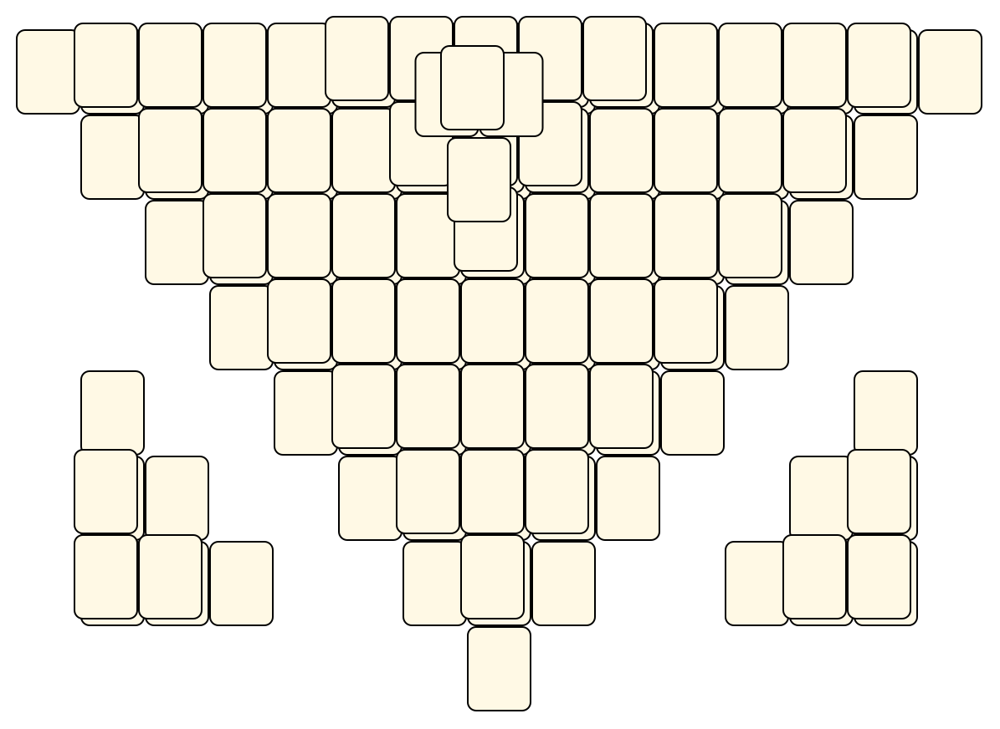
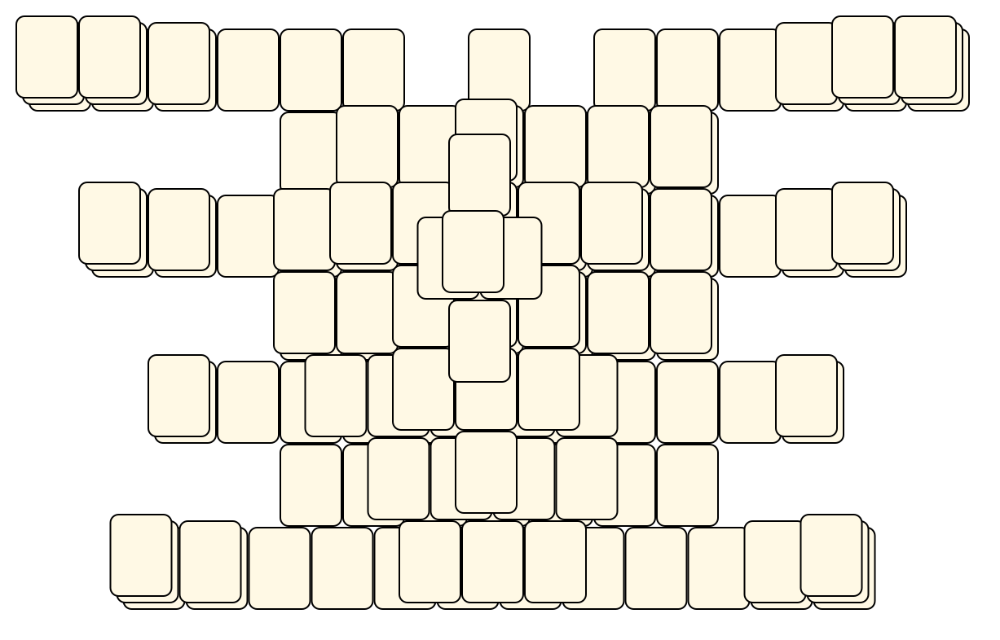
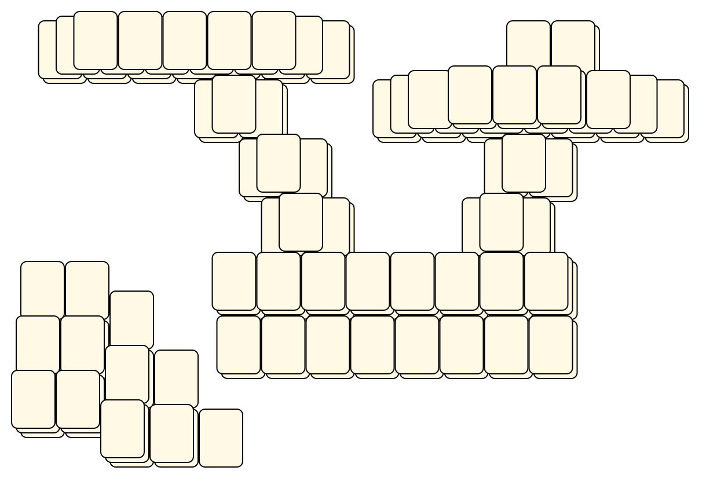
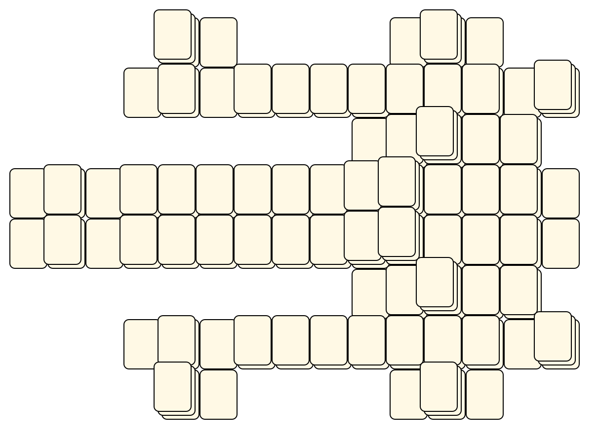
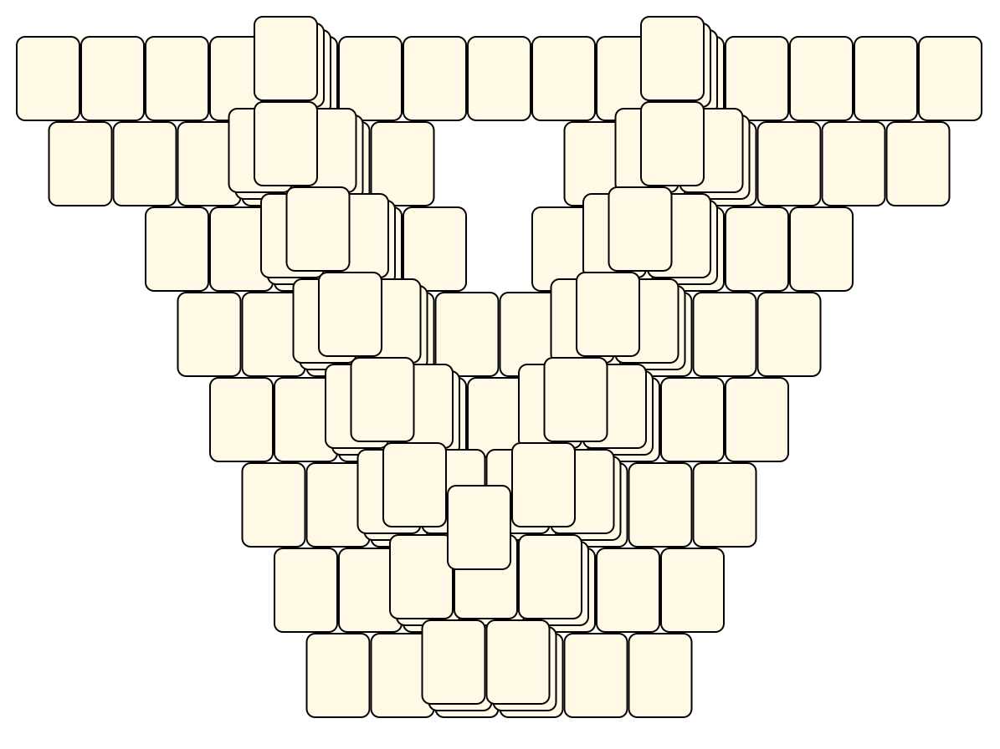
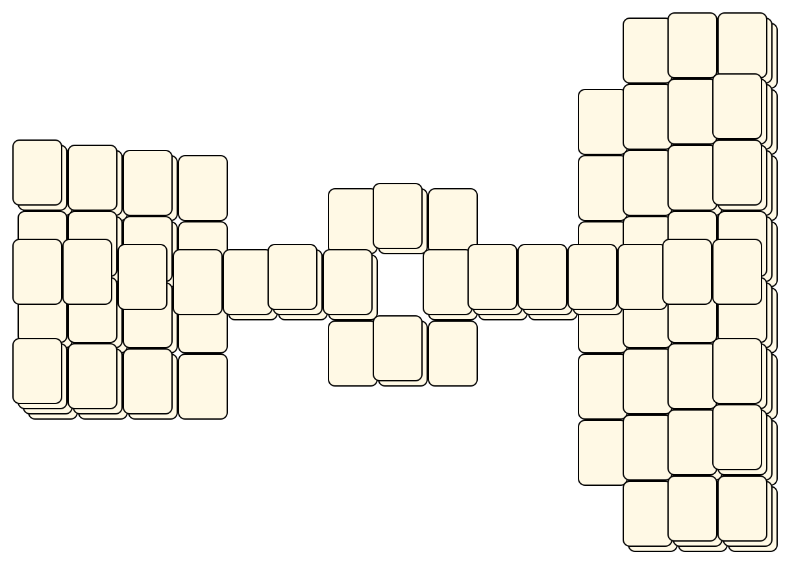

# Mahjong Solitaire Layout Museum: Solitile
* Source: [https://web.archive.org/web/19981205213424/http://www.kaser.com/solitile.html](https://web.archive.org/web/19981205213424/http://www.kaser.com/solitile.html)

* File Source:  
<sub>```https://archive.org/download/solitile_202209/Solitile.zip```</sub>


|Solitile||Layouts: 11|
|:--:|:--:|:--:|
|Beginner<br><br> <sub>Everett Kaser</sub> <br>[.lay](./beginner.lay)  [.layout](./beginner.layout)  [.mah](./beginner.mah) |Bridge<br><br> <sub>Everett Kaser</sub> <br>[.lay](./bridge_5.lay)  [.layout](./bridge_5.layout)  [.mah](./bridge_5.mah) |Encircle<br><br> <sub>Everett Kaser</sub> <br>[.lay](./encircle.lay)  [.layout](./encircle.layout)  [.mah](./encircle.mah) |
|Forum<br><br> <sub>Everett Kaser</sub> <br>[.lay](./forum.lay)  [.layout](./forum.layout)  [.mah](./forum.mah) |Pyramid<br><br> <sub>Everett Kaser</sub> <br>[.lay](./pyramid_5.lay)  [.layout](./pyramid_5.layout)  [.mah](./pyramid_5.mah) |Spider<br><br> <sub>Everett Kaser</sub> <br>[.lay](./spider_5.lay)  [.layout](./spider_5.layout)  [.mah](./spider_5.mah) |
|Starship<br><br> <sub>Everett Kaser</sub> <br>[.lay](./starship.lay)  [.layout](./starship.layout)  [.mah](./starship.mah) |Sun<br><br> <sub>Everett Kaser</sub> <br>[.lay](./sun_6.lay)  [.layout](./sun_6.layout)  [.mah](./sun_6.mah) |Temple<br><br> <sub>Everett Kaser</sub> <br>[.lay](./temple_7.lay)  [.layout](./temple_7.layout)  [.mah](./temple_7.mah) |
|Valley<br><br> <sub>Everett Kaser</sub> <br>[.lay](./valley.lay)  [.layout](./valley.layout)  [.mah](./valley.mah) |Wedges<br><br> <sub>Everett Kaser</sub> <br>[.lay](./wedges_2.lay)  [.layout](./wedges_2.layout)  [.mah](./wedges_2.mah) ||

## Grant Fikes
* Source: 
[https://web.archive.org/web/19981205213424/http://www.kaser.com/solitile.html](https://web.archive.org/web/19981205213424/http://www.kaser.com/solitile.html)

* File Source:  
<sub>```https://web.archive.org/web/20051020084434/http://www.kaser.com/solitile/grantlyt.exe```</sub>


|[grant](grant/README.md) ||Layouts: 3|
|:--:|:--:|:--:|
|Grant Knarly Works<br><br> <sub>Grant Fikes</sub> <br>[.lay](./grant/grant_knarly_works.lay)  [.layout](./grant/grant_knarly_works.layout)  [.mah](./grant/grant_knarly_works.mah) |Grant Squares<br><br> <sub>Grant Fikes</sub> <br>[.lay](./grant/grant_squares.lay)  [.layout](./grant/grant_squares.layout)  [.mah](./grant/grant_squares.mah) |Grant Watsons Map<br><br> <sub>Grant Fikes</sub> <br>[.lay](./grant/grant_watsons_map.lay)  [.layout](./grant/grant_watsons_map.layout)  [.mah](./grant/grant_watsons_map.mah) |

## Karl Guesman
* Source: 
[https://web.archive.org/web/19981205213424/http://www.kaser.com/solitile.html](https://web.archive.org/web/19981205213424/http://www.kaser.com/solitile.html)

* File Source:  
<sub>```https://web.archive.org/web/20051222222237/http://www.kaser.com/solitile/karl-4.zip```</sub>


|[karl](karl/README.md) ||Layouts: 1|
|:--:|:--:|:--:|
|Karl-4<br><br> <sub>Karl Guesman</sub> <br>[.lay](./karl/karl-4.lay)  [.layout](./karl/karl-4.layout)  [.mah](./karl/karl-4.mah) |