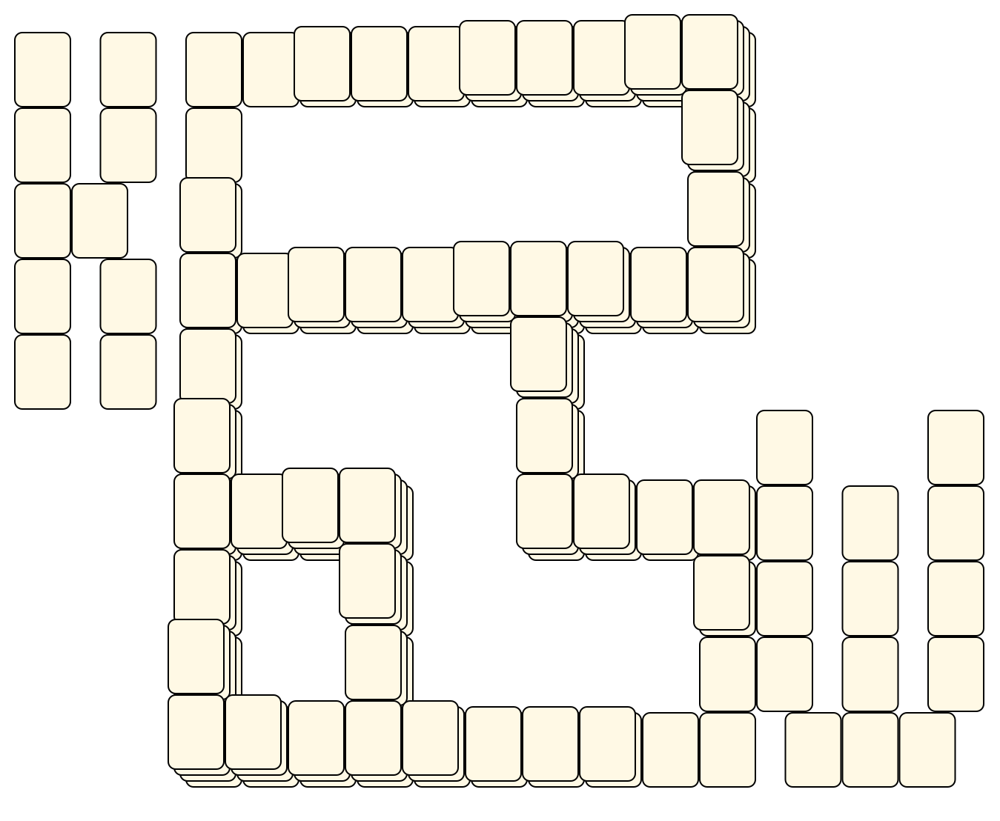
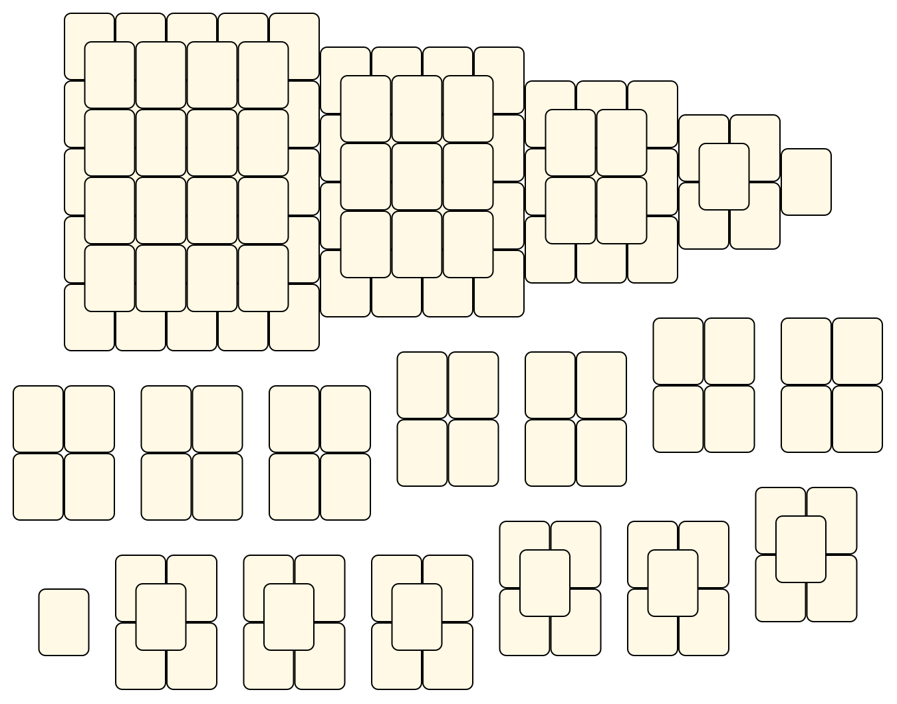
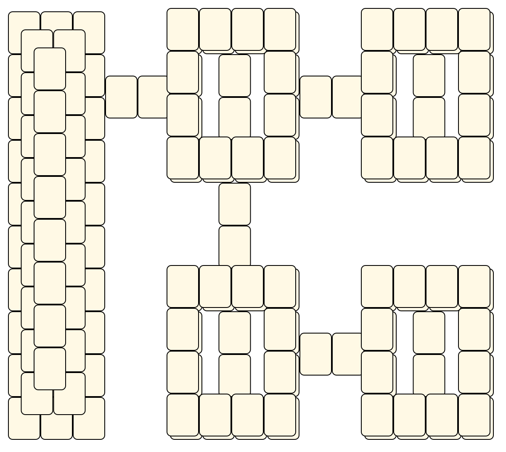

# Mahjong Solitaire Layout Museum: Grant Fikes
* Source: [https://web.archive.org/web/19981205213424/http://www.kaser.com/solitile.html](https://web.archive.org/web/19981205213424/http://www.kaser.com/solitile.html)

* File Source:  
<sub>```https://web.archive.org/web/20051020084434/http://www.kaser.com/solitile/grantlyt.exe```</sub>


|Grant Fikes||Layouts: 3|
|:--:|:--:|:--:|
|Grant Knarly Works<br><br> <sub>Grant Fikes</sub> <br>[.lay](./grant_knarly_works.lay)  [.layout](./grant_knarly_works.layout)  [.mah](./grant_knarly_works.mah) |Grant Squares<br><br> <sub>Grant Fikes</sub> <br>[.lay](./grant_squares.lay)  [.layout](./grant_squares.layout)  [.mah](./grant_squares.mah) |Grant Watsons Map<br><br> <sub>Grant Fikes</sub> <br>[.lay](./grant_watsons_map.lay)  [.layout](./grant_watsons_map.layout)  [.mah](./grant_watsons_map.mah) |