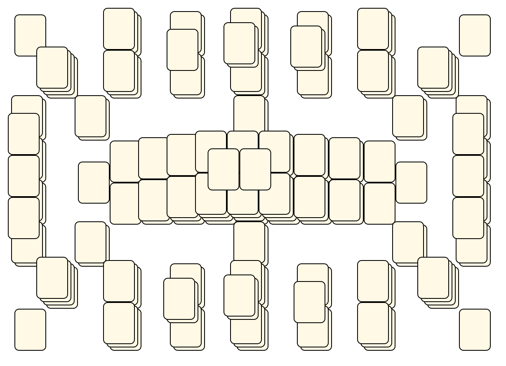

# Mahjong Solitaire Layout Museum: Karl Guesman
* Source: [https://web.archive.org/web/19981205213424/http://www.kaser.com/solitile.html](https://web.archive.org/web/19981205213424/http://www.kaser.com/solitile.html)

* File Source:  
<sub>```https://web.archive.org/web/20051222222237/http://www.kaser.com/solitile/karl-4.zip```</sub>


|Karl Guesman||Layouts: 1|
|:--:|:--:|:--:|
|Karl-4<br><br> <sub>Karl Guesman</sub> <br>[.lay](./karl-4.lay)  [.layout](./karl-4.layout)  [.mah](./karl-4.mah) |