# Mahjong Solitaire Layout Museum: Step5
* Source: [https://web.archive.org/web/20040407182149/http://www.step5.de/step5.htm](https://web.archive.org/web/20040407182149/http://www.step5.de/step5.htm)

* File Source:  
<sub>```https://web.archive.org/web/20040610012554/http://www.step5.de/Download/S5Layouts24122001.zip```</sub>


|Step5||Layouts: 44|
|:--:|:--:|:--:|
|$tep5s Challenge<br><br> <sub>Patrick Becker</sub> <br>[.lay](./$tep5s_challenge.lay)  [.layout](./$tep5s_challenge.layout)  [.mah](./$tep5s_challenge.mah) |3 Crowns<br>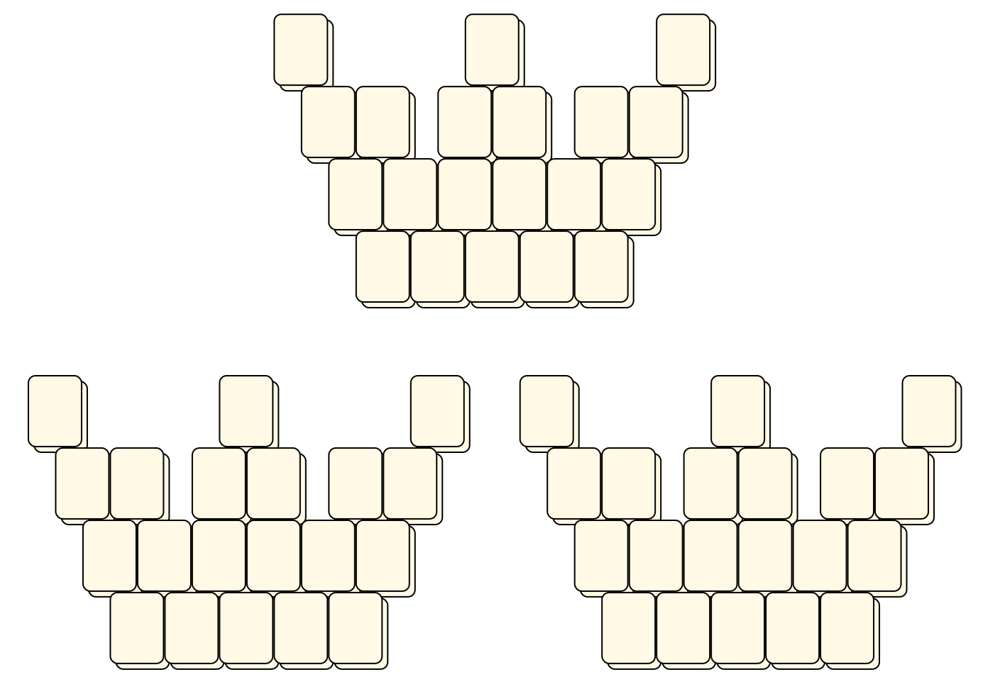<br> <sub>Patrick Becker</sub> <br>[.lay](./3_crowns.lay)  [.layout](./3_crowns.layout)  [.mah](./3_crowns.mah) |711<br>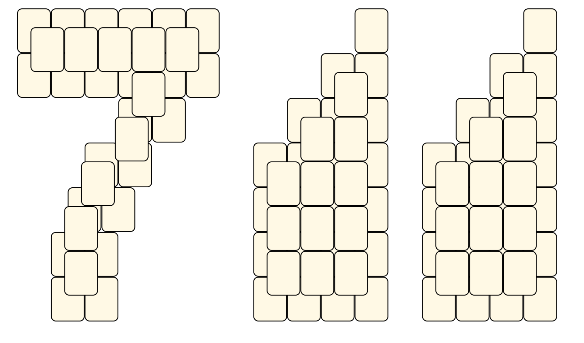<br> <sub>Patrick Becker</sub> <br>[.lay](./711.lay)  [.layout](./711.layout)  [.mah](./711.mah) |
|ATARI<br><br> <sub>Patrick Becker</sub> <br>[.lay](./atari.lay)  [.layout](./atari.layout)  [.mah](./atari.mah) |Boeder<br><br> <sub>Patrick Becker</sub> <br>[.lay](./boeder.lay)  [.layout](./boeder.layout)  [.mah](./boeder.mah) |Breakout<br><br> <sub>Patrick Becker</sub> <br>[.lay](./breakout.lay)  [.layout](./breakout.layout)  [.mah](./breakout.mah) |
|Calculations<br><br> <sub>Patrick Becker</sub> <br>[.lay](./calculations.lay)  [.layout](./calculations.layout)  [.mah](./calculations.mah) |Carnival<br><br> <sub>Patrick Becker</sub> <br>[.lay](./carnival.lay)  [.layout](./carnival.layout)  [.mah](./carnival.mah) |Coffee Cup<br><br> <sub>Patrick Becker</sub> <br>[.lay](./coffee_cup.lay)  [.layout](./coffee_cup.layout)  [.mah](./coffee_cup.mah) |
|Commodore<br>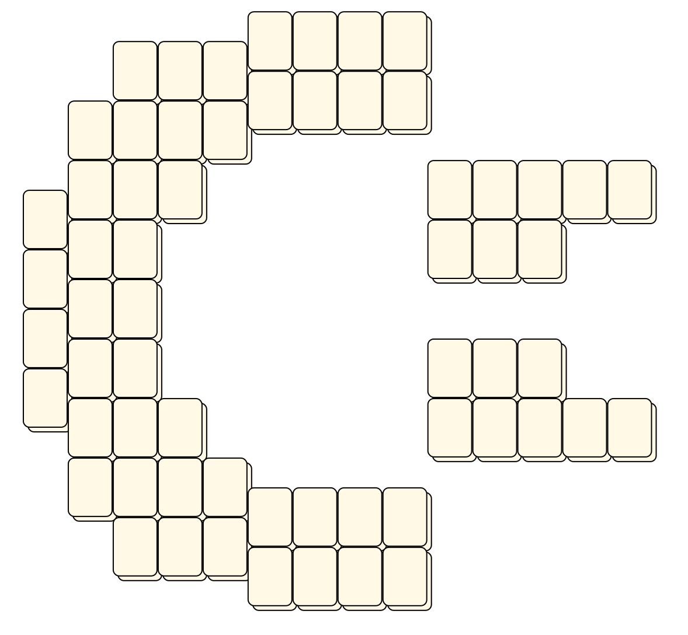<br> <sub>Patrick Becker</sub> <br>[.lay](./commodore.lay)  [.layout](./commodore.layout)  [.mah](./commodore.mah) |Cross<br><br> <sub>Patrick Becker</sub> <br>[.lay](./cross.lay)  [.layout](./cross.layout)  [.mah](./cross.mah) |Dollar<br><br> <sub>Patrick Becker</sub> <br>[.lay](./dollar.lay)  [.layout](./dollar.layout)  [.mah](./dollar.mah) |
|DSF<br><br> <sub>Patrick Becker</sub> <br>[.lay](./dsf.lay)  [.layout](./dsf.layout)  [.mah](./dsf.mah) |Electronic Arts<br><br> <sub>Patrick Becker</sub> <br>[.lay](./electronic_arts.lay)  [.layout](./electronic_arts.layout)  [.mah](./electronic_arts.mah) |Euro<br>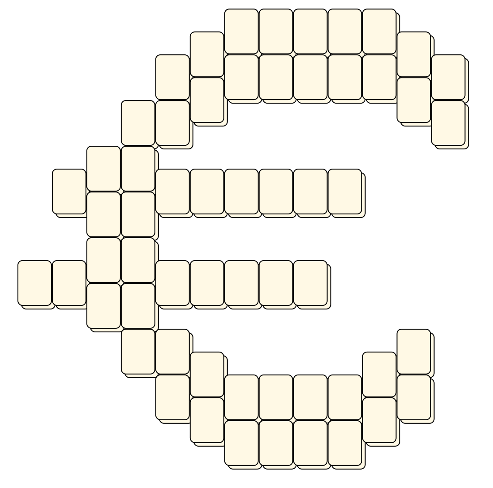<br> <sub>Patrick Becker</sub> <br>[.lay](./euro.lay)  [.layout](./euro.layout)  [.mah](./euro.mah) |
|Heart<br>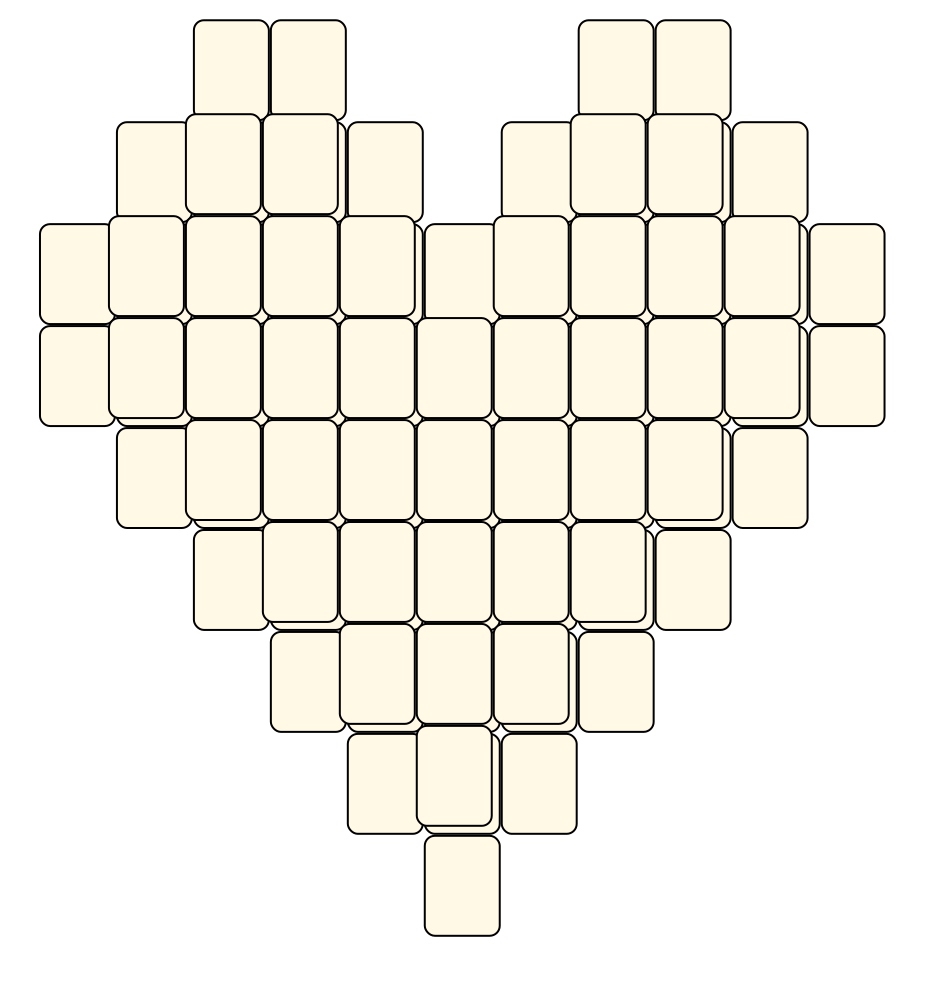<br> <sub>Patrick Becker</sub> <br>[.lay](./heart.lay)  [.layout](./heart.layout)  [.mah](./heart.mah) |Joystick<br><br> <sub>Patrick Becker</sub> <br>[.lay](./joystick.lay)  [.layout](./joystick.layout)  [.mah](./joystick.mah) |Kiss<br><br> <sub>Patrick Becker</sub> <br>[.lay](./kiss.lay)  [.layout](./kiss.layout)  [.mah](./kiss.mah) |
|LD-Converter<br><br> <sub>Patrick Becker</sub> <br>[.lay](./ld-converter.lay)  [.layout](./ld-converter.layout)  [.mah](./ld-converter.mah) |P For Pappnase<br><br> <sub>Patrick Becker</sub> <br>[.lay](./p_for_pappnase.lay)  [.layout](./p_for_pappnase.layout)  [.mah](./p_for_pappnase.mah) |Pioneer<br><br> <sub>Patrick Becker</sub> <br>[.lay](./pioneer.lay)  [.layout](./pioneer.layout)  [.mah](./pioneer.mah) |
|Pong<br><br> <sub>Patrick Becker</sub> <br>[.lay](./pong.lay)  [.layout](./pong.layout)  [.mah](./pong.mah) |QIX<br><br> <sub>Patrick Becker</sub> <br>[.lay](./qix.lay)  [.layout](./qix.layout)  [.mah](./qix.mah) |Quake 3 Arena<br><br> <sub>Patrick Becker</sub> <br>[.lay](./quake_3_arena.lay)  [.layout](./quake_3_arena.layout)  [.mah](./quake_3_arena.mah) |
|RE-Pfanne<br>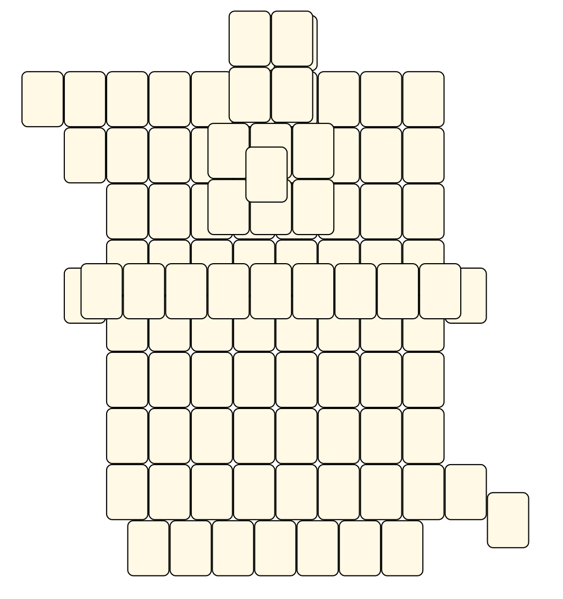<br> <sub>Patrick Becker</sub> <br>[.lay](./re-pfanne.lay)  [.layout](./re-pfanne.layout)  [.mah](./re-pfanne.mah) |Red Red Wine<br>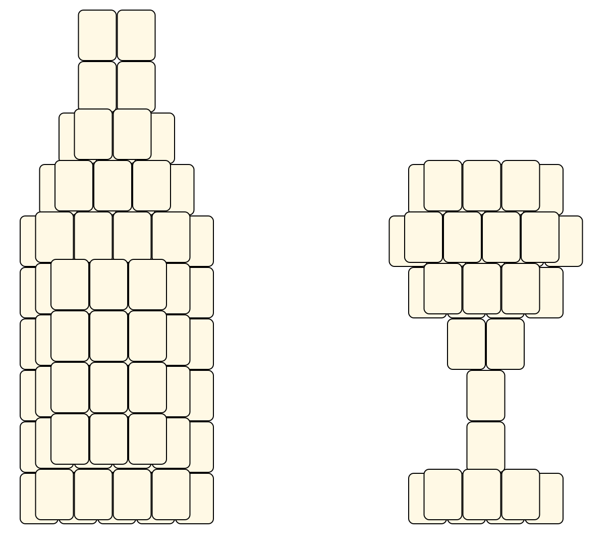<br> <sub>Patrick Becker</sub> <br>[.lay](./red_red_wine.lay)  [.layout](./red_red_wine.layout)  [.mah](./red_red_wine.mah) |Reloop 2<br><br> <sub>Patrick Becker</sub> <br>[.lay](./reloop_2.lay)  [.layout](./reloop_2.layout)  [.mah](./reloop_2.mah) |
|Roland<br><br> <sub>Patrick Becker</sub> <br>[.lay](./roland.lay)  [.layout](./roland.layout)  [.mah](./roland.mah) |Saturn<br><br> <sub>Patrick Becker</sub> <br>[.lay](./saturn.lay)  [.layout](./saturn.layout)  [.mah](./saturn.mah) |Schneider<br><br> <sub>Patrick Becker</sub> <br>[.lay](./schneider.lay)  [.layout](./schneider.layout)  [.mah](./schneider.mah) |
|Sinus Twins<br><br> <sub>Patrick Becker</sub> <br>[.lay](./sinus_twins.lay)  [.layout](./sinus_twins.layout)  [.mah](./sinus_twins.mah) |Stahl-Pfanne<br><br> <sub>Patrick Becker</sub> <br>[.lay](./stahl-pfanne.lay)  [.layout](./stahl-pfanne.layout)  [.mah](./stahl-pfanne.mah) |TA-Internal<br>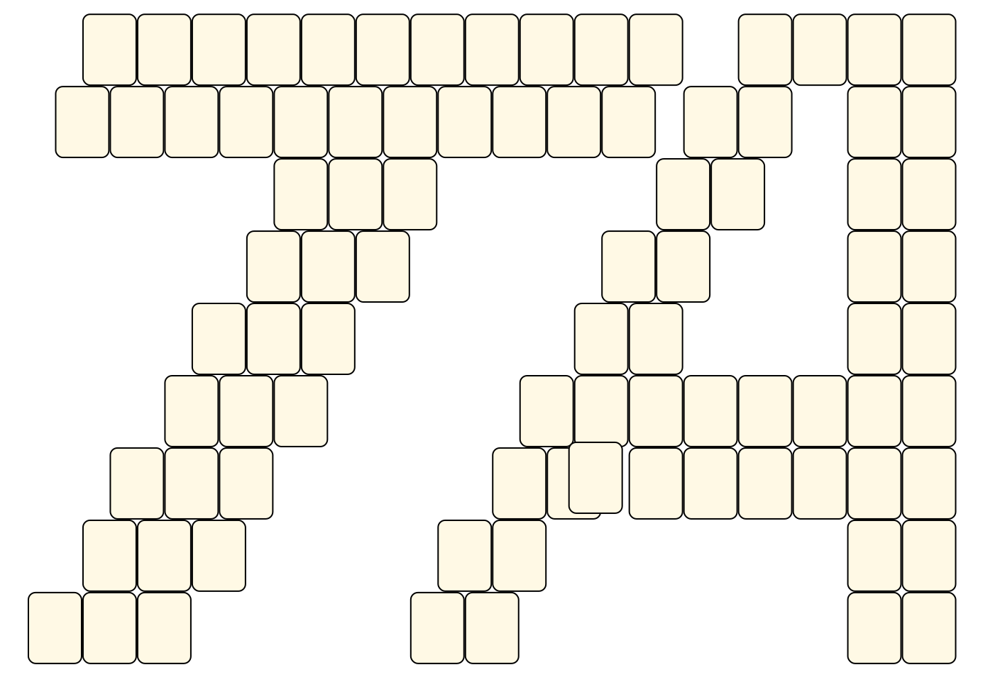<br> <sub>Step5</sub> <br>[.lay](./ta-internal.lay)  [.layout](./ta-internal.layout)  [.mah](./ta-internal.mah) |
|TF1<br><br> <sub>Patrick Becker</sub> <br>[.lay](./tf1.lay)  [.layout](./tf1.layout)  [.mah](./tf1.mah) |The Dome 1<br>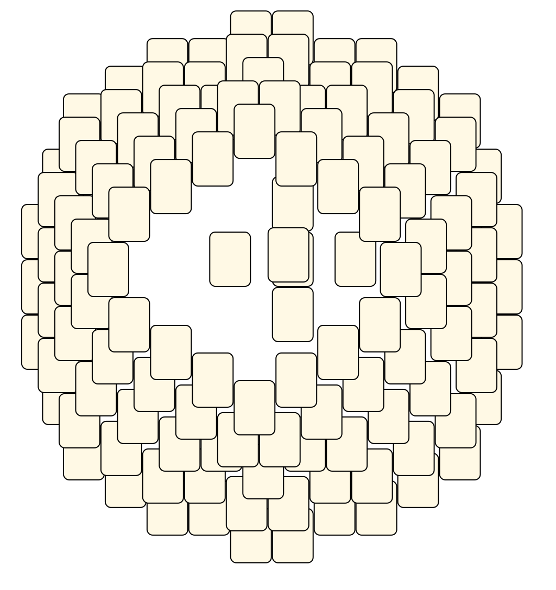<br> <sub>Patrick Becker</sub> <br>[.lay](./the_dome_1.lay)  [.layout](./the_dome_1.layout)  [.mah](./the_dome_1.mah) |The Nightmare<br>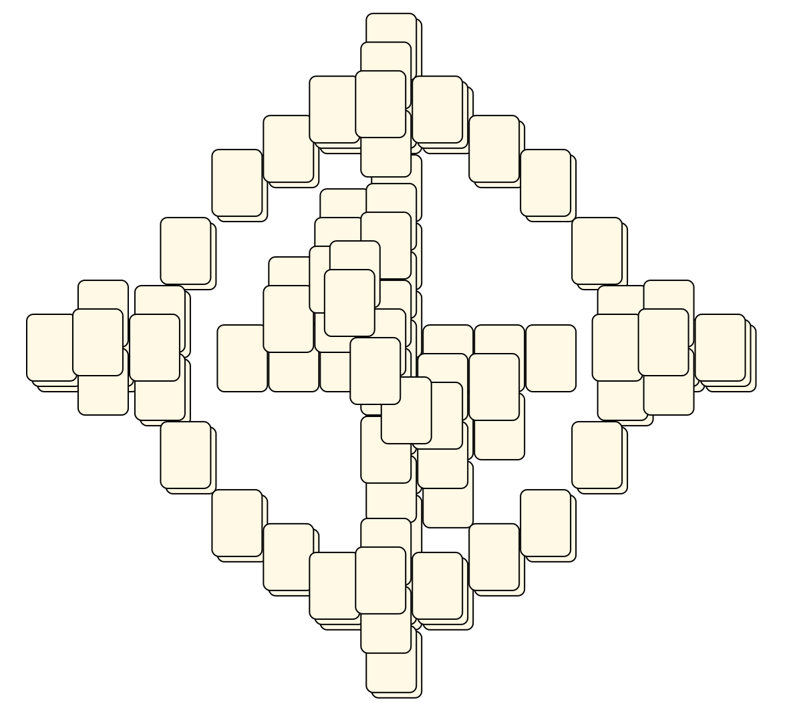<br> <sub>Patrick Becker</sub> <br>[.lay](./the_nightmare.lay)  [.layout](./the_nightmare.layout)  [.mah](./the_nightmare.mah) |
|Triumph-Adler<br>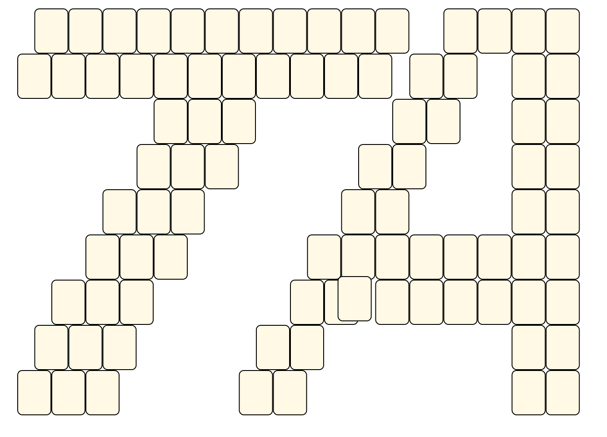<br> <sub>Patrick Becker</sub> <br>[.lay](./triumph-adler.lay)  [.layout](./triumph-adler.layout)  [.mah](./triumph-adler.mah) |United Artists<br><br> <sub>Patrick Becker</sub> <br>[.lay](./united_artists.lay)  [.layout](./united_artists.layout)  [.mah](./united_artists.mah) |Unterteil RH-Anlage 2<br><br> <sub>Patrick Becker</sub> <br>[.lay](./unterteil_rh-anlage_2.lay)  [.layout](./unterteil_rh-anlage_2.layout)  [.mah](./unterteil_rh-anlage_2.mah) |
|Vestax<br><br> <sub>Patrick Becker</sub> <br>[.lay](./vestax.lay)  [.layout](./vestax.layout)  [.mah](./vestax.mah) |Viva<br>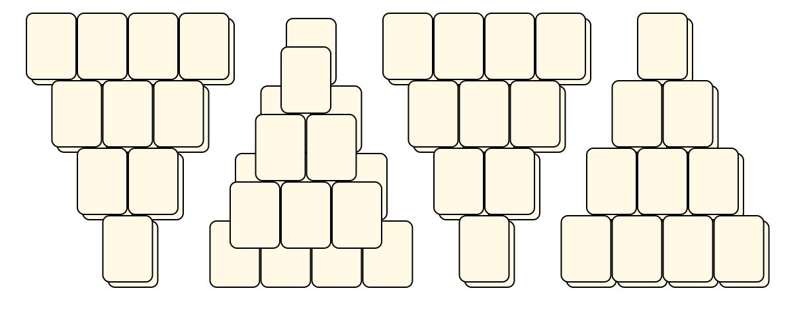<br> <sub>Patrick Becker</sub> <br>[.lay](./viva.lay)  [.layout](./viva.layout)  [.mah](./viva.mah) |Walzengeruest<br><br> <sub>Patrick Becker</sub> <br>[.lay](./walzengeruest.lay)  [.layout](./walzengeruest.layout)  [.mah](./walzengeruest.mah) |
|What The ...?<br>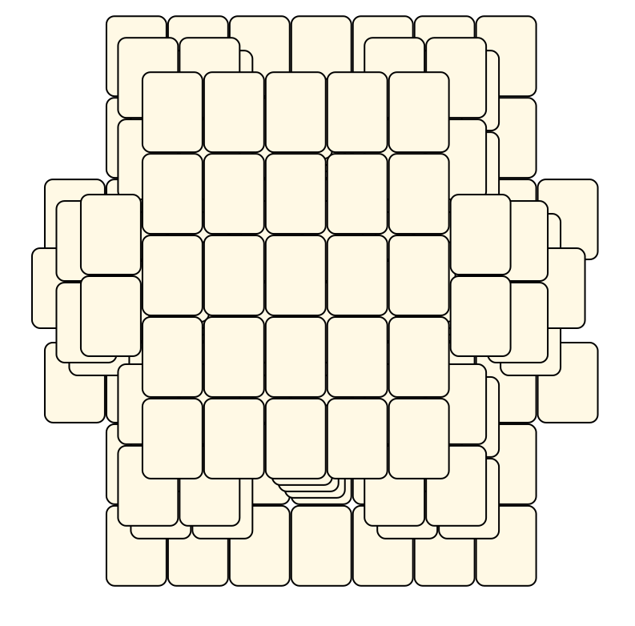<br> <sub>Patrick Becker</sub> <br>[.lay](./what_the.lay)  [.layout](./what_the.layout)  [.mah](./what_the.mah) |Whom The Bell Tolls<br><br> <sub>Patrick Becker</sub> <br>[.lay](./whom_the_bell_tolls.lay)  [.layout](./whom_the_bell_tolls.layout)  [.mah](./whom_the_bell_tolls.mah) ||