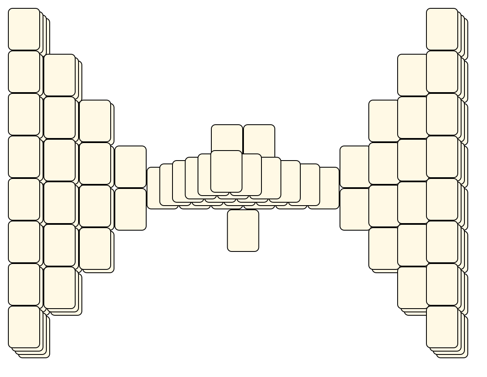
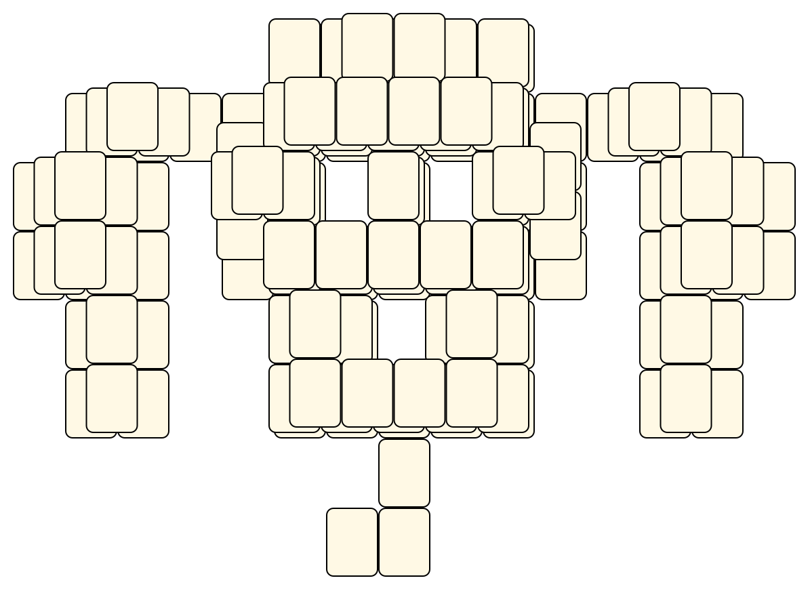
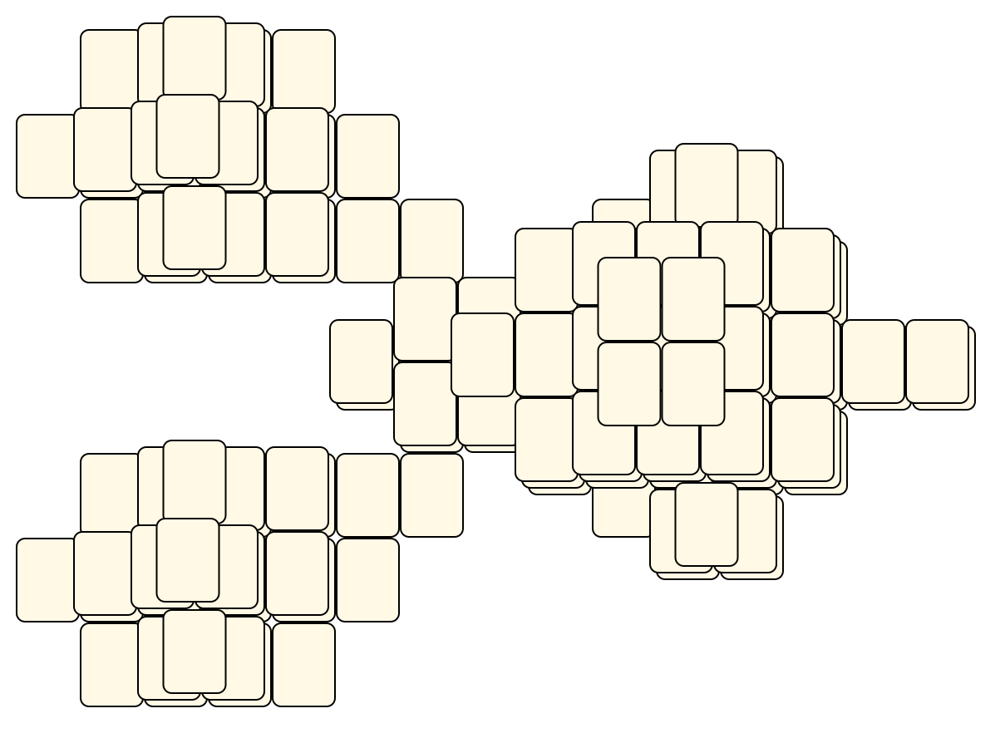
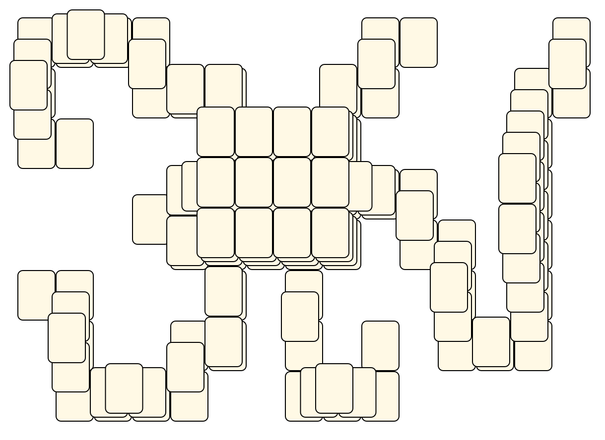
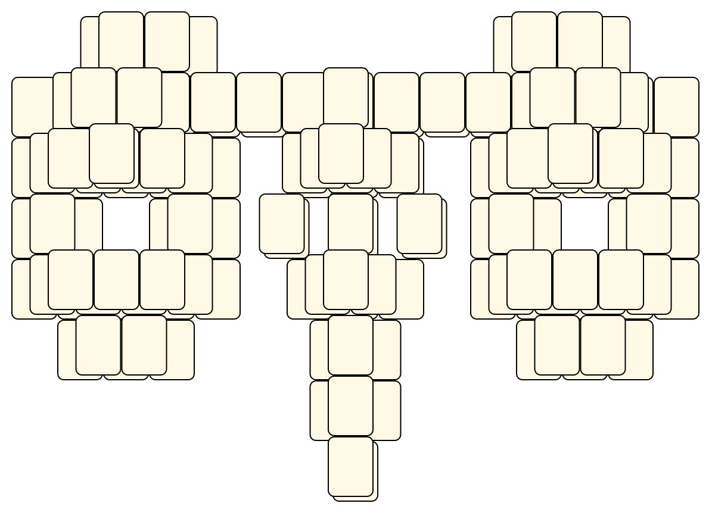
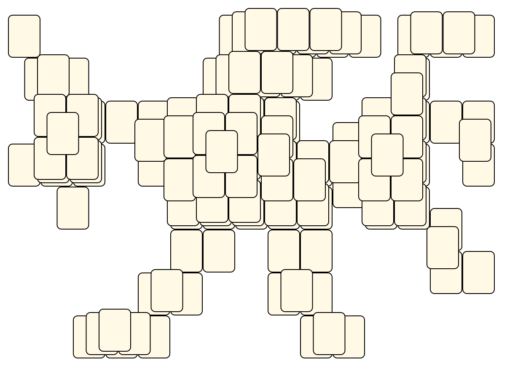

# Mahjong Solitaire Layout Museum: XMahjongg
* Source: [https://github.com/phileimer/xmahjongg/tree/main/share/layouts/](https://github.com/phileimer/xmahjongg/tree/main/share/layouts/)

* File Source:  
<sub>```https://github.com/phileimer/xmahjongg/tree/main/share/layouts/```</sub>


|XMahjongg||Layouts: 24|
|:--:|:--:|:--:|
|Arena<br><br> <sub>unknown</sub> <br>[.lay](./arena_5.lay)  [.layout](./arena_5.layout)  [.mah](./arena_5.mah) |Arrow<br><br> <sub>unknown</sub> <br>[.lay](./arrow_4.lay)  [.layout](./arrow_4.layout)  [.mah](./arrow_4.mah) |Boar<br><br> <sub>unknown</sub> <br>[.lay](./boar_2.lay)  [.layout](./boar_2.layout)  [.mah](./boar_2.mah) |
|Bridge<br><br> <sub>unknown</sub> <br>[.lay](./bridge_6.lay)  [.layout](./bridge_6.layout)  [.mah](./bridge_6.mah) |Ceremonial<br><br> <sub>unknown</sub> <br>[.lay](./ceremonial_4.lay)  [.layout](./ceremonial_4.layout)  [.mah](./ceremonial_4.mah) |Deepwell<br><br> <sub>unknown</sub> <br>[.lay](./deepwell.lay)  [.layout](./deepwell.layout)  [.mah](./deepwell.mah) |
|Default<br><br> <sub>unknown</sub> <br>[.lay](./default.lay)  [.layout](./default.layout)  [.mah](./default.mah) |Dog<br><br> <sub>unknown</sub> <br>[.lay](./dog_3.lay)  [.layout](./dog_3.layout)  [.mah](./dog_3.mah) |Farandole<br><br> <sub>unknown</sub> <br>[.lay](./farandole_4.lay)  [.layout](./farandole_4.layout)  [.mah](./farandole_4.mah) |
|Hare<br><br> <sub>unknown</sub> <br>[.lay](./hare_2.lay)  [.layout](./hare_2.layout)  [.mah](./hare_2.mah) |Horse<br><br> <sub>unknown</sub> <br>[.lay](./horse_3.lay)  [.layout](./horse_3.layout)  [.mah](./horse_3.mah) |Hourglass<br><br> <sub>unknown</sub> <br>[.lay](./hourglass_5.lay)  [.layout](./hourglass_5.layout)  [.mah](./hourglass_5.mah) |
|Monkey<br><br> <sub>unknown</sub> <br>[.lay](./monkey_2.lay)  [.layout](./monkey_2.layout)  [.mah](./monkey_2.mah) |Old Dragon<br><br> <sub>unknown</sub> <br>[.lay](./old_dragon_3.lay)  [.layout](./old_dragon_3.layout)  [.mah](./old_dragon_3.mah) |Ox<br><br> <sub>unknown</sub> <br>[.lay](./ox_3.lay)  [.layout](./ox_3.layout)  [.mah](./ox_3.mah) |
|Papillon<br><br> <sub>unknown</sub> <br>[.lay](./papillon_4.lay)  [.layout](./papillon_4.layout)  [.mah](./papillon_4.mah) |Ram<br><br> <sub>unknown</sub> <br>[.lay](./ram_2.lay)  [.layout](./ram_2.layout)  [.mah](./ram_2.mah) |Rat<br><br> <sub>unknown</sub> <br>[.lay](./rat_3.lay)  [.layout](./rat_3.layout)  [.mah](./rat_3.mah) |
|Rooster<br><br> <sub>unknown</sub> <br>[.lay](./rooster_2.lay)  [.layout](./rooster_2.layout)  [.mah](./rooster_2.mah) |Schoon<br><br> <sub>unknown</sub> <br>[.lay](./schoon.lay)  [.layout](./schoon.layout)  [.mah](./schoon.mah) |Snake<br><br> <sub>unknown</sub> <br>[.lay](./snake_3.lay)  [.layout](./snake_3.layout)  [.mah](./snake_3.mah) |
|Theater<br><br> <sub>unknown</sub> <br>[.lay](./theater_4.lay)  [.layout](./theater_4.layout)  [.mah](./theater_4.mah) |Tiger<br><br> <sub>unknown</sub> <br>[.lay](./tiger_3.lay)  [.layout](./tiger_3.layout)  [.mah](./tiger_3.mah) |Wedges<br><br> <sub>unknown</sub> <br>[.lay](./wedges_3.lay)  [.layout](./wedges_3.layout)  [.mah](./wedges_3.mah) |