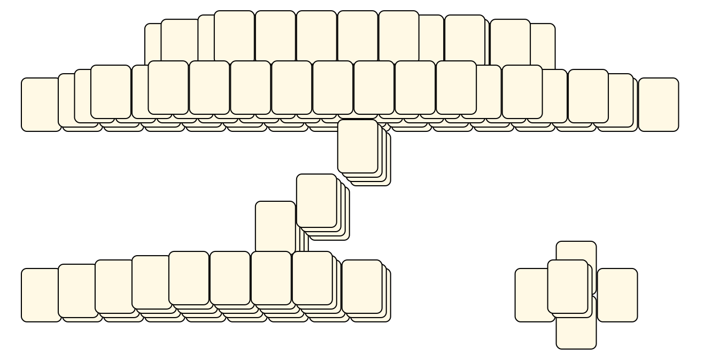
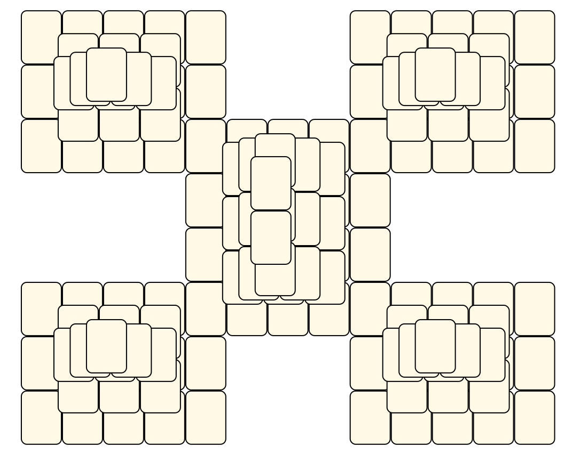
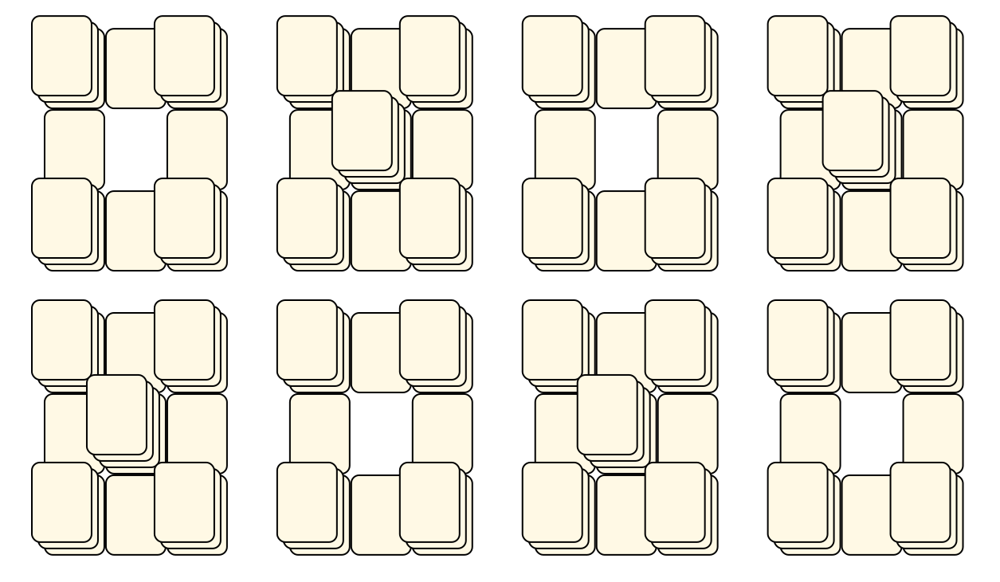
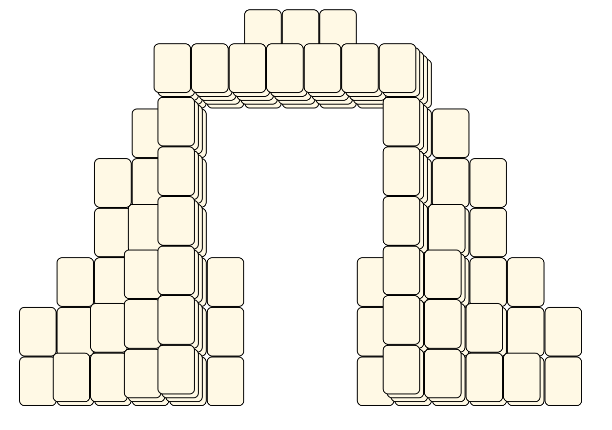

# Mahjong Solitaire Layout Museum: KMahjongg
* Source: [https://github.com/KDE/kmahjongg/tree/master/layouts/](https://github.com/KDE/kmahjongg/tree/master/layouts/)

* File Source:  
<sub>```https://github.com/KDE/kmahjongg/tree/master/layouts/```</sub>


|KMahjongg||Layouts: 71|
|:--:|:--:|:--:|
|4 Winds<br><br> <sub>Alexey Charkov</sub> <br>[.lay](./4_winds.lay)  [.layout](./4_winds.layout)  [.mah](./4_winds.mah) |Alien<br><br> <sub>Alexey Charkov</sub> <br>[.lay](./alien.lay)  [.layout](./alien.layout)  [.mah](./alien.mah) |Altar<br><br> <sub>Alexey Charkov</sub> <br>[.lay](./altar.lay)  [.layout](./altar.layout)  [.mah](./altar.mah) |
|Arena<br><br> <sub>Alexey Charkov</sub> <br>[.lay](./arena.lay)  [.layout](./arena.layout)  [.mah](./arena.mah) |Arrow<br><br> <sub>Alexey Charkov</sub> <br>[.lay](./arrow.lay)  [.layout](./arrow.layout)  [.mah](./arrow.mah) |Atlantis<br><br> <sub>Alexey Charkov</sub> <br>[.lay](./atlantis.lay)  [.layout](./atlantis.layout)  [.mah](./atlantis.mah) |
|Aztec<br><br> <sub>Alexey Charkov</sub> <br>[.lay](./aztec.lay)  [.layout](./aztec.layout)  [.mah](./aztec.mah) |Balance<br><br> <sub>Alexey Charkov</sub> <br>[.lay](./balance.lay)  [.layout](./balance.layout)  [.mah](./balance.mah) |Bat<br><br> <sub>Alexey Charkov</sub> <br>[.lay](./bat.lay)  [.layout](./bat.layout)  [.mah](./bat.mah) |
|Bug<br><br> <sub>Alexey Charkov</sub> <br>[.lay](./bug.lay)  [.layout](./bug.layout)  [.mah](./bug.mah) |Castle<br><br> <sub>Alexey Charkov</sub> <br>[.lay](./castle.lay)  [.layout](./castle.layout)  [.mah](./castle.mah) |Castle2<br><br> <sub>Alexey Charkov</sub> <br>[.lay](./castle2.lay)  [.layout](./castle2.layout)  [.mah](./castle2.mah) |
|Cat<br><br> <sub>Alexey Charkov</sub> <br>[.lay](./cat_2.lay)  [.layout](./cat_2.layout)  [.mah](./cat_2.mah) |Chains<br><br> <sub>Alexey Charkov</sub> <br>[.lay](./chains.lay)  [.layout](./chains.layout)  [.mah](./chains.mah) |Checkered<br><br> <sub>Alexey Charkov</sub> <br>[.lay](./checkered.lay)  [.layout](./checkered.layout)  [.mah](./checkered.mah) |
|Chip<br><br> <sub>Alexey Charkov</sub> <br>[.lay](./chip.lay)  [.layout](./chip.layout)  [.mah](./chip.mah) |Clubs<br><br> <sub>Alexey Charkov</sub> <br>[.lay](./clubs_2.lay)  [.layout](./clubs_2.layout)  [.mah](./clubs_2.mah) |Columns<br><br> <sub>Alexey Charkov</sub> <br>[.lay](./columns.lay)  [.layout](./columns.layout)  [.mah](./columns.mah) |
|Crab<br><br> <sub>Alexey Charkov</sub> <br>[.lay](./crab.lay)  [.layout](./crab.layout)  [.mah](./crab.mah) |Crab<br><br> <sub>Alexey Charkov</sub> <br>[.lay](./crab_2.lay)  [.layout](./crab_2.layout)  [.mah](./crab_2.mah) |Cross<br><br> <sub>Alexey Charkov</sub> <br>[.lay](./cross_3.lay)  [.layout](./cross_3.layout)  [.mah](./cross_3.mah) |
|Eagle<br><br> <sub>Alexey Charkov</sub> <br>[.lay](./eagle.lay)  [.layout](./eagle.layout)  [.mah](./eagle.mah) |Enterprise<br><br> <sub>Alexey Charkov</sub> <br>[.lay](./enterprise.lay)  [.layout](./enterprise.layout)  [.mah](./enterprise.mah) |Explosion<br><br> <sub>Alexey Charkov</sub> <br>[.lay](./explosion.lay)  [.layout](./explosion.layout)  [.mah](./explosion.mah) |
|Flowers<br><br> <sub>Alexey Charkov</sub> <br>[.lay](./flowers.lay)  [.layout](./flowers.layout)  [.mah](./flowers.mah) |Future<br><br> <sub>Alexey Charkov</sub> <br>[.lay](./future.lay)  [.layout](./future.layout)  [.mah](./future.mah) |Galaxy<br><br> <sub>Alexey Charkov</sub> <br>[.lay](./galaxy.lay)  [.layout](./galaxy.layout)  [.mah](./galaxy.mah) |
|Garden<br><br> <sub>Alexey Charkov</sub> <br>[.lay](./garden.lay)  [.layout](./garden.layout)  [.mah](./garden.mah) |Girl<br><br> <sub>Alexey Charkov</sub> <br>[.lay](./girl.lay)  [.layout](./girl.layout)  [.mah](./girl.mah) |Glade<br><br> <sub>Alexey Charkov</sub> <br>[.lay](./glade.lay)  [.layout](./glade.layout)  [.mah](./glade.mah) |
|Grid<br><br> <sub>Alexey Charkov</sub> <br>[.lay](./grid.lay)  [.layout](./grid.layout)  [.mah](./grid.mah) |Helios<br><br> <sub>Alexey Charkov</sub> <br>[.lay](./helios.lay)  [.layout](./helios.layout)  [.mah](./helios.mah) |Hole<br><br> <sub>Alexey Charkov</sub> <br>[.lay](./hole.lay)  [.layout](./hole.layout)  [.mah](./hole.mah) |
|Inner Circle<br><br> <sub>Alexey Charkov</sub> <br>[.lay](./inner_circle.lay)  [.layout](./inner_circle.layout)  [.mah](./inner_circle.mah) |Key<br><br> <sub>Alexey Charkov</sub> <br>[.lay](./key.lay)  [.layout](./key.layout)  [.mah](./key.mah) |Km<br><br> <sub>Alexey Charkov</sub> <br>[.lay](./km.lay)  [.layout](./km.layout)  [.mah](./km.mah) |
|Labyrinth<br><br> <sub>Alexey Charkov</sub> <br>[.lay](./labyrinth.lay)  [.layout](./labyrinth.layout)  [.mah](./labyrinth.mah) |Mask<br><br> <sub>Alexey Charkov</sub> <br>[.lay](./mask.lay)  [.layout](./mask.layout)  [.mah](./mask.mah) |Maya<br><br> <sub>Alexey Charkov</sub> <br>[.lay](./maya.lay)  [.layout](./maya.layout)  [.mah](./maya.mah) |
|Maze<br><br> <sub>Alexey Charkov</sub> <br>[.lay](./maze.lay)  [.layout](./maze.layout)  [.mah](./maze.mah) |Mesh<br><br> <sub>Alexey Charkov</sub> <br>[.lay](./mesh.lay)  [.layout](./mesh.layout)  [.mah](./mesh.mah) |Moth<br><br> <sub>Alexey Charkov</sub> <br>[.lay](./moth.lay)  [.layout](./moth.layout)  [.mah](./moth.mah) |
|Order<br><br> <sub>Alexey Charkov</sub> <br>[.lay](./order.lay)  [.layout](./order.layout)  [.mah](./order.mah) |Pattern<br><br> <sub>Alexey Charkov</sub> <br>[.lay](./pattern.lay)  [.layout](./pattern.layout)  [.mah](./pattern.mah) |Penta<br><br> <sub>Alexey Charkov</sub> <br>[.lay](./penta.lay)  [.layout](./penta.layout)  [.mah](./penta.mah) |
|Pillars<br><br> <sub>Alexey Charkov</sub> <br>[.lay](./pillars.lay)  [.layout](./pillars.layout)  [.mah](./pillars.mah) |Pirates<br><br> <sub>Alexey Charkov</sub> <br>[.lay](./pirates.lay)  [.layout](./pirates.layout)  [.mah](./pirates.mah) |Pyramid<br><br> <sub>Alexey Charkov</sub> <br>[.lay](./pyramid.lay)  [.layout](./pyramid.layout)  [.mah](./pyramid.mah) |
|Rocket<br><br> <sub>Alexey Charkov</sub> <br>[.lay](./rocket.lay)  [.layout](./rocket.layout)  [.mah](./rocket.mah) |Shield<br><br> <sub>Alexey Charkov</sub> <br>[.lay](./shield.lay)  [.layout](./shield.layout)  [.mah](./shield.mah) |Spider<br><br> <sub>Alexey Charkov</sub> <br>[.lay](./spider.lay)  [.layout](./spider.layout)  [.mah](./spider.mah) |
|Squares<br><br> <sub>Alexey Charkov</sub> <br>[.lay](./squares.lay)  [.layout](./squares.layout)  [.mah](./squares.mah) |Squaring<br><br> <sub>Alexey Charkov</sub> <br>[.lay](./squaring.lay)  [.layout](./squaring.layout)  [.mah](./squaring.mah) |Stadion<br><br> <sub>Alexey Charkov</sub> <br>[.lay](./stadion.lay)  [.layout](./stadion.layout)  [.mah](./stadion.mah) |
|Stairs<br><br> <sub>Alexey Charkov</sub> <br>[.lay](./stairs_2.lay)  [.layout](./stairs_2.layout)  [.mah](./stairs_2.mah) |Star<br><br> <sub>Alexey Charkov</sub> <br>[.lay](./star.lay)  [.layout](./star.layout)  [.mah](./star.mah) |Star Ship<br><br> <sub>Alexey Charkov</sub> <br>[.lay](./star_ship.lay)  [.layout](./star_ship.layout)  [.mah](./star_ship.mah) |
|Stax<br><br> <sub>Alexey Charkov</sub> <br>[.lay](./stax.lay)  [.layout](./stax.layout)  [.mah](./stax.mah) |Swirl<br><br> <sub>Alexey Charkov</sub> <br>[.lay](./swirl.lay)  [.layout](./swirl.layout)  [.mah](./swirl.mah) |Temple<br><br> <sub>Alexey Charkov</sub> <br>[.lay](./temple.lay)  [.layout](./temple.layout)  [.mah](./temple.mah) |
|The Door<br><br> <sub>Alexey Charkov</sub> <br>[.lay](./the_door.lay)  [.layout](./the_door.layout)  [.mah](./the_door.mah) |Theatre<br><br> <sub>Alexey Charkov</sub> <br>[.lay](./theatre.lay)  [.layout](./theatre.layout)  [.mah](./theatre.mah) |Time Tunnel<br><br> <sub>Alexey Charkov</sub> <br>[.lay](./time_tunnel.lay)  [.layout](./time_tunnel.layout)  [.mah](./time_tunnel.mah) |
|Tomb<br><br> <sub>Alexey Charkov</sub> <br>[.lay](./tomb.lay)  [.layout](./tomb.layout)  [.mah](./tomb.mah) |Totem<br><br> <sub>Alexey Charkov</sub> <br>[.lay](./totem.lay)  [.layout](./totem.layout)  [.mah](./totem.mah) |Tower<br><br> <sub>Alexey Charkov</sub> <br>[.lay](./tower.lay)  [.layout](./tower.layout)  [.mah](./tower.mah) |
|Triangle<br><br> <sub>Alexey Charkov</sub> <br>[.lay](./triangle.lay)  [.layout](./triangle.layout)  [.mah](./triangle.mah) |Up&down<br><br> <sub>Alexey Charkov</sub> <br>[.lay](./up&down.lay)  [.layout](./up&down.layout)  [.mah](./up&down.mah) |Vi<br><br> <sub>Alexey Charkov</sub> <br>[.lay](./vi.lay)  [.layout](./vi.layout)  [.mah](./vi.mah) |
|Well<br><br> <sub>Alexey Charkov</sub> <br>[.lay](./well.lay)  [.layout](./well.layout)  [.mah](./well.mah) |X Shaped<br><br> <sub>Alexey Charkov</sub> <br>[.lay](./x_shaped.lay)  [.layout](./x_shaped.layout)  [.mah](./x_shaped.mah) ||