# Mahjong Solitaire Layout Museum: Pyramids
* Source: [https://web.archive.org/web/20230204113220/http://tsubassa-kurenai.de/Kyodai/Layouts/](https://web.archive.org/web/20230204113220/http://tsubassa-kurenai.de/Kyodai/Layouts/)

* File Source:  
<sub>```https://web.archive.org/web/20230204113220/http://tsubassa-kurenai.de/Kyodai/Layouts/```</sub>


|Pyramids||Layouts: 13|
|:--:|:--:|:--:|
|Bordered Pyramid<br>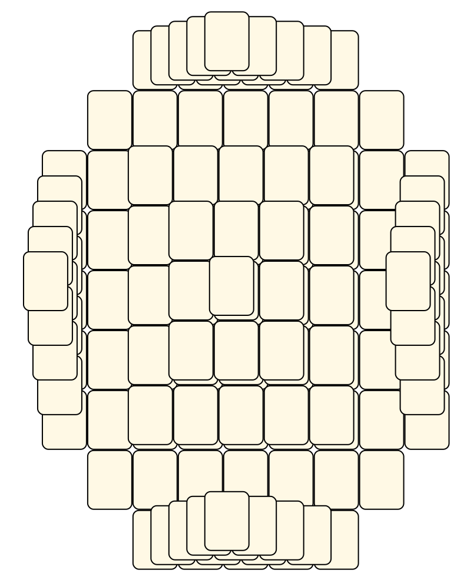<br> <sub>Tsubassa Kurenai</sub> <br>[.lay](./bordered_pyramid.lay)  [.layout](./bordered_pyramid.layout)  [.mah](./bordered_pyramid.mah) |Eight Pyramids<br>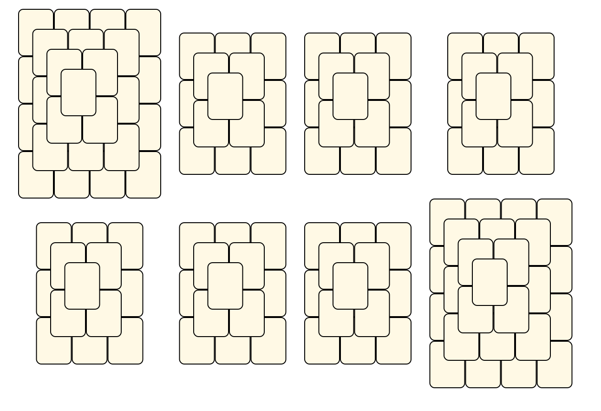<br> <sub>Jens Rose</sub> <br>[.lay](./eight_pyramids.lay)  [.layout](./eight_pyramids.layout)  [.mah](./eight_pyramids.mah) |Eleven Pyramids<br>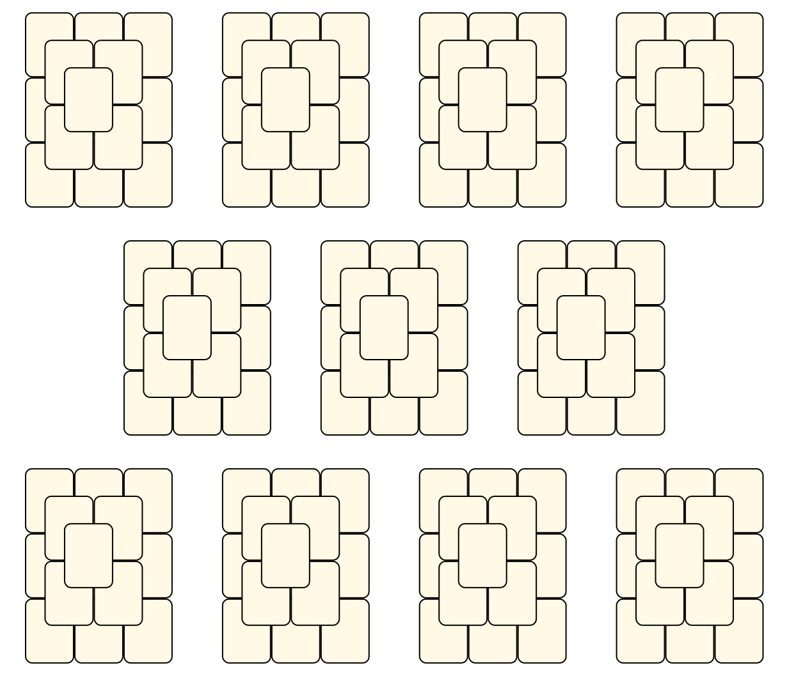<br> <sub>Jens Rose</sub> <br>[.lay](./eleven_pyramids.lay)  [.layout](./eleven_pyramids.layout)  [.mah](./eleven_pyramids.mah) |
|Four Pyramids<br>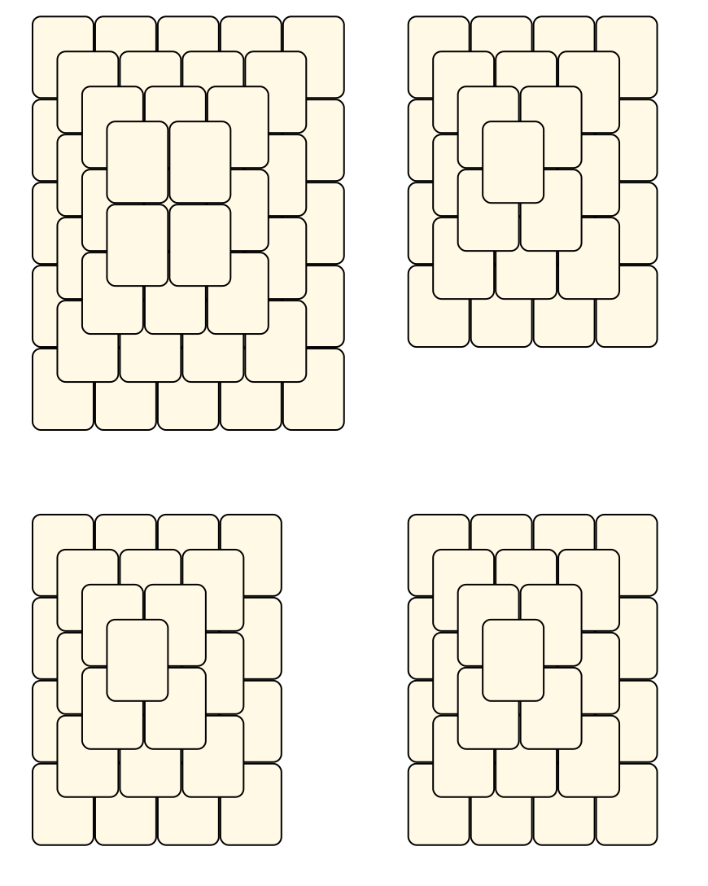<br> <sub>Tsubassa Kurenai</sub> <br>[.lay](./four_pyramids.lay)  [.layout](./four_pyramids.layout)  [.mah](./four_pyramids.mah) |Four Pyramids Linked<br>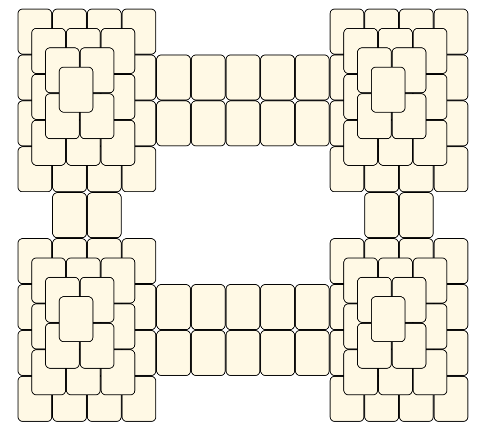<br> <sub>Tsubassa Kurenai</sub> <br>[.lay](./four_pyramids_linked.lay)  [.layout](./four_pyramids_linked.layout)  [.mah](./four_pyramids_linked.mah) |Hohle Pyramide<br>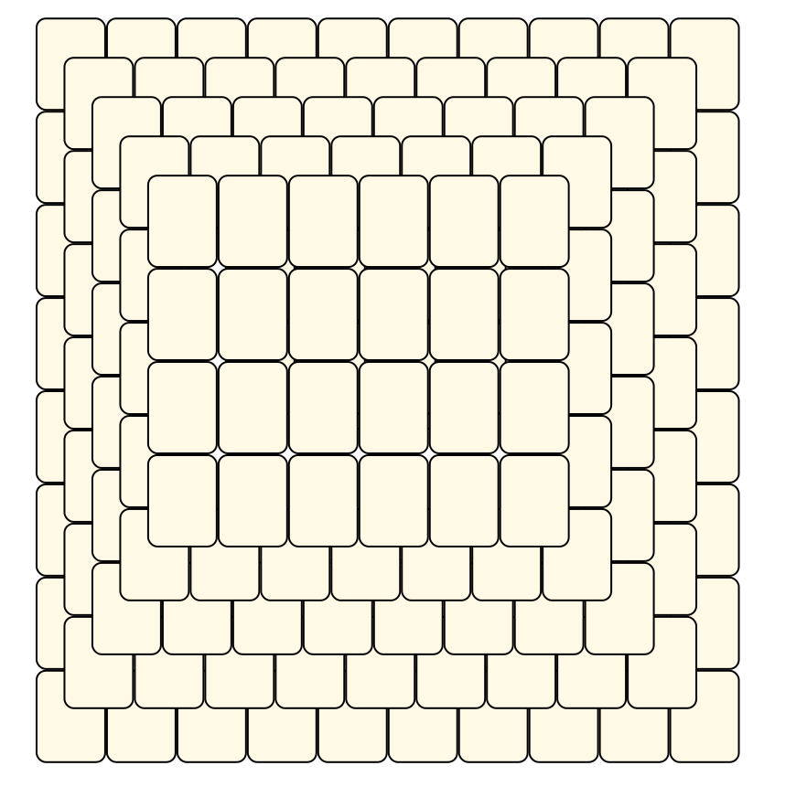<br> <sub>Tsubassa Kurenai</sub> <br>[.lay](./hohle_pyramide.lay)  [.layout](./hohle_pyramide.layout)  [.mah](./hohle_pyramide.mah) |
|Nine Pyramids<br>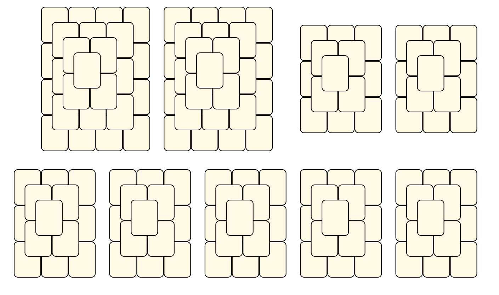<br> <sub>Jens Rose</sub> <br>[.lay](./nine_pyramids.lay)  [.layout](./nine_pyramids.layout)  [.mah](./nine_pyramids.mah) |One Pyramid<br>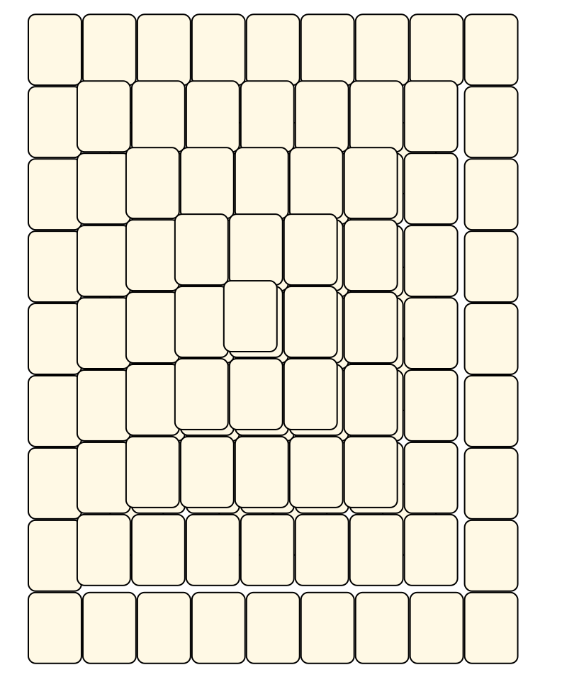<br> <sub>Jens Rose</sub> <br>[.lay](./one_pyramid.lay)  [.layout](./one_pyramid.layout)  [.mah](./one_pyramid.mah) |Six Pyramids<br>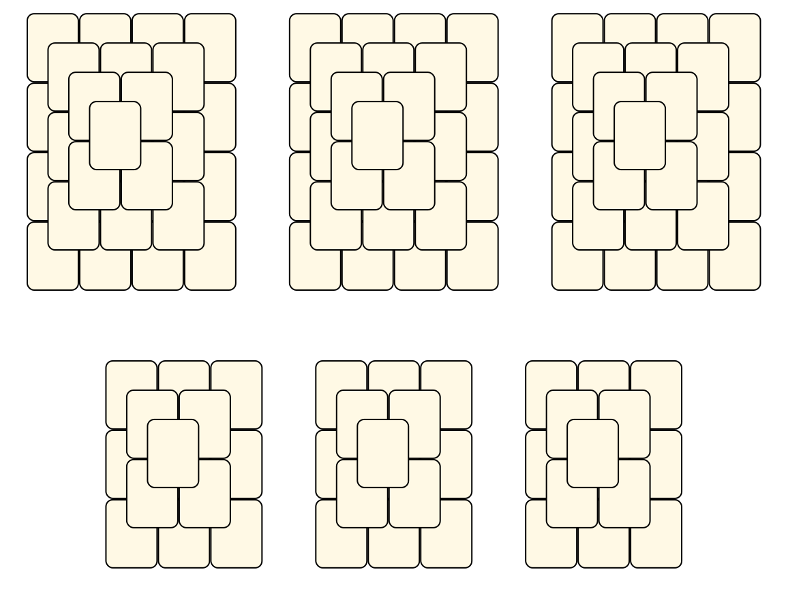<br> <sub>Tsubassa Kurenai</sub> <br>[.lay](./six_pyramids.lay)  [.layout](./six_pyramids.layout)  [.mah](./six_pyramids.mah) |
|Ten Pyramids<br>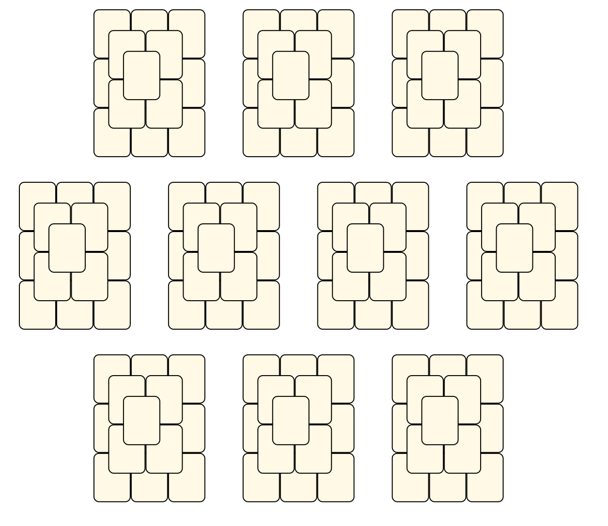<br> <sub>Jens Rose</sub> <br>[.lay](./ten_pyramids.lay)  [.layout](./ten_pyramids.layout)  [.mah](./ten_pyramids.mah) |Three Pyramids<br>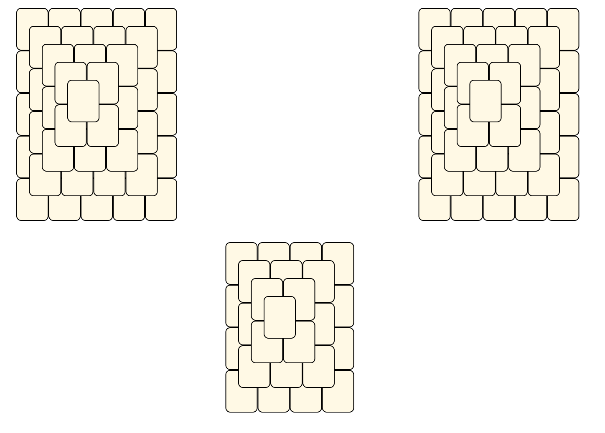<br> <sub>Tsubassa Kurenai</sub> <br>[.lay](./three_pyramids.lay)  [.layout](./three_pyramids.layout)  [.mah](./three_pyramids.mah) |Twelve Pyramids<br>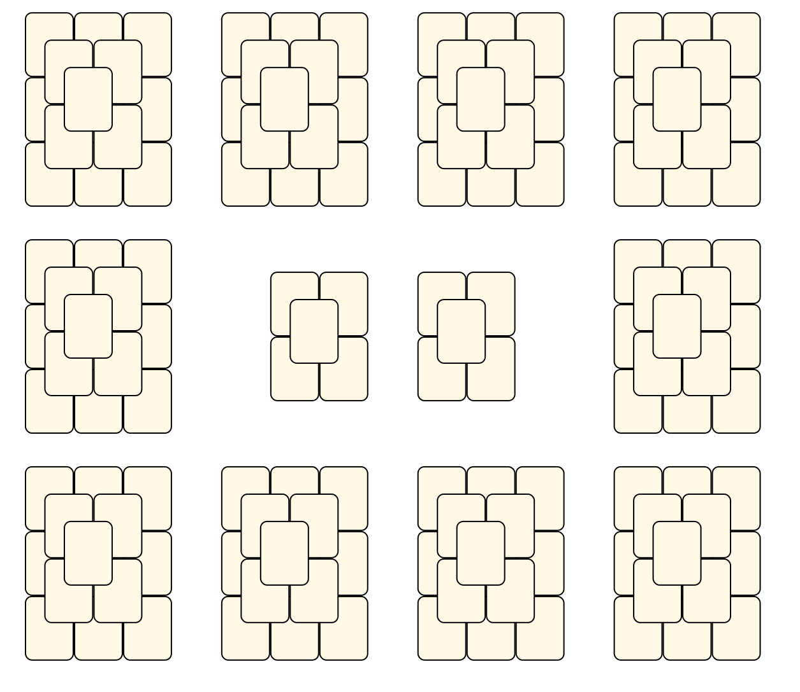<br> <sub>Jens Rose</sub> <br>[.lay](./twelve_pyramids.lay)  [.layout](./twelve_pyramids.layout)  [.mah](./twelve_pyramids.mah) |
|Two Pyramids<br>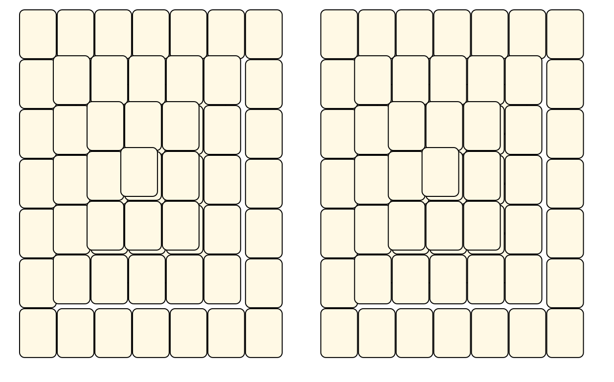<br> <sub>Jens Rose</sub> <br>[.lay](./two_pyramids.lay)  [.layout](./two_pyramids.layout)  [.mah](./two_pyramids.mah) |||