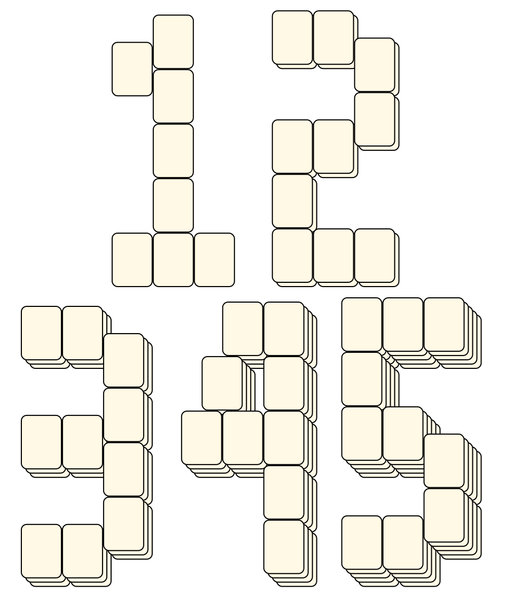
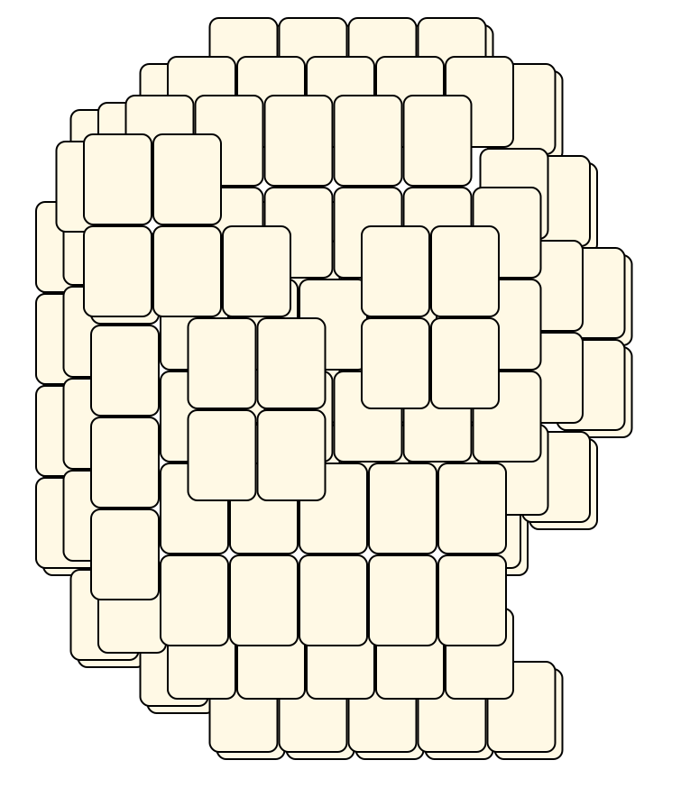
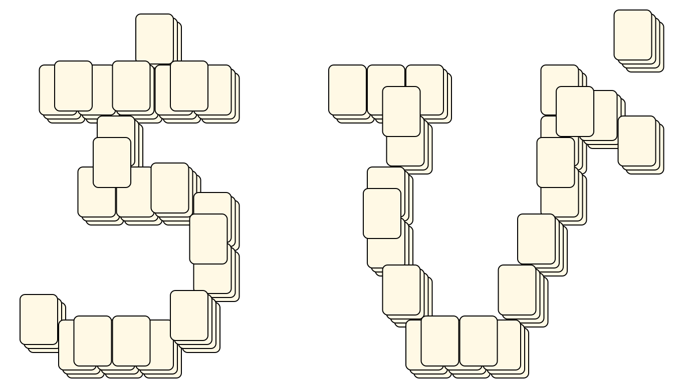
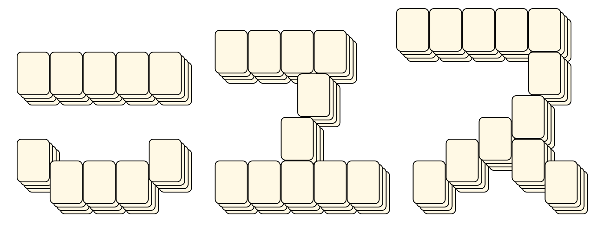
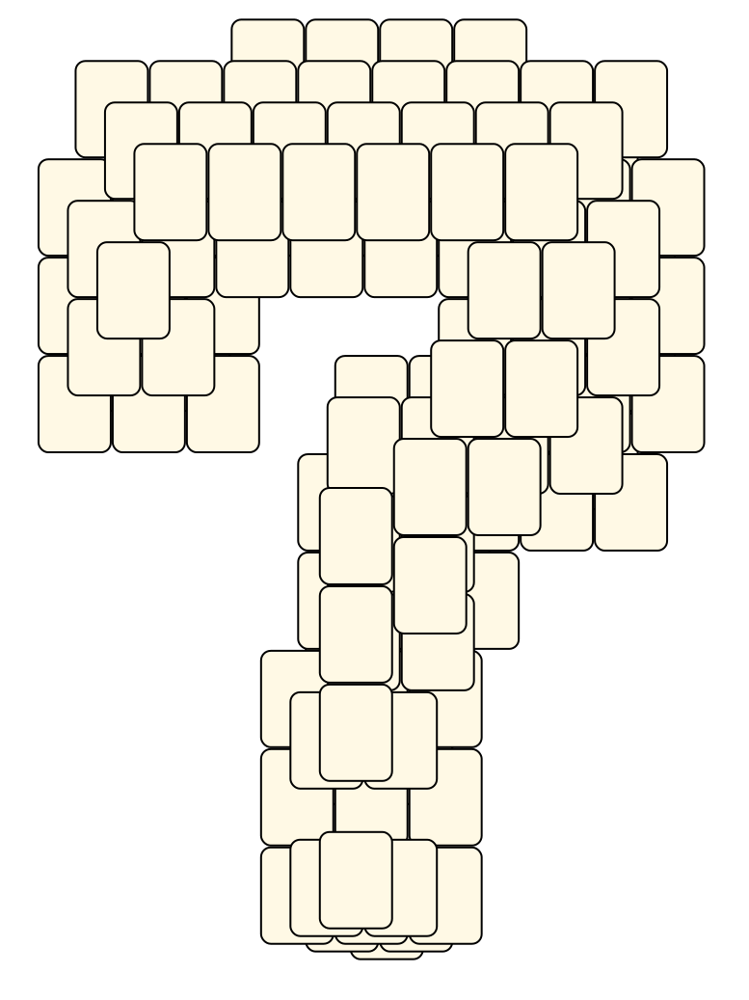
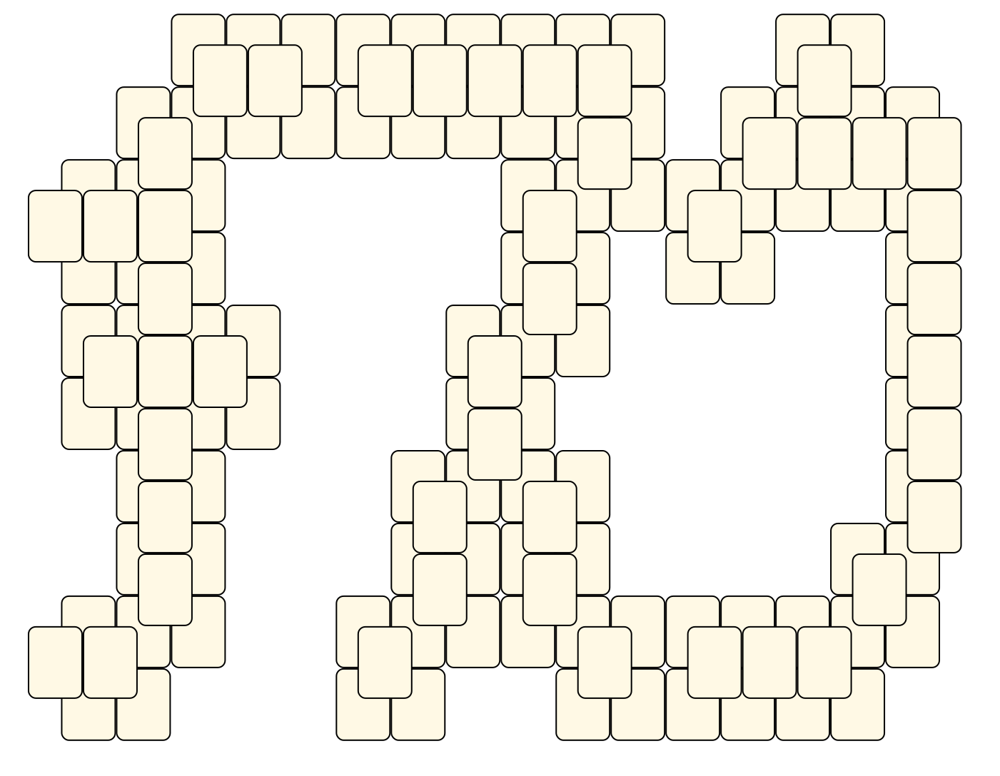

# Mahjong Solitaire Layout Museum: Script signs
* Source: [https://web.archive.org/web/20230204113220/http://tsubassa-kurenai.de/Kyodai/Layouts/](https://web.archive.org/web/20230204113220/http://tsubassa-kurenai.de/Kyodai/Layouts/)

* File Source:  
<sub>```https://web.archive.org/web/20230204113220/http://tsubassa-kurenai.de/Kyodai/Layouts/```</sub>


|Script signs||Layouts: 6|
|:--:|:--:|:--:|
|12345 Layout<br><br> <sub>Jens Rose</sub> <br>[.lay](./12345_layout.lay)  [.layout](./12345_layout.layout)  [.mah](./12345_layout.mah) |Atwinding<br><br> <sub>Tsubassa Kurenai</sub> <br>[.lay](./atwinding.lay)  [.layout](./atwinding.layout)  [.mah](./atwinding.mah) |Chibi<br><br> <sub>Tsubassa Kurenai</sub> <br>[.lay](./chibi.lay)  [.layout](./chibi.layout)  [.mah](./chibi.mah) |
|News<br><br> <sub>Tsubassa Kurenai</sub> <br>[.lay](./news.lay)  [.layout](./news.layout)  [.mah](./news.mah) |Question Mark<br><br> <sub>Tsubassa Kurenai</sub> <br>[.lay](./question_mark.lay)  [.layout](./question_mark.layout)  [.mah](./question_mark.mah) |Tsuku<br><br> <sub>Tsubassa Kurenai</sub> <br>[.lay](./tsuku.lay)  [.layout](./tsuku.layout)  [.mah](./tsuku.mah) |