# Mahjong Solitaire Layout Museum: Chinese Zodiac
* Source: [https://web.archive.org/web/20230204113220/http://tsubassa-kurenai.de/Kyodai/Layouts/](https://web.archive.org/web/20230204113220/http://tsubassa-kurenai.de/Kyodai/Layouts/)

* File Source:  
<sub>```https://web.archive.org/web/20230204113220/http://tsubassa-kurenai.de/Kyodai/Layouts/```</sub>


|Chinese Zodiac||Layouts: 12|
|:--:|:--:|:--:|
|Ape<br>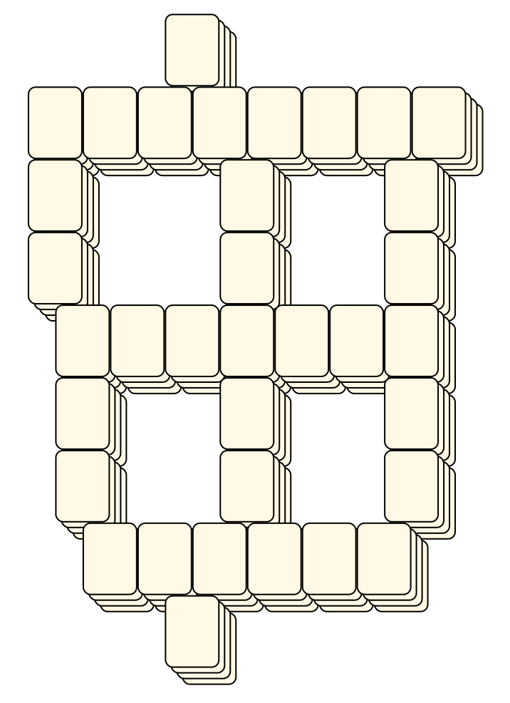<br> <sub>Tsubassa Kurenai</sub> <br>[.lay](./ape.lay)  [.layout](./ape.layout)  [.mah](./ape.mah) |Cat<br>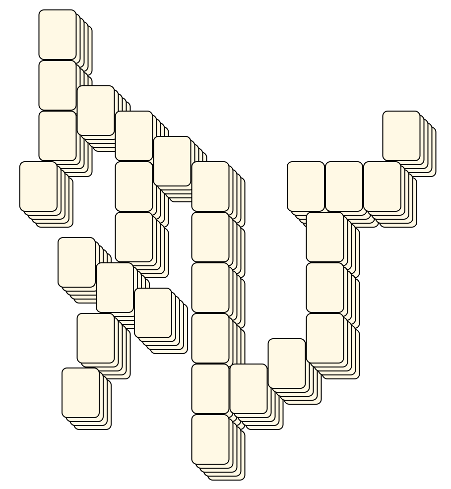<br> <sub>Tsubassa Kurenai</sub> <br>[.lay](./cat.lay)  [.layout](./cat.layout)  [.mah](./cat.mah) |Cock<br>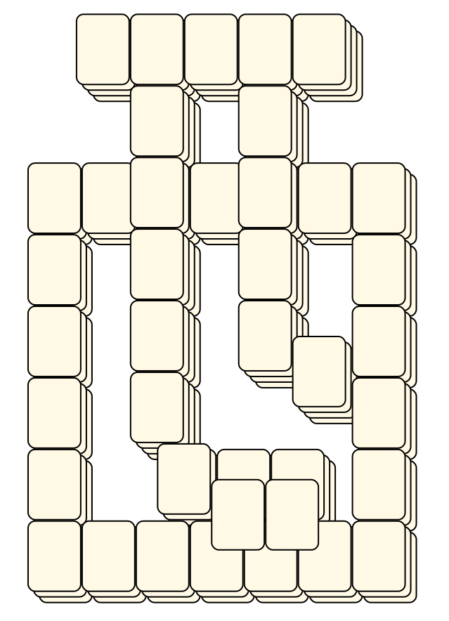<br> <sub>Tsubassa Kurenai</sub> <br>[.lay](./cock.lay)  [.layout](./cock.layout)  [.mah](./cock.mah) |
|Dog<br>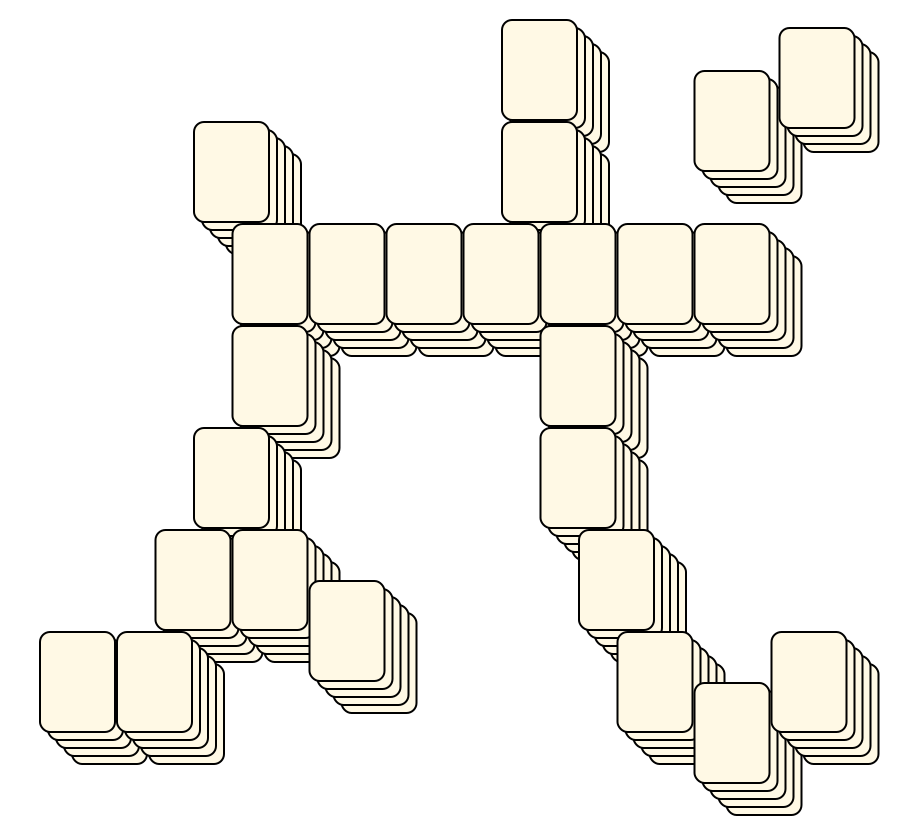<br> <sub>Tsubassa Kurenai</sub> <br>[.lay](./dog.lay)  [.layout](./dog.layout)  [.mah](./dog.mah) |Dragon<br>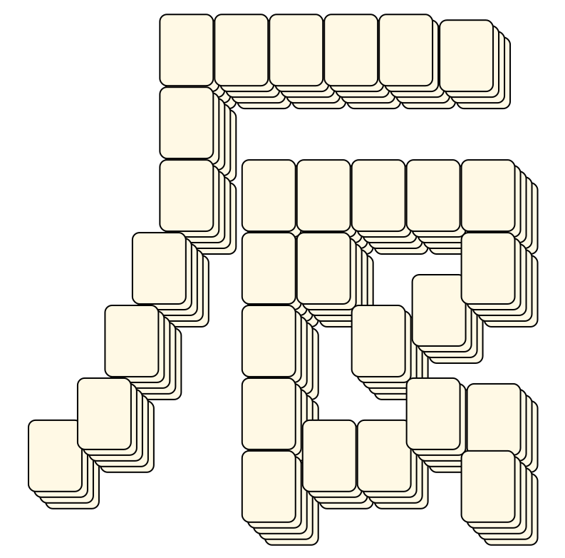<br> <sub>Tsubassa Kurenai</sub> <br>[.lay](./dragon.lay)  [.layout](./dragon.layout)  [.mah](./dragon.mah) |Horse<br>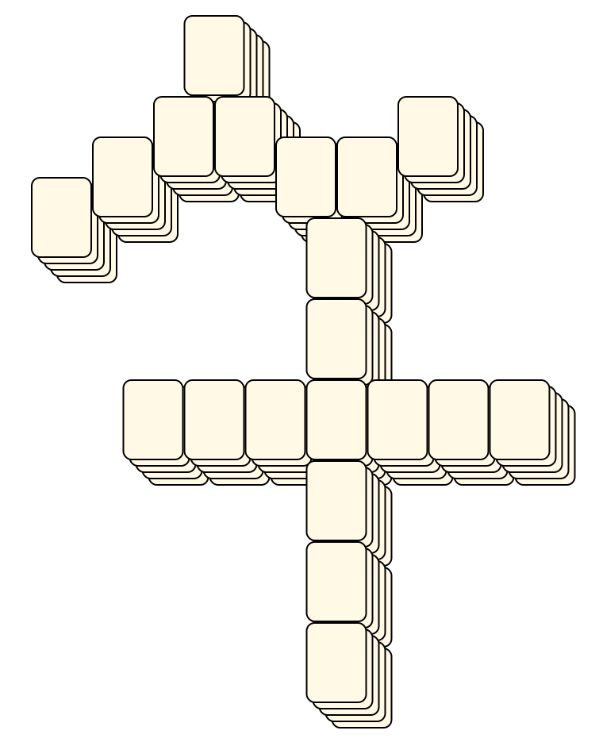<br> <sub>Tsubassa Kurenai</sub> <br>[.lay](./horse.lay)  [.layout](./horse.layout)  [.mah](./horse.mah) |
|Ox<br>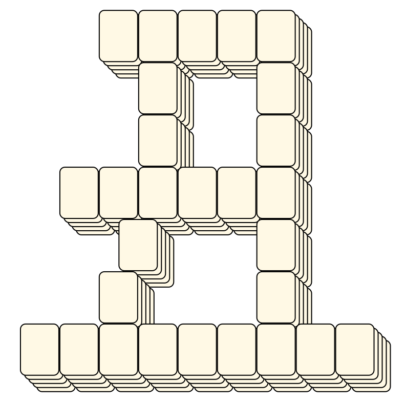<br> <sub>Tsubassa Kurenai</sub> <br>[.lay](./ox.lay)  [.layout](./ox.layout)  [.mah](./ox.mah) |Rat<br>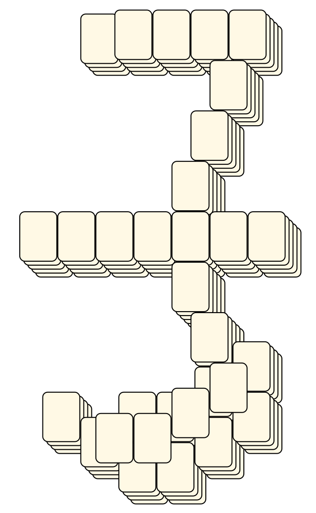<br> <sub>Tsubassa Kurenai</sub> <br>[.lay](./rat.lay)  [.layout](./rat.layout)  [.mah](./rat.mah) |Sheep<br>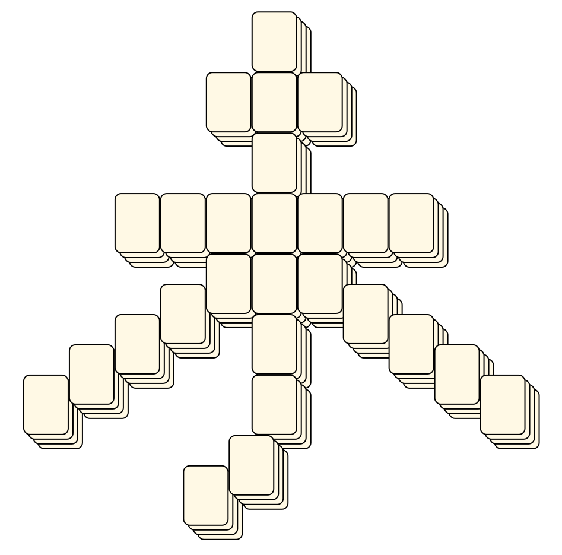<br> <sub>Tsubassa Kurenai</sub> <br>[.lay](./sheep.lay)  [.layout](./sheep.layout)  [.mah](./sheep.mah) |
|Snake<br>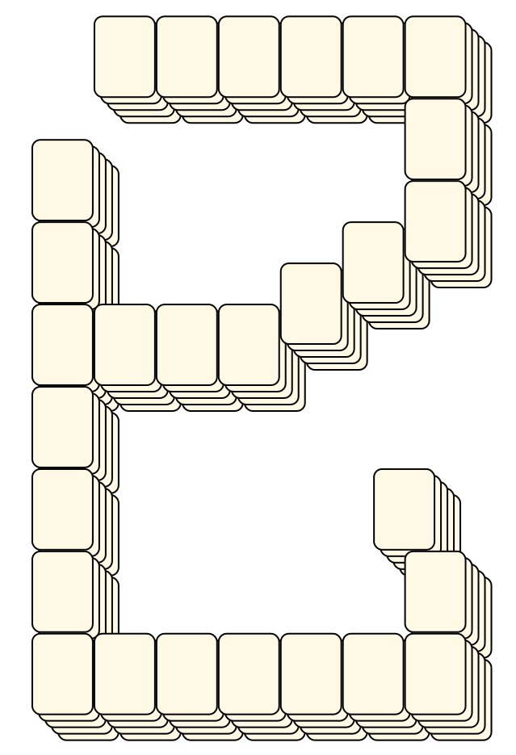<br> <sub>Tsubassa Kurenai</sub> <br>[.lay](./snake.lay)  [.layout](./snake.layout)  [.mah](./snake.mah) |Swine<br>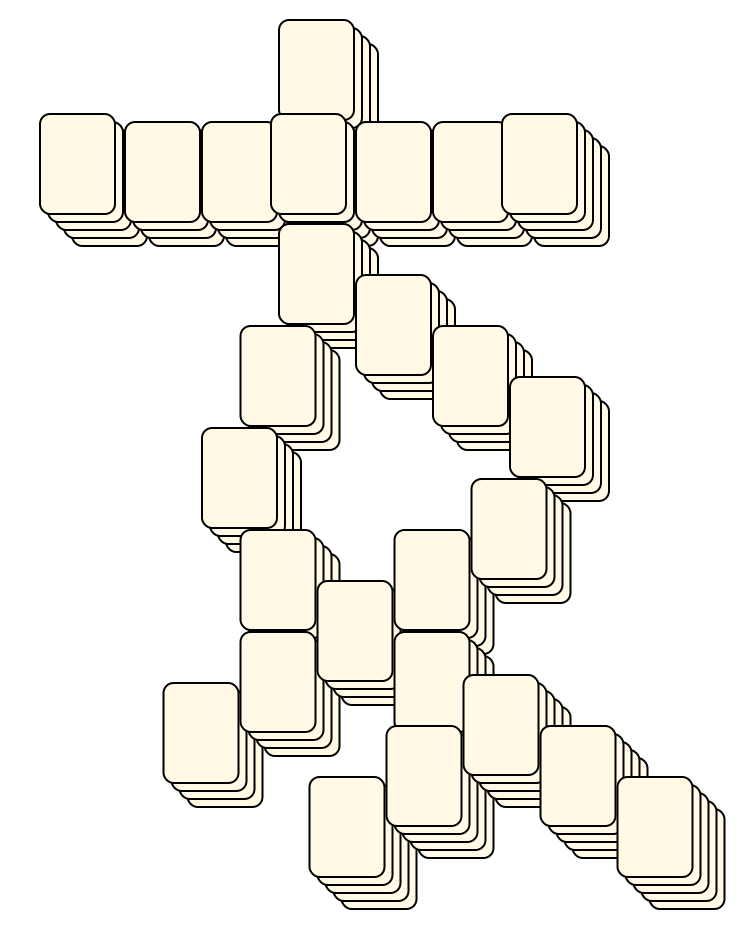<br> <sub>Tsubassa Kurenai</sub> <br>[.lay](./swine.lay)  [.layout](./swine.layout)  [.mah](./swine.mah) |Tiger<br>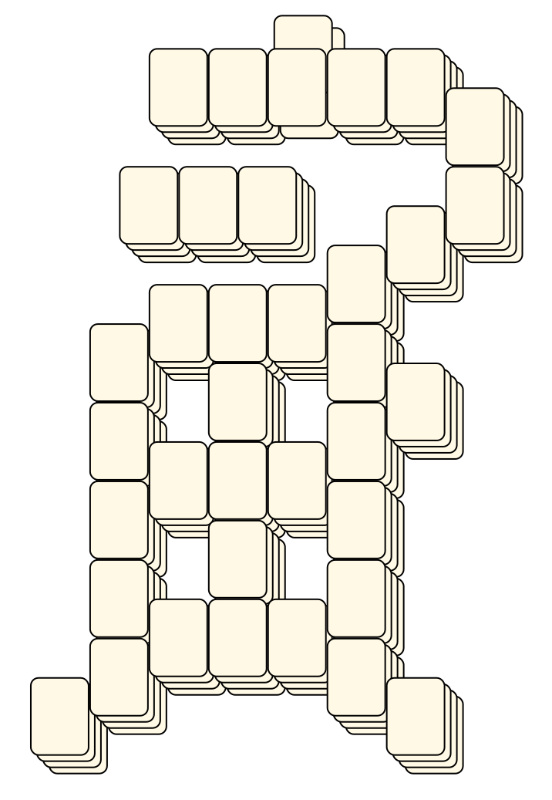<br> <sub>Tsubassa Kurenai</sub> <br>[.lay](./tiger.lay)  [.layout](./tiger.layout)  [.mah](./tiger.mah) |