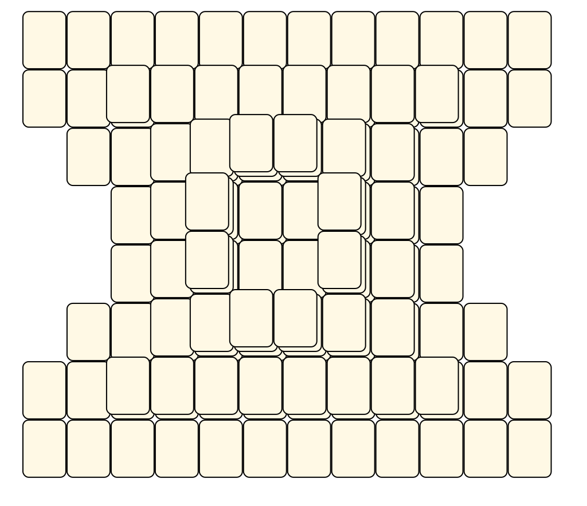
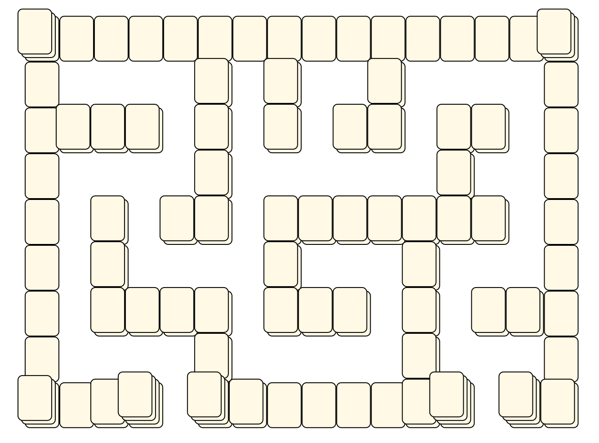
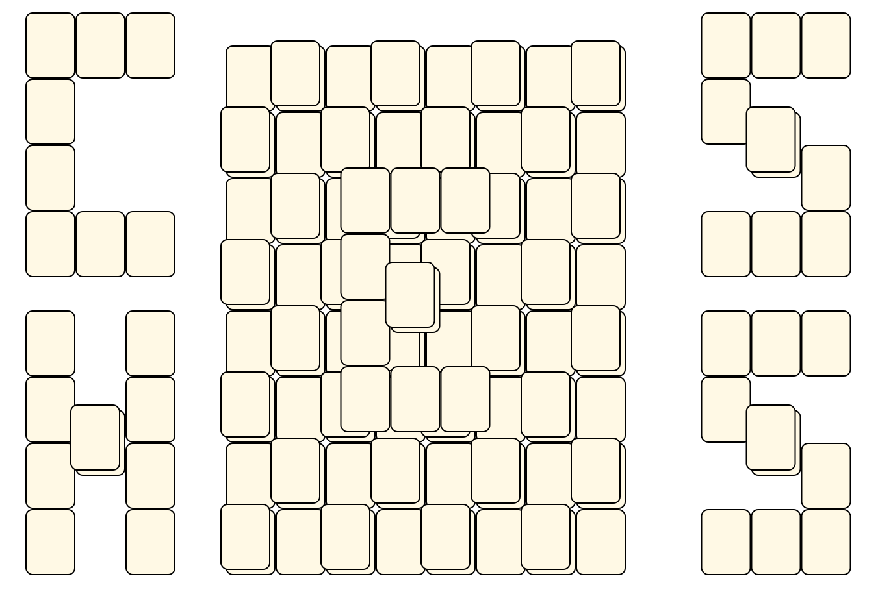
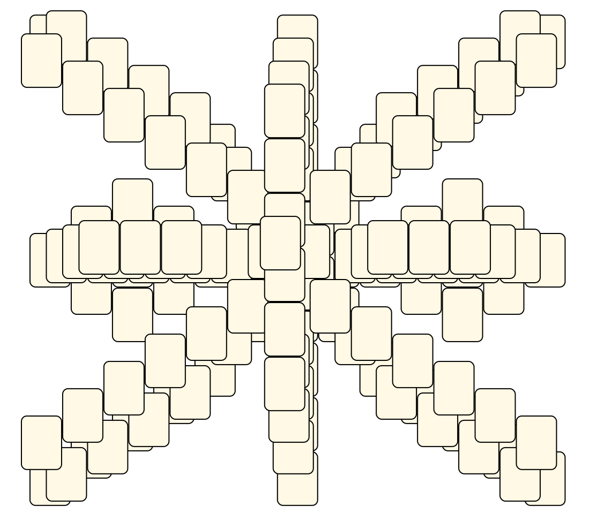
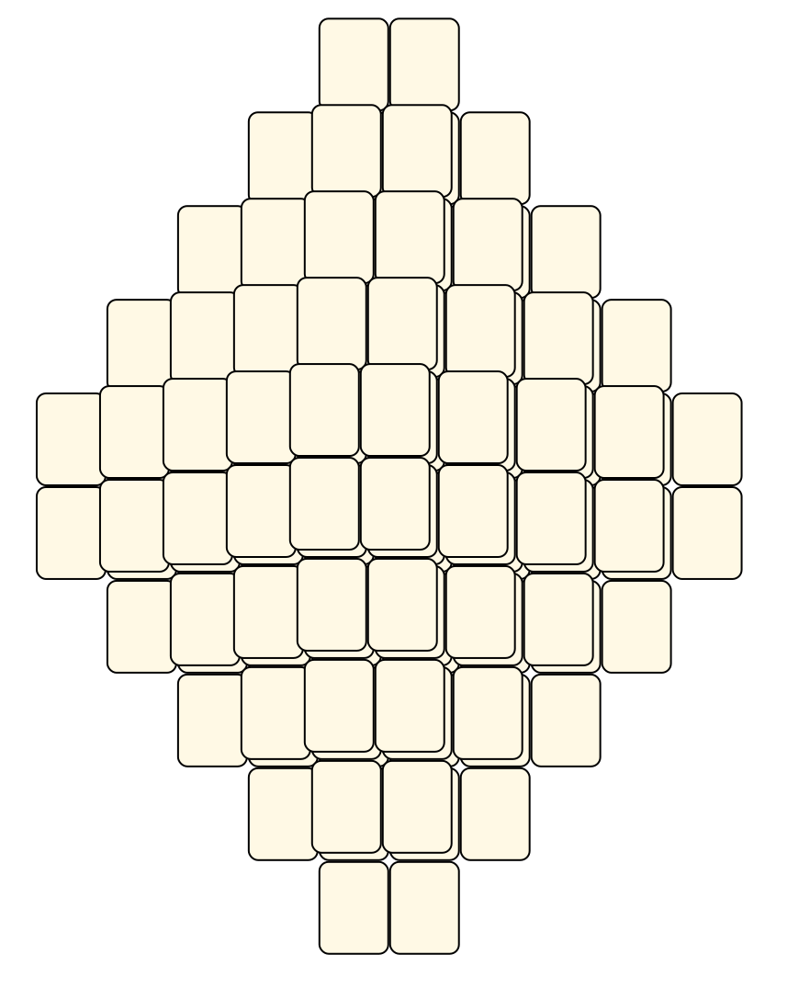
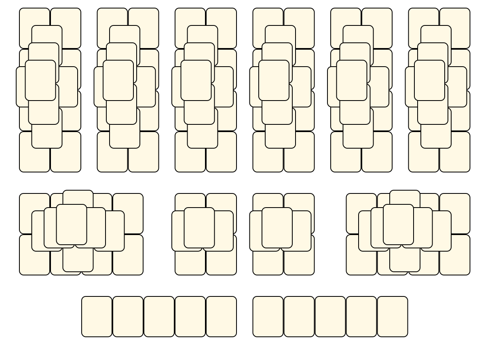
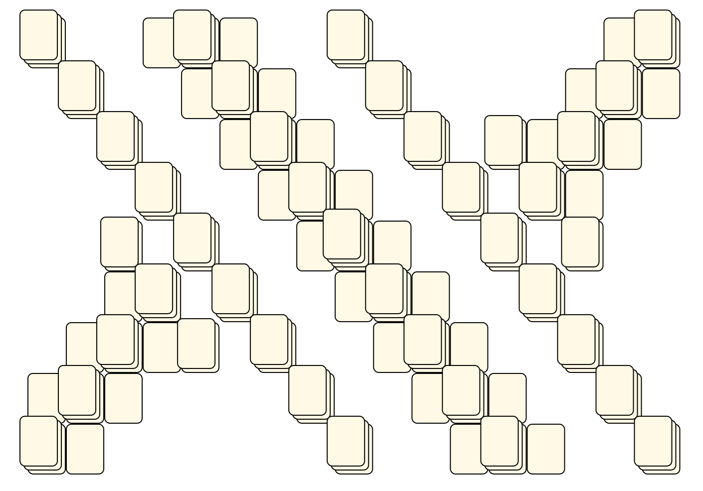
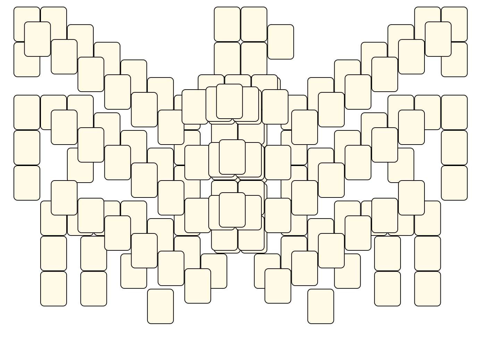
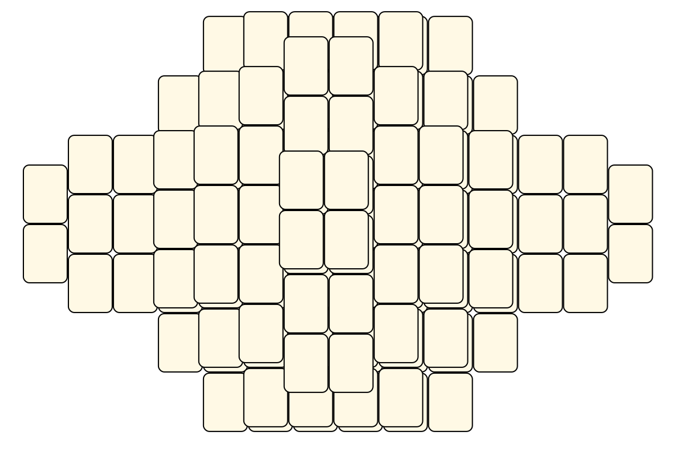
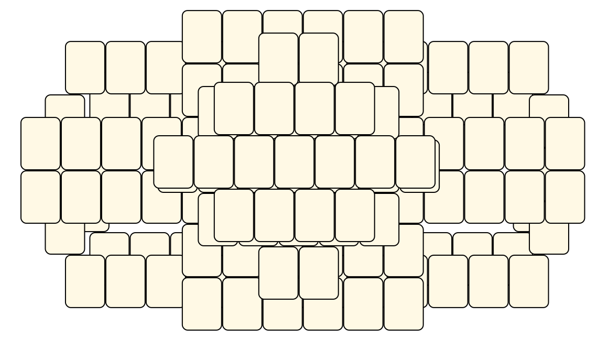

# Mahjong Solitaire Layout Museum: Kyodai Extras
* Source: [https://web.archive.org/web/20231204163740/https://cynagames.com/kyoextra.html](https://web.archive.org/web/20231204163740/https://cynagames.com/kyoextra.html)

* File Source:  
<sub>```https://web.archive.org/web/20051025011040/http://files.cyna.net/layouts.zip```</sub>


|Kyodai Extras||Layouts: 134|
|:--:|:--:|:--:|
|A Pyramid, THAT?!<br><br> <sub>Naoki Haga</sub> <br>[.lay](./a_pyramid_that_2.lay)  [.layout](./a_pyramid_that_2.layout)  [.mah](./a_pyramid_that_2.mah) |Amaze<br><br> <sub>Kyodai</sub> <br>[.lay](./amaze_2.lay)  [.layout](./amaze_2.layout)  [.mah](./amaze_2.mah) |Another Round<br><br> <sub>Naoki Haga</sub> <br>[.lay](./another_round_2.lay)  [.layout](./another_round_2.layout)  [.mah](./another_round_2.mah) |
|Aqabs Layout<br><br> <sub>Kyodai</sub> <br>[.lay](./aqabs_layout_2.lay)  [.layout](./aqabs_layout_2.layout)  [.mah](./aqabs_layout_2.mah) |Arena<br><br> <sub>Naoki Haga</sub> <br>[.lay](./arena_4.lay)  [.layout](./arena_4.layout)  [.mah](./arena_4.mah) |Art Moderne<br><br> <sub>Naoki Haga</sub> <br>[.lay](./art_moderne_2.lay)  [.layout](./art_moderne_2.layout)  [.mah](./art_moderne_2.mah) |
|Beatle<br><br> <sub>Naoki Haga</sub> <br>[.lay](./beatle_2.lay)  [.layout](./beatle_2.layout)  [.mah](./beatle_2.mah) |Big Hole<br><br> <sub>Naoki Haga</sub> <br>[.lay](./big_hole_3.lay)  [.layout](./big_hole_3.layout)  [.mah](./big_hole_3.mah) |Big Mountain<br><br> <sub>Alexis Bonvin</sub> <br>[.lay](./big_mountain_2.lay)  [.layout](./big_mountain_2.layout)  [.mah](./big_mountain_2.mah) |
|Bizarre<br><br> <sub>Alexis Bonvin</sub> <br>[.lay](./bizarre_2.lay)  [.layout](./bizarre_2.layout)  [.mah](./bizarre_2.mah) |Boat<br><br> <sub>Alexis Bonvin</sub> <br>[.lay](./boat_2.lay)  [.layout](./boat_2.layout)  [.mah](./boat_2.mah) |Bridge<br><br> <sub>Fude</sub> <br>[.lay](./bridge_3.lay)  [.layout](./bridge_3.layout)  [.mah](./bridge_3.mah) |
|Butterfly<br><br> <sub>Kyodai</sub> <br>[.lay](./butterfly_4.lay)  [.layout](./butterfly_4.layout)  [.mah](./butterfly_4.mah) |Castle<br><br> <sub>Alexis Bonvin</sub> <br>[.lay](./castle_4.lay)  [.layout](./castle_4.layout)  [.mah](./castle_4.mah) |Cat And Mouse<br><br> <sub>Kyodai</sub> <br>[.lay](./cat_and_mouse_2.lay)  [.layout](./cat_and_mouse_2.layout)  [.mah](./cat_and_mouse_2.mah) |
|Ceremonial<br><br> <sub>Naoki Haga</sub> <br>[.lay](./ceremonial_2.lay)  [.layout](./ceremonial_2.layout)  [.mah](./ceremonial_2.mah) |ChessMania<br><br> <sub>Alexis Bonvin</sub> <br>[.lay](./chessmania_2.lay)  [.layout](./chessmania_2.layout)  [.mah](./chessmania_2.mah) |Cross<br><br> <sub>MinderTech</sub> <br>[.lay](./cross_8.lay)  [.layout](./cross_8.layout)  [.mah](./cross_8.mah) |
|Crown<br><br> <sub>Naoki Haga</sub> <br>[.lay](./crown_3.lay)  [.layout](./crown_3.layout)  [.mah](./crown_3.mah) |Cupidos Heart<br><br> <sub>Alexis Bonvin</sub> <br>[.lay](./cupidos_heart_2.lay)  [.layout](./cupidos_heart_2.layout)  [.mah](./cupidos_heart_2.mah) |Cupola<br><br> <sub>Kyodai</sub> <br>[.lay](./cupola_2.lay)  [.layout](./cupola_2.layout)  [.mah](./cupola_2.mah) |
|Deceptive<br><br> <sub>Leonard Enos</sub> <br>[.lay](./deceptive_2.lay)  [.layout](./deceptive_2.layout)  [.mah](./deceptive_2.mah) |Deep Well<br><br> <sub>Naoki Haga</sub> <br>[.lay](./deep_well_2.lay)  [.layout](./deep_well_2.layout)  [.mah](./deep_well_2.mah) |Diamond<br><br> <sub>Alexis Bonvin</sub> <br>[.lay](./diamond_2.lay)  [.layout](./diamond_2.layout)  [.mah](./diamond_2.mah) |
|Dude<br><br> <sub>Bolli</sub> <br>[.lay](./dude_2.lay)  [.layout](./dude_2.layout)  [.mah](./dude_2.mah) |Empty Pyramids<br><br> <sub>Alexis Bonvin</sub> <br>[.lay](./empty_pyramids_2.lay)  [.layout](./empty_pyramids_2.layout)  [.mah](./empty_pyramids_2.mah) |Farandole<br><br> <sub>Naoki Haga</sub> <br>[.lay](./farandole_2.lay)  [.layout](./farandole_2.layout)  [.mah](./farandole_2.mah) |
|Find Two Hided Words<br><br> <sub>Alexis Bonvin</sub> <br>[.lay](./find_two_hided_words_2.lay)  [.layout](./find_two_hided_words_2.layout)  [.mah](./find_two_hided_words_2.mah) |Fish<br><br> <sub>Alexis Bonvin</sub> <br>[.lay](./fish_2.lay)  [.layout](./fish_2.layout)  [.mah](./fish_2.mah) |Fish Face<br><br> <sub>Kyodai</sub> <br>[.lay](./fish_face_2.lay)  [.layout](./fish_face_2.layout)  [.mah](./fish_face_2.mah) |
|Five Pyramids<br><br> <sub>Alexis Bonvin</sub> <br>[.lay](./five_pyramids_3.lay)  [.layout](./five_pyramids_3.layout)  [.mah](./five_pyramids_3.mah) |Five Pyramids 2<br><br> <sub>Alexis Bonvin</sub> <br>[.lay](./five_pyramids_2_2.lay)  [.layout](./five_pyramids_2_2.layout)  [.mah](./five_pyramids_2_2.mah) |Floating City<br><br> <sub>Will O'Connell</sub> <br>[.lay](./floating_city_3.lay)  [.layout](./floating_city_3.layout)  [.mah](./floating_city_3.mah) |
|Flowers<br><br> <sub>Bolli</sub> <br>[.lay](./flowers_4.lay)  [.layout](./flowers_4.layout)  [.mah](./flowers_4.mah) |Full Vision<br><br> <sub>John Payson</sub> <br>[.lay](./full_vision_4.lay)  [.layout](./full_vision_4.layout)  [.mah](./full_vision_4.mah) |Full Vision 2<br><br> <sub>John Payson</sub> <br>[.lay](./full_vision_2_2.lay)  [.layout](./full_vision_2_2.layout)  [.mah](./full_vision_2_2.mah) |
|Full Vision 3<br><br> <sub>Alexis Bonvin</sub> <br>[.lay](./full_vision_3_2.lay)  [.layout](./full_vision_3_2.layout)  [.mah](./full_vision_3_2.mah) |H For Haga<br><br> <sub>Alexis Bonvin</sub> <br>[.lay](./h_for_haga_2.lay)  [.layout](./h_for_haga_2.layout)  [.mah](./h_for_haga_2.mah) |Hourglass<br><br> <sub>Vincent Krebs</sub> <br>[.lay](./hourglass_3.lay)  [.layout](./hourglass_3.layout)  [.mah](./hourglass_3.mah) |
|Hovercraft<br><br> <sub>Vincent Krebs</sub> <br>[.lay](./hovercraft_2.lay)  [.layout](./hovercraft_2.layout)  [.mah](./hovercraft_2.mah) |Hurdles<br><br> <sub>Leonard Enos</sub> <br>[.lay](./hurdles_2.lay)  [.layout](./hurdles_2.layout)  [.mah](./hurdles_2.mah) |Hurricane<br><br> <sub>Douglas Ulyate</sub> <br>[.lay](./hurricane_2.lay)  [.layout](./hurricane_2.layout)  [.mah](./hurricane_2.mah) |
|ILOVEU<br><br> <sub>Lynnette Layton</sub> <br>[.lay](./iloveu_2.lay)  [.layout](./iloveu_2.layout)  [.mah](./iloveu_2.mah) |Impossible Mission<br><br> <sub>Alexis Bonvin</sub> <br>[.lay](./impossible_mission_2.lay)  [.layout](./impossible_mission_2.layout)  [.mah](./impossible_mission_2.mah) |Inazuma<br><br> <sub>Lynnette Layton</sub> <br>[.lay](./inazuma_2.lay)  [.layout](./inazuma_2.layout)  [.mah](./inazuma_2.mah) |
|Inca<br><br> <sub>Bolli</sub> <br>[.lay](./inca_2.lay)  [.layout](./inca_2.layout)  [.mah](./inca_2.mah) |Japan<br><br> <sub>Naoki Haga</sub> <br>[.lay](./japan_2.lay)  [.layout](./japan_2.layout)  [.mah](./japan_2.mah) |Joker<br><br> <sub>Naoki Haga</sub> <br>[.lay](./joker_2.lay)  [.layout](./joker_2.layout)  [.mah](./joker_2.mah) |
|Jon Praters Layout<br><br> <sub>Jon Prater</sub> <br>[.lay](./jon_praters_layout_2.lay)  [.layout](./jon_praters_layout_2.layout)  [.mah](./jon_praters_layout_2.mah) |K For Kyodai<br><br> <sub>Alexis Bonvin</sub> <br>[.lay](./k_for_kyodai_2.lay)  [.layout](./k_for_kyodai_2.layout)  [.mah](./k_for_kyodai_2.mah) |Krebs<br><br> <sub>Kyodai</sub> <br>[.lay](./krebs_2.lay)  [.layout](./krebs_2.layout)  [.mah](./krebs_2.mah) |
|Kujaku (Peacock)<br><br> <sub>Naoki Haga</sub> <br>[.lay](./kujaku_(peacock)_2.lay)  [.layout](./kujaku_(peacock)_2.layout)  [.mah](./kujaku_(peacock)_2.mah) |Kumo<br><br> <sub>Lynnette Layton</sub> <br>[.lay](./kumo_2.lay)  [.layout](./kumo_2.layout)  [.mah](./kumo_2.mah) |Kyodai N14<br><br> <sub>Kyodai</sub> <br>[.lay](./kyodai_n14_2.lay)  [.layout](./kyodai_n14_2.layout)  [.mah](./kyodai_n14_2.mah) |
|Kyodai N17<br><br> <sub>Kyodai</sub> <br>[.lay](./kyodai_n17_2.lay)  [.layout](./kyodai_n17_2.layout)  [.mah](./kyodai_n17_2.mah) |Kyodai N18<br><br> <sub>Kyodai</sub> <br>[.lay](./kyodai_n18_2.lay)  [.layout](./kyodai_n18_2.layout)  [.mah](./kyodai_n18_2.mah) |Kyodai N20<br><br> <sub>Kyodai</sub> <br>[.lay](./kyodai_n20_2.lay)  [.layout](./kyodai_n20_2.layout)  [.mah](./kyodai_n20_2.mah) |
|Kyodai N23<br><br> <sub>Kyodai</sub> <br>[.lay](./kyodai_n23_2.lay)  [.layout](./kyodai_n23_2.layout)  [.mah](./kyodai_n23_2.mah) |Kyodai N24<br><br> <sub>Kyodai</sub> <br>[.lay](./kyodai_n24_2.lay)  [.layout](./kyodai_n24_2.layout)  [.mah](./kyodai_n24_2.mah) |Kyodai N25<br><br> <sub>Kyodai</sub> <br>[.lay](./kyodai_n25_2.lay)  [.layout](./kyodai_n25_2.layout)  [.mah](./kyodai_n25_2.mah) |
|Kyodai N26<br><br> <sub>Kyodai</sub> <br>[.lay](./kyodai_n26_3.lay)  [.layout](./kyodai_n26_3.layout)  [.mah](./kyodai_n26_3.mah) |Kyodai N27<br><br> <sub>Kyodai</sub> <br>[.lay](./kyodai_n27_2.lay)  [.layout](./kyodai_n27_2.layout)  [.mah](./kyodai_n27_2.mah) |Kyodai N28<br><br> <sub>Kyodai</sub> <br>[.lay](./kyodai_n28_2.lay)  [.layout](./kyodai_n28_2.layout)  [.mah](./kyodai_n28_2.mah) |
|Kyodai N41<br><br> <sub>Kyodai</sub> <br>[.lay](./kyodai_n41_2.lay)  [.layout](./kyodai_n41_2.layout)  [.mah](./kyodai_n41_2.mah) |Kyodai N42<br><br> <sub>Kyodai</sub> <br>[.lay](./kyodai_n42_2.lay)  [.layout](./kyodai_n42_2.layout)  [.mah](./kyodai_n42_2.mah) |Lattice<br><br> <sub>Alvin Helms</sub> <br>[.lay](./lattice_2.lay)  [.layout](./lattice_2.layout)  [.mah](./lattice_2.mah) |
|Leo<br><br> <sub>Lynnette Layton</sub> <br>[.lay](./leo_3.lay)  [.layout](./leo_3.layout)  [.mah](./leo_3.mah) |Lion<br><br> <sub>Lynnette Layton</sub> <br>[.lay](./lion_2.lay)  [.layout](./lion_2.layout)  [.mah](./lion_2.mah) |Lost In The Layout...<br><br> <sub>Naoki Haga</sub> <br>[.lay](./lost_in_the_layout_2.lay)  [.layout](./lost_in_the_layout_2.layout)  [.mah](./lost_in_the_layout_2.mah) |
|Mini Traditional<br><br> <sub>Naoki Haga</sub> <br>[.lay](./mini_traditional_2.lay)  [.layout](./mini_traditional_2.layout)  [.mah](./mini_traditional_2.mah) |Mini-Layout<br><br> <sub>Kyodai</sub> <br>[.lay](./mini-layout_2.lay)  [.layout](./mini-layout_2.layout)  [.mah](./mini-layout_2.mah) |N For Namida<br><br> <sub>Naoki Haga</sub> <br>[.lay](./n_for_namida_2.lay)  [.layout](./n_for_namida_2.layout)  [.mah](./n_for_namida_2.mah) |
|Okies Nitemare<br><br> <sub>Kyodai</sub> <br>[.lay](./okies_nitemare_2.lay)  [.layout](./okies_nitemare_2.layout)  [.mah](./okies_nitemare_2.mah) |Old Dragon<br><br> <sub>Kyodai</sub> <br>[.lay](./old_dragon_2.lay)  [.layout](./old_dragon_2.layout)  [.mah](./old_dragon_2.mah) |Orbital<br><br> <sub>Naoki Haga</sub> <br>[.lay](./orbital_2.lay)  [.layout](./orbital_2.layout)  [.mah](./orbital_2.mah) |
|Pantheon<br><br> <sub>Alexis Bonvin</sub> <br>[.lay](./pantheon_2.lay)  [.layout](./pantheon_2.layout)  [.mah](./pantheon_2.mah) |Papillon<br><br> <sub>Vincent Krebs</sub> <br>[.lay](./papillon_2.lay)  [.layout](./papillon_2.layout)  [.mah](./papillon_2.mah) |Phoenix<br><br> <sub>Kyodai</sub> <br>[.lay](./phoenix_3.lay)  [.layout](./phoenix_3.layout)  [.mah](./phoenix_3.mah) |
|Portal<br><br> <sub>Leonard Enos</sub> <br>[.lay](./portal_2.lay)  [.layout](./portal_2.layout)  [.mah](./portal_2.mah) |Pyramid 1<br><br> <sub>MinderTech</sub> <br>[.lay](./pyramid_1_2.lay)  [.layout](./pyramid_1_2.layout)  [.mah](./pyramid_1_2.mah) |Pyramid 2<br><br> <sub>MinderTech</sub> <br>[.lay](./pyramid_2_4.lay)  [.layout](./pyramid_2_4.layout)  [.mah](./pyramid_2_4.mah) |
|Quad<br><br> <sub>MinderTech</sub> <br>[.lay](./quad_2.lay)  [.layout](./quad_2.layout)  [.mah](./quad_2.mah) |Rectangle<br><br> <sub>MinderTech</sub> <br>[.lay](./rectangle_2.lay)  [.layout](./rectangle_2.layout)  [.mah](./rectangle_2.mah) |Reindeer<br><br> <sub>Kyodai</sub> <br>[.lay](./reindeer_2.lay)  [.layout](./reindeer_2.layout)  [.mah](./reindeer_2.mah) |
|Rings<br><br> <sub>Bolli</sub> <br>[.lay](./rings_2.lay)  [.layout](./rings_2.layout)  [.mah](./rings_2.mah) |River Bridge<br><br> <sub>Naoki Haga</sub> <br>[.lay](./river_bridge_2.lay)  [.layout](./river_bridge_2.layout)  [.mah](./river_bridge_2.mah) |Roman Arena<br><br> <sub>Alexis Bonvin</sub> <br>[.lay](./roman_arena_2.lay)  [.layout](./roman_arena_2.layout)  [.mah](./roman_arena_2.mah) |
|Rugby<br><br> <sub>MinderTech</sub> <br>[.lay](./rugby_2.lay)  [.layout](./rugby_2.layout)  [.mah](./rugby_2.mah) |Screw Up<br><br> <sub>Naoki Haga</sub> <br>[.lay](./screw_up_2.lay)  [.layout](./screw_up_2.layout)  [.mah](./screw_up_2.mah) |Seven<br><br> <sub>Bolli</sub> <br>[.lay](./seven_2.lay)  [.layout](./seven_2.layout)  [.mah](./seven_2.mah) |
|Seven Pyramids<br><br> <sub>Alexis Bonvin</sub> <br>[.lay](./seven_pyramids_2.lay)  [.layout](./seven_pyramids_2.layout)  [.mah](./seven_pyramids_2.mah) |Shapeshifter<br><br> <sub>Leonard Enos</sub> <br>[.lay](./shapeshifter_2.lay)  [.layout](./shapeshifter_2.layout)  [.mah](./shapeshifter_2.mah) |Siam<br><br> <sub>Naoki Haga</sub> <br>[.lay](./siam_2.lay)  [.layout](./siam_2.layout)  [.mah](./siam_2.mah) |
|Space Ship<br><br> <sub>Kyodai</sub> <br>[.lay](./space_ship_2.lay)  [.layout](./space_ship_2.layout)  [.mah](./space_ship_2.mah) |Space Shuttle<br><br> <sub>MinderTech</sub> <br>[.lay](./space_shuttle_2.lay)  [.layout](./space_shuttle_2.layout)  [.mah](./space_shuttle_2.mah) |Square<br><br> <sub>MinderTech</sub> <br>[.lay](./square.lay)  [.layout](./square.layout)  [.mah](./square.mah) |
|Stage 1<br><br> <sub>MinderTech</sub> <br>[.lay](./stage_1_2.lay)  [.layout](./stage_1_2.layout)  [.mah](./stage_1_2.mah) |Stage 2<br><br> <sub>MinderTech</sub> <br>[.lay](./stage_2_2.lay)  [.layout](./stage_2_2.layout)  [.mah](./stage_2_2.mah) |Stairs<br><br> <sub>MinderTech</sub> <br>[.lay](./stairs_6.lay)  [.layout](./stairs_6.layout)  [.mah](./stairs_6.mah) |
|Stairs<br><br> <sub>Alexis Bonvin</sub> <br>[.lay](./stairs_7.lay)  [.layout](./stairs_7.layout)  [.mah](./stairs_7.mah) |Stargate<br><br> <sub>Leonard Enos</sub> <br>[.lay](./stargate_2.lay)  [.layout](./stargate_2.layout)  [.mah](./stargate_2.mah) |Step Pyramid<br><br> <sub>Christian Pedersen</sub> <br>[.lay](./step_pyramid_2.lay)  [.layout](./step_pyramid_2.layout)  [.mah](./step_pyramid_2.mah) |
|Stonehenge<br><br> <sub>Alexis Bonvin</sub> <br>[.lay](./stonehenge_2.lay)  [.layout](./stonehenge_2.layout)  [.mah](./stonehenge_2.mah) |Sukis<br><br> <sub>Kyodai</sub> <br>[.lay](./sukis_2.lay)  [.layout](./sukis_2.layout)  [.mah](./sukis_2.mah) |SunMoon<br><br> <sub>Lynnette Layton</sub> <br>[.lay](./sunmoon_2.lay)  [.layout](./sunmoon_2.layout)  [.mah](./sunmoon_2.mah) |
|Temple<br><br> <sub>Kyodai</sub> <br>[.lay](./temple_4.lay)  [.layout](./temple_4.layout)  [.mah](./temple_4.mah) |Temple 1<br><br> <sub>MinderTech</sub> <br>[.lay](./temple_1_2.lay)  [.layout](./temple_1_2.layout)  [.mah](./temple_1_2.mah) |Temple 2<br><br> <sub>MinderTech</sub> <br>[.lay](./temple_2_4.lay)  [.layout](./temple_2_4.layout)  [.mah](./temple_2_4.mah) |
|Teotihucan<br><br> <sub>Alexis Bonvin</sub> <br>[.lay](./teotihucan_2.lay)  [.layout](./teotihucan_2.layout)  [.mah](./teotihucan_2.mah) |The Great Wall<br><br> <sub>Kyodai</sub> <br>[.lay](./the_great_wall_2.lay)  [.layout](./the_great_wall_2.layout)  [.mah](./the_great_wall_2.mah) |The Owl<br><br> <sub>Duncan Mckenzie</sub> <br>[.lay](./the_owl_2.lay)  [.layout](./the_owl_2.layout)  [.mah](./the_owl_2.mah) |
|The SpaceBridge<br><br> <sub>Kyodai</sub> <br>[.lay](./the_spacebridge_2.lay)  [.layout](./the_spacebridge_2.layout)  [.mah](./the_spacebridge_2.mah) |Theater<br><br> <sub>Naoki Haga</sub> <br>[.lay](./theater_2.lay)  [.layout](./theater_2.layout)  [.mah](./theater_2.mah) |Tile Fighter<br><br> <sub>Naoki Haga</sub> <br>[.lay](./tile_fighter_2.lay)  [.layout](./tile_fighter_2.layout)  [.mah](./tile_fighter_2.mah) |
|Tilepiles<br><br> <sub>Naoki Haga</sub> <br>[.lay](./tilepiles_2.lay)  [.layout](./tilepiles_2.layout)  [.mah](./tilepiles_2.mah) |Totally Random-Made Layout<br><br> <sub>Alexis Bonvin</sub> <br>[.lay](./totally_random-made_layout_2.lay)  [.layout](./totally_random-made_layout_2.layout)  [.mah](./totally_random-made_layout_2.mah) |Tower And Walls<br><br> <sub>Alexis Bonvin</sub> <br>[.lay](./tower_and_walls_2.lay)  [.layout](./tower_and_walls_2.layout)  [.mah](./tower_and_walls_2.mah) |
|Traditional<br><br> <sub>Brodie Lockard</sub> <br>[.lay](./traditional_2.lay)  [.layout](./traditional_2.layout)  [.mah](./traditional_2.mah) |Traditional Reviewed<br><br> <sub>Alexis Bonvin</sub> <br>[.lay](./traditional_reviewed_2.lay)  [.layout](./traditional_reviewed_2.layout)  [.mah](./traditional_reviewed_2.mah) |Tree Of Life<br><br> <sub>Douglas Ulyate</sub> <br>[.lay](./tree_of_life_2.lay)  [.layout](./tree_of_life_2.layout)  [.mah](./tree_of_life_2.mah) |
|Trika<br><br> <sub>Leonard Enos</sub> <br>[.lay](./trika_2.lay)  [.layout](./trika_2.layout)  [.mah](./trika_2.mah) |Twin<br><br> <sub>MinderTech</sub> <br>[.lay](./twin_2.lay)  [.layout](./twin_2.layout)  [.mah](./twin_2.mah) |Two Domes<br><br> <sub>Alexis Bonvin</sub> <br>[.lay](./two_domes_2.lay)  [.layout](./two_domes_2.layout)  [.mah](./two_domes_2.mah) |
|Vagues<br><br> <sub>Alexis Bonvin</sub> <br>[.lay](./vagues_2.lay)  [.layout](./vagues_2.layout)  [.mah](./vagues_2.mah) |Variation On Deep Well<br><br> <sub>Kyodai</sub> <br>[.lay](./variation_on_deep_well_3.lay)  [.layout](./variation_on_deep_well_3.layout)  [.mah](./variation_on_deep_well_3.mah) |Variation On Deep Well<br><br> <sub>Kyodai</sub> <br>[.lay](./variation_on_deep_well_4.lay)  [.layout](./variation_on_deep_well_4.layout)  [.mah](./variation_on_deep_well_4.mah) |
|Victory Arrow<br><br> <sub>Naoki Haga</sub> <br>[.lay](./victory_arrow_2.lay)  [.layout](./victory_arrow_2.layout)  [.mah](./victory_arrow_2.mah) |Wavelets<br><br> <sub>Leonard Enos</sub> <br>[.lay](./wavelets_2.lay)  [.layout](./wavelets_2.layout)  [.mah](./wavelets_2.mah) |Whatever<br><br> <sub>Kyodai</sub> <br>[.lay](./whatever_2.lay)  [.layout](./whatever_2.layout)  [.mah](./whatever_2.mah) |
|Win<br><br> <sub>Wally</sub> <br>[.lay](./win_2.lay)  [.layout](./win_2.layout)  [.mah](./win_2.mah) |X-Files<br><br> <sub>Alexis Bonvin</sub> <br>[.lay](./x-files_3.lay)  [.layout](./x-files_3.layout)  [.mah](./x-files_3.mah) |X-Files<br><br> <sub>Kyodai</sub> <br>[.lay](./x-files_4.lay)  [.layout](./x-files_4.layout)  [.mah](./x-files_4.mah) |
|X-Shape<br><br> <sub>Alexis Bonvin</sub> <br>[.lay](./x-shape_2.lay)  [.layout](./x-shape_2.layout)  [.mah](./x-shape_2.mah) |Yummy<br><br> <sub>Naoki Haga</sub> <br>[.lay](./yummy_2.lay)  [.layout](./yummy_2.layout)  [.mah](./yummy_2.mah) ||