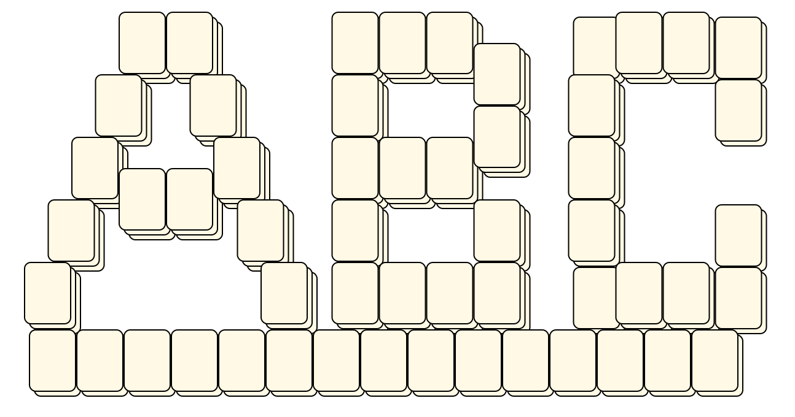
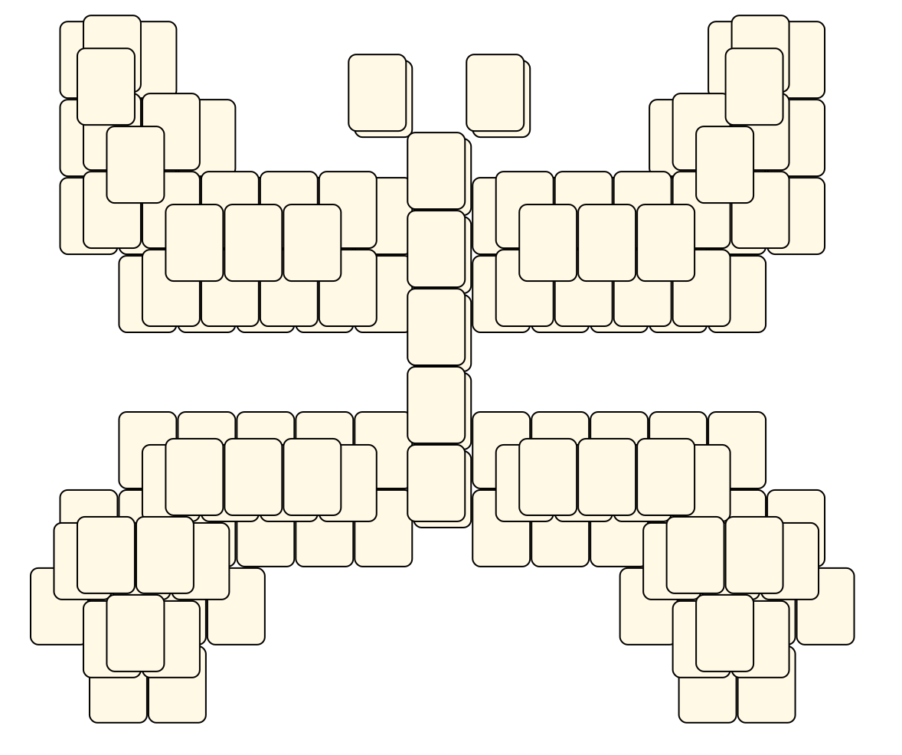
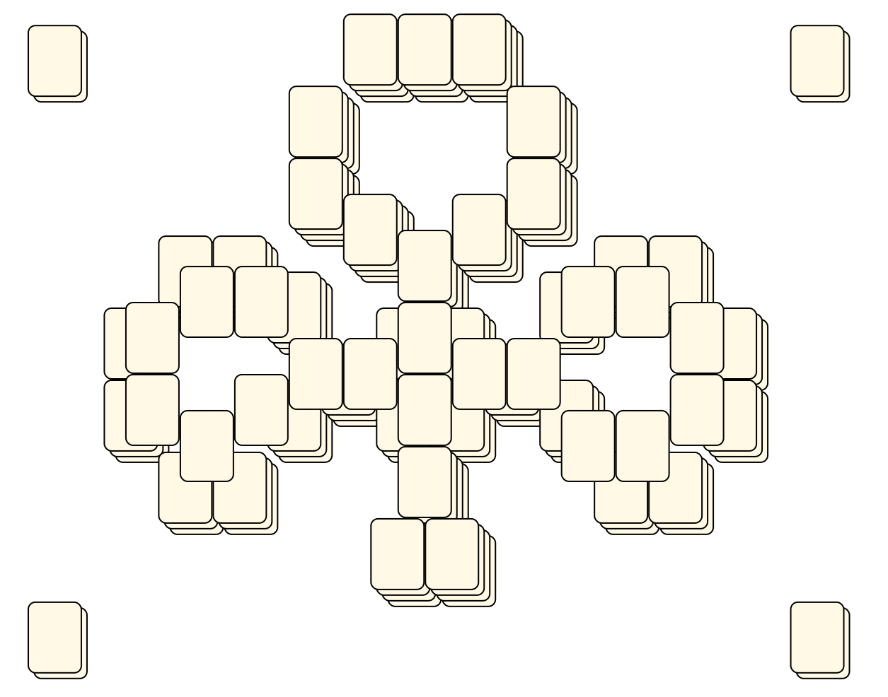
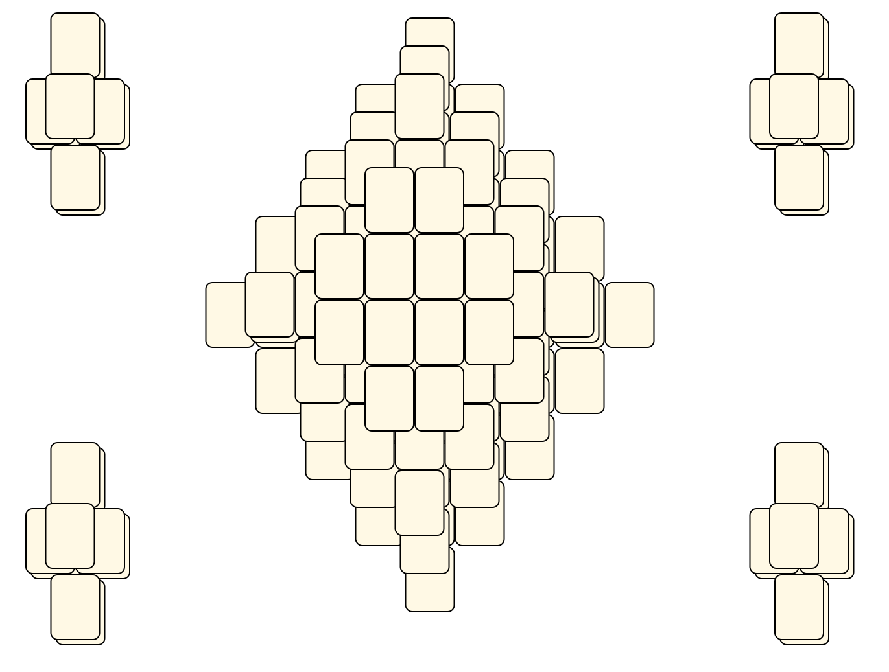
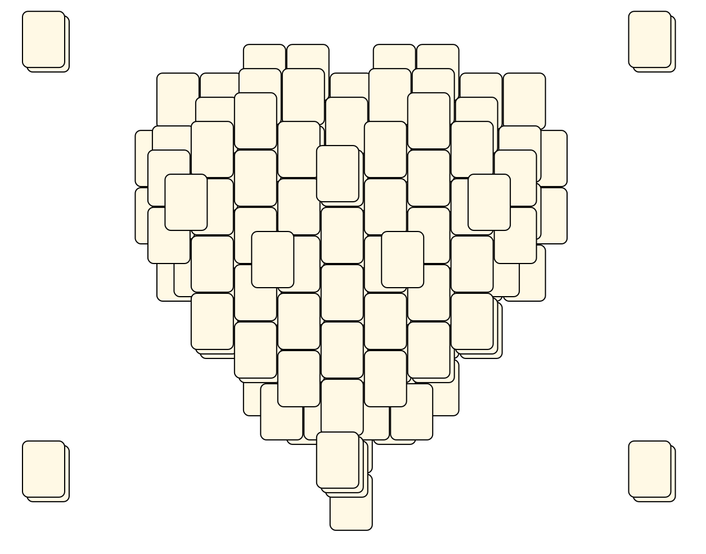
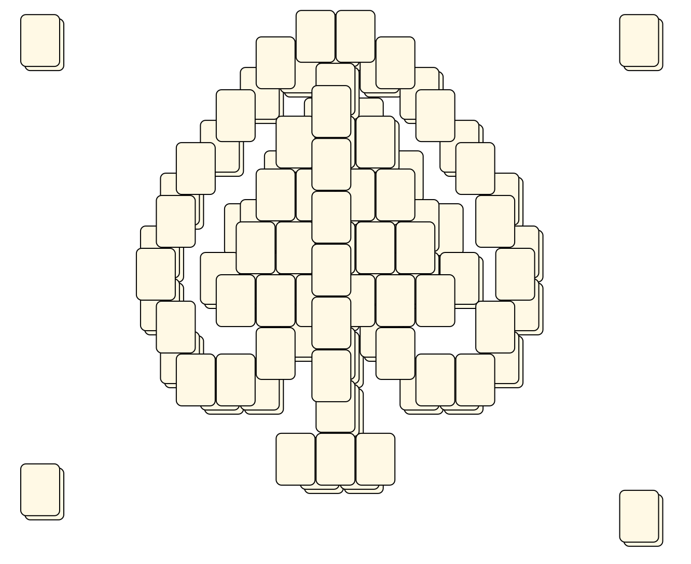
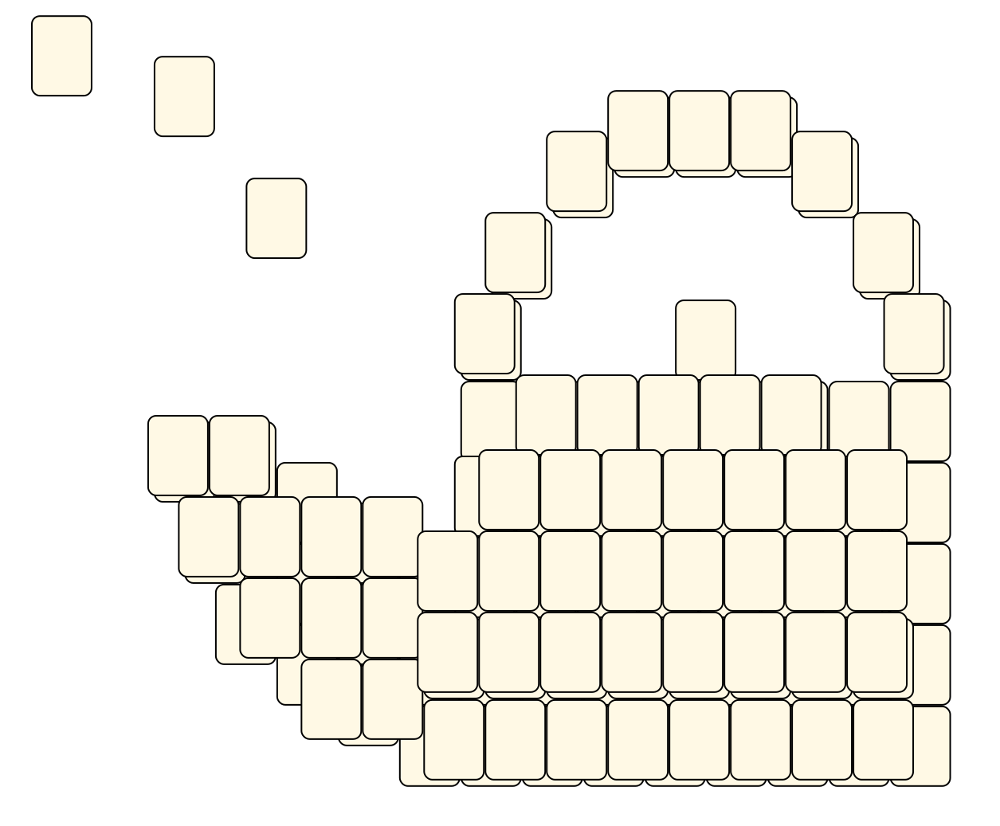
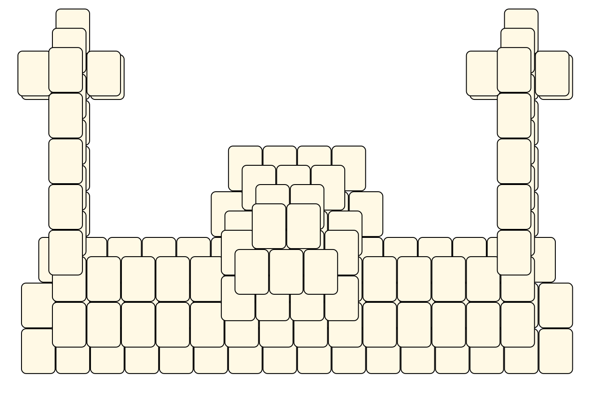

# Mahjong Solitaire Layout Museum: My Kyodai Mahjongg

## My Kyodai Mahjongg
* Source: 
[https://web.archive.org/web/20170903145616/http://kyodaimahjongg.weebly.com/layouts.html](https://web.archive.org/web/20170903145616/http://kyodaimahjongg.weebly.com/layouts.html)

* File Source:  
<sub>```https://web.archive.org/web/20170903145616mp_/http://kyodaimahjongg.weebly.com/uploads/9/5/2/9/9529146/mkm-abc.zip```</sub>


|[mkm-abc](mkm-abc/README.md) ||Layouts: 1|
|:--:|:--:|:--:|
|ABC<br><br> <sub>Mary M</sub> <br>[.lay](./mkm-abc/abc.lay)  [.layout](./mkm-abc/abc.layout)  [.mah](./mkm-abc/abc.mah) |

## My Kyodai Mahjongg
* Source: 
[https://web.archive.org/web/20170903145616/http://kyodaimahjongg.weebly.com/layouts.html](https://web.archive.org/web/20170903145616/http://kyodaimahjongg.weebly.com/layouts.html)

* File Source:  
<sub>```https://web.archive.org/web/20170903145616mp_/https://kyodaimahjongg.weebly.com/uploads/9/5/2/9/9529146/mkm-butterfly.zip```</sub>


|[mkm-butterfly](mkm-butterfly/README.md) ||Layouts: 1|
|:--:|:--:|:--:|
|Butterfly<br><br> <sub>Mary M</sub> <br>[.lay](./mkm-butterfly/butterfly.lay)  [.layout](./mkm-butterfly/butterfly.layout)  [.mah](./mkm-butterfly/butterfly.mah) |

## My Kyodai Mahjongg
* Source: 
[https://web.archive.org/web/20170903145616/http://kyodaimahjongg.weebly.com/layouts.html](https://web.archive.org/web/20170903145616/http://kyodaimahjongg.weebly.com/layouts.html)

* File Source:  
<sub>```https://web.archive.org/web/20170903145616mp_/https://kyodaimahjongg.weebly.com/uploads/9/5/2/9/9529146/mkm-clubs.zip```</sub>


|[mkm-clubs](mkm-clubs/README.md) ||Layouts: 1|
|:--:|:--:|:--:|
|Clubs<br><br> <sub>Mary M</sub> <br>[.lay](./mkm-clubs/clubs.lay)  [.layout](./mkm-clubs/clubs.layout)  [.mah](./mkm-clubs/clubs.mah) |

## My Kyodai Mahjongg
* Source: 
[https://web.archive.org/web/20170903145616/http://kyodaimahjongg.weebly.com/layouts.html](https://web.archive.org/web/20170903145616/http://kyodaimahjongg.weebly.com/layouts.html)

* File Source:  
<sub>```https://web.archive.org/web/20170903145616mp_/https://kyodaimahjongg.weebly.com/uploads/9/5/2/9/9529146/mkm-diamonds.zip```</sub>


|[mkm-diamonds](mkm-diamonds/README.md) ||Layouts: 1|
|:--:|:--:|:--:|
|Diamonds<br><br> <sub>Mary M</sub> <br>[.lay](./mkm-diamonds/diamonds.lay)  [.layout](./mkm-diamonds/diamonds.layout)  [.mah](./mkm-diamonds/diamonds.mah) |

## My Kyodai Mahjongg
* Source: 
[https://web.archive.org/web/20170903145616/http://kyodaimahjongg.weebly.com/layouts.html](https://web.archive.org/web/20170903145616/http://kyodaimahjongg.weebly.com/layouts.html)

* File Source:  
<sub>```https://web.archive.org/web/20170903145616mp_/https://kyodaimahjongg.weebly.com/uploads/9/5/2/9/9529146/mkm-hearts.zip```</sub>


|[mkm-hearts](mkm-hearts/README.md) ||Layouts: 1|
|:--:|:--:|:--:|
|Hearts<br><br> <sub>Mary M</sub> <br>[.lay](./mkm-hearts/hearts.lay)  [.layout](./mkm-hearts/hearts.layout)  [.mah](./mkm-hearts/hearts.mah) |

## My Kyodai Mahjongg
* Source: 
[https://web.archive.org/web/20170903145616/http://kyodaimahjongg.weebly.com/layouts.html](https://web.archive.org/web/20170903145616/http://kyodaimahjongg.weebly.com/layouts.html)

* File Source:  
<sub>```https://web.archive.org/web/20170903145616mp_/https://kyodaimahjongg.weebly.com/uploads/9/5/2/9/9529146/mkm-spades.zip```</sub>


|[mkm-spades](mkm-spades/README.md) ||Layouts: 1|
|:--:|:--:|:--:|
|Spades<br><br> <sub>Mary M</sub> <br>[.lay](./mkm-spades/spades.lay)  [.layout](./mkm-spades/spades.layout)  [.mah](./mkm-spades/spades.mah) |

## My Kyodai Mahjongg
* Source: 
[https://web.archive.org/web/20170903145616/http://kyodaimahjongg.weebly.com/layouts.html](https://web.archive.org/web/20170903145616/http://kyodaimahjongg.weebly.com/layouts.html)

* File Source:  
<sub>```https://web.archive.org/web/20170903145616mp_/https://kyodaimahjongg.weebly.com/uploads/9/5/2/9/9529146/mkm-teafortwo.zip```</sub>


|[mkm-teafortwo](mkm-teafortwo/README.md) ||Layouts: 1|
|:--:|:--:|:--:|
|Tea For Two<br><br> <sub>Mary M</sub> <br>[.lay](./mkm-teafortwo/tea_for_two.lay)  [.layout](./mkm-teafortwo/tea_for_two.layout)  [.mah](./mkm-teafortwo/tea_for_two.mah) |

## My Kyodai Mahjongg
* Source: 
[https://web.archive.org/web/20170903145616/http://kyodaimahjongg.weebly.com/layouts.html](https://web.archive.org/web/20170903145616/http://kyodaimahjongg.weebly.com/layouts.html)

* File Source:  
<sub>```https://web.archive.org/web/20170903145616mp_/https://kyodaimahjongg.weebly.com/uploads/9/5/2/9/9529146/mosque-1.zip```</sub>


|[mosque-1](mosque-1/README.md) ||Layouts: 1|
|:--:|:--:|:--:|
|Mosque<br><br> <sub>Mary M</sub> <br>[.lay](./mosque-1/mosque.lay)  [.layout](./mosque-1/mosque.layout)  [.mah](./mosque-1/mosque.mah) |