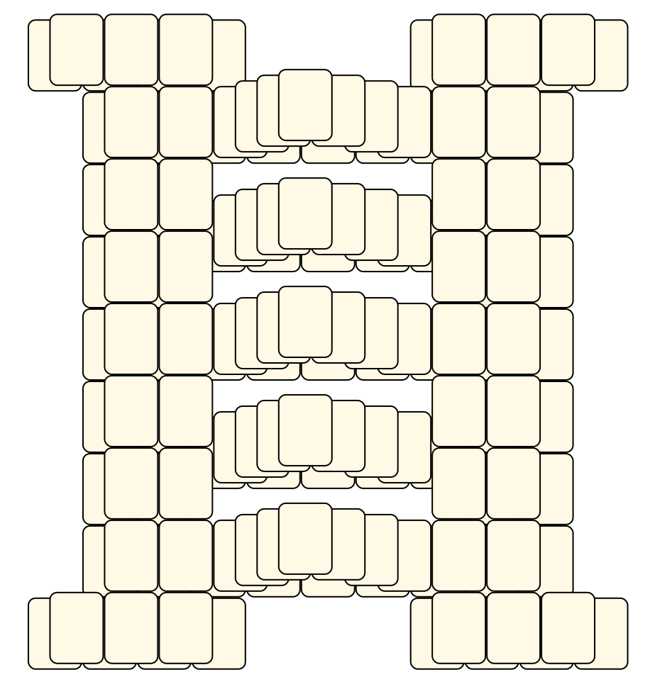

# Mahjong Solitaire Layout Museum: Mugwump Dillard
* Source: [https://web.archive.org/web/20040506174312/http://www.haywired.com/mugwump/layouts.html](https://web.archive.org/web/20040506174312/http://www.haywired.com/mugwump/layouts.html)

* File Source:  
<sub>```https://web.archive.org/web/20060907142557/http://www.haywired.com/mugwump/layouts.zip```</sub>


|Mugwump Dillard||Layouts: 4|
|:--:|:--:|:--:|
|Boaz<br><br> <sub>Mugwump Dillard</sub> <br>[.lay](./boaz.lay)  [.layout](./boaz.layout)  [.mah](./boaz.mah) |House Of Isty<br><br> <sub>Mugwump Dillard</sub> <br>[.lay](./house_of_isty.lay)  [.layout](./house_of_isty.layout)  [.mah](./house_of_isty.mah) |Isty<br><br> <sub>Mugwump Dillard</sub> <br>[.lay](./isty.lay)  [.layout](./isty.layout)  [.mah](./isty.mah) |
|Nylyak<br><br> <sub>Mugwump Dillard</sub> <br>[.lay](./nylyak.lay)  [.layout](./nylyak.layout)  [.mah](./nylyak.mah) |||