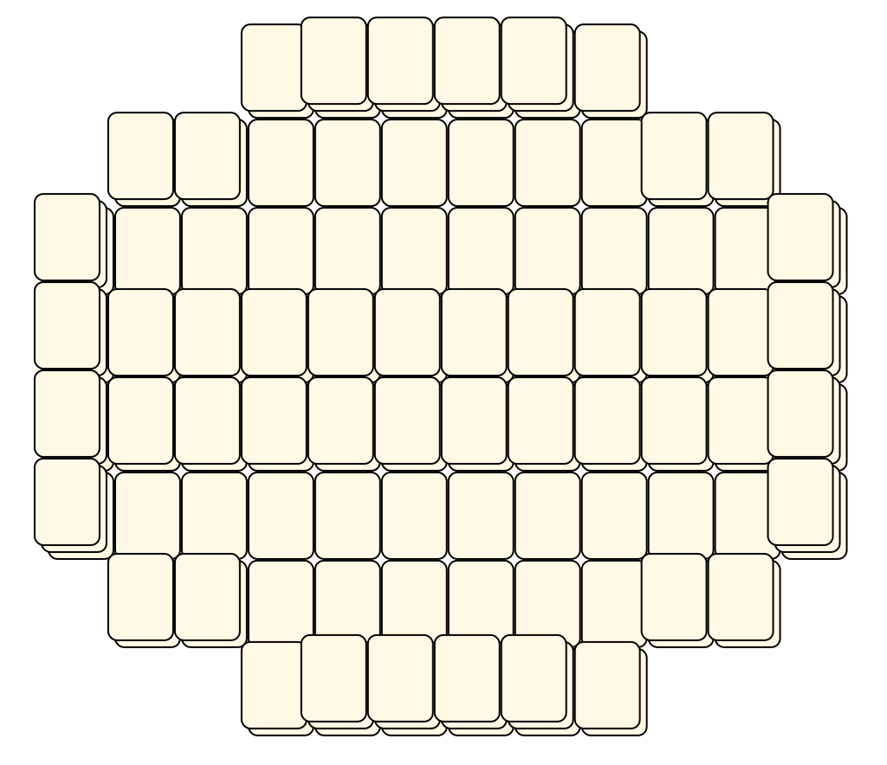
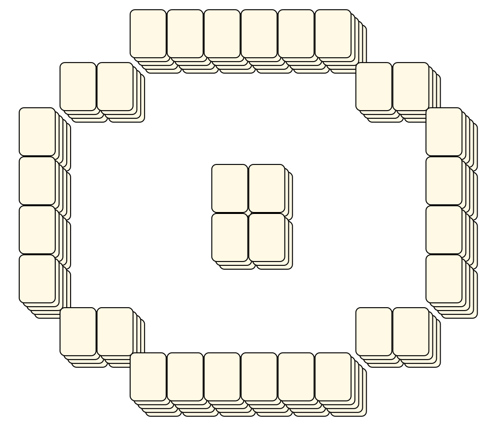
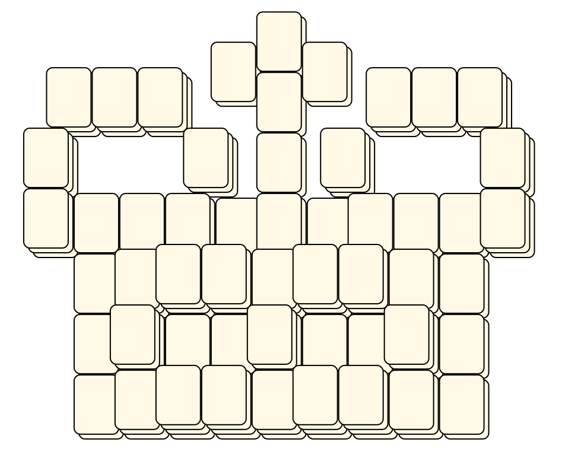
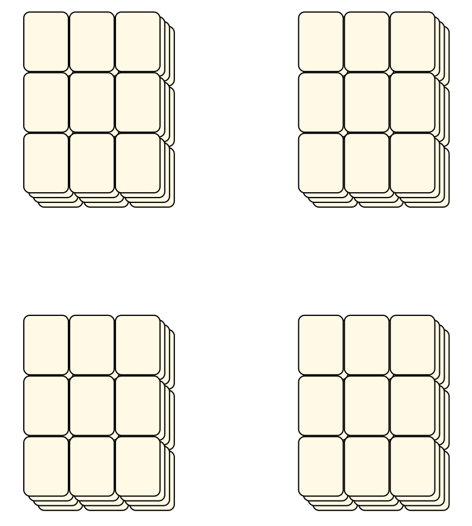
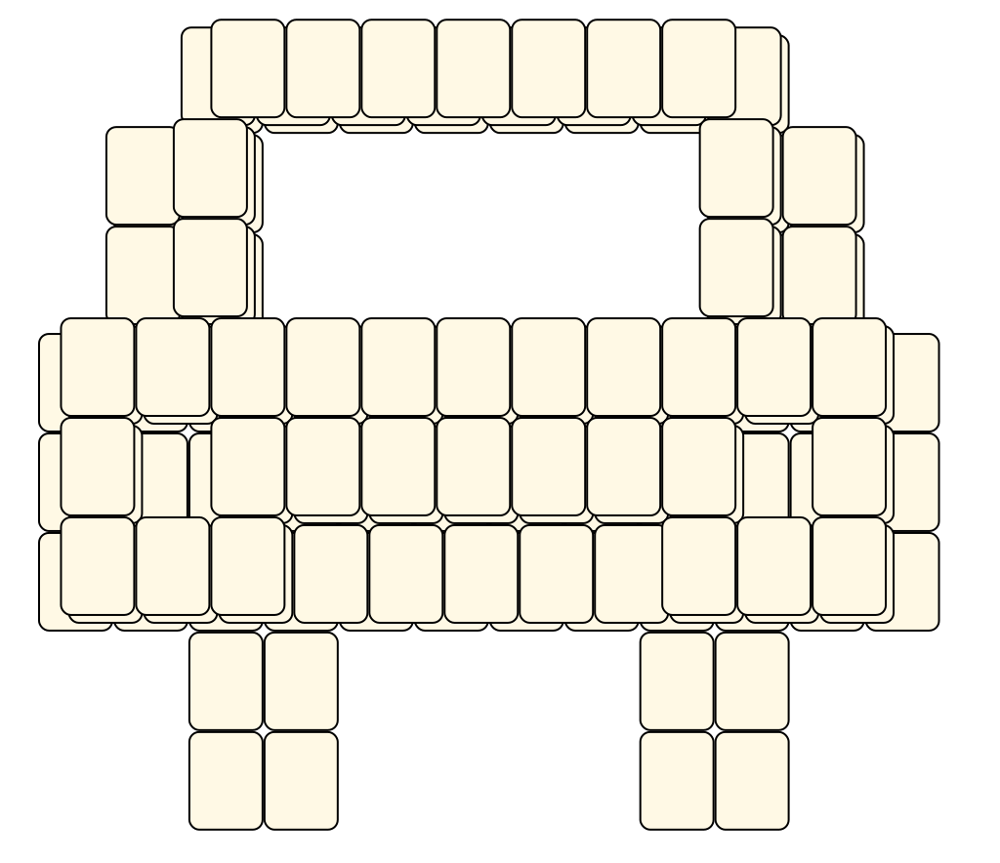
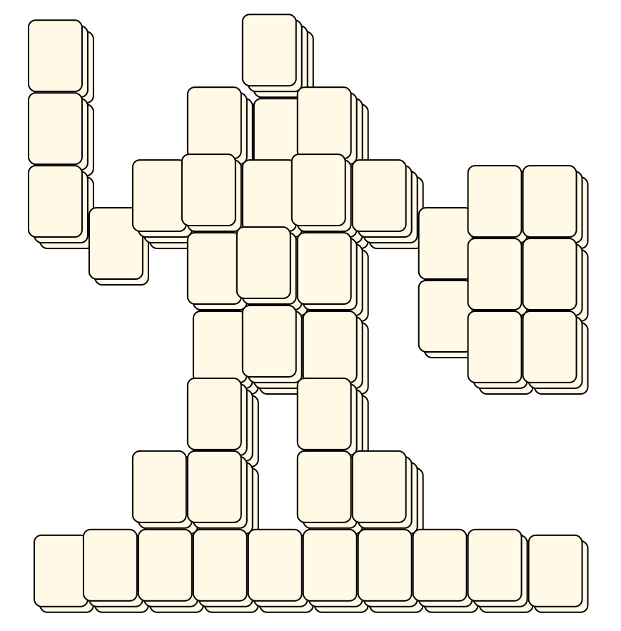
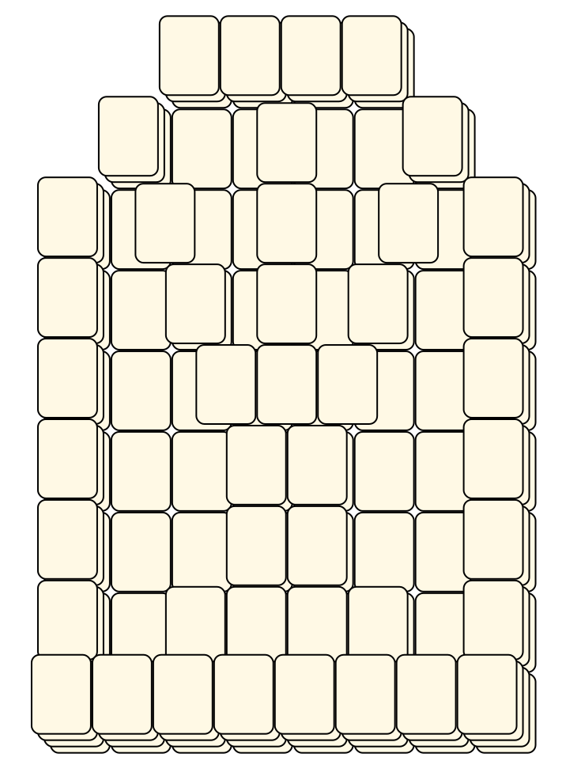
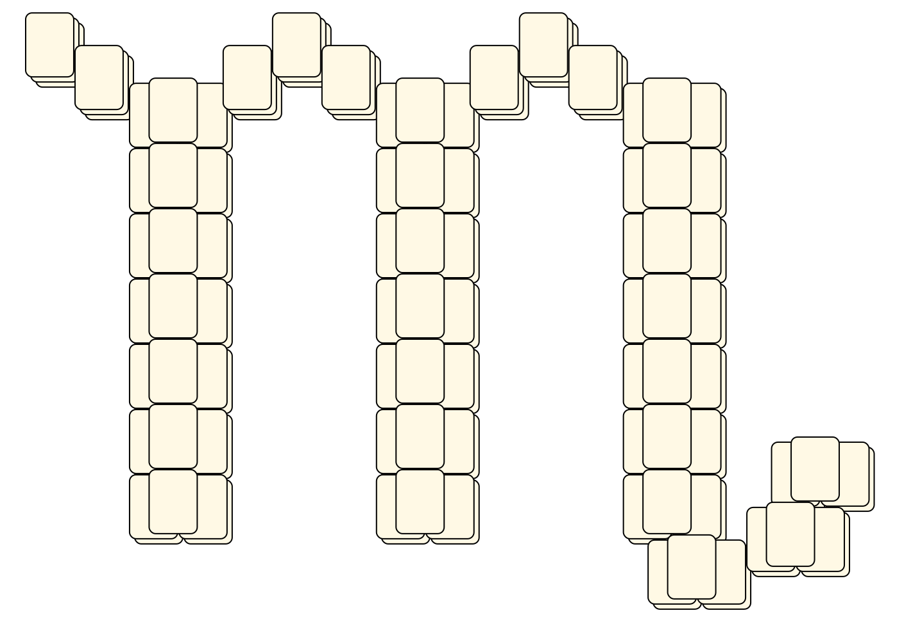

# Mahjong Solitaire Layout Museum: Package A
* Source: [https://web.archive.org/web/20120408030546/http://members.fortunecity.com/phantagia/layouts.htm](https://web.archive.org/web/20120408030546/http://members.fortunecity.com/phantagia/layouts.htm)

* File Source:  
<sub>```https://web.archive.org/web/20120312033642/http://members.fortunecity.com/phantagia/layouts/eplayouts.zip```</sub>


## Astro
* Source: 
[https://web.archive.org/web/20120408030546/http://members.fortunecity.com/phantagia/layouts.htm](https://web.archive.org/web/20120408030546/http://members.fortunecity.com/phantagia/layouts.htm)

* File Source:  
<sub>```https://web.archive.org/web/20120408030904/http://members.fortunecity.com/phantagia/layouts/eplayouts.zip#eplayastro.zip```</sub>


|[eplayastro](eplayastro/README.md) ||Layouts: 18|
|:--:|:--:|:--:|
|Center Of Sun<br><br> <sub>Ernie Polegato</sub> <br>[.lay](./eplayastro/center_of_sun_2.lay)  [.layout](./eplayastro/center_of_sun_2.layout)  [.mah](./eplayastro/center_of_sun_2.mah) |Earth<br><br> <sub>Ernie Polegato</sub> <br>[.lay](./eplayastro/earth_4.lay)  [.layout](./eplayastro/earth_4.layout)  [.mah](./eplayastro/earth_4.mah) |Earth 2<br><br> <sub>Ernie Polegato</sub> <br>[.lay](./eplayastro/earth_2_2.lay)  [.layout](./eplayastro/earth_2_2.layout)  [.mah](./eplayastro/earth_2_2.mah) |
|Earth 3<br><br> <sub>Ernie Polegato</sub> <br>[.lay](./eplayastro/earth_3_2.lay)  [.layout](./eplayastro/earth_3_2.layout)  [.mah](./eplayastro/earth_3_2.mah) |Jupiter<br><br> <sub>Ernie Polegato</sub> <br>[.lay](./eplayastro/jupiter_2.lay)  [.layout](./eplayastro/jupiter_2.layout)  [.mah](./eplayastro/jupiter_2.mah) |Mars<br><br> <sub>Ernie Polegato</sub> <br>[.lay](./eplayastro/mars_2.lay)  [.layout](./eplayastro/mars_2.layout)  [.mah](./eplayastro/mars_2.mah) |
|Mercury<br><br> <sub>Ernie Polegato</sub> <br>[.lay](./eplayastro/mercury_2.lay)  [.layout](./eplayastro/mercury_2.layout)  [.mah](./eplayastro/mercury_2.mah) |Moon<br><br> <sub>Ernie Polegato</sub> <br>[.lay](./eplayastro/moon_2.lay)  [.layout](./eplayastro/moon_2.layout)  [.mah](./eplayastro/moon_2.mah) |Neptune<br><br> <sub>Ernie Polegato</sub> <br>[.lay](./eplayastro/neptune_2.lay)  [.layout](./eplayastro/neptune_2.layout)  [.mah](./eplayastro/neptune_2.mah) |
|Pluto<br><br> <sub>Ernie Polegato</sub> <br>[.lay](./eplayastro/pluto_2.lay)  [.layout](./eplayastro/pluto_2.layout)  [.mah](./eplayastro/pluto_2.mah) |Revised Earth 2<br><br> <sub>Ernie Polegato</sub> <br>[.lay](./eplayastro/revised_earth_2_2.lay)  [.layout](./eplayastro/revised_earth_2_2.layout)  [.mah](./eplayastro/revised_earth_2_2.mah) |Revised Earth 3<br><br> <sub>Ernie Polegato</sub> <br>[.lay](./eplayastro/revised_earth_3_2.lay)  [.layout](./eplayastro/revised_earth_3_2.layout)  [.mah](./eplayastro/revised_earth_3_2.mah) |
|Revised Sun<br><br> <sub>Ernie Polegato</sub> <br>[.lay](./eplayastro/revised_sun_2.lay)  [.layout](./eplayastro/revised_sun_2.layout)  [.mah](./eplayastro/revised_sun_2.mah) |Saturn<br><br> <sub>Ernie Polegato</sub> <br>[.lay](./eplayastro/saturn_3.lay)  [.layout](./eplayastro/saturn_3.layout)  [.mah](./eplayastro/saturn_3.mah) |Sun<br><br> <sub>Ernie Polegato</sub> <br>[.lay](./eplayastro/sun_5.lay)  [.layout](./eplayastro/sun_5.layout)  [.mah](./eplayastro/sun_5.mah) |
|Uranus<br><br> <sub>Ernie Polegato</sub> <br>[.lay](./eplayastro/uranus_3.lay)  [.layout](./eplayastro/uranus_3.layout)  [.mah](./eplayastro/uranus_3.mah) |Uranus 2<br><br> <sub>Ernie Polegato</sub> <br>[.lay](./eplayastro/uranus_2_2.lay)  [.layout](./eplayastro/uranus_2_2.layout)  [.mah](./eplayastro/uranus_2_2.mah) |Venus<br><br> <sub>Ernie Polegato</sub> <br>[.lay](./eplayastro/venus_2.lay)  [.layout](./eplayastro/venus_2.layout)  [.mah](./eplayastro/venus_2.mah) |

## Cards
* Source: 
[https://web.archive.org/web/20120408030546/http://members.fortunecity.com/phantagia/layouts.htm](https://web.archive.org/web/20120408030546/http://members.fortunecity.com/phantagia/layouts.htm)

* File Source:  
<sub>```https://web.archive.org/web/20120408030904/http://members.fortunecity.com/phantagia/layouts/eplayouts.zip#eplaycards.zip```</sub>


|[eplaycards](eplaycards/README.md) ||Layouts: 4|
|:--:|:--:|:--:|
|Clubs<br><br> <sub>Ernie Polegato</sub> <br>[.lay](./eplaycards/clubs_5.lay)  [.layout](./eplaycards/clubs_5.layout)  [.mah](./eplaycards/clubs_5.mah) |Diamonds<br><br> <sub>Ernie Polegato</sub> <br>[.lay](./eplaycards/diamonds_3.lay)  [.layout](./eplaycards/diamonds_3.layout)  [.mah](./eplaycards/diamonds_3.mah) |Hearts<br><br> <sub>Ernie Polegato</sub> <br>[.lay](./eplaycards/hearts_3.lay)  [.layout](./eplaycards/hearts_3.layout)  [.mah](./eplaycards/hearts_3.mah) |
|Spades<br><br> <sub>Ernie Polegato</sub> <br>[.lay](./eplaycards/spades_3.lay)  [.layout](./eplaycards/spades_3.layout)  [.mah](./eplaycards/spades_3.mah) |||

## Chess
* Source: 
[https://web.archive.org/web/20120408030546/http://members.fortunecity.com/phantagia/layouts.htm](https://web.archive.org/web/20120408030546/http://members.fortunecity.com/phantagia/layouts.htm)

* File Source:  
<sub>```https://web.archive.org/web/20120408030904/http://members.fortunecity.com/phantagia/layouts/eplayouts.zip#eplaychess.zip```</sub>


|[eplaychess](eplaychess/README.md) ||Layouts: 7|
|:--:|:--:|:--:|
|Bishop<br><br> <sub>Ernie Polegato</sub> <br>[.lay](./eplaychess/bishop_2.lay)  [.layout](./eplaychess/bishop_2.layout)  [.mah](./eplaychess/bishop_2.mah) |King<br><br> <sub>Ernie Polegato</sub> <br>[.lay](./eplaychess/king_2.lay)  [.layout](./eplaychess/king_2.layout)  [.mah](./eplaychess/king_2.mah) |Knight<br><br> <sub>Ernie Polegato</sub> <br>[.lay](./eplaychess/knight_3.lay)  [.layout](./eplaychess/knight_3.layout)  [.mah](./eplaychess/knight_3.mah) |
|Pawn<br><br> <sub>Ernie Polegato</sub> <br>[.lay](./eplaychess/pawn_3.lay)  [.layout](./eplaychess/pawn_3.layout)  [.mah](./eplaychess/pawn_3.mah) |Pawn 2<br><br> <sub>Ernie Polegato</sub> <br>[.lay](./eplaychess/pawn_2_2.lay)  [.layout](./eplaychess/pawn_2_2.layout)  [.mah](./eplaychess/pawn_2_2.mah) |Queen<br><br> <sub>Ernie Polegato</sub> <br>[.lay](./eplaychess/queen_2.lay)  [.layout](./eplaychess/queen_2.layout)  [.mah](./eplaychess/queen_2.mah) |
|Rook<br><br> <sub>Ernie Polegato</sub> <br>[.lay](./eplaychess/rook_2.lay)  [.layout](./eplaychess/rook_2.layout)  [.mah](./eplaychess/rook_2.mah) |||

## Package 01
* Source: 
[https://web.archive.org/web/20120408030546/http://members.fortunecity.com/phantagia/layouts.htm](https://web.archive.org/web/20120408030546/http://members.fortunecity.com/phantagia/layouts.htm)

* File Source:  
<sub>```https://web.archive.org/web/20120408030904/http://members.fortunecity.com/phantagia/layouts/eplayouts.zip#eplayout01.zip```</sub>


|[eplayout01](eplayout01/README.md) ||Layouts: 40|
|:--:|:--:|:--:|
|3 1/2 Disk<br><br> <sub>Ernie Polegato</sub> <br>[.lay](./eplayout01/3_1_2_disk_2.lay)  [.layout](./eplayout01/3_1_2_disk_2.layout)  [.mah](./eplayout01/3_1_2_disk_2.mah) |5 1/2 Disk<br><br> <sub>Ernie Polegato</sub> <br>[.lay](./eplayout01/5_1_2_disk_2.lay)  [.layout](./eplayout01/5_1_2_disk_2.layout)  [.mah](./eplayout01/5_1_2_disk_2.mah) |Abstract<br><br> <sub>Ernie Polegato</sub> <br>[.lay](./eplayout01/abstract_3.lay)  [.layout](./eplayout01/abstract_3.layout)  [.mah](./eplayout01/abstract_3.mah) |
|Abstract 2<br><br> <sub>Ernie Polegato</sub> <br>[.lay](./eplayout01/abstract_2_2.lay)  [.layout](./eplayout01/abstract_2_2.layout)  [.mah](./eplayout01/abstract_2_2.mah) |Anchor<br><br> <sub>Ernie Polegato</sub> <br>[.lay](./eplayout01/anchor_2.lay)  [.layout](./eplayout01/anchor_2.layout)  [.mah](./eplayout01/anchor_2.mah) |Blocks<br><br> <sub>Ernie Polegato</sub> <br>[.lay](./eplayout01/blocks_3.lay)  [.layout](./eplayout01/blocks_3.layout)  [.mah](./eplayout01/blocks_3.mah) |
|Blocks 2<br><br> <sub>Ernie Polegato</sub> <br>[.lay](./eplayout01/blocks_2_2.lay)  [.layout](./eplayout01/blocks_2_2.layout)  [.mah](./eplayout01/blocks_2_2.mah) |Bow Tie<br><br> <sub>Ernie Polegato</sub> <br>[.lay](./eplayout01/bow_tie_3.lay)  [.layout](./eplayout01/bow_tie_3.layout)  [.mah](./eplayout01/bow_tie_3.mah) |Bow Tie 2<br><br> <sub>Ernie Polegato</sub> <br>[.lay](./eplayout01/bow_tie_2_2.lay)  [.layout](./eplayout01/bow_tie_2_2.layout)  [.mah](./eplayout01/bow_tie_2_2.mah) |
|Bowl<br><br> <sub>Ernie Polegato</sub> <br>[.lay](./eplayout01/bowl_2.lay)  [.layout](./eplayout01/bowl_2.layout)  [.mah](./eplayout01/bowl_2.mah) |Bridge<br><br> <sub>Ernie Polegato</sub> <br>[.lay](./eplayout01/bridge_4.lay)  [.layout](./eplayout01/bridge_4.layout)  [.mah](./eplayout01/bridge_4.mah) |Car<br><br> <sub>Ernie Polegato</sub> <br>[.lay](./eplayout01/car_2.lay)  [.layout](./eplayout01/car_2.layout)  [.mah](./eplayout01/car_2.mah) |
|Columns<br><br> <sub>Ernie Polegato</sub> <br>[.lay](./eplayout01/columns_4.lay)  [.layout](./eplayout01/columns_4.layout)  [.mah](./eplayout01/columns_4.mah) |Cross<br><br> <sub>Ernie Polegato</sub> <br>[.lay](./eplayout01/cross_9.lay)  [.layout](./eplayout01/cross_9.layout)  [.mah](./eplayout01/cross_9.mah) |Crown<br><br> <sub>Ernie Polegato</sub> <br>[.lay](./eplayout01/crown_4.lay)  [.layout](./eplayout01/crown_4.layout)  [.mah](./eplayout01/crown_4.mah) |
|Draco<br><br> <sub>Ernie Polegato</sub> <br>[.lay](./eplayout01/draco_2.lay)  [.layout](./eplayout01/draco_2.layout)  [.mah](./eplayout01/draco_2.mah) |Flower<br><br> <sub>Ernie Polegato</sub> <br>[.lay](./eplayout01/flower_2.lay)  [.layout](./eplayout01/flower_2.layout)  [.mah](./eplayout01/flower_2.mah) |Gong<br><br> <sub>Ernie Polegato</sub> <br>[.lay](./eplayout01/gong_2.lay)  [.layout](./eplayout01/gong_2.layout)  [.mah](./eplayout01/gong_2.mah) |
|Inca Temple<br><br> <sub>Ernie Polegato</sub> <br>[.lay](./eplayout01/inca_temple_2.lay)  [.layout](./eplayout01/inca_temple_2.layout)  [.mah](./eplayout01/inca_temple_2.mah) |Infinity<br><br> <sub>Ernie Polegato</sub> <br>[.lay](./eplayout01/infinity_2.lay)  [.layout](./eplayout01/infinity_2.layout)  [.mah](./eplayout01/infinity_2.mah) |Knight 2<br><br> <sub>Ernie Polegato</sub> <br>[.lay](./eplayout01/knight_2_2.lay)  [.layout](./eplayout01/knight_2_2.layout)  [.mah](./eplayout01/knight_2_2.mah) |
|Moraff Based 1<br><br> <sub>Ernie Polegato</sub> <br>[.lay](./eplayout01/moraff_based_1_2.lay)  [.layout](./eplayout01/moraff_based_1_2.layout)  [.mah](./eplayout01/moraff_based_1_2.mah) |Moraff Based 2<br><br> <sub>Ernie Polegato</sub> <br>[.lay](./eplayout01/moraff_based_2_2.lay)  [.layout](./eplayout01/moraff_based_2_2.layout)  [.mah](./eplayout01/moraff_based_2_2.mah) |Moraff Based 3<br><br> <sub>Ernie Polegato</sub> <br>[.lay](./eplayout01/moraff_based_3_2.lay)  [.layout](./eplayout01/moraff_based_3_2.layout)  [.mah](./eplayout01/moraff_based_3_2.mah) |
|Oval<br><br> <sub>Ernie Polegato</sub> <br>[.lay](./eplayout01/oval_2.lay)  [.layout](./eplayout01/oval_2.layout)  [.mah](./eplayout01/oval_2.mah) |Palanquin<br><br> <sub>Ernie Polegato</sub> <br>[.lay](./eplayout01/palanquin_2.lay)  [.layout](./eplayout01/palanquin_2.layout)  [.mah](./eplayout01/palanquin_2.mah) |Pyramid 2<br><br> <sub>Ernie Polegato</sub> <br>[.lay](./eplayout01/pyramid_2_5.lay)  [.layout](./eplayout01/pyramid_2_5.layout)  [.mah](./eplayout01/pyramid_2_5.mah) |
|Scarab<br><br> <sub>Ernie Polegato</sub> <br>[.lay](./eplayout01/scarab_2.lay)  [.layout](./eplayout01/scarab_2.layout)  [.mah](./eplayout01/scarab_2.mah) |Shield<br><br> <sub>Ernie Polegato</sub> <br>[.lay](./eplayout01/shield_4.lay)  [.layout](./eplayout01/shield_4.layout)  [.mah](./eplayout01/shield_4.mah) |Stain Glass Window<br><br> <sub>Ernie Polegato</sub> <br>[.lay](./eplayout01/stain_glass_window_2.lay)  [.layout](./eplayout01/stain_glass_window_2.layout)  [.mah](./eplayout01/stain_glass_window_2.mah) |
|Star<br><br> <sub>Ernie Polegato</sub> <br>[.lay](./eplayout01/star_4.lay)  [.layout](./eplayout01/star_4.layout)  [.mah](./eplayout01/star_4.mah) |Star 2<br><br> <sub>Ernie Polegato</sub> <br>[.lay](./eplayout01/star_2_3.lay)  [.layout](./eplayout01/star_2_3.layout)  [.mah](./eplayout01/star_2_3.mah) |Statue<br><br> <sub>Ernie Polegato</sub> <br>[.lay](./eplayout01/statue_2.lay)  [.layout](./eplayout01/statue_2.layout)  [.mah](./eplayout01/statue_2.mah) |
|Sun<br><br> <sub>Ernie Polegato</sub> <br>[.lay](./eplayout01/sun_4.lay)  [.layout](./eplayout01/sun_4.layout)  [.mah](./eplayout01/sun_4.mah) |Sun 2<br><br> <sub>Ernie Polegato</sub> <br>[.lay](./eplayout01/sun_2_2.lay)  [.layout](./eplayout01/sun_2_2.layout)  [.mah](./eplayout01/sun_2_2.mah) |Switch<br><br> <sub>Ernie Polegato</sub> <br>[.lay](./eplayout01/switch_2.lay)  [.layout](./eplayout01/switch_2.layout)  [.mah](./eplayout01/switch_2.mah) |
|Temple 2<br><br> <sub>Ernie Polegato</sub> <br>[.lay](./eplayout01/temple_2_5.lay)  [.layout](./eplayout01/temple_2_5.layout)  [.mah](./eplayout01/temple_2_5.mah) |Truck<br><br> <sub>Ernie Polegato</sub> <br>[.lay](./eplayout01/truck_2.lay)  [.layout](./eplayout01/truck_2.layout)  [.mah](./eplayout01/truck_2.mah) |TV And Stand<br><br> <sub>Ernie Polegato</sub> <br>[.lay](./eplayout01/tv_and_stand_2.lay)  [.layout](./eplayout01/tv_and_stand_2.layout)  [.mah](./eplayout01/tv_and_stand_2.mah) |
|Woman<br><br> <sub>Ernie Polegato</sub> <br>[.lay](./eplayout01/woman_2.lay)  [.layout](./eplayout01/woman_2.layout)  [.mah](./eplayout01/woman_2.mah) |||

## Package 02
* Source: 
[https://web.archive.org/web/20120408030546/http://members.fortunecity.com/phantagia/layouts.htm](https://web.archive.org/web/20120408030546/http://members.fortunecity.com/phantagia/layouts.htm)

* File Source:  
<sub>```https://web.archive.org/web/20120408030904/http://members.fortunecity.com/phantagia/layouts/eplayouts.zip#eplayout02.zip```</sub>


|[eplayout02](eplayout02/README.md) ||Layouts: 11|
|:--:|:--:|:--:|
|Celtic Cross<br><br> <sub>Ernie Polegato</sub> <br>[.lay](./eplayout02/celtic_cross.lay)  [.layout](./eplayout02/celtic_cross.layout)  [.mah](./eplayout02/celtic_cross.mah) |Cluster<br><br> <sub>Ernie Polegato</sub> <br>[.lay](./eplayout02/cluster.lay)  [.layout](./eplayout02/cluster.layout)  [.mah](./eplayout02/cluster.mah) |Cluster 2<br><br> <sub>Ernie Polegato</sub> <br>[.lay](./eplayout02/cluster_2.lay)  [.layout](./eplayout02/cluster_2.layout)  [.mah](./eplayout02/cluster_2.mah) |
|Fortress<br><br> <sub>Ernie Polegato</sub> <br>[.lay](./eplayout02/fortress_3.lay)  [.layout](./eplayout02/fortress_3.layout)  [.mah](./eplayout02/fortress_3.mah) |Grate<br><br> <sub>Ernie Polegato</sub> <br>[.lay](./eplayout02/grate.lay)  [.layout](./eplayout02/grate.layout)  [.mah](./eplayout02/grate.mah) |Grate 2<br><br> <sub>Ernie Polegato</sub> <br>[.lay](./eplayout02/grate_2.lay)  [.layout](./eplayout02/grate_2.layout)  [.mah](./eplayout02/grate_2.mah) |
|Symbol<br><br> <sub>Ernie Polegato</sub> <br>[.lay](./eplayout02/symbol.lay)  [.layout](./eplayout02/symbol.layout)  [.mah](./eplayout02/symbol.mah) |Symbol 2<br><br> <sub>Ernie Polegato</sub> <br>[.lay](./eplayout02/symbol_2.lay)  [.layout](./eplayout02/symbol_2.layout)  [.mah](./eplayout02/symbol_2.mah) |Symbol 3<br><br> <sub>Ernie Polegato</sub> <br>[.lay](./eplayout02/symbol_3.lay)  [.layout](./eplayout02/symbol_3.layout)  [.mah](./eplayout02/symbol_3.mah) |
|Symbol 4<br><br> <sub>Ernie Polegato</sub> <br>[.lay](./eplayout02/symbol_4.lay)  [.layout](./eplayout02/symbol_4.layout)  [.mah](./eplayout02/symbol_4.mah) |Tombstone<br><br> <sub>Ernie Polegato</sub> <br>[.lay](./eplayout02/tombstone.lay)  [.layout](./eplayout02/tombstone.layout)  [.mah](./eplayout02/tombstone.mah) ||

## Package 03
* Source: 
[https://web.archive.org/web/20120408030546/http://members.fortunecity.com/phantagia/layouts.htm](https://web.archive.org/web/20120408030546/http://members.fortunecity.com/phantagia/layouts.htm)

* File Source:  
<sub>```https://web.archive.org/web/20120408030904/http://members.fortunecity.com/phantagia/layouts/eplayouts.zip#eplayout03.zip```</sub>


|[eplayout03](eplayout03/README.md) ||Layouts: 12|
|:--:|:--:|:--:|
|ABCs<br><br> <sub>Ernie Polegato</sub> <br>[.lay](./eplayout03/abcs.lay)  [.layout](./eplayout03/abcs.layout)  [.mah](./eplayout03/abcs.mah) |Castle<br><br> <sub>Ernie Polegato</sub> <br>[.lay](./eplayout03/castle_5.lay)  [.layout](./eplayout03/castle_5.layout)  [.mah](./eplayout03/castle_5.mah) |Mesh<br><br> <sub>Ernie Polegato</sub> <br>[.lay](./eplayout03/mesh_5.lay)  [.layout](./eplayout03/mesh_5.layout)  [.mah](./eplayout03/mesh_5.mah) |
|Mesh 2<br><br> <sub>Ernie Polegato</sub> <br>[.lay](./eplayout03/mesh_2_2.lay)  [.layout](./eplayout03/mesh_2_2.layout)  [.mah](./eplayout03/mesh_2_2.mah) |Mesh 3<br><br> <sub>Ernie Polegato</sub> <br>[.lay](./eplayout03/mesh_3.lay)  [.layout](./eplayout03/mesh_3.layout)  [.mah](./eplayout03/mesh_3.mah) |Mesh 4<br><br> <sub>Ernie Polegato</sub> <br>[.lay](./eplayout03/mesh_4.lay)  [.layout](./eplayout03/mesh_4.layout)  [.mah](./eplayout03/mesh_4.mah) |
|Nut<br><br> <sub>Ernie Polegato</sub> <br>[.lay](./eplayout03/nut.lay)  [.layout](./eplayout03/nut.layout)  [.mah](./eplayout03/nut.mah) |Pattern<br><br> <sub>Ernie Polegato</sub> <br>[.lay](./eplayout03/pattern_3.lay)  [.layout](./eplayout03/pattern_3.layout)  [.mah](./eplayout03/pattern_3.mah) |Pattern 2<br><br> <sub>Ernie Polegato</sub> <br>[.lay](./eplayout03/pattern_2_2.lay)  [.layout](./eplayout03/pattern_2_2.layout)  [.mah](./eplayout03/pattern_2_2.mah) |
|Volcano<br><br> <sub>Ernie Polegato</sub> <br>[.lay](./eplayout03/volcano_2.lay)  [.layout](./eplayout03/volcano_2.layout)  [.mah](./eplayout03/volcano_2.mah) |X<br><br> <sub>Ernie Polegato</sub> <br>[.lay](./eplayout03/x.lay)  [.layout](./eplayout03/x.layout)  [.mah](./eplayout03/x.mah) |X2<br><br> <sub>Ernie Polegato</sub> <br>[.lay](./eplayout03/x2.lay)  [.layout](./eplayout03/x2.layout)  [.mah](./eplayout03/x2.mah) |

## Package 04
* Source: 
[https://web.archive.org/web/20120408030546/http://members.fortunecity.com/phantagia/layouts.htm](https://web.archive.org/web/20120408030546/http://members.fortunecity.com/phantagia/layouts.htm)

* File Source:  
<sub>```https://web.archive.org/web/20120408030904/http://members.fortunecity.com/phantagia/layouts/eplayouts.zip#eplayout04.zip```</sub>


|[eplayout04](eplayout04/README.md) ||Layouts: 19|
|:--:|:--:|:--:|
|Bird<br><br> <sub>Ernie Polegato</sub> <br>[.lay](./eplayout04/bird.lay)  [.layout](./eplayout04/bird.layout)  [.mah](./eplayout04/bird.mah) |Block<br><br> <sub>Ernie Polegato</sub> <br>[.lay](./eplayout04/block_2.lay)  [.layout](./eplayout04/block_2.layout)  [.mah](./eplayout04/block_2.mah) |Coffin<br><br> <sub>Ernie Polegato</sub> <br>[.lay](./eplayout04/coffin.lay)  [.layout](./eplayout04/coffin.layout)  [.mah](./eplayout04/coffin.mah) |
|Cross 2<br><br> <sub>Ernie Polegato</sub> <br>[.lay](./eplayout04/cross_2_2.lay)  [.layout](./eplayout04/cross_2_2.layout)  [.mah](./eplayout04/cross_2_2.mah) |Design<br><br> <sub>Ernie Polegato</sub> <br>[.lay](./eplayout04/design.lay)  [.layout](./eplayout04/design.layout)  [.mah](./eplayout04/design.mah) |Design 10<br><br> <sub>Ernie Polegato</sub> <br>[.lay](./eplayout04/design_10.lay)  [.layout](./eplayout04/design_10.layout)  [.mah](./eplayout04/design_10.mah) |
|Design 11<br><br> <sub>Ernie Polegato</sub> <br>[.lay](./eplayout04/design_11.lay)  [.layout](./eplayout04/design_11.layout)  [.mah](./eplayout04/design_11.mah) |Design 12<br><br> <sub>Ernie Polegato</sub> <br>[.lay](./eplayout04/design_12.lay)  [.layout](./eplayout04/design_12.layout)  [.mah](./eplayout04/design_12.mah) |Design 2<br><br> <sub>Ernie Polegato</sub> <br>[.lay](./eplayout04/design_2.lay)  [.layout](./eplayout04/design_2.layout)  [.mah](./eplayout04/design_2.mah) |
|Design 3<br><br> <sub>Ernie Polegato</sub> <br>[.lay](./eplayout04/design_3.lay)  [.layout](./eplayout04/design_3.layout)  [.mah](./eplayout04/design_3.mah) |Design 4<br><br> <sub>Ernie Polegato</sub> <br>[.lay](./eplayout04/design_4.lay)  [.layout](./eplayout04/design_4.layout)  [.mah](./eplayout04/design_4.mah) |Design 5<br><br> <sub>Ernie Polegato</sub> <br>[.lay](./eplayout04/design_5.lay)  [.layout](./eplayout04/design_5.layout)  [.mah](./eplayout04/design_5.mah) |
|Design 6<br><br> <sub>Ernie Polegato</sub> <br>[.lay](./eplayout04/design_6.lay)  [.layout](./eplayout04/design_6.layout)  [.mah](./eplayout04/design_6.mah) |Design 7<br><br> <sub>Ernie Polegato</sub> <br>[.lay](./eplayout04/design_7.lay)  [.layout](./eplayout04/design_7.layout)  [.mah](./eplayout04/design_7.mah) |Design 8<br><br> <sub>Ernie Polegato</sub> <br>[.lay](./eplayout04/design_8.lay)  [.layout](./eplayout04/design_8.layout)  [.mah](./eplayout04/design_8.mah) |
|Design 9<br><br> <sub>Ernie Polegato</sub> <br>[.lay](./eplayout04/design_9.lay)  [.layout](./eplayout04/design_9.layout)  [.mah](./eplayout04/design_9.mah) |Eyeball<br><br> <sub>Ernie Polegato</sub> <br>[.lay](./eplayout04/eyeball.lay)  [.layout](./eplayout04/eyeball.layout)  [.mah](./eplayout04/eyeball.mah) |Gift<br><br> <sub>Ernie Polegato</sub> <br>[.lay](./eplayout04/gift.lay)  [.layout](./eplayout04/gift.layout)  [.mah](./eplayout04/gift.mah) |
|Joined Rings<br><br> <sub>Ernie Polegato</sub> <br>[.lay](./eplayout04/joined_rings.lay)  [.layout](./eplayout04/joined_rings.layout)  [.mah](./eplayout04/joined_rings.mah) |||

## Package 05
* Source: 
[https://web.archive.org/web/20120408030546/http://members.fortunecity.com/phantagia/layouts.htm](https://web.archive.org/web/20120408030546/http://members.fortunecity.com/phantagia/layouts.htm)

* File Source:  
<sub>```https://web.archive.org/web/20120408030904/http://members.fortunecity.com/phantagia/layouts/eplayouts.zip#eplayout05.zip```</sub>


|[eplayout05](eplayout05/README.md) ||Layouts: 20|
|:--:|:--:|:--:|
|JRR Tolkien<br><br> <sub>Ernie Polegato</sub> <br>[.lay](./eplayout05/jrr_tolkien.lay)  [.layout](./eplayout05/jrr_tolkien.layout)  [.mah](./eplayout05/jrr_tolkien.mah) |Judas Priest<br><br> <sub>Ernie Polegato</sub> <br>[.lay](./eplayout05/judas_priest.lay)  [.layout](./eplayout05/judas_priest.layout)  [.mah](./eplayout05/judas_priest.mah) |Layout<br><br> <sub>Ernie Polegato</sub> <br>[.lay](./eplayout05/layout.lay)  [.layout](./eplayout05/layout.layout)  [.mah](./eplayout05/layout.mah) |
|Layout 10<br><br> <sub>Ernie Polegato</sub> <br>[.lay](./eplayout05/layout_10.lay)  [.layout](./eplayout05/layout_10.layout)  [.mah](./eplayout05/layout_10.mah) |Layout 2<br><br> <sub>Ernie Polegato</sub> <br>[.lay](./eplayout05/layout_2.lay)  [.layout](./eplayout05/layout_2.layout)  [.mah](./eplayout05/layout_2.mah) |Layout 3<br><br> <sub>Ernie Polegato</sub> <br>[.lay](./eplayout05/layout_3.lay)  [.layout](./eplayout05/layout_3.layout)  [.mah](./eplayout05/layout_3.mah) |
|Layout 4<br><br> <sub>Ernie Polegato</sub> <br>[.lay](./eplayout05/layout_4.lay)  [.layout](./eplayout05/layout_4.layout)  [.mah](./eplayout05/layout_4.mah) |Layout 5<br><br> <sub>Ernie Polegato</sub> <br>[.lay](./eplayout05/layout_5.lay)  [.layout](./eplayout05/layout_5.layout)  [.mah](./eplayout05/layout_5.mah) |Layout 6<br><br> <sub>Ernie Polegato</sub> <br>[.lay](./eplayout05/layout_6.lay)  [.layout](./eplayout05/layout_6.layout)  [.mah](./eplayout05/layout_6.mah) |
|Layout 7<br><br> <sub>Ernie Polegato</sub> <br>[.lay](./eplayout05/layout_7.lay)  [.layout](./eplayout05/layout_7.layout)  [.mah](./eplayout05/layout_7.mah) |Layout 8<br><br> <sub>Ernie Polegato</sub> <br>[.lay](./eplayout05/layout_8.lay)  [.layout](./eplayout05/layout_8.layout)  [.mah](./eplayout05/layout_8.mah) |Layout 9<br><br> <sub>Ernie Polegato</sub> <br>[.lay](./eplayout05/layout_9.lay)  [.layout](./eplayout05/layout_9.layout)  [.mah](./eplayout05/layout_9.mah) |
|Oyster Shell<br><br> <sub>Ernie Polegato</sub> <br>[.lay](./eplayout05/oyster_shell.lay)  [.layout](./eplayout05/oyster_shell.layout)  [.mah](./eplayout05/oyster_shell.mah) |Pharaohs Monument<br><br> <sub>Ernie Polegato</sub> <br>[.lay](./eplayout05/pharaohs_monument.lay)  [.layout](./eplayout05/pharaohs_monument.layout)  [.mah](./eplayout05/pharaohs_monument.mah) |Shi Huangdis Tomb<br><br> <sub>Ernie Polegato</sub> <br>[.lay](./eplayout05/shi_huangdis_tomb.lay)  [.layout](./eplayout05/shi_huangdis_tomb.layout)  [.mah](./eplayout05/shi_huangdis_tomb.mah) |
|Stairs<br><br> <sub>Ernie Polegato</sub> <br>[.lay](./eplayout05/stairs_8.lay)  [.layout](./eplayout05/stairs_8.layout)  [.mah](./eplayout05/stairs_8.mah) |Temple<br><br> <sub>Ernie Polegato</sub> <br>[.lay](./eplayout05/temple_5.lay)  [.layout](./eplayout05/temple_5.layout)  [.mah](./eplayout05/temple_5.mah) |Temple 3<br><br> <sub>Ernie Polegato</sub> <br>[.lay](./eplayout05/temple_3_2.lay)  [.layout](./eplayout05/temple_3_2.layout)  [.mah](./eplayout05/temple_3_2.mah) |
|Temple 4<br><br> <sub>Ernie Polegato</sub> <br>[.lay](./eplayout05/temple_4_2.lay)  [.layout](./eplayout05/temple_4_2.layout)  [.mah](./eplayout05/temple_4_2.mah) |Twin Temple<br><br> <sub>Ernie Polegato</sub> <br>[.lay](./eplayout05/twin_temple.lay)  [.layout](./eplayout05/twin_temple.layout)  [.mah](./eplayout05/twin_temple.mah) ||

## Package 06
* Source: 
[https://web.archive.org/web/20120408030546/http://members.fortunecity.com/phantagia/layouts.htm](https://web.archive.org/web/20120408030546/http://members.fortunecity.com/phantagia/layouts.htm)

* File Source:  
<sub>```https://web.archive.org/web/20120408030904/http://members.fortunecity.com/phantagia/layouts/eplayouts.zip#eplayout06.zip```</sub>


|[eplayout06](eplayout06/README.md) ||Layouts: 20|
|:--:|:--:|:--:|
|Layout 11<br><br> <sub>Ernie Polegato</sub> <br>[.lay](./eplayout06/layout_11.lay)  [.layout](./eplayout06/layout_11.layout)  [.mah](./eplayout06/layout_11.mah) |Layout 12<br><br> <sub>Ernie Polegato</sub> <br>[.lay](./eplayout06/layout_12.lay)  [.layout](./eplayout06/layout_12.layout)  [.mah](./eplayout06/layout_12.mah) |Layout 12B<br><br> <sub>Ernie Polegato</sub> <br>[.lay](./eplayout06/layout_12b.lay)  [.layout](./eplayout06/layout_12b.layout)  [.mah](./eplayout06/layout_12b.mah) |
|Layout 13<br><br> <sub>Ernie Polegato</sub> <br>[.lay](./eplayout06/layout_13.lay)  [.layout](./eplayout06/layout_13.layout)  [.mah](./eplayout06/layout_13.mah) |Layout 13B<br><br> <sub>Ernie Polegato</sub> <br>[.lay](./eplayout06/layout_13b.lay)  [.layout](./eplayout06/layout_13b.layout)  [.mah](./eplayout06/layout_13b.mah) |Layout 13C<br><br> <sub>Ernie Polegato</sub> <br>[.lay](./eplayout06/layout_13c.lay)  [.layout](./eplayout06/layout_13c.layout)  [.mah](./eplayout06/layout_13c.mah) |
|Layout 14<br><br> <sub>Ernie Polegato</sub> <br>[.lay](./eplayout06/layout_14.lay)  [.layout](./eplayout06/layout_14.layout)  [.mah](./eplayout06/layout_14.mah) |Layout 14B<br><br> <sub>Ernie Polegato</sub> <br>[.lay](./eplayout06/layout_14b.lay)  [.layout](./eplayout06/layout_14b.layout)  [.mah](./eplayout06/layout_14b.mah) |Layout 15<br><br> <sub>Ernie Polegato</sub> <br>[.lay](./eplayout06/layout_15.lay)  [.layout](./eplayout06/layout_15.layout)  [.mah](./eplayout06/layout_15.mah) |
|Layout 16<br><br> <sub>Ernie Polegato</sub> <br>[.lay](./eplayout06/layout_16.lay)  [.layout](./eplayout06/layout_16.layout)  [.mah](./eplayout06/layout_16.mah) |Layout 17<br><br> <sub>Ernie Polegato</sub> <br>[.lay](./eplayout06/layout_17.lay)  [.layout](./eplayout06/layout_17.layout)  [.mah](./eplayout06/layout_17.mah) |Layout 18<br><br> <sub>Ernie Polegato</sub> <br>[.lay](./eplayout06/layout_18.lay)  [.layout](./eplayout06/layout_18.layout)  [.mah](./eplayout06/layout_18.mah) |
|Layout 19<br><br> <sub>Ernie Polegato</sub> <br>[.lay](./eplayout06/layout_19.lay)  [.layout](./eplayout06/layout_19.layout)  [.mah](./eplayout06/layout_19.mah) |Layout 19B<br><br> <sub>Ernie Polegato</sub> <br>[.lay](./eplayout06/layout_19b.lay)  [.layout](./eplayout06/layout_19b.layout)  [.mah](./eplayout06/layout_19b.mah) |Layout 19C<br><br> <sub>Ernie Polegato</sub> <br>[.lay](./eplayout06/layout_19c.lay)  [.layout](./eplayout06/layout_19c.layout)  [.mah](./eplayout06/layout_19c.mah) |
|Layout 20<br><br> <sub>Ernie Polegato</sub> <br>[.lay](./eplayout06/layout_20.lay)  [.layout](./eplayout06/layout_20.layout)  [.mah](./eplayout06/layout_20.mah) |Layout 20B<br><br> <sub>Ernie Polegato</sub> <br>[.lay](./eplayout06/layout_20b.lay)  [.layout](./eplayout06/layout_20b.layout)  [.mah](./eplayout06/layout_20b.mah) |Layout 21<br><br> <sub>Ernie Polegato</sub> <br>[.lay](./eplayout06/layout_21.lay)  [.layout](./eplayout06/layout_21.layout)  [.mah](./eplayout06/layout_21.mah) |
|Layout 21B<br><br> <sub>Ernie Polegato</sub> <br>[.lay](./eplayout06/layout_21b.lay)  [.layout](./eplayout06/layout_21b.layout)  [.mah](./eplayout06/layout_21b.mah) |Layout 21C<br><br> <sub>Ernie Polegato</sub> <br>[.lay](./eplayout06/layout_21c.lay)  [.layout](./eplayout06/layout_21c.layout)  [.mah](./eplayout06/layout_21c.mah) ||

## Package 07
* Source: 
[https://web.archive.org/web/20120408030546/http://members.fortunecity.com/phantagia/layouts.htm](https://web.archive.org/web/20120408030546/http://members.fortunecity.com/phantagia/layouts.htm)

* File Source:  
<sub>```https://web.archive.org/web/20120408030904/http://members.fortunecity.com/phantagia/layouts/eplayouts.zip#eplayout07.zip```</sub>


|[eplayout07](eplayout07/README.md) ||Layouts: 11|
|:--:|:--:|:--:|
|Layout 22<br><br> <sub>Ernie Polegato</sub> <br>[.lay](./eplayout07/layout_22.lay)  [.layout](./eplayout07/layout_22.layout)  [.mah](./eplayout07/layout_22.mah) |Layout 23<br><br> <sub>Ernie Polegato</sub> <br>[.lay](./eplayout07/layout_23.lay)  [.layout](./eplayout07/layout_23.layout)  [.mah](./eplayout07/layout_23.mah) |Layout 24<br><br> <sub>Ernie Polegato</sub> <br>[.lay](./eplayout07/layout_24.lay)  [.layout](./eplayout07/layout_24.layout)  [.mah](./eplayout07/layout_24.mah) |
|Layout 25<br><br> <sub>Ernie Polegato</sub> <br>[.lay](./eplayout07/layout_25.lay)  [.layout](./eplayout07/layout_25.layout)  [.mah](./eplayout07/layout_25.mah) |Layout 25B<br><br> <sub>Ernie Polegato</sub> <br>[.lay](./eplayout07/layout_25b.lay)  [.layout](./eplayout07/layout_25b.layout)  [.mah](./eplayout07/layout_25b.mah) |Layout 26<br><br> <sub>Ernie Polegato</sub> <br>[.lay](./eplayout07/layout_26.lay)  [.layout](./eplayout07/layout_26.layout)  [.mah](./eplayout07/layout_26.mah) |
|Layout 27<br><br> <sub>Ernie Polegato</sub> <br>[.lay](./eplayout07/layout_27.lay)  [.layout](./eplayout07/layout_27.layout)  [.mah](./eplayout07/layout_27.mah) |Layout 28<br><br> <sub>Ernie Polegato</sub> <br>[.lay](./eplayout07/layout_28.lay)  [.layout](./eplayout07/layout_28.layout)  [.mah](./eplayout07/layout_28.mah) |Layout 29<br><br> <sub>Ernie Polegato</sub> <br>[.lay](./eplayout07/layout_29.lay)  [.layout](./eplayout07/layout_29.layout)  [.mah](./eplayout07/layout_29.mah) |
|Layout 30<br><br> <sub>Ernie Polegato</sub> <br>[.lay](./eplayout07/layout_30.lay)  [.layout](./eplayout07/layout_30.layout)  [.mah](./eplayout07/layout_30.mah) |Rain 2<br><br> <sub>Ernie Polegato</sub> <br>[.lay](./eplayout07/rain_2.lay)  [.layout](./eplayout07/rain_2.layout)  [.mah](./eplayout07/rain_2.mah) ||

## Package 08
* Source: 
[https://web.archive.org/web/20120408030546/http://members.fortunecity.com/phantagia/layouts.htm](https://web.archive.org/web/20120408030546/http://members.fortunecity.com/phantagia/layouts.htm)

* File Source:  
<sub>```https://web.archive.org/web/20120408030904/http://members.fortunecity.com/phantagia/layouts/eplayouts.zip#eplayout08.zip```</sub>


|[eplayout08](eplayout08/README.md) ||Layouts: 10|
|:--:|:--:|:--:|
|NL<br><br> <sub>Ernie Polegato</sub> <br>[.lay](./eplayout08/nl.lay)  [.layout](./eplayout08/nl.layout)  [.mah](./eplayout08/nl.mah) |NL10<br><br> <sub>Ernie Polegato</sub> <br>[.lay](./eplayout08/nl10.lay)  [.layout](./eplayout08/nl10.layout)  [.mah](./eplayout08/nl10.mah) |NL2<br><br> <sub>Ernie Polegato</sub> <br>[.lay](./eplayout08/nl2.lay)  [.layout](./eplayout08/nl2.layout)  [.mah](./eplayout08/nl2.mah) |
|NL3<br><br> <sub>Ernie Polegato</sub> <br>[.lay](./eplayout08/nl3.lay)  [.layout](./eplayout08/nl3.layout)  [.mah](./eplayout08/nl3.mah) |NL4<br><br> <sub>Ernie Polegato</sub> <br>[.lay](./eplayout08/nl4.lay)  [.layout](./eplayout08/nl4.layout)  [.mah](./eplayout08/nl4.mah) |NL5<br><br> <sub>Ernie Polegato</sub> <br>[.lay](./eplayout08/nl5.lay)  [.layout](./eplayout08/nl5.layout)  [.mah](./eplayout08/nl5.mah) |
|NL6<br><br> <sub>Ernie Polegato</sub> <br>[.lay](./eplayout08/nl6.lay)  [.layout](./eplayout08/nl6.layout)  [.mah](./eplayout08/nl6.mah) |NL7<br><br> <sub>Ernie Polegato</sub> <br>[.lay](./eplayout08/nl7.lay)  [.layout](./eplayout08/nl7.layout)  [.mah](./eplayout08/nl7.mah) |NL8<br><br> <sub>Ernie Polegato</sub> <br>[.lay](./eplayout08/nl8.lay)  [.layout](./eplayout08/nl8.layout)  [.mah](./eplayout08/nl8.mah) |
|NL9<br><br> <sub>Ernie Polegato</sub> <br>[.lay](./eplayout08/nl9.lay)  [.layout](./eplayout08/nl9.layout)  [.mah](./eplayout08/nl9.mah) |||

## Package 09
* Source: 
[https://web.archive.org/web/20120408030546/http://members.fortunecity.com/phantagia/layouts.htm](https://web.archive.org/web/20120408030546/http://members.fortunecity.com/phantagia/layouts.htm)

* File Source:  
<sub>```https://web.archive.org/web/20120408030904/http://members.fortunecity.com/phantagia/layouts/eplayouts.zip#eplayout09.zip```</sub>


|[eplayout09](eplayout09/README.md) ||Layouts: 13|
|:--:|:--:|:--:|
|NL11<br><br> <sub>Ernie Polegato</sub> <br>[.lay](./eplayout09/nl11.lay)  [.layout](./eplayout09/nl11.layout)  [.mah](./eplayout09/nl11.mah) |NL12<br><br> <sub>Ernie Polegato</sub> <br>[.lay](./eplayout09/nl12.lay)  [.layout](./eplayout09/nl12.layout)  [.mah](./eplayout09/nl12.mah) |NL13<br><br> <sub>Ernie Polegato</sub> <br>[.lay](./eplayout09/nl13.lay)  [.layout](./eplayout09/nl13.layout)  [.mah](./eplayout09/nl13.mah) |
|NL14<br><br> <sub>Ernie Polegato</sub> <br>[.lay](./eplayout09/nl14.lay)  [.layout](./eplayout09/nl14.layout)  [.mah](./eplayout09/nl14.mah) |NL15<br><br> <sub>Ernie Polegato</sub> <br>[.lay](./eplayout09/nl15.lay)  [.layout](./eplayout09/nl15.layout)  [.mah](./eplayout09/nl15.mah) |NL16<br><br> <sub>Ernie Polegato</sub> <br>[.lay](./eplayout09/nl16.lay)  [.layout](./eplayout09/nl16.layout)  [.mah](./eplayout09/nl16.mah) |
|NL17<br><br> <sub>Ernie Polegato</sub> <br>[.lay](./eplayout09/nl17.lay)  [.layout](./eplayout09/nl17.layout)  [.mah](./eplayout09/nl17.mah) |NL18<br><br> <sub>Ernie Polegato</sub> <br>[.lay](./eplayout09/nl18.lay)  [.layout](./eplayout09/nl18.layout)  [.mah](./eplayout09/nl18.mah) |NL19<br><br> <sub>Ernie Polegato</sub> <br>[.lay](./eplayout09/nl19.lay)  [.layout](./eplayout09/nl19.layout)  [.mah](./eplayout09/nl19.mah) |
|NL20<br><br> <sub>Ernie Polegato</sub> <br>[.lay](./eplayout09/nl20.lay)  [.layout](./eplayout09/nl20.layout)  [.mah](./eplayout09/nl20.mah) |NL21<br><br> <sub>Ernie Polegato</sub> <br>[.lay](./eplayout09/nl21.lay)  [.layout](./eplayout09/nl21.layout)  [.mah](./eplayout09/nl21.mah) |NL22<br><br> <sub>Ernie Polegato</sub> <br>[.lay](./eplayout09/nl22.lay)  [.layout](./eplayout09/nl22.layout)  [.mah](./eplayout09/nl22.mah) |
|NL23<br><br> <sub>Ernie Polegato</sub> <br>[.lay](./eplayout09/nl23.lay)  [.layout](./eplayout09/nl23.layout)  [.mah](./eplayout09/nl23.mah) |||

## Package 10
* Source: 
[https://web.archive.org/web/20120408030546/http://members.fortunecity.com/phantagia/layouts.htm](https://web.archive.org/web/20120408030546/http://members.fortunecity.com/phantagia/layouts.htm)

* File Source:  
<sub>```https://web.archive.org/web/20120408030904/http://members.fortunecity.com/phantagia/layouts/eplayouts.zip#eplayout10.zip```</sub>


|[eplayout10](eplayout10/README.md) ||Layouts: 10|
|:--:|:--:|:--:|
|NL24<br><br> <sub>Ernie Polegato</sub> <br>[.lay](./eplayout10/nl24.lay)  [.layout](./eplayout10/nl24.layout)  [.mah](./eplayout10/nl24.mah) |NL25<br><br> <sub>Ernie Polegato</sub> <br>[.lay](./eplayout10/nl25.lay)  [.layout](./eplayout10/nl25.layout)  [.mah](./eplayout10/nl25.mah) |NL26<br><br> <sub>Ernie Polegato</sub> <br>[.lay](./eplayout10/nl26.lay)  [.layout](./eplayout10/nl26.layout)  [.mah](./eplayout10/nl26.mah) |
|NL27<br><br> <sub>Ernie Polegato</sub> <br>[.lay](./eplayout10/nl27.lay)  [.layout](./eplayout10/nl27.layout)  [.mah](./eplayout10/nl27.mah) |NL28<br><br> <sub>Ernie Polegato</sub> <br>[.lay](./eplayout10/nl28.lay)  [.layout](./eplayout10/nl28.layout)  [.mah](./eplayout10/nl28.mah) |NL29<br><br> <sub>Ernie Polegato</sub> <br>[.lay](./eplayout10/nl29.lay)  [.layout](./eplayout10/nl29.layout)  [.mah](./eplayout10/nl29.mah) |
|NL30<br><br> <sub>Ernie Polegato</sub> <br>[.lay](./eplayout10/nl30.lay)  [.layout](./eplayout10/nl30.layout)  [.mah](./eplayout10/nl30.mah) |NL34<br><br> <sub>Ernie Polegato</sub> <br>[.lay](./eplayout10/nl34.lay)  [.layout](./eplayout10/nl34.layout)  [.mah](./eplayout10/nl34.mah) |NL40<br><br> <sub>Ernie Polegato</sub> <br>[.lay](./eplayout10/nl40.lay)  [.layout](./eplayout10/nl40.layout)  [.mah](./eplayout10/nl40.mah) |
|NL41<br><br> <sub>Ernie Polegato</sub> <br>[.lay](./eplayout10/nl41.lay)  [.layout](./eplayout10/nl41.layout)  [.mah](./eplayout10/nl41.mah) |||

## Atari 2600
* Source: 
[https://web.archive.org/web/20120408030546/http://members.fortunecity.com/phantagia/layouts.htm](https://web.archive.org/web/20120408030546/http://members.fortunecity.com/phantagia/layouts.htm)

* File Source:  
<sub>```https://web.archive.org/web/20120408030904/http://members.fortunecity.com/phantagia/layouts/eplayouts.zip#eplayza2600.zip```</sub>


|[eplayza2600](eplayza2600/README.md) ||Layouts: 12|
|:--:|:--:|:--:|
|Aquarius 2600<br><br> <sub>Atari</sub> <br>[.lay](./eplayza2600/aquarius_2600_2.lay)  [.layout](./eplayza2600/aquarius_2600_2.layout)  [.mah](./eplayza2600/aquarius_2600_2.mah) |Aries 2600<br><br> <sub>Atari</sub> <br>[.lay](./eplayza2600/aries_2600_2.lay)  [.layout](./eplayza2600/aries_2600_2.layout)  [.mah](./eplayza2600/aries_2600_2.mah) |Cancer 2600<br><br> <sub>Atari</sub> <br>[.lay](./eplayza2600/cancer_2600_2.lay)  [.layout](./eplayza2600/cancer_2600_2.layout)  [.mah](./eplayza2600/cancer_2600_2.mah) |
|Capricorn 2600<br><br> <sub>Atari</sub> <br>[.lay](./eplayza2600/capricorn_2600_2.lay)  [.layout](./eplayza2600/capricorn_2600_2.layout)  [.mah](./eplayza2600/capricorn_2600_2.mah) |Gemini 2600<br><br> <sub>Atari</sub> <br>[.lay](./eplayza2600/gemini_2600_2.lay)  [.layout](./eplayza2600/gemini_2600_2.layout)  [.mah](./eplayza2600/gemini_2600_2.mah) |Leo 2600<br><br> <sub>Atari</sub> <br>[.lay](./eplayza2600/leo_2600_2.lay)  [.layout](./eplayza2600/leo_2600_2.layout)  [.mah](./eplayza2600/leo_2600_2.mah) |
|Libra 2600<br><br> <sub>Atari</sub> <br>[.lay](./eplayza2600/libra_2600_2.lay)  [.layout](./eplayza2600/libra_2600_2.layout)  [.mah](./eplayza2600/libra_2600_2.mah) |Pisces 2600<br><br> <sub>Atari</sub> <br>[.lay](./eplayza2600/pisces_2600_2.lay)  [.layout](./eplayza2600/pisces_2600_2.layout)  [.mah](./eplayza2600/pisces_2600_2.mah) |Sagittarius 2600<br><br> <sub>Atari</sub> <br>[.lay](./eplayza2600/sagittarius_2600_2.lay)  [.layout](./eplayza2600/sagittarius_2600_2.layout)  [.mah](./eplayza2600/sagittarius_2600_2.mah) |
|Scorpio 2600<br><br> <sub>Atari</sub> <br>[.lay](./eplayza2600/scorpio_2600_2.lay)  [.layout](./eplayza2600/scorpio_2600_2.layout)  [.mah](./eplayza2600/scorpio_2600_2.mah) |Taurus 2600<br><br> <sub>Atari</sub> <br>[.lay](./eplayza2600/taurus_2600_2.lay)  [.layout](./eplayza2600/taurus_2600_2.layout)  [.mah](./eplayza2600/taurus_2600_2.mah) |Virgo 2600<br><br> <sub>Atari</sub> <br>[.lay](./eplayza2600/virgo_2600_2.lay)  [.layout](./eplayza2600/virgo_2600_2.layout)  [.mah](./eplayza2600/virgo_2600_2.mah) |

## Zodiac
* Source: 
[https://web.archive.org/web/20120408030546/http://members.fortunecity.com/phantagia/layouts.htm](https://web.archive.org/web/20120408030546/http://members.fortunecity.com/phantagia/layouts.htm)

* File Source:  
<sub>```https://web.archive.org/web/20120408030904/http://members.fortunecity.com/phantagia/layouts/eplayouts.zip#eplayzod.zip```</sub>


|[eplayzod](eplayzod/README.md) ||Layouts: 17|
|:--:|:--:|:--:|
|Aquarius<br><br> <sub>Ernie Polegato</sub> <br>[.lay](./eplayzod/aquarius_2.lay)  [.layout](./eplayzod/aquarius_2.layout)  [.mah](./eplayzod/aquarius_2.mah) |Aries<br><br> <sub>Ernie Polegato</sub> <br>[.lay](./eplayzod/aries_2.lay)  [.layout](./eplayzod/aries_2.layout)  [.mah](./eplayzod/aries_2.mah) |Cancer<br><br> <sub>Ernie Polegato</sub> <br>[.lay](./eplayzod/cancer_3.lay)  [.layout](./eplayzod/cancer_3.layout)  [.mah](./eplayzod/cancer_3.mah) |
|Cancer 2<br><br> <sub>Ernie Polegato</sub> <br>[.lay](./eplayzod/cancer_2_2.lay)  [.layout](./eplayzod/cancer_2_2.layout)  [.mah](./eplayzod/cancer_2_2.mah) |Capricorn<br><br> <sub>Ernie Polegato</sub> <br>[.lay](./eplayzod/capricorn_3.lay)  [.layout](./eplayzod/capricorn_3.layout)  [.mah](./eplayzod/capricorn_3.mah) |Capricorn 2<br><br> <sub>Ernie Polegato</sub> <br>[.lay](./eplayzod/capricorn_2_2.lay)  [.layout](./eplayzod/capricorn_2_2.layout)  [.mah](./eplayzod/capricorn_2_2.mah) |
|Gemini<br><br> <sub>Ernie Polegato</sub> <br>[.lay](./eplayzod/gemini_3.lay)  [.layout](./eplayzod/gemini_3.layout)  [.mah](./eplayzod/gemini_3.mah) |Gemini 2<br><br> <sub>Ernie Polegato</sub> <br>[.lay](./eplayzod/gemini_2_2.lay)  [.layout](./eplayzod/gemini_2_2.layout)  [.mah](./eplayzod/gemini_2_2.mah) |Leo<br><br> <sub>Ernie Polegato</sub> <br>[.lay](./eplayzod/leo_4.lay)  [.layout](./eplayzod/leo_4.layout)  [.mah](./eplayzod/leo_4.mah) |
|Libra<br><br> <sub>Ernie Polegato</sub> <br>[.lay](./eplayzod/libra_2.lay)  [.layout](./eplayzod/libra_2.layout)  [.mah](./eplayzod/libra_2.mah) |Pisces<br><br> <sub>Ernie Polegato</sub> <br>[.lay](./eplayzod/pisces_3.lay)  [.layout](./eplayzod/pisces_3.layout)  [.mah](./eplayzod/pisces_3.mah) |Pisces 2<br><br> <sub>Ernie Polegato</sub> <br>[.lay](./eplayzod/pisces_2_2.lay)  [.layout](./eplayzod/pisces_2_2.layout)  [.mah](./eplayzod/pisces_2_2.mah) |
|Sagittarius<br><br> <sub>Ernie Polegato</sub> <br>[.lay](./eplayzod/sagittarius_3.lay)  [.layout](./eplayzod/sagittarius_3.layout)  [.mah](./eplayzod/sagittarius_3.mah) |Sagittarius 2<br><br> <sub>Ernie Polegato</sub> <br>[.lay](./eplayzod/sagittarius_2_2.lay)  [.layout](./eplayzod/sagittarius_2_2.layout)  [.mah](./eplayzod/sagittarius_2_2.mah) |Scorpio<br><br> <sub>Ernie Polegato</sub> <br>[.lay](./eplayzod/scorpio_2.lay)  [.layout](./eplayzod/scorpio_2.layout)  [.mah](./eplayzod/scorpio_2.mah) |
|Taurus<br><br> <sub>Ernie Polegato</sub> <br>[.lay](./eplayzod/taurus_2.lay)  [.layout](./eplayzod/taurus_2.layout)  [.mah](./eplayzod/taurus_2.mah) |Virgo<br><br> <sub>Ernie Polegato</sub> <br>[.lay](./eplayzod/virgo_2.lay)  [.layout](./eplayzod/virgo_2.layout)  [.mah](./eplayzod/virgo_2.mah) ||

## Mahjong
* Source: 
[https://web.archive.org/web/20120408030546/http://members.fortunecity.com/phantagia/layouts.htm](https://web.archive.org/web/20120408030546/http://members.fortunecity.com/phantagia/layouts.htm)

* File Source:  
<sub>```https://web.archive.org/web/20120408030904/http://members.fortunecity.com/phantagia/layouts/eplayouts.zip#eporacle01.zip```</sub>


|[eporacle01](eporacle01/README.md) ||Layouts: 25|
|:--:|:--:|:--:|
|Bamboo<br><br> <sub>Ernie Polegato</sub> <br>[.lay](./eporacle01/bamboo_3.lay)  [.layout](./eporacle01/bamboo_3.layout)  [.mah](./eporacle01/bamboo_3.mah) |Bamboo 1<br><br> <sub>Ernie Polegato</sub> <br>[.lay](./eporacle01/bamboo_1.lay)  [.layout](./eporacle01/bamboo_1.layout)  [.mah](./eporacle01/bamboo_1.mah) |Bamboo 2<br><br> <sub>Ernie Polegato</sub> <br>[.lay](./eporacle01/bamboo_2.lay)  [.layout](./eporacle01/bamboo_2.layout)  [.mah](./eporacle01/bamboo_2.mah) |
|Bamboo 4<br><br> <sub>Ernie Polegato</sub> <br>[.lay](./eporacle01/bamboo_4.lay)  [.layout](./eporacle01/bamboo_4.layout)  [.mah](./eporacle01/bamboo_4.mah) |Bamboo 5<br><br> <sub>Ernie Polegato</sub> <br>[.lay](./eporacle01/bamboo_5.lay)  [.layout](./eporacle01/bamboo_5.layout)  [.mah](./eporacle01/bamboo_5.mah) |Bamboo 7<br><br> <sub>Ernie Polegato</sub> <br>[.lay](./eporacle01/bamboo_7.lay)  [.layout](./eporacle01/bamboo_7.layout)  [.mah](./eporacle01/bamboo_7.mah) |
|Bamboo 8<br><br> <sub>Ernie Polegato</sub> <br>[.lay](./eporacle01/bamboo_8.lay)  [.layout](./eporacle01/bamboo_8.layout)  [.mah](./eporacle01/bamboo_8.mah) |Chrysanthemum<br><br> <sub>Ernie Polegato</sub> <br>[.lay](./eporacle01/chrysanthemum.lay)  [.layout](./eporacle01/chrysanthemum.layout)  [.mah](./eporacle01/chrysanthemum.mah) |Circle 1<br><br> <sub>Ernie Polegato</sub> <br>[.lay](./eporacle01/circle_1.lay)  [.layout](./eporacle01/circle_1.layout)  [.mah](./eporacle01/circle_1.mah) |
|Circle 2<br><br> <sub>Ernie Polegato</sub> <br>[.lay](./eporacle01/circle_2.lay)  [.layout](./eporacle01/circle_2.layout)  [.mah](./eporacle01/circle_2.mah) |Circle 3<br><br> <sub>Ernie Polegato</sub> <br>[.lay](./eporacle01/circle_3.lay)  [.layout](./eporacle01/circle_3.layout)  [.mah](./eporacle01/circle_3.mah) |Circle 4<br><br> <sub>Ernie Polegato</sub> <br>[.lay](./eporacle01/circle_4.lay)  [.layout](./eporacle01/circle_4.layout)  [.mah](./eporacle01/circle_4.mah) |
|Circle 5<br><br> <sub>Ernie Polegato</sub> <br>[.lay](./eporacle01/circle_5.lay)  [.layout](./eporacle01/circle_5.layout)  [.mah](./eporacle01/circle_5.mah) |Circle 6<br><br> <sub>Ernie Polegato</sub> <br>[.lay](./eporacle01/circle_6.lay)  [.layout](./eporacle01/circle_6.layout)  [.mah](./eporacle01/circle_6.mah) |Circle 7<br><br> <sub>Ernie Polegato</sub> <br>[.lay](./eporacle01/circle_7.lay)  [.layout](./eporacle01/circle_7.layout)  [.mah](./eporacle01/circle_7.mah) |
|Orchid<br><br> <sub>Ernie Polegato</sub> <br>[.lay](./eporacle01/orchid.lay)  [.layout](./eporacle01/orchid.layout)  [.mah](./eporacle01/orchid.mah) |Plum Blossom<br><br> <sub>Ernie Polegato</sub> <br>[.lay](./eporacle01/plum_blossom.lay)  [.layout](./eporacle01/plum_blossom.layout)  [.mah](./eporacle01/plum_blossom.mah) |Red Dragon<br><br> <sub>Ernie Polegato</sub> <br>[.lay](./eporacle01/red_dragon_2.lay)  [.layout](./eporacle01/red_dragon_2.layout)  [.mah](./eporacle01/red_dragon_2.mah) |
|South Wind<br><br> <sub>Ernie Polegato</sub> <br>[.lay](./eporacle01/south_wind.lay)  [.layout](./eporacle01/south_wind.layout)  [.mah](./eporacle01/south_wind.mah) |Wan 3<br><br> <sub>Ernie Polegato</sub> <br>[.lay](./eporacle01/wan_3_2.lay)  [.layout](./eporacle01/wan_3_2.layout)  [.mah](./eporacle01/wan_3_2.mah) |Wan 5<br><br> <sub>Ernie Polegato</sub> <br>[.lay](./eporacle01/wan_5_2.lay)  [.layout](./eporacle01/wan_5_2.layout)  [.mah](./eporacle01/wan_5_2.mah) |
|Wan 6<br><br> <sub>Ernie Polegato</sub> <br>[.lay](./eporacle01/wan_6_2.lay)  [.layout](./eporacle01/wan_6_2.layout)  [.mah](./eporacle01/wan_6_2.mah) |Wan 8<br><br> <sub>Ernie Polegato</sub> <br>[.lay](./eporacle01/wan_8_2.lay)  [.layout](./eporacle01/wan_8_2.layout)  [.mah](./eporacle01/wan_8_2.mah) |White Dragon<br><br> <sub>Ernie Polegato</sub> <br>[.lay](./eporacle01/white_dragon_2.lay)  [.layout](./eporacle01/white_dragon_2.layout)  [.mah](./eporacle01/white_dragon_2.mah) |
|Winter<br><br> <sub>Ernie Polegato</sub> <br>[.lay](./eporacle01/winter_2.lay)  [.layout](./eporacle01/winter_2.layout)  [.mah](./eporacle01/winter_2.mah) |||