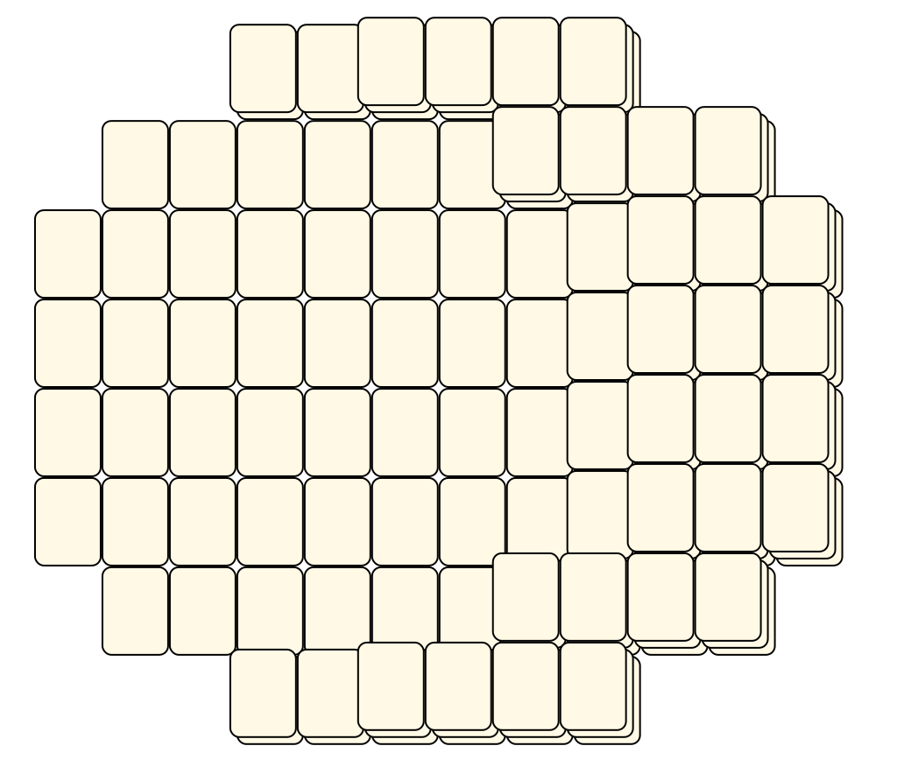
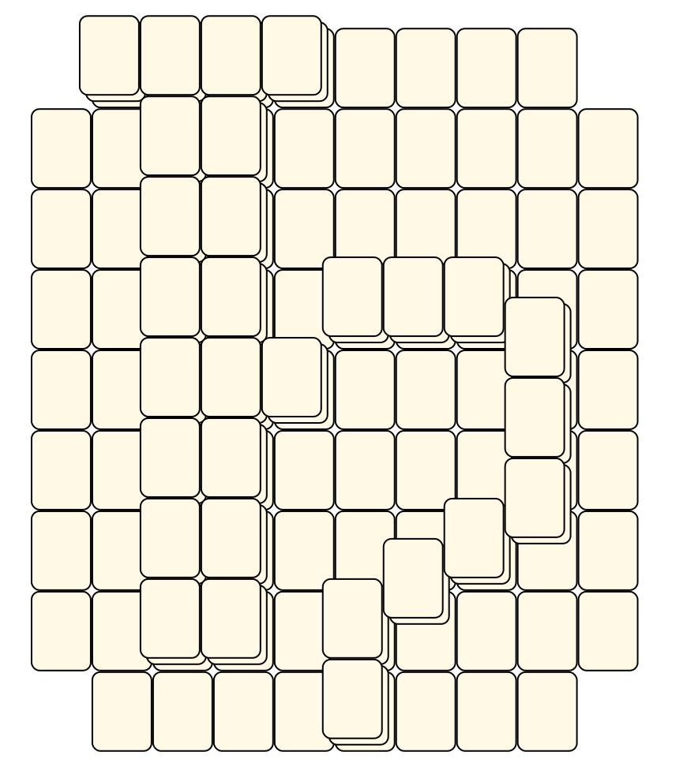
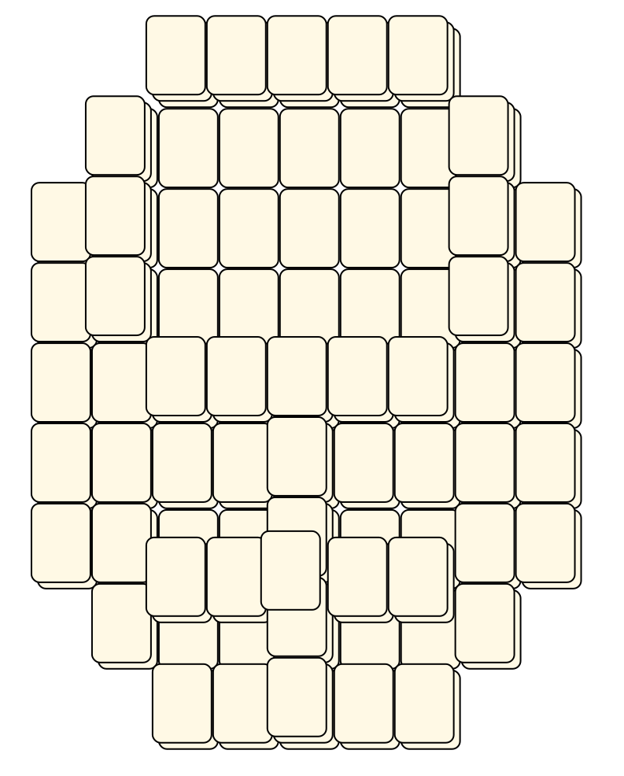

# Mahjong Solitaire Layout Museum: Astro
* Source: [https://web.archive.org/web/20120408030546/http://members.fortunecity.com/phantagia/layouts.htm](https://web.archive.org/web/20120408030546/http://members.fortunecity.com/phantagia/layouts.htm)

* File Source:  
<sub>```https://web.archive.org/web/20120408030904/http://members.fortunecity.com/phantagia/layouts/eplayouts.zip#eplayastro.zip```</sub>


|Astro||Layouts: 18|
|:--:|:--:|:--:|
|Center Of Sun<br><br> <sub>Ernie Polegato</sub> <br>[.lay](./center_of_sun_2.lay)  [.layout](./center_of_sun_2.layout)  [.mah](./center_of_sun_2.mah) |Earth<br><br> <sub>Ernie Polegato</sub> <br>[.lay](./earth_4.lay)  [.layout](./earth_4.layout)  [.mah](./earth_4.mah) |Earth 2<br><br> <sub>Ernie Polegato</sub> <br>[.lay](./earth_2_2.lay)  [.layout](./earth_2_2.layout)  [.mah](./earth_2_2.mah) |
|Earth 3<br><br> <sub>Ernie Polegato</sub> <br>[.lay](./earth_3_2.lay)  [.layout](./earth_3_2.layout)  [.mah](./earth_3_2.mah) |Jupiter<br><br> <sub>Ernie Polegato</sub> <br>[.lay](./jupiter_2.lay)  [.layout](./jupiter_2.layout)  [.mah](./jupiter_2.mah) |Mars<br><br> <sub>Ernie Polegato</sub> <br>[.lay](./mars_2.lay)  [.layout](./mars_2.layout)  [.mah](./mars_2.mah) |
|Mercury<br><br> <sub>Ernie Polegato</sub> <br>[.lay](./mercury_2.lay)  [.layout](./mercury_2.layout)  [.mah](./mercury_2.mah) |Moon<br><br> <sub>Ernie Polegato</sub> <br>[.lay](./moon_2.lay)  [.layout](./moon_2.layout)  [.mah](./moon_2.mah) |Neptune<br><br> <sub>Ernie Polegato</sub> <br>[.lay](./neptune_2.lay)  [.layout](./neptune_2.layout)  [.mah](./neptune_2.mah) |
|Pluto<br><br> <sub>Ernie Polegato</sub> <br>[.lay](./pluto_2.lay)  [.layout](./pluto_2.layout)  [.mah](./pluto_2.mah) |Revised Earth 2<br><br> <sub>Ernie Polegato</sub> <br>[.lay](./revised_earth_2_2.lay)  [.layout](./revised_earth_2_2.layout)  [.mah](./revised_earth_2_2.mah) |Revised Earth 3<br><br> <sub>Ernie Polegato</sub> <br>[.lay](./revised_earth_3_2.lay)  [.layout](./revised_earth_3_2.layout)  [.mah](./revised_earth_3_2.mah) |
|Revised Sun<br><br> <sub>Ernie Polegato</sub> <br>[.lay](./revised_sun_2.lay)  [.layout](./revised_sun_2.layout)  [.mah](./revised_sun_2.mah) |Saturn<br><br> <sub>Ernie Polegato</sub> <br>[.lay](./saturn_3.lay)  [.layout](./saturn_3.layout)  [.mah](./saturn_3.mah) |Sun<br><br> <sub>Ernie Polegato</sub> <br>[.lay](./sun_5.lay)  [.layout](./sun_5.layout)  [.mah](./sun_5.mah) |
|Uranus<br><br> <sub>Ernie Polegato</sub> <br>[.lay](./uranus_3.lay)  [.layout](./uranus_3.layout)  [.mah](./uranus_3.mah) |Uranus 2<br><br> <sub>Ernie Polegato</sub> <br>[.lay](./uranus_2_2.lay)  [.layout](./uranus_2_2.layout)  [.mah](./uranus_2_2.mah) |Venus<br><br> <sub>Ernie Polegato</sub> <br>[.lay](./venus_2.lay)  [.layout](./venus_2.layout)  [.mah](./venus_2.mah) |