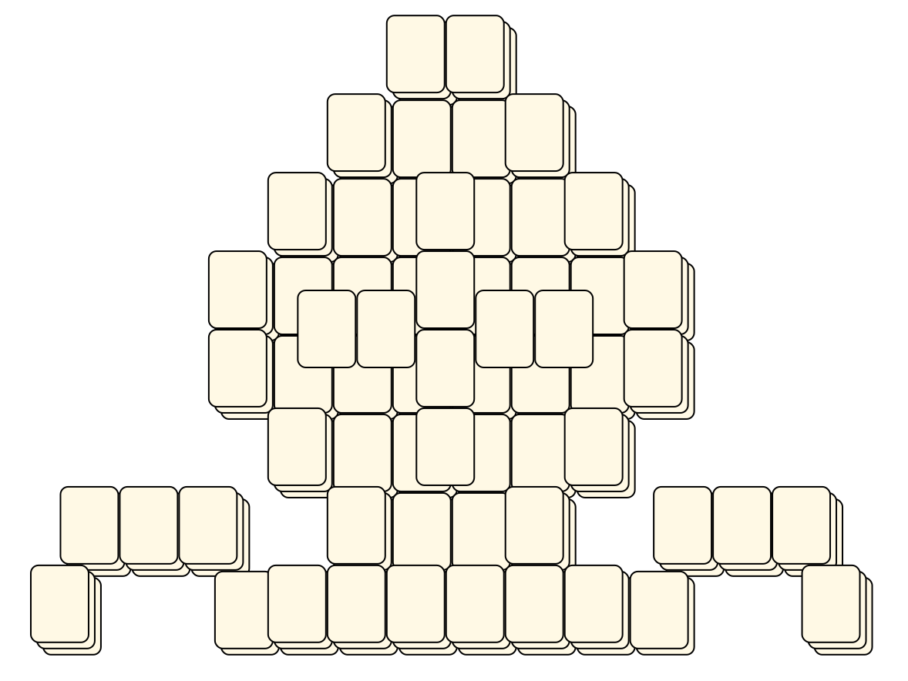
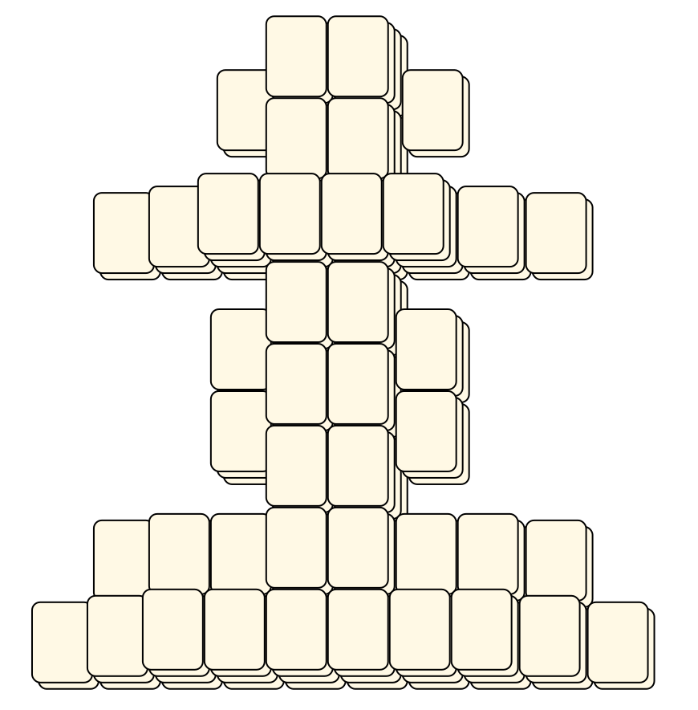

# Mahjong Solitaire Layout Museum: Chess
* Source: [https://web.archive.org/web/20120408030546/http://members.fortunecity.com/phantagia/layouts.htm](https://web.archive.org/web/20120408030546/http://members.fortunecity.com/phantagia/layouts.htm)

* File Source:  
<sub>```https://web.archive.org/web/20120408030904/http://members.fortunecity.com/phantagia/layouts/eplayouts.zip#eplaychess.zip```</sub>


|Chess||Layouts: 7|
|:--:|:--:|:--:|
|Bishop<br><br> <sub>Ernie Polegato</sub> <br>[.lay](./bishop_2.lay)  [.layout](./bishop_2.layout)  [.mah](./bishop_2.mah) |King<br><br> <sub>Ernie Polegato</sub> <br>[.lay](./king_2.lay)  [.layout](./king_2.layout)  [.mah](./king_2.mah) |Knight<br><br> <sub>Ernie Polegato</sub> <br>[.lay](./knight_3.lay)  [.layout](./knight_3.layout)  [.mah](./knight_3.mah) |
|Pawn<br><br> <sub>Ernie Polegato</sub> <br>[.lay](./pawn_3.lay)  [.layout](./pawn_3.layout)  [.mah](./pawn_3.mah) |Pawn 2<br><br> <sub>Ernie Polegato</sub> <br>[.lay](./pawn_2_2.lay)  [.layout](./pawn_2_2.layout)  [.mah](./pawn_2_2.mah) |Queen<br><br> <sub>Ernie Polegato</sub> <br>[.lay](./queen_2.lay)  [.layout](./queen_2.layout)  [.mah](./queen_2.mah) |
|Rook<br><br> <sub>Ernie Polegato</sub> <br>[.lay](./rook_2.lay)  [.layout](./rook_2.layout)  [.mah](./rook_2.mah) |||