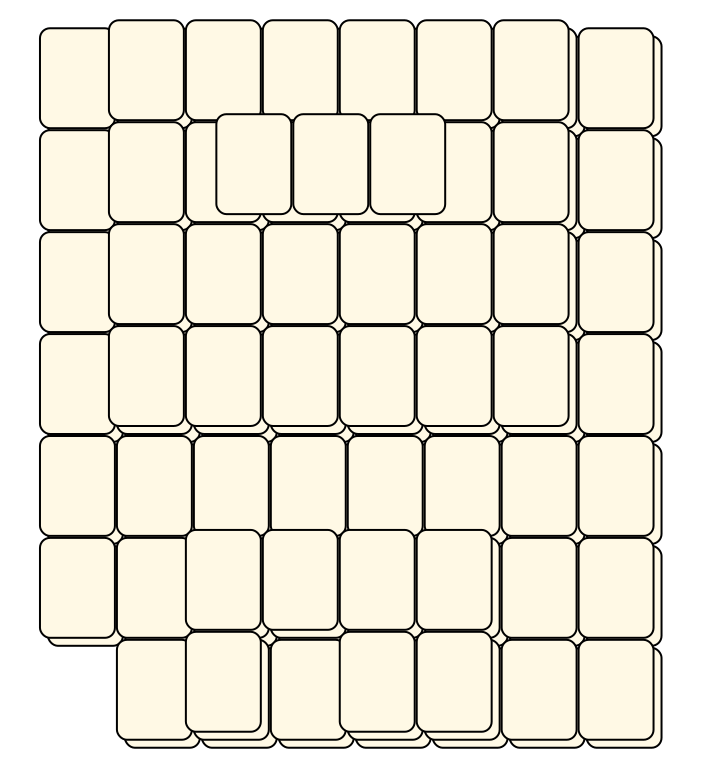
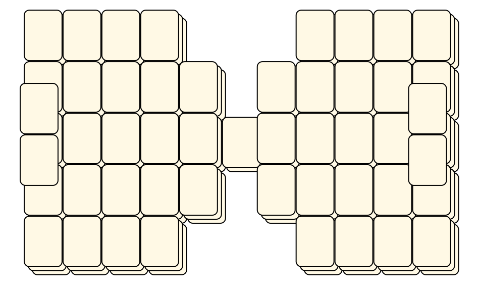
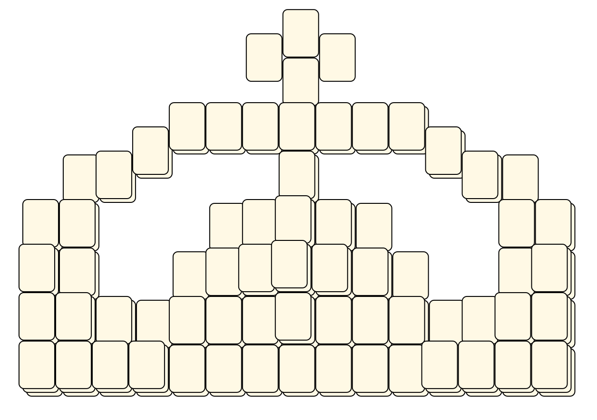
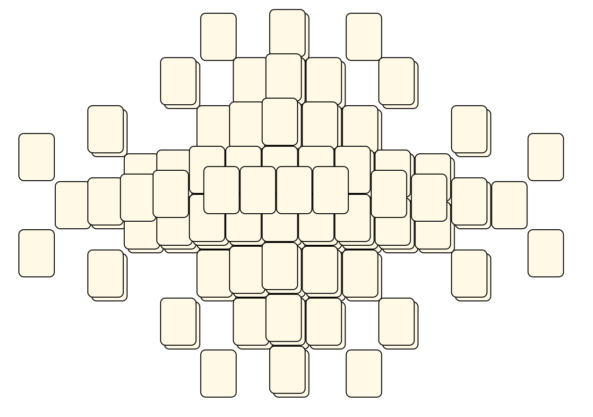
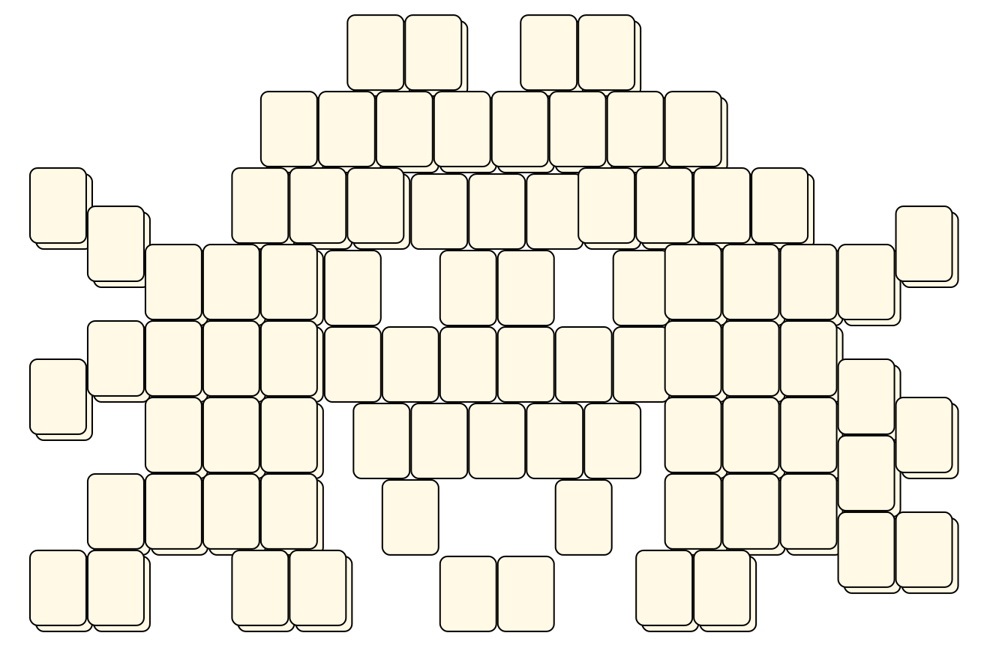

# Mahjong Solitaire Layout Museum: Package 01
* Source: [https://web.archive.org/web/20120408030546/http://members.fortunecity.com/phantagia/layouts.htm](https://web.archive.org/web/20120408030546/http://members.fortunecity.com/phantagia/layouts.htm)

* File Source:  
<sub>```https://web.archive.org/web/20120408030904/http://members.fortunecity.com/phantagia/layouts/eplayouts.zip#eplayout01.zip```</sub>


|Package 01||Layouts: 40|
|:--:|:--:|:--:|
|3 1/2 Disk<br><br> <sub>Ernie Polegato</sub> <br>[.lay](./3_1_2_disk_2.lay)  [.layout](./3_1_2_disk_2.layout)  [.mah](./3_1_2_disk_2.mah) |5 1/2 Disk<br><br> <sub>Ernie Polegato</sub> <br>[.lay](./5_1_2_disk_2.lay)  [.layout](./5_1_2_disk_2.layout)  [.mah](./5_1_2_disk_2.mah) |Abstract<br><br> <sub>Ernie Polegato</sub> <br>[.lay](./abstract_3.lay)  [.layout](./abstract_3.layout)  [.mah](./abstract_3.mah) |
|Abstract 2<br><br> <sub>Ernie Polegato</sub> <br>[.lay](./abstract_2_2.lay)  [.layout](./abstract_2_2.layout)  [.mah](./abstract_2_2.mah) |Anchor<br><br> <sub>Ernie Polegato</sub> <br>[.lay](./anchor_2.lay)  [.layout](./anchor_2.layout)  [.mah](./anchor_2.mah) |Blocks<br><br> <sub>Ernie Polegato</sub> <br>[.lay](./blocks_3.lay)  [.layout](./blocks_3.layout)  [.mah](./blocks_3.mah) |
|Blocks 2<br><br> <sub>Ernie Polegato</sub> <br>[.lay](./blocks_2_2.lay)  [.layout](./blocks_2_2.layout)  [.mah](./blocks_2_2.mah) |Bow Tie<br><br> <sub>Ernie Polegato</sub> <br>[.lay](./bow_tie_3.lay)  [.layout](./bow_tie_3.layout)  [.mah](./bow_tie_3.mah) |Bow Tie 2<br><br> <sub>Ernie Polegato</sub> <br>[.lay](./bow_tie_2_2.lay)  [.layout](./bow_tie_2_2.layout)  [.mah](./bow_tie_2_2.mah) |
|Bowl<br><br> <sub>Ernie Polegato</sub> <br>[.lay](./bowl_2.lay)  [.layout](./bowl_2.layout)  [.mah](./bowl_2.mah) |Bridge<br><br> <sub>Ernie Polegato</sub> <br>[.lay](./bridge_4.lay)  [.layout](./bridge_4.layout)  [.mah](./bridge_4.mah) |Car<br><br> <sub>Ernie Polegato</sub> <br>[.lay](./car_2.lay)  [.layout](./car_2.layout)  [.mah](./car_2.mah) |
|Columns<br><br> <sub>Ernie Polegato</sub> <br>[.lay](./columns_4.lay)  [.layout](./columns_4.layout)  [.mah](./columns_4.mah) |Cross<br><br> <sub>Ernie Polegato</sub> <br>[.lay](./cross_9.lay)  [.layout](./cross_9.layout)  [.mah](./cross_9.mah) |Crown<br><br> <sub>Ernie Polegato</sub> <br>[.lay](./crown_4.lay)  [.layout](./crown_4.layout)  [.mah](./crown_4.mah) |
|Draco<br><br> <sub>Ernie Polegato</sub> <br>[.lay](./draco_2.lay)  [.layout](./draco_2.layout)  [.mah](./draco_2.mah) |Flower<br><br> <sub>Ernie Polegato</sub> <br>[.lay](./flower_2.lay)  [.layout](./flower_2.layout)  [.mah](./flower_2.mah) |Gong<br><br> <sub>Ernie Polegato</sub> <br>[.lay](./gong_2.lay)  [.layout](./gong_2.layout)  [.mah](./gong_2.mah) |
|Inca Temple<br><br> <sub>Ernie Polegato</sub> <br>[.lay](./inca_temple_2.lay)  [.layout](./inca_temple_2.layout)  [.mah](./inca_temple_2.mah) |Infinity<br><br> <sub>Ernie Polegato</sub> <br>[.lay](./infinity_2.lay)  [.layout](./infinity_2.layout)  [.mah](./infinity_2.mah) |Knight 2<br><br> <sub>Ernie Polegato</sub> <br>[.lay](./knight_2_2.lay)  [.layout](./knight_2_2.layout)  [.mah](./knight_2_2.mah) |
|Moraff Based 1<br><br> <sub>Ernie Polegato</sub> <br>[.lay](./moraff_based_1_2.lay)  [.layout](./moraff_based_1_2.layout)  [.mah](./moraff_based_1_2.mah) |Moraff Based 2<br><br> <sub>Ernie Polegato</sub> <br>[.lay](./moraff_based_2_2.lay)  [.layout](./moraff_based_2_2.layout)  [.mah](./moraff_based_2_2.mah) |Moraff Based 3<br><br> <sub>Ernie Polegato</sub> <br>[.lay](./moraff_based_3_2.lay)  [.layout](./moraff_based_3_2.layout)  [.mah](./moraff_based_3_2.mah) |
|Oval<br><br> <sub>Ernie Polegato</sub> <br>[.lay](./oval_2.lay)  [.layout](./oval_2.layout)  [.mah](./oval_2.mah) |Palanquin<br><br> <sub>Ernie Polegato</sub> <br>[.lay](./palanquin_2.lay)  [.layout](./palanquin_2.layout)  [.mah](./palanquin_2.mah) |Pyramid 2<br><br> <sub>Ernie Polegato</sub> <br>[.lay](./pyramid_2_5.lay)  [.layout](./pyramid_2_5.layout)  [.mah](./pyramid_2_5.mah) |
|Scarab<br><br> <sub>Ernie Polegato</sub> <br>[.lay](./scarab_2.lay)  [.layout](./scarab_2.layout)  [.mah](./scarab_2.mah) |Shield<br><br> <sub>Ernie Polegato</sub> <br>[.lay](./shield_4.lay)  [.layout](./shield_4.layout)  [.mah](./shield_4.mah) |Stain Glass Window<br><br> <sub>Ernie Polegato</sub> <br>[.lay](./stain_glass_window_2.lay)  [.layout](./stain_glass_window_2.layout)  [.mah](./stain_glass_window_2.mah) |
|Star<br><br> <sub>Ernie Polegato</sub> <br>[.lay](./star_4.lay)  [.layout](./star_4.layout)  [.mah](./star_4.mah) |Star 2<br><br> <sub>Ernie Polegato</sub> <br>[.lay](./star_2_3.lay)  [.layout](./star_2_3.layout)  [.mah](./star_2_3.mah) |Statue<br><br> <sub>Ernie Polegato</sub> <br>[.lay](./statue_2.lay)  [.layout](./statue_2.layout)  [.mah](./statue_2.mah) |
|Sun<br><br> <sub>Ernie Polegato</sub> <br>[.lay](./sun_4.lay)  [.layout](./sun_4.layout)  [.mah](./sun_4.mah) |Sun 2<br><br> <sub>Ernie Polegato</sub> <br>[.lay](./sun_2_2.lay)  [.layout](./sun_2_2.layout)  [.mah](./sun_2_2.mah) |Switch<br><br> <sub>Ernie Polegato</sub> <br>[.lay](./switch_2.lay)  [.layout](./switch_2.layout)  [.mah](./switch_2.mah) |
|Temple 2<br><br> <sub>Ernie Polegato</sub> <br>[.lay](./temple_2_5.lay)  [.layout](./temple_2_5.layout)  [.mah](./temple_2_5.mah) |Truck<br><br> <sub>Ernie Polegato</sub> <br>[.lay](./truck_2.lay)  [.layout](./truck_2.layout)  [.mah](./truck_2.mah) |TV And Stand<br><br> <sub>Ernie Polegato</sub> <br>[.lay](./tv_and_stand_2.lay)  [.layout](./tv_and_stand_2.layout)  [.mah](./tv_and_stand_2.mah) |
|Woman<br><br> <sub>Ernie Polegato</sub> <br>[.lay](./woman_2.lay)  [.layout](./woman_2.layout)  [.mah](./woman_2.mah) |||