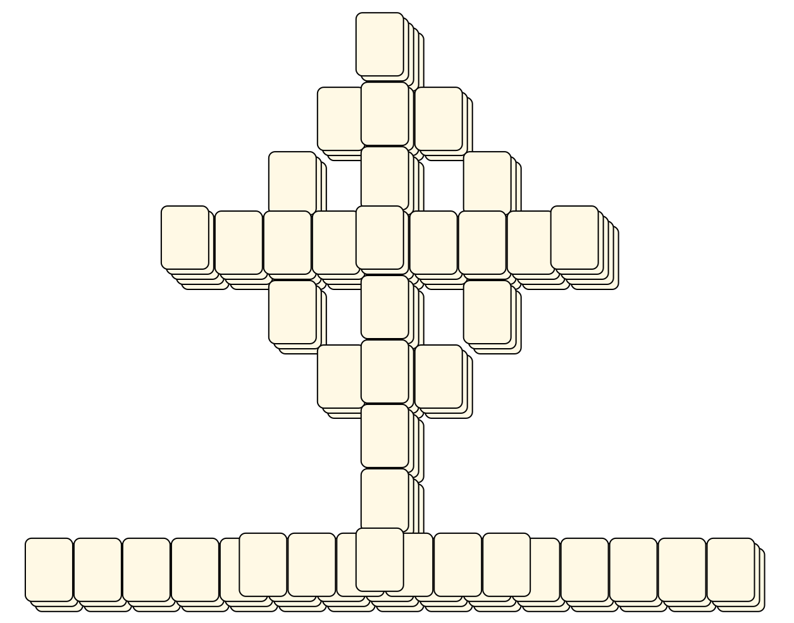
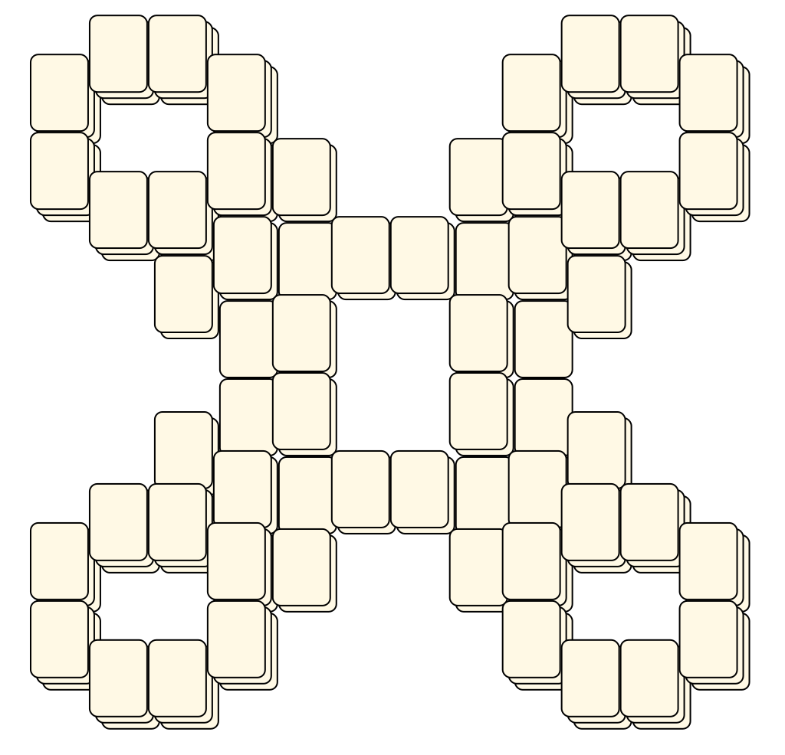
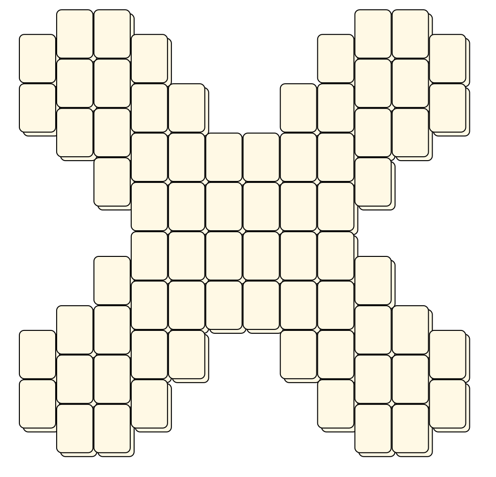

# Mahjong Solitaire Layout Museum: Package 02
* Source: [https://web.archive.org/web/20120408030546/http://members.fortunecity.com/phantagia/layouts.htm](https://web.archive.org/web/20120408030546/http://members.fortunecity.com/phantagia/layouts.htm)

* File Source:  
<sub>```https://web.archive.org/web/20120408030904/http://members.fortunecity.com/phantagia/layouts/eplayouts.zip#eplayout02.zip```</sub>


|Package 02||Layouts: 11|
|:--:|:--:|:--:|
|Celtic Cross<br><br> <sub>Ernie Polegato</sub> <br>[.lay](./celtic_cross.lay)  [.layout](./celtic_cross.layout)  [.mah](./celtic_cross.mah) |Cluster<br><br> <sub>Ernie Polegato</sub> <br>[.lay](./cluster.lay)  [.layout](./cluster.layout)  [.mah](./cluster.mah) |Cluster 2<br><br> <sub>Ernie Polegato</sub> <br>[.lay](./cluster_2.lay)  [.layout](./cluster_2.layout)  [.mah](./cluster_2.mah) |
|Fortress<br><br> <sub>Ernie Polegato</sub> <br>[.lay](./fortress_3.lay)  [.layout](./fortress_3.layout)  [.mah](./fortress_3.mah) |Grate<br><br> <sub>Ernie Polegato</sub> <br>[.lay](./grate.lay)  [.layout](./grate.layout)  [.mah](./grate.mah) |Grate 2<br><br> <sub>Ernie Polegato</sub> <br>[.lay](./grate_2.lay)  [.layout](./grate_2.layout)  [.mah](./grate_2.mah) |
|Symbol<br><br> <sub>Ernie Polegato</sub> <br>[.lay](./symbol.lay)  [.layout](./symbol.layout)  [.mah](./symbol.mah) |Symbol 2<br><br> <sub>Ernie Polegato</sub> <br>[.lay](./symbol_2.lay)  [.layout](./symbol_2.layout)  [.mah](./symbol_2.mah) |Symbol 3<br><br> <sub>Ernie Polegato</sub> <br>[.lay](./symbol_3.lay)  [.layout](./symbol_3.layout)  [.mah](./symbol_3.mah) |
|Symbol 4<br><br> <sub>Ernie Polegato</sub> <br>[.lay](./symbol_4.lay)  [.layout](./symbol_4.layout)  [.mah](./symbol_4.mah) |Tombstone<br><br> <sub>Ernie Polegato</sub> <br>[.lay](./tombstone.lay)  [.layout](./tombstone.layout)  [.mah](./tombstone.mah) ||