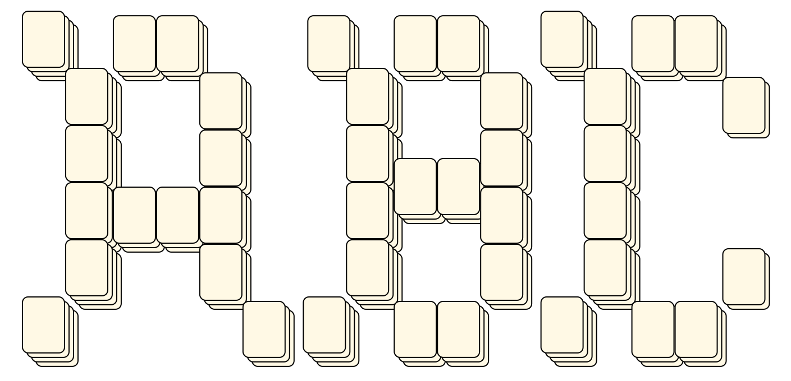
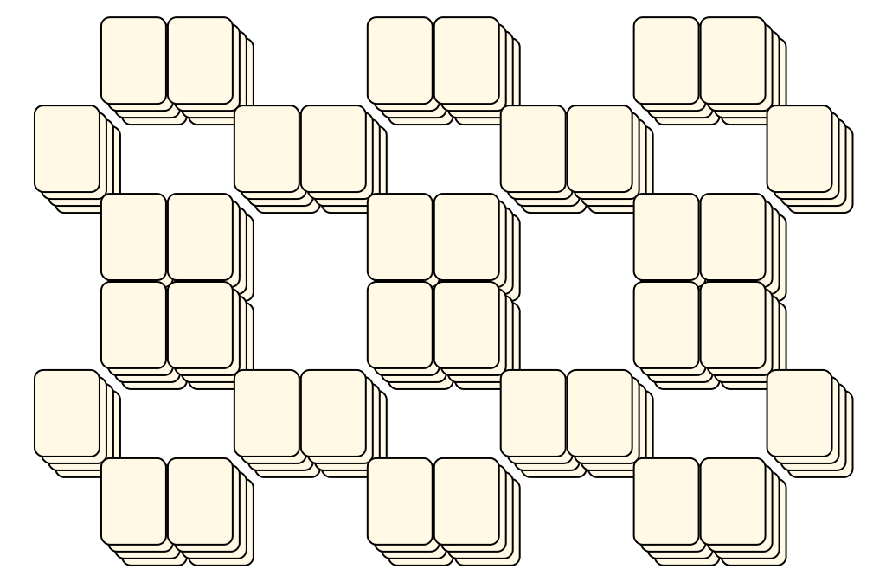
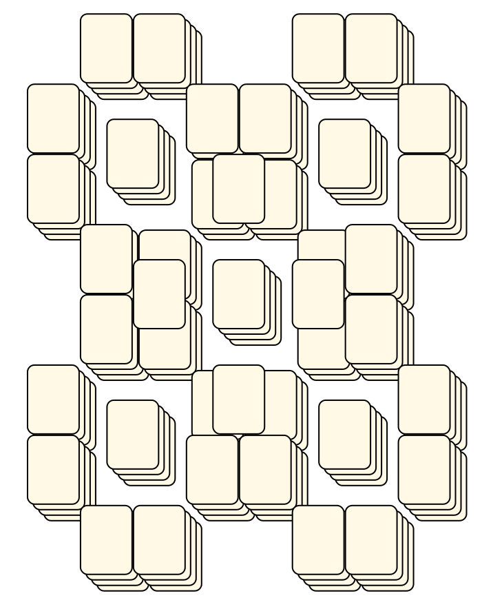
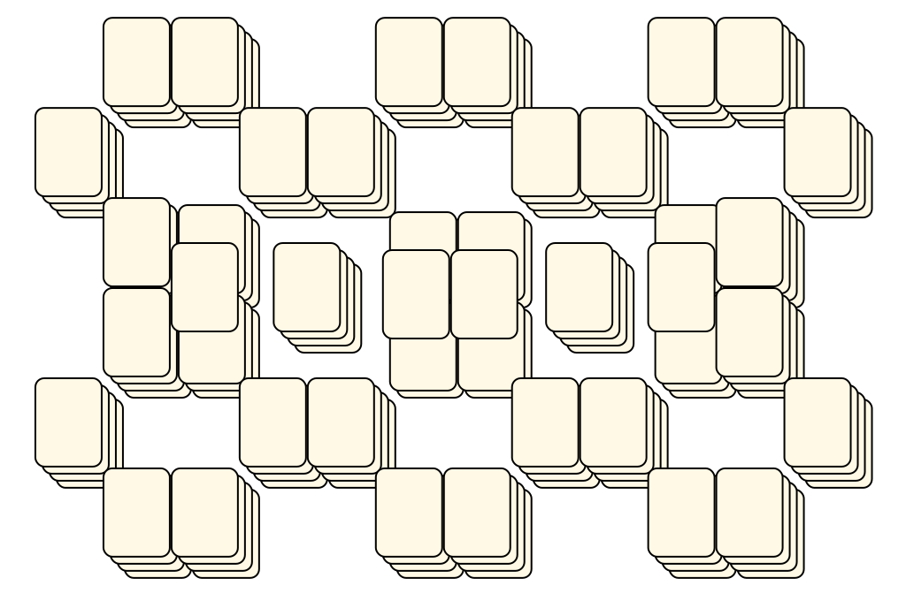
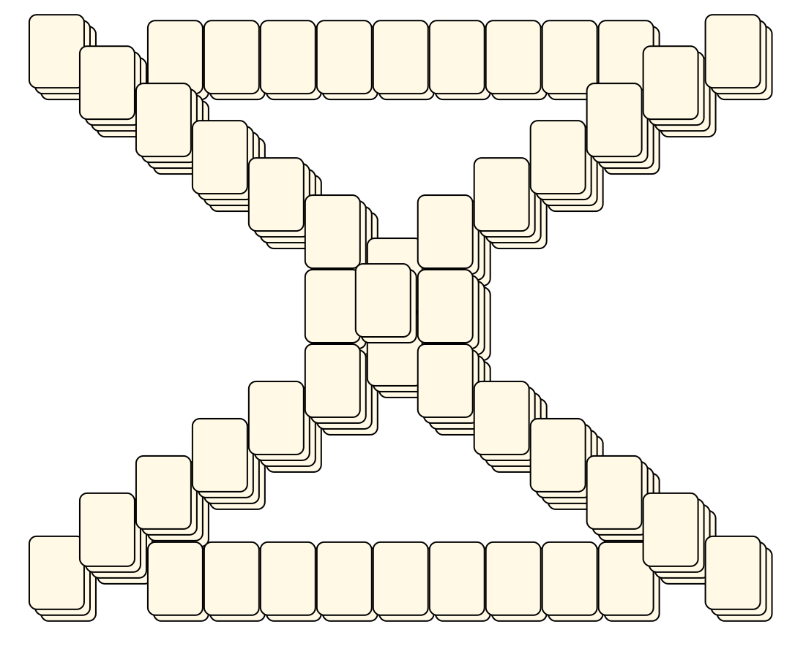

# Mahjong Solitaire Layout Museum: Package 03
* Source: [https://web.archive.org/web/20120408030546/http://members.fortunecity.com/phantagia/layouts.htm](https://web.archive.org/web/20120408030546/http://members.fortunecity.com/phantagia/layouts.htm)

* File Source:  
<sub>```https://web.archive.org/web/20120408030904/http://members.fortunecity.com/phantagia/layouts/eplayouts.zip#eplayout03.zip```</sub>


|Package 03||Layouts: 12|
|:--:|:--:|:--:|
|ABCs<br><br> <sub>Ernie Polegato</sub> <br>[.lay](./abcs.lay)  [.layout](./abcs.layout)  [.mah](./abcs.mah) |Castle<br><br> <sub>Ernie Polegato</sub> <br>[.lay](./castle_5.lay)  [.layout](./castle_5.layout)  [.mah](./castle_5.mah) |Mesh<br><br> <sub>Ernie Polegato</sub> <br>[.lay](./mesh_5.lay)  [.layout](./mesh_5.layout)  [.mah](./mesh_5.mah) |
|Mesh 2<br><br> <sub>Ernie Polegato</sub> <br>[.lay](./mesh_2_2.lay)  [.layout](./mesh_2_2.layout)  [.mah](./mesh_2_2.mah) |Mesh 3<br><br> <sub>Ernie Polegato</sub> <br>[.lay](./mesh_3.lay)  [.layout](./mesh_3.layout)  [.mah](./mesh_3.mah) |Mesh 4<br><br> <sub>Ernie Polegato</sub> <br>[.lay](./mesh_4.lay)  [.layout](./mesh_4.layout)  [.mah](./mesh_4.mah) |
|Nut<br><br> <sub>Ernie Polegato</sub> <br>[.lay](./nut.lay)  [.layout](./nut.layout)  [.mah](./nut.mah) |Pattern<br><br> <sub>Ernie Polegato</sub> <br>[.lay](./pattern_3.lay)  [.layout](./pattern_3.layout)  [.mah](./pattern_3.mah) |Pattern 2<br><br> <sub>Ernie Polegato</sub> <br>[.lay](./pattern_2_2.lay)  [.layout](./pattern_2_2.layout)  [.mah](./pattern_2_2.mah) |
|Volcano<br><br> <sub>Ernie Polegato</sub> <br>[.lay](./volcano_2.lay)  [.layout](./volcano_2.layout)  [.mah](./volcano_2.mah) |X<br><br> <sub>Ernie Polegato</sub> <br>[.lay](./x.lay)  [.layout](./x.layout)  [.mah](./x.mah) |X2<br><br> <sub>Ernie Polegato</sub> <br>[.lay](./x2.lay)  [.layout](./x2.layout)  [.mah](./x2.mah) |