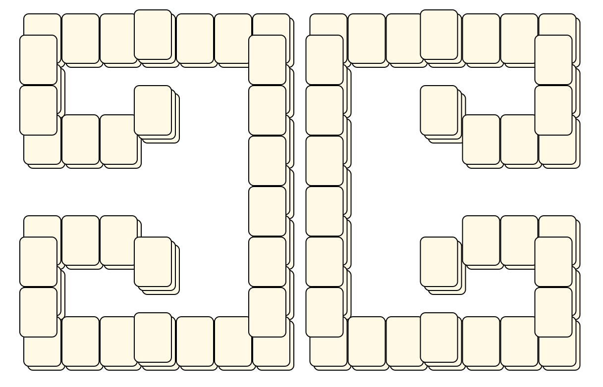

# Mahjong Solitaire Layout Museum: Package 04
* Source: [https://web.archive.org/web/20120408030546/http://members.fortunecity.com/phantagia/layouts.htm](https://web.archive.org/web/20120408030546/http://members.fortunecity.com/phantagia/layouts.htm)

* File Source:  
<sub>```https://web.archive.org/web/20120408030904/http://members.fortunecity.com/phantagia/layouts/eplayouts.zip#eplayout04.zip```</sub>


|Package 04||Layouts: 19|
|:--:|:--:|:--:|
|Bird<br><br> <sub>Ernie Polegato</sub> <br>[.lay](./bird.lay)  [.layout](./bird.layout)  [.mah](./bird.mah) |Block<br><br> <sub>Ernie Polegato</sub> <br>[.lay](./block_2.lay)  [.layout](./block_2.layout)  [.mah](./block_2.mah) |Coffin<br><br> <sub>Ernie Polegato</sub> <br>[.lay](./coffin.lay)  [.layout](./coffin.layout)  [.mah](./coffin.mah) |
|Cross 2<br><br> <sub>Ernie Polegato</sub> <br>[.lay](./cross_2_2.lay)  [.layout](./cross_2_2.layout)  [.mah](./cross_2_2.mah) |Design<br><br> <sub>Ernie Polegato</sub> <br>[.lay](./design.lay)  [.layout](./design.layout)  [.mah](./design.mah) |Design 10<br><br> <sub>Ernie Polegato</sub> <br>[.lay](./design_10.lay)  [.layout](./design_10.layout)  [.mah](./design_10.mah) |
|Design 11<br><br> <sub>Ernie Polegato</sub> <br>[.lay](./design_11.lay)  [.layout](./design_11.layout)  [.mah](./design_11.mah) |Design 12<br><br> <sub>Ernie Polegato</sub> <br>[.lay](./design_12.lay)  [.layout](./design_12.layout)  [.mah](./design_12.mah) |Design 2<br><br> <sub>Ernie Polegato</sub> <br>[.lay](./design_2.lay)  [.layout](./design_2.layout)  [.mah](./design_2.mah) |
|Design 3<br><br> <sub>Ernie Polegato</sub> <br>[.lay](./design_3.lay)  [.layout](./design_3.layout)  [.mah](./design_3.mah) |Design 4<br><br> <sub>Ernie Polegato</sub> <br>[.lay](./design_4.lay)  [.layout](./design_4.layout)  [.mah](./design_4.mah) |Design 5<br><br> <sub>Ernie Polegato</sub> <br>[.lay](./design_5.lay)  [.layout](./design_5.layout)  [.mah](./design_5.mah) |
|Design 6<br><br> <sub>Ernie Polegato</sub> <br>[.lay](./design_6.lay)  [.layout](./design_6.layout)  [.mah](./design_6.mah) |Design 7<br><br> <sub>Ernie Polegato</sub> <br>[.lay](./design_7.lay)  [.layout](./design_7.layout)  [.mah](./design_7.mah) |Design 8<br><br> <sub>Ernie Polegato</sub> <br>[.lay](./design_8.lay)  [.layout](./design_8.layout)  [.mah](./design_8.mah) |
|Design 9<br><br> <sub>Ernie Polegato</sub> <br>[.lay](./design_9.lay)  [.layout](./design_9.layout)  [.mah](./design_9.mah) |Eyeball<br><br> <sub>Ernie Polegato</sub> <br>[.lay](./eyeball.lay)  [.layout](./eyeball.layout)  [.mah](./eyeball.mah) |Gift<br><br> <sub>Ernie Polegato</sub> <br>[.lay](./gift.lay)  [.layout](./gift.layout)  [.mah](./gift.mah) |
|Joined Rings<br><br> <sub>Ernie Polegato</sub> <br>[.lay](./joined_rings.lay)  [.layout](./joined_rings.layout)  [.mah](./joined_rings.mah) |||