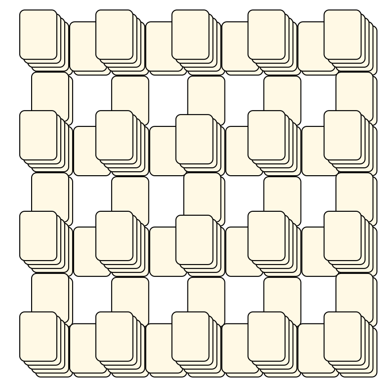
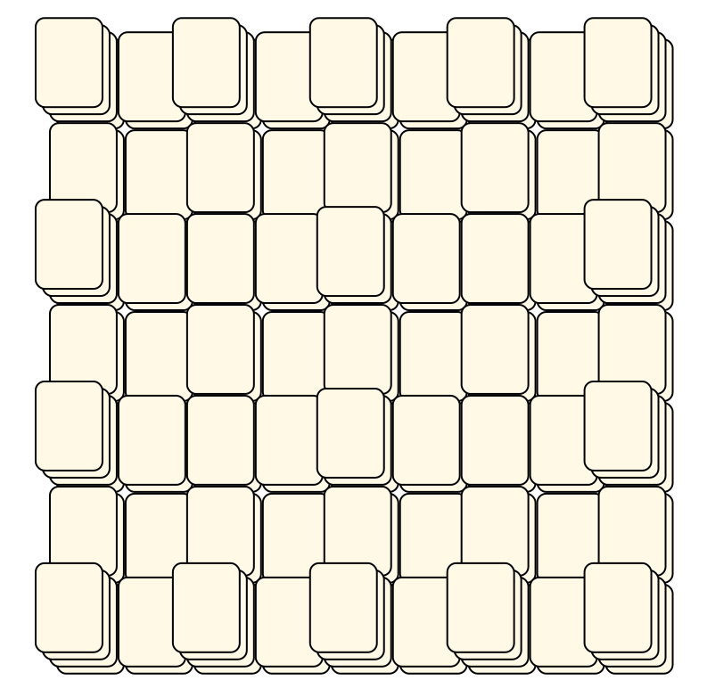
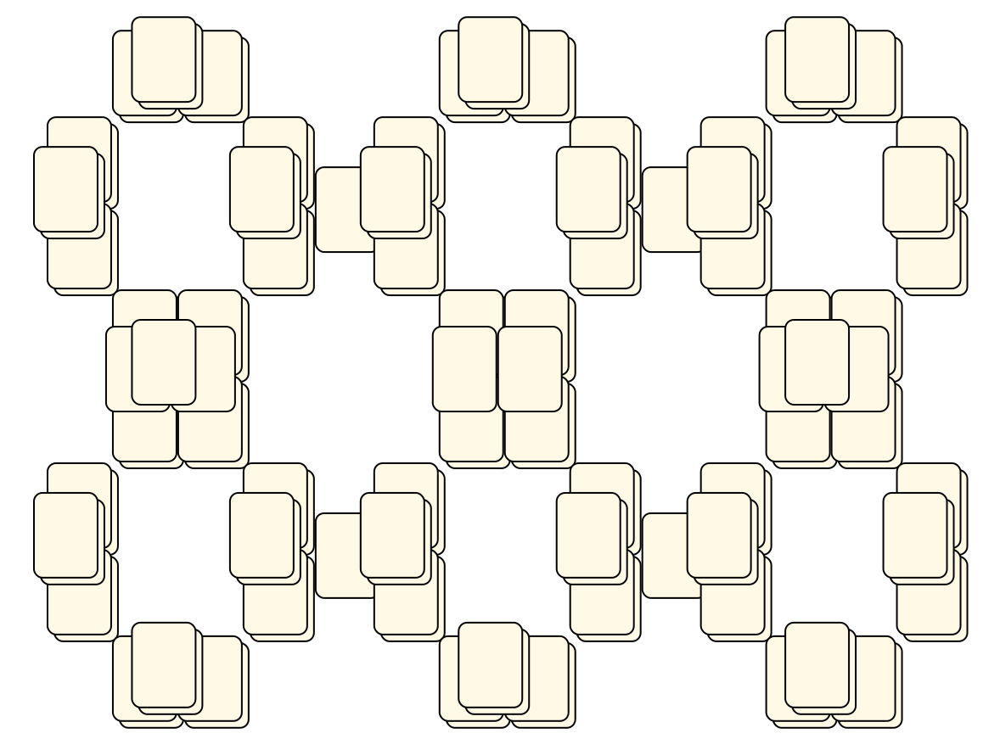
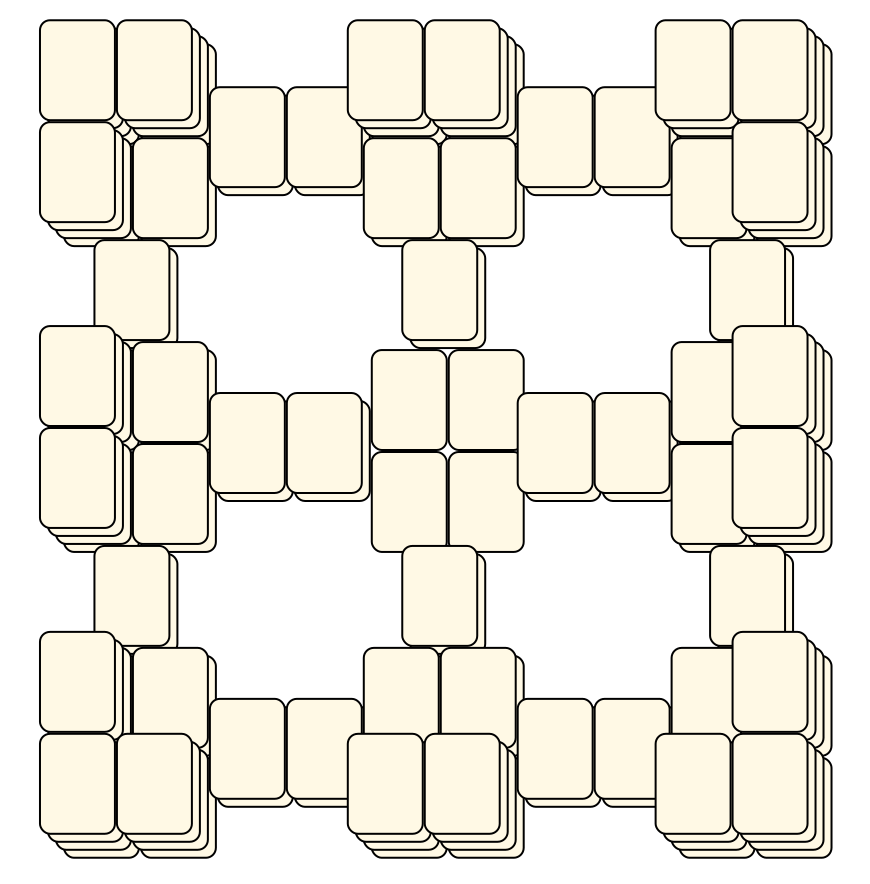
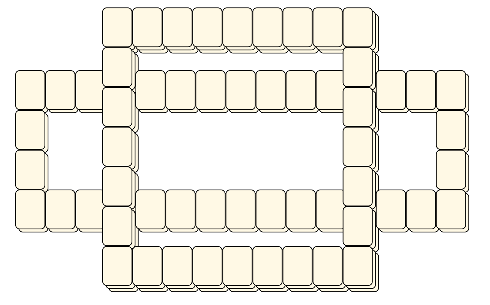

# Mahjong Solitaire Layout Museum: Package 06
* Source: [https://web.archive.org/web/20120408030546/http://members.fortunecity.com/phantagia/layouts.htm](https://web.archive.org/web/20120408030546/http://members.fortunecity.com/phantagia/layouts.htm)

* File Source:  
<sub>```https://web.archive.org/web/20120408030904/http://members.fortunecity.com/phantagia/layouts/eplayouts.zip#eplayout06.zip```</sub>


|Package 06||Layouts: 20|
|:--:|:--:|:--:|
|Layout 11<br><br> <sub>Ernie Polegato</sub> <br>[.lay](./layout_11.lay)  [.layout](./layout_11.layout)  [.mah](./layout_11.mah) |Layout 12<br><br> <sub>Ernie Polegato</sub> <br>[.lay](./layout_12.lay)  [.layout](./layout_12.layout)  [.mah](./layout_12.mah) |Layout 12B<br><br> <sub>Ernie Polegato</sub> <br>[.lay](./layout_12b.lay)  [.layout](./layout_12b.layout)  [.mah](./layout_12b.mah) |
|Layout 13<br><br> <sub>Ernie Polegato</sub> <br>[.lay](./layout_13.lay)  [.layout](./layout_13.layout)  [.mah](./layout_13.mah) |Layout 13B<br><br> <sub>Ernie Polegato</sub> <br>[.lay](./layout_13b.lay)  [.layout](./layout_13b.layout)  [.mah](./layout_13b.mah) |Layout 13C<br><br> <sub>Ernie Polegato</sub> <br>[.lay](./layout_13c.lay)  [.layout](./layout_13c.layout)  [.mah](./layout_13c.mah) |
|Layout 14<br><br> <sub>Ernie Polegato</sub> <br>[.lay](./layout_14.lay)  [.layout](./layout_14.layout)  [.mah](./layout_14.mah) |Layout 14B<br><br> <sub>Ernie Polegato</sub> <br>[.lay](./layout_14b.lay)  [.layout](./layout_14b.layout)  [.mah](./layout_14b.mah) |Layout 15<br><br> <sub>Ernie Polegato</sub> <br>[.lay](./layout_15.lay)  [.layout](./layout_15.layout)  [.mah](./layout_15.mah) |
|Layout 16<br><br> <sub>Ernie Polegato</sub> <br>[.lay](./layout_16.lay)  [.layout](./layout_16.layout)  [.mah](./layout_16.mah) |Layout 17<br><br> <sub>Ernie Polegato</sub> <br>[.lay](./layout_17.lay)  [.layout](./layout_17.layout)  [.mah](./layout_17.mah) |Layout 18<br><br> <sub>Ernie Polegato</sub> <br>[.lay](./layout_18.lay)  [.layout](./layout_18.layout)  [.mah](./layout_18.mah) |
|Layout 19<br><br> <sub>Ernie Polegato</sub> <br>[.lay](./layout_19.lay)  [.layout](./layout_19.layout)  [.mah](./layout_19.mah) |Layout 19B<br><br> <sub>Ernie Polegato</sub> <br>[.lay](./layout_19b.lay)  [.layout](./layout_19b.layout)  [.mah](./layout_19b.mah) |Layout 19C<br><br> <sub>Ernie Polegato</sub> <br>[.lay](./layout_19c.lay)  [.layout](./layout_19c.layout)  [.mah](./layout_19c.mah) |
|Layout 20<br><br> <sub>Ernie Polegato</sub> <br>[.lay](./layout_20.lay)  [.layout](./layout_20.layout)  [.mah](./layout_20.mah) |Layout 20B<br><br> <sub>Ernie Polegato</sub> <br>[.lay](./layout_20b.lay)  [.layout](./layout_20b.layout)  [.mah](./layout_20b.mah) |Layout 21<br><br> <sub>Ernie Polegato</sub> <br>[.lay](./layout_21.lay)  [.layout](./layout_21.layout)  [.mah](./layout_21.mah) |
|Layout 21B<br><br> <sub>Ernie Polegato</sub> <br>[.lay](./layout_21b.lay)  [.layout](./layout_21b.layout)  [.mah](./layout_21b.mah) |Layout 21C<br><br> <sub>Ernie Polegato</sub> <br>[.lay](./layout_21c.lay)  [.layout](./layout_21c.layout)  [.mah](./layout_21c.mah) ||