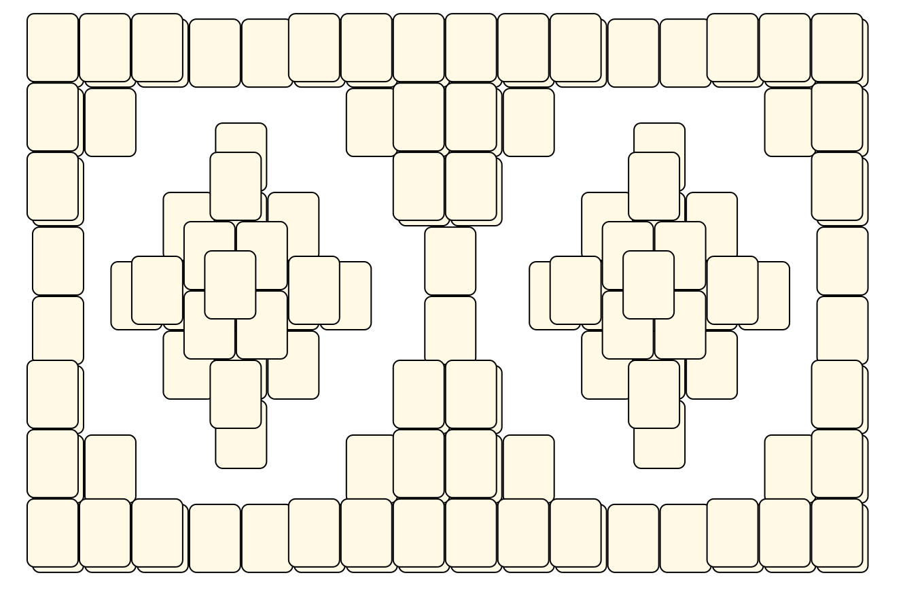
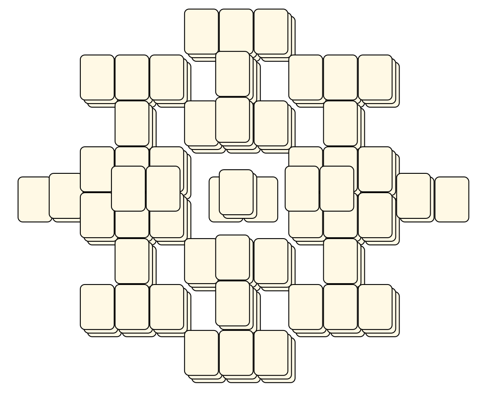

# Mahjong Solitaire Layout Museum: Package 08
* Source: [https://web.archive.org/web/20120408030546/http://members.fortunecity.com/phantagia/layouts.htm](https://web.archive.org/web/20120408030546/http://members.fortunecity.com/phantagia/layouts.htm)

* File Source:  
<sub>```https://web.archive.org/web/20120408030904/http://members.fortunecity.com/phantagia/layouts/eplayouts.zip#eplayout08.zip```</sub>


|Package 08||Layouts: 10|
|:--:|:--:|:--:|
|NL<br><br> <sub>Ernie Polegato</sub> <br>[.lay](./nl.lay)  [.layout](./nl.layout)  [.mah](./nl.mah) |NL10<br><br> <sub>Ernie Polegato</sub> <br>[.lay](./nl10.lay)  [.layout](./nl10.layout)  [.mah](./nl10.mah) |NL2<br><br> <sub>Ernie Polegato</sub> <br>[.lay](./nl2.lay)  [.layout](./nl2.layout)  [.mah](./nl2.mah) |
|NL3<br><br> <sub>Ernie Polegato</sub> <br>[.lay](./nl3.lay)  [.layout](./nl3.layout)  [.mah](./nl3.mah) |NL4<br><br> <sub>Ernie Polegato</sub> <br>[.lay](./nl4.lay)  [.layout](./nl4.layout)  [.mah](./nl4.mah) |NL5<br><br> <sub>Ernie Polegato</sub> <br>[.lay](./nl5.lay)  [.layout](./nl5.layout)  [.mah](./nl5.mah) |
|NL6<br><br> <sub>Ernie Polegato</sub> <br>[.lay](./nl6.lay)  [.layout](./nl6.layout)  [.mah](./nl6.mah) |NL7<br><br> <sub>Ernie Polegato</sub> <br>[.lay](./nl7.lay)  [.layout](./nl7.layout)  [.mah](./nl7.mah) |NL8<br><br> <sub>Ernie Polegato</sub> <br>[.lay](./nl8.lay)  [.layout](./nl8.layout)  [.mah](./nl8.mah) |
|NL9<br><br> <sub>Ernie Polegato</sub> <br>[.lay](./nl9.lay)  [.layout](./nl9.layout)  [.mah](./nl9.mah) |||